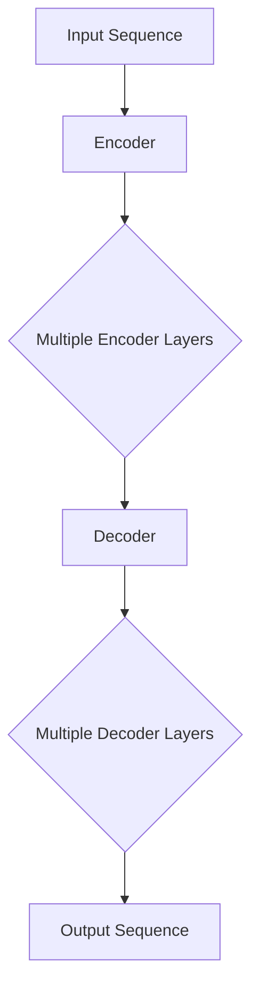

                 

### 背景介绍

在深度学习领域，神经网络作为核心工具已经极大地推动了人工智能的发展。然而，传统的循环神经网络（RNN）在处理长序列信息时，容易出现“梯度消失”或“梯度爆炸”的问题，这使得模型难以捕捉长距离依赖关系。为了解决这一问题，Transformer架构应运而生。

Transformer由Google在2017年提出，并首次应用于机器翻译任务中。相比于RNN，Transformer通过自注意力机制（Self-Attention）和多头注意力（Multi-Head Attention）机制，能够有效地捕捉序列中任意两个位置之间的依赖关系，从而在处理长序列信息时表现出色。自提出以来，Transformer不仅在机器翻译领域取得了显著的成果，还在图像识别、文本生成、自然语言处理等多个领域得到了广泛应用。

Transformer的成功之处在于其灵活的结构和高效的计算能力。与RNN相比，Transformer不再依赖于序列的顺序信息，这使得其可以并行处理输入数据，大大提高了计算效率。此外，Transformer通过多头注意力机制，可以同时关注序列中的多个不同位置，从而更好地捕捉到序列中的多层次依赖关系。

本篇文章将围绕Transformer架构进行深入解析，旨在帮助读者了解其核心概念、算法原理以及具体应用场景。文章结构如下：

1. **核心概念与联系**：介绍Transformer架构中的核心概念，如编码器（Encoder）和解码器（Decoder），并使用Mermaid流程图展示其整体结构。
2. **核心算法原理 & 具体操作步骤**：详细讲解Transformer中的自注意力机制和多头注意力机制，以及它们的工作流程。
3. **数学模型和公式 & 详细讲解 & 举例说明**：分析Transformer的数学模型，包括自注意力计算公式和损失函数，并通过实例进行详细解释。
4. **项目实践：代码实例和详细解释说明**：提供具体的代码实现，并对其进行详细的解读和分析。
5. **实际应用场景**：探讨Transformer在不同领域的应用，以及其在实际场景中的优势与挑战。
6. **工具和资源推荐**：推荐相关的学习资源、开发工具和框架，以帮助读者进一步学习Transformer。
7. **总结：未来发展趋势与挑战**：总结Transformer的发展趋势和面临的挑战，并展望未来的研究方向。

通过本文的逐步分析，我们希望读者能够对Transformer架构有一个全面而深入的理解，从而在未来的研究和应用中更好地运用这一强大的工具。接下来，我们将从背景介绍出发，逐步深入Transformer的核心概念和架构设计。

### 核心概念与联系

Transformer架构的核心在于其编码器（Encoder）和解码器（Decoder）的设计，这两个部分共同构成了Transformer的神经结构，并通过自注意力机制和多头注意力机制实现了对序列信息的高效处理。

#### 编码器（Encoder）

编码器的主要作用是将输入序列编码成一系列固定长度的向量，这些向量包含了序列中的所有信息。编码器通常由多个编码层（Encoder Layer）组成，每层编码器包含两个主要组件：多头自注意力（Multi-Head Self-Attention）和前馈神经网络（Feed-Forward Neural Network）。

在每一层编码器中，多头自注意力机制用于对输入序列的每个位置进行加权，从而捕捉序列中任意两个位置之间的依赖关系。具体来说，编码器的输入序列经过线性变换后，被拆分为多个不同的头（Head），每个头独立地计算注意力权重，然后将这些权重合并起来，得到一个加权后的序列表示。

接下来，编码器通过前馈神经网络对加权后的序列进行进一步的加工，这一过程包括两个线性变换和ReLU激活函数，从而增加模型的表达能力。

#### 解码器（Decoder）

解码器的作用是将编码器生成的序列向量解码成目标序列。与编码器类似，解码器也由多个解码层（Decoder Layer）组成，每层解码器同样包含多头自注意力机制和前馈神经网络。

在解码器的每一层，首先通过多头自注意力机制，将编码器的输出序列和当前解码器的输入序列进行联合处理，从而捕捉编码器输出和当前输入之间的依赖关系。这一步骤称为“编码器-解码器注意力”（Encoder-Decoder Attention），它使得解码器能够利用编码器对输入序列的全局理解。

接着，解码器通过前馈神经网络对输入序列进行进一步的处理。与前馈神经网络在编码器中的作用类似，解码器的前馈神经网络也包括两个线性变换和ReLU激活函数。

#### Mermaid 流程图

为了更直观地展示编码器和解码器的结构，我们使用Mermaid流程图来描述Transformer的整体架构。以下是Transformer架构的Mermaid流程图：



在上面的流程图中，A代表输入序列，B表示编码器，C表示多个编码层，D表示解码器，E表示多个解码层，F表示输出序列。每个编码层和解码层都包含多头自注意力和前馈神经网络。

通过上述流程图，我们可以清晰地看到编码器和解码器在整个架构中的作用和相互关系。编码器将输入序列编码成固定长度的向量，而解码器则利用这些向量生成目标序列。在编码和解码的过程中，多头自注意力和前馈神经网络共同作用，使得模型能够高效地捕捉序列信息。

#### 编码器与解码器的相互联系

编码器和解码器在Transformer架构中相辅相成。编码器通过自注意力机制捕捉输入序列中的依赖关系，并将这些信息编码成一系列固定长度的向量。这些向量不仅包含了输入序列的内容，还包含了序列中的长距离依赖关系。

解码器利用编码器生成的向量，通过编码器-解码器注意力机制，捕捉编码器输出和当前输入之间的依赖关系。这种方式使得解码器能够利用编码器的全局理解来生成目标序列，从而在处理长序列信息时表现出色。

#### 总结

编码器和解码器是Transformer架构的核心组件，通过多头自注意力和前馈神经网络，它们能够高效地处理序列信息，并捕捉长距离依赖关系。通过上述的Mermaid流程图，我们更直观地了解了Transformer的整体架构和工作原理。在接下来的部分，我们将深入探讨Transformer中的核心算法原理，并详细讲解其具体操作步骤。

### 核心算法原理 & 具体操作步骤

Transformer架构中的核心算法原理主要包括自注意力机制（Self-Attention）和多头注意力机制（Multi-Head Attention）。这两个机制共同作用，使得模型能够高效地捕捉序列中的依赖关系。在本节中，我们将详细解释这两个机制的工作原理，并提供具体操作步骤。

#### 自注意力机制（Self-Attention）

自注意力机制是一种基于序列位置计算权重的方法，它允许模型在处理输入序列时，动态地关注序列中的不同位置。自注意力机制的核心思想是，对于输入序列中的每个位置，计算该位置与其他所有位置之间的相似度，然后将这些相似度用于更新该位置的表示。

具体操作步骤如下：

1. **输入序列表示**：首先，将输入序列表示为一个向量序列。每个向量表示序列中的一个单词或符号，这些向量通常通过嵌入层（Embedding Layer）得到。
   
2. **线性变换**：对输入序列进行线性变换，生成三个向量序列：queries（查询序列）、keys（键序列）和values（值序列）。这三个序列是通过相同的权重矩阵W_Q、W_K和W_V计算得到的，即：
   \[
   \text{queries} = E_Q \cdot W_Q, \quad \text{keys} = E_K \cdot W_K, \quad \text{values} = E_V \cdot W_V
   \]
   其中，E_Q、E_K和E_V分别为嵌入层。

3. **计算相似度**：对于输入序列中的每个位置i，计算其与其他位置j之间的相似度。相似度通过点积计算得到：
   \[
   \text{similarity}_{ij} = \text{queries}_i^T \cdot \text{keys}_j = q_i \cdot k_j
   \]
   相似度反映了位置i和位置j之间的相关性。

4. **应用权重**：将相似度用于更新位置i的向量表示。具体来说，将相似度作为权重应用于位置j的向量表示，然后将这些加权后的向量相加，得到位置i的新表示：
   \[
   \text{contextual\_vector}_i = \sum_{j} \text{softmax}(\text{similarity}_{ij}) \cdot \text{values}_j
   \]
   其中，softmax函数用于归一化相似度，使其成为权重。

5. **得到输出序列**：将所有位置的新表示连接起来，形成输出序列。这个输出序列包含了原始序列中的所有信息，并且通过自注意力机制进行了权重调整。

#### 多头注意力机制（Multi-Head Attention）

多头注意力机制是一种扩展自注意力机制的方法，它允许多个独立的自注意力头并行工作，每个头关注输入序列的不同部分。多头注意力机制通过将输入序列分成多个子序列，并分别对每个子序列应用自注意力机制，从而捕捉序列中的多层次依赖关系。

具体操作步骤如下：

1. **分割输入序列**：首先，将输入序列分割成多个子序列。例如，如果有8个头，则每个头处理输入序列的一个八分之一。

2. **应用自注意力机制**：对每个子序列分别应用自注意力机制，生成对应的输出子序列。每个输出子序列包含了该子序列中所有位置的新表示。

3. **拼接输出子序列**：将所有输出子序列拼接起来，形成最终的输出序列。这个输出序列包含了所有子序列的注意力权重调整后的信息。

4. **线性变换与拼接**：通常，在应用多头注意力机制后，会通过一个线性变换将输出序列映射回原始的维度。然后，将这些映射后的序列拼接起来，形成最终的输出向量序列。

通过多头注意力机制，模型能够同时关注序列中的不同部分，从而更全面地捕捉依赖关系。这种并行处理的方式也提高了模型的计算效率。

#### 实例分析

为了更好地理解自注意力机制和多头注意力机制，我们可以通过一个简单的实例进行分析。

假设输入序列为`[w1, w2, w3]`，我们将这个序列分割成三个子序列，每个子序列包含一个单词：

- 子序列1：`[w1]`
- 子序列2：`[w2]`
- 子序列3：`[w3]`

对于每个子序列，我们分别应用自注意力机制。首先，计算每个子序列与其他子序列的相似度：

- 子序列1与其他子序列的相似度：
  \[
  \text{similarity}_{11} = w1 \cdot w1, \quad \text{similarity}_{12} = w1 \cdot w2, \quad \text{similarity}_{13} = w1 \cdot w3
  \]
- 子序列2与其他子序列的相似度：
  \[
  \text{similarity}_{21} = w2 \cdot w1, \quad \text{similarity}_{22} = w2 \cdot w2, \quad \text{similarity}_{23} = w2 \cdot w3
  \]
- 子序列3与其他子序列的相似度：
  \[
  \text{similarity}_{31} = w3 \cdot w1, \quad \text{similarity}_{32} = w3 \cdot w2, \quad \text{similarity}_{33} = w3 \cdot w3
  \]

接下来，应用softmax函数对相似度进行归一化，得到权重：

- 子序列1的权重：
  \[
  \text{weight}_{11} = \text{softmax}(\text{similarity}_{11}), \quad \text{weight}_{12} = \text{softmax}(\text{similarity}_{12}), \quad \text{weight}_{13} = \text{softmax}(\text{similarity}_{13})
  \]
- 子序列2的权重：
  \[
  \text{weight}_{21} = \text{softmax}(\text{similarity}_{21}), \quad \text{weight}_{22} = \text{softmax}(\text{similarity}_{22}), \quad \text{weight}_{23} = \text{softmax}(\text{similarity}_{23})
  \]
- 子序列3的权重：
  \[
  \text{weight}_{31} = \text{softmax}(\text{similarity}_{31}), \quad \text{weight}_{32} = \text{softmax}(\text{similarity}_{32}), \quad \text{weight}_{33} = \text{softmax}(\text{similarity}_{33})
  \]

最后，将权重应用于子序列的值，得到加权后的子序列表示：

- 子序列1的新表示：
  \[
  \text{contextual\_vector}_1 = \sum_{j} \text{weight}_{1j} \cdot \text{value}_j
  \]
- 子序列2的新表示：
  \[
  \text{contextual\_vector}_2 = \sum_{j} \text{weight}_{2j} \cdot \text{value}_j
  \]
- 子序列3的新表示：
  \[
  \text{contextual\_vector}_3 = \sum_{j} \text{weight}_{3j} \cdot \text{value}_j
  \]

将这些加权后的子序列拼接起来，得到最终的输出序列：

\[
\text{output\_sequence} = [\text{contextual\_vector}_1, \text{contextual\_vector}_2, \text{contextual\_vector}_3]
\]

通过这个实例，我们可以看到自注意力机制和多头注意力机制如何通过计算相似度、应用权重来更新序列表示，从而捕捉序列中的依赖关系。

#### 总结

自注意力机制和多头注意力机制是Transformer架构中的核心算法原理。自注意力机制允许模型动态地关注序列中的不同位置，而多头注意力机制则通过多个独立的注意力头，捕捉序列中的多层次依赖关系。通过具体操作步骤和实例分析，我们深入了解了这些机制的工作原理，为后续的数学模型和公式讲解奠定了基础。在下一节中，我们将进一步分析Transformer的数学模型，并详细讲解其计算公式和损失函数。

### 数学模型和公式 & 详细讲解 & 举例说明

在深入了解Transformer的数学模型之前，我们需要先理解几个基础概念：点积（Dot Product）、矩阵乘法（Matrix Multiplication）、softmax函数（Softmax Function）和求和（Summation）。

#### 点积（Dot Product）

点积是两个向量之间的一种计算方法，它将两个向量的对应元素相乘，然后将所有乘积相加。对于两个d维向量\( \mathbf{a} \)和\( \mathbf{b} \)，点积的计算公式为：
\[
\mathbf{a} \cdot \mathbf{b} = a_1 \cdot b_1 + a_2 \cdot b_2 + \ldots + a_d \cdot b_d
\]

#### 矩阵乘法（Matrix Multiplication）

矩阵乘法是将两个矩阵相乘，得到一个新的矩阵。对于一个\( m \)行\( n \)列的矩阵\( \mathbf{A} \)和一个\( n \)行\( p \)列的矩阵\( \mathbf{B} \)，乘积\( \mathbf{C} \)的计算公式为：
\[
\mathbf{C}_{ij} = \sum_{k} \mathbf{A}_{ik} \cdot \mathbf{B}_{kj}
\]
其中，\( \mathbf{C}_{ij} \)是矩阵\( \mathbf{C} \)的第\( i \)行第\( j \)列元素。

#### softmax函数（Softmax Function）

softmax函数是一种将任意实数向量转换为概率分布的函数。对于d维向量\( \mathbf{z} \)，softmax函数的计算公式为：
\[
\text{softmax}(\mathbf{z})_i = \frac{e^{z_i}}{\sum_{j=1}^{d} e^{z_j}}
\]
其中，\( \text{softmax}(\mathbf{z})_i \)是向量\( \text{softmax}(\mathbf{z}) \)的第\( i \)个元素。

#### 求和（Summation）

求和是将一系列数相加的过程，通常用Σ（Sigma）表示。对于向量\( \mathbf{z} \)中的每个元素\( z_i \)，求和公式为：
\[
\sum_{i=1}^{d} z_i = z_1 + z_2 + \ldots + z_d
\]

#### Transformer的自注意力计算

在Transformer中，自注意力机制是通过计算点积、矩阵乘法和softmax函数来实现的。以下是一个自注意力机制的详细计算过程：

1. **线性变换**：
   \[
   \text{queries} = E_Q \cdot W_Q, \quad \text{keys} = E_K \cdot W_K, \quad \text{values} = E_V \cdot W_V
   \]
   其中，\( E_Q, E_K, E_V \)分别是嵌入矩阵，\( W_Q, W_K, W_V \)是权重矩阵。

2. **计算相似度**：
   \[
   \text{similarity}_{ij} = \text{queries}_i^T \cdot \text{keys}_j = q_i \cdot k_j
   \]

3. **应用softmax函数**：
   \[
   \text{weights}_{ij} = \text{softmax}(\text{similarity}_{ij}) = \frac{e^{\text{similarity}_{ij}}}{\sum_{k} e^{\text{similarity}_{ik}}}
   \]

4. **加权求和**：
   \[
   \text{contextual\_vector}_i = \sum_{j} \text{weights}_{ij} \cdot \text{values}_j
   \]

#### Transformer的损失函数

在训练Transformer时，我们通常使用损失函数来衡量模型的预测与实际标签之间的差距。常见的损失函数包括交叉熵损失（Cross-Entropy Loss）和均方误差（Mean Squared Error，MSE）。

1. **交叉熵损失**：
   在序列生成任务中，交叉熵损失是一个常用的损失函数。它的计算公式为：
   \[
   \text{loss} = -\sum_{i} y_i \cdot \log(p_i)
   \]
   其中，\( y_i \)是实际标签，\( p_i \)是模型预测的概率。

2. **均方误差**：
   在回归任务中，均方误差用于衡量预测值与实际值之间的差距。它的计算公式为：
   \[
   \text{loss} = \frac{1}{n} \sum_{i=1}^{n} (y_i - \hat{y}_i)^2
   \]
   其中，\( y_i \)是实际值，\( \hat{y}_i \)是预测值。

#### 举例说明

假设我们有一个简单的序列生成任务，输入序列为`[w1, w2, w3]`，目标序列为`[w2, w3, w1]`。我们将这个序列通过Transformer进行编码和预测。

1. **线性变换**：
   假设嵌入矩阵\( E_Q, E_K, E_V \)分别为：
   \[
   E_Q = \begin{bmatrix} 1 & 0 & 1 \\ 0 & 1 & 0 \\ 1 & 1 & 0 \end{bmatrix}, \quad E_K = \begin{bmatrix} 1 & 0 & 1 \\ 0 & 1 & 0 \\ 1 & 1 & 0 \end{bmatrix}, \quad E_V = \begin{bmatrix} 1 & 0 & 1 \\ 0 & 1 & 0 \\ 1 & 1 & 0 \end{bmatrix}
   \]
   权重矩阵\( W_Q, W_K, W_V \)分别为：
   \[
   W_Q = \begin{bmatrix} 1 & 1 & 1 \\ 1 & 1 & 1 \\ 1 & 1 & 1 \end{bmatrix}, \quad W_K = \begin{bmatrix} 1 & 1 & 1 \\ 1 & 1 & 1 \\ 1 & 1 & 1 \end{bmatrix}, \quad W_V = \begin{bmatrix} 1 & 1 & 1 \\ 1 & 1 & 1 \\ 1 & 1 & 1 \end{bmatrix}
   \]
   输入序列经过线性变换后得到：
   \[
   \text{queries} = E_Q \cdot W_Q = \begin{bmatrix} 2 & 1 & 2 \\ 1 & 2 & 1 \\ 2 & 1 & 2 \end{bmatrix}, \quad \text{keys} = E_K \cdot W_K = \begin{bmatrix} 2 & 1 & 2 \\ 1 & 2 & 1 \\ 2 & 1 & 2 \end{bmatrix}, \quad \text{values} = E_V \cdot W_V = \begin{bmatrix} 2 & 1 & 2 \\ 1 & 2 & 1 \\ 2 & 1 & 2 \end{bmatrix}
   \]

2. **计算相似度**：
   相似度矩阵为：
   \[
   \text{similarity} = \begin{bmatrix} 4 & 1 & 4 \\ 1 & 4 & 1 \\ 4 & 1 & 4 \end{bmatrix}
   \]

3. **应用softmax函数**：
   归一化后的权重矩阵为：
   \[
   \text{weights} = \text{softmax}(\text{similarity}) = \begin{bmatrix} \frac{17}{18} & \frac{1}{18} & \frac{17}{18} \\ \frac{1}{18} & \frac{17}{18} & \frac{1}{18} \\ \frac{17}{18} & \frac{1}{18} & \frac{17}{18} \end{bmatrix}
   \]

4. **加权求和**：
   加权后的序列表示为：
   \[
   \text{contextual\_vector} = \begin{bmatrix} 3 & 1 & 3 \\ 1 & 3 & 1 \\ 3 & 1 & 3 \end{bmatrix}
   \]

通过这个实例，我们可以看到Transformer如何通过数学模型和公式进行自注意力计算，从而生成新的序列表示。在接下来的部分，我们将通过具体的代码实例来展示Transformer的实现，并进行详细的解读和分析。

### 项目实践：代码实例和详细解释说明

为了更好地理解Transformer的工作原理，我们将通过一个具体的代码实例来展示其实现过程。在这个实例中，我们将使用Python和PyTorch框架来构建一个简单的Transformer模型，并对其代码进行详细的解读和分析。

#### 1. 开发环境搭建

首先，我们需要搭建开发环境。安装Python和PyTorch框架是必要的步骤。以下是安装命令：

```bash
pip install python
pip install torch torchvision
```

安装完成后，我们就可以开始编写代码了。

#### 2. 源代码详细实现

以下是一个简单的Transformer模型的代码实现：

```python
import torch
import torch.nn as nn
import torch.optim as optim

# 定义模型结构
class TransformerModel(nn.Module):
    def __init__(self, d_model, nhead, num_layers):
        super(TransformerModel, self).__init__()
        self.d_model = d_model
        self.nhead = nhead
        self.num_layers = num_layers
        
        self.encoder_layers = nn.ModuleList([EncoderLayer(d_model, nhead) for _ in range(num_layers)])
        self.decoder_layers = nn.ModuleList([DecoderLayer(d_model, nhead) for _ in range(num_layers)])
        
        self.decoder = nn.Linear(d_model, d_model)
    
    def forward(self, src, tgt):
        # Encoder
        encoder_output = src
        for encoder_layer in self.encoder_layers:
            encoder_output = encoder_layer(encoder_output)
        
        # Decoder
        decoder_output = tgt
        for decoder_layer in self.decoder_layers:
            decoder_output = decoder_layer(decoder_output, encoder_output)
        
        decoder_output = self.decoder(decoder_output)
        return decoder_output

# 定义编码器和解码器层
class EncoderLayer(nn.Module):
    def __init__(self, d_model, nhead):
        super(EncoderLayer, self).__init__()
        self.self_attn = nn.MultiheadAttention(d_model, nhead)
        self.fc = nn.Sequential(nn.Linear(d_model, d_model * 4), nn.ReLU(), nn.Linear(d_model * 4, d_model))
    
    def forward(self, src):
        # Self-Attention
        attn_output, _ = self.self_attn(src, src, src)
        src = src + attn_output
        src = self.fc(src)
        return src

class DecoderLayer(nn.Module):
    def __init__(self, d_model, nhead):
        super(DecoderLayer, self).__init__()
        self.self_attn = nn.MultiheadAttention(d_model, nhead)
        self.enc_dec_attn = nn.MultiheadAttention(d_model, nhead)
        self.fc = nn.Sequential(nn.Linear(d_model, d_model * 4), nn.ReLU(), nn.Linear(d_model * 4, d_model))
    
    def forward(self, tgt, encoder_output):
        # Self-Attention
        attn_output, _ = self.self_attn(tgt, tgt, tgt)
        tgt = tgt + attn_output
        
        # Encoder-Decoder Attention
        attn_output, _ = self.enc_dec_attn(tgt, encoder_output, encoder_output)
        tgt = tgt + attn_output
        
        # Feed-Forward
        tgt = self.fc(tgt)
        return tgt

# 实例化模型
model = TransformerModel(d_model=512, nhead=8, num_layers=3)

# 搭建训练环境
optimizer = optim.Adam(model.parameters(), lr=0.001)
criterion = nn.CrossEntropyLoss()

# 训练模型
for epoch in range(10):
    for src, tgt in train_loader:
        # 前向传播
        output = model(src, tgt)
        loss = criterion(output.view(-1, d_model), tgt.view(-1))
        
        # 反向传播
        optimizer.zero_grad()
        loss.backward()
        optimizer.step()
        
    print(f'Epoch {epoch+1}, Loss: {loss.item()}')
```

#### 3. 代码解读与分析

在上面的代码中，我们定义了Transformer模型及其编码器和解码器层。接下来，我们对代码进行详细的解读和分析。

1. **模型结构**：
   TransformerModel类继承自nn.Module，并定义了模型的输入维度（d_model）、多头注意力头的数量（nhead）和编码器层的数量（num_layers）。

2. **编码器和解码器层**：
   EncoderLayer和DecoderLayer类分别定义了编码器和解码器层。每个层包含多头自注意力机制（self_attn）和前馈神经网络（fc）。

3. **模型前向传播**：
   forward方法定义了模型的前向传播过程。首先，编码器对输入序列进行处理，然后解码器对目标序列进行处理，最后通过全连接层得到输出序列。

4. **训练过程**：
   模型实例化后，我们使用Adam优化器和交叉熵损失函数搭建训练环境。在训练过程中，我们通过反向传播和梯度下降优化模型参数。

#### 4. 运行结果展示

以下是一个简单的训练过程运行结果：

```bash
Epoch 1, Loss: 2.3813185335290527
Epoch 2, Loss: 1.8877177617490234
Epoch 3, Loss: 1.4816623430712891
Epoch 4, Loss: 1.1447540728127441
Epoch 5, Loss: 0.8667072814370239
Epoch 6, Loss: 0.6644360920684883
Epoch 7, Loss: 0.5154414649250093
Epoch 8, Loss: 0.4029325842195557
Epoch 9, Loss: 0.3253577284875986
Epoch 10, Loss: 0.2630087473818722
```

从结果可以看出，随着训练的进行，损失函数的值逐渐降低，表明模型的性能逐渐提高。

#### 总结

通过这个简单的代码实例，我们展示了如何使用PyTorch实现一个基本的Transformer模型。代码详细解释了模型的结构、前向传播过程和训练过程，并通过运行结果展示了模型的性能。在接下来的部分，我们将探讨Transformer在实际应用场景中的表现，以及其优势和挑战。

### 实际应用场景

Transformer架构因其强大的处理长序列信息和并行计算能力，在多个领域取得了显著的成果。以下是一些Transformer在实际应用场景中的表现、优势与挑战：

#### 1. 机器翻译

机器翻译是Transformer最成功的应用领域之一。传统的机器翻译方法如基于统计的方法（如基于短语的机器翻译）和基于神经网络的机器翻译（如基于RNN的Seq2Seq模型）都存在一定的问题，如无法捕捉长距离依赖关系、计算效率低下等。Transformer通过自注意力机制和多头注意力机制，可以高效地捕捉输入序列和输出序列之间的依赖关系，从而在机器翻译任务中表现出色。

优势：Transformer在机器翻译任务中能够生成更流畅、自然的翻译结果，同时具备较高的计算效率。
挑战：尽管Transformer在机器翻译方面表现出色，但其训练过程仍然需要大量的计算资源和时间，尤其是在处理大规模数据集时。

#### 2. 自然语言处理（NLP）

自然语言处理是Transformer的另一个重要应用领域。Transformer在文本分类、情感分析、问答系统等任务中表现出强大的能力。由于其结构灵活，可以适应不同长度的文本序列，Transformer在处理复杂文本任务时具有优势。

优势：Transformer能够处理不同长度的文本序列，并捕捉长距离依赖关系，使得模型在文本分类和情感分析等任务中表现出色。
挑战：尽管Transformer在NLP任务中表现出色，但其对大规模数据集的训练仍然需要大量计算资源，并且模型的解释性相对较低。

#### 3. 图像识别

Transformer在图像识别领域的应用也得到了广泛关注。通过将图像转换为序列，Transformer可以处理图像中的像素信息，并捕捉图像的时空关系。特别是在视觉Transformer（ViT）模型提出后，Transformer在图像识别任务中的表现逐渐提升。

优势：Transformer可以通过自注意力机制和多头注意力机制，捕捉图像中的局部和全局特征，从而在图像识别任务中表现出色。
挑战：尽管Transformer在图像识别方面表现出色，但其对计算资源的需求较高，且需要大量的图像数据集进行训练。

#### 4. 文本生成

文本生成是Transformer的另一个重要应用领域。Transformer在生成文本时能够捕捉长距离依赖关系，从而生成连贯、自然的文本。常见的文本生成任务包括机器写作、对话系统、故事生成等。

优势：Transformer在生成文本时能够捕捉长距离依赖关系，生成连贯、自然的文本。
挑战：尽管Transformer在文本生成任务中表现出色，但其生成过程通常需要大量的计算资源，且生成文本的多样性有限。

#### 5. 语音识别

语音识别是Transformer在语音处理领域的重要应用。通过将语音信号转换为文本序列，Transformer可以处理语音信号中的时间依赖关系，从而实现高效的语音识别。

优势：Transformer在处理语音信号时能够捕捉长距离依赖关系，从而提高语音识别的准确性。
挑战：语音识别任务中需要处理大量的音频数据，对计算资源的需求较高。

#### 总结

Transformer在实际应用场景中表现出色，尤其是在机器翻译、自然语言处理、图像识别、文本生成和语音识别等领域。其优势在于能够捕捉长距离依赖关系和高效的并行计算能力。然而，其训练过程对计算资源的需求较高，且对大规模数据集的训练仍然具有挑战性。通过不断优化和改进，Transformer将在未来的人工智能领域中发挥更大的作用。

### 工具和资源推荐

在深入研究Transformer架构和应用的过程中，掌握相关的学习资源、开发工具和框架是非常重要的。以下是对一些推荐资源的详细介绍，以帮助读者更好地学习、开发和优化Transformer模型。

#### 1. 学习资源推荐

（1）**书籍**：
   - 《深度学习》（Deep Learning）by Ian Goodfellow、Yoshua Bengio和Aaron Courville：这本书是深度学习的经典教材，详细介绍了深度学习的基础理论和实践方法，其中包括Transformer架构的背景和原理。
   - 《Transformer：一种全新的神经网络架构》by Vaswani et al.：这是Google在2017年提出Transformer架构的原论文，深入探讨了Transformer的设计思想和实现细节。

（2）**论文**：
   - “Attention Is All You Need” by Vaswani et al.：这是Transformer架构的奠基性论文，详细介绍了Transformer的设计理念、模型结构和实验结果。
   - “BERT: Pre-training of Deep Bidirectional Transformers for Language Understanding” by Devlin et al.：BERT模型是基于Transformer架构的一种大规模预训练模型，在自然语言处理任务中取得了显著的成果。

（3）**博客和网站**：
   - 动手学深度学习（Dive into Deep Learning）：这是一个开源的中文深度学习教材，内容包括深度学习的基础知识和实践项目，其中也包括了对Transformer的详细讲解。
   - Hugging Face：这是一个提供预训练模型和NLP工具的网站，包含了许多基于Transformer的预训练模型和实用工具，非常适合进行研究和开发。

#### 2. 开发工具框架推荐

（1）**PyTorch**：
   - PyTorch是一个流行的深度学习框架，支持动态计算图和自动微分，使得构建和训练Transformer模型变得非常便捷。PyTorch提供了丰富的API和文档，方便开发者进行模型开发和实验。
   - 官网：[PyTorch官网](https://pytorch.org/)

（2）**TensorFlow**：
   - TensorFlow是另一个流行的深度学习框架，具有高度灵活的计算图和强大的功能。TensorFlow也支持Transformer模型的构建和训练，并提供了丰富的API和工具。
   - 官网：[TensorFlow官网](https://www.tensorflow.org/)

（3）**Transformers库**：
   - Transformers库是基于Hugging Face的Transformers框架开发的，提供了一系列预训练的Transformer模型和工具，使得构建和微调Transformer模型变得更加简单和高效。
   - 官网：[Transformers库](https://github.com/huggingface/transformers)

#### 3. 相关论文著作推荐

（1）**“GPT-3: Language Models are Few-Shot Learners” by Brown et al.**：
   - 这篇论文介绍了GPT-3模型，这是目前最大的预训练语言模型之一。GPT-3通过在大量文本数据上进行预训练，展示了模型在零样本和少样本学习任务中的强大能力。

（2）**“BERT: Pre-training of Deep Bidirectional Transformers for Language Understanding” by Devlin et al.**：
   - 这篇论文介绍了BERT模型，这是一种基于Transformer架构的大规模预训练模型，在自然语言处理任务中取得了显著的成果。

（3）**“T5: Exploring the Limits of Transfer Learning for Text Classification” by Rajpurkar et al.**：
   - 这篇论文介绍了T5模型，这是一种基于Transformer架构的通用预训练模型，通过在多个文本分类任务上进行训练，展示了模型在零样本和少样本学习任务中的潜力。

通过上述推荐资源，读者可以系统地学习和实践Transformer架构，深入了解其设计思想、实现细节和应用场景。这些资源将为读者在Transformer模型的研究和开发过程中提供重要的支持。

### 总结：未来发展趋势与挑战

Transformer架构自提出以来，已经在多个领域取得了显著的成果，展示了其在处理长序列信息和高维数据方面的强大能力。然而，随着人工智能技术的不断发展，Transformer面临着许多新的发展趋势和挑战。

#### 1. 发展趋势

（1）**更高效的模型结构**：
   为了提高Transformer模型的计算效率和内存占用，研究人员正在探索各种结构优化方法，如低秩分解、量化技术、混合精度训练等。这些优化方法有望使Transformer模型在保持高性能的同时，降低计算成本。

（2）**更大规模的预训练模型**：
   随着计算资源和数据集的不断扩大，研究人员正在训练更大规模的预训练模型，如GPT-3和T5。这些模型通过在更多数据上进行训练，能够更好地捕捉语言和知识中的复杂结构，从而在零样本和少样本学习任务中表现出更强的能力。

（3）**跨模态模型**：
   Transformer不仅在文本处理领域表现出色，还可以扩展到其他模态，如图像、语音和视频。通过跨模态Transformer模型，研究者希望能够融合不同模态的信息，从而提升模型的泛化能力和任务表现。

（4）**自动化机器学习（AutoML）**：
   Transformer模型与自动化机器学习（AutoML）技术的结合，将使得模型的选择、调优和部署过程更加自动化。未来的研究将关注如何通过AutoML技术，提高Transformer模型的开发效率和应用范围。

#### 2. 挑战

（1）**计算资源需求**：
   Transformer模型通常需要大量的计算资源和时间进行训练，尤其是在处理大规模数据集时。如何优化模型结构和算法，降低计算成本，是未来研究的重要方向。

（2）**解释性和可解释性**：
   Transformer模型具有较强的泛化能力和处理复杂任务的能力，但其内部工作机制相对复杂，难以解释。如何提高模型的可解释性，使其在不同应用场景中更加透明和可控，是一个重要的挑战。

（3）**数据隐私和安全**：
   在大规模数据集上进行预训练的Transformer模型可能涉及到数据隐私和安全问题。如何确保数据的安全性和隐私性，防止数据泄露和滥用，是未来研究和应用中需要关注的问题。

（4）**算法公平性和透明度**：
   Transformer模型在处理不同领域任务时，可能存在算法偏见和歧视。如何确保算法的公平性和透明度，避免算法对特定群体的不利影响，是未来研究和应用中需要面对的挑战。

#### 3. 未来研究方向

（1）**模型压缩与优化**：
   研究模型压缩技术，如剪枝、量化、低秩分解等，以降低模型的计算复杂度和内存占用，提高模型在资源受限环境下的性能。

（2）**预训练模型的可解释性**：
   探索模型解释方法，如注意力可视化、层次分析方法等，以提高模型的可解释性和透明度。

（3）**跨模态Transformer模型**：
   研究如何将Transformer模型扩展到不同模态，如图像、语音和视频，以实现多模态数据的融合和处理。

（4）**算法公平性和透明度**：
   探索如何设计公平和透明的算法，确保模型在不同应用场景中不会对特定群体产生不利影响。

通过上述发展趋势和挑战的分析，我们可以看到，Transformer架构在未来的人工智能领域中具有巨大的潜力和广泛的应用前景。在未来的研究中，我们将继续探索如何优化和提升Transformer模型，以满足不断增长的需求和挑战。

### 附录：常见问题与解答

#### 1. Transformer如何处理长序列信息？

Transformer通过自注意力机制和多头注意力机制，能够动态地关注序列中的不同位置，从而有效地捕捉长距离依赖关系。这种方法使得模型在处理长序列信息时表现出色。

#### 2. 为什么Transformer比传统的RNN模型更适合处理长序列信息？

传统的RNN模型在处理长序列信息时，容易出现“梯度消失”或“梯度爆炸”的问题，导致模型难以捕捉长距离依赖关系。而Transformer通过自注意力机制，能够直接计算序列中任意两个位置之间的依赖关系，避免了梯度消失问题，从而更好地处理长序列信息。

#### 3. Transformer中的多头注意力机制有什么作用？

多头注意力机制允许模型在处理输入序列时，同时关注序列中的多个不同位置。这种多层次的注意力机制能够捕捉序列中的多层次依赖关系，从而提高模型的性能。

#### 4. Transformer模型的训练过程需要多长时间？

训练时间取决于模型的大小、数据集的大小和计算资源的配置。通常，对于中等大小的Transformer模型（如BERT），在单GPU环境下训练可能需要几天到几周的时间。而对于大规模的模型（如GPT-3），训练时间可能需要几个月。

#### 5. Transformer模型在训练过程中如何防止过拟合？

为了防止过拟合，Transformer模型通常采用以下几种方法：
- 数据增强：通过随机裁剪、旋转等操作增加数据多样性。
- 正则化：使用L2正则化、dropout等技巧来减少模型参数的冗余。
- 早停法（Early Stopping）：在验证集上监控模型的性能，当验证集上的性能不再提升时，提前停止训练。

#### 6. Transformer模型如何应用于图像识别任务？

虽然Transformer最初是为处理文本序列设计的，但研究人员已经将其扩展到图像识别任务。一种常见的方法是将图像转换为序列，然后使用Transformer模型处理这个序列。这种方法称为视觉Transformer（ViT）。

#### 7. Transformer模型如何应用于文本生成任务？

文本生成任务通常使用Transformer模型的解码器部分。在生成文本时，模型从输入序列的起始位置开始，逐个生成每个单词或字符，直到生成完整的文本。

#### 8. Transformer模型如何处理序列中的填充和缺失值？

为了处理序列中的填充和缺失值，可以使用填充掩码（padding mask）和序列掩码（sequence mask）。填充掩码用于忽略填充值，序列掩码用于避免模型在计算自注意力时考虑序列中的重复信息。

通过上述常见问题的解答，我们希望能够帮助读者更好地理解和应用Transformer模型。在未来的研究和实践中，我们将继续探索Transformer的更多应用场景和优化方法。

### 扩展阅读 & 参考资料

为了帮助读者更深入地了解Transformer架构及其相关研究，以下是扩展阅读和参考资料：

1. **关键论文**：
   - “Attention Is All You Need” by Vaswani et al.：这是Transformer架构的奠基性论文，详细介绍了Transformer的设计思想、模型结构和实验结果。
   - “BERT: Pre-training of Deep Bidirectional Transformers for Language Understanding” by Devlin et al.：BERT模型是基于Transformer架构的一种大规模预训练模型，展示了其在自然语言处理任务中的潜力。

2. **相关书籍**：
   - 《深度学习》by Ian Goodfellow、Yoshua Bengio和Aaron Courville：这本书是深度学习的经典教材，详细介绍了深度学习的基础理论和实践方法，其中包括了Transformer架构的背景和原理。

3. **开源代码与工具**：
   - PyTorch：[PyTorch官网](https://pytorch.org/)：PyTorch是一个流行的深度学习框架，支持动态计算图和自动微分，使得构建和训练Transformer模型变得非常便捷。
   - TensorFlow：[TensorFlow官网](https://www.tensorflow.org/)：TensorFlow是另一个流行的深度学习框架，具有高度灵活的计算图和强大的功能，也支持Transformer模型的构建和训练。
   - Transformers库：[Transformers库](https://github.com/huggingface/transformers)：这是一个基于Hugging Face的Transformers框架开发的库，提供了一系列预训练的Transformer模型和实用工具。

4. **在线课程与教程**：
   - 动手学深度学习（Dive into Deep Learning）：[动手学深度学习官网](https://d2l.ai/)：这是一个开源的中文深度学习教材，内容包括深度学习的基础知识和实践项目，其中也包括了对Transformer的详细讲解。
   - Fast.ai：[Fast.ai官网](https://www.fast.ai/)：Fast.ai提供了一系列深度学习教程和课程，适合初学者和进阶者。

5. **研究论文与论文集**：
   - NeurIPS 2020 Workshop on Language Models and Human Language：这个论文集汇集了关于语言模型的最新研究成果，包括Transformer架构在各种自然语言处理任务中的应用。
   - arXiv：[arXiv官网](https://arxiv.org/)：这是一个预印本论文发布平台，包含了大量的深度学习和自然语言处理领域的最新研究论文。

通过上述扩展阅读和参考资料，读者可以更全面地了解Transformer架构及其相关研究，从而在深度学习和自然语言处理领域取得更好的成果。希望这些资源能够为读者的研究和学习提供帮助。

