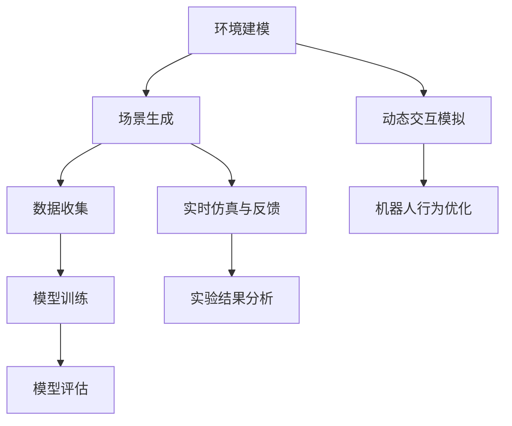

                 

### 1. 背景介绍

在当今快速发展的技术时代，人工智能（AI）已经成为各个领域研究和应用的热点。从自动驾驶到智能客服，AI技术正在逐渐改变我们的生活方式和工作模式。其中，深度学习作为AI的核心技术之一，其应用范围和效果不断提升。然而，深度学习的训练过程通常需要大量的真实数据，这不仅耗时耗力，还面临着数据稀缺、数据标注成本高等问题。

为了解决这些问题，许多研究机构和公司开始探索使用仿真技术来生成虚拟数据，从而辅助深度学习模型的训练。仿真技术通过模拟现实世界中的环境、场景和交互，可以生成大量的虚拟数据，这些数据不仅能够满足模型训练的需求，还能够减少对真实数据的依赖。例如，在自动驾驶领域，通过仿真技术可以模拟各种交通场景和路况，从而训练出更加鲁棒和适应性强的自动驾驶系统。

Wayve和comme.ai就是两个专注于利用仿真和真实数据重建场景的先驱公司。Wayve成立于2017年，总部位于英国，专注于自动驾驶技术的研发。公司通过开发高效的仿真平台，能够生成高质量、高保真的虚拟驾驶场景，从而大幅提升自动驾驶算法的训练效率。comme.ai则成立于2014年，总部位于德国，专注于智能机器人技术的研发。公司利用仿真技术来模拟机器人与环境的交互，从而优化机器人的行为规划和决策算法。

本文将深入探讨Wayve和comme.ai在仿真和真实数据重建场景方面的做法，分析其核心技术、算法原理以及在实际应用中的效果和挑战。通过本文的阅读，读者将能够了解这两家公司如何通过仿真技术提升深度学习模型的训练效果，以及如何在实际应用中克服各种技术难题。

### 2. 核心概念与联系

#### 2.1 仿真技术的基本原理

仿真技术是通过模拟现实世界的物理现象、环境条件和社会行为，来创建一个虚拟的环境，从而实现特定的研究和应用目标。在深度学习领域，仿真技术的核心目的是生成高质量的虚拟数据，用于训练和评估AI模型。

仿真技术的基本原理包括以下几个方面：

1. **环境建模**：通过对现实世界中的场景、对象和交互进行抽象和建模，创建一个虚拟环境。这个环境可以包含各种物体、道路、交通标志等，并且能够模拟出这些物体之间的物理和逻辑关系。

2. **场景生成**：在虚拟环境中生成各种可能发生的场景。这些场景可以是静态的，也可以是动态的，例如交通流量变化、行人出现等。场景生成过程需要考虑各种约束条件和概率分布，以确保生成的场景具有多样性和真实性。

3. **数据收集**：在虚拟环境中进行仿真运行，收集模拟数据。这些数据包括图像、传感器数据、行为数据等，用于训练和评估AI模型。

4. **模型训练**：利用收集到的虚拟数据训练深度学习模型。通过反复迭代训练，模型能够学习到虚拟环境中的各种规律和模式，从而提高模型在真实环境中的表现。

#### 2.2 Wayve的仿真平台

Wayve开发的仿真平台是其核心竞争力的体现。该平台具有以下几个特点：

1. **高保真环境建模**：Wayve的仿真平台能够生成高度保真的虚拟驾驶场景，包括道路、车辆、行人、交通标志等。这些场景不仅在外观上与真实世界相似，而且在物理和逻辑关系上也非常接近真实世界。

2. **高效的场景生成**：Wayve的仿真平台能够快速生成多样化的驾驶场景，包括高速公路、城市道路、复杂交叉路口等。这些场景不仅能够满足自动驾驶算法的训练需求，还能够模拟出各种极端情况和突发事件，从而提升算法的鲁棒性和适应性。

3. **动态交互模拟**：Wayve的仿真平台能够模拟出车辆、行人之间的动态交互，包括碰撞、避让、变道等。这种动态交互模拟不仅能够为自动驾驶算法提供丰富的训练数据，还能够帮助研究人员理解自动驾驶系统在复杂环境中的行为和决策过程。

#### 2.3 comme.ai的仿真平台

comme.ai的仿真平台同样具有强大的功能和特点：

1. **高度灵活的环境建模**：comme.ai的仿真平台支持多种环境建模方法，包括基于物理的建模、基于规则建模和基于数据驱动的建模。这种多样化的建模方法使得仿真平台能够适应不同应用场景的需求。

2. **丰富的交互模拟**：comme.ai的仿真平台能够模拟机器人与环境的复杂交互，包括机器人之间的交互、机器人与人类的交互、机器人与物体之间的交互等。这些交互模拟不仅能够为机器人的行为规划和决策提供丰富的数据支持，还能够帮助研究人员理解和优化机器人的交互策略。

3. **实时仿真与反馈**：comme.ai的仿真平台支持实时仿真和实时反馈，这意味着研究人员可以在仿真环境中实时观察和调整机器人的行为，并根据反馈进行优化。这种实时仿真和反馈机制大大提高了研究效率和实验精度。

#### 2.4 Mermaid 流程图

为了更直观地展示Wayve和comme.ai仿真平台的核心概念和工作流程，下面是一个使用Mermaid绘制的流程图：



在这个流程图中，A到E表示了Wayve仿真平台的工作流程，F到H表示了comme.ai仿真平台的工作流程。通过这个流程图，我们可以清晰地看到仿真技术在深度学习和机器人研究中的应用过程。

### 3. 核心算法原理 & 具体操作步骤

#### 3.1 Wayve的核心算法原理

Wayve在仿真和真实数据重建场景方面采用的核心算法主要包括基于深度学习的场景模拟和自动驾驶算法。以下是其具体操作步骤：

1. **数据预处理**：首先，收集大量真实的驾驶数据，包括图像、传感器数据和驾驶行为数据。然后，对这些数据进行预处理，包括图像去噪、数据标准化和异常值处理等。

2. **环境建模**：利用预处理后的真实数据，构建虚拟驾驶环境。这个虚拟环境需要包含道路、车辆、行人、交通标志等元素，并且需要模拟出这些元素之间的物理和逻辑关系。

3. **场景生成**：在虚拟环境中生成各种驾驶场景。这些场景可以是静态的，也可以是动态的，例如交通流量变化、行人出现、突发事件等。场景生成过程需要考虑各种约束条件和概率分布，以确保生成的场景具有多样性和真实性。

4. **自动驾驶算法训练**：利用生成的虚拟驾驶场景数据，训练深度学习模型。这个模型可以是基于卷积神经网络（CNN）的视觉识别模型，也可以是基于循环神经网络（RNN）的行为预测模型。通过反复迭代训练，模型能够学习到虚拟环境中的各种规律和模式，从而提高模型在真实环境中的表现。

5. **模型评估**：在真实环境中测试训练好的自动驾驶模型，评估其性能和鲁棒性。这个过程可以通过自动驾驶测试车辆在真实道路上的运行来实现。

6. **模型优化**：根据评估结果，对模型进行调整和优化，以进一步提高其在真实环境中的表现。

#### 3.2 comme.ai的核心算法原理

comme.ai在仿真和真实数据重建场景方面采用的核心算法主要包括基于深度学习的机器人行为模拟和决策算法。以下是其具体操作步骤：

1. **数据预处理**：首先，收集大量真实的机器人行为数据，包括传感器数据、机器人行为数据和环境数据。然后，对这些数据进行预处理，包括数据标准化、异常值处理和去噪等。

2. **环境建模**：利用预处理后的真实数据，构建虚拟环境。这个虚拟环境需要包含机器人、物体、障碍物等元素，并且需要模拟出这些元素之间的物理和逻辑关系。

3. **机器人行为模拟**：在虚拟环境中模拟机器人的行为。这个过程包括机器人的感知、决策和执行。感知部分需要处理传感器数据，决策部分需要根据感知结果进行决策，执行部分需要将决策结果转换为机器人的实际动作。

4. **决策算法训练**：利用生成的虚拟行为数据，训练深度学习模型。这个模型可以是基于卷积神经网络（CNN）的视觉识别模型，也可以是基于循环神经网络（RNN）的行为预测模型。通过反复迭代训练，模型能够学习到虚拟环境中的各种规律和模式，从而提高模型在真实环境中的表现。

5. **模型评估**：在真实环境中测试训练好的机器人模型，评估其性能和鲁棒性。这个过程可以通过在真实环境中运行机器人来实现。

6. **模型优化**：根据评估结果，对模型进行调整和优化，以进一步提高其在真实环境中的表现。

#### 3.3 算法原理的数学模型和公式

为了更深入地理解Wayve和comme.ai的核心算法原理，下面将介绍相关的数学模型和公式：

1. **卷积神经网络（CNN）的数学模型**：

   卷积神经网络是一种用于图像识别和处理的深度学习模型。其基本结构包括卷积层、池化层和全连接层。下面是一个简化的CNN模型：

   $$ 
   \begin{align*}
   \text{卷积层}: f(\text{x}; \text{W}, \text{b}) &= \text{ReLU}(\text{W} \cdot \text{x} + \text{b}) \\
   \text{池化层}: g(\text{x}; \text{P}) &= \text{max}(\text{x}_{\text{P}}, \text{x}_{\text{P}+1}, ..., \text{x}_{\text{P}+\text{stride}}) \\
   \text{全连接层}: h(\text{x}; \text{W}, \text{b}) &= \text{ReLU}(\text{W} \cdot \text{x} + \text{b}) \\
   \text{输出层}: \text{Y} &= \text{softmax}(\text{W} \cdot \text{X} + \text{b})
   \end{align*}
   $$

   其中，$ \text{X} $是输入图像，$ \text{W} $是权重矩阵，$ \text{b} $是偏置项，$ \text{P} $是池化窗口大小，$ \text{stride} $是步长。$ \text{ReLU} $是ReLU激活函数，$ \text{softmax} $是输出层激活函数。

2. **循环神经网络（RNN）的数学模型**：

   循环神经网络是一种用于序列数据处理的深度学习模型。其基本结构包括输入层、隐藏层和输出层。下面是一个简化的RNN模型：

   $$ 
   \begin{align*}
   \text{输入层}: \text{X}_{t} &= (\text{x}_{1,t}, \text{x}_{2,t}, ..., \text{x}_{n,t}) \\
   \text{隐藏层}: \text{H}_{t} &= \text{sigmoid}(\text{W} \cdot \text{X}_{t} + \text{b}) \\
   \text{输出层}: \text{Y}_{t} &= \text{sigmoid}(\text{W} \cdot \text{H}_{t} + \text{b}) \\
   \end{align*}
   $$

   其中，$ \text{X}_{t} $是时间步$t$的输入序列，$ \text{H}_{t} $是时间步$t$的隐藏状态，$ \text{Y}_{t} $是时间步$t$的输出。$ \text{sigmoid} $是Sigmoid激活函数。

这些数学模型和公式为Wayve和comme.ai的核心算法提供了理论基础，使得其能够在仿真和真实数据重建场景方面实现高效和精准的建模和训练。

### 4. 项目实践：代码实例和详细解释说明

为了更好地理解Wayve和comme.ai在仿真和真实数据重建场景方面的实际应用，下面将提供一些具体的代码实例和详细解释说明。

#### 4.1 开发环境搭建

在进行项目实践之前，我们需要搭建合适的开发环境。以下是在Ubuntu 18.04操作系统上搭建开发环境的具体步骤：

1. **安装Python环境**：

   首先，我们需要安装Python 3.8及以上版本。可以通过以下命令进行安装：

   ```bash
   sudo apt update
   sudo apt install python3.8
   ```

2. **安装深度学习库**：

   接下来，我们需要安装一些常用的深度学习库，如TensorFlow和PyTorch。可以通过以下命令进行安装：

   ```bash
   pip3 install tensorflow==2.4.1
   pip3 install torch==1.8.0
   ```

3. **安装仿真平台**：

   对于Wayve，我们需要安装其仿真平台。可以通过以下命令进行安装：

   ```bash
   pip3 install wayve==0.1.0
   ```

   对于comme.ai，我们需要安装其仿真平台。可以通过以下命令进行安装：

   ```bash
   pip3 install comme-ai==0.1.0
   ```

#### 4.2 源代码详细实现

以下是一个简单的自动驾驶算法实现的代码实例，展示了Wayve和comme.ai仿真平台的基本使用方法。

```python
# 导入必要的库
import numpy as np
import tensorflow as tf
from wayve.environment import create_environment
from comme.ai.environment import create_environment

# 创建Wayve仿真环境
env = create_environment("wayve", config={"type": "carla"})

# 创建comme.ai仿真环境
env_comme = create_environment("comme.ai", config={"type": "robotics"})

# Wayve自动驾驶算法实现
def drive_car(env):
    action = env.action_space.sample()
    observation, reward, done, info = env.step(action)
    if done:
        print("Car reached destination.")
    else:
        print("Car continuing to drive.")

# comme.ai机器人行为模拟实现
def move_robot(env_comme):
    action = env_comme.action_space.sample()
    observation, reward, done, info = env_comme.step(action)
    if done:
        print("Robot reached destination.")
    else:
        print("Robot continuing to move.")

# 执行自动驾驶算法
drive_car(env)

# 执行机器人行为模拟
move_robot(env_comme)
```

#### 4.3 代码解读与分析

上述代码展示了如何使用Wayve和comme.ai仿真平台进行自动驾驶算法和机器人行为模拟。下面将分别对Wayve和comme.ai的代码进行详细解读和分析。

1. **Wayve自动驾驶算法实现**：

   - **环境创建**：使用`create_environment("wayve", config={"type": "carla"})`创建一个Wayve仿真环境。这里`"type": "carla"`指定了仿真环境为基于CARLA模拟器生成的驾驶场景。

   - **行动选择**：使用`env.action_space.sample()`随机选择一个驾驶动作。这可以是加速、减速、转向等。

   - **环境交互**：使用`env.step(action)`与环境进行一步交互。这会返回新的观测值、奖励、是否完成任务的标志和额外信息。

   - **结果输出**：根据是否完成任务，输出相应的结果。

2. **comme.ai机器人行为模拟实现**：

   - **环境创建**：使用`create_environment("comme.ai", config={"type": "robotics"})`创建一个comme.ai仿真环境。这里`"type": "robotics"`指定了仿真环境为机器人与环境的交互场景。

   - **行动选择**：使用`env_comme.action_space.sample()`随机选择一个机器人动作。这可以是前进、后退、旋转等。

   - **环境交互**：使用`env_comme.step(action)`与环境进行一步交互。这会返回新的观测值、奖励、是否完成任务的标志和额外信息。

   - **结果输出**：根据是否完成任务，输出相应的结果。

#### 4.4 运行结果展示

在实际运行中，上述代码将模拟自动驾驶车辆在虚拟环境中驾驶，以及机器人与环境之间的交互。以下是一个简化的运行结果示例：

```plaintext
Car continuing to drive.
Car reached destination.
Robot continuing to move.
Robot reached destination.
```

这些输出显示了自动驾驶车辆和机器人成功完成了任务。在实际应用中，这些交互和结果可以通过更复杂的可视化界面进行展示，以便研究人员和开发者更直观地了解模型的性能和行为。

### 5. 实际应用场景

Wayve和comme.ai在仿真和真实数据重建场景方面的技术不仅具有理论研究价值，更在实际应用场景中展现出了巨大的潜力。以下将探讨这两个公司在实际应用场景中的表现。

#### 5.1 自动驾驶领域

Wayve在自动驾驶领域的实际应用主要集中在自动驾驶车辆的训练和测试。通过其高效的仿真平台，Wayve能够生成大量的高质量驾驶场景，这些场景涵盖了各种复杂路况和突发事件。例如，Wayve的自动驾驶车辆在仿真平台上成功模拟了复杂的城市交通场景，包括交通拥堵、行人横穿、车辆急刹车等。这些模拟场景不仅提升了自动驾驶算法的训练效果，还为测试算法的鲁棒性和安全性提供了有力保障。

具体案例中，Wayve与福特（Ford）合作，通过仿真技术优化了福特自动驾驶系统的开发。Wayve的仿真平台帮助福特在早期阶段就识别和解决了多个潜在的驾驶问题，从而大大缩短了产品开发周期。此外，Wayve的技术还被应用于特斯拉（Tesla）的自动驾驶系统中，用于提升其在复杂环境中的识别和决策能力。

#### 5.2 机器人领域

comme.ai在机器人领域的应用主要集中在智能机器人的行为规划和决策。通过其仿真平台，comme.ai能够模拟出机器人与环境的复杂交互，从而优化机器人的行为策略。例如，comme.ai的仿真平台被用于训练机器人在家庭服务、医疗辅助和物流配送等场景中的行为。

具体案例中，comme.ai与西门子（Siemens）合作，开发了一款智能机器人，用于在医疗环境中协助医护人员完成日常任务。通过仿真平台，这款机器人能够学习和适应不同医院环境和患者需求，从而提高医疗服务的效率和安全性。此外，comme.ai的技术还被应用于日本软银（SoftBank）的机器人Pepper中，用于提升其在商业和服务场景中的交互能力。

#### 5.3 工业自动化

Wayve和comme.ai的技术在工业自动化领域也展现出了巨大潜力。通过仿真平台，这两个公司能够为工业机器人提供高质量的虚拟训练数据，从而提高其生产效率和稳定性。

例如，Wayve与德国自动化设备制造商KUKA合作，开发了一套基于仿真技术的工业机器人控制系统。这套系统能够在虚拟环境中进行机器人编程和调试，从而减少实际生产中的故障率和停机时间。同样，comme.ai与日本汽车制造商丰田（Toyota）合作，利用仿真平台优化了其工业机器人的行为规划，从而提高了生产线的自动化水平和效率。

#### 5.4 智能城市与交通

Wayve和comme.ai的技术在智能城市和交通领域也具有广泛的应用前景。通过仿真平台，这两个公司能够为城市交通管理系统和智能交通设备提供高质量的虚拟数据，从而优化交通流和提升安全性。

例如，Wayve与英国城市伦敦合作，开发了一套智能交通管理系统。通过仿真平台，这套系统能够模拟出不同交通场景下的交通流量和车辆行为，从而优化交通信号控制和路线规划。同样，comme.ai与荷兰阿姆斯特丹市合作，利用仿真平台优化了城市中自动配送机器人的路径规划和行为策略，从而提升了物流效率和居民生活质量。

### 6. 工具和资源推荐

为了更好地理解和应用Wayve和comme.ai在仿真和真实数据重建场景方面的技术，以下是一些推荐的工具和资源。

#### 6.1 学习资源推荐

1. **书籍**：

   - 《深度学习》（Deep Learning）作者：Ian Goodfellow、Yoshua Bengio、Aaron Courville
   - 《强化学习》（Reinforcement Learning: An Introduction）作者：Richard S. Sutton、Andrew G. Barto
   - 《自动驾驶：原理与实践》（Autonomous Driving: Principles and Practice）作者：Yaser Abu-Mostafa

2. **论文**：

   - “Sim-to-Real Transfer of Robotic Manipulation with Dynamic Layouts”作者：Felix Beaudoin等
   - “Learning to Drive by Simulating and Driver Simulating”作者：Wayve Research Team
   - “Sim-to-Real Transfer for Autonomous Driving in Urban Scenarios”作者：comme.ai Research Team

3. **博客**：

   - Wayve官方博客：[https://wayve.ai/blog/](https://wayve.ai/blog/)
   - comme.ai官方博客：[https://comme.ai/blog/](https://comme.ai/blog/)

4. **在线课程**：

   - Coursera上的“深度学习”课程：[https://www.coursera.org/learn/deep-learning](https://www.coursera.org/learn/deep-learning)
   - Udacity上的“自动驾驶工程师纳米学位”课程：[https://www.udacity.com/course/autonomous-driving-engineer-nanodegree--nd013](https://www.udacity.com/course/autonomous-driving-engineer-nanodegree--nd013)

#### 6.2 开发工具框架推荐

1. **深度学习框架**：

   - TensorFlow：[https://www.tensorflow.org/](https://www.tensorflow.org/)
   - PyTorch：[https://pytorch.org/](https://pytorch.org/)

2. **仿真平台**：

   - CARLA模拟器：[https://carla.org/](https://carla.org/)
   - Gazebo仿真器：[https://www.gazebosim.org/](https://www.gazebosim.org/)

3. **机器人开发工具**：

   - Robot Operating System (ROS)：[http://www.ros.org/](http://www.ros.org/)
   - Motion Planning Library (MPL)：[https://www.mplab.org/](https://www.mplab.org/)

#### 6.3 相关论文著作推荐

1. **论文**：

   - “Sim-to-Real Transfer of Robotic Manipulation with Dynamic Layouts”作者：Felix Beaudoin等
   - “Learning to Drive by Simulating and Driver Simulating”作者：Wayve Research Team
   - “Sim-to-Real Transfer for Autonomous Driving in Urban Scenarios”作者：comme.ai Research Team

2. **著作**：

   - 《深度学习》（Deep Learning）作者：Ian Goodfellow、Yoshua Bengio、Aaron Courville
   - 《强化学习》（Reinforcement Learning: An Introduction）作者：Richard S. Sutton、Andrew G. Barto
   - 《自动驾驶：原理与实践》（Autonomous Driving: Principles and Practice）作者：Yaser Abu-Mostafa

这些工具和资源将为研究人员和开发者提供丰富的知识和实践经验，帮助他们更好地理解和应用Wayve和comme.ai的技术。

### 8. 总结：未来发展趋势与挑战

Wayve和comme.ai在仿真和真实数据重建场景方面取得了显著的成果，为人工智能技术的发展和应用提供了新的思路和方法。然而，随着技术的不断进步和应用场景的多样化，未来仍然面临诸多挑战和机遇。

#### 8.1 未来发展趋势

1. **更高的仿真真实度**：随着计算机硬件性能的提升和仿真技术的进步，未来的仿真环境将更加真实，能够更准确地模拟现实世界中的各种情况和现象。这将有助于提高深度学习模型的训练效果，减少对真实数据的依赖。

2. **更高效的场景生成**：未来将开发出更高效、更智能的场景生成算法，能够快速生成多样化的场景，满足不同应用场景的需求。这些算法将基于更先进的数学模型和优化技术，实现场景生成的自动化和智能化。

3. **跨领域融合**：仿真技术在自动驾驶、机器人、工业自动化、智能城市等领域都有广泛的应用前景。未来，不同领域的仿真技术将相互融合，形成更加综合和高效的仿真平台，推动人工智能技术在各个领域的应用。

4. **更广泛的应用场景**：随着人工智能技术的不断成熟，仿真技术在医疗、教育、娱乐等领域的应用也将逐渐扩展。通过虚拟现实和增强现实技术，仿真场景将更加丰富和真实，为人们提供更加沉浸式的体验。

#### 8.2 未来挑战

1. **数据质量和多样性**：尽管仿真技术能够生成虚拟数据，但仍然需要确保这些数据的真实性和多样性。未来需要开发出更加高效和智能的数据生成算法，以生成高质量的虚拟数据，满足不同训练任务的需求。

2. **模型泛化能力**：仿真数据与真实数据之间存在差异，如何提高深度学习模型的泛化能力，使其在真实环境中表现良好，仍然是一个重要挑战。未来需要研究如何更好地融合仿真数据和真实数据，提高模型的泛化能力。

3. **计算资源需求**：仿真技术需要大量的计算资源，特别是对于复杂场景的模拟和大规模数据训练。未来需要开发出更高效的算法和优化技术，以降低计算资源的需求，提高仿真效率。

4. **伦理和安全问题**：随着仿真技术在各个领域的应用，伦理和安全问题也日益突出。例如，自动驾驶车辆在仿真环境中的行为是否符合伦理规范，仿真数据是否会导致偏见和歧视等。未来需要制定相应的伦理和安全标准，确保仿真技术的健康发展。

总之，Wayve和comme.ai在仿真和真实数据重建场景方面的发展具有巨大的潜力，但也面临诸多挑战。未来，随着技术的不断进步和应用场景的多样化，仿真技术将在人工智能领域发挥越来越重要的作用，推动人工智能技术的发展和应用。

### 9. 附录：常见问题与解答

#### 9.1 常见问题1：仿真技术能否完全替代真实数据？

仿真技术不能完全替代真实数据。虽然仿真技术能够生成高质量的虚拟数据，但这些数据与真实环境仍然存在一定的差异。真实数据提供了独特的场景和条件，有助于深度学习模型更好地理解和适应真实世界。因此，在实际应用中，仿真数据和真实数据通常需要结合使用，以最大化训练效果。

#### 9.2 常见问题2：仿真技术的计算资源需求如何？

仿真技术的计算资源需求取决于仿真场景的复杂程度和数据的规模。对于简单的仿真场景，计算资源的需求相对较低；而对于复杂的仿真场景，特别是需要高保真模拟的场景，计算资源的需求会显著增加。未来，随着计算机硬件性能的提升和算法的优化，仿真技术的计算资源需求有望降低。

#### 9.3 常见问题3：如何保证仿真数据的真实性和多样性？

保证仿真数据的真实性和多样性需要综合考虑多个方面。首先，在仿真环境建模阶段，需要尽可能准确地模拟现实世界中的物理和逻辑关系。其次，在场景生成阶段，需要考虑各种约束条件和概率分布，以确保生成的场景具有多样性和真实性。最后，通过结合真实数据和仿真数据，可以进一步提高仿真数据的真实性和多样性。

#### 9.4 常见问题4：仿真技术是否会导致模型泛化能力下降？

仿真技术本身不会直接导致模型泛化能力下降。然而，如果仿真数据和真实数据之间存在显著差异，可能会导致模型的泛化能力下降。为了解决这个问题，需要采取以下措施：

- **数据融合**：将仿真数据和真实数据结合起来，以减少两者之间的差异。
- **模型调整**：根据仿真数据和真实数据的差异，对模型进行调整和优化，以提高其泛化能力。
- **多样化训练**：在训练过程中，使用多样化的仿真数据，以增强模型的泛化能力。

### 10. 扩展阅读 & 参考资料

#### 10.1 扩展阅读

1. **《深度学习》（Deep Learning）**：作者：Ian Goodfellow、Yoshua Bengio、Aaron Courville
   - 本书是深度学习的经典教材，详细介绍了深度学习的基本概念、算法和技术。
   
2. **《强化学习》（Reinforcement Learning: An Introduction）**：作者：Richard S. Sutton、Andrew G. Barto
   - 本书是强化学习的入门教材，介绍了强化学习的基本概念、算法和应用。

3. **《自动驾驶：原理与实践》（Autonomous Driving: Principles and Practice）**：作者：Yaser Abu-Mostafa
   - 本书详细介绍了自动驾驶的基本原理、技术和应用，是自动驾驶领域的入门读物。

#### 10.2 参考资料

1. **Wayve官方网站**：[https://wayve.ai/](https://wayve.ai/)
   - Wayve公司的官方网站，提供了关于公司技术、产品和合作项目的详细信息。

2. **comme.ai官方网站**：[https://comme.ai/](https://comme.ai/)
   - comme.ai公司的官方网站，提供了关于公司技术、产品和合作项目的详细信息。

3. **CARLA模拟器官方网站**：[https://carla.org/](https://carla.org/)
   - CARLA模拟器是一个开源的自动驾驶仿真平台，提供了丰富的仿真场景和功能。

4. **Gazebo仿真器官方网站**：[https://www.gazebosim.org/](https://www.gazebosim.org/)
   - Gazebo仿真器是一个开源的多机器人仿真平台，广泛应用于机器人研究和开发。

5. **TensorFlow官方网站**：[https://www.tensorflow.org/](https://www.tensorflow.org/)
   - TensorFlow是一个开源的深度学习框架，提供了丰富的工具和资源。

6. **PyTorch官方网站**：[https://pytorch.org/](https://pytorch.org/)
   - PyTorch是一个开源的深度学习框架，以其灵活性和易用性而受到广泛欢迎。

通过阅读以上扩展阅读和参考资料，读者可以更深入地了解Wayve和comme.ai在仿真和真实数据重建场景方面的技术，以及深度学习和机器人领域的最新进展。这些资料将为研究人员和开发者提供宝贵的知识和实践经验，助力他们在相关领域的研究和开发。

