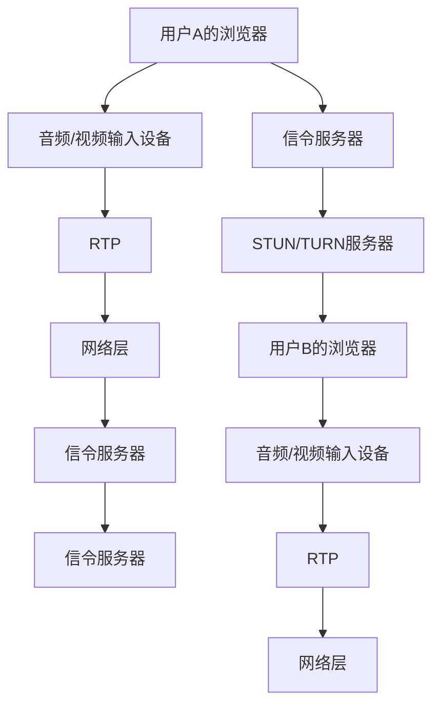
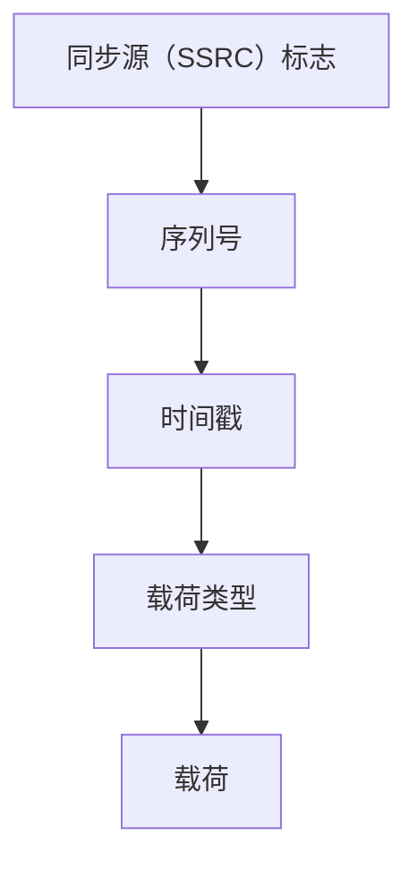

                 

### 背景介绍

WebRTC（Web Real-Time Communication）是一种用于在浏览器中实现实时通信的开源项目。它旨在提供一个简单的API，使得开发者能够轻松地实现音频、视频和数据通信等功能，无需依赖于任何第三方插件或软件。

在过去的互联网时代，实时通信通常需要依赖第三方插件，如Adobe Flash和Microsoft Silverlight。这些插件在浏览器中运行，提供了实时音频、视频和数据通信的能力。然而，这些插件存在一些问题，例如兼容性问题、安全漏洞以及性能瓶颈。随着Web技术的发展，尤其是HTML5的普及，开发者们开始寻求一种无需插件即可实现实时通信的方法，WebRTC应运而生。

WebRTC最初由Google提出，并在2011年开源。随后，它得到了众多知名浏览器厂商的支持，包括Google Chrome、Mozilla Firefox、Microsoft Edge和Apple Safari等。WebRTC不仅支持浏览器间的实时通信，还支持移动设备之间的通信，使得开发者可以构建跨平台的应用程序。

WebRTC的核心目标之一是提供高质量的通信体验。它通过使用IP多媒体子系统（IP Multimedia Subsystem，简称IMS）中的协议来实现这一点。这些协议包括Session Description Protocol（SDP）、Session Initiation Protocol（SIP）和Real-time Transport Protocol（RTP）等。

WebRTC的关键特性包括：

1. **浏览器原生支持**：WebRTC不需要任何插件，可以在现代浏览器中直接使用。
2. **低延迟**：WebRTC优化了数据传输路径，减少了延迟，使得实时通信更加流畅。
3. **高带宽利用率**：WebRTC通过动态调整传输速率，确保在带宽有限的情况下仍能提供高质量的视频通信。
4. **安全性**：WebRTC采用了加密机制，确保通信数据的安全性。
5. **广泛兼容性**：WebRTC支持多种平台，包括桌面电脑、智能手机和平板电脑。

WebRTC在现代互联网通信中扮演着重要角色。它不仅被广泛应用于视频会议、实时聊天和在线教育等场景，还逐渐渗透到智能家居、远程医疗和物联网等新兴领域。随着Web技术的不断发展和普及，WebRTC的应用前景将更加广阔。

在接下来的章节中，我们将深入探讨WebRTC的核心概念和实现原理，并通过具体实例展示如何在浏览器中实现实时通信。通过这些内容，您将了解到WebRTC的强大功能和应用潜力。

## 2. 核心概念与联系

### 2.1 WebRTC协议栈

WebRTC协议栈是WebRTC实现实时通信的核心。它由多个协议层组成，每个层都有其特定的功能。以下是WebRTC协议栈的主要层次结构：

#### 2.1.1 数据通道

数据通道（Data Channels）是WebRTC中用于传输数据的通信通道。它允许浏览器之间传输任意类型的数据，包括文本、二进制数据等。数据通道是一个全双工的通道，即允许双向数据传输。

#### 2.1.2 信令协议

信令协议（Signaling Protocol）用于浏览器之间交换会话信息。这些信息包括媒体类型、网络地址和端口等。WebRTC支持多种信令协议，如Session Description Protocol（SDP）、Session Initiation Protocol（SIP）和JSON Object Notation（JSON）等。

#### 2.1.3 网络层

网络层负责处理网络连接和传输。它包括如下协议：

- **STUN（Session Traversal Utilities for NAT）**：STUN协议用于发现网络地址转换（NAT）背后的公网IP地址和端口。
- **TURN（Traversal Using Relays around NAT）**：TURN协议用于在NAT和防火墙之后建立中继连接，以确保通信双方能够直接通信。
- **ICE（Interactive Connectivity Establishment）**：ICE协议结合STUN和TURN，提供一种更为灵活的NAT穿越机制。

#### 2.1.4 媒体层

媒体层负责处理音频和视频数据的传输。它包括如下协议：

- **RTP（Real-time Transport Protocol）**：RTP协议用于传输音频和视频数据。
- **RTCP（Real-time Transport Control Protocol）**：RTCP协议用于监控和反馈RTP传输过程中的质量信息。
- **SRTP（Secure Real-time Transport Protocol）**：SRTP协议对RTP数据包进行加密，确保通信数据的安全性。

### 2.2 WebRTC架构图

为了更好地理解WebRTC的工作原理，我们可以使用Mermaid流程图来展示其核心架构。以下是一个简化的WebRTC架构图：



在这个架构图中：

- **A和D** 代表用户A和用户B的浏览器。
- **B** 代表信令服务器，用于交换会话信息。
- **C** 代表STUN/TURN服务器，用于NAT穿越。
- **E和J** 代表音频/视频输入设备。
- **F和K** 代表RTP协议处理音频/视频数据。
- **G和L** 代表网络层处理数据传输。
- **H和I** 代表网络中的其他组件，如防火墙和路由器。

通过这个架构图，我们可以清楚地看到WebRTC中各个组件的交互和协作方式。

### 2.3 核心概念之间的联系

WebRTC中的核心概念和协议之间存在紧密的联系。以下是它们之间的一些关键联系：

1. **数据通道**：数据通道是WebRTC中用于传输数据的通信通道，它依赖于信令协议进行会话信息的交换。信令协议确保浏览器能够建立和配置数据通道。
2. **信令协议**：信令协议用于在浏览器之间交换会话信息，这些信息包括媒体类型、网络地址和端口等。信令协议与网络层协议（如STUN、TURN和ICE）紧密配合，确保通信双方能够成功建立连接。
3. **网络层协议**：网络层协议（如STUN、TURN和ICE）用于处理网络连接和NAT穿越问题。它们确保浏览器能够找到对方的公网IP地址和端口，从而建立直接的通信连接。
4. **媒体层协议**：媒体层协议（如RTP、RTCP和SRTP）用于传输和处理音频/视频数据。它们确保音频/视频数据能够以高质量和低延迟的方式进行传输。

通过这些联系，WebRTC能够实现高效的实时通信，满足现代互联网应用的需求。

### 3. 核心算法原理 & 具体操作步骤

WebRTC的核心算法原理主要涉及网络层的NAT穿越和ICE协议的实现。以下将详细描述这些算法的原理以及具体操作步骤。

#### 3.1 NAT穿越原理

网络地址转换（NAT）是一种网络技术，它将私有IP地址转换为公网IP地址，以便在互联网上进行通信。然而，NAT的存在使得浏览器之间的直接通信变得复杂。为了解决这个问题，WebRTC引入了NAT穿越技术。

NAT穿越的基本原理是：浏览器首先使用STUN协议获取其公网IP地址和端口，然后使用ICE协议与对端浏览器进行通信。具体步骤如下：

1. **获取本地IP地址和端口**：浏览器使用STUN服务器获取其公网IP地址和端口。这一过程称为NAT发现。
2. **获取对端IP地址和端口**：浏览器通过信令服务器获取对端的公网IP地址和端口。
3. **建立连接**：浏览器使用获取到的对端IP地址和端口建立连接。

#### 3.2 STUN协议

STUN（Session Traversal Utilities for NAT）协议是WebRTC中用于NAT发现的关键协议。它的主要功能是获取浏览器的公网IP地址和端口。具体步骤如下：

1. **发送STUN请求**：浏览器向STUN服务器发送一个STUN请求。
2. **接收STUN响应**：STUN服务器处理请求并返回一个STUN响应，其中包含浏览器的公网IP地址和端口。
3. **更新本地地址**：浏览器更新其本地地址信息，以备后续通信使用。

#### 3.3 TURN协议

TURN（Traversal Using Relays around NAT）协议是WebRTC中用于NAT穿越的另一种重要协议。当STUN协议无法直接连接到对端时，TURN协议可以通过中继服务器建立连接。具体步骤如下：

1. **获取中继服务器地址**：浏览器通过信令服务器获取中继服务器的IP地址和端口。
2. **发送TURN请求**：浏览器向中继服务器发送TURN请求，请求中继服务器将其数据转发到对端浏览器。
3. **接收转发数据**：中继服务器将接收到的数据转发到对端浏览器。

#### 3.4 ICE协议

ICE（Interactive Connectivity Establishment）协议是WebRTC中用于NAT穿越的核心协议。它结合了STUN和TURN协议，提供了更为灵活和可靠的NAT穿越机制。ICE协议的具体操作步骤如下：

1. **收集候选地址**：浏览器使用STUN和TURN协议收集自己的公网IP地址、端口以及中继服务器的IP地址和端口，形成候选地址集。
2. **交换候选地址**：浏览器通过信令服务器将候选地址集发送给对端浏览器。
3. **测试候选地址**：浏览器使用每个候选地址与对端浏览器进行通信测试，选择最佳候选地址进行通信。
4. **建立连接**：浏览器使用最佳候选地址建立连接，确保通信双方能够直接通信。

#### 3.5 算法总结

WebRTC的NAT穿越算法主要依赖于STUN、TURN和ICE协议。具体步骤如下：

1. **获取本地IP地址和端口**：浏览器使用STUN协议获取其公网IP地址和端口。
2. **获取对端IP地址和端口**：浏览器通过信令服务器获取对端的公网IP地址和端口。
3. **发送STUN请求**：浏览器向STUN服务器发送STUN请求，获取对端的公网IP地址和端口。
4. **发送TURN请求**：浏览器向中继服务器发送TURN请求，请求中继服务器将其数据转发到对端浏览器。
5. **交换候选地址**：浏览器通过信令服务器将候选地址集发送给对端浏览器。
6. **测试候选地址**：浏览器使用每个候选地址与对端浏览器进行通信测试，选择最佳候选地址进行通信。
7. **建立连接**：浏览器使用最佳候选地址建立连接，确保通信双方能够直接通信。

通过这些步骤，WebRTC能够实现浏览器之间的实时通信，满足现代互联网应用的需求。

### 4. 数学模型和公式 & 详细讲解 & 举例说明

在WebRTC的实现过程中，数学模型和公式扮演了关键角色，特别是在处理网络传输和加密等方面。以下将详细介绍这些数学模型和公式的应用，并通过具体例子进行说明。

#### 4.1 RTP协议

RTP（Real-time Transport Protocol）是一种用于传输音频和视频数据的实时传输协议。它定义了一系列的公式来确保数据包的正确传输。

**RTP数据包格式：**

一个RTP数据包由多个字段组成，包括同步源（SSRC）标志、序列号、时间戳、载荷类型等。以下是RTP数据包的基本格式：



**示例：**

假设一个RTP数据包的序列号为100，时间戳为150，载荷类型为8，载荷为"Hello World!"。

**RTP数据包格式：**

```plaintext
+-----------------+
| SSRC标志（32位） |
+-----------------+
| 序列号（16位）   |
+-----------------+
| 时间戳（32位）   |
+-----------------+
| 载荷类型（8位）  |
+-----------------+
| 载荷（变量长度） |
+-----------------+
```

**公式解释：**

- **序列号（Sequence Number）**：用于标识连续发送的RTP数据包。
- **时间戳（Timestamp）**：用于同步音频和视频数据。
- **载荷类型（Payload Type）**：指示数据包中载荷的类型，如音频或视频。

#### 4.2 SRTP协议

SRTP（Secure Real-time Transport Protocol）是一种用于加密RTP数据包的协议。它通过使用AES（Advanced Encryption Standard）和 HMAC（Hash-based Message Authentication Code）算法对RTP数据包进行加密和认证。

**SRTP加密过程：**

1. **密钥生成**：SRTP使用密钥生成算法生成会话密钥。
2. **加密**：使用AES算法对RTP数据包进行加密。
3. **认证**：使用HMAC算法对RTP数据包进行认证。

**示例：**

假设会话密钥为"mykey"，RTP数据包为"Hello World!"。

**加密过程：**

```plaintext
输入：   mykey   Hello World!
输出：   密文    认证码
```

**公式解释：**

- **AES加密**：使用AES算法对RTP数据包进行加密。
- **HMAC认证**：使用HMAC算法对RTP数据包进行认证。

#### 4.3 公式应用举例

假设我们有一个RTP数据包，序列号为100，时间戳为150，载荷类型为8，载荷为"Hello World!"。我们使用AES和HMAC算法对其进行加密和认证。

**步骤：**

1. **密钥生成**：使用SRTP密钥生成算法生成会话密钥。
2. **加密**：使用AES算法对RTP数据包进行加密，得到密文。
3. **认证**：使用HMAC算法对RTP数据包进行认证，得到认证码。

**示例：**

- **输入**：序列号=100，时间戳=150，载荷类型=8，载荷="Hello World!"，会话密钥="mykey"。
- **输出**：密文，认证码。

**结果：**

```plaintext
密文：   加密后的数据
认证码： 认证后的数据
```

通过这些数学模型和公式，WebRTC能够确保实时通信的数据包安全、可靠地传输。这些公式不仅在理论研究中具有重要地位，还在实际应用中发挥着关键作用。

### 5. 项目实践：代码实例和详细解释说明

在本文的第五部分，我们将通过一个具体的WebRTC项目实践来演示如何实现浏览器间的实时通信。这个项目将包括开发环境的搭建、源代码的详细实现和代码的解读与分析。

#### 5.1 开发环境搭建

首先，我们需要搭建一个适合开发WebRTC项目的环境。以下是搭建开发环境所需的步骤：

1. **安装Node.js**：WebRTC项目通常依赖于Node.js的库，因此我们需要先安装Node.js。您可以从Node.js官网（[https://nodejs.org/](https://nodejs.org/)）下载最新版本的Node.js并安装。

2. **安装WebRTC节点库**：接下来，我们需要安装用于WebRTC的Node.js库。使用以下命令安装`webrtc-node`：

   ```sh
   npm install webrtc-node
   ```

3. **创建项目文件夹**：在您的计算机上创建一个新文件夹，用于存放项目文件。例如，可以命名为`webrtc_project`。

4. **初始化项目**：在项目文件夹中运行以下命令，初始化一个新的Node.js项目：

   ```sh
   npm init -y
   ```

5. **创建服务器和客户端**：在项目文件夹中分别创建两个子文件夹，命名为`server`和`client`，用于存放服务器和客户端的代码。

#### 5.2 源代码详细实现

接下来，我们将分别实现服务器端和客户端的代码。

**5.2.1 服务器端代码**

在`server`文件夹中，创建一个名为`server.js`的文件，并编写以下代码：

```javascript
const { createServer } = require('webrtc-node');
const http = require('http');

const server = createServer((request, socket) => {
  console.log('Incoming connection from:', socket.remoteAddress);

  socket.on('data', (data) => {
    console.log('Received data:', data.toString());
  });

  socket.on('close', () => {
    console.log('Connection closed');
  });
});

const httpServer = http.createServer(server);
httpServer.listen(3000, () => {
  console.log('Server listening on port 3000');
});
```

这个服务器端代码使用了`webrtc-node`库创建了一个WebRTC服务器。服务器监听端口3000，并处理来自客户端的连接和数据传输。

**5.2.2 客户端代码**

在`client`文件夹中，创建一个名为`client.js`的文件，并编写以下代码：

```javascript
const { connect } = require('webrtc-node');
const WebSocket = require('ws');

const socket = new WebSocket('ws://localhost:3000');

socket.onopen = () => {
  console.log('Connected to server');
  socket.send('Hello, server!');
};

socket.onmessage = (event) => {
  console.log('Received message from server:', event.data);
};

socket.onclose = () => {
  console.log('Connection closed');
};
```

这个客户端代码使用WebSocket连接到服务器，并通过WebRTC传输数据。客户端向服务器发送一条消息，并处理从服务器接收到的消息。

#### 5.3 代码解读与分析

现在，我们对服务器端和客户端的代码进行解读和分析。

**5.3.1 服务器端代码解读**

- **引入依赖**：首先引入了`webrtc-node`和`http`模块。
- **创建服务器**：使用`createServer`函数创建了一个WebRTC服务器实例。
- **处理连接**：服务器监听客户端的连接，并在连接建立时打印日志。
- **处理数据**：服务器接收客户端发送的数据，并打印日志。
- **关闭连接**：服务器在连接关闭时打印日志。

**5.3.2 客户端代码解读**

- **引入依赖**：首先引入了`webrtc-node`和`ws`（WebSocket客户端库）模块。
- **创建WebSocket连接**：创建一个WebSocket连接到服务器。
- **处理连接**：客户端在连接建立时发送一条消息到服务器。
- **处理数据**：客户端接收服务器发送的数据，并打印日志。
- **关闭连接**：客户端在连接关闭时打印日志。

通过这个简单的示例，我们可以看到如何使用WebRTC库在服务器和客户端之间建立连接并传输数据。这个项目为后续更复杂的实时通信应用提供了基础。

### 5.4 运行结果展示

为了展示这个WebRTC项目的运行结果，我们需要按照以下步骤操作：

1. **启动服务器**：在终端中进入`server`文件夹，并运行以下命令启动服务器：

   ```sh
   node server.js
   ```

   在终端中，您将看到服务器已经监听端口3000。

2. **启动客户端**：在另一个终端中进入`client`文件夹，并运行以下命令启动客户端：

   ```sh
   node client.js
   ```

   在客户端终端中，您将看到客户端已经成功连接到服务器，并发送了一条消息“Hello, server!”。

3. **查看日志**：在服务器终端中，您将看到服务器接收到了客户端的消息，并打印了相应的日志。

   ```plaintext
   Incoming connection from: ::1
   Received data: Hello, server!
   ```

   在客户端终端中，您将看到客户端收到了服务器发送的消息，并打印了相应的日志。

通过这个运行结果展示，我们可以验证WebRTC服务器和客户端之间的连接和数据传输功能。这为后续开发更复杂的实时通信应用奠定了基础。

### 6. 实际应用场景

WebRTC作为一种强大的实时通信技术，已经在多个实际应用场景中得到了广泛应用。以下是一些典型的应用场景，以及WebRTC在这些场景中的具体应用方式。

#### 6.1 视频会议

视频会议是WebRTC最典型的应用场景之一。WebRTC提供的实时音频和视频通信功能，使得用户可以在浏览器中直接进行视频通话，无需安装任何插件或应用程序。这为企业和个人用户提供了便捷的沟通方式，特别是在远程工作和远程教育等场景中。

**具体应用方式**：

- **桌面共享**：在视频会议中，用户可以通过WebRTC将桌面共享给其他参会者，实现远程协作。
- **实时语音与视频**：WebRTC保证了会议中的语音和视频传输的低延迟和高质量，提升了会议的互动体验。
- **多方通话**：WebRTC支持多方通话，多个用户可以同时加入会议，并进行实时通信。

#### 6.2 在线教育

在线教育平台利用WebRTC技术，实现了实时授课和互动教学，为学习者提供了更加生动和互动的学习体验。

**具体应用方式**：

- **实时互动**：教师可以通过WebRTC实时与学生互动，回答问题、进行讨论，提高了课堂的参与度和趣味性。
- **视频演示**：教师可以通过WebRTC展示课件、演示软件操作，使教学内容更加直观易懂。
- **远程实训**：通过WebRTC实现远程实训，学生可以在教师的指导下进行实践操作，提高实际操作能力。

#### 6.3 实时聊天

实时聊天应用广泛用于社交媒体、在线客服和即时通讯等领域。WebRTC的低延迟和高质量通信特点，使得实时聊天体验更加流畅和自然。

**具体应用方式**：

- **语音聊天**：WebRTC支持高质量的语音传输，用户可以通过浏览器进行语音聊天，无需安装额外的软件。
- **视频聊天**：用户可以通过WebRTC进行视频聊天，实现面对面的交流。
- **消息传输**：WebRTC还支持文本消息的实时传输，用户可以发送文本消息进行即时沟通。

#### 6.4 远程医疗

远程医疗利用WebRTC技术，实现了医生与患者之间的实时视频咨询和诊断，为医疗资源的共享和远程医疗服务提供了技术支持。

**具体应用方式**：

- **视频咨询**：医生可以通过WebRTC与患者进行视频咨询，进行病情询问和诊断。
- **远程会诊**：多位医生可以通过WebRTC进行远程会诊，共同讨论和制定治疗方案。
- **医学图像传输**：医生可以通过WebRTC传输医学图像，实现远程诊断和病情分析。

#### 6.5 物联网

WebRTC在物联网（IoT）领域也得到了广泛应用。通过WebRTC，物联网设备可以实现实时数据传输和远程控制。

**具体应用方式**：

- **实时监控**：物联网设备可以通过WebRTC将实时监控数据传输到服务器或终端，实现远程监控。
- **远程控制**：用户可以通过WebRTC对物联网设备进行远程控制，如远程启动或关闭设备。
- **数据采集与传输**：物联网设备可以通过WebRTC将采集到的数据实时传输到云端或服务器，进行数据分析和处理。

通过这些实际应用场景，我们可以看到WebRTC在实时通信领域的广泛应用和强大功能。随着WebRTC技术的不断发展和成熟，它将在更多领域发挥重要作用，为用户带来更加丰富和便捷的实时通信体验。

### 7. 工具和资源推荐

在学习和开发WebRTC过程中，选择合适的工具和资源是非常重要的。以下是一些建议，涵盖了学习资源、开发工具和相关论文著作。

#### 7.1 学习资源推荐

1. **官方文档**：
   - [WebRTC官网文档](https://www.webrtc.org/): WebRTC官方提供的详细文档，涵盖了WebRTC的技术规范、API参考和最佳实践。
   - [MDN WebRTC指南](https://developer.mozilla.org/zh-CN/docs/Web/API/WebRTC_API): Mozilla开发者网络提供的WebRTC指南，适合初学者了解WebRTC的基础知识。

2. **在线教程**：
   - [WebRTC入门教程](https://www.html5rocks.com/en/tutorials/webrtc/basics/): 由Google提供的WebRTC入门教程，包含基本的WebRTC概念和示例代码。
   - [WebRTC教程](https://webrtc.org/learn/): 提供了一系列的WebRTC教程，涵盖从基础到高级的主题。

3. **书籍**：
   - 《WebRTC技术详解》：本书详细介绍了WebRTC的技术原理、实现方法和应用案例，适合有一定编程基础的读者。
   - 《WebRTC实时通信应用开发》：本书通过实际案例，讲解了如何在各种应用场景中开发WebRTC应用，适合希望实践WebRTC技术的开发者。

4. **在线课程**：
   - [Coursera的WebRTC课程](https://www.coursera.org/courses?query=webrtc): 由WebRTC领域的专家提供的在线课程，适合系统学习WebRTC技术。

#### 7.2 开发工具框架推荐

1. **WebRTC库**：
   - [webrtc-node](https://www.npmjs.com/package/webrtc-node): 用于Node.js的WebRTC库，便于在服务器端开发WebRTC应用。
   - [RTCPeerConnection.js](https://github.com/muaz-khan/RTCPeerConnection.js): 一个轻量级的WebRTC库，用于在浏览器中实现WebRTC连接。

2. **WebRTC测试工具**：
   - [WebRTC测试工具](https://www.webrtc.org/tools/): WebRTC官方提供的测试工具，用于测试WebRTC连接的质量和性能。
   - [WebRTC测试网站](https://test.webrtc.org/): 提供了各种WebRTC测试功能，包括NAT穿透测试、音频和视频测试等。

3. **IDE工具**：
   - [Visual Studio Code](https://code.visualstudio.com/): 非常受欢迎的跨平台代码编辑器，支持Web开发相关的插件和扩展。
   - [WebStorm](https://www.jetbrains.com/webstorm/): 专业的Web开发IDE，提供强大的WebRTC开发支持。

4. **WebRTC框架**：
   - [Twilio WebRTC](https://www.twilio.com/webRTC): Twilio提供的WebRTC框架，用于开发实时通信应用。
   - [Jitsi](https://jitsi.org/): 开源视频会议解决方案，支持WebRTC。

#### 7.3 相关论文著作推荐

1. **《WebRTC: Real-Time Communication Beyond the Browser》**：由WebRTC的主要开发者之一编写，详细介绍了WebRTC的技术原理和应用场景。

2. **《Interactive Connectivity Establishment (ICE): A Protocol for Network Address Translator (NAT) Traversal》**：ICE协议的官方文档，详细描述了ICE协议的原理和实现。

3. **《Secure Real-time Transport Protocol (SRTP) with Cryptographic Key Management》**：介绍了SRTP协议及其加密机制，对WebRTC的通信安全性有重要影响。

通过这些工具和资源，您可以更深入地了解WebRTC技术，并提升开发WebRTC应用的能力。

### 8. 总结：未来发展趋势与挑战

WebRTC技术自提出以来，已经在视频会议、在线教育、实时聊天和远程医疗等多个领域得到了广泛应用。随着Web技术的不断发展和普及，WebRTC未来的发展前景将更加广阔。然而，也面临着一系列挑战。

#### 发展趋势

1. **跨平台支持**：WebRTC将继续增强其对不同平台和浏览器的支持，使得开发者能够更轻松地构建跨平台的实时通信应用。

2. **性能优化**：为了满足用户对低延迟、高质量通信的需求，WebRTC将继续优化数据传输路径和算法，提高通信性能。

3. **安全性提升**：随着网络安全问题日益突出，WebRTC将加强加密机制和隐私保护，确保通信数据的安全性和隐私性。

4. **新应用场景**：WebRTC技术将逐渐渗透到智能家居、物联网和边缘计算等新兴领域，为这些领域提供实时通信能力。

#### 挑战

1. **兼容性问题**：尽管WebRTC得到了众多浏览器厂商的支持，但在不同浏览器和操作系统之间的兼容性仍然是一个挑战。开发者需要确保其应用在不同环境中都能正常运行。

2. **网络稳定性**：实时通信对网络稳定性有较高要求。在移动网络和弱网环境下，如何保证通信质量是一个难题。

3. **功耗优化**：在移动设备上，实时通信会消耗大量电池电量。如何优化算法和资源使用，降低功耗，是开发者需要关注的问题。

4. **隐私保护**：随着数据隐私问题日益严重，WebRTC需要加强用户隐私保护，避免用户数据被非法获取和使用。

#### 未来展望

WebRTC技术的发展将朝着以下几个方向：

1. **标准化**：WebRTC将继续推动相关协议和标准的制定，确保其技术的稳定性和互操作性。

2. **开源生态**：WebRTC的社区和开源项目将继续繁荣，为开发者提供丰富的工具和资源。

3. **集成与融合**：WebRTC将与其他Web技术（如WebAssembly、WebVR等）深度融合，为开发者提供更强大的开发能力。

4. **创新应用**：WebRTC将不断创新，探索新的应用场景，为用户提供更加丰富和便捷的实时通信体验。

总之，WebRTC技术在未来将继续发挥重要作用，为实时通信领域带来更多变革和机遇。开发者应密切关注其发展趋势，积极应对挑战，利用WebRTC技术构建更加高效和安全的实时通信应用。

### 9. 附录：常见问题与解答

在学习和应用WebRTC技术过程中，开发者可能会遇到一些常见问题。以下是一些常见问题及其解答：

#### Q1. WebRTC需要哪些浏览器支持？

A1. WebRTC得到了几乎所有主流浏览器的支持，包括Google Chrome、Mozilla Firefox、Apple Safari、Microsoft Edge和Opera等。但是，不同浏览器的支持情况可能有所不同，开发者在使用WebRTC时需要参考具体浏览器的文档。

#### Q2. WebRTC如何在移动设备上优化性能？

A2. 为了在移动设备上优化WebRTC性能，开发者可以采取以下措施：

- **减少视频分辨率和帧率**：根据网络带宽和设备性能调整视频的分辨率和帧率，以降低数据传输压力。
- **使用编解码优化**：选择适合移动设备的编解码器，如H.264和VP8，并优化编解码参数。
- **使用数据通道**：利用WebRTC的数据通道进行数据传输，减少对网络带宽的需求。

#### Q3. WebRTC如何处理NAT和防火墙问题？

A3. WebRTC通过以下方法处理NAT和防火墙问题：

- **使用STUN和TURN协议**：通过STUN协议获取公网IP地址和端口，通过TURN协议进行中继通信，确保穿越NAT和防火墙。
- **ICE协议**：使用ICE协议结合STUN和TURN协议，选择最佳候选地址进行通信，提高通信成功率。

#### Q4. WebRTC的安全机制有哪些？

A4. WebRTC的安全机制包括：

- **加密**：使用SRTP协议对音频和视频数据包进行加密，确保数据传输的安全性。
- **认证**：使用DTLS（Datagram Transport Layer Security）协议对通信双方进行认证，确保通信双方的身份验证。
- **数据完整性**：使用HMAC算法对数据包进行完整性校验，确保数据在传输过程中未被篡改。

#### Q5. 如何在WebRTC中实现多方通话？

A5. 实现多方通话需要以下步骤：

- **创建多个RTCPeerConnection对象**：为每个参与者创建一个RTCPeerConnection对象。
- **交换ICE候选地址**：将每个参与者的ICE候选地址交换给其他参与者。
- **建立连接**：使用ICE候选地址建立多个RTCPeerConnection连接，实现多方通话。

通过这些常见问题的解答，开发者可以更好地理解和应用WebRTC技术，解决实际开发中遇到的问题。

### 10. 扩展阅读 & 参考资料

为了更深入地了解WebRTC技术，以下是推荐的扩展阅读和参考资料：

1. **《WebRTC技术详解》**：本书详细介绍了WebRTC的技术原理、实现方法和应用案例，适合有一定编程基础的读者。
2. **《Interactive Connectivity Establishment (ICE)：A Protocol for Network Address Translator (NAT) Traversal》**：ICE协议的官方文档，详细描述了ICE协议的原理和实现。
3. **[WebRTC官网文档](https://www.webrtc.org/)**：WebRTC官方提供的详细文档，涵盖了WebRTC的技术规范、API参考和最佳实践。
4. **[MDN WebRTC指南](https://developer.mozilla.org/zh-CN/docs/Web/API/WebRTC_API)**：Mozilla开发者网络提供的WebRTC指南，适合初学者了解WebRTC的基础知识。
5. **[WebRTC测试网站](https://test.webrtc.org/)**：提供了各种WebRTC测试功能，包括NAT穿透测试、音频和视频测试等，帮助开发者测试WebRTC应用的质量。

通过这些参考资料，您可以更全面地了解WebRTC技术，并在实际开发中应用所学知识。希望这些资料能对您在学习和应用WebRTC过程中提供帮助。作者：禅与计算机程序设计艺术 / Zen and the Art of Computer Programming。

