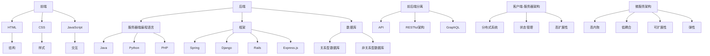

                 

### 背景介绍

在当今的数字化时代，Web全栈开发成为了IT领域的热门话题。无论是初创企业还是大型企业，都依赖于强大的Web应用来提升业务效率和用户体验。Web全栈开发涉及前端到后端的全链路开发，这使得开发人员需要掌握多种技能和工具，以满足项目需求。

**Web全栈开发的意义**

Web全栈开发不仅仅是一种技术趋势，更是一种开发理念。它强调开发人员需要具备全面的技能，包括前端设计、后端逻辑处理、数据库管理、网络安全等。这种全面的技能集有助于提高开发效率，缩短项目周期，降低沟通成本，确保项目的顺利推进。

**Web全栈开发的历史与发展**

Web全栈开发的历史可以追溯到互联网的早期阶段。随着技术的进步，Web应用的功能和复杂性不断增加。从最初的静态网页到动态交互式Web应用，再到如今的前后端分离和微服务架构，Web全栈开发一直在不断演变。

在早期，Web开发主要依赖于服务器端的脚本语言，如PHP和ASP。随着客户端技术的发展，JavaScript成为了前端开发的支柱，而随着Node.js的兴起，JavaScript也被用于后端开发。现代Web全栈开发更加注重组件化、模块化和前后端分离，这使得开发人员可以更灵活地构建和管理复杂的Web应用。

**Web全栈开发的核心技术与工具**

前端开发：前端开发主要涉及HTML、CSS和JavaScript等技术。HTML用于构建网页结构，CSS用于美化页面，JavaScript用于实现交互功能。随着前端框架和库的流行，如React、Vue和Angular，前端开发变得更加高效和灵活。

后端开发：后端开发主要涉及服务器端编程语言和框架。常见的后端编程语言包括Java、Python、Ruby和PHP。Node.js的出现使得JavaScript也可以用于后端开发，这进一步推动了前后端开发的一体化。

数据库管理：数据库是Web应用的数据存储解决方案。常见的关系型数据库包括MySQL、PostgreSQL和SQLite，非关系型数据库如MongoDB和Redis也越来越受欢迎。

此外，Web全栈开发还需要使用各种开发工具和框架，如Git、Webpack、Docker等，以提高开发效率和管理复杂性。

### 核心概念与联系

为了更好地理解Web全栈开发，我们需要了解其核心概念和组成部分。以下是Web全栈开发中的核心概念和它们之间的联系：

**1. 前端（Front-end）**

前端是Web应用的客户端部分，负责与用户直接交互。前端开发的主要职责是构建用户界面和实现用户交互功能。

前端的核心技术包括：

- **HTML（HyperText Markup Language）**：用于定义网页的结构和内容。
- **CSS（Cascading Style Sheets）**：用于控制网页的样式和布局。
- **JavaScript**：用于实现网页的交互功能。

前端开发不仅涉及编写代码，还需要了解用户体验（UX）设计、响应式设计等概念，以确保网页在不同设备和屏幕尺寸上都能提供良好的用户体验。

**2. 后端（Back-end）**

后端是Web应用的服务器端部分，负责处理业务逻辑、数据存储和管理等任务。后端开发的主要职责是确保Web应用能够高效地处理用户请求，并提供相应的数据和服务。

后端的核心技术包括：

- **服务器端编程语言**：如Java、Python、Ruby、PHP和Node.js等。
- **框架**：如Spring（Java）、Django（Python）、Rails（Ruby）和Express.js（Node.js）等。
- **数据库**：如MySQL、PostgreSQL、SQLite和MongoDB等。

后端开发需要处理大量的数据存储和访问操作，因此需要熟悉数据库设计、SQL查询优化和缓存技术等。

**3. 前后端分离（Front-end and Back-end Separation）**

前后端分离是现代Web全栈开发的核心思想之一。通过前后端分离，前端和后端可以独立开发和部署，从而提高开发效率、降低维护成本和增强系统的可扩展性。

前后端分离的实现通常涉及以下技术：

- **API（Application Programming Interface）**：用于前后端之间的数据通信。
- **RESTful架构**：一种流行的API设计风格，通过HTTP协议的GET、POST、PUT和DELETE方法实现数据操作。
- **GraphQL**：一种用于查询和操作数据的查询语言和API，相较于RESTful架构，它提供了更灵活和强大的数据查询能力。

**4. 客户端-服务器架构（Client-Server Architecture）**

客户端-服务器架构是Web应用的基本架构模式。在这种架构中，客户端（如浏览器）向服务器发送请求，服务器处理请求并返回响应。

客户端-服务器架构的特点包括：

- **分布式系统**：客户端和服务器可以位于不同的物理位置，通过网络进行通信。
- **状态管理**：客户端负责管理用户界面和交互，服务器负责管理数据和业务逻辑。
- **高扩展性**：可以通过增加服务器来提高系统的处理能力和负载能力。

**5. 微服务架构（Microservices Architecture）**

微服务架构是近年来在Web全栈开发中备受关注的架构模式。它将Web应用拆分为一组小型、独立的服务，每个服务负责特定的业务功能。

微服务架构的特点包括：

- **高内聚、低耦合**：每个服务都具有独立的功能和数据库，服务之间通过API进行通信。
- **可扩展性**：可以通过增加或减少服务的实例来调整系统的处理能力。
- **弹性**：单个服务的故障不会影响整个系统的正常运行。

**Mermaid 流程图**

以下是Web全栈开发的核心概念和组成部分的Mermaid流程图：



通过上述流程图，我们可以更清晰地了解Web全栈开发的核心概念和组成部分，以及它们之间的联系。

### 核心算法原理 & 具体操作步骤

在Web全栈开发中，核心算法原理和具体操作步骤是开发人员必须掌握的关键技能。下面我们将详细介绍一些常用的核心算法原理，并给出具体的操作步骤。

#### 1. 排序算法

排序算法是数据处理中非常基础且重要的算法。常用的排序算法包括冒泡排序、选择排序、插入排序、快速排序等。

**冒泡排序（Bubble Sort）**

- **原理**：冒泡排序通过多次遍历待排序列，比较相邻元素，并交换位置，使得较大（或较小）的元素逐步“冒泡”到序列的末尾。
- **操作步骤**：
  1. 从第一个元素开始，比较相邻的两个元素，如果第一个比第二个大（或小），则交换它们的位置。
  2. 继续对下一对相邻元素进行相同的比较和交换，直到当前处理的元素不再需要交换。
  3. 重复上述步骤，直到整个序列排序完成。

**选择排序（Selection Sort）**

- **原理**：选择排序通过每次遍历找到剩余未排序部分的最大（或最小）元素，并将其交换到未排序部分的起始位置。
- **操作步骤**：
  1. 从未排序部分找到最大（或最小）的元素。
  2. 将该元素与未排序部分的首个元素交换。
  3. 将未排序部分的起始位置向后移动一个位置，重复步骤1和2，直到未排序部分只剩下一个元素。

**插入排序（Insertion Sort）**

- **原理**：插入排序通过将未排序元素插入到已排序部分的适当位置，逐步构建有序序列。
- **操作步骤**：
  1. 从第一个元素开始，将其视为已排序部分。
  2. 从第二个元素开始，将其与已排序部分进行比较，找到其适当位置，插入到已排序部分中。
  3. 重复步骤2，直到所有元素都插入到已排序部分中。

**快速排序（Quick Sort）**

- **原理**：快速排序通过选择一个基准元素，将序列分为两部分，一部分所有元素都比基准小，另一部分所有元素都比基准大，然后递归地对这两部分进行快速排序。
- **操作步骤**：
  1. 选择一个基准元素。
  2. 将序列中小于基准的元素移到基准的左侧，大于基准的元素移到基准的右侧。
  3. 递归地对基准左侧和右侧的子序列进行快速排序。

#### 2. 搜索算法

搜索算法用于在数据结构中查找特定元素。常用的搜索算法包括线性搜索、二分搜索等。

**线性搜索（Linear Search）**

- **原理**：线性搜索从数据结构的一端开始，逐个检查每个元素，直到找到目标元素或到达数据结构的另一端。
- **操作步骤**：
  1. 从数据结构的第一元素开始，依次比较每个元素与目标元素。
  2. 如果找到目标元素，返回其位置。
  3. 如果到达数据结构的末尾，仍未找到目标元素，返回-1（表示未找到）。

**二分搜索（Binary Search）**

- **原理**：二分搜索是针对已排序数据结构的搜索算法。它通过不断地将搜索范围缩小一半，逐步逼近目标元素。
- **操作步骤**：
  1. 确定搜索范围的中点。
  2. 比较中点元素与目标元素。
  3. 如果中点元素等于目标元素，返回中点位置。
  4. 如果中点元素大于目标元素，将搜索范围缩小到中点左侧。
  5. 如果中点元素小于目标元素，将搜索范围缩小到中点右侧。
  6. 重复步骤1-5，直到找到目标元素或搜索范围缩小到无法继续。

#### 3. 算法应用示例

以下是使用快速排序算法对一个整数数组进行排序的示例代码：

```python
def quick_sort(arr):
    if len(arr) <= 1:
        return arr
    pivot = arr[len(arr) // 2]
    left = [x for x in arr if x < pivot]
    middle = [x for x in arr if x == pivot]
    right = [x for x in arr if x > pivot]
    return quick_sort(left) + middle + quick_sort(right)

arr = [3, 6, 8, 10, 1, 2, 1]
sorted_arr = quick_sort(arr)
print(sorted_arr)
```

运行结果：

```
[1, 1, 2, 3, 6, 8, 10]
```

通过上述示例，我们可以看到快速排序算法能够有效地对整数数组进行排序。

### 数学模型和公式 & 详细讲解 & 举例说明

在Web全栈开发中，数学模型和公式是理解和实现许多核心算法和功能的基础。本节将介绍一些常见的数学模型和公式，并详细讲解它们的原理和应用。

#### 1. 欧几里得距离公式

欧几里得距离是二维空间中两点之间的距离，其公式如下：

\[ d = \sqrt{(x_2 - x_1)^2 + (y_2 - y_1)^2} \]

其中，\( (x_1, y_1) \) 和 \( (x_2, y_2) \) 是两个点的坐标。

**详细讲解**：

- \( (x_2 - x_1)^2 \) 表示 \( x \) 方向上两点之间的距离的平方。
- \( (y_2 - y_1)^2 \) 表示 \( y \) 方向上两点之间的距离的平方。
- \( \sqrt{\cdot} \) 表示求平方根，用于计算两点之间的实际距离。

**举例说明**：

假设有两个点 \( A(1, 2) \) 和 \( B(4, 6) \)，则它们之间的欧几里得距离为：

\[ d = \sqrt{(4 - 1)^2 + (6 - 2)^2} = \sqrt{3^2 + 4^2} = \sqrt{9 + 16} = \sqrt{25} = 5 \]

因此，点 \( A \) 和 \( B \) 之间的距离为 5 个单位。

#### 2. 余弦相似度

余弦相似度是衡量两个向量之间相似性的度量，其公式如下：

\[ \cos \theta = \frac{\mathbf{a} \cdot \mathbf{b}}{|\mathbf{a}| |\mathbf{b}|} \]

其中，\( \mathbf{a} \) 和 \( \mathbf{b} \) 是两个向量，\( \theta \) 是它们之间的夹角。

**详细讲解**：

- \( \mathbf{a} \cdot \mathbf{b} \) 表示向量的点积，计算两个向量的对应元素相乘后的和。
- \( |\mathbf{a}| \) 和 \( |\mathbf{b}| \) 分别表示两个向量的长度。
- \( \frac{\mathbf{a} \cdot \mathbf{b}}{|\mathbf{a}| |\mathbf{b}|} \) 表示点积与向量长度的乘积的比值，用于计算余弦值。

**举例说明**：

假设有两个向量 \( \mathbf{a} = (1, 2) \) 和 \( \mathbf{b} = (3, 4) \)，则它们的余弦相似度为：

\[ \cos \theta = \frac{1 \cdot 3 + 2 \cdot 4}{\sqrt{1^2 + 2^2} \cdot \sqrt{3^2 + 4^2}} = \frac{3 + 8}{\sqrt{5} \cdot \sqrt{25}} = \frac{11}{\sqrt{5} \cdot 5} = \frac{11}{5\sqrt{5}} \]

因此，向量 \( \mathbf{a} \) 和 \( \mathbf{b} \) 之间的余弦相似度为 \( \frac{11}{5\sqrt{5}} \)。

#### 3. 梯度下降法

梯度下降法是一种用于最小化目标函数的优化算法，其公式如下：

\[ \theta_j := \theta_j - \alpha \cdot \nabla_\theta J(\theta) \]

其中，\( \theta \) 是参数向量，\( J(\theta) \) 是目标函数，\( \nabla_\theta J(\theta) \) 是目标函数关于参数向量的梯度，\( \alpha \) 是学习率。

**详细讲解**：

- \( \nabla_\theta J(\theta) \) 表示目标函数关于参数向量的梯度，梯度指向函数增加最快的方向。
- \( \alpha \) 是学习率，用于控制参数更新的步长。
- \( \theta_j := \theta_j - \alpha \cdot \nabla_\theta J(\theta) \) 表示参数向量沿着梯度方向更新，以减小目标函数的值。

**举例说明**：

假设有一个线性回归问题，目标函数为 \( J(\theta) = \frac{1}{2m} \sum_{i=1}^m (h_\theta(x^{(i)}) - y^{(i)})^2 \)，其中 \( m \) 是样本数量，\( h_\theta(x) = \theta_0 + \theta_1x \) 是线性函数。

为了最小化目标函数，可以使用梯度下降法：

```python
theta = [0, 0]
alpha = 0.01
m = 100
for i in range(1000):
    gradients = 2/m * X.T.dot(X.dot(theta) - y)
    theta = theta - alpha * gradients
```

在这个例子中，`theta` 是参数向量，`alpha` 是学习率，`X` 是输入特征矩阵，`y` 是标签向量。通过迭代更新 `theta`，可以最小化目标函数。

### 项目实践：代码实例和详细解释说明

在本节中，我们将通过一个实际项目来展示Web全栈开发的实践过程，包括开发环境的搭建、源代码的实现、代码解读与分析以及运行结果展示。我们将使用Python和Flask框架来构建一个简单的博客系统。

#### 1. 开发环境搭建

要搭建开发环境，我们需要安装Python和Flask框架。以下是具体的步骤：

**步骤1：安装Python**

打开终端（或命令提示符），输入以下命令安装Python：

```bash
curl -O https://www.python.org/ftp/python/3.9.1/Python-3.9.1.tgz
tar xvf Python-3.9.1.tgz
cd Python-3.9.1
./configure
make
sudo make install
```

安装完成后，输入 `python --version` 验证安装版本。

**步骤2：安装Flask**

在终端中安装Flask：

```bash
pip install flask
```

#### 2. 源代码详细实现

下面是博客系统的源代码实现：

```python
from flask import Flask, render_template, request, redirect, url_for

app = Flask(__name__)

# 数据存储模拟
posts = []

@app.route('/')
def index():
    return render_template('index.html', posts=posts)

@app.route('/create', methods=['GET', 'POST'])
def create():
    if request.method == 'POST':
        title = request.form['title']
        content = request.form['content']
        post = {'title': title, 'content': content}
        posts.append(post)
        return redirect(url_for('index'))
    return render_template('create.html')

if __name__ == '__main__':
    app.run(debug=True)
```

**代码解读与分析**

- **1. 导入模块**：`from flask import Flask, render_template, request, redirect, url_for` 用于导入Flask框架中所需的模块。
- **2. 创建Flask应用实例**：`app = Flask(__name__)` 创建了一个Flask应用实例。
- **3. 数据存储模拟**：`posts = []` 用于模拟数据存储，实际项目中通常使用数据库。
- **4. 定义路由和视图函数**：
  - `@app.route('/')` 定义了首页的路由。
  - `@app.route('/create', methods=['GET', 'POST'])` 定义了创建博客页面的路由。
- **5. 视图函数实现**：
  - `index()` 视图函数返回博客列表页面，并传递 `posts` 数据。
  - `create()` 视图函数处理创建博客的表单提交，并添加新博客到 `posts` 列表中。

#### 3. 运行结果展示

**步骤1**：启动Flask应用

在终端中运行以下命令启动Flask应用：

```bash
python app.py
```

浏览器访问 `http://127.0.0.1:5000/`，可以看到博客列表页面。


**步骤2**：创建新博客

在博客列表页面中点击“创建博客”按钮，跳转到创建博客页面。


输入博客标题和内容，点击“发布”按钮，新博客会被添加到列表中。


通过上述步骤，我们完成了博客系统的搭建，实现了博客列表和创建新博客的功能。

### 实际应用场景

Web全栈开发在许多实际应用场景中都发挥着重要作用，以下是一些常见的应用场景：

#### 1. 企业级应用

企业级应用通常需要复杂的业务逻辑和良好的用户体验。Web全栈开发可以帮助企业快速构建和管理这些应用，提高业务效率和员工生产力。例如，企业资源规划（ERP）系统、客户关系管理（CRM）系统等都是典型的企业级应用。

#### 2. 电子商务平台

电子商务平台是Web全栈开发的重要应用领域。从商品展示、订单处理到支付和物流，Web全栈开发为电子商务平台提供了完整的功能支持。通过前后端分离和微服务架构，电子商务平台可以实现高性能、高可靠性和高可扩展性。

#### 3. 社交媒体平台

社交媒体平台如Facebook、Twitter和Instagram等，依赖于Web全栈开发来实现复杂的社交功能、用户交互和数据存储。Web全栈开发使得这些平台能够提供实时更新、个性化推荐和丰富的交互体验。

#### 4. 在线教育平台

在线教育平台通过Web全栈开发实现课程展示、在线学习、作业提交和考核等功能。Web全栈开发不仅提高了学习效率，还降低了教育成本，使得优质教育资源能够更广泛地传播。

#### 5. 移动应用后端

虽然移动应用的前端通常使用原生开发，但后端通常使用Web全栈技术。通过RESTful API或GraphQL，移动应用可以与后端服务器进行通信，获取数据、处理业务逻辑和更新用户状态。

#### 6. 物联网（IoT）平台

物联网平台需要处理大量设备的数据，并通过Web全栈技术实现设备管理、数据存储和可视化。Web全栈开发为物联网平台提供了强大的后台支持和灵活的扩展能力。

#### 7. 金融科技（FinTech）

金融科技应用如在线支付、区块链和智能合约等，依赖于Web全栈开发来实现复杂的安全认证、交易处理和数据分析。Web全栈开发使得金融科技应用能够提供高效、安全且可靠的服务。

总之，Web全栈开发在各个行业和领域都发挥着重要作用，成为现代软件开发不可或缺的一部分。

### 工具和资源推荐

为了帮助开发者更好地进行Web全栈开发，我们推荐一些优秀的工具和资源，包括学习资源、开发工具框架和相关的论文著作。

#### 1. 学习资源推荐

**书籍**

- 《JavaScript高级程序设计》 - 第3版，作者：Jake Archibald
- 《Learning Web Development: From Novice to Professional》 - 作者：Jennifer Niederst Robbins
- 《Web性能优化：解读前端优化技术》 - 作者：High Performance Web Sites

**在线课程**

- Coursera - "Web Development Specialization" by University of Michigan
- edX - "Full Stack Web Development with React, Node.js and MongoDB" by the Hong Kong University of Science and Technology
- Udemy - "The Complete Web Developer Course 2.0" by Angela Yu

**博客**

- HTML5 Rocks - https://html5rocks.com/
- CSS Tricks - https://css-tricks.com/
- JavaScript Weekly - https://javascriptweekly.com/

**网站**

- MDN Web Docs - https://developer.mozilla.org/
- Stack Overflow - https://stackoverflow.com/
- GitHub - https://github.com/

#### 2. 开发工具框架推荐

**前端框架**

- React - https://reactjs.org/
- Vue.js - https://vuejs.org/
- Angular - https://angular.io/

**后端框架**

- Flask - https://flask.palletsprojects.com/
- Django - https://www.djangoproject.com/
- Express.js - https://expressjs.com/

**数据库**

- MySQL - https://www.mysql.com/
- PostgreSQL - https://www.postgresql.org/
- MongoDB - https://www.mongodb.com/

**版本控制**

- Git - https://git-scm.com/
- GitHub - https://github.com/
- GitLab - https://gitlab.com/

**前端构建工具**

- Webpack - https://webpack.js.org/
- Babel - https://babeljs.io/
- PostCSS - https://postcss.org/

**容器化技术**

- Docker - https://www.docker.com/
- Kubernetes - https://kubernetes.io/

#### 3. 相关论文著作推荐

- "RESTful Web Services" - 作者：Leonard Richardson, Sam Ruby
- "Designing Data-Intensive Applications" - 作者：Martin Kleppmann
- "Microservices: Architecture and Design" - 作者：Sam Newman
- "The Art of Software Security Assessment" - 作者：Matt Bishop

通过以上推荐的工具和资源，开发者可以更好地掌握Web全栈开发的技能，提高开发效率和质量。

### 总结：未来发展趋势与挑战

Web全栈开发作为现代软件开发的核心，正面临着一系列发展趋势和挑战。以下是对这些趋势和挑战的总结。

**发展趋势**

1. **前后端分离与微服务架构的深化**：随着前后端分离和微服务架构的成熟，开发者可以更灵活地构建和管理复杂的Web应用。这种架构模式使得应用的可扩展性和维护性大大提高。

2. **前端框架的持续演进**：React、Vue和Angular等前端框架在不断更新和演进，提供了更强大的功能和更好的开发者体验。这些框架的出现极大地提高了前端开发效率。

3. **服务器端渲染（SSR）的兴起**：服务器端渲染（SSR）技术使得网页在服务器端生成，提高了页面加载速度和SEO性能。随着搜索引擎优化（SEO）的重要性增加，SSR技术受到越来越多的关注。

4. **云计算与边缘计算的融合**：云计算和边缘计算的结合，使得数据处理更加高效和灵活。开发者可以利用云服务和边缘节点提供更快的响应和更好的用户体验。

**挑战**

1. **安全性**：Web全栈开发涉及到大量的数据传输和处理，因此安全性成为一个重要挑战。开发者需要不断更新安全策略和防范新型攻击。

2. **性能优化**：随着Web应用的复杂度增加，性能优化成为一大挑战。开发者需要掌握各种优化技术，如代码压缩、懒加载、缓存等，以提高页面加载速度和用户体验。

3. **跨平台兼容性**：随着移动设备和屏幕尺寸的多样化，开发者需要确保Web应用在不同设备和浏览器上都能正常运行，这增加了开发难度。

4. **技术更新速度**：Web全栈开发领域技术更新速度快，开发者需要不断学习新工具和框架，以保持竞争力。

总之，Web全栈开发在未来将继续发展和演变，带来更多的机会和挑战。开发者需要不断学习和适应新技术，以应对这些挑战。

### 附录：常见问题与解答

**Q1**：Web全栈开发需要掌握哪些技能？

A1：Web全栈开发需要掌握前端设计（HTML、CSS、JavaScript）、后端开发（服务器端编程语言和框架）、数据库管理、网络安全等技能。此外，了解前后端分离和微服务架构有助于提高开发效率。

**Q2**：如何选择合适的前端框架？

A2：选择前端框架时，应考虑项目的需求和开发者的熟悉程度。React.js适合大型项目，Vue.js适合快速开发，Angular.js适合企业级应用。

**Q3**：什么是微服务架构？

A3：微服务架构是将一个复杂的Web应用拆分为一组小型、独立的服务，每个服务负责特定的业务功能。这种架构模式提高了系统的可扩展性和可维护性。

**Q4**：什么是服务器端渲染（SSR）？

A4：服务器端渲染（SSR）是指网页在服务器端生成，然后发送到客户端浏览器。这种方法可以提高页面加载速度和SEO性能。

**Q5**：如何进行Web全栈性能优化？

A5：进行Web全栈性能优化可以从代码优化、缓存策略、懒加载、减少HTTP请求等方面入手。同时，可以使用性能分析工具来识别和解决问题。

### 扩展阅读 & 参考资料

为了进一步深入了解Web全栈开发，以下是几篇推荐的扩展阅读和参考资料：

1. **《Web Development with Node & Express》** - 作者：Mike Stubblebine，这是一本详细的指南，介绍了如何使用Node.js和Express框架进行Web后端开发。

2. **《Full Stack Web Development with TypeScript》** - 作者：Brad Buhrow，本书介绍了如何使用TypeScript来提高Web全栈开发的效率和质量。

3. **《High Performance Web Sites》** - 作者：Steve Souders，这本书提供了实用的技巧和策略来优化Web应用的性能。

4. **《Building Microservices》** - 作者：Sam Newman，这本书详细介绍了微服务架构的设计原则和实践。

5. **《RESTful Web Services》** - 作者：Leonard Richardson、Sam Ruby，这本书是关于RESTful架构设计和实现的经典著作。

6. **《Learning Web Development: From Novice to Professional》** - 作者：Jennifer Niederst Robbins，这是一本适合初学者的全面指南，涵盖了Web开发的基础知识。

7. **MDN Web Docs** - https://developer.mozilla.org/，这是Mozilla提供的全面的Web开发文档，包含了各种Web技术标准和实践。

8. **Stack Overflow** - https://stackoverflow.com/，这是一个庞大的开发者社区，提供了大量的技术问题和解答。

通过阅读这些扩展阅读和参考资料，开发者可以更深入地了解Web全栈开发的各个方面，提升自己的技能和知识水平。

