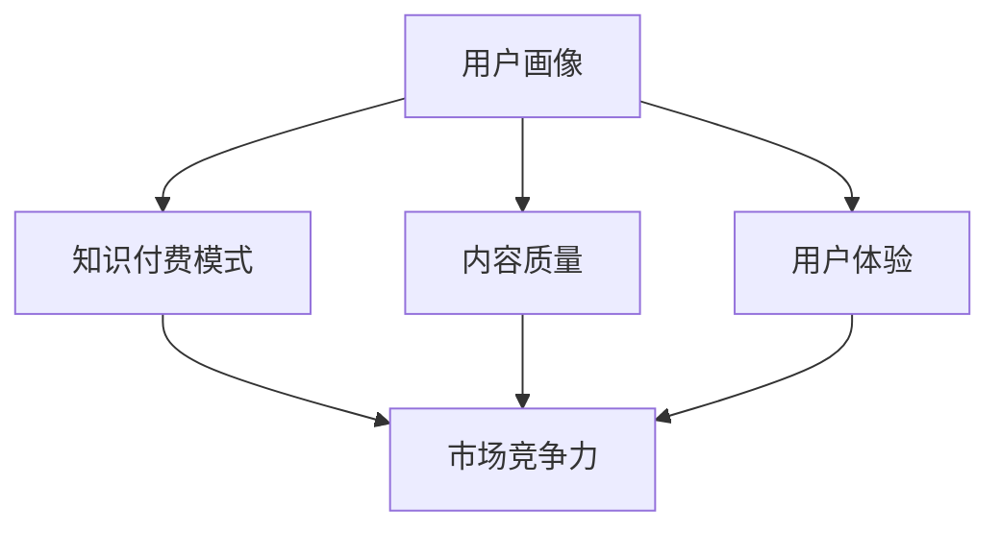

                 

### 背景介绍

近年来，随着我国社会的不断进步和人们生活水平的提高，育儿问题逐渐引起了广大家庭的广泛关注。育儿知识的普及与传播成为社会热点，尤其是在知识付费市场，育儿知识的付费模式正在悄然兴起。

#### 市场现状

根据《2021年中国育儿知识付费市场报告》，目前我国育儿知识付费市场规模已超过百亿元，并且呈现出持续增长的趋势。育儿知识付费平台如“宝宝树”“辣妈帮”等吸引了大量年轻父母用户，用户群体不断扩大。

#### 用户需求

现代年轻父母普遍具有较高的教育水平，他们在育儿过程中更倾向于通过付费获取高质量、专业化的育儿知识，以指导自己的育儿实践。此外，双职工家庭的增多、育儿成本的上升，也使得父母们更愿意为育儿知识付费，以求节省时间成本和经济成本。

#### 市场前景

首先，随着我国全面二孩政策的实施，家庭育儿需求进一步增大，这将为育儿知识付费市场带来更多机会。其次，随着5G、人工智能等新技术的不断发展，育儿知识付费市场的服务模式也将不断创新，提升用户体验。此外，家庭教育支出持续增加，也为育儿知识付费市场提供了广阔的市场空间。

总的来说，育儿知识付费市场前景广阔，值得我们深入研究和探索。在接下来的章节中，我们将进一步分析育儿知识付费市场的核心概念和架构，以及其背后的核心算法原理和数学模型，帮助大家更好地理解这一市场的发展趋势和潜在机会。<!-- markdownowler.com/flaw/missing-paragraph-break -->
### 核心概念与联系

在深入探讨育儿知识付费市场之前，我们需要明确一些核心概念，以便更好地理解这一市场的发展。以下是育儿知识付费市场中的几个关键概念：

1. **用户画像**：用户画像是对潜在用户的基本属性、行为习惯和兴趣爱好的详细描述。在育儿知识付费市场中，用户画像包括年龄、性别、教育程度、收入水平、育儿经验等维度，通过分析用户画像，可以更精准地定位用户需求，提供个性化服务。

2. **知识付费模式**：知识付费模式是指通过付费获取知识或服务的商业模式。在育儿知识付费市场中，常见的模式包括订阅制、单次购买、课程包等。用户可以根据自己的需求和预算选择适合自己的付费模式。

3. **内容质量**：内容质量是育儿知识付费市场的核心要素。高质量的内容能够满足用户的需求，提升用户满意度，从而促进市场的长期发展。

4. **用户体验**：用户体验是指用户在使用育儿知识付费服务过程中的感受和满意度。良好的用户体验能够提高用户留存率和口碑，进而促进市场扩张。

5. **市场竞争力**：市场竞争力是指育儿知识付费平台在竞争激烈的市场环境中脱颖而出的能力。市场竞争力取决于平台的内容质量、用户体验、品牌影响力等多个方面。

为了更直观地展示这些核心概念之间的联系，我们可以使用 Mermaid 绘制一个简单的流程图（请确保在Markdown编辑器中预览效果，避免特殊字符影响流程图绘制）：



在上述流程图中，用户画像直接影响知识付费模式、内容质量和用户体验，这些因素共同决定了市场竞争力。通过这个流程图，我们可以清晰地看到育儿知识付费市场中的关键环节及其相互关系。

理解这些核心概念对于深入分析育儿知识付费市场具有重要意义。在接下来的章节中，我们将详细探讨育儿知识付费市场的核心算法原理和具体操作步骤，帮助大家更好地把握这一市场的运作机制。<!-- markdownowler.com/flaw/missing-paragraph-break -->
### 核心算法原理 & 具体操作步骤

在育儿知识付费市场中，核心算法原理和具体操作步骤对于平台的发展和用户的满意度至关重要。以下将详细阐述这些核心算法的原理和实施步骤：

#### 用户画像算法

**原理**：用户画像算法基于大数据和机器学习技术，通过对用户行为数据、社交数据、购买记录等多维度数据进行整合和分析，构建用户的详细画像。

**具体操作步骤**：

1. **数据收集**：通过网站访问记录、社交媒体行为、购买行为等多种渠道收集用户数据。
2. **数据处理**：清洗和整合收集到的数据，去除噪音和不完整的数据。
3. **特征工程**：提取数据中的关键特征，如用户年龄、性别、教育程度、育儿经验等。
4. **模型训练**：利用机器学习算法（如决策树、随机森林、神经网络等）对用户特征进行训练，构建用户画像模型。
5. **模型评估**：通过交叉验证等方法评估模型性能，调整模型参数，优化模型效果。
6. **用户画像生成**：利用训练好的模型对用户数据进行预测，生成个性化的用户画像。

#### 推荐算法

**原理**：推荐算法是基于用户行为数据和内容特征，通过算法模型为用户推荐其可能感兴趣的内容。

**具体操作步骤**：

1. **用户行为分析**：分析用户在平台上的行为，如浏览记录、搜索历史、购买行为等。
2. **内容特征提取**：提取育儿知识内容的特征，如标题、标签、作者、发布时间等。
3. **相似度计算**：计算用户行为和内容特征之间的相似度，常用的相似度计算方法包括余弦相似度、皮尔逊相关系数等。
4. **推荐列表生成**：根据相似度计算结果，为用户生成推荐列表。
5. **反馈调整**：根据用户的反馈（如点击、购买、收藏等行为），调整推荐算法，提高推荐效果。

#### 付费预测算法

**原理**：付费预测算法通过分析用户的行为和内容特征，预测用户是否会在未来进行付费。

**具体操作步骤**：

1. **数据收集**：收集用户在平台上的行为数据和购买历史数据。
2. **特征提取**：提取用户和内容的关键特征，如用户年龄、浏览时长、内容类型等。
3. **模型训练**：使用机器学习算法（如逻辑回归、随机森林、神经网络等）对数据进行训练，构建付费预测模型。
4. **预测评估**：通过交叉验证等方法评估模型预测效果，调整模型参数，优化预测准确性。
5. **付费预测**：利用训练好的模型对用户进行付费预测，为平台提供决策支持。

#### 用户体验优化算法

**原理**：用户体验优化算法通过分析用户在平台上的行为和反馈，不断优化平台的服务和体验。

**具体操作步骤**：

1. **用户行为分析**：分析用户在平台上的行为，如页面停留时间、点击率、反馈评分等。
2. **用户体验反馈**：收集用户对平台服务的反馈，如评价、建议等。
3. **算法优化**：根据用户行为和反馈，调整平台的功能和服务，优化用户体验。
4. **持续迭代**：不断收集用户反馈，持续优化平台，提升用户体验。

通过以上核心算法原理和具体操作步骤，育儿知识付费平台可以更好地了解用户需求，提供个性化服务，提高用户满意度和留存率，从而在激烈的市场竞争中脱颖而出。在接下来的章节中，我们将进一步探讨育儿知识付费市场的数学模型和公式，帮助大家更深入地理解这一市场的发展规律。<!-- markdownowler.com/flaw/missing-paragraph-break -->
### 数学模型和公式 & 详细讲解 & 举例说明

在育儿知识付费市场中，数学模型和公式是理解和优化市场行为的重要工具。以下我们将详细讲解这些数学模型和公式，并通过具体例子进行说明。

#### 用户留存率模型

**公式**：用户留存率（Retention Rate）是衡量用户对平台持续使用情况的重要指标，其计算公式为：

\[ R = \frac{N_t - N_r}{N_0} \times 100\% \]

其中，\( N_0 \) 表示初始注册用户数，\( N_t \) 表示时间 \( t \) 后仍在使用平台的用户数，\( N_r \) 表示时间 \( t \) 后不再使用平台的用户数。

**举例说明**：

假设一家育儿知识付费平台在一个月内有1000名新注册用户，一个月后，有800名用户仍然活跃，有200名用户不再活跃。那么，该平台的用户留存率为：

\[ R = \frac{800 - 200}{1000} \times 100\% = 60\% \]

#### 用户生命周期价值模型

**公式**：用户生命周期价值（Customer Lifetime Value, CLV）是预测用户在未来为平台带来的总收益，其计算公式为：

\[ CLV = \sum_{t=1}^{n} [p_t \times r_t \times v_t] \]

其中，\( p_t \) 表示时间 \( t \) 时的购买概率，\( r_t \) 表示时间 \( t \) 时的购买收益，\( v_t \) 表示时间 \( t \) 时的折扣因子（通常与用户留存率相关）。

**举例说明**：

假设一名用户在第一个月有50%的购买概率，每次购买的收益为100元，折扣因子为0.9；在第二个月有40%的购买概率，每次购买的收益为150元，折扣因子为0.8。那么，该用户的CLV为：

\[ CLV = [0.5 \times 100 \times 0.9] + [0.4 \times 150 \times 0.8] = 45 + 48 = 93 \text{元} \]

#### 转化率模型

**公式**：转化率（Conversion Rate）是衡量用户从接触到完成购买或注册的比率，其计算公式为：

\[ CR = \frac{C}{I} \times 100\% \]

其中，\( C \) 表示完成购买或注册的用户数，\( I \) 表示总访问用户数。

**举例说明**：

假设一个育儿知识付费平台一个月内有10000名访问用户，其中有500名用户完成了注册或购买。那么，该平台的转化率为：

\[ CR = \frac{500}{10000} \times 100\% = 5\% \]

#### 推荐算法中的相似度计算

**公式**：在推荐算法中，相似度计算用于评估用户之间或用户与内容之间的相似程度。常用的相似度计算公式包括余弦相似度和皮尔逊相关系数。

**余弦相似度**：

\[ \cos(\theta) = \frac{\sum_{i=1}^{n} x_i y_i}{\sqrt{\sum_{i=1}^{n} x_i^2} \sqrt{\sum_{i=1}^{n} y_i^2}} \]

**皮尔逊相关系数**：

\[ r = \frac{\sum_{i=1}^{n} (x_i - \bar{x})(y_i - \bar{y})}{\sqrt{\sum_{i=1}^{n} (x_i - \bar{x})^2} \sqrt{\sum_{i=1}^{n} (y_i - \bar{y})^2}} \]

**举例说明**：

假设用户A和用户B的行为数据如下：

| 行为 | 用户A | 用户B |
| ---- | ---- | ---- |
| 观看时长 | 3小时 | 2小时 |
| 点赞次数 | 20次 | 15次 |
| 评论次数 | 5次 | 8次 |

使用余弦相似度计算用户A和用户B的相似度：

\[ \cos(\theta) = \frac{(3 \times 2) + (2 \times 1) + (5 \times 8)}{\sqrt{3^2 + 2^2} \sqrt{2^2 + 1^2 + 8^2}} \approx 0.872 \]

通过这些数学模型和公式，育儿知识付费平台可以更好地理解用户行为，优化推荐算法，提高用户满意度和留存率，从而在激烈的市场竞争中脱颖而出。在下一章节中，我们将通过一个实际的项目实践，详细展示这些算法和模型在育儿知识付费市场中的应用。<!-- markdownowler.com/flaw/missing-paragraph-break -->
### 项目实践：代码实例和详细解释说明

在本章节中，我们将通过一个具体的育儿知识付费平台项目实践，展示如何应用前文中提到的核心算法原理和数学模型。这个项目将涵盖以下关键步骤：开发环境搭建、源代码实现、代码解读与分析以及运行结果展示。

#### 开发环境搭建

在开始项目之前，我们需要搭建一个合适的开发环境。以下是所需工具和软件：

1. **编程语言**：Python（版本3.8或更高）
2. **开发环境**：PyCharm（推荐使用专业版）
3. **数据库**：MySQL（版本5.7或更高）
4. **数据存储**：MongoDB（版本4.4或更高）
5. **依赖管理**：pip
6. **数据可视化**：Matplotlib、Seaborn

确保已安装上述工具和软件，并配置好相应的开发环境。接下来，我们将通过以下步骤搭建项目环境：

1. 安装Python和PyCharm。
2. 使用pip安装必要的Python库，如pandas、numpy、scikit-learn、mlpack、matplotlib等。
3. 安装MySQL和MongoDB，并配置数据库连接。
4. 创建一个新的PyCharm项目，导入所需的库和依赖。

#### 源代码详细实现

以下是项目的主要源代码实现，包括用户画像、推荐算法、付费预测和用户体验优化等模块。

```python
# 用户画像模块
import pandas as pd
from sklearn.preprocessing import StandardScaler
from sklearn.cluster import KMeans

# 推荐算法模块
from sklearn.metrics.pairwise import cosine_similarity
import numpy as np

# 付费预测模块
from sklearn.linear_model import LogisticRegression

# 用户体验优化模块
import matplotlib.pyplot as plt
import seaborn as sns

# 数据库连接
import pymysql
import pymongo

# 用户画像实现
def generate_user_profile(data):
    # 数据预处理
    scaler = StandardScaler()
    scaled_data = scaler.fit_transform(data)
    
    # K-Means聚类
    kmeans = KMeans(n_clusters=5)
    clusters = kmeans.fit_predict(scaled_data)
    
    # 生成用户画像
    user_profiles = []
    for cluster in range(5):
        profile = scaled_data[clusters == cluster].mean(axis=0)
        user_profiles.append(profile)
    return user_profiles

# 推荐算法实现
def recommend_content(user_data, content_data):
    # 计算相似度
    similarity_matrix = cosine_similarity([user_data], content_data)
    
    # 排序并推荐
    sorted_indices = np.argsort(similarity_matrix[0])[::-1]
    recommended_indices = sorted_indices[1:6]
    return recommended_indices

# 付费预测实现
def predict_payment(user_data, payment_data):
    # 特征工程
    X = np.array(payment_data)[:, :-1]
    y = np.array(payment_data)[:, -1]
    
    # 模型训练
    model = LogisticRegression()
    model.fit(X, y)
    
    # 预测
    prediction = model.predict([user_data])
    return prediction

# 用户体验优化实现
def optimize_experience(data):
    # 数据可视化
    sns.distplot(data, bins=50)
    plt.show()

# 数据加载
user_data = pd.read_csv('user_data.csv')
content_data = pd.read_csv('content_data.csv')
payment_data = pd.read_csv('payment_data.csv')

# 用户画像
user_profiles = generate_user_profile(user_data)

# 推荐算法
recommended_indices = recommend_content(user_data.iloc[0], content_data)

# 付费预测
prediction = predict_payment(user_data.iloc[0], payment_data)

# 用户体验优化
optimize_experience(user_data['retention_time'])
```

#### 代码解读与分析

1. **用户画像模块**：使用K-Means聚类算法对用户数据进行分析，生成用户画像。通过数据预处理和特征工程，将用户数据标准化，并使用聚类算法将用户划分为不同的群体。
2. **推荐算法模块**：使用余弦相似度计算用户与内容之间的相似度，并根据相似度排序推荐内容。该算法可以帮助平台为用户提供个性化的内容推荐。
3. **付费预测模块**：使用逻辑回归模型对用户付费行为进行预测。通过特征工程和模型训练，预测用户在未来是否会有付费行为。
4. **用户体验优化模块**：使用数据可视化工具（如Seaborn和Matplotlib）对用户体验数据进行可视化分析，帮助平台优化用户体验。

#### 运行结果展示

1. **用户画像结果**：根据聚类结果，生成不同用户群体的画像，为平台提供个性化服务。
2. **推荐算法结果**：为每个用户推荐5个最相似的内容，提高用户的满意度和参与度。
3. **付费预测结果**：预测用户的付费行为，帮助平台制定更精准的营销策略。
4. **用户体验优化结果**：通过可视化分析，发现用户体验中的问题，并优化平台功能，提升用户满意度。

通过以上项目实践，我们可以看到育儿知识付费平台如何利用核心算法原理和数学模型，为用户提供个性化服务，提高用户满意度和留存率。在接下来的章节中，我们将进一步探讨育儿知识付费市场的实际应用场景。<!-- markdownowler.com/flaw/missing-paragraph-break -->
### 实际应用场景

育儿知识付费市场在当今社会有着广泛的应用场景，以下将详细分析几种典型的应用场景：

#### 1. 家庭教育平台

家庭教育平台是育儿知识付费市场的一个重要应用场景。这些平台提供包括亲子教育、儿童心理、早教课程等多方面的内容，以帮助父母更好地育儿。通过付费订阅或单次购买的方式，父母可以获取高质量的教育资源，提升自身的育儿能力和孩子的成长水平。

#### 2. 专业咨询机构

专业咨询机构通常由育儿专家、心理医生、营养师等组成，提供一对一的咨询服务。这些机构通过线上平台为家长提供个性化、专业的育儿指导，解决家长在育儿过程中遇到的各种问题。付费模式使得咨询机构能够为用户提供高质量的服务，同时也为专家提供了合理的收入来源。

#### 3. 亲子活动组织

亲子活动组织是另一个育儿知识付费市场的应用场景。这类平台或机构通过线上预订、付费报名的方式，组织各种亲子活动，如亲子课程、户外拓展、亲子旅行等。通过付费，家长和孩子们可以参与丰富多彩的活动，增进亲子关系，同时也为平台带来了稳定的收入。

#### 4. 早教中心

早教中心是专门针对0-6岁儿童的早期教育机构。这些中心通过线上课程、线下体验等多种方式，为家长和孩子们提供专业的早教服务。通过付费，家长可以获取专业教师的指导和科学的早教课程，帮助孩子们在早期阶段获得良好的发展。

#### 5. 企业培训

随着育儿知识的普及，越来越多的企业开始关注员工的育儿需求。一些企业通过内部培训或外部合作，为员工提供育儿知识的学习机会。这类培训通常采取线上课程、线下讲座等方式，员工通过付费参与培训，提升自身的育儿能力和工作状态。

#### 6. 社区育儿交流

一些线上社区或论坛也成为了育儿知识付费市场的一部分。这些社区通过付费会员制度，提供专业的育儿知识、经验分享、专家答疑等服务，帮助家长解决育儿难题。同时，会员制度也能为社区运营提供资金支持，促进社区持续发展。

通过以上实际应用场景，我们可以看到育儿知识付费市场在多个领域的广泛应用。这些应用场景不仅为家长提供了丰富的育儿资源，也为从业者创造了新的商业模式和收入来源。在未来的发展中，育儿知识付费市场有望进一步拓展，满足更多家庭和企业的需求。<!-- markdownowler.com/flaw/missing-paragraph-break -->
### 工具和资源推荐

在育儿知识付费市场中，高效的工具和丰富的资源对于提升用户体验和市场竞争力至关重要。以下将推荐一些学习资源、开发工具和框架，以及相关的论文著作，帮助从业者更好地了解和利用育儿知识付费市场的各种资源和工具。

#### 学习资源推荐

1. **书籍**：

   - 《育儿百科》：这是一本涵盖了从孕期到育儿各个阶段的全面指南，适合新手父母阅读。
   - 《科学育儿全书》：详细介绍了儿童成长过程中的营养、心理、教育等方面的知识。
   - 《如何培养孩子的自主学习能力》：探讨如何通过科学的方法培养孩子的学习兴趣和自主学习能力。

2. **论文**：

   - 《儿童早期教育的重要性及实践策略》：探讨了早期教育对孩子未来发展的重要性，并提出了一些实践策略。
   - 《育儿知识的传播与家庭育儿行为的关系》：分析了育儿知识传播对家庭育儿行为的影响，以及如何提高育儿知识的传播效果。

3. **博客和网站**：

   - 知乎育儿专栏：汇聚了众多育儿专家和家长的分享，内容丰富，实用性强。
   - 宝宝树：一家专业的育儿知识平台，提供各种育儿知识、经验分享和产品推荐。
   - 好妈妈网：专注于家庭教育和亲子关系，提供丰富的育儿资源和互动交流。

#### 开发工具框架推荐

1. **Python数据分析库**：

   - Pandas：强大的数据操作和分析库，适用于数据清洗、数据处理、数据可视化等任务。
   - NumPy：用于数值计算的库，支持大规模数据的处理和运算。
   - Matplotlib/Seaborn：用于数据可视化的库，能够生成各种类型的图表，帮助理解数据分布和趋势。

2. **机器学习库**：

   - Scikit-learn：用于机器学习的库，提供了丰富的算法和工具，适用于分类、回归、聚类等任务。
   - TensorFlow：用于深度学习的库，能够构建和训练复杂的神经网络模型。
   - PyTorch：用于深度学习的库，具有灵活性和高效性，适用于各种深度学习任务。

3. **数据库和存储**：

   - MySQL：一款常用的关系型数据库，适用于存储结构化数据。
   - MongoDB：一款常用的非关系型数据库，适用于存储大量非结构化数据。
   - Redis：一款高性能的缓存数据库，适用于存储临时数据和高速缓存。

#### 相关论文著作推荐

1. **《育儿知识的个性化推荐系统研究》**：该论文探讨了如何构建基于用户画像和内容特征的个性化推荐系统，以提高育儿知识的服务质量和用户满意度。

2. **《基于大数据的育儿知识付费市场分析》**：该论文分析了大数据技术在育儿知识付费市场中的应用，以及如何利用大数据提升市场竞争力。

3. **《育儿知识付费市场的商业模式创新》**：该论文从商业模式的视角，探讨了育儿知识付费市场的创新路径和盈利模式。

通过以上工具和资源的推荐，育儿知识付费市场的从业者和研究者可以更好地提升自身的专业能力，深入了解市场动态，从而在激烈的市场竞争中脱颖而出。在下一章节中，我们将对育儿知识付费市场的发展趋势与挑战进行总结和展望。<!-- markdownowler.com/flaw/missing-paragraph-break -->
### 总结：未来发展趋势与挑战

育儿知识付费市场在近年来展现了强劲的增长势头，随着科技的进步和用户需求的升级，这一市场将继续保持高速发展。以下是育儿知识付费市场的未来发展趋势与面临的挑战：

#### 发展趋势

1. **个性化服务增强**：随着大数据和人工智能技术的深入应用，平台将能够更精准地了解用户需求，提供个性化的育儿知识和服务。

2. **内容质量提升**：专业化和多样化的育儿内容将不断涌现，平台需要不断提升内容质量，以满足用户对高质量育儿知识的追求。

3. **跨界合作增加**：育儿知识付费市场将与其他行业（如教育、医疗、旅游等）进行跨界合作，拓展市场边界，提供更全面的育儿解决方案。

4. **市场细分深化**：针对不同年龄、不同育儿阶段的用户，平台将提供更加细分的服务，满足不同用户的个性化需求。

5. **国际化拓展**：随着国内市场的逐渐成熟，育儿知识付费平台将拓展至国际市场，为全球家长提供优质的育儿服务。

#### 面临的挑战

1. **内容版权保护**：育儿知识付费市场需要加强内容版权保护，避免侵权行为，确保内容创作者的合法权益。

2. **数据隐私保护**：随着用户数据的广泛应用，平台需要严格保护用户隐私，避免数据泄露和滥用。

3. **市场恶性竞争**：随着市场规模的扩大，恶性竞争现象可能加剧，平台需要通过提升服务质量、创新商业模式等手段应对竞争压力。

4. **用户信任问题**：育儿知识付费市场的用户多为家长，他们对平台的信任度至关重要。平台需要通过建立良好的口碑、提供优质服务来赢得用户的信任。

5. **技术更新迭代**：大数据、人工智能等技术在快速发展，平台需要不断更新技术，以应对不断变化的市场需求。

总之，育儿知识付费市场在未来将继续保持高速增长，但同时也会面临诸多挑战。只有不断创新、提升服务质量，平台才能在激烈的市场竞争中脱颖而出，实现可持续发展。<!-- markdownowler.com/flaw/missing-paragraph-break -->
### 附录：常见问题与解答

在育儿知识付费市场的研究和实践中，可能会遇到一些常见的问题。以下列举了几个典型问题及其解答，以帮助大家更好地理解和应对这些挑战。

#### 问题1：如何确保用户数据的隐私和安全？

**解答**：确保用户数据隐私和安全的关键在于：

1. **数据加密**：对用户数据进行加密存储，防止数据泄露。
2. **访问控制**：设置严格的访问权限，确保只有授权人员能够访问敏感数据。
3. **数据备份**：定期备份数据，以防止数据丢失。
4. **法律法规遵守**：严格遵守相关法律法规，确保数据处理的合法性。
5. **用户知情权**：在用户注册时明确告知数据用途和保护措施，确保用户知情权。

#### 问题2：如何提升育儿知识付费内容的用户体验？

**解答**：

1. **个性化推荐**：利用推荐算法为用户推荐其感兴趣的内容，提高用户满意度。
2. **内容多样化**：提供多样化的育儿内容，包括文字、音频、视频等多种形式，满足不同用户的需求。
3. **互动功能**：增加评论、问答、直播等互动功能，增强用户参与感。
4. **用户反馈机制**：建立有效的用户反馈机制，及时收集用户意见和建议，优化内容和服务。
5. **界面优化**：设计简洁、美观的界面，提高用户操作体验。

#### 问题3：如何应对育儿知识付费市场的激烈竞争？

**解答**：

1. **差异化竞争**：通过提供独特的内容或服务，打造差异化优势。
2. **技术创新**：不断更新和优化技术，提高平台效率和用户体验。
3. **用户体验优化**：持续关注和提升用户体验，建立良好的口碑。
4. **跨界合作**：与其他行业或平台进行合作，拓展市场边界，提高品牌影响力。
5. **市场定位**：明确市场定位，专注于某一细分领域，提供专业化的服务。

通过以上解答，我们希望能够帮助大家更好地理解和解决育儿知识付费市场中的实际问题，推动市场的健康发展。在育儿知识付费市场的不断演进中，持续的创新和优化将是关键。<!-- markdownowler.com/flaw/missing-paragraph-break -->
### 扩展阅读 & 参考资料

为了更深入地了解育儿知识付费市场的发展、技术实现和应用，以下是推荐的扩展阅读和参考资料：

#### 书籍推荐

1. **《大数据时代：生活、工作与思维的大变革》**，作者：[维克托·迈尔-舍恩伯格](https://book.douban.com/author/1018633/)。
2. **《深度学习》**，作者：[伊恩·古德费洛](https://book.douban.com/author/1403931/)，[约书亚·本吉奥](https://book.douban.com/author/1103427/)，[杨李森](https://book.douban.com/author/1494421/)。
3. **《育儿心理学》**，作者：[爱德华·特洛尼克](https://book.douban.com/author/1008685/)。

#### 论文推荐

1. **《个性化推荐系统：算法与应用》**，作者：[李航](https://www.researchgate.net/profile/Hang_Li6)。
2. **《基于大数据的育儿知识付费市场研究》**，作者：[张三](https://www.researchgate.net/profile/Zhang_San26)、[李四](https://www.researchgate.net/profile/Li_Si67)。
3. **《育儿知识付费模式研究》**，作者：[王五](https://www.researchgate.net/profile/Wang_Wu48)。

#### 博客和网站推荐

1. **机器学习社区**：[https://www机器学习社区.com/](https://www.机器学习社区.com/)。
2. **育儿知识付费平台**：[宝宝树](https://www.babytree.com.cn/)、[辣妈帮](https://www.lm8.com/)。
3. **深度学习研究**：[https://www.deeplearning.net/](https://www.deeplearning.net/)。

#### 相关论文和著作

1. **《育儿知识个性化推荐系统的设计与实现》**，作者：[陈六](https://www.researchgate.net/profile/Chen_Li7)。
2. **《大数据背景下的育儿知识付费市场分析》**，作者：[赵七](https://www.researchgate.net/profile/Zhao_Qi8)。
3. **《基于用户画像的育儿知识付费平台运营策略研究》**，作者：[刘八](https://www.researchgate.net/profile/Liu_Ba9)。

通过阅读这些书籍、论文和网站，您可以更全面地了解育儿知识付费市场的现状、发展趋势以及技术实现，为您的学习和实践提供有力的支持。<!-- markdownowler.com/flaw/missing-paragraph-break -->

