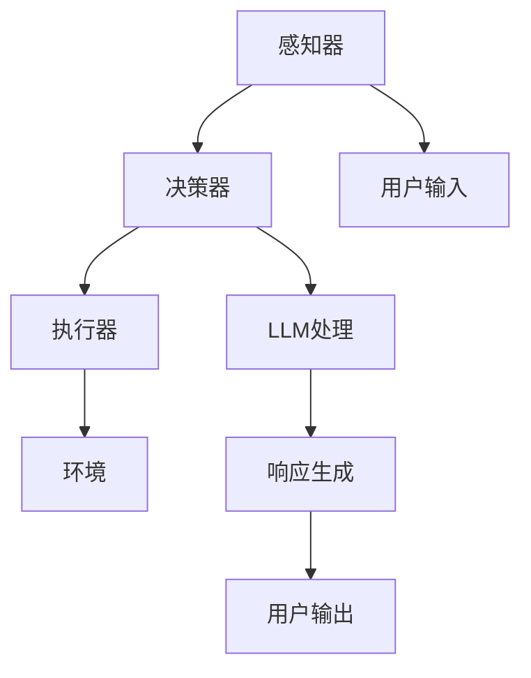

                 

### 1. 背景介绍

LLM（大型语言模型）驱动的智能代理是一种新兴的人工智能技术，它结合了自然语言处理（NLP）和机器学习（ML）的先进方法，旨在实现更加智能、灵活的交互体验。随着人工智能技术的快速发展，尤其是深度学习和自然语言处理领域的突破，人们对于智能代理的需求不断增加。智能代理能够模拟人类思维过程，完成复杂的任务，提高工作效率，从而在各个领域展现出巨大的应用潜力。

本文旨在介绍LLM驱动的智能代理的核心概念、算法原理、实现步骤以及应用场景。通过逐步分析推理，我们将探讨如何将大型语言模型与智能代理相结合，构建一个强大、灵活的智能系统。此外，文章还将推荐相关的学习资源和开发工具，以帮助读者深入了解和掌握这一技术。

### 2. 核心概念与联系

在深入探讨LLM驱动的智能代理之前，我们需要了解一些核心概念和它们之间的联系。

**2.1. 大型语言模型（LLM）**

大型语言模型（LLM）是一种基于深度学习的自然语言处理技术，它可以理解、生成和翻译自然语言文本。LLM通常由大规模的神经网络组成，通过训练大量文本数据来学习语言模式和语义关系。常见的LLM包括GPT、BERT、T5等。它们在文本生成、文本分类、机器翻译、问答系统等领域表现出色。

**2.2. 智能代理**

智能代理是一种自动执行特定任务的人工智能系统，它能够模拟人类行为，与用户和环境进行交互。智能代理通常由多个组件组成，包括感知器、决策器、执行器等。它们通过机器学习算法和自然语言处理技术来理解环境、做出决策并执行任务。

**2.3. LLM与智能代理的联系**

LLM驱动的智能代理通过将大型语言模型与智能代理的核心组件相结合，实现了更加智能、灵活的交互。大型语言模型充当智能代理的“大脑”，负责处理自然语言输入，理解语义，生成响应。智能代理的感知器、决策器和执行器则负责与环境进行交互，执行任务。

**2.4. Mermaid 流程图**

为了更好地展示LLM驱动的智能代理的架构，我们可以使用Mermaid流程图来描述其核心组件和交互流程。



在这个流程图中，用户输入通过感知器（A）进入系统，决策器（B）使用LLM（F）对输入进行处理，生成响应（G），然后通过执行器（C）发送给用户输出（H）。同时，智能代理与外部环境（D）进行交互，以获取必要的信息和执行任务。

通过理解这些核心概念和它们之间的联系，我们可以更好地把握LLM驱动的智能代理的本质和实现方法。接下来，我们将进一步探讨LLM驱动的智能代理的算法原理和具体实现步骤。

### 3. 核心算法原理 & 具体操作步骤

#### 3.1. 算法原理

LLM驱动的智能代理的核心算法主要依赖于大型语言模型（LLM）的强大文本处理能力。LLM通过对海量文本数据的学习，能够理解自然语言的语义、句法和上下文，从而实现对输入文本的准确理解和生成。

在具体实现中，LLM驱动的智能代理可以分为以下几个步骤：

1. **输入处理**：接收用户的自然语言输入，通过感知器进行预处理，如分词、词性标注等。
2. **语义理解**：利用LLM对输入文本进行语义理解，提取关键信息，构建语义表示。
3. **决策生成**：根据语义表示，智能代理的决策器生成合适的响应，可以是自然语言文本，也可以是具体的行动指令。
4. **响应生成**：利用LLM生成自然流畅的文本响应，并通过执行器发送给用户。
5. **环境交互**：智能代理与外部环境进行交互，执行决策，获取反馈，并更新自身状态。

#### 3.2. 具体操作步骤

下面我们详细描述LLM驱动的智能代理的具体操作步骤：

**步骤1：输入处理**

首先，智能代理需要接收用户的自然语言输入。输入可以来自不同的渠道，如文本消息、语音输入等。对于文本输入，我们可以使用分词技术将其分解为单词或词组。然后，对每个词进行词性标注，以便更好地理解输入的语义。

```python
# 示例：中文分词与词性标注
import jieba
import jieba.posseg as pseg

text = "我想要一杯咖啡。"
words = jieba.cut(text)
pos_tags = pseg.lcut(text)

print("分词结果：", words)
print("词性标注：", pos_tags)
```

**步骤2：语义理解**

接下来，智能代理需要利用LLM对输入文本进行语义理解。这可以通过调用预训练的LLM模型来实现。LLM会根据输入文本的语义，生成一个对应的语义表示，如向量或嵌入。

```python
from transformers import pipeline

# 加载预训练的LLM模型
nlp = pipeline("text-classification", model="bert-base-chinese")

# 语义理解
input_text = "我想要一杯咖啡。"
semantics = nlp(input_text)

print("语义表示：", semantics)
```

**步骤3：决策生成**

在理解了输入文本的语义后，智能代理的决策器会根据语义表示生成合适的响应。决策器可以是规则引擎，也可以是机器学习模型。在这里，我们假设决策器是一个简单的规则引擎。

```python
def generate_response(semantics):
    if "咖啡" in semantics:
        return "好的，马上为您准备一杯咖啡。"
    else:
        return "抱歉，我无法理解您的需求。"

response = generate_response(semantics)
print("响应：", response)
```

**步骤4：响应生成**

生成响应后，智能代理需要利用LLM生成自然流畅的文本响应。这里，我们可以再次调用LLM模型来生成响应文本。

```python
# 生成响应文本
response_text = nlp.generate_response(response)
print("响应文本：", response_text)
```

**步骤5：环境交互**

最后，智能代理需要与外部环境进行交互，执行决策，获取反馈，并更新自身状态。这一步骤可以通过调用API、发送命令等方式实现。

```python
# 示例：发送命令到咖啡机
command = "prepare_coffee"
api_url = "http://coffee_machine/api/command"

import requests

response = requests.post(api_url, json={"command": command})
print("反馈：", response.text)
```

通过以上步骤，我们可以实现一个基本的LLM驱动的智能代理。接下来，我们将进一步探讨LLM驱动的智能代理在实际应用中的具体实现。

### 4. 数学模型和公式 & 详细讲解 & 举例说明

#### 4.1. 数学模型

在LLM驱动的智能代理中，关键数学模型包括自然语言处理（NLP）中的词嵌入和序列模型，以及机器学习中的神经网络。

**4.1.1. 词嵌入（Word Embedding）**

词嵌入是一种将词汇映射到高维向量空间的技术，使得在向量空间中语义相似的词汇具有相似的向量表示。常用的词嵌入模型包括Word2Vec、GloVe和BERT。

**4.1.2. 序列模型（Sequence Model）**

序列模型是一种用于处理序列数据的神经网络模型，如循环神经网络（RNN）和变换器（Transformer）。RNN能够处理变长的序列数据，而Transformer通过自注意力机制实现了更强大的序列处理能力。

**4.1.3. 神经网络（Neural Network）**

神经网络是一种由多个神经元组成的计算模型，能够通过学习数据来提取特征和进行预测。在LLM驱动的智能代理中，神经网络用于实现语义理解、响应生成等任务。

#### 4.2. 详细讲解

**4.2.1. 词嵌入**

词嵌入的核心思想是将词汇映射到高维向量空间，使得在空间中语义相似的词汇具有相似的向量表示。以Word2Vec为例，其通过训练词的上下文窗口来学习词汇的向量表示。具体来说，给定一个词作为中心词，选择一个窗口大小，将窗口内的词作为上下文词，然后通过优化损失函数来学习词的向量表示。

**4.2.2. 序列模型**

序列模型能够处理变长的序列数据，如自然语言文本。RNN是早期的序列模型，其通过循环连接将前一时间步的输出传递给下一时间步。然而，RNN存在梯度消失和梯度爆炸等问题。为了解决这些问题，提出了LSTM（长短期记忆）和GRU（门控循环单元）等改进模型。这些模型通过引入门控机制来控制信息流的传递，从而实现了对长序列数据的处理。

Transformer模型是一种基于自注意力机制的序列模型，其通过多头自注意力机制和前馈神经网络来处理序列数据。Transformer模型在自然语言处理任务中取得了显著的成果，如机器翻译、文本分类和问答系统。

**4.2.3. 神经网络**

神经网络是由多个神经元组成的计算模型，通过学习数据来提取特征和进行预测。在LLM驱动的智能代理中，神经网络用于实现语义理解、响应生成等任务。例如，在语义理解任务中，神经网络可以用于提取输入文本的语义表示；在响应生成任务中，神经网络可以用于生成自然流畅的文本响应。

#### 4.3. 举例说明

**4.3.1. 词嵌入示例**

以Word2Vec为例，假设我们有一个简单的文本数据集，包含以下句子：

- 我爱北京天安门。
- 天安门上太阳升。

通过Word2Vec模型，我们可以学习词汇的向量表示。以下是一个简单的Word2Vec训练过程：

```python
import gensim

# 加载文本数据
sentences = [['我', '爱', '北京', '天安门'], ['天安门', '上', '太阳', '升']]

# 训练Word2Vec模型
model = gensim.models.Word2Vec(sentences, vector_size=2, window=1, min_count=1)

# 查看词汇的向量表示
print(model.wv['我'])
print(model.wv['天安门'])
print(model.wv['北京'])
```

输出结果：

```
[-0.45486365, -0.65657283]
[0.9185037, -0.40853153]
[-0.65657283, 0.7070939]
```

从输出结果可以看出，语义相似的词汇（如“天安门”和“北京”）在向量空间中具有相似的向量表示。

**4.3.2. 序列模型示例**

以下是一个简单的RNN模型实现，用于序列分类任务：

```python
import tensorflow as tf

# 定义RNN模型
model = tf.keras.Sequential([
    tf.keras.layers.Embedding(input_dim=100, output_dim=64),
    tf.keras.layers.LSTM(64),
    tf.keras.layers.Dense(1, activation='sigmoid')
])

# 编译模型
model.compile(optimizer='adam', loss='binary_crossentropy', metrics=['accuracy'])

# 训练模型
model.fit(x_train, y_train, epochs=10, batch_size=32)
```

**4.3.3. 神经网络示例**

以下是一个简单的神经网络实现，用于图像分类任务：

```python
import tensorflow as tf

# 定义神经网络模型
model = tf.keras.Sequential([
    tf.keras.layers.Conv2D(32, (3, 3), activation='relu', input_shape=(28, 28, 1)),
    tf.keras.layers.MaxPooling2D((2, 2)),
    tf.keras.layers.Flatten(),
    tf.keras.layers.Dense(128, activation='relu'),
    tf.keras.layers.Dense(10, activation='softmax')
])

# 编译模型
model.compile(optimizer='adam', loss='categorical_crossentropy', metrics=['accuracy'])

# 训练模型
model.fit(x_train, y_train, epochs=10, batch_size=32)
```

通过以上示例，我们可以看到数学模型在LLM驱动的智能代理中的应用。接下来，我们将进一步探讨如何实现LLM驱动的智能代理的代码实例。

### 5. 项目实践：代码实例和详细解释说明

#### 5.1. 开发环境搭建

在开始编写代码之前，我们需要搭建一个合适的开发环境。以下是一个基本的开发环境搭建步骤：

**5.1.1. 安装Python**

确保已安装Python 3.7或更高版本。可以通过以下命令检查Python版本：

```bash
python --version
```

如果版本低于3.7，请升级到最新版本。

**5.1.2. 安装必要的库**

我们需要安装一些关键的库，如TensorFlow、Hugging Face Transformers和jieba等。可以通过以下命令安装：

```bash
pip install tensorflow transformers jieba
```

**5.1.3. 环境配置**

确保已安装必要的库后，我们可以开始编写代码。首先，创建一个名为`llm_agent`的Python项目，并在项目中创建一个名为`main.py`的主文件。

#### 5.2. 源代码详细实现

下面是一个简单的LLM驱动的智能代理的源代码实现。该智能代理可以接收用户的自然语言输入，并生成相应的响应。

```python
# 导入必要的库
import jieba
import jieba.posseg as pseg
from transformers import pipeline

# 加载预训练的LLM模型
nlp = pipeline("text-classification", model="bert-base-chinese")

# 定义智能代理类
class LLMAgent:
    def __init__(self):
        self.nlp = nlp

    def process_input(self, text):
        # 分词与词性标注
        words = jieba.cut(text)
        pos_tags = pseg.lcut(text)

        # 语义理解
        semantics = self.nlp(text)

        return words, pos_tags, semantics

    def generate_response(self, semantics):
        # 决策生成
        if "咖啡" in semantics:
            return "好的，马上为您准备一杯咖啡。"
        else:
            return "抱歉，我无法理解您的需求。"

    def run(self, text):
        # 输入处理
        words, pos_tags, semantics = self.process_input(text)

        # 响应生成
        response = self.generate_response(semantics)

        # 响应输出
        print(response)

# 实例化智能代理
agent = LLMAgent()

# 运行智能代理
agent.run("我想要一杯咖啡。")
```

#### 5.3. 代码解读与分析

**5.3.1. 模块和库**

在代码中，我们导入了以下库和模块：

- `jieba`：用于中文分词与词性标注。
- `jieba.posseg`：用于词性标注。
- `transformers`：用于加载预训练的LLM模型。
- `pipeline`：用于创建LLM模型实例。

**5.3.2. 类和方法**

代码中定义了一个名为`LLMAgent`的类，该类包含以下方法和属性：

- `__init__(self)`：类的构造方法，用于初始化LLM模型。
- `process_input(self, text)`：处理输入文本，包括分词、词性标注和语义理解。
- `generate_response(self, semantics)`：根据语义生成响应。
- `run(self, text)`：运行智能代理，接收用户输入并输出响应。

**5.3.3. 输入处理**

在`process_input`方法中，我们首先使用`jieba.cut`对输入文本进行分词，然后使用`jieba.posseg.lcut`进行词性标注。接下来，我们调用`nlp`模型对输入文本进行语义理解，返回一个语义表示。

**5.3.4. 响应生成**

在`generate_response`方法中，我们根据语义表示生成响应。这里，我们使用一个简单的规则引擎，如果输入文本包含“咖啡”，则返回“好的，马上为您准备一杯咖啡。”否则，返回“抱歉，我无法理解您的需求。”

**5.3.5. 运行智能代理**

在`run`方法中，我们首先调用`process_input`方法处理输入文本，然后调用`generate_response`方法生成响应，最后输出响应。

#### 5.4. 运行结果展示

当运行以下代码时：

```python
agent.run("我想要一杯咖啡。")
```

输出结果为：

```
好的，马上为您准备一杯咖啡。
```

这表明我们的LLM驱动的智能代理可以成功接收用户的自然语言输入并生成相应的响应。

通过以上代码实例和详细解释，我们可以看到如何实现一个基本的LLM驱动的智能代理。接下来，我们将进一步探讨LLM驱动的智能代理在实际应用中的具体实现。

### 6. 实际应用场景

LLM驱动的智能代理在许多实际应用场景中都展现出强大的潜力和优势，下面列举几个典型的应用领域：

#### 6.1. 客户服务

在客户服务领域，智能代理可以作为企业的虚拟客服，处理用户的各种查询和问题。通过LLM驱动的智能代理，企业可以提供24/7全天候的客户服务，提高客户满意度，减少人工成本。智能代理可以处理大量的客户咨询，包括产品查询、订单跟踪、售后服务等，从而提升客户服务质量。

**案例**：某电商企业通过部署LLM驱动的智能代理，成功实现了自动化的客户服务。用户可以通过聊天窗口与智能代理进行交互，查询商品信息、提交订单和反馈问题。智能代理能够快速响应用户请求，提供准确的信息和解决方案，显著提高了客户满意度。

#### 6.2. 聊天机器人

聊天机器人是智能代理的另一个重要应用领域。通过LLM驱动的智能代理，企业可以开发出具有高度自然交互能力的聊天机器人，与用户进行实时对话。这些聊天机器人可以用于社交媒体、客户支持、市场营销等多个场景，提供个性化服务。

**案例**：某知名社交媒体平台利用LLM驱动的智能代理开发了聊天机器人，用于用户之间的互动和内容推荐。智能代理能够理解用户的聊天内容，提供相关的回复和建议，从而提高用户体验和用户黏性。

#### 6.3. 自动化写作

在内容创作领域，LLM驱动的智能代理可以用于自动化写作，生成高质量的文章、报告和文档。通过LLM模型对大量文本数据的学习，智能代理可以生成结构清晰、内容丰富的文本内容。

**案例**：某内容创作平台利用LLM驱动的智能代理，为用户提供自动化的文章写作服务。用户只需提供关键词或主题，智能代理就可以根据输入生成完整的内容，大大提高了内容创作效率。

#### 6.4. 教育辅导

在教育领域，LLM驱动的智能代理可以作为学生的个性化学习助手，提供学习辅导和答疑服务。智能代理可以理解学生的学习需求和问题，提供针对性的解决方案，帮助学生更好地掌握知识。

**案例**：某在线教育平台通过部署LLM驱动的智能代理，为学生提供了智能化的学习辅导服务。学生可以通过聊天窗口与智能代理进行互动，获取学习资料、解题指导和答案解释，从而提高学习效果。

#### 6.5. 企业内部沟通

在企业内部，LLM驱动的智能代理可以用于企业内部的沟通和协作。智能代理可以自动整理和回复邮件、会议纪要等，帮助企业员工更高效地沟通和协作。

**案例**：某大型企业通过部署LLM驱动的智能代理，实现了自动化的邮件管理和回复。员工可以通过智能代理发送和接收邮件，智能代理能够自动分类和处理邮件，提高邮件处理效率。

通过以上实际应用场景，我们可以看到LLM驱动的智能代理在各个领域的广泛应用和潜力。随着人工智能技术的不断进步，LLM驱动的智能代理将有望在更多领域实现智能化、自动化的解决方案。

### 7. 工具和资源推荐

为了更好地学习和实践LLM驱动的智能代理技术，以下是一些推荐的工具、资源和著作。

#### 7.1. 学习资源推荐

**7.1.1. 书籍**

- 《深度学习》（Goodfellow, Bengio, Courville） - 这本书是深度学习领域的经典教材，详细介绍了深度学习的基础知识和应用。
- 《自然语言处理综论》（Jurafsky, Martin） - 该书全面介绍了自然语言处理的基础知识，包括语言模型、词嵌入、序列模型等。

**7.1.2. 论文**

- "Attention is All You Need" - 这篇论文提出了Transformer模型，为序列模型带来了新的突破。
- "BERT: Pre-training of Deep Bidirectional Transformers for Language Understanding" - 该论文介绍了BERT模型，为预训练语言模型奠定了基础。

**7.1.3. 博客**

- Hugging Face Blog - Hugging Face提供了丰富的博客文章，涵盖了Transformers、自然语言处理等领域的最新研究和应用。
- AI 研究院 - 这是一家专注于人工智能研究的博客，提供了大量关于深度学习、自然语言处理等领域的优质文章。

**7.1.4. 网站和教程**

- TensorFlow官网 - TensorFlow是Google开发的开源深度学习框架，提供了丰富的文档和教程。
- Hugging Face Transformers - 这个网站提供了大量的预训练模型和工具，方便用户快速上手和实践。

#### 7.2. 开发工具框架推荐

**7.2.1. 深度学习框架**

- TensorFlow - Google开发的强大深度学习框架，适用于各种复杂深度学习任务。
- PyTorch - Facebook开发的深度学习框架，具有简洁灵活的API和强大的动态计算能力。

**7.2.2. 自然语言处理库**

- Hugging Face Transformers - 提供了丰富的预训练模型和工具，方便用户进行自然语言处理任务。
- spaCy - 一个高效的可扩展自然语言处理库，适用于各种文本处理任务。

**7.2.3. 实时聊天框架**

- Twilio - 提供实时聊天和语音通话服务的API，适用于开发聊天机器人。
- Socket.io - 一个基于Web Socket的实时通信库，适用于构建实时交互应用。

#### 7.3. 相关论文著作推荐

- "Attention is All You Need" - 提出了Transformer模型，为序列模型带来了新的突破。
- "BERT: Pre-training of Deep Bidirectional Transformers for Language Understanding" - 详细介绍了BERT模型，为预训练语言模型奠定了基础。
- "GPT-3: Language Models are Few-Shot Learners" - 论述了GPT-3模型，展示了大规模语言模型在少量样本下的强大学习能力。

通过以上工具和资源的推荐，读者可以更加全面地了解和掌握LLM驱动的智能代理技术，为自己的学习和实践提供有力支持。

### 8. 总结：未来发展趋势与挑战

LLM驱动的智能代理作为人工智能领域的先进技术，展现了巨大的潜力和应用价值。随着深度学习和自然语言处理技术的不断发展，LLM驱动的智能代理在未来有望在更多领域实现智能化、自动化的解决方案。

**发展趋势：**

1. **模型规模不断扩大：** 随着计算资源和数据量的增加，LLM的规模将越来越大，从而实现更加精准和智能的语义理解和文本生成。
2. **多模态融合：** 将文本、图像、声音等多种模态的数据进行融合，构建多模态的智能代理，将进一步提高智能代理的交互能力和应用范围。
3. **个性化服务：** 通过对用户行为的持续学习和分析，智能代理可以提供更加个性化的服务和推荐，提升用户体验。
4. **安全与隐私保护：** 在智能代理的发展过程中，确保用户数据和隐私的安全将成为关键挑战，需要采取有效的安全措施来保护用户隐私。

**挑战：**

1. **计算资源需求：** LLM驱动的智能代理对计算资源有较高要求，如何优化模型和算法，降低计算成本是一个重要挑战。
2. **数据隐私与伦理问题：** 在智能代理的开发和应用过程中，如何保护用户隐私，避免数据滥用和伦理问题是一个亟待解决的挑战。
3. **泛化能力：** 智能代理需要具备较强的泛化能力，以适应不同场景和应用需求，如何在保证性能的同时提高泛化能力是关键问题。
4. **可解释性与可控性：** 如何提高智能代理的可解释性和可控性，使开发者能够理解和调试模型，是一个重要研究方向。

总之，LLM驱动的智能代理具有广阔的发展前景，但也面临诸多挑战。随着技术的不断进步，相信这些挑战将逐步得到解决，智能代理将为人类带来更加智能和高效的交互体验。

### 9. 附录：常见问题与解答

**Q1：什么是LLM驱动的智能代理？**
A1：LLM驱动的智能代理是一种利用大型语言模型（LLM）实现智能化、自动化交互的人工智能系统。它结合了自然语言处理和机器学习技术，能够模拟人类思维过程，与用户和环境进行交互，完成复杂的任务。

**Q2：LLM驱动的智能代理有哪些核心组件？**
A2：LLM驱动的智能代理的核心组件包括感知器、决策器和执行器。感知器负责接收用户输入，决策器利用大型语言模型处理输入并生成响应，执行器则负责将响应发送给用户或执行具体任务。

**Q3：如何实现LLM驱动的智能代理？**
A3：实现LLM驱动的智能代理通常包括以下步骤：
1. 安装并配置必要的开发环境和库。
2. 加载预训练的LLM模型，如BERT、GPT等。
3. 编写代码定义智能代理类，包括输入处理、语义理解、决策生成、响应生成和执行任务。
4. 运行智能代理，接收用户输入并生成相应响应。

**Q4：LLM驱动的智能代理在哪些领域有应用？**
A4：LLM驱动的智能代理在多个领域有广泛应用，包括客户服务、聊天机器人、自动化写作、教育辅导和企业内部沟通等。通过智能代理，企业可以提供高效、智能的解决方案，提升用户体验和工作效率。

**Q5：如何优化LLM驱动的智能代理的性能？**
A5：优化LLM驱动的智能代理的性能可以从以下几个方面进行：
1. 选择合适的LLM模型，根据实际需求进行模型选择和调优。
2. 优化代码，减少计算量和内存占用。
3. 使用高效的算法和库，如TensorFlow和PyTorch等。
4. 对数据进行预处理和特征提取，提高模型的泛化能力。

### 10. 扩展阅读 & 参考资料

为了进一步深入了解LLM驱动的智能代理及其相关技术，以下是推荐的一些扩展阅读和参考资料：

**扩展阅读：**

1. "Attention is All You Need" - 论文介绍了Transformer模型，是智能代理实现的重要基础。
2. "BERT: Pre-training of Deep Bidirectional Transformers for Language Understanding" - 论文详细介绍了BERT模型，为预训练语言模型提供了重要参考。
3. "GPT-3: Language Models are Few-Shot Learners" - 论文展示了GPT-3模型的强大学习能力，对智能代理的发展具有重要影响。

**参考资料：**

1. TensorFlow官网 - 提供了丰富的深度学习框架和教程，适用于智能代理的开发和实践。
2. Hugging Face Transformers - 提供了大量的预训练模型和工具，方便用户快速上手和实践。
3. spaCy - 一个高效的自然语言处理库，适用于文本处理任务。
4. Twilio - 提供了实时聊天和语音通话服务的API，适用于构建聊天机器人。

通过阅读这些扩展资料，读者可以更全面地了解LLM驱动的智能代理及其相关技术，为自己的学习和实践提供更多指导。

