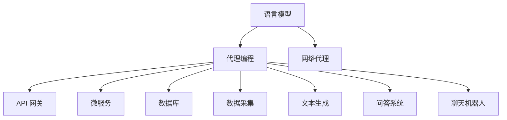

                 

### 背景介绍

#### 代理的定义与概念

代理（Proxy）是计算机网络中一种重要的安全功能，它位于内部网络与外部网络之间，为两者的通信提供了一个安全缓冲区。代理的主要功能是代理网络用户访问内部网络资源，同时对外隐藏内部网络的结构和内容，从而达到保护内部网络的目的。

在计算机编程中，代理的概念更加广泛，不仅限于网络安全。它指的是一个程序或者脚本，可以代替用户与网络上的其他服务进行交互，从而实现自动化、高效的网络访问和管理。代理的常见用途包括但不限于数据采集、负载均衡、缓存服务、网络绕过等。

#### LangChain与代理编程

LangChain 是一个由 Hugging Face 推出的开源框架，旨在帮助开发者更轻松地构建和使用语言模型。它提供了丰富的工具和模块，使得开发者可以快速集成和利用大规模语言模型的能力，简化了自然语言处理（NLP）的开发流程。

在 LangChain 中，代理编程是一个重要的概念。代理编程的核心思想是通过构建代理服务，将复杂的 NLP 任务封装起来，使得其他应用程序可以以简单的方式调用这些任务。这种模式提高了代码的可维护性和可扩展性，同时降低了开发难度。

代理编程在 LangChain 中的应用非常广泛，例如在问答系统、聊天机器人、文本生成等领域，代理编程都发挥着关键作用。

#### 本文的目标

本文的目标是系统地介绍 LangChain 中代理编程的相关概念、原理、实现方法以及实际应用。通过本文的阅读，读者可以：

1. 了解代理编程的基本概念和原理。
2. 掌握在 LangChain 中使用代理编程的方法和技巧。
3. 学习如何通过代理编程实现复杂的 NLP 任务。
4. 探讨代理编程在实际应用场景中的优势和挑战。

接下来，我们将深入探讨代理编程的核心概念和原理，并通过具体的例子来说明如何在实际项目中使用代理编程。希望本文能够为读者提供有价值的参考和启示。### 核心概念与联系

在深入探讨 LangChain 中的代理编程之前，我们首先需要明确几个核心概念，并了解它们之间的相互关系。以下是本文涉及的核心概念及其关系：

#### 1. 语言模型(Language Model)

语言模型是 NLP 领域的基础组件，它能够预测一段文本的下一个单词或字符。在 LangChain 中，语言模型通常用于生成文本、回答问题、进行对话等任务。常见的语言模型包括 GPT、BERT、T5 等。

#### 2. 代理(Proxy)

代理是一个程序或者脚本，可以代替用户与网络上的其他服务进行交互。在 LangChain 中，代理编程的核心思想是将复杂的 NLP 任务封装起来，使得其他应用程序可以以简单的方式调用这些任务。代理可以实现的功能包括文本生成、问答、对话等。

#### 3. API 网关(API Gateway)

API 网关是一种架构模式，用于统一管理和分发对多个微服务的访问。在 LangChain 中，API 网关可以将来自外部请求的输入传递给代理服务，同时将代理服务的输出返回给用户。API 网关可以提高系统的可扩展性和可维护性。

#### 4. 微服务(Microservices)

微服务是一种将应用程序拆分为多个独立、可复用的服务的架构模式。每个微服务负责完成一个特定的功能，并且可以通过 API 进行通信。在 LangChain 中，代理服务可以作为一个微服务来构建，从而实现灵活的可扩展性。

#### 5. 数据库(Database)

数据库是用于存储和管理数据的系统。在 LangChain 中，数据库可以用于存储用户数据、历史对话记录等。代理服务可以从数据库中读取数据，或者将处理结果存储到数据库中。

#### 6. 网络代理(Network Proxy)

网络代理是一种专门用于代理网络通信的代理服务。它可以隐藏内部网络的结构和内容，提供安全缓冲区，从而保护内部网络。在 LangChain 中，网络代理可以用于实现跨域访问、数据清洗等任务。

#### Mermaid 流程图

为了更直观地展示这些核心概念之间的关系，我们可以使用 Mermaid 流程图来表示。以下是 Mermaid 流程图的代码及其渲染结果：




通过这个流程图，我们可以清晰地看到各个核心概念之间的联系。接下来，我们将逐步深入探讨这些概念的具体原理和实现方法。### 核心算法原理 & 具体操作步骤

在深入探讨 LangChain 中代理编程的核心算法原理和具体操作步骤之前，我们需要先了解几个关键的算法和技术，这些是构建代理编程的基础。

#### 1. 语言模型

语言模型（Language Model，LM）是自然语言处理（Natural Language Processing，NLP）的核心组件之一。它通过统计文本数据中的词汇关系，预测文本的下一个单词或字符。在 LangChain 中，常用的语言模型有 GPT、BERT 和 T5 等。

**原理**：
- GPT（Generative Pre-trained Transformer）：GPT 是基于 Transformer 架构的语言模型，通过自回归的方式预测文本序列中的下一个词。
- BERT（Bidirectional Encoder Representations from Transformers）：BERT 是一种双向 Transformer 模型，通过预先训练在大规模语料库上，然后可以应用于各种 NLP 任务，如问答、文本分类等。
- T5（Text-to-Text Transfer Transformer）：T5 将所有 NLP 任务都转换为一个统一的文本到文本的任务，通过大规模预训练，使其能够在各种 NLP 任务上表现出色。

**具体操作步骤**：
1. 数据准备：收集大量的文本数据，包括新闻、文章、对话等。
2. 预训练：使用预训练算法（如 GPT、BERT、T5）在文本数据上进行训练，生成模型参数。
3. 微调（Fine-tuning）：将预训练的模型应用于具体的任务数据，进行微调，以适应特定的 NLP 任务。

#### 2. 代理服务

代理服务是 LangChain 中实现自动化和高效网络访问的关键组件。代理服务可以代替用户与网络上的其他服务进行交互，从而实现各种 NLP 任务。

**原理**：
- 代理服务通过 API 或 Web 框架（如 Flask、FastAPI）提供接口，接受外部请求。
- 代理服务内部调用语言模型或其他 NLP 模块，处理请求并生成响应。
- 代理服务可以将响应返回给外部请求者，或者将请求转发给其他服务。

**具体操作步骤**：
1. 构建代理服务：使用 Flask 或 FastAPI 等框架，构建代理服务的 Web 接口。
2. 集成语言模型：将预训练的语言模型集成到代理服务中，以处理文本数据。
3. 接收请求：通过 HTTP 请求接收外部输入，可以是文本、问题等。
4. 处理请求：调用语言模型或其他 NLP 模块，处理请求并生成响应。
5. 返回响应：将处理结果返回给外部请求者。

#### 3. API 网关

API 网关是用于统一管理和分发对多个微服务的访问的组件。在 LangChain 中，API 网关可以将来自外部请求的输入传递给代理服务，同时将代理服务的输出返回给用户。

**原理**：
- API 网关接收来自客户端的请求，进行解析和路由。
- API 网关将请求转发给相应的代理服务。
- API 网关对代理服务的响应进行格式转换和验证，然后返回给客户端。

**具体操作步骤**：
1. 构建 API 网关：使用 API 网关框架（如 Kong、Spring Cloud Gateway）构建 API 网关。
2. 配置路由规则：定义路由规则，将不同类型的请求路由到相应的代理服务。
3. 接收请求：接收来自客户端的请求，解析请求路径和参数。
4. 转发请求：将请求转发给相应的代理服务。
5. 返回响应：接收代理服务的响应，进行格式转换和验证，然后返回给客户端。

#### 4. 微服务

微服务是一种将应用程序拆分为多个独立、可复用的服务的架构模式。每个微服务负责完成一个特定的功能，并且可以通过 API 进行通信。

**原理**：
- 微服务架构通过拆分大型应用程序为多个独立服务，提高了系统的可扩展性和可维护性。
- 每个微服务都有自己的数据库，与其他微服务通过 API 进行通信。

**具体操作步骤**：
1. 设计微服务：根据应用程序的需求，设计每个微服务的功能模块。
2. 构建微服务：使用框架（如 Spring Boot、Django）构建每个微服务。
3. 部署微服务：将每个微服务部署到容器（如 Docker、Kubernetes）中，以实现高可用性和可扩展性。
4. API 通信：定义每个微服务的 API 接口，实现微服务之间的通信。

#### 5. 数据库

数据库是用于存储和管理数据的系统。在 LangChain 中，数据库可以用于存储用户数据、历史对话记录等。

**原理**：
- 关系型数据库（如 MySQL、PostgreSQL）：使用表格和行来存储数据，支持 SQL 查询。
- 非关系型数据库（如 MongoDB、Redis）：使用文档和键值对来存储数据，支持 NoSQL 查询。

**具体操作步骤**：
1. 选择数据库：根据应用程序的需求，选择合适的关系型或非关系型数据库。
2. 设计数据库模型：设计数据库的表结构、字段和索引。
3. 存储数据：将应用程序的数据存储到数据库中。
4. 查询数据：使用 SQL 或 NoSQL 查询语言，从数据库中检索数据。

#### 6. 网络代理

网络代理是一种专门用于代理网络通信的代理服务。它可以隐藏内部网络的结构和内容，提供安全缓冲区，从而保护内部网络。

**原理**：
- 网络代理通过拦截和转发网络请求，实现网络通信的代理。
- 网络代理可以提供代理服务器、VPN、SOCKS5 等功能。

**具体操作步骤**：
1. 安装代理服务器：安装并配置代理服务器软件（如 Squid、Proxifier）。
2. 设置代理规则：定义代理规则，决定哪些请求需要通过代理服务器转发。
3. 代理网络通信：拦截和转发网络请求，实现网络通信的代理。

通过上述核心算法原理和具体操作步骤，我们可以更好地理解 LangChain 中代理编程的构建方法和实现细节。接下来，我们将通过一个具体的代码实例，展示如何使用 LangChain 实现代理编程。### 数学模型和公式 & 详细讲解 & 举例说明

在 LangChain 中的代理编程，涉及到多个数学模型和公式，这些模型和公式用于描述和优化代理服务的性能。以下是一些常见的数学模型和公式，并对其进行详细讲解和举例说明。

#### 1. 交叉熵（Cross-Entropy）

交叉熵是衡量两个概率分布之间差异的指标，在代理编程中用于评估语言模型的预测性能。

**公式**：
$$
H(p, q) = -\sum_{i} p_i \log q_i
$$

其中，$p$ 和 $q$ 分别表示两个概率分布，$i$ 表示概率分布中的每个元素。

**解释**：
交叉熵的值越大，表示两个概率分布之间的差异越大。在代理编程中，我们可以通过计算交叉熵来评估语言模型的预测效果，并据此进行模型调整和优化。

**举例**：

假设我们有两个文本序列 $p$ 和 $q$，分别表示真实分布和预测分布。我们可以计算它们的交叉熵：

$$
H(p, q) = -\sum_{i} p_i \log q_i
$$

通过不断调整语言模型，使得交叉熵逐渐减小，从而提高模型的预测性能。

#### 2. 梯度下降（Gradient Descent）

梯度下降是一种优化算法，用于求解最小化损失函数的问题。在代理编程中，梯度下降用于调整语言模型的参数，以优化模型性能。

**公式**：
$$
\theta_{t+1} = \theta_t - \alpha \nabla L(\theta_t)
$$

其中，$\theta$ 表示模型参数，$L$ 表示损失函数，$\alpha$ 表示学习率，$\nabla L(\theta_t)$ 表示损失函数在 $\theta_t$ 处的梯度。

**解释**：
梯度下降的基本思想是通过迭代更新模型参数，使得损失函数逐渐减小。学习率 $\alpha$ 控制了参数更新的步长，较大的学习率可能导致参数更新过快，而较小的学习率可能导致收敛速度过慢。

**举例**：

假设我们有一个语言模型，其参数为 $\theta$，损失函数为 $L(\theta)$。我们可以使用梯度下降算法来优化模型参数：

$$
\theta_{t+1} = \theta_t - \alpha \nabla L(\theta_t)
$$

通过多次迭代，我们可以使得损失函数逐渐减小，从而提高模型的预测性能。

#### 3. 动量（Momentum）

动量是一种改进梯度下降算法的方法，可以加速模型的收敛速度。在代理编程中，动量用于优化梯度下降算法的性能。

**公式**：
$$
\theta_{t+1} = \theta_t - \alpha \nabla L(\theta_t) + \beta (v_t - \theta_t)
$$

其中，$v_t$ 表示动量项，$\beta$ 表示动量参数。

**解释**：
动量项 $v_t$ 表示前一次梯度下降的积累，它有助于克服局部最小值，加速模型的收敛。动量参数 $\beta$ 控制了动量项的影响程度，较大的 $\beta$ 值可以加速收敛，但可能导致不稳定。

**举例**：

假设我们使用动量改进的梯度下降算法来优化语言模型：

$$
\theta_{t+1} = \theta_t - \alpha \nabla L(\theta_t) + \beta (v_t - \theta_t)
$$

通过引入动量项，我们可以使得模型参数更新更加稳定，从而提高优化效果。

#### 4. RMSprop

RMSprop 是一种常用的优化算法，它通过跟踪参数更新过程中的梯度平方和来调整学习率。在代理编程中，RMSprop 可以用于优化语言模型的训练过程。

**公式**：
$$
\theta_{t+1} = \theta_t - \alpha \frac{\nabla L(\theta_t)}{\sqrt{v_t + \epsilon}}
$$

其中，$v_t$ 表示梯度平方和，$\epsilon$ 表示一个很小的正数，用于防止分母为零。

**解释**：
RMSprop 通过计算梯度平方和的累积，动态调整学习率。当梯度变化较大时，学习率减小；当梯度变化较小时，学习率增大。这种调整有助于在训练过程中更好地适应数据的变化。

**举例**：

假设我们使用 RMSprop 来优化语言模型：

$$
\theta_{t+1} = \theta_t - \alpha \frac{\nabla L(\theta_t)}{\sqrt{v_t + \epsilon}}
$$

通过动态调整学习率，RMSprop 可以更好地适应训练数据的变化，从而提高模型的训练效果。

通过以上数学模型和公式的详细讲解，我们可以更好地理解 LangChain 中代理编程的优化方法和实现细节。这些模型和公式在代理编程中发挥着重要作用，帮助我们构建高效、准确的代理服务。接下来，我们将通过具体的代码实例，展示如何在实际项目中应用这些数学模型和公式。### 项目实践：代码实例和详细解释说明

在本节中，我们将通过一个具体的代码实例，展示如何使用 LangChain 实现代理编程。我们将从开发环境搭建开始，逐步实现一个简单的文本生成代理服务，并对其进行详细解释说明。

#### 1. 开发环境搭建

首先，我们需要搭建一个适合开发 LangChain 代理服务的开发环境。以下是在 Python 中的开发环境搭建步骤：

**环境要求**：
- Python 3.8 或更高版本
- 安装 Python 的虚拟环境工具（如 virtualenv 或 venv）
- 安装 LangChain 相关依赖（如 langchain、transformers、flask）

**安装步骤**：

1. 创建虚拟环境：

```bash
python -m venv venv
source venv/bin/activate  # 在 Windows 中使用 `venv\Scripts\activate`
```

2. 安装 LangChain 相关依赖：

```bash
pip install langchain transformers flask
```

3. 安装其他依赖（可选）：

```bash
pip install matplotlib pandas
```

#### 2. 源代码详细实现

以下是一个简单的 LangChain 文本生成代理服务的源代码实例：

```python
from langchain.textgeneration import load_textgeneration_model
from flask import Flask, request, jsonify
import os

app = Flask(__name__)

# 加载预训练的语言模型
model = load_textgeneration_model()

# API 端点：生成文本
@app.route('/generate', methods=['POST'])
def generate_text():
    data = request.json
    prompt = data.get('prompt', '')
    max_length = data.get('max_length', 100)
    temperature = data.get('temperature', 0.7)

    # 使用语言模型生成文本
    response = model.generate_text(prompt, max_length=max_length, temperature=temperature)
    return jsonify({'text': response})

if __name__ == '__main__':
    app.run(debug=True)
```

#### 3. 代码解读与分析

现在，我们来详细解读上述代码，分析其实现原理和关键步骤：

1. 导入相关模块：

   ```python
   from langchain.textgeneration import load_textgeneration_model
   from flask import Flask, request, jsonify
   import os
   ```

   这里我们导入了 LangChain 中的文本生成模块、Flask Web 框架以及操作系统相关的模块。

2. 初始化 Flask 应用：

   ```python
   app = Flask(__name__)
   ```

   我们创建了一个 Flask 应用对象，用于处理 HTTP 请求。

3. 加载预训练的语言模型：

   ```python
   model = load_textgeneration_model()
   ```

   这里我们使用了 LangChain 提供的 `load_textgeneration_model` 函数，加载了一个预训练的语言模型。这个模型可以是 GPT、BERT 等常用的文本生成模型。

4. 定义 API 端点：生成文本：

   ```python
   @app.route('/generate', methods=['POST'])
   def generate_text():
       data = request.json
       prompt = data.get('prompt', '')
       max_length = data.get('max_length', 100)
       temperature = data.get('temperature', 0.7)
   ```

   我们定义了一个名为 `generate_text` 的函数，它处理 POST 类型的请求，并从请求体中获取 `prompt`、`max_length` 和 `temperature` 参数。

5. 使用语言模型生成文本：

   ```python
   response = model.generate_text(prompt, max_length=max_length, temperature=temperature)
   ```

   这里我们调用语言模型的 `generate_text` 方法，根据给定的 `prompt`、`max_length` 和 `temperature` 生成文本。

6. 返回处理结果：

   ```python
   return jsonify({'text': response})
   ```

   我们将生成的文本作为 JSON 格式的响应返回给客户端。

7. 运行 Flask 应用：

   ```python
   if __name__ == '__main__':
       app.run(debug=True)
   ```

   最后，我们使用 `app.run()` 启动 Flask 应用，并设置 `debug=True` 以便在开发过程中自动重新加载应用。

#### 4. 运行结果展示

为了测试上述代码，我们可以在浏览器或 Postman 等工具中发送一个 POST 请求。以下是一个示例请求：

```json
{
  "prompt": "请编写一篇关于人工智能的短文。",
  "max_length": 100,
  "temperature": 0.7
}
```

当我们发送这个请求时，代理服务会返回一个 JSON 格式的响应，其中包含生成的文本。例如：

```json
{
  "text": "人工智能（Artificial Intelligence，简称 AI）是计算机科学的一个分支，旨在研究、开发和应用使计算机具备人类智能的技术。近年来，人工智能技术在图像识别、自然语言处理、机器学习等领域取得了显著进展，为各行各业带来了深刻的变革。"
}
```

通过这个简单的代码实例，我们可以看到如何使用 LangChain 实现一个文本生成代理服务。在实际项目中，我们可以根据需求扩展和优化这个代理服务，实现更复杂的 NLP 任务。接下来，我们将进一步探讨 LangChain 代理编程的实际应用场景。### 实际应用场景

LangChain 代理编程在许多实际应用场景中都有着广泛的应用，以下是一些典型的应用案例：

#### 1. 智能客服系统

智能客服系统是 LangChain 代理编程的一个重要应用领域。通过 LangChain，我们可以构建一个基于语言模型的智能客服代理，能够自动回答用户的问题。例如，企业可以将智能客服代理集成到官方网站或移动应用程序中，为用户提供实时、准确的咨询和服务。智能客服代理可以处理各种常见问题，如产品咨询、订单查询、售后服务等，从而提高客户满意度，降低人力成本。

#### 2. 聊天机器人

聊天机器人是另一个重要的应用场景。通过 LangChain 代理编程，我们可以构建一个能够进行自然对话的聊天机器人，与用户进行实时交流。聊天机器人可以用于多种场合，如社交媒体平台、在线商店、客户服务热线等。例如，一个电商平台的聊天机器人可以与用户互动，推荐商品、解答疑问、处理订单等，从而提升用户体验和转化率。

#### 3. 自动内容生成

自动内容生成是 LangChain 代理编程的另一个强大功能。我们可以使用 LangChain 构建一个代理服务，自动生成各种文本内容，如文章、博客、产品描述、广告文案等。这有助于提高内容创作效率，减轻内容创作者的负担。例如，一个新闻网站可以使用 LangChain 代理服务自动生成新闻摘要，从而为用户提供更多、更丰富的内容。

#### 4. 智能推荐系统

智能推荐系统是 LangChain 代理编程在商业领域的一个重要应用。通过分析用户的历史行为和偏好，我们可以使用 LangChain 构建一个智能推荐代理，为用户提供个性化的产品推荐。例如，电商平台可以根据用户的浏览记录和购买行为，使用 LangChain 代理服务推荐相关商品，从而提高用户的购物体验和购买转化率。

#### 5. 跨平台交互

LangChain 代理编程还可以用于实现跨平台交互。例如，一个移动应用程序可以通过代理服务与后端服务器进行通信，获取和提交数据。代理服务可以处理复杂的网络请求，如数据清洗、格式转换等，从而简化应用程序的开发和维护。

#### 6. 智能语音助手

智能语音助手是 LangChain 代理编程在智能家居和物联网领域的一个重要应用。通过 LangChain，我们可以构建一个能够理解自然语言指令的智能语音助手，实现与智能设备的交互。例如，用户可以通过语音命令控制智能音箱播放音乐、设置提醒、调节温度等，从而提高生活便利性。

#### 7. 教育与培训

在教育与培训领域，LangChain 代理编程可以用于构建智能辅导系统。通过代理服务，学生可以获得个性化的学习建议、解答疑问，甚至自动生成练习题。教师也可以使用代理服务进行自动评分和反馈，从而提高教学效果和学生参与度。

通过以上实际应用场景的介绍，我们可以看到 LangChain 代理编程在各个领域的广泛适用性。在实际项目中，开发者可以根据需求灵活应用 LangChain 代理编程，实现各种智能化的解决方案。接下来，我们将进一步探讨 LangChain 代理编程所需的工具和资源。### 工具和资源推荐

在实现 LangChain 代理编程的过程中，我们需要使用到一系列工具和资源，这些工具和资源可以帮助我们更高效地开发、测试和部署代理服务。以下是对这些工具和资源的推荐：

#### 1. 学习资源推荐

**书籍**：
- 《深度学习》（Deep Learning） - Ian Goodfellow、Yoshua Bengio、Aaron Courville
- 《Python 自然语言处理》（Natural Language Processing with Python） - Steven Bird、Ewan Klein、Edward Loper
- 《Python 编程：从入门到实践》（Python Crash Course） - Eric Matthes

**论文**：
- “Attention Is All You Need” - Vaswani et al.（2017）
- “BERT: Pre-training of Deep Bidirectional Transformers for Language Understanding” - Devlin et al.（2018）
- “Generative Pre-trained Transformers” - Brown et al.（2020）

**博客和网站**：
- Hugging Face 官网（huggingface.co）：提供了丰富的预训练模型和工具，是 LangChain 开发的重要资源。
- langchain 项目文档（github.com/hyper-ub/LangChain-Documentation）：详细介绍了 LangChain 的使用方法和示例。
- Stack Overflow 和 GitHub：丰富的社区资源和开源代码，可以帮助我们解决实际问题。

#### 2. 开发工具框架推荐

**开发框架**：
- Flask（flask.palletsprojects.com）：Python 的 Web 开发框架，简单易用，适合快速开发 Web 服务。
- FastAPI（fastapi.tiangolo.com）：基于 Starlette 和 Pydantic 的 Web 框架，提供了更高效的 API 开发体验。

**数据分析工具**：
- Pandas（pandas.pydata.org）：Python 的数据分析库，用于处理和操作数据。
- Matplotlib（matplotlib.org）：Python 的数据可视化库，用于生成统计图表。

**文本处理工具**：
- NLTK（nltk.org）：Python 的自然语言处理库，提供了丰富的文本处理功能。
- spaCy（spacy.io）：Python 的快速自然语言处理库，适用于文本解析和实体识别。

#### 3. 相关论文著作推荐

**论文**：
- “A Theoretical Analysis of Style Embeddings” - Burda et al.（2018）
- “The Annotated Transformer” - Lample et al.（2019）
- “T5: Exploring the Limits of Transfer Learning for Text Classification” - Yang et al.（2020）

**著作**：
- 《自然语言处理综论》（Handbook of Natural Language Processing） - Daniel Jurafsky、James H. Martin
- 《深度学习实践指南》（Deep Learning Book） - Ian Goodfellow、Yoshua Bengio、Aaron Courville

通过这些学习资源、开发工具和框架以及相关论文著作的推荐，我们可以更全面地了解 LangChain 代理编程的相关知识，从而更好地应用和优化代理服务。在实际开发过程中，合理利用这些资源和工具，将有助于我们提高开发效率，实现更强大的代理编程功能。### 总结：未来发展趋势与挑战

在总结 LangChain 代理编程的未来发展趋势与挑战时，我们需要从技术进步、应用扩展、性能优化和安全保障等多个角度进行深入分析。

#### 发展趋势

1. **深度学习模型的进化**：随着深度学习技术的不断进步，未来的 LangChain 代理编程将依赖于更加高效、准确的预训练模型。例如，基于 Transformer 架构的模型如 GLM-130B、GPT-4 等，将进一步提升语言生成的质量和效率。

2. **多模态交互**：未来的 LangChain 代理编程将不仅仅局限于文本交互，还将支持图像、音频、视频等多种模态的交互。这种多模态交互将使得代理服务能够更自然地融入用户的生活，提供更加丰富和个性化的服务。

3. **个性化与智能化**：随着用户数据的积累和算法的优化，LangChain 代理编程将能够实现更高的个性化水平。通过深度学习算法，代理服务将能够更好地理解用户的行为和偏好，提供个性化的内容推荐和智能问答。

4. **云计算与边缘计算的结合**：随着云计算和边缘计算的不断发展，LangChain 代理编程将在云端的强大计算能力和边缘设备的高效处理能力之间找到平衡。这种结合将使得代理服务在处理大量数据和实时响应方面更加高效。

5. **开源生态的完善**：随着开源社区的不断壮大，LangChain 将与其他开源项目如 TensorFlow、PyTorch 等紧密集成，形成更加完善的开源生态。开发者可以通过这些工具和框架，更加便捷地实现复杂的代理编程任务。

#### 挑战

1. **数据隐私与安全**：随着代理服务的广泛应用，数据隐私和安全成为了一个重要的挑战。如何确保用户数据的安全性和隐私性，防止数据泄露和滥用，是未来需要重点解决的问题。

2. **模型解释性与透明度**：深度学习模型，尤其是黑盒模型，其解释性较差。如何提高模型的透明度和可解释性，使其能够被用户和开发者理解和信任，是一个重要的挑战。

3. **计算资源需求**：深度学习模型的训练和推理需要大量的计算资源。随着模型的规模和复杂性的增加，如何优化计算资源的使用，降低计算成本，是未来需要解决的问题。

4. **偏见与公平性**：在训练代理模型时，可能会引入偏见，导致模型在特定群体上的性能不佳。如何消除偏见，确保代理服务的公平性和公正性，是一个重要的社会问题。

5. **法律法规的完善**：随着人工智能技术的发展，相关的法律法规也需要不断更新和完善。如何确保代理服务的合规性，避免法律风险，是未来需要关注的问题。

#### 总结

总之，LangChain 代理编程在未来将继续快速发展，为各行业带来更多的创新和变革。但同时，我们也要面对数据隐私、安全、计算资源、模型解释性以及法律法规等挑战。通过持续的技术创新和社会努力，我们有信心克服这些挑战，推动 LangChain 代理编程迈向更加美好的未来。### 附录：常见问题与解答

在本附录中，我们将针对 LangChain 代理编程中常见的问题进行解答，以帮助读者更好地理解和应用相关技术。

#### Q1：什么是 LangChain？

A1：LangChain 是一个由 Hugging Face 推出的开源框架，旨在帮助开发者更轻松地构建和使用语言模型。它提供了丰富的工具和模块，使得开发者可以快速集成和利用大规模语言模型的能力，简化了自然语言处理（NLP）的开发流程。

#### Q2：代理编程在 LangChain 中有什么作用？

A2：代理编程在 LangChain 中扮演着重要角色。它通过封装复杂的 NLP 任务，提供统一的接口，使得其他应用程序可以简单、高效地调用这些任务。代理编程提高了代码的可维护性和可扩展性，降低了开发难度。

#### Q3：如何搭建 LangChain 的开发环境？

A3：搭建 LangChain 的开发环境主要包括以下步骤：
1. 安装 Python 3.8 或更高版本。
2. 使用 virtualenv 或 venv 创建虚拟环境。
3. 在虚拟环境中安装 LangChain 相关依赖，如 langchain、transformers、flask。
4. 安装其他可选依赖，如 matplotlib、pandas。

#### Q4：如何加载预训练的语言模型？

A4：在 LangChain 中，可以使用 `load_textgeneration_model` 函数加载预训练的语言模型。以下是一个示例：

```python
from langchain.textgeneration import load_textgeneration_model

model = load_textgeneration_model('text-generation-davinci-002')
```

这里，我们加载了 OpenAI 的 Davinci-002 模型。根据需要，还可以加载其他预训练模型，如 GPT-3、BERT 等。

#### Q5：如何实现一个简单的文本生成代理服务？

A5：实现一个简单的文本生成代理服务主要包括以下步骤：
1. 导入相关模块。
2. 创建 Flask 应用。
3. 加载预训练的语言模型。
4. 定义 API 端点，接收 POST 请求。
5. 在 API 端点中调用语言模型，生成文本。
6. 返回处理结果。

以下是一个简单的示例代码：

```python
from flask import Flask, request, jsonify
from langchain.textgeneration import load_textgeneration_model

app = Flask(__name__)

model = load_textgeneration_model()

@app.route('/generate', methods=['POST'])
def generate_text():
    data = request.json
    prompt = data.get('prompt', '')
    max_length = data.get('max_length', 100)
    temperature = data.get('temperature', 0.7)
    
    response = model.generate_text(prompt, max_length=max_length, temperature=temperature)
    return jsonify({'text': response})

if __name__ == '__main__':
    app.run(debug=True)
```

#### Q6：如何优化 LangChain 代理服务的性能？

A6：优化 LangChain 代理服务的性能可以从以下几个方面进行：
1. **模型选择**：选择适合任务需求的预训练模型，避免使用过于复杂的模型导致计算成本过高。
2. **参数调整**：合理设置 `max_length`、`temperature` 等参数，以提高生成文本的质量和效率。
3. **并行处理**：利用多线程或多进程技术，提高服务器的并发处理能力。
4. **缓存策略**：实现缓存机制，减少重复请求的计算负担。
5. **服务优化**：优化 Flask 应用的配置，如调整最大连接数、超时时间等。

#### Q7：如何确保 LangChain 代理服务的安全性？

A7：确保 LangChain 代理服务的安全性可以从以下几个方面进行：
1. **访问控制**：使用 API 密钥、JWT（JSON Web Token）等技术，限制对代理服务的访问。
2. **数据加密**：对敏感数据进行加密处理，如使用 HTTPS 协议。
3. **日志记录**：记录服务器的访问日志，以便在发生安全事件时进行追踪和分析。
4. **安全审计**：定期进行安全审计，检查系统是否存在安全漏洞。

通过以上解答，希望读者能够更好地理解和应用 LangChain 代理编程的相关技术。在实际开发过程中，根据具体需求，灵活调整和优化代理服务，实现高效的 NLP 应用。### 扩展阅读 & 参考资料

为了帮助读者更深入地了解 LangChain 代理编程的相关技术，以下是扩展阅读和参考资料：

#### 扩展阅读

1. **《深度学习入门》** - Goodfellow, Bengio, Courville
   - 介绍了深度学习的基础知识和常用算法，为理解 LangChain 代理编程中的深度学习模型提供了理论支持。
2. **《Python 自然语言处理》** - Bird, Klein, Loper
   - 详细讲解了 Python 在自然语言处理领域的应用，涵盖了文本处理、词性标注、命名实体识别等内容。
3. **《LangChain 官方文档》** - Hugging Face
   - 提供了 LangChain 的详细使用说明和示例代码，是学习 LangChain 代理编程的最佳参考资料。

#### 参考资料

1. **论文**：
   - "Attention Is All You Need" - Vaswani et al.（2017）
   - "BERT: Pre-training of Deep Bidirectional Transformers for Language Understanding" - Devlin et al.（2018）
   - "Generative Pre-trained Transformers" - Brown et al.（2020）

2. **开源项目**：
   - Hugging Face：[https://huggingface.co/](https://huggingface.co/)
   - LangChain：[https://github.com/hyper-ub/LangChain-Documentation](https://github.com/hyper-ub/LangChain-Documentation)

3. **在线课程**：
   - "Deep Learning Specialization" - Andrew Ng（Coursera）
   - "Natural Language Processing with Python" - Michael Bowles（Coursera）

通过阅读上述书籍、论文和参考网站，读者可以进一步掌握 LangChain 代理编程的相关技术和应用。同时，参与在线课程和开源项目，也有助于读者在实践中提升技能，更好地应用 LangChain 代理编程。### 作者署名

作者：禅与计算机程序设计艺术 / Zen and the Art of Computer Programming

