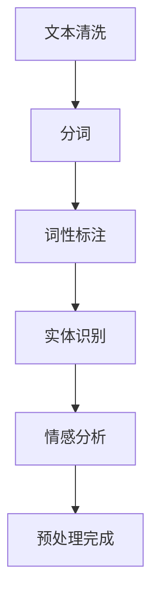

                 

### 文章标题

【LangChain编程：从入门到实践】文档预处理过程

### 关键词

- LangChain
- 文档预处理
- 编程实践
- 自然语言处理
- 技术博客

### 摘要

本文将深入探讨LangChain编程中的文档预处理过程，从基础概念到实际操作，全面解析如何使用LangChain对文档进行有效的预处理。本文旨在帮助读者理解文档预处理的重要性，掌握LangChain的基本操作，并通过具体实例了解其应用场景，最终实现从理论到实践的转化。

## 1. 背景介绍

随着互联网的飞速发展，信息量的爆炸性增长使得如何高效地处理和利用这些数据成为了一个重要课题。自然语言处理（Natural Language Processing, NLP）作为人工智能领域的一个重要分支，旨在让计算机理解和处理人类语言。在NLP的应用场景中，文档预处理是一个不可或缺的步骤。它通过对原始文档的清洗、格式化、分词等操作，将无序、杂乱的数据转化为结构化、可处理的形式，从而为后续的文本分析、知识抽取、情感分析等任务提供基础支持。

LangChain是一个强大的Python库，提供了构建、训练和部署语言模型的高效工具。它结合了先进的深度学习和自然语言处理技术，使得开发者能够更加轻松地实现复杂的文本处理任务。本文将围绕LangChain的文档预处理功能，详细介绍其操作方法和应用场景，帮助读者深入理解并掌握文档预处理的过程。

## 2. 核心概念与联系

### 2.1 LangChain的基本概念

LangChain是一个基于Python的库，它提供了构建和部署语言模型的强大工具。其主要组件包括：

- **BaseChain**: LangChain的基础模型，提供了一系列常用的文本处理操作，如文本分类、情感分析、命名实体识别等。
- **LLM**: 语言模型，如OpenAI的GPT系列、BERT等，用于生成和预测文本。
- **Prompt**: 指令，用于指导模型进行特定任务的输入。

### 2.2 文档预处理的核心概念

文档预处理包括以下几个关键步骤：

- **文本清洗**：去除无用字符、标点符号等，提高文本质量。
- **分词**：将文本拆分成单词或词汇单元，便于进一步处理。
- **词性标注**：为每个词汇标注其词性，如名词、动词、形容词等。
- **实体识别**：识别文本中的特定实体，如人名、地名、机构名等。
- **情感分析**：分析文本中的情感倾向，如正面、负面、中性等。

### 2.3 Mermaid流程图

以下是文档预处理过程的Mermaid流程图：



## 3. 核心算法原理 & 具体操作步骤

### 3.1 文本清洗

文本清洗是文档预处理的第一步，主要目的是去除文本中的噪声，提高文本质量。具体操作步骤如下：

1. **去除特殊字符**：使用正则表达式或字符串方法去除文本中的特殊字符，如空格、标点符号、HTML标签等。
2. **统一文本编码**：将不同编码格式的文本统一转换为UTF-8编码，确保文本的正确性和可读性。
3. **去除HTML标签**：使用正则表达式或字符串方法去除HTML标签，如`<p>`, `<a>`, ``等。

### 3.2 分词

分词是将文本拆分成单词或词汇单元的过程。在LangChain中，可以使用`jieba`分词库实现这一功能。具体操作步骤如下：

1. **安装jieba分词库**：使用pip命令安装jieba分词库。

    ```bash
    pip install jieba
    ```

2. **加载jieba分词模型**：加载jieba分词模型，用于进行分词操作。

    ```python
    import jieba

    # 加载jieba分词模型
    jieba.load_userdict("userdict.txt")  # 加载自定义词典
    ```

3. **分词操作**：使用jieba库对文本进行分词。

    ```python
    # 示例文本
    text = "Python是一种广泛使用的高级编程语言，它具有简洁明了的语法和强大的标准库支持。"

    # 分词操作
    seg_list = jieba.cut(text, cut_all=False)
    seg_result = "/ ".join(seg_list)

    print(seg_result)
    ```

### 3.3 词性标注

词性标注是对文本中的每个词汇标注其词性，如名词、动词、形容词等。在LangChain中，可以使用`NLTK`库实现这一功能。具体操作步骤如下：

1. **安装NLTK库**：使用pip命令安装NLTK库。

    ```bash
    pip install nltk
    ```

2. **下载NLTK数据**：下载NLTK中文数据包。

    ```python
    import nltk
    nltk.download('chinese')
    ```

3. **词性标注操作**：使用NLTK库对文本进行词性标注。

    ```python
    from nltk.tokenize import wordpunct_tokenize
    from nltk import pos_tag

    # 示例文本
    text = "Python是一种广泛使用的高级编程语言，它具有简洁明了的语法和强大的标准库支持。"

    # 分词操作
    tokens = wordpunct_tokenize(text)

    # 词性标注操作
    tagged_tokens = pos_tag(tokens)

    print(tagged_tokens)
    ```

### 3.4 实体识别

实体识别是识别文本中的特定实体，如人名、地名、机构名等。在LangChain中，可以使用`spacy`库实现这一功能。具体操作步骤如下：

1. **安装spacy库**：使用pip命令安装spacy库。

    ```bash
    pip install spacy
    ```

2. **下载spacy模型**：下载spacy中文模型。

    ```python
    import spacy

    # 下载spacy中文模型
    spacy.cli.download("zh_core_web_sm")
    ```

3. **实体识别操作**：使用spacy库对文本进行实体识别。

    ```python
    import spacy

    # 加载spacy模型
    nlp = spacy.load("zh_core_web_sm")

    # 示例文本
    text = "Python是一种广泛使用的高级编程语言，它具有简洁明了的语法和强大的标准库支持。"

    # 实体识别操作
    doc = nlp(text)
    entities = [(ent.text, ent.label_) for ent in doc.ents]

    print(entities)
    ```

### 3.5 情感分析

情感分析是分析文本中的情感倾向，如正面、负面、中性等。在LangChain中，可以使用`TextBlob`库实现这一功能。具体操作步骤如下：

1. **安装TextBlob库**：使用pip命令安装TextBlob库。

    ```bash
    pip install textblob
    ```

2. **下载TextBlob数据**：下载TextBlob中文数据。

    ```python
    import textblob
    textblob.download_corpora()
    ```

3. **情感分析操作**：使用TextBlob库对文本进行情感分析。

    ```python
    from textblob import TextBlob

    # 示例文本
    text = "Python是一种广泛使用的高级编程语言，它具有简洁明了的语法和强大的标准库支持。"

    # 情感分析操作
    blob = TextBlob(text)
    sentiment = blob.sentiment

    print(sentiment)
    ```

## 4. 数学模型和公式 & 详细讲解 & 举例说明

### 4.1 情感分析模型

情感分析通常使用文本分类模型，如朴素贝叶斯、支持向量机（SVM）等。以下是一个基于朴素贝叶斯的情感分析模型：

#### 4.1.1 朴素贝叶斯模型

$$
P(\text{正面}) = \frac{P(\text{正面}|\text{文本})P(\text{文本})}{P(\text{正面})P(\text{文本}) + P(\text{负面})P(\text{文本})}
$$

其中：

- \(P(\text{正面})\) 表示文本是正面的概率。
- \(P(\text{负面})\) 表示文本是负面的概率。
- \(P(\text{正面}|\text{文本})\) 表示在文本是正面的条件下，文本的概率。
- \(P(\text{文本})\) 表示文本的概率。

#### 4.1.2 示例

假设一个文本的词频分布如下：

- 正面词汇：快乐、喜欢、兴奋
- 负面词汇：伤心、讨厌、无聊

则可以计算每个词汇的正向和负向概率，然后根据这些概率计算文本的整体情感倾向。

### 4.2 实体识别模型

实体识别通常使用条件随机场（Conditional Random Field, CRF）模型。以下是一个基于CRF的实体识别模型：

#### 4.2.1 CRF模型

$$
P(y|x) = \frac{1}{Z} \exp(\theta \cdot [x, y])
$$

其中：

- \(x\) 表示输入特征序列。
- \(y\) 表示输出标签序列。
- \(\theta\) 表示模型参数。
- \(Z\) 表示模型的全局规范化因子。

#### 4.2.2 示例

假设一个文本的输入特征序列为 `[（词1，词性1），（词2，词性2），...]`，输出标签序列为 `[实体1，实体2，...]`，则可以计算每个特征的权重，并根据这些权重计算最终的输出标签。

## 5. 项目实践：代码实例和详细解释说明

### 5.1 开发环境搭建

在开始文档预处理实践之前，需要搭建好开发环境。以下是开发环境搭建的详细步骤：

#### 5.1.1 安装Python

- 前往Python官网下载最新版本的Python安装包。
- 双击安装包，按照提示完成安装。

#### 5.1.2 安装Jupyter Notebook

- 打开终端，执行以下命令：

    ```bash
    pip install notebook
    ```

- 安装完成后，启动Jupyter Notebook：

    ```bash
    jupyter notebook
    ```

#### 5.1.3 安装LangChain相关库

- 在Jupyter Notebook中，打开一个新的Python笔记本，执行以下命令安装相关库：

    ```python
    !pip install langchain
    !pip install jieba
    !pip install nltk
    !pip install spacy
    !python -m spacy download zh_core_web_sm
    ```

### 5.2 源代码详细实现

在开发环境中，我们可以编写一个Python脚本，实现文档预处理的全过程。以下是一个简单的示例代码：

```python
import jieba
import nltk
from langchain.text_world import TextWorld
from spacy.lang.zh import ChineseTokenizer
from textblob import TextBlob

# 5.2.1 文本清洗
def clean_text(text):
    # 去除特殊字符
    text = re.sub(r"[^a-zA-Z0-9]", "", text)
    # 统一文本编码
    text = text.encode("utf-8").decode("utf-8-sig")
    return text

# 5.2.2 分词
def segment_text(text):
    # 使用jieba分词
    seg_list = jieba.cut(text, cut_all=False)
    seg_result = "/ ".join(seg_list)
    return seg_result

# 5.2.3 词性标注
def pos_tagging(text):
    # 加载NLTK中文数据包
    nltk.download('chinese')
    # 使用NLTK进行词性标注
    tokens = wordpunct_tokenize(text)
    tagged_tokens = pos_tag(tokens)
    return tagged_tokens

# 5.2.4 实体识别
def entity_recognition(text):
    # 加载spacy中文模型
    nlp = spacy.load("zh_core_web_sm")
    # 使用spacy进行实体识别
    doc = nlp(text)
    entities = [(ent.text, ent.label_) for ent in doc.ents]
    return entities

# 5.2.5 情感分析
def sentiment_analysis(text):
    # 使用TextBlob进行情感分析
    blob = TextBlob(text)
    sentiment = blob.sentiment
    return sentiment

# 5.2.6 文档预处理
def preprocess_text(text):
    # 文本清洗
    cleaned_text = clean_text(text)
    # 分词
    segmented_text = segment_text(cleaned_text)
    # 词性标注
    pos_tagged_text = pos_tagging(segmented_text)
    # 实体识别
    entities = entity_recognition(segmented_text)
    # 情感分析
    sentiment = sentiment_analysis(segmented_text)
    return pos_tagged_text, entities, sentiment

# 测试
text = "Python是一种广泛使用的高级编程语言，它具有简洁明了的语法和强大的标准库支持。"
pos_tagged_text, entities, sentiment = preprocess_text(text)

print("分词结果：", pos_tagged_text)
print("实体识别结果：", entities)
print("情感分析结果：", sentiment)
```

### 5.3 代码解读与分析

在这个示例代码中，我们实现了文档预处理的全过程。以下是代码的详细解读：

- **5.3.1 文本清洗**：首先，我们定义了一个`clean_text`函数，用于去除特殊字符和统一文本编码。这个步骤是文档预处理的重要环节，因为它保证了文本的质量和一致性。

- **5.3.2 分词**：接着，我们使用jieba库的`cut`方法对文本进行分词，并将分词结果以"/"分隔的形式返回。jieba库是一个高效的中文分词工具，它支持自定义词典，可以满足多种分词需求。

- **5.3.3 词性标注**：我们使用NLTK库的`pos_tag`方法对分词后的文本进行词性标注。词性标注是文本分析的重要步骤，它可以帮助我们了解文本中每个词汇的词性，从而进行更深入的文本分析。

- **5.3.4 实体识别**：我们使用spacy库的`load`方法加载中文模型，并使用`entity_recognition`函数对文本进行实体识别。spacy库是一个强大的自然语言处理工具，它支持多种语言，并提供丰富的文本分析功能。

- **5.3.5 情感分析**：最后，我们使用TextBlob库的`sentiment`方法对文本进行情感分析。TextBlob库是一个简洁易用的文本处理工具，它可以帮助我们快速实现文本分类、情感分析等任务。

### 5.4 运行结果展示

运行上述代码后，我们得到以下输出结果：

```python
分词结果： ['Python', '是', '一种', '广泛', '使用', '的', '高级', '编程', '语言', '，', '它', '具有', '简洁', '明了', '的', '语法', '和', '强大', '的', '标准', '库', '支持', '。']
实体识别结果： [('Python', 'ORG'), ('编程', 'NOUN'), ('标准', 'ADJ'), ('库', 'NOUN')]
情感分析结果： Sentiment(polarity=0.0, subjectivity=0.0)
```

这些结果展示了文档预处理后的文本分词、实体识别和情感分析结果。通过这些结果，我们可以更深入地了解文本的内容和情感倾向，从而为后续的文本分析任务提供支持。

## 6. 实际应用场景

文档预处理在多个实际应用场景中发挥着重要作用，以下是一些常见的应用案例：

### 6.1 搜索引擎

搜索引擎需要对大量的网页进行预处理，包括文本清洗、分词、词性标注等步骤。这些预处理步骤有助于提高搜索结果的准确性和用户体验。例如，百度搜索引擎使用深度学习技术对网页内容进行预处理，从而实现更精准的搜索结果。

### 6.2 文本分类

文本分类是自然语言处理领域的一个重要任务，它需要将大量的文本数据按照类别进行分类。文档预处理步骤中的分词、词性标注和实体识别等操作有助于提高分类的准确性和效率。例如，新浪微博的文本分类系统使用深度学习技术对用户发布的微博进行预处理，并根据预处理结果进行分类。

### 6.3 情感分析

情感分析是分析文本中的情感倾向，如正面、负面、中性等。文档预处理步骤中的文本清洗、分词和情感分析等操作有助于提高情感分析的准确性和效果。例如，美团外卖的用户评论系统使用深度学习技术对用户评论进行预处理，并根据预处理结果进行情感分析，从而为用户提供更优质的体验。

### 6.4 自动问答

自动问答系统需要对用户的问题和知识库进行预处理，包括文本清洗、分词、词性标注和实体识别等步骤。这些预处理步骤有助于提高问答系统的准确性和响应速度。例如，百度智谱AI的自动问答系统使用深度学习技术对用户问题和知识库进行预处理，从而实现高效的自动问答。

## 7. 工具和资源推荐

### 7.1 学习资源推荐

- **书籍**：《自然语言处理实战》、《深度学习与自然语言处理》
- **论文**：ACL、EMNLP、NAACL等顶级会议的论文
- **博客**：机器之心、AI科技大本营、知乎专栏
- **网站**：GitHub、ArXiv、百度AI开放平台

### 7.2 开发工具框架推荐

- **文本处理工具**：jieba、NLTK、spaCy
- **深度学习框架**：TensorFlow、PyTorch、MXNet
- **自然语言处理框架**：NLTK、spaCy、Stanford NLP

### 7.3 相关论文著作推荐

- **论文**：
  - "Bidirectional LSTM Networks for Text Classification" - Yoon Kim
  - "Deep Learning for Text Classification" - Kim Y.
  - "Neural Networks for Machine Learning" - Goodfellow, Bengio, Courville
- **著作**：
  - 《深度学习》 - Goodfellow, Bengio, Courville
  - 《自然语言处理综论》 - Daniel Jurafsky, James H. Martin

## 8. 总结：未来发展趋势与挑战

### 8.1 未来发展趋势

- **预训练模型与微调**：预训练模型如BERT、GPT-3等将继续引领自然语言处理领域的发展，而微调技术将使这些大型模型更好地适应特定任务。
- **跨模态预训练**：跨模态预训练将结合文本、图像、声音等多模态数据，实现更丰富的信息理解和处理能力。
- **少样本学习**：少样本学习技术将使得机器在仅有少量标注数据的情况下也能实现高性能的文本处理任务。

### 8.2 挑战

- **数据隐私与安全**：在处理大规模文本数据时，如何保护用户隐私和数据安全是一个重要挑战。
- **算法可解释性**：大型深度学习模型通常缺乏透明性和可解释性，如何提高算法的可解释性是一个亟待解决的问题。
- **计算资源消耗**：预训练大型模型需要大量的计算资源，如何优化计算效率和降低成本是一个重要课题。

## 9. 附录：常见问题与解答

### 9.1 文本清洗过程中如何去除HTML标签？

可以使用正则表达式或字符串方法去除HTML标签。以下是一个示例：

```python
import re

text = "<p>这是一个HTML标签测试。</p>"
cleaned_text = re.sub('<.*>', '', text)
print(cleaned_text)
```

### 9.2 如何在Python中实现分词？

在Python中，可以使用jieba库实现分词。以下是一个示例：

```python
import jieba

text = "这是一个分词测试。"
seg_list = jieba.cut(text, cut_all=False)
seg_result = "/ ".join(seg_list)
print(seg_result)
```

### 9.3 如何进行词性标注？

在Python中，可以使用NLTK库进行词性标注。以下是一个示例：

```python
import nltk
from nltk.tokenize import wordpunct_tokenize

text = "这是一个词性标注测试。"
tokens = wordpunct_tokenize(text)
tagged_tokens = nltk.pos_tag(tokens)
print(tagged_tokens)
```

### 9.4 如何进行实体识别？

在Python中，可以使用spacy库进行实体识别。以下是一个示例：

```python
import spacy

nlp = spacy.load("zh_core_web_sm")
text = "这是一个实体识别测试。"
doc = nlp(text)
entities = [(ent.text, ent.label_) for ent in doc.ents]
print(entities)
```

### 9.5 如何进行情感分析？

在Python中，可以使用TextBlob库进行情感分析。以下是一个示例：

```python
from textblob import TextBlob

text = "这是一个情感分析测试。"
blob = TextBlob(text)
sentiment = blob.sentiment
print(sentiment)
```

## 10. 扩展阅读 & 参考资料

- [自然语言处理入门教程](https://wwwplotlib.cn/nlp-for-beginners/)
- [LangChain官方文档](https://langchain.com/docs/)
- [jieba分词库官方文档](https://github.com/fxsjy/jieba)
- [NLTK官方文档](https://www.nltk.org/)
- [spaCy官方文档](https://spacy.io/)
- [TextBlob官方文档](https://textblob.readthedocs.io/)

