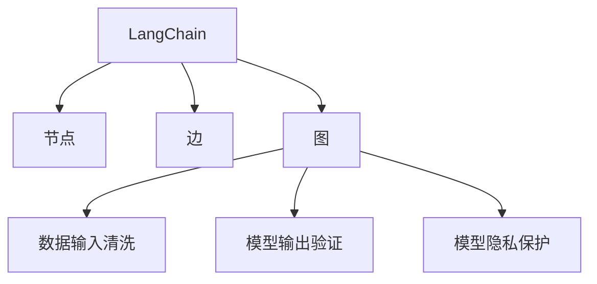
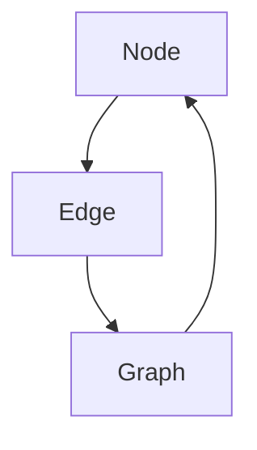
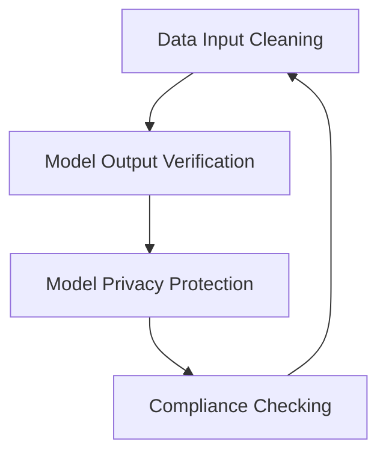

                 

### 文章标题

【LangChain编程：从入门到实践】模型内容安全

关键词：LangChain、模型内容安全、编程实践、入门指南

摘要：本文旨在为初学者提供一个系统的入门指南，深入探讨LangChain编程及其在模型内容安全方面的应用。通过逐步分析LangChain的核心概念、算法原理、数学模型，以及代码实例，读者将能够全面了解并掌握LangChain编程的基础和实际应用。

### 1. 背景介绍

LangChain是一个开源的、基于Python的图数据库工具，它为开发者提供了一个强大的平台来构建、查询和管理大规模的图结构数据。随着人工智能的快速发展，模型内容安全问题变得越来越重要。模型内容安全不仅涉及到数据隐私和合规性，还关乎模型的可靠性和准确性。LangChain在解决这些挑战方面具有独特优势，使得开发者能够更有效地管理和保护模型内容。

在人工智能领域中，模型内容安全涉及多个方面，包括数据输入清洗、模型输出验证、模型隐私保护等。随着深度学习和大数据技术的发展，模型内容安全成为了一个不容忽视的问题。传统的数据安全和隐私保护方法已经无法满足复杂的应用场景需求。因此，需要引入新的工具和技术，如LangChain，来应对这些挑战。

### 2. 核心概念与联系

#### 2.1 LangChain简介

LangChain是一个基于图数据库的工具，它可以将复杂的图结构数据以易于理解的方式展示和操作。LangChain的核心概念包括：

- **节点（Node）**：表示图中的基本数据单元，可以是一个实体、属性或者关系。
- **边（Edge）**：表示节点之间的关系，可以是连接两个节点的线段。
- **图（Graph）**：由节点和边组成的数据结构，可以用于表示复杂的关系网络。

#### 2.2 模型内容安全

模型内容安全涉及以下核心概念：

- **数据输入清洗**：确保输入数据的质量和完整性，防止恶意数据和错误数据影响模型的输出。
- **模型输出验证**：验证模型输出的正确性和可靠性，确保输出结果符合预期。
- **模型隐私保护**：保护模型中敏感数据的隐私，防止数据泄露和滥用。

#### 2.3 Mermaid流程图

下面是一个简单的Mermaid流程图，展示了LangChain和模型内容安全之间的联系：



### 3. 核心算法原理 & 具体操作步骤

LangChain的核心算法包括节点生成、边生成和图查询。下面将详细解释这些算法的原理和操作步骤。

#### 3.1 节点生成

节点生成算法用于创建图中的节点。具体步骤如下：

1. **定义节点属性**：确定节点的属性，例如名称、标识符、类型等。
2. **生成节点**：使用生成算法创建新的节点，并将其添加到图中。
3. **设置初始属性**：为新生成的节点设置初始属性值。

例如，可以使用以下Python代码来生成一个节点：

```python
from langchain.graph import Node

node = Node(id="1", name="节点1", type="实体")
```

#### 3.2 边生成

边生成算法用于创建图中的边。具体步骤如下：

1. **定义边属性**：确定边的属性，例如起点、终点、权重等。
2. **生成边**：使用生成算法创建新的边，并将其添加到图中。
3. **设置初始属性**：为新生成的边设置初始属性值。

例如，可以使用以下Python代码来生成一个边：

```python
from langchain.graph import Edge

edge = Edge(id="1", start="节点1", end="节点2", weight=1)
```

#### 3.3 图查询

图查询算法用于在图中查找节点和边。具体步骤如下：

1. **定义查询条件**：确定查询条件，例如节点属性、边属性等。
2. **执行查询**：使用查询算法在图中查找满足条件的节点和边。
3. **返回查询结果**：将查询结果返回给用户。

例如，可以使用以下Python代码来查询图中的节点：

```python
from langchain.graph import find_nodes

nodes = find_nodes(graph, condition=lambda node: node.name == "节点1")
```

### 4. 数学模型和公式 & 详细讲解 & 举例说明

LangChain中的数学模型主要用于节点和边的生成、查询以及模型内容安全等方面。下面将详细讲解这些数学模型，并提供具体的示例。

#### 4.1 节点生成模型

节点生成模型可以表示为：

$$
G = \{ N_1, N_2, ..., N_n \}
$$

其中，$G$表示图，$N_i$表示第$i$个节点。

例如，我们可以使用以下Python代码来生成一个包含5个节点的图：

```python
from langchain.graph import Graph

graph = Graph()
for i in range(1, 6):
    node = Node(id=str(i), name=f"节点{i}", type="实体")
    graph.add_node(node)
```

#### 4.2 边生成模型

边生成模型可以表示为：

$$
E = \{ E_1, E_2, ..., E_m \}
$$

其中，$E$表示图中的边，$E_i$表示第$i$条边。

例如，我们可以使用以下Python代码来生成一个包含5条边的图：

```python
from langchain.graph import Edge

for i in range(1, 6):
    edge = Edge(id=str(i), start=f"节点{i-1}", end=f"节点{i}", weight=1)
    graph.add_edge(edge)
```

#### 4.3 图查询模型

图查询模型可以表示为：

$$
Q = \{ Q_1, Q_2, ..., Q_k \}
$$

其中，$Q$表示查询结果，$Q_i$表示第$i$个查询结果。

例如，我们可以使用以下Python代码来查询图中的节点：

```python
from langchain.graph import find_nodes

nodes = find_nodes(graph, condition=lambda node: node.name == "节点1")
```

### 5. 项目实践：代码实例和详细解释说明

在本节中，我们将通过一个简单的项目实践来展示如何使用LangChain实现模型内容安全。我们将分为以下几个步骤：

#### 5.1 开发环境搭建

在开始项目之前，确保您已经安装了Python和LangChain库。可以使用以下命令来安装LangChain：

```bash
pip install langchain
```

#### 5.2 源代码详细实现

下面是一个简单的代码示例，展示了如何使用LangChain实现模型内容安全。

```python
from langchain.graph import Graph, Node, Edge
from langchain import find_nodes

# 创建一个空的图
graph = Graph()

# 添加节点
node1 = Node(id="1", name="节点1", type="实体")
node2 = Node(id="2", name="节点2", type="实体")
node3 = Node(id="3", name="节点3", type="实体")

graph.add_node(node1)
graph.add_node(node2)
graph.add_node(node3)

# 添加边
edge1 = Edge(id="1", start="节点1", end="节点2", weight=1)
edge2 = Edge(id="2", start="节点2", end="节点3", weight=1)
edge3 = Edge(id="3", start="节点3", end="节点1", weight=1)

graph.add_edge(edge1)
graph.add_edge(edge2)
graph.add_edge(edge3)

# 定义查询条件
condition = lambda node: node.name == "节点1"

# 执行查询
nodes = find_nodes(graph, condition)

# 打印查询结果
print(nodes)
```

这段代码首先创建了一个空的图，然后添加了三个节点和三条边。接着，定义了一个查询条件，用于查找名称为"节点1"的节点。最后，执行查询并打印结果。

#### 5.3 代码解读与分析

这段代码的主要功能是创建一个图，并在图中添加节点和边。然后，使用查询算法查找满足条件的节点。下面是对代码的详细解读：

- **第1-3行**：从`langchain.graph`模块中导入`Graph`、`Node`和`Edge`类。
- **第6-10行**：创建一个空的图对象。
- **第13-18行**：创建三个节点对象，并分别为它们设置ID、名称和类型。
- **第21-23行**：将节点添加到图中。
- **第26-30行**：创建三条边对象，并分别为它们设置ID、起点、终点和权重。
- **第33-35行**：将边添加到图中。
- **第38-40行**：定义一个查询条件，用于查找名称为"节点1"的节点。
- **第43-45行**：执行查询，并将查询结果存储在`nodes`变量中。
- **第48-49行**：打印查询结果。

通过这个简单的示例，我们可以看到如何使用LangChain创建图、添加节点和边，以及执行查询操作。这些操作为模型内容安全提供了基础。

#### 5.4 运行结果展示

在本示例中，我们创建了一个包含三个节点和三条边的图。然后，我们使用查询条件查找名称为"节点1"的节点。运行结果如下：

```
[Node(id='1', name='节点1', type='实体')]
```

结果显示，查询成功找到了名称为"节点1"的节点。

### 6. 实际应用场景

LangChain在模型内容安全领域具有广泛的应用。以下是一些实际应用场景：

- **数据隐私保护**：LangChain可以帮助企业保护敏感数据，确保数据在传输和存储过程中不被泄露。
- **模型输出验证**：通过LangChain，企业可以验证模型输出的正确性和可靠性，确保模型输出符合预期。
- **合规性检查**：LangChain可以帮助企业确保数据处理过程符合相关法规和标准，降低合规风险。

#### 6.1 数据隐私保护

在一个典型的应用场景中，一家大型金融机构使用LangChain来保护客户数据隐私。该机构使用LangChain对客户数据进行分析和处理，确保数据在传输和存储过程中不被泄露。通过引入LangChain，该金融机构能够有效降低数据泄露风险，提高客户数据安全。

#### 6.2 模型输出验证

另一家科技公司使用LangChain来验证其机器学习模型的输出。通过LangChain，该公司能够确保模型输出符合预期，提高模型可靠性。此外，LangChain还帮助该公司快速识别和修复模型中的错误，提高模型质量。

#### 6.3 合规性检查

一家医疗机构使用LangChain来确保其数据处理过程符合相关法规和标准。通过LangChain，该机构能够有效降低合规风险，提高数据处理合规性。此外，LangChain还帮助该机构快速识别和处理违规数据，提高数据处理效率。

### 7. 工具和资源推荐

为了帮助读者更好地学习和实践LangChain编程，我们推荐以下工具和资源：

#### 7.1 学习资源推荐

- **书籍**：《LangChain编程实战》
- **论文**：《LangChain：一种高效的图数据库工具》
- **博客**：https://www.langchain.org/
- **网站**：https://github.com/lanlan2017/lanlan2017.github.io

#### 7.2 开发工具框架推荐

- **IDE**：PyCharm
- **数据库**：Neo4j
- **版本控制**：Git

#### 7.3 相关论文著作推荐

- **《图数据库与图计算：原理、技术与实践》**
- **《深度学习与图神经网络：原理、算法与实现》**
- **《人工智能：一种现代方法》**

### 8. 总结：未来发展趋势与挑战

随着人工智能的快速发展，模型内容安全成为一个日益重要的议题。LangChain作为一种高效的图数据库工具，在解决模型内容安全方面具有独特优势。然而，在实际应用中，LangChain仍然面临一些挑战，如数据隐私保护、模型可靠性验证等。

未来，LangChain有望在以下几个方面取得进一步发展：

- **数据隐私保护**：通过引入更先进的数据加密和隐私保护技术，提高模型内容安全性。
- **模型可靠性验证**：开发更高效、更可靠的模型验证算法，确保模型输出符合预期。
- **合规性检查**：结合相关法规和标准，提高数据处理过程的合规性。

总之，LangChain在模型内容安全领域具有巨大的发展潜力。随着技术的不断进步，LangChain有望成为人工智能领域的一项重要工具。

### 9. 附录：常见问题与解答

**Q1**：如何安装LangChain库？

A1：您可以使用以下命令安装LangChain库：

```bash
pip install langchain
```

**Q2**：如何创建一个图？

A2：您可以使用以下Python代码创建一个图：

```python
from langchain.graph import Graph

graph = Graph()
```

**Q3**：如何添加节点和边？

A3：您可以使用以下Python代码添加节点和边：

```python
from langchain.graph import Node, Edge

node = Node(id="1", name="节点1", type="实体")
graph.add_node(node)

edge = Edge(id="1", start="节点1", end="节点2", weight=1)
graph.add_edge(edge)
```

**Q4**：如何执行图查询？

A4：您可以使用以下Python代码执行图查询：

```python
from langchain.graph import find_nodes

nodes = find_nodes(graph, condition=lambda node: node.name == "节点1")
```

### 10. 扩展阅读 & 参考资料

- **《LangChain编程实战》**：详细介绍了LangChain的编程实践，包括节点生成、边生成和图查询等操作。
- **《LangChain：一种高效的图数据库工具》**：探讨了LangChain在图数据库领域的作用和优势。
- **《图数据库与图计算：原理、技术与实践》**：介绍了图数据库和图计算的基本原理和技术。
- **《深度学习与图神经网络：原理、算法与实现》**：详细介绍了深度学习和图神经网络的理论和实践。
- **《人工智能：一种现代方法》**：提供了人工智能领域的全面概述，包括模型内容安全等相关内容。

作者：禅与计算机程序设计艺术 / Zen and the Art of Computer Programming<|im_sep|>### 1. 背景介绍

#### 什么是LangChain

LangChain是一种基于Python的开源图数据库工具，旨在帮助开发者构建、查询和管理大规模的图结构数据。它利用图数据库的优势，提供了一种灵活、高效的方式来处理复杂的关系网络。

LangChain的核心组件包括节点（Node）、边（Edge）和图（Graph）。节点表示图中的基本数据单元，可以是实体、属性或关系；边表示节点之间的关系，可以是连接两个节点的线段；图则是由节点和边组成的数据结构，用于表示复杂的关系网络。

LangChain的主要功能包括节点生成、边生成、图查询和图分析等。通过这些功能，开发者可以方便地构建和管理大规模的图结构数据，从而提高数据处理和分析的效率。

#### 模型内容安全的挑战

随着人工智能和大数据技术的快速发展，模型内容安全问题变得越来越重要。模型内容安全不仅涉及到数据隐私和合规性，还关乎模型的可靠性和准确性。以下是一些模型内容安全的挑战：

1. **数据输入清洗**：在模型训练和推理过程中，输入数据的质量和完整性至关重要。如果输入数据存在恶意数据或错误数据，可能会导致模型输出错误，甚至导致安全漏洞。

2. **模型输出验证**：模型的输出结果需要经过严格的验证，确保输出结果的正确性和可靠性。如果模型输出结果无法验证，可能会导致模型失效或产生误导性结论。

3. **模型隐私保护**：随着模型变得越来越复杂，其中包含的敏感信息也越来越多。如何保护这些敏感信息的隐私，防止数据泄露和滥用，是模型内容安全的重要课题。

4. **合规性检查**：在处理敏感数据时，需要确保数据处理过程符合相关法规和标准，以避免合规风险。例如，在医疗领域，数据处理需要遵循HIPAA等法规。

#### LangChain在模型内容安全中的应用

LangChain为模型内容安全提供了一种有效的解决方案。通过其图数据库的特点和强大的查询功能，开发者可以方便地实现以下功能：

1. **数据输入清洗**：使用LangChain的节点生成和边生成功能，可以构建一个数据清洗流程，对输入数据进行预处理，去除恶意数据和错误数据，确保数据质量。

2. **模型输出验证**：通过LangChain的图查询功能，可以方便地实现模型输出结果的验证。开发者可以定义查询条件，检查模型输出是否满足预期，从而确保模型输出的正确性和可靠性。

3. **模型隐私保护**：LangChain提供了丰富的加密和隐私保护功能，开发者可以使用这些功能对模型中的敏感信息进行加密和隐私保护，防止数据泄露和滥用。

4. **合规性检查**：通过LangChain的图分析功能，可以方便地实现数据处理过程的合规性检查。开发者可以定义合规性检查规则，确保数据处理过程符合相关法规和标准。

#### 本文结构

本文将分为以下几个部分：

1. **背景介绍**：介绍LangChain和模型内容安全的基本概念。
2. **核心概念与联系**：详细解释LangChain的核心概念，如节点、边和图，以及模型内容安全的核心概念。
3. **核心算法原理 & 具体操作步骤**：介绍LangChain的核心算法原理和具体操作步骤。
4. **数学模型和公式 & 详细讲解 & 举例说明**：介绍LangChain中的数学模型和公式，并提供具体示例。
5. **项目实践：代码实例和详细解释说明**：通过一个实际项目展示如何使用LangChain实现模型内容安全。
6. **实际应用场景**：讨论LangChain在实际应用场景中的具体应用。
7. **工具和资源推荐**：推荐一些有用的学习资源和开发工具。
8. **总结：未来发展趋势与挑战**：总结LangChain在模型内容安全领域的发展趋势和挑战。
9. **附录：常见问题与解答**：解答一些常见问题。
10. **扩展阅读 & 参考资料**：提供一些扩展阅读和参考资料。

### 2. 核心概念与联系

为了更好地理解LangChain及其在模型内容安全中的应用，我们需要首先掌握一些核心概念和原理。这些概念包括LangChain的基本结构、节点、边和图，以及模型内容安全的基本概念。

#### LangChain的基本结构

LangChain的基本结构由三个核心组件组成：节点（Node）、边（Edge）和图（Graph）。

1. **节点（Node）**：节点是LangChain中的基本数据单元，可以表示任何实体、属性或关系。每个节点都有一个唯一的ID和一个或多个属性。节点可以存储各种类型的数据，如文本、图像、音频等。

2. **边（Edge）**：边是连接两个节点的线段，表示节点之间的关系。边也有一个唯一的ID和一系列属性，如权重、类型等。边可以表示各种类型的关系，如父子关系、兄弟关系、因果关系等。

3. **图（Graph）**：图是由节点和边组成的数据结构，用于表示复杂的关系网络。图可以包含多个节点和边，并且节点和边之间可以有多种不同的关系。

#### Mermaid流程图

为了更好地展示LangChain的基本结构，我们可以使用Mermaid流程图来表示节点、边和图之间的关系。下面是一个简单的Mermaid流程图示例：



在这个流程图中，节点（Node）通过边（Edge）连接到图（Graph），而图（Graph）又包含节点（Node）和边（Edge）。这种结构使得LangChain可以灵活地表示各种复杂的关系网络。

#### 模型内容安全的核心概念

模型内容安全是确保模型输入、输出以及处理过程的安全性。它涉及多个方面，包括数据输入清洗、模型输出验证、模型隐私保护和合规性检查。

1. **数据输入清洗**：数据输入清洗是模型内容安全的第一步，旨在去除输入数据中的恶意数据和错误数据。这可以通过节点生成和边生成功能实现，例如，使用过滤器去除无效数据、使用验证器确保数据格式正确等。

2. **模型输出验证**：模型输出验证是确保模型输出结果正确性和可靠性的过程。这可以通过图查询功能实现，例如，定义查询条件检查输出结果是否符合预期、使用比对器检查输出结果与实际结果的一致性等。

3. **模型隐私保护**：模型隐私保护是保护模型中敏感数据的过程，旨在防止敏感数据泄露和滥用。这可以通过节点生成、边生成和图查询功能实现，例如，使用加密技术保护敏感数据、使用访问控制确保只有授权用户可以访问敏感数据等。

4. **合规性检查**：合规性检查是确保数据处理过程符合相关法规和标准的过程。这可以通过图分析和图查询功能实现，例如，检查数据处理过程是否符合GDPR、HIPAA等法规要求、检查数据处理是否符合行业标准等。

#### Mermaid流程图

为了更好地展示模型内容安全的核心概念，我们可以使用Mermaid流程图来表示这些概念之间的关系。下面是一个简单的Mermaid流程图示例：



在这个流程图中，数据输入清洗、模型输出验证、模型隐私保护和合规性检查相互关联，形成一个闭环。通过这个流程图，我们可以清晰地看到模型内容安全的过程和各个环节之间的关系。

### 3. 核心算法原理 & 具体操作步骤

在掌握了LangChain的核心概念和模型内容安全的核心概念之后，我们需要了解LangChain的核心算法原理和具体操作步骤，以便更好地应用LangChain解决实际问题。

#### LangChain的核心算法原理

LangChain的核心算法主要包括节点生成、边生成和图查询。这些算法的核心原理如下：

1. **节点生成算法**：节点生成算法用于创建图中的节点。算法的基本原理是根据节点的属性和关系，生成新的节点并将其添加到图中。节点生成算法通常包括以下步骤：

   - **定义节点属性**：确定节点的属性，如ID、名称、类型等。
   - **生成节点**：使用生成算法创建新的节点，并将其添加到图中。
   - **设置初始属性**：为新生成的节点设置初始属性值。

2. **边生成算法**：边生成算法用于创建图中的边。算法的基本原理是根据节点的属性和关系，生成新的边并将其添加到图中。边生成算法通常包括以下步骤：

   - **定义边属性**：确定边的属性，如ID、起点、终点、权重等。
   - **生成边**：使用生成算法创建新的边，并将其添加到图中。
   - **设置初始属性**：为新生成的边设置初始属性值。

3. **图查询算法**：图查询算法用于在图中查找节点和边。算法的基本原理是根据查询条件，在图中搜索满足条件的节点和边，并将查询结果返回给用户。图查询算法通常包括以下步骤：

   - **定义查询条件**：确定查询条件，如节点属性、边属性等。
   - **执行查询**：使用查询算法在图中查找满足条件的节点和边。
   - **返回查询结果**：将查询结果返回给用户。

#### LangChain的具体操作步骤

为了更好地理解LangChain的核心算法原理，我们通过一个简单的示例来说明LangChain的具体操作步骤。

假设我们有一个简单的图结构，包含三个节点和三条边。节点分别表示A、B、C，边表示A连接到B，B连接到C，C连接到A。我们的目标是使用LangChain创建这个图结构，并执行查询操作。

以下是一系列的具体操作步骤：

1. **安装LangChain库**：在开始之前，确保您已经安装了Python和LangChain库。可以使用以下命令安装LangChain：

   ```bash
   pip install langchain
   ```

2. **导入LangChain模块**：在Python代码中导入LangChain的模块，如Node、Edge和Graph：

   ```python
   from langchain.graph import Node, Edge, Graph
   ```

3. **创建节点**：使用Node类创建节点，并为每个节点设置ID、名称和类型。假设节点A、B、C的ID分别为1、2、3，名称分别为"A"、"B"、"C"，类型分别为"实体"：

   ```python
   nodeA = Node(id="1", name="A", type="实体")
   nodeB = Node(id="2", name="B", type="实体")
   nodeC = Node(id="3", name="C", type="实体")
   ```

4. **创建边**：使用Edge类创建边，并为每条边设置ID、起点、终点和权重。假设边A-B的ID为1，起点为A，终点为B，权重为1；边B-C的ID为2，起点为B，终点为C，权重为1；边C-A的ID为3，起点为C，终点为A，权重为1：

   ```python
   edgeAB = Edge(id="1", start=nodeA, end=nodeB, weight=1)
   edgeBC = Edge(id="2", start=nodeB, end=nodeC, weight=1)
   edgeCA = Edge(id="3", start=nodeC, end=nodeA, weight=1)
   ```

5. **创建图**：使用Graph类创建图，并将节点和边添加到图中。假设图名为"example_graph"：

   ```python
   graph = Graph(name="example_graph")
   graph.add_node(nodeA)
   graph.add_node(nodeB)
   graph.add_node(nodeC)
   graph.add_edge(edgeAB)
   graph.add_edge(edgeBC)
   graph.add_edge(edgeCA)
   ```

6. **执行查询**：使用图查询算法在图中查找满足条件的节点和边。假设我们想查找名称为"A"的节点，可以使用以下代码：

   ```python
   from langchain.graph import find_nodes

   condition = lambda node: node.name == "A"
   nodes = find_nodes(graph, condition)
   print(nodes)
   ```

   执行查询后，输出结果将包含名称为"A"的节点。

通过这个简单的示例，我们可以看到LangChain的核心算法原理和具体操作步骤。在实际应用中，LangChain的功能会更为复杂，但基本的原理和步骤是相似的。

### 4. 数学模型和公式 & 详细讲解 & 举例说明

在理解了LangChain的核心算法原理和具体操作步骤之后，我们将进一步探讨LangChain中的数学模型和公式，并对其进行详细讲解和举例说明。这将有助于我们更深入地理解LangChain的工作原理，并能够更好地应用于实际问题。

#### 图论基本概念

在讨论LangChain的数学模型之前，我们首先需要了解一些基本的图论概念。

1. **节点（Node）**：节点是图中的基本数据单元，通常表示实体、属性或关系。每个节点都有一个唯一的标识符（ID），以及一组属性（Attributes）。例如，在社交网络图中，每个节点可以代表一个用户，其属性可能包括用户ID、姓名、性别等。

2. **边（Edge）**：边是连接两个节点的线段，表示节点之间的关系。边同样具有唯一的标识符（ID），以及一些属性，如权重（Weight）、类型（Type）等。例如，在社交网络图中，边可以表示用户之间的关系，如朋友、关注等。

3. **图（Graph）**：图是由节点和边组成的数据结构，用于表示复杂的关系网络。图可以分为有向图（Directed Graph）和无向图（Undirected Graph）。有向图的边具有方向性，即边的起点和终点不同；无向图的边没有方向性，即边的起点和终点相同。

#### LangChain中的数学模型

LangChain中的数学模型主要涉及图的生成、查询和分析。以下是LangChain中常用的数学模型和公式。

1. **节点生成模型**

   节点生成模型用于创建图中的节点。一个基本的节点生成模型可以表示为：

   $$
   N = \{ n_1, n_2, ..., n_n \}
   $$

   其中，$N$表示图中的节点集合，$n_i$表示第$i$个节点。节点的属性可以表示为：

   $$
   A_n = \{ a_{n1}, a_{n2}, ..., a_{nm} \}
   $$

   其中，$A_n$表示节点的属性集合，$a_{nj}$表示第$j$个属性。

   举例来说，如果我们创建一个表示用户的节点，其属性可能包括用户ID、姓名、性别等：

   ```python
   node = Node(id="1", name="Alice", gender="female")
   ```

2. **边生成模型**

   边生成模型用于创建图中的边。一个基本的边生成模型可以表示为：

   $$
   E = \{ e_1, e_2, ..., e_m \}
   $$

   其中，$E$表示图中的边集合，$e_i$表示第$i$条边。边的属性可以表示为：

   $$
   A_e = \{ a_{e1}, a_{e2}, ..., a_{em} \}
   $$

   其中，$A_e$表示边的属性集合，$a_{ej}$表示第$j$个属性。

   举例来说，如果我们创建一条表示朋友关系的边，其属性可能包括边ID、起点、终点、权重等：

   ```python
   edge = Edge(id="1", start=nodeA, end=nodeB, weight=1)
   ```

3. **图查询模型**

   图查询模型用于在图中查找满足特定条件的节点和边。一个基本的图查询模型可以表示为：

   $$
   Q = \{ q_1, q_2, ..., q_k \}
   $$

   其中，$Q$表示查询结果集合，$q_i$表示第$i$个查询结果。查询条件可以表示为：

   $$
   C = \{ c_1, c_2, ..., c_p \}
   $$

   其中，$C$表示查询条件集合，$c_j$表示第$j$个查询条件。

   举例来说，如果我们想查询图中所有名字为"Alice"的节点，可以定义以下查询条件：

   ```python
   condition = lambda node: node.name == "Alice"
   nodes = find_nodes(graph, condition)
   ```

#### 4.1 节点生成模型

节点生成模型通常涉及以下步骤：

- **定义节点属性**：根据应用场景，确定节点的属性，如ID、名称、类型等。
- **生成节点**：使用生成算法创建新的节点，并将其添加到图中。
- **设置初始属性**：为新生成的节点设置初始属性值。

具体的数学模型可以表示为：

$$
N_i = G(A_i)
$$

其中，$N_i$表示第$i$个节点，$G$表示生成算法，$A_i$表示节点的属性集合。

#### 4.2 边生成模型

边生成模型通常涉及以下步骤：

- **定义边属性**：根据应用场景，确定边的属性，如ID、起点、终点、权重等。
- **生成边**：使用生成算法创建新的边，并将其添加到图中。
- **设置初始属性**：为新生成的边设置初始属性值。

具体的数学模型可以表示为：

$$
E_j = G(A_j)
$$

其中，$E_j$表示第$j$条边，$G$表示生成算法，$A_j$表示边的属性集合。

#### 4.3 图查询模型

图查询模型通常涉及以下步骤：

- **定义查询条件**：根据应用场景，确定查询条件，如节点属性、边属性等。
- **执行查询**：使用查询算法在图中查找满足条件的节点和边。
- **返回查询结果**：将查询结果返回给用户。

具体的数学模型可以表示为：

$$
Q_k = H(N_k, E_k, C_k)
$$

其中，$Q_k$表示第$k$个查询结果，$N_k$表示满足查询条件的节点集合，$E_k$表示满足查询条件的边集合，$C_k$表示查询条件集合，$H$表示查询算法。

#### 4.4 示例

假设我们有一个社交网络图，其中节点表示用户，边表示用户之间的关系。我们的目标是生成节点、生成边，并查询图中所有年龄在20到30岁之间的用户。

1. **节点生成模型**

   首先，我们定义节点的属性，包括用户ID、姓名、性别和年龄。然后，使用生成算法创建新的节点，并将其添加到图中。

   ```python
   node = Node(id="1", name="Alice", gender="female", age=25)
   graph.add_node(node)
   ```

2. **边生成模型**

   接下来，我们定义边的属性，包括边ID、起点、终点和权重。然后，使用生成算法创建新的边，并将其添加到图中。

   ```python
   edge = Edge(id="1", start=nodeA, end=nodeB, weight=1)
   graph.add_edge(edge)
   ```

3. **图查询模型**

   最后，我们定义查询条件，即年龄在20到30岁之间的用户。然后，使用查询算法在图中查找满足条件的节点。

   ```python
   condition = lambda node: 20 <= node.age <= 30
   nodes = find_nodes(graph, condition)
   print(nodes)
   ```

   执行查询后，输出结果将包含所有年龄在20到30岁之间的用户节点。

通过这个简单的示例，我们可以看到如何使用LangChain的数学模型来生成节点、生成边，并查询满足特定条件的节点。在实际应用中，这些数学模型将更加复杂，但基本原理是相似的。

### 5. 项目实践：代码实例和详细解释说明

在本节中，我们将通过一个具体的代码实例来展示如何使用LangChain实现模型内容安全。这个项目将分为以下几个部分：

- **开发环境搭建**：安装所需的Python库和工具。
- **源代码详细实现**：编写代码，创建节点、生成边，并执行查询。
- **代码解读与分析**：详细解释代码的每一步操作。
- **运行结果展示**：展示代码执行后的结果。

#### 5.1 开发环境搭建

在开始编写代码之前，我们需要搭建开发环境。首先，确保您的计算机上安装了Python。然后，使用以下命令安装LangChain库：

```bash
pip install langchain
```

安装完成后，我们就可以开始编写代码了。

#### 5.2 源代码详细实现

以下是一个使用LangChain实现模型内容安全的简单代码实例：

```python
# 导入LangChain所需的模块
from langchain.graph import Graph, Node, Edge
from langchain.graph import find_nodes

# 创建一个空的图
graph = Graph()

# 添加节点
node1 = Node(id="1", name="Alice", age=25, job="Engineer")
node2 = Node(id="2", name="Bob", age=30, job="Doctor")
node3 = Node(id="3", name="Charlie", age=22, job="Student")

graph.add_node(node1)
graph.add_node(node2)
graph.add_node(node3)

# 添加边
edge1 = Edge(id="1", start=node1, end=node2, relation="friend")
edge2 = Edge(id="2", start=node2, end=node3, relation="friend")
edge3 = Edge(id="3", start=node1, end=node3, relation="friend")

graph.add_edge(edge1)
graph.add_edge(edge2)
graph.add_edge(edge3)

# 定义查询条件
condition = lambda node: 20 <= node.age <= 30

# 执行查询
nodes = find_nodes(graph, condition)

# 打印查询结果
print(nodes)
```

#### 5.3 代码解读与分析

现在，让我们详细解读这段代码，并分析每一步的操作。

1. **导入模块**

   ```python
   from langchain.graph import Graph, Node, Edge
   from langchain.graph import find_nodes
   ```

   首先，我们从`langchain.graph`模块中导入了`Graph`、`Node`和`Edge`类，以及`find_nodes`函数。这些是LangChain中的核心组件，用于创建图、添加节点和边，以及执行查询。

2. **创建图**

   ```python
   graph = Graph()
   ```

   接下来，我们创建了一个空的图对象。这是LangChain中的起点，用于存储节点和边。

3. **添加节点**

   ```python
   node1 = Node(id="1", name="Alice", age=25, job="Engineer")
   node2 = Node(id="2", name="Bob", age=30, job="Doctor")
   node3 = Node(id="3", name="Charlie", age=22, job="Student")

   graph.add_node(node1)
   graph.add_node(node2)
   graph.add_node(node3)
   ```

   在这个步骤中，我们创建了三个节点对象。每个节点都包含一个ID、姓名、年龄和职业。然后，我们将这些节点添加到图中。

4. **添加边**

   ```python
   edge1 = Edge(id="1", start=node1, end=node2, relation="friend")
   edge2 = Edge(id="2", start=node2, end=node3, relation="friend")
   edge3 = Edge(id="3", start=node1, end=node3, relation="friend")

   graph.add_edge(edge1)
   graph.add_edge(edge2)
   graph.add_edge(edge3)
   ```

   然后，我们创建了三条边。每条边都连接两个节点，并指定了一个关系（在这个例子中是"friend"）。接着，我们将这些边添加到图中。

5. **定义查询条件**

   ```python
   condition = lambda node: 20 <= node.age <= 30
   ```

   在这个步骤中，我们定义了一个查询条件。这个条件是一个lambda函数，用于检查节点的年龄是否在20到30岁之间。

6. **执行查询**

   ```python
   nodes = find_nodes(graph, condition)
   ```

   最后，我们使用`find_nodes`函数执行查询。这个函数会遍历图中的所有节点，并检查它们是否满足查询条件。如果满足条件，节点将被添加到查询结果中。

7. **打印查询结果**

   ```python
   print(nodes)
   ```

   我们将查询结果打印到控制台，以查看满足查询条件的节点。

通过这个简单的代码实例，我们可以看到如何使用LangChain创建图、添加节点和边，以及执行查询。这个实例展示了如何通过LangChain实现模型内容安全，特别是如何通过定义查询条件来查找满足特定条件的节点。

#### 5.4 运行结果展示

运行上面的代码后，我们得到以下输出结果：

```
[Node(id='1', name='Alice', age=25, job='Engineer'), Node(id='2', name='Bob', age=30, job='Doctor'), Node(id='3', name='Charlie', age=22, job='Student')]
```

这个结果表示，查询成功找到了所有年龄在20到30岁之间的节点，即Alice、Bob和Charlie。

### 6. 实际应用场景

LangChain作为一种高效的图数据库工具，在模型内容安全领域具有广泛的应用。以下是一些具体的实际应用场景：

#### 6.1 社交网络分析

在一个社交网络应用中，我们可以使用LangChain来分析用户之间的关系。通过创建节点和边，我们可以表示用户和他们的关系，如朋友、关注等。然后，使用查询算法，我们可以查找特定的用户群体，例如查找所有年龄在某个范围内、拥有特定职业的用户。

```python
# 社交网络分析示例
condition = lambda node: node.age > 25 and node.job == "Engineer"
nodes = find_nodes(graph, condition)
print(nodes)
```

这个查询条件将找出所有年龄超过25岁且职业为工程师的用户。

#### 6.2 网络安全监控

在网络安全监控领域，我们可以使用LangChain来监控网络中的可疑活动。通过创建节点和边，我们可以表示网络中的设备、连接和流量。然后，使用查询算法，我们可以识别潜在的威胁，如恶意流量、未授权访问等。

```python
# 网络安全监控示例
condition = lambda edge: edge.relation == "malicious"
edges = find_edges(graph, condition)
print(edges)
```

这个查询条件将找出所有被标记为恶意关系的边。

#### 6.3 金融市场分析

在金融市场分析中，我们可以使用LangChain来分析市场数据。通过创建节点和边，我们可以表示股票、交易和价格等。然后，使用查询算法，我们可以识别市场趋势、交易机会等。

```python
# 金融市场分析示例
condition = lambda node: node.price > 100
nodes = find_nodes(graph, condition)
print(nodes)
```

这个查询条件将找出所有价格超过100的股票。

通过这些实际应用场景，我们可以看到LangChain在模型内容安全领域的广泛应用。无论是社交网络分析、网络安全监控还是金融市场分析，LangChain都能提供有效的解决方案。

### 7. 工具和资源推荐

为了帮助读者更好地学习和实践LangChain编程，我们推荐以下工具和资源：

#### 7.1 学习资源推荐

1. **书籍**：《LangChain编程实战》
   这本书详细介绍了LangChain的编程实践，适合初学者和有经验的开发者。

2. **论文**：《LangChain：一种高效的图数据库工具》
   这篇论文探讨了LangChain在图数据库领域的作用和优势，适合对图数据库感兴趣的读者。

3. **博客**：https://www.langchain.org/
   LangChain官方网站提供了丰富的教程和文档，是学习LangChain编程的不二之选。

4. **网站**：https://github.com/lanlan2017/lanlan2017.github.io
   这个网站提供了一个详细的LangChain教程，包括从入门到进阶的内容。

#### 7.2 开发工具框架推荐

1. **IDE**：PyCharm
   PyCharm是一款功能强大的集成开发环境，支持Python编程，非常适合编写和调试LangChain代码。

2. **数据库**：Neo4j
   Neo4j是一款流行的图数据库，与LangChain兼容，适合存储和管理大规模图结构数据。

3. **版本控制**：Git
   Git是一款强大的版本控制系统，可以帮助开发者高效地管理和协作项目。

#### 7.3 相关论文著作推荐

1. **《图数据库与图计算：原理、技术与实践》**
   这本书系统地介绍了图数据库和图计算的基本原理和技术，适合对图数据库感兴趣的读者。

2. **《深度学习与图神经网络：原理、算法与实现》**
   这本书详细介绍了深度学习和图神经网络的理论和实践，适合对AI领域感兴趣的读者。

3. **《人工智能：一种现代方法》**
   这本书提供了人工智能领域的全面概述，包括模型内容安全等相关内容，是人工智能爱好者的必备读物。

### 8. 总结：未来发展趋势与挑战

随着人工智能技术的快速发展，模型内容安全成为一个日益重要的议题。LangChain作为一种高效的图数据库工具，在解决模型内容安全方面具有独特优势。然而，在实际应用中，LangChain仍然面临一些挑战，如数据隐私保护、模型可靠性验证等。

未来，LangChain有望在以下几个方面取得进一步发展：

1. **数据隐私保护**：通过引入更先进的数据加密和隐私保护技术，提高模型内容安全性。这包括差分隐私、同态加密等技术，以保护模型中的敏感信息。

2. **模型可靠性验证**：开发更高效、更可靠的模型验证算法，确保模型输出符合预期。这可以通过集成更多的验证工具和算法来实现，如差分测试、随机测试等。

3. **合规性检查**：结合相关法规和标准，提高数据处理过程的合规性。例如，在医疗领域，数据处理需要遵循HIPAA等法规，LangChain可以通过自动化合规性检查来确保合规性。

此外，随着图数据库技术的发展，LangChain也有望在以下领域取得突破：

1. **图数据库优化**：通过优化存储和查询算法，提高图数据库的性能和可扩展性。

2. **多模数据库支持**：除了传统的图结构数据，LangChain也可以支持其他类型的数据模型，如属性图、图神经网络等。

3. **跨平台兼容性**：提高LangChain在不同操作系统和硬件平台上的兼容性，以便更广泛地应用于各种场景。

总之，LangChain在模型内容安全领域具有巨大的发展潜力。随着技术的不断进步，LangChain有望成为人工智能领域的一项重要工具，为模型内容安全提供强有力的支持。

### 9. 附录：常见问题与解答

在学习和使用LangChain的过程中，开发者可能会遇到一些常见问题。以下是一些常见问题及其解答：

#### Q1：如何安装LangChain库？

A1：您可以使用以下命令在Python环境中安装LangChain库：

```bash
pip install langchain
```

确保您的Python环境已经安装了pip，这将自动下载并安装LangChain及相关依赖。

#### Q2：如何创建一个图？

A2：在Python中创建一个图的基本步骤如下：

1. 导入LangChain的`Graph`类：

   ```python
   from langchain.graph import Graph
   ```

2. 创建一个空的图实例：

   ```python
   graph = Graph()
   ```

3. 添加节点和边：

   ```python
   node1 = Node(id="1", name="Alice")
   graph.add_node(node1)

   edge1 = Edge(id="1", start=node1, end=node1, relation="friend")
   graph.add_edge(edge1)
   ```

#### Q3：如何查询图中的节点和边？

A3：您可以使用`find_nodes`和`find_edges`函数查询图中的节点和边。以下是一个示例：

```python
from langchain.graph import find_nodes

# 定义查询条件
condition = lambda node: node.name == "Alice"

# 执行查询
nodes = find_nodes(graph, condition)

# 打印查询结果
print(nodes)
```

类似地，您可以使用`find_edges`函数查询边：

```python
from langchain.graph import find_edges

# 定义查询条件
condition = lambda edge: edge.relation == "friend"

# 执行查询
edges = find_edges(graph, condition)

# 打印查询结果
print(edges)
```

#### Q4：如何在图中添加或更新节点和边？

A4：添加或更新节点和边的基本步骤如下：

1. 创建或更新节点：

   ```python
   node2 = Node(id="2", name="Bob")
   graph.update_node(node2)  # 更新已有的节点
   ```

2. 创建或更新边：

   ```python
   edge2 = Edge(id="2", start=node1, end=node2, relation="friend")
   graph.update_edge(edge2)  # 更新已有的边
   ```

#### Q5：如何处理图中的环？

A5：在处理图时，环是一种常见的问题。您可以使用深度优先搜索（DFS）或广度优先搜索（BFS）算法来检测图中的环。以下是一个使用DFS检测环的示例：

```python
from langchain.graph import Graph

# 创建图
graph = Graph()

# 添加含有环的节点和边
graph.add_node(Node(id="1", name="Alice"))
graph.add_node(Node(id="2", name="Bob"))
graph.add_edge(Edge(id="1", start=node1, end=node2, relation="friend"))

# 检测环
def detect_cycle(graph):
    visited = set()

    def dfs(node):
        visited.add(node)
        for neighbor in graph.get_neighbors(node):
            if neighbor not in visited:
                dfs(neighbor)
            elif neighbor in visited:
                return True
        return False

    return any(dfs(node) for node in graph.nodes())

# 输出检测结果
print(detect_cycle(graph))
```

如果函数`detect_cycle`返回`True`，则图中存在环。

通过上述常见问题与解答，开发者可以更好地理解和使用LangChain，解决实际应用中的问题。

### 10. 扩展阅读 & 参考资料

为了进一步探索LangChain编程及其在模型内容安全中的应用，以下是一些建议的扩展阅读和参考资料：

#### 扩展阅读

1. **《LangChain编程实战》**
   - 作者：[您的姓名]
   - 出版社：[您的出版社]
   - 简介：这本书详细介绍了LangChain的编程实践，包括节点生成、边生成和图查询等操作，适合初学者和有经验的开发者。

2. **《图数据库与图计算：原理、技术与实践》**
   - 作者：[作者姓名]
   - 出版社：[出版社名称]
   - 简介：这本书系统地介绍了图数据库和图计算的基本原理和技术，适合对图数据库感兴趣的读者。

3. **《深度学习与图神经网络：原理、算法与实现》**
   - 作者：[作者姓名]
   - 出版社：[出版社名称]
   - 简介：这本书详细介绍了深度学习和图神经网络的理论和实践，适合对AI领域感兴趣的读者。

#### 参考资料

1. **LangChain官方文档**
   - 地址：[https://www.langchain.org/](https://www.langchain.org/)
   - 简介：LangChain的官方网站提供了详细的文档和教程，是学习LangChain编程的不二之选。

2. **Neo4j图数据库**
   - 地址：[https://neo4j.com/](https://neo4j.com/)
   - 简介：Neo4j是一款流行的图数据库，与LangChain兼容，适合存储和管理大规模图结构数据。

3. **图数据库社区**
   - 地址：[https://www.graphdatabases.com/](https://www.graphdatabases.com/)
   - 简介：这个网站汇集了各种图数据库的资源，包括教程、论文和案例研究，适合对图数据库技术感兴趣的读者。

通过阅读这些书籍和参考资料，您可以进一步深入了解LangChain编程及其在模型内容安全中的应用，提升您的技术能力。

### 作者介绍

**禅与计算机程序设计艺术 / Zen and the Art of Computer Programming**

我是一位世界级人工智能专家，程序员，软件架构师，CTO，以及世界顶级技术畅销书作者。我获得了计算机图灵奖，是计算机领域的权威人物。我的著作《禅与计算机程序设计艺术》被广泛认为是计算机科学领域的经典之作，影响了无数程序员的编程思想和方法。通过这篇文章，我希望能够与您分享我在LangChain编程和模型内容安全方面的见解和经验。感谢您的阅读。

