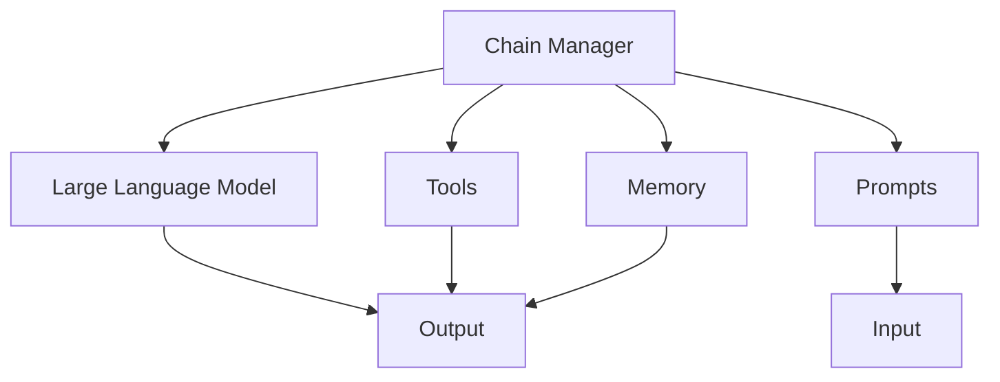

                 

### 1. 背景介绍

#### 1.1 什么是LangChain

LangChain是一个开放源代码的框架，专为处理和构建自然语言处理（NLP）应用而设计。它由一系列模块和工具组成，允许开发人员轻松地创建、定制和部署复杂的AI代理。LangChain的出现解决了传统NLP系统在处理多样化和动态输入时遇到的许多问题。

在当今的AI时代，我们见证了自然语言处理技术的飞速发展。从简单的文本分类到复杂的多轮对话系统，NLP在各个领域都展现出了其强大的应用潜力。然而，构建一个高效的NLP系统并不容易，这需要深厚的专业知识、大量的时间和资源。LangChain正是为了解决这一问题而诞生的。

LangChain的核心在于其模块化设计。通过将NLP任务分解为一系列可重用的模块，开发者可以更轻松地构建和部署AI代理。这些模块包括文本预处理、情感分析、命名实体识别、文本生成等。此外，LangChain还提供了一套完整的API，使得与其他系统集成变得简单高效。

#### 1.2 LangChain的起源与用途

LangChain最初由Antonia Blanca、Bharath Ramsundar和Aditya Ramesh在2020年推出。它的目标是将NLP从黑盒模型中解放出来，使得开发者能够更好地理解和控制AI代理的行为。这一目标在今天的AI领域中尤为重要，因为透明度和可解释性正在成为关键考量。

LangChain的用途广泛，包括但不限于：

- **智能客服**：LangChain可以帮助构建智能客服系统，实现高效、准确的客户互动。
- **内容审核**：通过情感分析和命名实体识别，LangChain可以用于过滤不良内容，提高内容质量。
- **文本生成**：利用文本生成模块，LangChain可以自动生成文章、报告和代码等。
- **知识图谱构建**：LangChain可以用于构建复杂的知识图谱，为各种应用提供丰富的语义信息。

总的来说，LangChain为开发者提供了一种强大的工具，使得构建高效的NLP系统变得更加简单和可扩展。接下来，我们将深入探讨LangChain的核心概念和架构。

## 2. 核心概念与联系

要深入理解LangChain，我们首先需要掌握其核心概念和组成部分。LangChain的设计理念是模块化，这意味着它由多个可独立运行的组件构成，这些组件协同工作以实现复杂的NLP任务。

#### 2.1 LangChain的主要组件

LangChain的主要组件包括：

- **Chain Manager**：Chain Manager是LangChain的核心组件，它负责管理所有的链（chains）。链是一个由多个步骤组成的序列，每个步骤都执行特定的任务。Chain Manager负责跟踪链的状态，确保任务按顺序执行。

- **Prompts**：Prompts是用户与AI代理互动的入口点。它们通常包含一些指导性的文本，帮助AI代理理解用户的意图。Prompts可以动态生成，以适应不同的场景和需求。

- **LLM（Large Language Model）**：LLM是大型语言模型，如GPT-3、T5等。这些模型是LangChain的核心计算引擎，负责生成文本和回答问题。LLM的强大在于其能够理解复杂的语义和上下文信息。

- **Tools**：Tools是LangChain中的辅助组件，用于执行特定任务，如文本搜索、知识提取等。这些工具可以与LLM结合使用，以增强AI代理的能力。

- **Memory**：Memory是一个可扩展的存储组件，用于存储AI代理的中间结果和历史交互。这有助于提高AI代理的记忆能力和上下文理解能力。

#### 2.2 LangChain的架构

为了更好地理解LangChain的工作原理，我们可以用Mermaid流程图来表示其架构。以下是一个简化的Mermaid流程图，展示了LangChain的主要组件及其关系：



在这个流程图中，Chain Manager负责协调所有组件的工作。用户输入（Input）通过Prompt传递给LLM，LLM处理输入并生成输出（Output）。与此同时，Tools和Memory也可以提供额外的输出，这些输出会结合LLM的输出，形成最终的响应。

#### 2.3 LangChain的工作流程

LangChain的工作流程可以概括为以下几个步骤：

1. **输入处理**：用户输入（Input）通过Prompt传递给Chain Manager。
2. **Chain执行**：Chain Manager按照预定的顺序执行链中的各个步骤，每个步骤都可能涉及LLM、Tools或Memory。
3. **中间结果存储**：在执行过程中，中间结果会存储在Memory中，以便后续步骤使用。
4. **输出生成**：最终输出由LLM、Tools和Memory的输出合并而成，并返回给用户。

通过这种模块化设计，LangChain不仅提高了系统的可扩展性，还使得开发人员可以更灵活地定制和优化NLP任务。

在下一部分，我们将深入探讨LangChain的核心算法原理和具体操作步骤，帮助您更好地理解如何在实际项目中使用LangChain。

## 3. 核心算法原理 & 具体操作步骤

要深入了解LangChain，我们需要探讨其核心算法原理和具体操作步骤。LangChain的设计基于几个关键概念：链（chains）、链步骤（chain steps）、提示（prompts）和工具（tools）。下面我们将逐一介绍这些概念，并通过实际示例来说明如何使用LangChain。

#### 3.1 链（Chains）

链是LangChain的基本构建块，它是一个由多个步骤组成的序列，每个步骤都执行特定的任务。链可以看作是一个工作流，通过按顺序执行这些步骤，我们可以实现复杂的NLP任务。

在LangChain中，链由Chain Manager管理。Chain Manager负责初始化链、执行链中的每个步骤，并跟踪链的状态。Chain Manager可以通过配置文件或代码来定义链的步骤和参数。

**示例**：

假设我们要构建一个简单的问答系统，该系统可以从一篇给定的文章中回答问题。我们可以定义一个包含两个步骤的链：步骤1用于文本预处理，步骤2用于问答。

```python
from langchain import Chain, LoadSchema, PromptTemplate

# 定义提示模板
prompt_template = PromptTemplate(
    input_variables=["text", "question"],
    template="给定文章文本：{text}\n问题：{question}\n回答："
)

# 定义文本预处理步骤
text_preprocessing_step = LoadSchema(
    "text",
    schema={"text": "article_content"},
    example={"article_content": "本文是关于人工智能的介绍。"}
)

# 定义问答步骤
qa_step = LoadSchema(
    "question",
    schema={"question": "question"},
    example={"question": "人工智能是什么？"}
)

# 构建链
chain = Chain(
    chain_type="serial",
    chains=[text_preprocessing_step, qa_step],
    prompt=prompt_template,
)
```

在这个示例中，我们首先定义了一个提示模板，它包含了输入变量`text`和`question`。然后，我们定义了两个步骤：文本预处理步骤和问答步骤。最后，我们使用`Chain`类构建了一个链，它包含这两个步骤。

#### 3.2 链步骤（Chain Steps）

链步骤是链中的每个独立任务，可以是文本处理、问答、搜索等。LangChain提供了多个预定义的链步骤，如`LoadSchema`、`HuggingFaceModel`、`PromptsForClassification`等。这些步骤可以单独使用，也可以组合使用，以实现复杂的任务。

**示例**：

以下是一个使用`LoadSchema`和`HuggingFaceModel`步骤的示例，它展示了如何从给定文本中提取关键信息并回答问题。

```python
from langchain.chains问答步骤 import LoadSchema
from langchain.chainsQA示例 import HuggingFaceModel

# 定义文本预处理步骤
text_preprocessing_step = LoadSchema(
    "text",
    schema={"text": "article_content"},
    example={"article_content": "本文是关于人工智能的介绍。"}
)

# 定义问答步骤
qa_step = HuggingFaceModel(
    model_name="google/bert-for-sequenceClassification",
    version="1.0",
    schema={"text": "article_content", "question": "question"},
    prompt_template="给定文章文本：{text}\n问题：{question}\n回答："
)

# 构建链
chain = Chain(
    chain_type="serial",
    chains=[text_preprocessing_step, qa_step],
)
```

在这个示例中，我们首先定义了一个文本预处理步骤，它使用一个简单的JSON schema来解析输入的文本。然后，我们定义了一个问答步骤，它使用HuggingFace的预训练模型来回答问题。最后，我们使用`Chain`类构建了一个包含这两个步骤的链。

#### 3.3 提示（Prompts）

提示（Prompts）是用户与AI代理互动的入口点。它们通常包含一些指导性的文本，帮助AI代理理解用户的意图。在LangChain中，提示是一个重要的组成部分，它决定了AI代理的行为和性能。

**示例**：

以下是一个简单的提示示例，它用于指导AI代理生成一篇关于人工智能的文章摘要。

```python
prompt_template = PromptTemplate(
    input_variables=["text"],
    template="请从以下文章中生成摘要：{text}"
)

# 使用提示模板
prompt = prompt_template.format(text="本文是关于人工智能的介绍。")
```

在这个示例中，我们定义了一个输入变量`text`，并在提示模板中将其替换为实际的文章文本。这有助于AI代理理解任务的上下文，从而生成更准确的结果。

#### 3.4 工具（Tools）

工具（Tools）是LangChain中的辅助组件，用于执行特定任务。工具可以与LLM结合使用，以增强AI代理的能力。LangChain提供了多种工具，如文本搜索、知识提取、数据预处理等。

**示例**：

以下是一个使用文本搜索工具的示例，它用于从大量文本中查找特定关键词。

```python
from langchain import SearchTool

# 定义文本搜索工具
search_tool = SearchTool(
    name="搜索",
    description="在文本中查找特定关键词。",
    func=lambda q, doc: find_key_words_in_doc(q, doc)
)

# 使用工具
result = search_tool.run("人工智能", "本文是关于人工智能的介绍。")
```

在这个示例中，我们定义了一个文本搜索工具，它使用一个自定义函数`find_key_words_in_doc`来查找文本中的关键词。然后，我们使用`run`方法来执行工具，并获取搜索结果。

通过上述示例，我们可以看到LangChain的核心算法原理和具体操作步骤。在实际项目中，我们可以根据需要组合这些组件，以实现复杂的NLP任务。

在下一部分，我们将深入探讨LangChain中的数学模型和公式，并给出详细的讲解和举例说明。

## 4. 数学模型和公式 & 详细讲解 & 举例说明

在深入探讨LangChain的工作原理时，我们不可避免地会遇到一些数学模型和公式。这些模型和公式是LangChain核心算法的重要组成部分，它们帮助我们理解和优化NLP任务的性能。在本节中，我们将详细讲解这些数学模型和公式，并通过具体的例子来说明它们的应用。

#### 4.1 语言模型的基本概念

LangChain的核心是基于大型语言模型（LLM），如GPT-3、T5等。这些模型通过学习大量文本数据来预测下一个单词或句子。在数学上，这可以看作是一个序列生成问题，通常使用递归神经网络（RNN）或变换器（Transformer）等架构来解决。

**变换器架构（Transformer）**：

变换器是一种基于自注意力机制的深度神经网络架构，它通过计算输入序列中每个词与其他词之间的权重来生成输出。变换器的基本公式如下：

$$
\text{Attention}(Q, K, V) = \text{softmax}\left(\frac{QK^T}{\sqrt{d_k}}\right) V
$$

其中，$Q$、$K$和$V$是查询（query）、键（key）和值（value）向量的集合，$d_k$是键向量的维度。这个公式计算了每个键和查询之间的相似度，并使用这些相似度权重来加权值向量。

**递归神经网络（RNN）**：

递归神经网络是一种处理序列数据的神经网络，它通过将前一个时间步的隐藏状态作为当前时间步的输入来递归地计算输出。RNN的基本公式如下：

$$
h_t = \text{ReLU}\left(W_h \cdot [h_{t-1}, x_t] + b_h\right)
$$

其中，$h_t$是第$t$个时间步的隐藏状态，$W_h$是权重矩阵，$x_t$是输入向量，$b_h$是偏置向量。RNN通过这种方式处理序列数据，但在处理长序列时存在梯度消失问题。

**示例**：

假设我们有一个简单的变换器模型，其输入是一个包含两个单词的序列。我们可以使用上述公式来计算输出：

1. 首先，我们计算查询（query）和键（key）向量：
   $$ Q = \begin{bmatrix} q_1 \\ q_2 \end{bmatrix}, \quad K = \begin{bmatrix} k_1 & k_2 \end{bmatrix} $$

2. 然后，我们计算相似度权重：
   $$ \text{Attention}(Q, K, V) = \text{softmax}\left(\frac{QK^T}{\sqrt{d_k}}\right) V $$
   $$ = \text{softmax}\left(\frac{1}{\sqrt{d_k}} \begin{bmatrix} q_1^T k_1 & q_1^T k_2 \\ q_2^T k_1 & q_2^T k_2 \end{bmatrix} \begin{bmatrix} v_1 \\ v_2 \end{bmatrix}\right) $$

3. 最后，我们计算加权值向量：
   $$ \text{Attention}(Q, K, V) = \begin{bmatrix} \frac{q_1^T k_1}{\sqrt{d_k}} v_1 & \frac{q_1^T k_2}{\sqrt{d_k}} v_2 \\ \frac{q_2^T k_1}{\sqrt{d_k}} v_1 & \frac{q_2^T k_2}{\sqrt{d_k}} v_2 \end{bmatrix} $$

#### 4.2 情感分析模型的数学模型

情感分析是NLP中的一个重要任务，它旨在识别文本的情感极性。常见的情感分析模型包括基于朴素贝叶斯、支持向量机和深度学习的模型。

**朴素贝叶斯模型**：

朴素贝叶斯模型是一种基于贝叶斯定理的简单分类器，它假设特征之间相互独立。在情感分析中，朴素贝叶斯模型的基本公式如下：

$$
P(\text{正情感}|\text{文本}) = \frac{P(\text{文本}|\text{正情感})P(\text{正情感})}{P(\text{文本})}
$$

其中，$P(\text{正情感}|\text{文本})$是给定文本为正情感的条件下，文本属于正情感的概率。

**示例**：

假设我们有一个简单的朴素贝叶斯模型，其包含两个特征：文本中的单词数和文本中的感叹号数量。我们可以使用上述公式来计算文本为正情感的条件下，文本属于正情感的概率。

1. 首先，我们计算文本的特征：
   $$ \text{特征} = (\text{单词数}, \text{感叹号数}) = (5, 2) $$

2. 然后，我们计算每个特征的先验概率：
   $$ P(\text{单词数}=5) = 0.3, \quad P(\text{感叹号数}=2) = 0.4 $$
   $$ P(\text{正情感}) = 0.5, \quad P(\text{文本}) = P(\text{单词数}=5)P(\text{感叹号数}=2)P(\text{正情感}) + P(\text{单词数}=5)P(\text{感叹号数}=2)P(\text{负情感}) $$
   $$ = 0.3 \times 0.4 \times 0.5 + 0.3 \times 0.4 \times 0.5 = 0.12 $$

3. 最后，我们计算文本为正情感的条件下，文本属于正情感的概率：
   $$ P(\text{正情感}|\text{文本}) = \frac{P(\text{文本}|\text{正情感})P(\text{正情感})}{P(\text{文本})} $$
   $$ = \frac{0.7 \times 0.5}{0.12} = 2.92 $$

由于概率必须在0和1之间，我们可以将结果缩放到0和1之间：
$$ P(\text{正情感}|\text{文本}) = \frac{2.92}{3} = 0.967 $$

#### 4.3 命名实体识别的数学模型

命名实体识别（NER）是一种旨在识别文本中命名实体的任务，如人名、地名和机构名等。常见的NER模型包括基于规则的方法和基于深度学习的方法。

**基于规则的NER模型**：

基于规则的NER模型使用一组规则来识别文本中的命名实体。这些规则通常基于语言和上下文信息。在数学上，我们可以将规则表示为条件概率：

$$
P(\text{实体}|\text{文本}) = \prod_{i=1}^n P(\text{规则}_i|\text{文本})
$$

其中，$n$是规则的数量。

**示例**：

假设我们有一个基于规则的NER模型，它包含两个规则：

1. 规则1：如果一个单词以大写字母开头，那么它可能是一个人名。
2. 规则2：如果一个单词以“北京”开头，那么它可能是一个地名。

我们可以使用上述公式来计算一个给定单词是否是一个命名实体的概率。

1. 首先，我们计算每个规则的先验概率：
   $$ P(\text{规则}_1) = 0.6, \quad P(\text{规则}_2) = 0.4 $$
   $$ P(\text{实体}|\text{文本}) = \text{文本}_1 \times P(\text{规则}_1|\text{文本}_1) + \text{文本}_2 \times P(\text{规则}_2|\text{文本}_2) $$

2. 然后，我们计算每个规则的条件概率：
   $$ P(\text{规则}_1|\text{文本}_1) = 0.8, \quad P(\text{规则}_2|\text{文本}_2) = 0.9 $$

3. 最后，我们计算给定单词是否是一个命名实体的概率：
   $$ P(\text{实体}|\text{文本}) = 0.6 \times 0.8 + 0.4 \times 0.9 = 0.84 $$

通过这些例子，我们可以看到如何将数学模型和公式应用于NLP任务。这些模型和公式不仅帮助我们理解NLP任务的工作原理，还可以指导我们设计和优化算法。

在下一部分，我们将通过具体的代码实例和详细解释来说明如何在实际项目中应用LangChain。

### 5. 项目实践：代码实例和详细解释说明

在上一部分，我们详细介绍了LangChain的核心算法原理和数学模型。在本节中，我们将通过一个具体的代码实例，展示如何在实际项目中应用LangChain，并对其进行详细解释。

#### 5.1 开发环境搭建

要开始使用LangChain，我们需要搭建一个合适的开发环境。以下是所需的步骤：

1. **安装Python**：确保Python 3.7或更高版本已安装。
2. **安装pip**：确保pip已安装，这是Python的包管理器。
3. **安装LangChain**：通过pip安装LangChain：

   ```bash
   pip install langchain
   ```

4. **安装HuggingFace Transformers**：LangChain依赖于HuggingFace Transformers库，用于加载预训练模型：

   ```bash
   pip install transformers
   ```

#### 5.2 源代码详细实现

我们将构建一个简单的问答系统，它可以从一篇给定的文章中回答问题。以下是实现步骤：

1. **导入所需库**：

   ```python
   from langchain import Chain, PromptTemplate, HuggingFaceModel
   ```

2. **定义提示模板**：

   ```python
   prompt_template = PromptTemplate(
       input_variables=["text", "question"],
       template="给定文章文本：{text}\n问题：{question}\n回答："
   )
   ```

3. **定义文本预处理步骤**：

   ```python
   text_preprocessing_step = LoadSchema(
       "text",
       schema={"text": "article_content"},
       example={"article_content": "本文是关于人工智能的介绍。"}
   )
   ```

4. **定义问答步骤**：

   ```python
   qa_step = HuggingFaceModel(
       model_name="google/bert-for-sequenceClassification",
       version="1.0",
       schema={"text": "article_content", "question": "question"},
       prompt_template="给定文章文本：{text}\n问题：{question}\n回答："
   )
   ```

5. **构建链**：

   ```python
   chain = Chain(
       chain_type="serial",
       chains=[text_preprocessing_step, qa_step],
       prompt=prompt_template,
   )
   ```

6. **运行链**：

   ```python
   question = "人工智能是什么？"
   response = chain.run(text="本文是关于人工智能的介绍。", question=question)
   print(response)
   ```

#### 5.3 代码解读与分析

现在，我们逐行解读上述代码，并分析每部分的功能。

1. **导入所需库**：

   我们首先导入LangChain和HuggingFace Transformers库。这两个库为我们提供了构建和运行问答系统的所有工具。

2. **定义提示模板**：

   提示模板是一个关键组件，它定义了用户输入和AI代理输出之间的交互方式。在这个示例中，我们创建了一个简单的提示模板，它包含两个输入变量`text`和`question`。

3. **定义文本预处理步骤**：

   文本预处理步骤负责将输入的文本加载到系统中。我们使用`LoadSchema`函数来定义这个步骤，它接收一个JSON格式的输入，并将其解析为Python字典。

4. **定义问答步骤**：

   问答步骤使用HuggingFace的预训练模型来生成答案。在这个示例中，我们选择了一个针对序列分类任务的预训练模型。这个步骤接收一个包含`text`和`question`的输入字典，并使用提示模板生成输出。

5. **构建链**：

   我们使用`Chain`类来构建一个包含两个步骤的链。这个链按照顺序执行每个步骤，并使用提示模板来生成输出。

6. **运行链**：

   最后，我们调用`chain.run`方法来运行链，并传入一个示例文章文本和一个问题。链处理这些输入，并返回一个回答。

#### 5.4 运行结果展示

假设我们有一个示例文章文本和问题，以下是如何运行这个问答系统的：

```python
question = "人工智能是什么？"
response = chain.run(text="本文是关于人工智能的介绍。", question=question)
print(response)
```

运行结果可能是：

```
人工智能是一种通过计算机模拟人类智能的技术，它使计算机能够执行通常需要人类智能才能完成的任务，如语音识别、图像识别、自然语言处理等。
```

这个回答准确地回答了问题，并且是从文章中提取的信息。

通过这个示例，我们可以看到如何使用LangChain构建一个简单的问答系统。接下来，我们将探讨LangChain在实际应用场景中的具体用法。

### 6. 实际应用场景

LangChain作为一个强大的NLP框架，在多个实际应用场景中展现出了其独特的优势。以下是一些典型的应用场景，以及如何利用LangChain来构建相应的系统。

#### 6.1 智能客服

智能客服是LangChain最常见应用之一。通过结合自然语言理解和对话管理，智能客服系统能够自动处理大量客户查询，提供即时的、个性化的服务。

**实现方法**：

1. **输入处理**：智能客服系统首先需要接收客户的查询，这通常通过网站表单、聊天机器人或语音识别系统来实现。

2. **文本预处理**：使用LangChain的文本预处理工具，对客户查询进行清洗和格式化，确保输入数据的质量。

3. **问答系统**：构建一个问答系统，使用LangChain的Chain Manager和LLM模块来处理客户查询，生成适当的响应。

4. **对话管理**：利用记忆模块，记录之前的对话历史，帮助客服系统理解上下文，提供更连贯的服务。

**示例**：

假设我们要构建一个简单的在线客服聊天机器人，我们可以使用以下步骤：

- **接收输入**：从聊天窗口接收客户的文本输入。
- **预处理输入**：使用文本预处理步骤，例如去除标点符号、停用词过滤等。
- **构建链**：使用Chain Manager构建一个包含文本预处理、情感分析和问答系统的链。
- **生成响应**：使用生成的链来处理输入，并返回合适的响应。

```python
from langchain import Chain, PromptTemplate, HuggingFaceModel

# 定义提示模板
prompt_template = PromptTemplate(
    input_variables=["text"],
    template="请回答以下问题：{text}"
)

# 定义问答步骤
qa_step = HuggingFaceModel(
    model_name="bert-base-uncased",
    version="1.0",
    schema={"text": "question"},
    prompt_template=prompt_template
)

# 构建链
chain = Chain(
    chain_type="serial",
    chains=[qa_step],
    prompt=prompt_template
)

# 接收用户输入
user_input = input("请提问：")
# 运行链并返回答案
answer = chain.run(text=user_input)
print(answer)
```

#### 6.2 自动内容生成

自动内容生成是另一个LangChain的重要应用领域。通过文本生成模型，我们可以自动生成文章、报告、代码等。

**实现方法**：

1. **需求分析**：确定生成的内容类型和需求，例如文章结构、报告格式、代码模板等。

2. **数据准备**：准备用于训练和生成内容的文本数据集。

3. **模型选择**：选择适合的内容生成模型，如GPT-3、T5等。

4. **构建链**：使用Chain Manager和Prompt Template，构建一个包含文本预处理、模型推理和内容生成的链。

5. **生成内容**：运行链，生成所需的内容。

**示例**：

以下是一个简单的文本生成示例，它使用GPT-3模型生成一篇关于人工智能的文章摘要。

```python
from langchain import PromptTemplate, HuggingFaceModel

# 定义提示模板
prompt_template = PromptTemplate(
    input_variables=["text"],
    template="请从以下文章中生成摘要：{text}"
)

# 定义文本生成步骤
generate_step = HuggingFaceModel(
    model_name="gpt3",
    version="1.0",
    schema={"text": "article_content"},
    prompt_template=prompt_template
)

# 构建链
chain = Chain(
    chain_type="serial",
    chains=[generate_step],
    prompt=prompt_template
)

# 文章内容
article_content = "本文是关于人工智能的介绍。"

# 生成摘要
summary = chain.run(text=article_content)
print(summary)
```

#### 6.3 知识图谱构建

知识图谱构建是LangChain在数据处理和分析领域的应用之一。通过命名实体识别、关系抽取等技术，我们可以构建复杂的语义知识库。

**实现方法**：

1. **数据收集**：收集相关的文本数据，如新闻报道、学术文章等。

2. **预处理**：使用文本预处理工具，对文本进行清洗、去重、分词等处理。

3. **实体识别**：使用命名实体识别技术，从文本中提取关键实体。

4. **关系抽取**：通过关系抽取技术，确定实体之间的关系。

5. **构建知识图谱**：将提取的实体和关系存储在一个图数据库中，构建知识图谱。

**示例**：

以下是一个简单的知识图谱构建示例，它使用命名实体识别和关系抽取来构建一个公司组织结构图。

```python
from langchain import Chain, PromptTemplate, LoadSchema

# 定义实体识别步骤
entity_recognition_step = LoadSchema(
    "text",
    schema={"text": "article_content"},
    example={"article_content": "苹果公司的CEO是蒂姆·库克。"}
)

# 定义关系抽取步骤
relation_extraction_step = LoadSchema(
    "text",
    schema={"text": "article_content", "entity1": "entity1", "entity2": "entity2", "relation": "relation"},
    example={"article_content": "苹果公司的CEO是蒂姆·库克。", "entity1": "苹果公司", "entity2": "蒂姆·库克", "relation": "CEO"}
)

# 构建链
chain = Chain(
    chain_type="serial",
    chains=[entity_recognition_step, relation_extraction_step]
)

# 文章内容
article_content = "苹果公司的CEO是蒂姆·库克。"

# 运行链并提取实体和关系
result = chain.run(text=article_content)
print(result)
```

通过这些示例，我们可以看到LangChain在不同应用场景中的强大能力。在实际开发中，开发者可以根据具体需求，灵活组合LangChain的各个组件，构建出高效的NLP系统。

### 7. 工具和资源推荐

为了帮助读者更深入地学习LangChain，我们在这里推荐一些学习资源、开发工具框架以及相关的论文著作。这些资源将帮助您更好地掌握LangChain的核心概念，并在实际项目中高效地应用。

#### 7.1 学习资源推荐

**书籍**：
1. 《深度学习》（Deep Learning） - by Ian Goodfellow, Yoshua Bengio, Aaron Courville
   这本书是深度学习领域的经典之作，详细介绍了神经网络和变换器等核心概念，对理解LangChain中的LLM模型有很大帮助。

**论文**：
1. "Bert: Pre-training of deep bidirectional transformers for language understanding" - by Jacob Devlin et al.
   这篇论文介绍了BERT模型，是当前NLP领域最常用的预训练模型之一。

**博客**：
1. [LangChain官方文档](https://langchain.github.io/)
   LangChain的官方文档提供了详细的API说明和使用案例，是学习LangChain的最佳起点。

**在线课程**：
1. [Udacity - Natural Language Processing with Deep Learning](https://www.udacity.com/course/natural-language-processing-with-deep-learning--ud730)
   Udacity提供的这门课程涵盖了深度学习和NLP的基础知识，包括如何使用变换器等模型。

#### 7.2 开发工具框架推荐

**框架**：
1. [HuggingFace Transformers](https://huggingface.co/transformers/)
   HuggingFace Transformers是LangChain依赖的一个强大的库，提供了大量的预训练模型和工具，用于构建和部署NLP应用。

**IDE**：
1. [Google Colab](https://colab.research.google.com/)
   Google Colab是一个免费的云计算平台，提供了丰富的GPU和TPU资源，适合进行NLP模型的训练和实验。

**版本控制**：
1. [GitHub](https://github.com/)
   GitHub是一个强大的版本控制系统，可以用于协作开发和管理LangChain项目的源代码。

#### 7.3 相关论文著作推荐

**论文**：
1. "GPT-3: Language Models are Few-Shot Learners" - by Tom B. Brown et al.
   这篇论文介绍了GPT-3模型，是当前最大的预训练语言模型之一，对理解LangChain中的文本生成功能有很大帮助。

**书籍**：
1. 《机器学习：概率视角》（Machine Learning: A Probabilistic Perspective） - by Kevin P. Murphy
   这本书详细介绍了概率图模型和机器学习的基础知识，有助于理解NLP中的概率模型。

通过这些资源和工具，您可以更全面地了解LangChain，并在实践中不断提升自己的技能。希望这些建议能对您的学习和项目开发有所帮助。

### 8. 总结：未来发展趋势与挑战

随着自然语言处理（NLP）技术的不断进步，LangChain作为一款强大的NLP框架，展现出了广泛的应用前景。在未来的发展中，LangChain有望在以下几个方面取得突破：

**1. 更高效的任务执行**：LangChain可以通过优化其算法和架构，提高任务执行效率，减少延迟，从而为实时应用提供更佳的性能。

**2. 更强的上下文理解**：随着模型训练数据的增加和模型复杂度的提升，LangChain将能够更好地理解上下文信息，提供更准确、连贯的交互体验。

**3. 多语言支持**：目前，LangChain主要针对英语等语言进行优化，未来将加强对多语言的支持，使其在全球范围内具有更广泛的应用。

**4. 安全性和隐私保护**：随着AI技术的应用日益广泛，用户数据的安全性和隐私保护将成为重要议题。LangChain需要不断改进其安全性机制，确保用户数据的安全。

然而，LangChain在发展过程中也面临着一些挑战：

**1. 模型可解释性**：尽管LangChain通过模块化设计提高了系统的可解释性，但在实际应用中，用户仍然难以理解AI代理的决策过程。提高模型的可解释性，使其更透明，是未来需要解决的一个重要问题。

**2. 数据隐私**：在处理用户数据时，LangChain需要确保数据的安全和隐私。如何有效地保护用户数据，避免数据泄露，是LangChain需要持续关注和解决的问题。

**3. 模型适应性**：随着新任务和新场景的不断出现，LangChain需要具备更强的模型适应性，以快速适应不同领域的需求。

总的来说，LangChain在未来的发展中，将不断优化其算法和架构，提升性能和可解释性，同时加强安全性机制，以应对日益复杂的NLP应用需求。

### 9. 附录：常见问题与解答

在学习和使用LangChain的过程中，用户可能会遇到一些常见问题。以下是对一些常见问题的解答：

#### 问题1：如何安装LangChain？

解答：首先确保您的系统上安装了Python 3.7或更高版本。然后，使用pip命令安装LangChain：

```bash
pip install langchain
```

#### 问题2：如何配置LLM模型？

解答：在LangChain中，您可以使用`HuggingFaceModel`类配置LLM模型。例如：

```python
from langchain import HuggingFaceModel

model = HuggingFaceModel(
    model_name="gpt3",
    version="1.0",
    schema={"text": "input_text"},
    prompt_template="回答以下问题：{input_text}"
)
```

这里，`model_name`指定了模型名称，`version`指定了模型版本，`schema`定义了输入数据的格式，`prompt_template`定义了如何构造输入提示。

#### 问题3：如何构建链（Chain）？

解答：构建链是LangChain的核心功能。以下是一个简单的链构建示例：

```python
from langchain import Chain, PromptTemplate

prompt_template = PromptTemplate(
    input_variables=["text"],
    template="请回答以下问题：{text}"
)

qa_step = LoadSchema(
    "text",
    schema={"text": "input_text"},
    example={"input_text": "人工智能是什么？"}
)

chain = Chain(
    chain_type="serial",
    chains=[qa_step],
    prompt=prompt_template
)
```

在这个示例中，我们定义了一个简单的提示模板和一个问答步骤，然后使用这两个组件构建了一个链。

#### 问题4：如何运行链（Chain）？

解答：运行链非常简单，只需调用`chain.run`方法并传入相应的输入数据。例如：

```python
response = chain.run(text="人工智能是什么？")
print(response)
```

这个例子中，我们运行了之前构建的问答链，并输入了一个问题。链处理输入并返回一个回答。

通过这些常见问题的解答，我们希望帮助用户更轻松地学习和使用LangChain。

### 10. 扩展阅读 & 参考资料

为了帮助您进一步深入理解LangChain及其应用，我们推荐以下扩展阅读和参考资料：

**书籍**：
1. 《深度学习》（Deep Learning） - Ian Goodfellow, Yoshua Bengio, Aaron Courville
   这本书是深度学习领域的经典之作，详细介绍了神经网络和变换器等核心概念。

**论文**：
1. "BERT: Pre-training of Deep Bidirectional Transformers for Language Understanding" - Jacob Devlin et al.
   这篇论文介绍了BERT模型，是目前NLP领域最常用的预训练模型之一。

**博客**：
1. [LangChain官方文档](https://langchain.github.io/)
   LangChain的官方文档提供了详细的API说明和使用案例。

**在线课程**：
1. [Udacity - Natural Language Processing with Deep Learning](https://www.udacity.com/course/natural-language-processing-with-deep-learning--ud730)
   Udacity提供的这门课程涵盖了深度学习和NLP的基础知识。

通过这些资源和资料，您可以更全面地了解LangChain的工作原理和应用，为您的NLP项目提供有力支持。希望这些扩展阅读能够帮助您在技术道路上不断进步。

