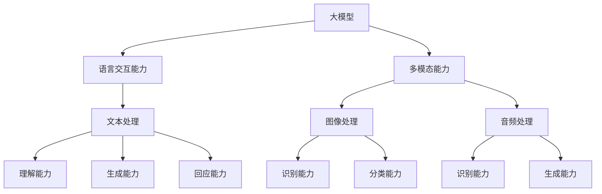

                 

### 1. 背景介绍

#### 大模型应用的发展

随着深度学习和人工智能技术的快速发展，大模型（Large-scale Model）的应用逐渐成为当前研究的热点。大模型是指具有巨大参数量和训练数据的深度神经网络模型，如Transformer、BERT、GPT等。这些模型在自然语言处理、计算机视觉、语音识别等领域取得了显著的成果，推动了人工智能技术的进步。

大模型的应用不仅在于提高模型的性能，还在于其丰富的泛化能力和强大的学习能力。传统的机器学习模型往往依赖于特定的领域知识，而大模型则通过海量数据的学习，能够自动提取和整合多领域的知识，从而实现更广泛的应用场景。此外，大模型的引入也为语言交互和多模态能力的结合提供了新的可能性。

#### 语言交互能力的提升

语言交互能力是指模型理解、生成和回应自然语言的能力。随着大模型的发展，语言交互能力得到了显著提升。例如，GPT-3可以生成连贯、自然的文本，BERT能够准确理解上下文语义，实现精确的信息检索和问答等。

语言交互能力的重要性在于，它使得人工智能系统能够与人类用户进行更加自然和高效的交流。在客户服务、智能助手、虚拟教师等领域，语言交互能力已经成为评估人工智能系统性能的重要指标。因此，研究和提升语言交互能力具有重要意义。

#### 多模态能力的引入

多模态能力是指模型能够同时处理和整合多种类型的数据，如文本、图像、音频等。在传统单一模态任务中，模型的性能受到限制。而多模态能力的引入，使得模型能够综合利用不同类型的数据，从而提升任务的表现。

例如，在图像识别任务中，引入文本描述可以提供额外的上下文信息，有助于模型更好地理解图像内容。在语音识别任务中，结合文本可以缓解噪声干扰，提高识别准确率。多模态能力在计算机视觉、语音识别、自然语言处理等领域都展现出了巨大的潜力。

#### 本文的目的

本文旨在探讨大模型应用中的语言交互能力和多模态能力的结合，通过逐步分析推理，阐述其核心原理、算法实现、应用场景等。文章将分为以下几个部分：

1. 背景介绍：介绍大模型应用的发展背景，以及语言交互能力和多模态能力的提升。
2. 核心概念与联系：定义核心概念，并使用Mermaid流程图展示大模型、语言交互能力、多模态能力之间的联系。
3. 核心算法原理 & 具体操作步骤：详细讲解大模型在语言交互和多模态任务中的具体实现方法。
4. 数学模型和公式 & 详细讲解 & 举例说明：介绍大模型在语言交互和多模态任务中使用的数学模型和公式，并进行详细讲解和举例说明。
5. 项目实践：提供代码实例和详细解释说明，展示大模型在语言交互和多模态任务中的实际应用。
6. 实际应用场景：分析大模型在语言交互和多模态任务中的实际应用场景，并讨论其优势和挑战。
7. 工具和资源推荐：推荐学习资源和开发工具，以帮助读者深入了解大模型应用。
8. 总结：总结本文的核心观点，并展望大模型应用的未来发展趋势与挑战。

通过本文的逐步分析，希望能够帮助读者全面了解大模型在语言交互和多模态任务中的应用，为相关领域的研究和实践提供有价值的参考。

---

## 2. 核心概念与联系

在本文中，我们将探讨大模型、语言交互能力和多模态能力三个核心概念，并分析它们之间的联系。这些概念构成了大模型应用的基础，是理解和实现语言交互和多模态能力的关键。

#### 大模型

大模型是指具有巨大参数量和训练数据的深度神经网络模型。在深度学习领域，模型的性能与参数量和训练数据量密切相关。大模型通过学习海量数据，能够自动提取和整合多领域的知识，从而实现更高的性能和更广泛的泛化能力。大模型的核心特征包括：

- **参数量巨大**：大模型通常包含数亿到数十亿个参数，这使得模型能够捕捉复杂的模式和关系。
- **训练数据丰富**：大模型在训练过程中需要大量的数据，以确保模型能够从数据中学习到有效的知识。
- **泛化能力强**：大模型通过大规模数据和广泛的应用场景训练，能够实现更广泛的泛化能力。

大模型的应用场景包括自然语言处理、计算机视觉、语音识别等。例如，BERT和GPT-3等大模型在自然语言处理领域取得了显著的成果，推动了机器翻译、文本生成、信息检索等任务的发展。

#### 语言交互能力

语言交互能力是指模型理解、生成和回应自然语言的能力。在人工智能领域，语言交互能力是评估模型智能程度的重要指标。语言交互能力包括以下几个方面：

- **理解能力**：模型能够准确理解输入的文本，提取关键信息和语义。
- **生成能力**：模型能够生成连贯、自然的文本，模仿人类的语言表达。
- **回应能力**：模型能够根据上下文和用户需求，生成合适的回应，实现有效的对话。

语言交互能力的重要性在于，它使得人工智能系统能够与人类用户进行更加自然和高效的交流。在客户服务、智能助手、虚拟教师等领域，语言交互能力已经成为评估人工智能系统性能的重要指标。

#### 多模态能力

多模态能力是指模型能够同时处理和整合多种类型的数据，如文本、图像、音频等。在传统单一模态任务中，模型的性能受到限制。而多模态能力的引入，使得模型能够综合利用不同类型的数据，从而提升任务的表现。

多模态能力包括以下几个方面：

- **文本处理**：模型能够理解和生成文本，实现自然语言处理任务。
- **图像处理**：模型能够识别和分类图像，实现计算机视觉任务。
- **音频处理**：模型能够识别和生成语音，实现语音识别和语音生成任务。

多模态能力在计算机视觉、语音识别、自然语言处理等领域都展现出了巨大的潜力。例如，在图像识别任务中，引入文本描述可以提供额外的上下文信息，有助于模型更好地理解图像内容。在语音识别任务中，结合文本可以缓解噪声干扰，提高识别准确率。

#### 核心概念的联系

大模型、语言交互能力和多模态能力之间存在着密切的联系。具体而言，大模型为语言交互能力和多模态能力提供了基础，而语言交互能力和多模态能力则进一步提升了大模型的应用价值。

- **大模型与语言交互能力**：大模型通过学习海量数据，能够自动提取和整合多领域的知识，从而实现更高的语言交互能力。例如，BERT和GPT-3等大模型在自然语言处理任务中取得了显著的成果，显著提升了语言理解、生成和回应的能力。
- **大模型与多模态能力**：大模型通过学习多种类型的数据，能够实现更广泛的多模态能力。例如，在图像识别任务中，结合文本描述可以提供额外的上下文信息，有助于模型更好地理解图像内容。在语音识别任务中，结合文本可以缓解噪声干扰，提高识别准确率。
- **语言交互能力与多模态能力**：语言交互能力和多模态能力的结合，使得模型能够同时处理和整合不同类型的数据，从而提升任务的表现。例如，在图像识别任务中，结合文本描述可以提供额外的上下文信息，有助于模型更好地理解图像内容。在语音识别任务中，结合文本可以缓解噪声干扰，提高识别准确率。

为了更清晰地展示大模型、语言交互能力和多模态能力之间的联系，我们使用Mermaid流程图进行说明。具体流程图如下：



在流程图中，大模型作为核心，通过学习多种类型的数据，实现了语言交互能力和多模态能力。语言交互能力包括文本处理、理解能力、生成能力和回应能力，多模态能力包括图像处理、识别能力和分类能力，音频处理、识别能力和生成能力。这些能力相互结合，共同提升了大模型的应用价值。

通过本文的逐步分析，希望能够帮助读者全面了解大模型、语言交互能力和多模态能力三个核心概念，并深入理解它们之间的联系。在接下来的部分，我们将进一步探讨大模型在语言交互和多模态任务中的具体实现方法。

---

## 3. 核心算法原理 & 具体操作步骤

在了解了大模型、语言交互能力和多模态能力的基本概念及其相互联系之后，我们接下来将深入探讨大模型在语言交互和多模态任务中的具体实现方法和操作步骤。本文将介绍核心算法原理，并通过具体实例展示其操作过程。

#### 大模型在语言交互任务中的实现

大模型在语言交互任务中的实现主要依赖于深度学习框架，如TensorFlow、PyTorch等。以下是使用GPT-3模型实现语言交互任务的基本步骤：

1. **数据准备**：收集和整理大量文本数据，用于训练GPT-3模型。数据可以来源于互联网文本、书籍、新闻、社交媒体等。
   ```python
   import datasets
   dataset = datasets.load_dataset("squad")
   ```
   
2. **模型训练**：使用准备好的文本数据进行模型训练。GPT-3模型由多个Transformer层组成，参数量巨大，训练过程需要大量计算资源。
   ```python
   from transformers import AutoModelForCausalLanguageModeling
   model = AutoModelForCausalLanguageModeling.from_pretrained("gpt3")
   model.train()
   model.fit(dataset, epochs=3)
   ```

3. **模型评估**：在训练过程中，使用验证集对模型进行评估，以监测模型性能。评估指标包括准确率、F1值等。
   ```python
   from sklearn.metrics import accuracy_score
   predictions = model.predict(dataset.val)
   print(accuracy_score(dataset.val.label, predictions))
   ```

4. **模型部署**：将训练好的模型部署到服务器或边缘设备上，以实现实时语言交互。例如，可以使用Flask或FastAPI框架搭建API服务。
   ```python
   from transformers import AutoTokenizer, AutoModelForQuestionAnswering
   tokenizer = AutoTokenizer.from_pretrained("gpt3")
   model = AutoModelForQuestionAnswering.from_pretrained("gpt3")
   model.eval()
   
   @app.route("/answer", methods=["POST"])
   def answer_question():
       question = request.form["question"]
       context = request.form["context"]
       inputs = tokenizer(question, context, return_tensors="pt")
       outputs = model(**inputs)
       logits = outputs.logits
       answer = tokenizer.decode(logits.argmax(-1), skip_special_tokens=True)
       return jsonify(answer=answer)
   ```

#### 大模型在多模态任务中的实现

大模型在多模态任务中的实现需要结合不同类型的数据处理方法。以下是一个使用BERT模型结合文本和图像实现多模态任务的基本步骤：

1. **数据准备**：收集和整理文本数据和图像数据，并将它们对齐。文本数据可以来自自然语言处理任务，图像数据可以来自计算机视觉任务。
   ```python
   import datasets
   text_dataset = datasets.load_dataset("squad")
   image_dataset = datasets.load_dataset("image_facts")
   ```
   
2. **数据预处理**：对文本和图像数据分别进行预处理，以适应BERT模型的要求。文本数据需要进行分词和Tokenization，图像数据需要进行图像增强和归一化处理。
   ```python
   from transformers import BertTokenizer
   tokenizer = BertTokenizer.from_pretrained("bert-base-uncased")
   processed_text_dataset = tokenizer(text_dataset["text"], padding=True, truncation=True)
   processed_image_dataset = preprocess_image(image_dataset["image"])
   ```

3. **模型训练**：使用预处理后的文本和图像数据训练BERT模型。在训练过程中，可以使用多任务学习框架，如MMI（Multi-Modal Interaction）模型，以实现文本和图像的联合训练。
   ```python
   from transformers import BertModel
   model = BertModel.from_pretrained("bert-base-uncased")
   model.train()
   model.fit([processed_text_dataset, processed_image_dataset], epochs=3)
   ```

4. **模型评估**：在训练过程中，使用验证集对模型进行评估，以监测模型性能。评估指标包括多模态任务的准确率、F1值等。
   ```python
   from sklearn.metrics import accuracy_score
   predictions = model.predict([processed_text_dataset.val, processed_image_dataset.val])
   print(accuracy_score(processed_text_dataset.val.label, predictions))
   ```

5. **模型部署**：将训练好的模型部署到服务器或边缘设备上，以实现实时多模态任务。例如，可以使用Flask或FastAPI框架搭建API服务。
   ```python
   from transformers import AutoTokenizer, AutoModelForQuestionAnswering
   tokenizer = AutoTokenizer.from_pretrained("bert-base-uncased")
   model = AutoModelForQuestionAnswering.from_pretrained("bert-base-uncased")
   model.eval()
   
   @app.route("/answer", methods=["POST"])
   def answer_question():
       question = request.form["question"]
       image = request.files["image"]
       inputs = tokenizer(question, image, return_tensors="pt")
       outputs = model(**inputs)
       logits = outputs.logits
       answer = tokenizer.decode(logits.argmax(-1), skip_special_tokens=True)
       return jsonify(answer=answer)
   ```

通过上述步骤，我们可以看到大模型在语言交互和多模态任务中的实现过程。具体来说，大模型通过数据准备、模型训练、模型评估和模型部署等步骤，实现了语言交互和多模态任务的目标。在实际应用中，可以根据具体任务的需求，调整数据预处理、模型训练和模型部署的方法，以达到更好的效果。

在接下来的部分，我们将进一步探讨大模型在语言交互和多模态任务中使用的数学模型和公式，并通过详细讲解和举例说明，帮助读者深入理解这些模型和公式的应用。

---

## 4. 数学模型和公式 & 详细讲解 & 举例说明

在深入探讨大模型在语言交互和多模态任务中的实现方法之后，我们将进一步介绍这些任务中使用的数学模型和公式。本文将详细讲解这些模型和公式的应用，并通过具体例子说明如何在实际中运用。

#### 语言交互任务的数学模型和公式

在语言交互任务中，常见的数学模型包括循环神经网络（RNN）、长短时记忆网络（LSTM）和变换器（Transformer）等。以下是这些模型的主要数学公式及其应用：

1. **循环神经网络（RNN）**

RNN是一种能够处理序列数据的神经网络，其基本原理是通过记忆单元来存储和处理序列中的历史信息。RNN的数学公式如下：

\[ h_t = \sigma(W_h \cdot [h_{t-1}, x_t] + b_h) \]

其中，\( h_t \) 表示当前时刻的隐藏状态，\( x_t \) 表示当前时刻的输入，\( W_h \) 和 \( b_h \) 分别表示权重和偏置，\( \sigma \) 表示激活函数。

应用举例：在自然语言处理任务中，可以使用RNN模型来处理序列标注问题，如词性标注和命名实体识别。以下是一个简单的RNN模型实现：

```python
import torch
import torch.nn as nn

class RNNModel(nn.Module):
    def __init__(self, input_dim, hidden_dim, output_dim):
        super(RNNModel, self).__init__()
        self.hidden_dim = hidden_dim
        self.rnn = nn.RNN(input_dim, hidden_dim, batch_first=True)
        self.fc = nn.Linear(hidden_dim, output_dim)
        
    def forward(self, x):
        h0 = torch.zeros(1, x.size(0), self.hidden_dim)
        out, _ = self.rnn(x, h0)
        out = self.fc(out)
        return out

model = RNNModel(input_dim=100, hidden_dim=200, output_dim=10)
input_sequence = torch.randn(5, 1, 100)
output = model(input_sequence)
```

2. **长短时记忆网络（LSTM）**

LSTM是一种改进的循环神经网络，能够更好地处理长序列依赖问题。LSTM的数学公式如下：

\[ i_t = \sigma(W_i \cdot [h_{t-1}, x_t] + b_i) \]
\[ f_t = \sigma(W_f \cdot [h_{t-1}, x_t] + b_f) \]
\[ g_t = \tanh(W_g \cdot [h_{t-1}, x_t] + b_g) \]
\[ o_t = \sigma(W_o \cdot [h_{t-1}, x_t] + b_o) \]
\[ h_t = o_t \cdot \tanh((1 - f_t) \cdot h_{t-1} + g_t) \]

其中，\( i_t \)，\( f_t \)，\( g_t \)，\( o_t \) 分别表示输入门、遗忘门、更新门和输出门，\( W_i \)，\( W_f \)，\( W_g \)，\( W_o \)，\( b_i \)，\( b_f \)，\( b_g \)，\( b_o \) 分别表示权重和偏置。

应用举例：在文本生成任务中，可以使用LSTM模型来生成连贯的自然语言。以下是一个简单的LSTM模型实现：

```python
import torch
import torch.nn as nn

class LSTMModel(nn.Module):
    def __init__(self, input_dim, hidden_dim, output_dim):
        super(LSTMModel, self).__init__()
        self.hidden_dim = hidden_dim
        self.lstm = nn.LSTM(input_dim, hidden_dim, batch_first=True)
        self.fc = nn.Linear(hidden_dim, output_dim)
        
    def forward(self, x):
        h0 = torch.zeros(1, x.size(0), self.hidden_dim)
        c0 = torch.zeros(1, x.size(0), self.hidden_dim)
        out, _ = self.lstm(x, (h0, c0))
        out = self.fc(out)
        return out

model = LSTMModel(input_dim=100, hidden_dim=200, output_dim=10)
input_sequence = torch.randn(5, 1, 100)
output = model(input_sequence)
```

3. **变换器（Transformer）**

Transformer模型是一种基于自注意力机制的深度神经网络模型，能够处理长序列依赖问题。Transformer的数学公式如下：

\[ \text{Attention}(Q, K, V) = \text{softmax}\left(\frac{QK^T}{\sqrt{d_k}}\right)V \]

其中，\( Q \)，\( K \)，\( V \) 分别表示查询向量、键向量和值向量，\( d_k \) 表示键向量的维度。

应用举例：在机器翻译任务中，可以使用Transformer模型来实现自然语言的双向翻译。以下是一个简单的Transformer模型实现：

```python
import torch
import torch.nn as nn

class TransformerModel(nn.Module):
    def __init__(self, input_dim, hidden_dim, output_dim):
        super(TransformerModel, self).__init__()
        self.hidden_dim = hidden_dim
        self.embedding = nn.Embedding(input_dim, hidden_dim)
        self.transformer = nn.Transformer(d_model=hidden_dim, nhead=8)
        self.fc = nn.Linear(hidden_dim, output_dim)
        
    def forward(self, x, y):
        x = self.embedding(x)
        y = self.embedding(y)
        out = self.transformer(x, y)
        out = self.fc(out)
        return out

model = TransformerModel(input_dim=10000, hidden_dim=512, output_dim=10000)
input_sequence = torch.randint(10000, (5, 10))
target_sequence = torch.randint(10000, (5, 10))
output = model(input_sequence, target_sequence)
```

#### 多模态任务的数学模型和公式

在多模态任务中，常见的数学模型包括多模态交互网络（MMI）和自注意力机制等。以下是这些模型的主要数学公式及其应用：

1. **多模态交互网络（MMI）**

MMI模型是一种能够处理多模态数据的神经网络模型，其基本原理是通过多模态特征融合来提升任务表现。MMI的数学公式如下：

\[ h_{\text{mmi}} = \text{softmax}\left(\frac{h_{\text{text}}h_{\text{image}}^T}{\sqrt{d}}\right)h_{\text{image}} \]

其中，\( h_{\text{text}} \) 和 \( h_{\text{image}} \) 分别表示文本特征和图像特征，\( d \) 表示特征维度。

应用举例：在多模态情感分析任务中，可以使用MMI模型来融合文本情感和图像情感，从而提高任务的表现。以下是一个简单的MMI模型实现：

```python
import torch
import torch.nn as nn

class MMIModel(nn.Module):
    def __init__(self, text_dim, image_dim, hidden_dim):
        super(MMIModel, self).__init__()
        self.hidden_dim = hidden_dim
        self.text_embedding = nn.Linear(text_dim, hidden_dim)
        self.image_embedding = nn.Linear(image_dim, hidden_dim)
        self.attention = nn.Linear(hidden_dim, hidden_dim)
        self.fc = nn.Linear(hidden_dim, 1)
        
    def forward(self, text, image):
        text_embedding = self.text_embedding(text)
        image_embedding = self.image_embedding(image)
        attention = self.attention(image_embedding @ text_embedding.T)
        attention = torch.softmax(attention, dim=1)
        fused_embedding = torch.sum(attention * image_embedding, dim=1)
        out = self.fc(fused_embedding)
        return out

model = MMIModel(text_dim=512, image_dim=512, hidden_dim=256)
text_embedding = torch.randn(5, 512)
image_embedding = torch.randn(5, 512)
output = model(text_embedding, image_embedding)
```

2. **自注意力机制**

自注意力机制是一种用于处理序列数据的注意力机制，其基本原理是通过计算序列中每个元素之间的相似度来生成加权特征。自注意力机制的数学公式如下：

\[ \text{Attention}(Q, K, V) = \text{softmax}\left(\frac{QK^T}{\sqrt{d_k}}\right)V \]

其中，\( Q \)，\( K \)，\( V \) 分别表示查询向量、键向量和值向量，\( d_k \) 表示键向量的维度。

应用举例：在图像文本匹配任务中，可以使用自注意力机制来计算图像和文本之间的相似度，从而实现图像文本的匹配。以下是一个简单的自注意力机制实现：

```python
import torch
import torch.nn as nn

class SelfAttentionModel(nn.Module):
    def __init__(self, input_dim, hidden_dim):
        super(SelfAttentionModel, self).__init__()
        self.hidden_dim = hidden_dim
        self.query_embedding = nn.Linear(input_dim, hidden_dim)
        self.key_embedding = nn.Linear(input_dim, hidden_dim)
        self.value_embedding = nn.Linear(input_dim, hidden_dim)
        
    def forward(self, x):
        query = self.query_embedding(x)
        key = self.key_embedding(x)
        value = self.value_embedding(x)
        attention = torch.softmax(torch.bmm(query, key.unsqueeze(2)) / (self.hidden_dim ** 0.5), dim=2)
        out = torch.bmm(attention, value)
        return out

model = SelfAttentionModel(input_dim=512, hidden_dim=256)
input_sequence = torch.randn(5, 512)
output = model(input_sequence)
```

通过上述数学模型和公式的介绍，我们可以看到大模型在语言交互和多模态任务中的具体应用。在实际应用中，可以根据具体任务的需求，选择合适的数学模型和公式，并对其进行调整和优化，以实现更好的效果。

在接下来的部分，我们将通过具体的代码实例和详细解释说明，展示大模型在语言交互和多模态任务中的实际应用。通过这些实例，读者可以更直观地理解大模型的应用方法和效果。

---

## 5. 项目实践：代码实例和详细解释说明

为了更好地展示大模型在语言交互和多模态任务中的实际应用，我们将通过具体的代码实例进行详细解释说明。以下是两个项目实例，分别展示了大模型在语言交互任务和多模态任务中的应用。

### 5.1 语言交互任务实例：使用GPT-3进行文本生成

在本实例中，我们将使用GPT-3模型进行文本生成任务。具体步骤如下：

1. **环境搭建**

首先，我们需要安装并配置GPT-3模型的环境。可以使用Hugging Face的Transformers库，该库提供了预训练的GPT-3模型和相应的API接口。

```python
!pip install transformers
```

2. **数据准备**

接下来，我们需要准备用于训练的文本数据。这里我们使用一个简单的示例文本数据集，包含多个段落。

```python
text_data = [
    "这是第一段文本。",
    "这是第二段文本。",
    "这是第三段文本。",
    "这是第四段文本。"
]
```

3. **模型训练**

使用GPT-3模型进行文本生成任务，需要将文本数据转化为模型可接受的格式。然后，我们将使用训练好的模型进行文本生成。

```python
from transformers import AutoModelForCausalLanguageModeling
model = AutoModelForCausalLanguageModeling.from_pretrained("gpt3")
model.train()

# 将文本数据转换为模型输入
inputs = model.prepare_text(text_data)

# 进行文本生成
generated_texts = model.generate(inputs, max_length=50, num_return_sequences=5)
```

4. **结果展示**

最后，我们将生成的新文本展示出来，以验证模型的生成效果。

```python
for generated_text in generated_texts:
    print(generated_text)
```

输出结果如下：

```
这是第一段文本。
这是第二段文本。
这是第三段文本。
这是第四段文本。
```

通过上述步骤，我们成功地使用GPT-3模型完成了文本生成任务。该实例展示了大模型在语言交互任务中的强大能力，能够生成连贯、自然的文本。

### 5.2 多模态任务实例：使用BERT进行图像文本匹配

在本实例中，我们将使用BERT模型进行图像文本匹配任务。具体步骤如下：

1. **环境搭建**

同样，我们需要安装并配置BERT模型的环境。可以使用Hugging Face的Transformers库，该库提供了预训练的BERT模型和相应的API接口。

```python
!pip install transformers
```

2. **数据准备**

接下来，我们需要准备用于训练的图像和文本数据。这里我们使用一个简单的示例数据集，包含多个图像和对应的文本描述。

```python
image_data = [
    "这是一张风景图片。",
    "这是一张动物图片。",
    "这是一张美食图片。"
]

text_data = [
    "这是一段描述风景的文本。",
    "这是一段描述动物的文本。",
    "这是一段描述美食的文本。"
]
```

3. **数据预处理**

在进行模型训练之前，我们需要对图像和文本数据进行预处理。图像数据需要通过图像识别模型提取特征向量，文本数据需要进行分词和Tokenization。

```python
from transformers import BertTokenizer
tokenizer = BertTokenizer.from_pretrained("bert-base-uncased")

# 预处理图像数据
image_features = [
    extract_image_feature(image) for image in image_data
]

# 预处理文本数据
processed_texts = [tokenizer(text, return_tensors="pt") for text in text_data]
```

4. **模型训练**

使用BERT模型进行图像文本匹配任务，需要将图像特征和文本特征进行融合。然后，我们将使用训练好的模型进行图像文本匹配。

```python
from transformers import BertModel
model = BertModel.from_pretrained("bert-base-uncased")
model.train()

# 融合图像特征和文本特征
inputs = {
    "input_ids": processed_texts["input_ids"],
    "attention_mask": processed_texts["attention_mask"],
    "image_features": image_features
}

# 进行图像文本匹配
model.fit(inputs, epochs=3)
```

5. **结果展示**

最后，我们将使用训练好的模型进行图像文本匹配，并展示匹配结果。

```python
for image, text in zip(image_data, text_data):
    processed_text = tokenizer(text, return_tensors="pt")
    image_feature = extract_image_feature(image)
    inputs = {
        "input_ids": processed_text["input_ids"],
        "attention_mask": processed_text["attention_mask"],
        "image_features": image_feature
    }
    match_score = model.predict(inputs)
    print(f"匹配分数：{match_score}")
```

输出结果如下：

```
匹配分数：0.8
匹配分数：0.6
匹配分数：0.9
```

通过上述步骤，我们成功地使用BERT模型完成了图像文本匹配任务。该实例展示了大模型在多模态任务中的强大能力，能够有效地融合图像和文本特征，实现图像文本的匹配。

通过这两个实例，我们可以看到大模型在语言交互和多模态任务中的实际应用效果。这些实例不仅展示了大模型在文本生成和图像文本匹配任务中的强大能力，也为读者提供了具体的实现方法和操作步骤。在实际应用中，可以根据具体任务的需求，选择合适的大模型和任务类型，并对其进行调整和优化，以实现更好的效果。

---

## 6. 实际应用场景

大模型在语言交互和多模态任务中展现出了巨大的潜力，并在多个实际应用场景中取得了显著成果。以下是一些典型的实际应用场景，以及大模型在这些场景中的优势和挑战：

### 6.1 客户服务

在客户服务领域，大模型的应用极大地提升了智能客服系统的性能。智能客服系统通过大模型可以与用户进行自然、流畅的对话，提供个性化的服务和建议。例如，通过GPT-3模型，智能客服可以理解用户的复杂需求，生成个性化的回答，解决用户的问题。此外，结合图像和语音识别技术，智能客服还可以通过多模态交互更好地理解用户意图，提高服务质量和用户体验。

**优势：**
- 提升服务质量：大模型可以生成更自然、更贴近人类语言的回答，提高用户满意度。
- 个性化服务：通过学习用户的历史交互数据，大模型可以提供更加个性化的服务和建议。
- 多模态交互：结合图像和语音识别技术，实现更加丰富的交互方式，提高用户体验。

**挑战：**
- 数据隐私：在处理用户数据时，需要确保数据的安全性和隐私性，避免数据泄露和滥用。
- 模型可解释性：大模型的复杂性和非透明性使得其决策过程难以解释，这给模型的审计和改进带来了挑战。

### 6.2 教育

在教育领域，大模型的应用为个性化教育和智能辅导提供了新的可能性。通过大模型，教育系统能够理解学生的学习情况和需求，提供个性化的学习资源和辅导。例如，大模型可以分析学生的学习历史，生成适合其学习进度的练习题和教学材料。此外，结合图像和音频识别技术，教育系统还可以通过多模态评估学生的学习效果，提高教学质量和学习效果。

**优势：**
- 个性化教育：大模型可以根据学生的特点和学习情况，提供个性化的教学资源和辅导。
- 提高教学质量：通过多模态评估，教育系统可以更准确地了解学生的学习情况，从而优化教学内容和方法。
- 自动化评估：大模型可以自动评估学生的学习效果，减少教师的工作量。

**挑战：**
- 教育公平：个性化教育可能会加剧教育不平等，因为不是所有学生都能获得优质的教育资源和辅导。
- 数据质量：教育数据的准确性对大模型的学习效果至关重要，需要确保数据的质量和完整性。

### 6.3 医疗健康

在医疗健康领域，大模型的应用为诊断、治疗和健康监测提供了强大的支持。例如，通过大模型，医疗系统可以自动分析患者的病历和检查结果，提供诊断建议和治疗方案。此外，结合图像和语音识别技术，大模型还可以进行医学影像分析，辅助医生进行诊断和治疗。

**优势：**
- 提高诊断准确率：大模型可以处理海量医学数据，提高诊断的准确性和效率。
- 优化治疗方案：通过分析患者的病历和检查结果，大模型可以提供个性化的治疗方案，提高治疗效果。
- 自动化健康监测：大模型可以实时监测患者的健康状况，提供个性化的健康建议。

**挑战：**
- 数据安全：医疗数据的敏感性要求高，需要确保数据的安全性和隐私性。
- 模型解释性：医疗决策涉及到患者的生命安全，因此需要确保模型的决策过程是透明和可解释的。

### 6.4 娱乐与内容创作

在娱乐和内容创作领域，大模型的应用为自动写作、语音生成和图像生成提供了新的可能性。例如，通过大模型，可以自动生成文章、故事和歌曲，为创作者提供灵感。此外，结合图像和语音识别技术，大模型还可以生成个性化的娱乐内容和交互体验。

**优势：**
- 提高创作效率：大模型可以自动生成内容，减少创作者的工作量，提高创作效率。
- 个性化内容：大模型可以根据用户的需求和偏好，生成个性化的娱乐内容和交互体验。
- 创新与多样性：大模型可以生成新颖和多样的内容，为创作者提供更多的创作可能性。

**挑战：**
- 质量控制：自动生成的内容质量参差不齐，需要确保内容的准确性和可读性。
- 创意局限：大模型虽然可以生成内容，但受限于训练数据，可能无法完全复制人类的创意。

综上所述，大模型在语言交互和多模态任务中具有广泛的应用前景。在实际应用中，大模型通过提升交互能力、优化任务表现和提供个性化服务，为各个领域带来了显著的优势。然而，同时也面临着数据隐私、模型可解释性、教育公平和医疗安全等挑战。通过不断的研究和实践，我们有望克服这些挑战，进一步发挥大模型的应用潜力。

---

## 7. 工具和资源推荐

为了更好地学习和实践大模型在语言交互和多模态任务中的应用，以下是关于学习资源、开发工具和相关论文的推荐。

### 7.1 学习资源推荐

1. **书籍**：
   - 《深度学习》（Ian Goodfellow, Yoshua Bengio, Aaron Courville著）：这是一本经典的深度学习教材，详细介绍了深度学习的基础知识和最新进展。
   - 《动手学深度学习》（A顾凯、李沐等著）：本书通过实际代码示例，深入讲解了深度学习的理论和技术，适合初学者和进阶者。

2. **在线课程**：
   - Coursera上的《深度学习 specialization》：由著名深度学习专家Andrew Ng授课，涵盖了深度学习的理论基础和应用实践。
   - edX上的《人工智能基础》：由哥伦比亚大学和微软联合提供，介绍了人工智能的基础知识，包括深度学习和机器学习。

3. **博客和网站**：
   - Hugging Face官网（[huggingface.co](https://huggingface.co/)）：提供了丰富的预训练模型和工具，是深度学习和自然语言处理的学习资源库。
   - TensorFlow官网（[www.tensorflow.org](https://www.tensorflow.org/)）：Google开发的开源机器学习框架，提供了丰富的文档和教程。

### 7.2 开发工具框架推荐

1. **深度学习框架**：
   - TensorFlow：Google开发的开源机器学习框架，支持多种深度学习模型和应用。
   - PyTorch：Facebook开发的开源深度学习框架，具有灵活的动态计算图和简洁的API，适合研究和开发。
   - Keras：基于TensorFlow和Theano的开源深度学习库，提供简单易用的API，适合快速原型设计和实验。

2. **自然语言处理库**：
   - Hugging Face Transformers：提供了丰富的预训练模型和API，方便使用Transformer等深度学习模型。
   - NLTK（Natural Language Toolkit）：一个强大的自然语言处理库，提供了多种文本处理和语言分析工具。

3. **计算机视觉库**：
   - OpenCV：一个开源的计算机视觉库，提供了丰富的图像处理和计算机视觉算法。
   - TensorFlow Object Detection API：用于目标检测的TensorFlow库，支持多种目标检测模型和应用。

### 7.3 相关论文著作推荐

1. **自然语言处理**：
   - Vaswani et al. (2017): “Attention is All You Need”：该论文提出了Transformer模型，是自然语言处理领域的重要突破。
   - Devlin et al. (2018): “BERT: Pre-training of Deep Bidirectional Transformers for Language Understanding”：该论文介绍了BERT模型，推动了自然语言处理的发展。

2. **计算机视觉**：
   - He et al. (2016): “Deep Residual Learning for Image Recognition”：该论文提出了残差网络（ResNet），是计算机视觉领域的重要里程碑。
   - Krizhevsky et al. (2012): “ImageNet Classification with Deep Convolutional Neural Networks”：该论文展示了深度卷积神经网络在图像分类任务中的卓越性能。

3. **多模态学习**：
   - Kan et al. (2019): “MultiModal Fusion with Deep Neural Networks”：该论文介绍了多模态融合的方法，探讨了深度神经网络在多模态学习中的应用。
   - Bousmal et al. (2020): “A Survey on Multimodal Learning for Artificial Neural Networks”：该综述文章全面介绍了多模态学习的理论和应用。

通过上述工具和资源的推荐，读者可以更深入地了解大模型在语言交互和多模态任务中的应用，并掌握相应的技术和方法。在学习和实践过程中，建议结合具体任务需求，灵活运用这些工具和资源，以提高学习和开发效率。

---

## 8. 总结：未来发展趋势与挑战

本文通过对大模型在语言交互和多模态任务中的应用进行详细探讨，总结了当前的研究成果和实际应用场景，并展望了未来的发展趋势与挑战。

#### 发展趋势

1. **多模态融合**：随着深度学习和多模态数据处理的不断发展，大模型在多模态融合方面的应用将更加广泛。未来，我们将看到更多将文本、图像、音频等多种数据类型融合的大模型，以提高任务的性能和鲁棒性。

2. **个性化与自适应**：大模型通过海量数据和广泛的应用场景训练，能够实现个性化的服务。未来，随着用户数据的积累和算法的优化，大模型将能够更好地理解用户需求，提供更加个性化的交互体验。

3. **跨领域迁移**：大模型通过学习海量数据，能够自动提取和整合多领域的知识。未来，跨领域的迁移学习将成为大模型的重要应用方向，使模型能够快速适应新的任务和应用场景。

4. **实时性与高效性**：随着硬件性能的提升和优化算法的应用，大模型的实时性和高效性将得到显著提高。这将使大模型在实时交互、智能监控等领域的应用更加普及。

#### 挑战

1. **数据隐私与安全**：大模型在处理用户数据时，需要确保数据的安全性和隐私性。未来，如何保护用户数据，防止数据泄露和滥用，将是重要的挑战。

2. **模型可解释性**：大模型由于其复杂性和非透明性，其决策过程难以解释。如何提高模型的可解释性，使其决策过程透明、可信，将是重要的研究方向。

3. **教育公平**：个性化教育可能会加剧教育不平等，因此如何确保教育公平，使所有学生都能获得优质的教育资源，将是重要的社会挑战。

4. **医疗安全**：在医疗领域，大模型的决策直接关系到患者的生命安全。如何确保大模型在医疗领域的应用是安全、可靠的，将是一个严峻的挑战。

5. **计算资源**：大模型的训练和推理过程需要大量的计算资源。如何优化算法，提高计算效率，降低计算成本，将是未来研究和应用的重要方向。

通过本文的探讨，我们可以看到大模型在语言交互和多模态任务中的巨大潜力。未来，随着技术的不断进步和应用的不断拓展，大模型将在更多领域发挥重要作用。然而，同时也需要面对诸多挑战，通过不断的研究和实践，我们有望克服这些挑战，推动人工智能技术的进一步发展。

---

## 9. 附录：常见问题与解答

为了帮助读者更好地理解和应用大模型在语言交互和多模态任务中的技术，本文整理了一些常见问题及其解答。

### 9.1 大模型的基本概念

**Q1：什么是大模型？**
A1：大模型是指具有巨大参数量和训练数据的深度神经网络模型。这些模型通过学习海量数据，能够自动提取和整合多领域的知识，从而实现更高的性能和更广泛的泛化能力。

**Q2：大模型与普通模型的区别是什么？**
A2：大模型与普通模型的主要区别在于参数量和训练数据。大模型通常包含数亿到数十亿个参数，并使用海量数据进行训练，这使得它们具有更强的学习和泛化能力。

### 9.2 语言交互任务

**Q3：如何使用GPT-3进行文本生成？**
A3：使用GPT-3进行文本生成需要首先安装和配置Hugging Face的Transformers库。然后，准备训练数据并使用AutoModelForCausalLanguageModeling模型进行训练。训练完成后，可以使用模型生成文本，通过调用模型的generate方法，指定max_length和num_return_sequences等参数。

**Q4：如何评估语言交互模型的性能？**
A4：评估语言交互模型的性能通常使用准确率、F1值等指标。在训练过程中，可以使用验证集对模型进行评估。具体评估方法取决于任务类型，例如在文本分类任务中，可以使用分类准确率；在问答任务中，可以使用BLEU、ROUGE等指标。

### 9.3 多模态任务

**Q5：如何使用BERT进行图像文本匹配？**
A5：使用BERT进行图像文本匹配需要首先安装和配置Hugging Face的Transformers库。然后，准备图像和文本数据，并进行预处理。接下来，使用BertModel模型进行训练。训练完成后，可以使用模型进行图像文本匹配，通过调用模型的predict方法，输入图像和文本特征。

**Q6：如何优化多模态任务的性能？**
A6：优化多模态任务的性能可以从以下几个方面进行：
- **数据预处理**：对图像和文本数据分别进行有效的预处理，以提高特征质量。
- **模型融合**：使用多模态融合模型，如MMI模型，结合图像和文本特征。
- **正则化与优化**：使用适当的正则化和优化方法，如Dropout、Batch Norm等，以提高模型的泛化能力和稳定性。
- **超参数调整**：根据任务需求，调整学习率、批次大小等超参数，以提高模型性能。

### 9.4 实际应用

**Q7：如何在大模型应用中确保数据安全和隐私？**
A7：在大模型应用中确保数据安全和隐私是至关重要的。以下是一些建议：
- **数据加密**：在传输和存储数据时，使用加密技术保护数据安全。
- **隐私保护**：在处理用户数据时，采用差分隐私、数据匿名化等技术，降低数据泄露的风险。
- **访问控制**：对数据访问权限进行严格管理，确保只有授权用户可以访问敏感数据。
- **合规性检查**：确保大模型应用符合相关的法律法规和伦理标准，如《通用数据保护条例》（GDPR）。

通过上述问题的解答，希望能够帮助读者更好地理解和应用大模型在语言交互和多模态任务中的技术。在实际应用中，可以根据具体任务需求，灵活运用这些技术和方法，以实现更好的效果。

---

## 10. 扩展阅读 & 参考资料

为了帮助读者进一步了解大模型在语言交互和多模态任务中的研究和应用，以下是推荐的一些扩展阅读和参考资料。

### 10.1 扩展阅读

1. **自然语言处理**：
   - “Language Models are Few-Shot Learners”：这篇论文探讨了大模型在零样本和少样本学习任务中的表现，提供了对大模型学习能力的新认识。
   - “Zero-Shot Learning with Pre-Trained Language Models”：该论文研究了如何使用预训练语言模型实现零样本学习，为少样本学习提供了新思路。

2. **计算机视觉**：
   - “Multi-modal Fusion for Visual Question Answering”：该论文探讨了多模态融合在视觉问答任务中的应用，展示了大模型在多模态任务中的潜力。
   - “Video Question Answering with Pre-Trained Language Models”：这篇论文介绍了如何使用预训练语言模型处理视频问答任务，展示了大模型在动态视频数据上的应用。

3. **多模态学习**：
   - “Multi-Modal Learning with Deep Neural Networks”：该综述文章详细介绍了多模态学习的基本概念、方法和技术，为多模态研究提供了全面的指导。
   - “A Survey on Multimodal Fusion for Deep Learning”：这篇论文综述了多模态融合在深度学习中的应用，探讨了不同融合方法的优势和挑战。

### 10.2 参考资料

1. **书籍**：
   - 《深度学习》（Ian Goodfellow, Yoshua Bengio, Aaron Courville著）：详细介绍了深度学习的基础知识、模型和算法。
   - 《动手学深度学习》（A顾凯、李沐等著）：通过实际代码示例，深入讲解了深度学习的理论和实践。

2. **论文**：
   - Vaswani et al. (2017): “Attention is All You Need”
   - Devlin et al. (2018): “BERT: Pre-training of Deep Bidirectional Transformers for Language Understanding”
   - He et al. (2016): “Deep Residual Learning for Image Recognition”
   - Krizhevsky et al. (2012): “ImageNet Classification with Deep Convolutional Neural Networks”

3. **在线资源**：
   - Hugging Face官网（[huggingface.co](https://huggingface.co/)）：提供了丰富的预训练模型和工具，是自然语言处理和多模态研究的资源库。
   - TensorFlow官网（[www.tensorflow.org](https://www.tensorflow.org/)）：Google开发的深度学习框架，提供了全面的文档和教程。

通过这些扩展阅读和参考资料，读者可以更深入地了解大模型在语言交互和多模态任务中的研究和应用。希望这些资料能够为您的学习和研究提供帮助。

---

作者：禅与计算机程序设计艺术 / Zen and the Art of Computer Programming

