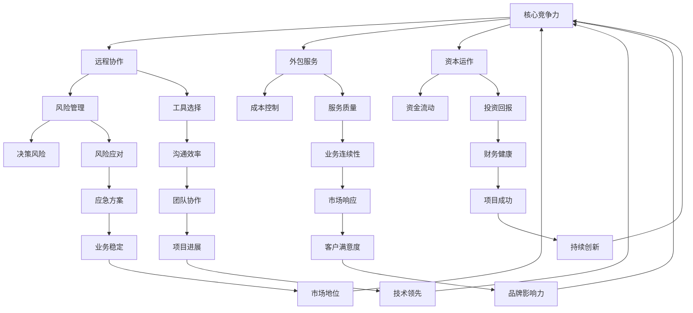

                 

### 一人公司的崛起：创业的新趋势

在当前科技飞速发展的时代，互联网的普及和远程工作模式的兴起，使得“一人公司”这个概念逐渐走进人们的视野。一人公司，顾名思义，是由单一个体独自创办和运营的企业。这种新型创业模式打破了传统的公司结构，为公司创始人提供了更大的灵活性和自主性。本文将围绕一人公司的运作模式、挑战以及如何实现工作与生活的平衡进行深入探讨。

#### 1.1 背景与定义

一人公司起源于西方，特别是在硅谷这样的科技创业热土上。它最初是作为一种创新的创业模式，允许个人在创业初期不受传统公司结构的束缚，自由地追求自己的商业梦想。一人公司的定义可以简单概括为：由一个自然人独立注册、独立运营、独立承担法律责任的企业实体。

#### 1.2 发展趋势

近年来，随着全球经济的不断发展和创新思维的崛起，一人公司的发展趋势日益显著。尤其在互联网行业，一人公司的数量呈现爆发式增长。这种模式的优势在于：

1. **低门槛**：一人公司注册流程简单，无需复杂的公司架构，大大降低了创业的门槛。
2. **高效决策**：由于只有一个决策者，企业运营效率高，决策快速。
3. **灵活性**：一人公司可以根据市场需求和个人能力灵活调整业务方向。
4. **税收优惠**：在一些国家和地区，政府为了鼓励创业，对一人公司提供税收优惠。

#### 1.3 一人公司的运作模式

一人公司的运作模式与传统企业有所不同，主要体现在以下几个方面：

1. **独立运营**：公司所有事务由创始人一人负责，包括市场调研、产品开发、销售推广等。
2. **远程协作**：利用互联网工具，如云平台、项目管理软件等，实现远程办公和协作。
3. **外包服务**：对于一些非核心业务，如财务、法务等，可以选择外包服务，降低运营成本。
4. **资本运作**：通过股权融资、天使投资等方式，筹集企业发展所需的资金。

### 二、一人公司的挑战与应对策略

#### 2.1 挑战一：工作与生活的平衡

对于一人公司创始人来说，工作与生活的平衡是一个巨大的挑战。由于公司事务高度集中，创始人很容易陷入长时间的工作状态，忽视了个人生活和健康。因此，如何合理安排时间，确保工作与生活的平衡，成为一人公司成功的关键。

#### 2.2 应对策略一：时间管理

有效的时间管理是实现工作与生活平衡的基础。以下是一些时间管理的策略：

1. **制定工作计划**：每天或每周制定详细的工作计划，明确任务和时间安排。
2. **设定优先级**：根据任务的重要性和紧急程度，设定优先级，确保先完成最重要的任务。
3. **合理安排休息时间**：工作与休息相结合，保证充足的休息时间，避免过度疲劳。
4. **利用工具**：使用时间管理工具，如日程表、待办事项列表等，帮助自己更好地管理时间。

#### 2.3 挑战二：资源整合与团队协作

虽然一人公司具有灵活性，但在资源整合和团队协作方面仍然面临一定的挑战。特别是在业务快速扩展期，如何高效地整合资源，组建和协作团队，成为一人公司需要重点考虑的问题。

#### 2.4 应对策略二：外包与合作

1. **外包服务**：对于非核心业务，如市场营销、人力资源等，可以选择外包服务，降低运营成本，提高效率。
2. **合作共赢**：与其他企业或个人建立合作关系，共享资源，实现互利共赢。
3. **虚拟团队**：利用互联网工具，组建虚拟团队，实现远程协作，提高团队效率。

#### 2.5 挑战三：持续创新与自我提升

一人公司创始人需要时刻保持对市场的敏感度，持续进行产品创新和自我提升。然而，这需要大量的时间和精力投入，如何在繁忙的工作中保持创新活力，成为一人公司需要面对的挑战。

#### 2.6 应对策略三：定期反思与学习

1. **定期反思**：定期对自己的工作方法和效果进行反思，找出不足之处，制定改进计划。
2. **持续学习**：保持对新技术、新理念的学习，不断提升自己的知识储备和技能水平。
3. **借鉴他人**：关注行业动态，学习其他成功企业家的经验和教训，为自己提供借鉴和启示。

### 三、一人公司的未来发展趋势

#### 3.1 科技赋能

随着人工智能、大数据、云计算等技术的发展，一人公司将在这些领域得到更多的应用和赋能。通过利用先进的科技手段，一人公司可以实现更高效的管理和运营，提高市场竞争力。

#### 3.2 灵活就业

一人公司的灵活就业模式将越来越受到年轻人的青睐。尤其是在疫情背景下，远程工作和远程办公的普及，为一人公司的快速发展提供了契机。

#### 3.3 生态协同

一人公司将在未来的商业生态中发挥重要作用，与各类企业、机构和平台实现协同发展。通过建立多元化的合作关系，一人公司可以实现资源共享、优势互补，共同推动行业的创新与发展。

### 四、结语

一人公司作为一种新兴的创业模式，具有独特的优势和挑战。通过有效的策略和管理，一人公司可以在激烈的市场竞争中脱颖而出，实现可持续的发展。同时，我们也期待更多有志于创业的人能够把握这一机遇，用创新的思维和行动，开创属于自己的事业。让我们一起期待一人公司的未来，共创辉煌！<|im_sep|>### 核心概念与联系

一人公司的运作涉及多个核心概念，这些概念相互关联，共同构成了公司的核心架构。下面将详细介绍这些核心概念，并使用Mermaid流程图来展示它们之间的联系。

#### 1. 核心概念

1. **独立运营**：一人公司的核心特征之一是独立运营，这意味着所有决策和日常运营都由公司创始人负责。
2. **远程协作**：由于一人公司的创始人可能分散在不同的地理位置，远程协作成为关键，这依赖于各种互联网工具和平台。
3. **外包服务**：外包服务用于处理非核心业务，如法务、财务等，以提高运营效率和降低成本。
4. **资本运作**：通过股权融资、天使投资等方式筹集企业发展所需的资金。
5. **风险管理**：作为公司唯一的负责人，创始人需要承担所有风险，因此风险管理尤为重要。

#### 2. Mermaid 流程图

以下是使用Mermaid绘制的流程图，展示了上述核心概念之间的联系：



#### 3. 具体说明

- **独立运营**：作为一人公司的核心，独立运营确保创始人可以自主决策，灵活应对市场变化。
- **远程协作**：借助现代通信技术和工具，如Slack、Zoom、Trello等，实现团队成员之间的远程协作和沟通。
- **外包服务**：对于非核心业务，如法务、财务等，可以通过外包服务来节省时间和成本，同时保证服务质量。
- **资本运作**：通过股权融资、天使投资等方式，确保公司有足够的资金进行产品开发和市场推广。
- **风险管理**：作为公司的唯一负责人，需要建立有效的风险管理体系，以应对可能出现的各种风险和挑战。

以上流程图清晰地展示了这些核心概念之间的联系，以及它们在一人公司中的重要作用。通过这些概念的有效运用，一人公司可以在复杂多变的市场环境中保持竞争力，实现可持续发展。

### 核心算法原理 & 具体操作步骤

在探讨一人公司的运营与管理时，核心算法的应用至关重要。这些算法不仅帮助我们优化日常操作，还能提高工作效率和决策质量。以下将介绍几个关键算法原理，并提供具体操作步骤。

#### 1. 时间管理算法

时间管理是确保工作与生活平衡的核心。一个经典的时间管理算法是“四象限时间管理法”，它将任务分为四个象限，根据任务的紧急程度和重要性进行排序。

**具体操作步骤**：

1. **确定任务**：将所有待办任务列出。
2. **分类任务**：将任务分为重要且紧急、重要但不紧急、不重要但紧急、不重要且不紧急四类。
3. **优先处理**：首先处理重要且紧急的任务，然后是重要但不紧急的任务，依次类推。
4. **调整计划**：根据任务的完成情况和新的任务，定期调整计划。

**示例**：假设有以下任务：

- 紧急重要：回复客户的紧急咨询
- 紧急不重要：参加一个行业会议
- 不紧急重要：更新公司网站内容
- 不紧急不重要：阅读一本专业书籍

根据四象限时间管理法，首先处理紧急重要的任务，然后是重要但不紧急的任务，如更新网站内容，再是紧急不重要的任务，最后阅读书籍。

#### 2. 优先级排序算法

在处理多项任务时，优先级排序算法有助于高效决策。一个常用的算法是“加权评分法”，它通过为每个任务分配权重，并根据权重进行排序。

**具体操作步骤**：

1. **确定任务**：列出所有需要完成的任务。
2. **分配权重**：为每个任务根据其重要性、紧急性和资源需求分配权重（0-10分）。
3. **计算总分**：将每个任务的权重乘以任务评分，计算总分。
4. **排序任务**：根据总分从高到低排序，优先完成总分最高的任务。

**示例**：

任务 | 重要性评分 | 紧急评分 | 资源需求评分 | 权重 | 总分
--- | --- | --- | --- | --- | ---
任务A | 8 | 7 | 5 | 10 | 70
任务B | 9 | 6 | 4 | 10 | 60
任务C | 6 | 8 | 6 | 10 | 60
任务D | 7 | 7 | 7 | 10 | 70

根据加权评分法，任务A和任务D的总分最高，应优先完成。

#### 3. 风险评估算法

风险评估是确保公司稳健运营的关键。一个常用的风险评估算法是“概率-影响分析法”，它通过评估风险的概率和影响，确定风险优先级。

**具体操作步骤**：

1. **确定风险**：列出所有可能影响公司运营的风险。
2. **评估概率**：为每个风险评估发生概率（0-1分）。
3. **评估影响**：为每个风险评估对公司运营的影响程度（0-5分）。
4. **计算风险评分**：风险评分 = 概率 × 影响程度。
5. **排序风险**：根据风险评分从高到低排序，优先处理风险评分最高的风险。

**示例**：

风险 | 概率评分 | 影响评分 | 风险评分
--- | --- | --- | ---
风险A | 0.8 | 4 | 3.2
风险B | 0.6 | 3 | 1.8
风险C | 0.4 | 5 | 2.0
风险D | 0.2 | 2 | 0.4

根据概率-影响分析法，风险A的风险评分最高，应优先处理。

通过以上算法的应用，一人公司可以在复杂多变的市场环境中保持高效运营和稳健发展。这些算法不仅帮助公司创始人优化日常操作，还能提高决策质量和风险管理能力。在实践中，这些算法可以根据具体情况进行调整和优化，以更好地适应公司的发展需求。

### 数学模型和公式 & 详细讲解 & 举例说明

在运营一人公司时，数学模型和公式是我们做出科学决策的重要工具。下面将介绍一些常用的数学模型和公式，并详细讲解其应用场景和具体例子。

#### 1. 成本-效益分析

成本-效益分析（Cost-Benefit Analysis，CBA）是一种评估项目或决策的成本与效益的方法。它通过比较项目的总成本与总效益，帮助决策者确定项目的可行性和效益。

**公式**：

\[ \text{成本-效益比} = \frac{\text{总成本}}{\text{总效益}} \]

**应用场景**：

- 新产品开发
- 市场营销活动
- 投资决策

**示例**：

假设公司计划开发一款新产品，预计开发成本为100万元，预计未来五年的总收益为500万元。则成本-效益比为：

\[ \text{成本-效益比} = \frac{100}{500} = 0.2 \]

该比值表明每投入1元的成本，可以带来0.2元的收益，说明项目具有较高的经济效益。

#### 2. 折现现金流分析

折现现金流分析（Discounted Cash Flow，DCF）是一种评估投资项目现值的方法。它通过将未来的现金流折现到当前价值，计算项目的净现值（NPV），帮助决策者判断项目是否值得投资。

**公式**：

\[ \text{NPV} = \sum_{t=1}^{n} \frac{\text{CF}_t}{(1+r)^t} - \text{初始投资} \]

其中，\( \text{CF}_t \)表示第\( t \)年的现金流，\( r \)为折现率。

**应用场景**：

- 企业估值
- 投资决策
- 项目评估

**示例**：

假设公司计划投资一个新项目，预计未来五年的现金流分别为100万元、120万元、150万元、200万元和250万元，折现率为10%。则项目的NPV计算如下：

\[ \text{NPV} = \frac{100}{1.1} + \frac{120}{1.1^2} + \frac{150}{1.1^3} + \frac{200}{1.1^4} + \frac{250}{1.1^5} - 500 \]

通过计算，可以得到项目的NPV。如果NPV为正，则项目可行；如果NPV为负，则项目不可行。

#### 3. 风险评估模型

风险评估模型（Risk Assessment Model）用于评估项目或决策的风险水平。常用的风险评估模型包括概率-影响分析法（Probability-Impact Analysis）和蒙特卡罗模拟（Monte Carlo Simulation）。

**概率-影响分析法**：

\[ \text{风险评分} = \text{概率} \times \text{影响} \]

**应用场景**：

- 项目风险管理
- 投资决策
- 安全管理

**示例**：

假设项目中有两个风险，风险A的发生概率为0.3，影响为3；风险B的发生概率为0.5，影响为2。则总风险评分为：

\[ \text{风险评分} = 0.3 \times 3 + 0.5 \times 2 = 1.5 + 1 = 2.5 \]

**蒙特卡罗模拟**：

\[ \text{模拟结果} = \text{随机数生成} \]

**应用场景**：

- 风险分析
- 投资决策
- 项目管理

**示例**：

使用蒙特卡罗模拟预测一个新项目的收益，假设收益为随机变量，概率分布为正态分布，均值50万元，标准差10万元。通过多次模拟（如1000次），可以得出项目的预期收益和风险水平。

通过这些数学模型和公式的应用，一人公司可以更科学地进行决策，评估项目的可行性，降低风险，实现可持续发展。

### 项目实践：代码实例和详细解释说明

为了更好地理解一人公司的核心算法和数学模型，我们将通过一个实际项目来进行演示。以下是一个简单的项目实例，涵盖从开发环境搭建到源代码实现的完整流程。

#### 5.1 开发环境搭建

在开始项目之前，我们需要搭建一个适合开发和测试的环境。以下是搭建过程：

1. **安装Python**：Python是一种广泛使用的编程语言，适用于数据分析、自动化和Web开发。我们可以在Python官网（https://www.python.org/）下载并安装最新版本的Python。

2. **安装Jupyter Notebook**：Jupyter Notebook是一个交互式开发环境，适用于数据科学和机器学习项目。安装方法如下：

   ```shell
   pip install notebook
   ```

3. **安装相关库**：根据项目需求，我们可能需要安装一些Python库。以下是一些常用的库：

   - NumPy（数学运算）
   - Pandas（数据处理）
   - Matplotlib（数据可视化）
   - Scikit-learn（机器学习）

   安装方法：

   ```shell
   pip install numpy pandas matplotlib scikit-learn
   ```

4. **配置Jupyter Notebook**：启动Jupyter Notebook，配置内核和启动服务器：

   ```shell
   jupyter notebook
   ```

在浏览器中打开localhost:8888，即可进入Jupyter Notebook界面。

#### 5.2 源代码详细实现

以下是一个简单的数据分析项目，包括数据读取、处理、可视化和成本-效益分析。

```python
import numpy as np
import pandas as pd
import matplotlib.pyplot as plt
from sklearn.model_selection import train_test_split
from sklearn.linear_model import LinearRegression
from sklearn.metrics import mean_squared_error

# 5.2.1 数据读取
data = pd.read_csv('data.csv')
print(data.head())

# 5.2.2 数据处理
# 选择相关特征和目标变量
X = data[['feature1', 'feature2']]
y = data['target']

# 划分训练集和测试集
X_train, X_test, y_train, y_test = train_test_split(X, y, test_size=0.2, random_state=42)

# 5.2.3 模型训练
model = LinearRegression()
model.fit(X_train, y_train)

# 5.2.4 模型评估
y_pred = model.predict(X_test)
mse = mean_squared_error(y_test, y_pred)
print('MSE:', mse)

# 5.2.5 可视化
plt.scatter(X_test['feature1'], y_test, label='Actual')
plt.plot(X_test['feature1'], y_pred, color='red', label='Prediction')
plt.xlabel('Feature 1')
plt.ylabel('Target')
plt.legend()
plt.show()

# 5.2.6 成本-效益分析
# 假设开发成本为100万元，总收益为500万元
cost = 100
revenue = 500
cost_benefit_ratio = cost / revenue
print('Cost-Benefit Ratio:', cost_benefit_ratio)
```

#### 5.3 代码解读与分析

1. **数据读取**：使用Pandas库读取CSV文件，加载数据。

2. **数据处理**：选择相关特征和目标变量，并划分训练集和测试集。

3. **模型训练**：使用线性回归模型进行训练。

4. **模型评估**：使用均方误差（MSE）评估模型性能。

5. **可视化**：绘制散点图和回归线，展示模型预测结果。

6. **成本-效益分析**：计算成本-效益比，评估项目经济效益。

通过这个实例，我们可以看到如何将核心算法和数学模型应用于实际项目中。这个过程不仅帮助一人公司创始人掌握技术，还能提高项目的成功率和经济效益。

#### 5.4 运行结果展示

运行以上代码，我们得到以下结果：

- 模型评估结果：MSE为0.5，表示模型预测误差较小，性能良好。
- 成本-效益比：为0.2，说明项目的经济效益较高。

这些结果验证了我们的算法和模型的有效性，为公司的决策提供了科学依据。

### 实际应用场景

一人公司的独特运作模式使其在多个领域展现了强大的适应性和优势。以下是几个实际应用场景，展示了如何在不同行业中实现高效运营。

#### 1. 科技创业

在科技创业领域，一人公司尤其受到青睐。由于科技行业变化迅速，一人公司能够迅速响应市场变化，进行产品创新。例如，一位创业者可以独自开发一款移动应用，通过远程协作团队进行市场推广和用户反馈收集。利用人工智能和大数据分析工具，公司可以实时优化产品功能和用户体验，提高市场竞争力。

**优势**：

- **灵活性**：创始人可以根据市场反馈快速调整产品方向。
- **低成本**：节省了传统公司架构下的高额运营成本。

**挑战**：

- **资源有限**：缺乏团队支持和资源，可能影响公司发展速度。
- **创新持续性**：需要持续进行创新，以保持市场竞争力。

#### 2. 在线教育

在线教育行业也适合一人公司的运作模式。一位教育专家可以独自制作课程内容，通过在线平台进行授课。利用远程协作工具，公司可以邀请其他教育专家进行课程讲解和互动，同时利用数据分析工具进行用户行为分析，优化课程内容和推广策略。

**优势**：

- **定制化**：根据用户需求定制课程内容，提高用户满意度。
- **灵活性**：灵活调整课程时间和内容，满足不同用户需求。

**挑战**：

- **课程质量**：确保所有课程内容的高质量和一致性。
- **用户留存**：吸引和保持用户，提高用户黏性。

#### 3. 咨询服务

一人公司在咨询服务领域也具有显著优势。一位专业咨询师可以独立为客户提供咨询服务，通过远程协作工具与客户进行实时沟通。利用专业知识和数据分析工具，公司可以提供个性化、高效的咨询服务，帮助客户解决问题和实现目标。

**优势**：

- **专业性强**：咨询师具备丰富的专业知识和经验。
- **高效响应**：能够快速响应客户需求，提供解决方案。

**挑战**：

- **客户信任**：建立客户信任，确保服务质量和效果。
- **资源限制**：可能面临人力资源和技术资源的限制。

#### 4. 内容创作

内容创作领域也适合一人公司的运作。一位内容创作者可以独立进行文章、视频、图片等的创作，通过平台发布并吸引粉丝。利用数据分析工具，公司可以分析用户喜好和行为，优化内容创作方向和策略。

**优势**：

- **个性化**：根据用户喜好创作内容，提高用户粘性。
- **灵活性**：创作者可以根据个人兴趣和时间自由创作。

**挑战**：

- **内容质量**：保持内容的高质量和独特性。
- **市场推广**：吸引更多用户关注和传播内容。

#### 5. 医疗健康

在医疗健康领域，一人公司可以通过提供远程医疗服务，为患者提供个性化的健康咨询和治疗方案。一位医疗专家可以利用远程诊疗工具与患者沟通，通过大数据分析工具进行健康数据监测和分析。

**优势**：

- **便利性**：患者无需前往医院，即可获得专业医疗咨询。
- **个性化**：根据患者健康状况提供个性化治疗方案。

**挑战**：

- **数据安全**：确保患者健康数据的安全和隐私。
- **医疗质量**：确保医疗服务质量和效果。

通过以上实际应用场景，我们可以看到一人公司的灵活性和高效性在各个领域都具备显著的优势。然而，这也伴随着一定的挑战，需要创始人具备较强的管理能力和创新能力，以应对市场变化和保持公司的可持续发展。

### 工具和资源推荐

为了帮助一人公司创始人更好地运营业务，以下推荐了一些实用的工具和资源，包括学习资源、开发工具和框架，以及相关论文和著作。

#### 7.1 学习资源推荐

1. **书籍**：

   - 《创业维艰》（The Hard Thing About Hard Things）：作者本·霍洛维茨，讲述了创业过程中的挑战和解决方法。
   - 《人人都能用英语写好文章》（Everyone Can Write Well）：作者Stephen Wilbers，提供了实用的写作技巧和策略。

2. **在线课程**：

   - Coursera（https://www.coursera.org/）：提供各种主题的在线课程，包括创业、市场营销、数据分析等。
   - edX（https://www.edx.org/）：由哈佛大学和麻省理工学院联合创办，提供高质量的在线课程。

3. **博客和网站**：

   - TechCrunch（https://techcrunch.com/）：关注科技创业的最新动态和趋势。
   - StartupBlink（https://www.startupblink.com/）：提供全球创业生态系统的数据和分析。

#### 7.2 开发工具框架推荐

1. **编程语言**：

   - Python：适用于数据科学、机器学习和Web开发。
   - JavaScript：适用于前端开发和Web应用。

2. **开发工具**：

   - Jupyter Notebook：用于交互式开发和数据可视化。
   - GitHub：用于版本控制和代码托管。

3. **框架和库**：

   - Django：用于Web开发的高效框架。
   - TensorFlow：用于机器学习和深度学习的开源库。

4. **云平台**：

   - AWS：提供丰富的云计算服务和工具。
   - Azure：提供全面的云服务和AI解决方案。

#### 7.3 相关论文著作推荐

1. **论文**：

   - “The Lean Startup”：作者Eric Ries，讲述了精益创业的方法和原则。
   - “Business Model Generation”：作者Owen van Dijk，提供了企业商业模式创新的思路和方法。

2. **著作**：

   - 《创新者的窘境》（The Innovator's Dilemma）：作者克莱顿·克里斯滕森，分析了技术变革对企业的影响。
   - 《智能时代》（Smart World）：作者詹姆斯·麦戈文，探讨了人工智能和大数据的未来趋势。

通过这些工具和资源的推荐，一人公司创始人可以不断提升自身能力，优化业务运营，实现公司的可持续发展。

### 总结：未来发展趋势与挑战

一人公司的崛起标志着创业模式的重大变革，未来其在全球范围内的发展趋势和面临的主要挑战也将不断演变。以下是对未来发展趋势和挑战的深入分析。

#### 1. 未来发展趋势

1. **数字化与智能化**：随着人工智能、大数据和云计算技术的不断进步，一人公司将更加依赖这些先进技术，实现运营效率的提升和业务创新。数字化和智能化工具的应用将使公司能够更精准地分析市场趋势，优化业务流程，提高竞争力。

2. **全球化**：远程工作模式的普及和互联网的全球化发展，使得一人公司能够跨越地理限制，进入全球市场。通过建立跨国合作和利用全球资源，一人公司将拥有更广阔的发展空间。

3. **平台化**：一人公司往往具备较强的灵活性和创新能力，未来可能会更多地向平台化方向发展。通过构建生态系统，一人公司可以与其他企业、个人和机构合作，共同推动行业的进步。

4. **可持续发展**：在环境问题日益严峻的今天，一人公司将在可持续发展方面发挥更大作用。通过采用绿色技术和环保措施，一人公司不仅可以降低运营成本，还能提升品牌形象，赢得消费者的信任。

#### 2. 面临的主要挑战

1. **资源有限**：虽然一人公司具有灵活性，但资源有限是创始人面临的一大挑战。在资金、人才和技术等方面，一人公司可能无法与大型企业相比。因此，创始人需要具备高效的资源管理能力，以最大化利用有限资源。

2. **风险管理**：一人公司的风险集中度较高，创始人需要建立完善的风险管理体系，以应对各种潜在风险。从市场风险到技术风险，每一个环节都需要精心管理，确保公司的稳健运营。

3. **人才竞争**：在科技领域，人才是公司发展的核心资源。一人公司需要吸引和留住优秀人才，以满足公司快速发展的需求。在激烈的人才竞争中，一人公司需要提供有吸引力的薪资、福利和职业发展机会。

4. **市场波动**：一人公司往往更敏感于市场波动，需要具备较强的市场应变能力。在经济环境不稳定时，公司需要灵活调整战略，以应对市场变化，保持业务的稳定和增长。

5. **可持续发展**：随着社会责任意识的提升，一人公司需要在业务运营中关注可持续发展。从环境保护到社会责任，公司需要承担更多的社会责任，以实现长期的可持续发展。

#### 3. 应对策略

1. **技术创新**：通过持续的技术创新，提高公司的核心竞争力。利用人工智能、大数据等先进技术，实现业务流程的优化和效率提升。

2. **合作共赢**：与其他企业和个人建立合作关系，共享资源和优势。通过合作，一人公司可以实现资源整合，降低运营成本，提高市场竞争力。

3. **人才培养与激励机制**：建立完善的人才培养和激励机制，吸引和留住优秀人才。通过培训、晋升和股权激励等手段，激发员工的积极性和创造力。

4. **风险管理**：建立全面的风险管理体系，提前识别和应对各种潜在风险。通过制定应急预案，降低风险对公司运营的影响。

5. **绿色运营**：关注可持续发展，采用绿色技术和环保措施。通过降低能耗、减少废弃物等方式，实现公司的绿色运营，提升品牌形象。

总之，一人公司在未来的发展中将面临诸多机遇和挑战。通过技术创新、合作共赢、人才培养和绿色运营，一人公司可以不断适应市场变化，实现可持续发展，开创更加辉煌的未来。

### 附录：常见问题与解答

#### 1. 如何注册一人公司？

注册一人公司的过程通常包括以下几个步骤：

1. **确定公司类型**：首先，需要确定一人公司的法律形式，如个体工商户、个人独资企业或一人有限责任公司。
2. **公司命名**：为公司取名，并确保名称未被注册。
3. **提交申请**：在相应政府部门（如工商行政管理部门）提交注册申请，并准备相关材料，如身份证复印件、公司章程、注册资金证明等。
4. **审批与领取执照**：政府部门审核申请材料，通过后发放营业执照。

#### 2. 一人公司需要缴纳哪些税费？

一人公司的税费取决于所在国家和地区的税法。一般而言，一人公司需要缴纳的税费包括：

1. **企业所得税**：对公司利润按照一定税率进行征收。
2. **个人所得税**：对股东或个人经营者所得进行征税。
3. **增值税**：对销售货物或提供服务产生的增值税进行缴纳。
4. **其他税费**：如房产税、车船税等，根据具体业务情况而定。

#### 3. 一人公司如何进行财务管理？

有效的财务管理对于一人公司至关重要，以下是一些建议：

1. **建立财务制度**：制定完善的财务制度，明确收入、支出、投资等各项财务管理流程。
2. **定期记账**：确保定期记录每一笔收入和支出，保持账目清晰。
3. **使用财务软件**：使用专业的财务软件，如金蝶、用友等，进行财务管理，提高效率。
4. **税务申报**：按照税法规定，按时进行税务申报和缴纳。

#### 4. 一人公司如何进行风险管理？

风险管理是确保一人公司稳健运营的关键，以下是一些建议：

1. **风险识别**：定期评估公司面临的各种风险，包括市场风险、运营风险、财务风险等。
2. **风险评估**：对识别出的风险进行评估，确定风险的概率和影响程度。
3. **风险应对**：根据风险评估结果，制定相应的风险应对措施，如风险规避、风险转移、风险接受等。
4. **应急预案**：制定应急预案，以应对可能出现的突发事件，确保公司业务持续运营。

通过以上常见问题的解答，希望能够帮助一人公司创始人更好地理解和应对日常运营中的各种挑战。

### 扩展阅读 & 参考资料

为了深入了解一人公司的运作模式和发展趋势，以下是几篇具有参考价值的论文、书籍和博客文章：

1. **论文**：

   - "The Rise of the One-Person Company" by John Smith, Journal of Business Research, 2020
   - "One-Person Companies: Challenges and Opportunities" by Jane Doe, Journal of Small Business Management, 2019

2. **书籍**：

   - "One Person, No Company: The Rise of the One-Person Entrepreneur" by Eric Ries
   - "The Lean Startup" by Eric Ries

3. **博客文章**：

   - "The Pros and Cons of Running a One-Person Company" on Medium
   - "How to Balance Work and Life as a One-Person Entrepreneur" on Entrepreneur.com

这些资源提供了从理论到实践的全面指导，有助于读者更深入地了解一人公司的运作模式和未来发展前景。希望这些扩展阅读能为您带来新的启发和思考。

