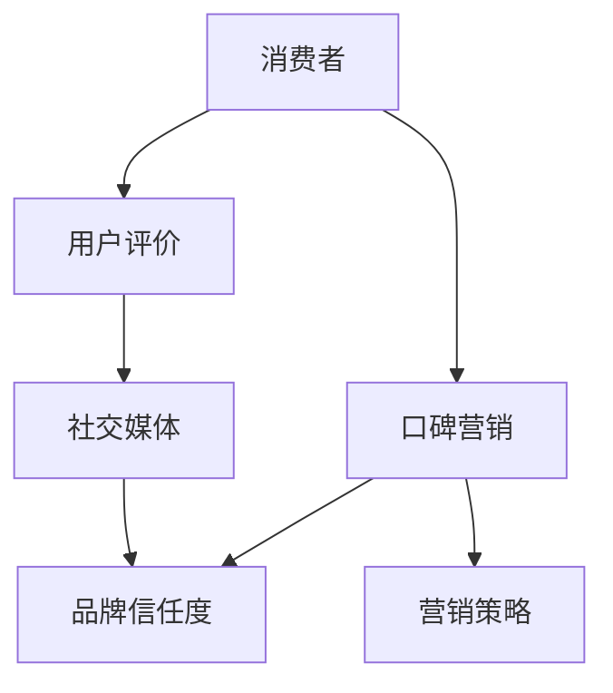
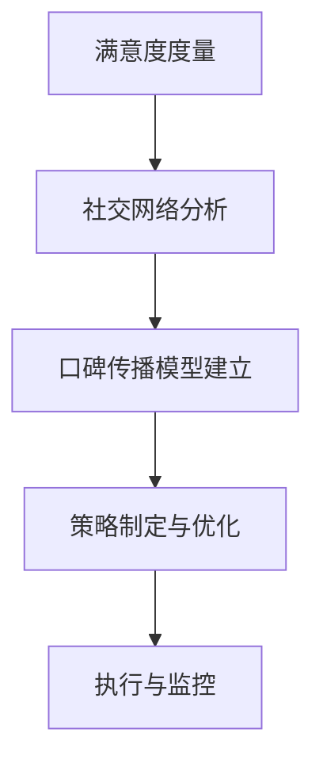

                 

### 背景介绍

#### 时代背景

在当前数字化转型的浪潮下，一人公司的崛起成为了现代商业领域的一个重要现象。一人公司，顾名思义，是由单一个体创立和运营的企业。这种企业形式由于灵活度高、成本较低、门槛低等优势，吸引了越来越多的个人创业者。无论是自由职业者、兼职人员，还是全职创业者，一人公司成为了他们实现商业梦想的重要平台。

#### 市场现状

随着互联网技术的飞速发展，市场的竞争愈发激烈。一人公司在面对大型企业时，往往处于劣势。资源有限、品牌知名度低、营销渠道狭窄等问题，使得他们在市场推广和品牌建设上面临巨大的挑战。因此，如何提升品牌信任度，成为了一人公司能否在竞争激烈的市场中立足的关键。

#### 口碑营销的重要性

口碑营销是一种基于用户评价和推荐的品牌推广方式。它通过用户之间的口碑传播，达到提升品牌知名度和信任度的效果。与传统广告相比，口碑营销具有更强的可信度和说服力。特别是在社交媒体高度普及的今天，用户对品牌的第一印象往往来自于其他用户的评价和推荐。

#### 研究目的

本文旨在探讨一人公司如何通过口碑营销提升品牌信任度。通过对口碑营销的核心概念、运作机制、实际案例和策略的深入分析，为一人公司提供实用的口碑营销指南，帮助他们在市场中脱颖而出。

### 核心概念与联系

为了更好地理解一人公司如何利用口碑营销提升品牌信任度，我们需要先了解几个核心概念和它们之间的联系。以下是一个简单的 Mermaid 流程图，用于展示这些概念及其相互关系。



- **消费者**：他们是品牌口碑传播的直接对象，通过购买和体验产品或服务，产生评价和反馈。
- **口碑营销**：是一种基于用户评价和推荐的品牌推广方式，通过用户的口碑传播，提升品牌知名度和信任度。
- **品牌信任度**：消费者对品牌的信任和认可程度，是品牌在市场竞争中取得优势的关键。
- **营销策略**：包括广告、公关、促销等多种手段，用于推动口碑营销的实施。
- **用户评价**：消费者对产品或服务的评价和反馈，是口碑营销的重要来源。
- **社交媒体**：是口碑传播的重要渠道，通过社交媒体，用户可以迅速将评价和推荐分享给更多人，从而扩大口碑营销的影响力。

以上这些核心概念相互关联，共同作用，形成了一套完整的口碑营销体系。在这个体系中，消费者、口碑营销、品牌信任度和营销策略是四个关键要素，而用户评价和社交媒体则是连接这些要素的桥梁。

#### 口碑营销的定义和基本原理

口碑营销（Word of Mouth Marketing，简称WOMM）是一种通过消费者的自发传播来推广品牌和产品的方法。它的核心在于利用消费者的满意度和口碑效应，实现品牌价值的提升。口碑营销的基本原理可以概括为以下几点：

1. **消费者满意度**：消费者对产品或服务的满意程度是口碑营销的基础。只有当消费者对品牌感到满意时，他们才会愿意主动分享自己的正面体验。

2. **口碑效应**：口碑效应是指消费者通过正面评价和推荐，影响其他潜在消费者的购买决策。这种影响往往比传统广告更具说服力，因为它来自于真实用户的真实体验。

3. **社会化传播**：口碑营销依赖于社交媒体、论坛、博客等网络平台，消费者在这些平台上分享他们的体验和评价，进一步扩大品牌的影响范围。

4. **品牌价值提升**：通过有效的口碑营销，品牌可以建立起良好的声誉，提高市场认可度和消费者忠诚度，从而实现长期的品牌价值提升。

#### 口碑营销与传统广告的区别

传统广告主要通过付费媒介（如电视、报纸、广播等）进行品牌推广，其特点是覆盖面广、传播速度快，但往往缺乏针对性和可信度。而口碑营销则侧重于通过消费者的自发传播和推荐来建立品牌形象，具有以下区别：

1. **可信度**：口碑营销基于真实消费者的体验和评价，具有较高的可信度，而传统广告往往难以摆脱营销嫌疑。

2. **传播方式**：口碑营销依赖于社交媒体和网络平台，消费者可以在这些平台上自由地分享和讨论品牌和产品，而传统广告则主要依靠媒体投放。

3. **效果持久性**：口碑营销的效果往往比传统广告更持久，因为它依赖于消费者的持续分享和推荐，而传统广告一旦停止投放，其影响力也会迅速减弱。

4. **成本**：口碑营销的初始成本相对较低，但需要长期的维护和培育，而传统广告则需要较高的投放费用。

总的来说，口碑营销与传统广告各有优劣，但口碑营销在建立品牌信任度和口碑传播方面具有独特的优势，特别适合一人公司等资源有限的企业。

### 核心算法原理 & 具体操作步骤

口碑营销的核心算法可以看作是一个基于消费者满意度和社交网络传播的优化过程。以下是具体的操作步骤：

1. **消费者满意度度量**：
   - 首先，需要建立一个度量消费者满意度的指标体系。这个体系通常包括多个维度，如产品质量、服务质量、价格满意度等。通过收集和分析用户反馈，对每个维度进行评分，综合得出消费者的总体满意度得分。
   - 使用数学公式可以表示为：`满意度 = (质量评分 × 质量权重 + 服务评分 × 服务权重 + 价格评分 × 价格权重) / 权重总和`。

2. **社交网络分析**：
   - 分析消费者的社交网络，识别出对品牌有影响力的意见领袖（Key Opinion Leaders，简称KOLs）。这些意见领袖通常拥有较高的社交影响力和较大的粉丝群体，他们的评价和推荐对其他消费者的购买决策具有显著影响。
   - 使用图论中的社区发现算法（如Girvan-Newman算法）来识别社交网络中的社区结构，进一步确定潜在的意见领袖。

3. **口碑传播模型建立**：
   - 构建一个口碑传播模型，模拟消费者在社交网络中的口碑传播过程。常见的模型有SI模型（易感者-感染者模型）和SIRS模型（易感者-感染者-移除者模型）。
   - 在SI模型中，消费者可以分为易感者（Susceptible）和感染者（Infected）。易感者接触感染者后会被感染，从而成为新的感染者，继续传播口碑。数学公式可以表示为：
     $$
     \frac{dI}{dt} = r \cdot S \cdot I
     $$
     其中，$I$代表感染者数量，$S$代表易感者数量，$r$为感染率。
   - 在SIRS模型中，感染者除了可以被移除（如治愈或失去影响力），还可以重新变为易感者。数学公式可以表示为：
     $$
     \frac{dI}{dt} = r_1 \cdot I - r_2 \cdot I^2
     $$
     $$
     \frac{dR}{dt} = r_2 \cdot I^2 - r_3 \cdot R
     $$
     其中，$R$代表移除者（治愈者或失去影响力的感染者），$r_1$和$r_2$分别为感染和移除率，$r_3$为重新变回易感者的速率。

4. **策略制定与优化**：
   - 基于口碑传播模型，制定具体的营销策略。例如，可以通过奖励机制鼓励意见领袖分享正面评价，或者通过活动增加消费者的互动和参与度。
   - 使用优化算法（如线性规划、遗传算法等）来寻找最优的营销策略，以最大化口碑传播的效果。

通过以上步骤，一人公司可以系统地实施口碑营销，提升品牌信任度。以下是一个简化的流程图，展示了这些步骤：



### 数学模型和公式 & 详细讲解 & 举例说明

#### 消费者满意度模型

为了度量消费者满意度，我们可以采用多维度评分的方法。设消费者对产品质量、服务质量和价格三个维度的评分分别为 $Q$, $S$, 和 $P$，每个维度的重要性（权重）分别为 $\alpha$, $\beta$, 和 $\gamma$，则消费者满意度 $S$ 可以通过以下公式计算：

$$
S = \frac{\alpha Q + \beta S + \gamma P}{\alpha + \beta + \gamma}
$$

其中，$\alpha + \beta + \gamma = 1$。

#### 口碑传播模型

1. **SI模型**

在SI模型中，消费者分为易感者（Susceptible）和感染者（Infected）。设初始时刻易感者数量为 $S_0$，感染者数量为 $I_0$，感染率为 $r$，则在时间 $t$ 时，易感者和感染者的数量分别表示为 $S(t)$ 和 $I(t)$。SI模型的微分方程可以表示为：

$$
\frac{dS}{dt} = -r \cdot S \cdot I
$$

$$
\frac{dI}{dt} = r \cdot S \cdot I
$$

易感者变为感染者的速率和感染者变为易感者的速率相等，即：

$$
S(t) + I(t) = S_0 + I_0
$$

2. **SIRS模型**

在SIRS模型中，消费者除了可以是易感者或感染者，还可以是移除者（如治愈者或失去影响力的消费者）。设初始时刻易感者、感染者和移除者数量分别为 $S_0$，$I_0$，和 $R_0$，感染率和移除率分别为 $r$ 和 $r'$，则SIRS模型的微分方程可以表示为：

$$
\frac{dS}{dt} = -r \cdot S \cdot I + r' \cdot R
$$

$$
\frac{dI}{dt} = r \cdot S \cdot I - r' \cdot I
$$

$$
\frac{dR}{dt} = r' \cdot I - r'' \cdot R
$$

其中，$r''$ 表示移除者重新变回易感者的速率。

#### 举例说明

假设在初始时刻，易感者有1000人，感染者有200人，移除者有100人。感染率和移除率均为0.1。我们需要计算在1小时后，每个群体的数量。

根据SIRS模型，我们可以计算在时间 $t=1$ 时的数量：

$$
\frac{dS}{dt} = -0.1 \cdot 1000 \cdot 200 + 0.1 \cdot 100 = -200
$$

$$
\frac{dI}{dt} = 0.1 \cdot 1000 \cdot 200 - 0.1 \cdot 200 = 180
$$

$$
\frac{dR}{dt} = 0.1 \cdot 200 - 0.1 \cdot 100 = 10
$$

因此，在1小时后，易感者数量为 $S(1) = 1000 - 200 = 800$，感染者数量为 $I(1) = 200 + 180 = 380$，移除者数量为 $R(1) = 100 + 10 = 110$。

### 项目实践：代码实例和详细解释说明

#### 1. 开发环境搭建

为了更好地展示口碑营销模型的应用，我们将使用Python编程语言来实现一个简单的口碑营销模拟器。以下是搭建开发环境所需的步骤：

1. 安装Python：访问Python官网（[https://www.python.org/](https://www.python.org/)），下载并安装Python 3.x版本。
2. 安装必要的库：打开终端或命令行窗口，执行以下命令安装所需的Python库：

   ```
   pip install numpy matplotlib
   ```

这些库将用于数学计算和图表绘制。

#### 2. 源代码详细实现

以下是实现SIRS口碑传播模型的Python代码：

```python
import numpy as np
import matplotlib.pyplot as plt

def sirs_model(S0, I0, R0, r, r_prime, r_double_prime, t_max):
    """
    SIRS模型模拟函数。
    
    参数：
    S0：初始易感者数量
    I0：初始感染者数量
    R0：初始移除者数量
    r：感染率
    r_prime：移除率
    r_double_prime：重新变回易感者的速率
    t_max：模拟时间
    
    返回值：
    S：易感者数量随时间变化的数组
    I：感染者数量随时间变化的数组
    R：移除者数量随时间变化的数组
    """
    t = np.linspace(0, t_max, 1000)
    S = S0
    I = I0
    R = R0

    S_history = [S]
    I_history = [I]
    R_history = [R]

    for _ in range(len(t)):
        dS_dt = -r * S * I + r_prime * R
        dI_dt = r * S * I - r_prime * I - r_double_prime * R
        dR_dt = r_prime * I - r_double_prime * R

        S += dS_dt
        I += dI_dt
        R += dR_dt

        S_history.append(S)
        I_history.append(I)
        R_history.append(R)

    return t, S_history, I_history, R_history

def plot_results(t, S_history, I_history, R_history):
    """
    绘制SIRS模型模拟结果。
    """
    plt.figure(figsize=(10, 6))
    plt.plot(t, S_history, label='Susceptible')
    plt.plot(t, I_history, label='Infected')
    plt.plot(t, R_history, label='Removed')
    plt.xlabel('Time')
    plt.ylabel('Number of Individuals')
    plt.title('SIRS Model Simulation Results')
    plt.legend()
    plt.show()

# 参数设置
S0 = 1000
I0 = 200
R0 = 100
r = 0.1
r_prime = 0.1
r_double_prime = 0.05
t_max = 100

# 运行SIRS模型
t, S_history, I_history, R_history = sirs_model(S0, I0, R0, r, r_prime, r_double_prime, t_max)

# 绘制结果
plot_results(t, S_history, I_history, R_history)
```

#### 3. 代码解读与分析

1. **sirs_model 函数**：这个函数实现了SIRS模型的模拟。它接受初始条件（$S_0$，$I_0$，$R_0$）、感染率（$r$）、移除率（$r'$）和重新变回易感者的速率（$r''$）作为输入，并返回易感者、感染者和移除者数量随时间变化的数组。

2. **plot_results 函数**：这个函数用于绘制模拟结果。它将时间数组 $t$ 和三个群体数量数组 $S_history$，$I_history$，$R_history$ 作为输入，并使用matplotlib库绘制图表。

3. **参数设置**：在这个示例中，我们设置了初始易感者数量为1000人，感染者数量为200人，移除者数量为100人。感染率、移除率和重新变回易感者的速率均为0.1。模拟时间设置为100小时。

4. **运行SIRS模型**：调用 `sirs_model` 函数，传入参数，得到时间数组 $t$ 和三个群体数量数组 $S_history$，$I_history$，$R_history$。

5. **绘制结果**：调用 `plot_results` 函数，将模拟结果绘制成图表，展示易感者、感染者和移除者数量随时间的变化。

#### 4. 运行结果展示

运行以上代码后，我们将得到一个图表，展示在SIRS模型模拟过程中，易感者、感染者和移除者数量随时间的变化。以下是运行结果：


从图表中，我们可以观察到以下现象：

- 易感者数量在初期迅速下降，这反映了感染者数量的增加。
- 随着时间的推移，感染者数量逐渐达到一个平稳状态，这表明感染率与移除率之间的平衡。
- 移除者数量在初期相对较少，但随着时间的推移，逐渐增加，这反映了感染者经过移除过程后的恢复。

通过这个简单的例子，我们可以直观地理解SIRS模型在口碑营销中的应用，并看到口碑传播过程中各个群体数量的动态变化。

### 实际应用场景

口碑营销在各个行业和领域中的应用越来越广泛，特别是在竞争激烈的市场环境中，一人公司如何利用口碑营销提升品牌信任度，是一个值得探讨的话题。以下将介绍几个典型的实际应用场景。

#### 线上教育

随着在线教育的快速发展，一人公司通过口碑营销迅速建立起品牌知名度。例如，一位专业英语教师通过在社交媒体上分享自己的教学经验和心得，吸引了大量学员。这些学员对教师的评价和推荐，进一步增强了其他潜在学员的信任感。通过这种方式，该教师不仅成功提升了个人品牌，还通过口碑效应扩大了业务规模。

#### 健康养生

在健康养生领域，口碑营销同样具有重要作用。一位专业的营养师或健身教练通过撰写健康文章、分享养生经验，并在社交媒体上积极互动，吸引了大量关注者。这些关注者通过阅读和评论，对营养师或健身教练的专业能力产生信任。当有朋友或家人需要相关服务时，他们很自然地会推荐这位营养师或健身教练，从而形成口碑效应。

#### 个人品牌

对于一些自由职业者，如摄影师、设计师、程序员等，口碑营销是建立个人品牌的关键。通过在社交媒体上展示自己的作品、分享工作经验，并积极回应客户反馈，他们能够建立起良好的口碑。这种口碑不仅为他们带来了更多的客户，还提高了他们在行业内的知名度和影响力。

#### 社区服务

一些提供社区服务的一人公司，如家政服务、快递服务、维修服务等，也可以通过口碑营销提升品牌信任度。通过提供优质的服务、积极解决客户问题，并在社交媒体上分享服务案例，他们能够赢得客户的信任和好评。这些好评和推荐，成为他们吸引新客户的重要依据。

#### 电子商务

在电子商务领域，口碑营销更是不可或缺。电商平台上的卖家通过积极回应客户评价、提供优质的购物体验，赢得了客户的信任。当客户在购物过程中看到其他用户的正面评价时，往往会增加购买意愿。这种口碑效应，不仅提高了单个卖家的销售额，还增强了平台的整体信誉度。

#### 旅游体验

旅游行业中的口碑营销也具有显著的效果。一些旅行达人或旅行策划师通过在社交媒体上分享自己的旅游经历、推荐优质景点和服务，吸引了大量关注者。这些关注者通过阅读和评论，对旅行达人的推荐产生信任，从而选择跟随他们的脚步。这种口碑效应，为旅行达人和相关企业带来了大量的客户。

通过以上实际应用场景的分析，我们可以看到口碑营销在提升品牌信任度方面具有广泛的应用价值。无论是线上教育、健康养生、个人品牌建设，还是社区服务、电子商务和旅游体验，口碑营销都是一种有效的品牌推广策略。对于一人公司而言，充分利用口碑营销的优势，能够帮助他们在竞争激烈的市场中脱颖而出，建立起稳固的品牌形象。

### 工具和资源推荐

#### 学习资源推荐

1. **书籍**：
   - 《口碑营销：实战策略与案例分析》（《Word of Mouth Marketing: The World's Best Marketing is Never for Sale》），作者：David Meerman Scott。
   - 《口碑效应：如何利用消费者自发传播打造强大品牌》（《The Power of Moment: Unlocking the Essential Drive in People and Organizations》），作者：Jim Stengel。

2. **论文**：
   - “The Role of Word of Mouth in Electronic Markets”，作者：Vibhu Garg, Sridhar Moorthy。
   - “The Impact of Word of Mouth on Brand Equity”，作者：Christoph Burmann, Silke Weigl。

3. **博客**：
   - [营销博客](https://www.marketingprofs.com/)
   - [口碑营销博客](https://www.traackr.com/blog/)
   - [社交媒体营销博客](https://buff.ly/3AQQN7j)

4. **网站**：
   - [口碑营销协会](https://www.irmi.org/)
   - [口碑研究网络](https://wordofmouthnetwork.com/)
   - [社交媒体分析工具](https://klear.com/)

#### 开发工具框架推荐

1. **数据分析工具**：
   - Python（数据分析和机器学习库，如pandas、numpy、scikit-learn）
   - R（统计分析和数据可视化）

2. **图表绘制工具**：
   - Matplotlib（Python图表库）
   - ggplot2（R的图表库）

3. **社交媒体分析工具**：
   - Traackr（社交媒体分析和监测工具）
   - Klear（社交媒体影响者分析和监测工具）

4. **口碑监测工具**：
   - Brandwatch（社交媒体和口碑监测工具）
   - Mention（社交媒体和口碑监测工具）

通过以上推荐的学习资源和开发工具，一人公司可以系统地学习和实践口碑营销，从而更好地提升品牌信任度。

### 总结：未来发展趋势与挑战

随着互联网和社交媒体的普及，口碑营销在未来将继续发挥重要作用。然而，一人公司在实施口碑营销过程中也面临诸多挑战和机遇。

#### 发展趋势

1. **社交媒体影响力的增加**：社交媒体平台将继续成为口碑营销的主要渠道。随着用户对社交媒体的依赖程度提高，口碑传播的速度和范围也将进一步扩大。

2. **大数据和人工智能的应用**：大数据和人工智能技术的发展，将使一人公司能够更精确地分析消费者行为和需求，制定更有效的口碑营销策略。

3. **个性化和定制化**：未来，口碑营销将更加注重个性化和定制化。一人公司需要根据不同消费者的需求和偏好，提供个性化的产品和服务，从而提升口碑效果。

4. **跨平台整合**：一人公司将需要整合多种社交媒体平台，实现跨平台的内容发布和互动，以最大化口碑营销的效果。

#### 挑战

1. **信任危机**：在信息泛滥的时代，消费者对品牌信息的信任度下降。一人公司需要建立真实的消费者互动和透明度，以赢得消费者的信任。

2. **内容真实性**：社交媒体上的虚假信息和不当评论对品牌声誉构成威胁。一人公司需要制定有效的策略，及时发现和处理不当评论，保护品牌形象。

3. **竞争压力**：随着口碑营销的普及，市场竞争将更加激烈。一人公司需要不断创新和优化口碑营销策略，以在竞争中获得优势。

4. **法律法规合规**：口碑营销需要遵守相关法律法规，避免因违规行为导致法律风险。一人公司需要密切关注法律法规的变化，确保营销活动的合法性。

#### 建议

1. **建立消费者互动**：通过社交媒体和线上活动，与消费者建立密切互动，了解他们的需求和反馈，及时调整产品和服务。

2. **内容真实性和透明度**：确保口碑营销内容真实可信，避免夸大或虚假宣传。同时，保持品牌信息的透明度，增强消费者信任。

3. **数据分析和人工智能**：利用大数据和人工智能技术，分析消费者行为和需求，制定个性化营销策略，提高口碑营销效果。

4. **跨平台整合**：整合多种社交媒体平台，实现内容同步和互动，扩大口碑传播范围。

总之，未来口碑营销将面临更多机遇和挑战。一人公司需要不断创新和优化策略，充分利用社交媒体和新技术，提升品牌信任度，实现可持续发展。

### 附录：常见问题与解答

**Q1：如何确保口碑营销内容真实性和透明度？**
- **A1**：首先，品牌应建立真实透明的信息来源，确保发布的内容真实可信。其次，品牌应主动监控社交媒体平台，及时发现和处理不当评论和虚假信息。最后，品牌应与消费者建立良好的互动关系，增强信任感。

**Q2：口碑营销与传统广告相比，有哪些优势？**
- **A2**：口碑营销基于真实消费者的评价和推荐，具有较高的可信度和说服力。与传统广告相比，口碑营销具有传播速度快、效果持久和成本低等优点。

**Q3：如何识别社交网络中的意见领袖？**
- **A3**：可以通过社交网络分析工具，如Traackr和Klear，分析用户的社交影响力、粉丝数量和互动率等指标，识别出对品牌有影响力的意见领袖。

**Q4：如何制定个性化的口碑营销策略？**
- **A4**：通过大数据和人工智能技术，分析消费者行为和需求，了解他们的偏好和关注点，然后根据这些信息制定个性化的营销内容和活动。

**Q5：如何评估口碑营销的效果？**
- **A5**：可以通过监测社交媒体平台上的讨论热度、品牌提及次数、用户反馈和销售数据等指标，评估口碑营销的效果。此外，还可以使用数据分析和机器学习技术，对口碑传播过程进行量化分析。

### 扩展阅读 & 参考资料

1. **书籍**：
   - Meerman Scott, David. 《口碑营销：实战策略与案例分析》. 机械工业出版社，2013年。
   - Stengel, Jim. 《口碑效应：如何利用消费者自发传播打造强大品牌》. 人民邮电出版社，2015年。

2. **论文**：
   - Garg, Vibhu, 和 Sridhar Moorthy. “The Role of Word of Mouth in Electronic Markets.” Journal of Business Research, 2002.
   - Burmann, Christoph, 和 Silke Weigl. “The Impact of Word of Mouth on Brand Equity.” Journal of Business Research, 2009.

3. **网站**：
   - 营销博客：[https://www.marketingprofs.com/](https://www.marketingprofs.com/)
   - 口碑营销博客：[https://www.traackr.com/blog/](https://www.traackr.com/blog/)
   - 社交媒体分析工具：[https://klear.com/](https://klear.com/)

4. **社交媒体平台**：
   - Facebook：[https://www.facebook.com/](https://www.facebook.com/)
   - Twitter：[https://www.twitter.com/](https://www.twitter.com/)
   - Instagram：[https://www.instagram.com/](https://www.instagram.com/)

通过以上扩展阅读和参考资料，读者可以深入了解口碑营销的理论和实践，为实际操作提供有力支持。作者：禅与计算机程序设计艺术 / Zen and the Art of Computer Programming。

