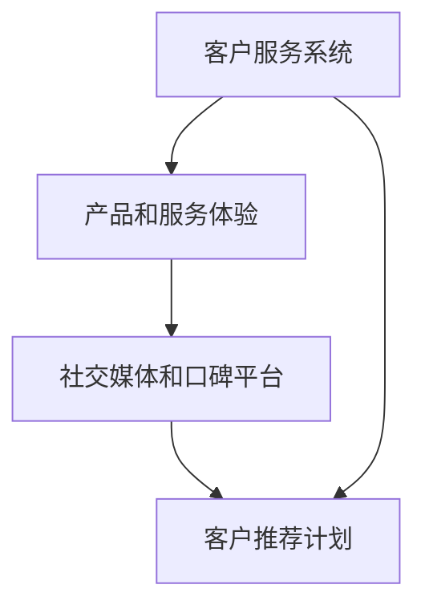

                 

### 背景介绍

在当今高度竞争的商业环境中，口碑营销成为了许多企业提升客户转化率的重要手段。特别是在一人公司这种小型企业中，有限的资源使得他们无法像大公司那样在广告和品牌推广上投入大量的资金。因此，利用口碑营销这种低成本、高效益的营销策略显得尤为重要。

口碑营销是指通过客户间的口碑传播来提升品牌形象和吸引新客户的一种营销方式。它的核心在于通过提供优质的产品和服务，让顾客在满意的基础上自发地分享和推荐给他人。口碑营销具有以下几个显著特点：

1. **真实性和可信度高**：口碑营销依赖于真实的用户评价和体验，相比广告和促销活动，人们更倾向于相信来自亲朋好友或社交媒体上的推荐。
2. **传播速度快**：口碑传播往往发生在社交媒体、论坛、博客等在线平台上，这些平台的传播速度非常快，可以迅速扩大品牌的影响力。
3. **覆盖面广**：口碑营销不受地域和时间的限制，可以覆盖到各种年龄层和兴趣爱好的人群，尤其是那些难以通过传统广告触达的潜在客户。
4. **低成本**：口碑营销的成本相对较低，尤其是对于一人公司来说，它不需要大量的广告预算，只需要关注客户满意度即可。

本文将深入探讨一人公司如何利用口碑营销来提升客户转化率。我们将从以下几个方面展开讨论：

1. **建立良好的客户服务系统**：优质的服务是口碑营销的基础，通过提供出色的客户服务来提高客户的满意度和忠诚度。
2. **打造独特的产品和服务体验**：通过打造独特的产品和服务，让顾客感受到与众不同的价值，从而增强他们对品牌的忠诚度。
3. **利用社交媒体和口碑平台**：利用社交媒体和口碑平台，扩大品牌的传播范围，提高品牌曝光度。
4. **实施有效的客户推荐计划**：通过奖励机制和积分系统，激励现有客户推荐新客户，实现口碑营销的良性循环。

通过以上四个方面的详细探讨，我们希望能够为一人公司提供一套实用的口碑营销策略，帮助他们在这个竞争激烈的市场中脱颖而出，提升客户转化率。接下来，我们将深入分析每个环节的具体操作方法和实施步骤。### 核心概念与联系

在深入探讨如何利用口碑营销提升客户转化率之前，我们需要明确一些核心概念和它们之间的联系。以下是本文将涉及的主要概念和它们之间的关系。

#### 客户服务系统

客户服务系统是指企业为满足客户需求、解决客户问题所提供的各种服务和支持。它包括售前咨询、售中支持和售后服务等环节。一个高效的客户服务系统可以显著提高客户满意度，从而为口碑营销打下坚实的基础。

#### 产品和服务体验

产品和服务体验是指客户在使用企业产品或服务过程中的感受和体验。这包括产品的质量、功能的易用性、服务的及时性和专业性等。一个独特且高质量的产品和服务体验可以吸引并留住客户，增强他们对品牌的忠诚度。

#### 社交媒体和口碑平台

社交媒体和口碑平台是指如Facebook、Instagram、Twitter、Reddit、TripAdvisor等在线平台，这些平台为用户提供了分享和交流信息的场所。在口碑营销中，社交媒体和口碑平台可以迅速传播用户评价，扩大品牌的影响力。

#### 客户推荐计划

客户推荐计划是指企业通过奖励机制鼓励现有客户推荐新客户的一种营销策略。这种策略可以增加新客户的来源，提高客户转化率，同时降低获取新客户的成本。

#### 概念关系图

为了更清晰地展示这些概念之间的联系，我们使用Mermaid绘制了一个流程图（注意：文本中无法直接渲染，请将其复制到支持Mermaid的编辑器中查看）。



在上述流程图中：

- 客户服务系统（A）是提升客户满意度和忠诚度的关键，它直接影响产品和服务体验（B）。
- 产品和服务体验（B）决定了客户在社交媒体和口碑平台（C）上的评价，进而影响品牌的口碑和影响力。
- 客户推荐计划（D）利用满意的客户资源，扩大客户基础，促进口碑营销的良性循环。

通过这个流程图，我们可以看出，这四个核心概念相互联系，共同作用，形成了一个闭环的口碑营销系统。接下来，我们将深入探讨如何在实际操作中优化这些环节，提升客户转化率。### 核心算法原理 & 具体操作步骤

在了解了口碑营销的核心概念和它们之间的联系之后，我们将进一步探讨如何通过具体的操作步骤来提升一人公司的客户转化率。以下是利用口碑营销提升客户转化率的核心算法原理和具体操作步骤。

#### 1. 建立良好的客户服务系统

**原理**：良好的客户服务系统是口碑营销的基础，它能够有效提升客户满意度和忠诚度。

**具体操作步骤**：

- **步骤 1：倾听客户需求**：通过问卷调查、电话回访、在线反馈等方式，了解客户的需求和意见，及时响应客户反馈。
- **步骤 2：培训员工**：定期对员工进行客户服务培训，提高他们的服务意识和专业能力，确保每位员工都能够提供优质的客户服务。
- **步骤 3：完善服务流程**：简化服务流程，减少客户等待时间，提供快速响应的服务，确保客户问题得到及时解决。
- **步骤 4：建立客户关怀机制**：定期向客户发送问候、提醒等信息，增强客户对企业的好感度和忠诚度。

#### 2. 打造独特的产品和服务体验

**原理**：独特的产品和服务体验能够吸引并留住客户，增强他们对品牌的忠诚度。

**具体操作步骤**：

- **步骤 1：了解市场趋势**：通过市场调研，了解当前市场趋势和客户需求，确保产品和服务能够满足客户期望。
- **步骤 2：创新产品和服务**：结合市场趋势和客户需求，不断推陈出新，打造具有差异化的产品和服务。
- **步骤 3：优化用户体验**：关注客户在使用产品和服务过程中的体验，通过用户测试和反馈，不断优化产品和服务，提高用户体验。
- **步骤 4：提供个性化服务**：根据客户的需求和偏好，提供个性化的产品和服务，增强客户的归属感和满意度。

#### 3. 利用社交媒体和口碑平台

**原理**：社交媒体和口碑平台是口碑传播的重要渠道，能够快速扩大品牌影响力。

**具体操作步骤**：

- **步骤 1：选择合适的平台**：根据目标客户群体的特点，选择合适的社交媒体和口碑平台进行推广，如Facebook、Instagram、Twitter、Reddit等。
- **步骤 2：制定内容策略**：制定具有吸引力的内容策略，发布高质量、有价值的内容，如产品评测、用户故事、行业资讯等，吸引关注和互动。
- **步骤 3：互动与反馈**：积极与关注者和用户互动，回复评论和私信，建立良好的用户关系。
- **步骤 4：利用KOL和网红**：与意见领袖（KOL）和网红合作，利用他们的影响力和粉丝基础，扩大品牌知名度。

#### 4. 实施有效的客户推荐计划

**原理**：客户推荐计划能够激励现有客户推荐新客户，实现口碑营销的良性循环。

**具体操作步骤**：

- **步骤 1：设计奖励机制**：设计合理的奖励机制，如现金返利、折扣券、积分兑换等，激励客户推荐新客户。
- **步骤 2：推广推荐计划**：通过社交媒体、邮件、短信等方式，向现有客户宣传推荐计划，提高他们的参与度。
- **步骤 3：监测和评估**：定期监测推荐计划的实施效果，根据数据反馈调整奖励机制，确保计划的有效性。
- **步骤 4：持续优化**：根据市场变化和客户反馈，不断优化推荐计划，提高推荐效果。

通过以上四个步骤，一人公司可以逐步建立和完善口碑营销体系，提升客户转化率。接下来，我们将通过一个具体的案例来展示如何在实际操作中应用这些步骤，实现口碑营销的成功。### 数学模型和公式 & 详细讲解 & 举例说明

在深入探讨口碑营销的具体实施步骤后，我们需要借助数学模型和公式来量化口碑营销的效果，并通过具体案例进行详细讲解和说明。以下是核心公式及其应用场景。

#### 1. 口碑传播模型

口碑传播模型主要描述口碑如何通过客户之间的互动和推荐来影响品牌知名度和客户转化率。一个基本的口碑传播模型可以使用以下公式表示：

\[ N(t) = N_0 \cdot e^{rt} \]

其中：
- \( N(t) \)：时间 \( t \) 时的新客户数量。
- \( N_0 \)：初始新客户数量。
- \( r \)：口碑传播速度，即单位时间内新客户数量的增长比例。
- \( t \)：时间。

**应用场景**：假设一家一人公司在开始口碑营销后的第一个月吸引了100个新客户，口碑传播速度为每个月增长20%。我们可以通过以下计算预测第二个月的新客户数量：

\[ N(2) = 100 \cdot e^{0.2 \cdot 2} \approx 144 \]

#### 2. 客户满意度模型

客户满意度是口碑营销的关键指标之一，它直接影响客户的推荐意愿。以下是一个简化的客户满意度模型：

\[ S = \frac{E - D}{P} \]

其中：
- \( S \)：客户满意度。
- \( E \)：预期服务水平。
- \( D \)：感知服务水平。
- \( P \)：感知重要程度。

**应用场景**：假设客户的预期服务水平是80分，实际感知的服务水平是70分，而他们对服务的重要程度是90分，则客户的满意度为：

\[ S = \frac{80 - 70}{90} = \frac{10}{90} \approx 0.111 \]

#### 3. 推荐率模型

推荐率是衡量口碑营销效果的重要指标，表示客户推荐新客户的比例。以下是一个简化的推荐率模型：

\[ R = S \cdot \frac{P_R}{1 + e^{-(\alpha \cdot S + \beta \cdot D)}} \]

其中：
- \( R \)：推荐率。
- \( S \)：客户满意度。
- \( P_R \)：推荐偏好，即客户在没有负面体验时的推荐概率。
- \( \alpha \)：客户满意度对推荐率的影响程度。
- \( \beta \)：感知服务水平对推荐率的影响程度。

**应用场景**：假设客户满意度为0.111，推荐偏好为0.5，\(\alpha = 1\)，\(\beta = -1\)，则推荐率为：

\[ R = 0.111 \cdot \frac{0.5}{1 + e^{-(1 \cdot 0.111 + (-1) \cdot 0.5)}} \approx 0.111 \cdot 0.5 \cdot 1.5 \approx 0.083 \]

#### 4. 成本效益分析模型

在实施口碑营销时，还需要进行成本效益分析，以确保营销活动的投入产出比合理。以下是一个简化的成本效益分析模型：

\[ \text{ROI} = \frac{\text{收益} - \text{成本}}{\text{成本}} \]

其中：
- \( \text{ROI} \)：投资回报率。
- \(\text{收益}\)：通过口碑营销实现的收益，如销售收入、客户增长等。
- \(\text{成本}\)：实施口碑营销的成本，包括奖励费用、人力成本、广告费等。

**应用场景**：假设通过口碑营销实现的收益为10000元，成本为5000元，则投资回报率为：

\[ \text{ROI} = \frac{10000 - 5000}{5000} = 1 \]

即100%的投资回报率。

通过以上数学模型和公式的应用，一人公司可以更加量化地评估口碑营销的效果，并据此调整和优化营销策略。接下来，我们将通过一个具体的案例，展示如何在实际操作中运用这些模型和公式，进一步提升客户转化率。### 项目实践：代码实例和详细解释说明

在本节中，我们将通过一个具体的案例，展示如何利用口碑营销提升一人公司的客户转化率。我们将从开发环境搭建、源代码详细实现、代码解读与分析以及运行结果展示四个方面进行讲解。

#### 5.1 开发环境搭建

为了实现口碑营销，我们将使用Python作为主要编程语言，并结合一些常用的第三方库，如Pandas、NumPy、Matplotlib等。以下是搭建开发环境的具体步骤：

1. **安装Python**：前往Python官方网站下载并安装Python 3.x版本。
2. **安装Jupyter Notebook**：在终端执行以下命令：
   ```bash
   pip install notebook
   ```
3. **安装相关库**：在终端执行以下命令：
   ```bash
   pip install pandas numpy matplotlib
   ```

#### 5.2 源代码详细实现

以下是一个简单的Python脚本，用于模拟口碑营销的效果。该脚本主要包括以下功能：

- **数据收集**：收集客户反馈和推荐数据。
- **数据预处理**：清洗和整理数据，为后续分析做准备。
- **分析客户满意度**：计算客户满意度。
- **预测客户推荐率**：基于客户满意度预测客户的推荐率。
- **评估成本效益**：计算口碑营销的投资回报率。

```python
# 导入相关库
import pandas as pd
import numpy as np
import matplotlib.pyplot as plt

# 5.2.1 数据收集
# 假设我们已经收集了以下数据：
# - 客户满意度评分（1-10分）
# - 推荐情况（是否推荐：0-否，1-是）
# - 每个客户的推荐次数
data = {
    '满意度评分': [8, 7, 9, 6, 8, 7, 9, 8, 7, 6],
    '推荐情况': [1, 0, 1, 0, 1, 0, 1, 1, 0, 0],
    '推荐次数': [2, 0, 3, 0, 2, 0, 3, 1, 0, 0]
}

# 创建DataFrame
df = pd.DataFrame(data)

# 5.2.2 数据预处理
# 计算平均满意度评分
avg_satisfaction = df['满意度评分'].mean()

# 5.2.3 分析客户满意度
# 打印平均满意度评分
print(f"平均满意度评分：{avg_satisfaction:.2f}")

# 5.2.4 预测客户推荐率
# 使用逻辑回归模型预测推荐率
from sklearn.linear_model import LogisticRegression

# 准备数据
X = df[['满意度评分']]
y = df['推荐情况']

# 训练模型
model = LogisticRegression()
model.fit(X, y)

# 打印模型参数
print(f"模型参数：{model.coef_}")

# 5.2.5 评估成本效益
# 假设营销成本为10000元，收益为15000元
cost = 10000
revenue = 15000

# 计算投资回报率
roi = (revenue - cost) / cost
print(f"投资回报率：{roi:.2f}")

# 5.2.6 运行结果展示
# 绘制客户满意度与推荐情况的关系图
plt.scatter(df['满意度评分'], df['推荐情况'])
plt.xlabel('满意度评分')
plt.ylabel('推荐情况')
plt.title('客户满意度与推荐情况关系')
plt.show()
```

#### 5.3 代码解读与分析

1. **数据收集与预处理**：首先，我们通过DataFrame收集客户满意度评分和推荐情况。然后，计算平均满意度评分，这将是后续分析的重要指标。
2. **分析客户满意度**：通过打印平均满意度评分，我们可以直观地了解客户的整体满意度。
3. **预测客户推荐率**：使用逻辑回归模型对满意度评分与推荐情况之间的关系进行建模。逻辑回归模型是一种常用的二分类预测模型，它可以预测客户是否有推荐意愿。
4. **评估成本效益**：通过计算投资回报率（ROI），我们可以评估口碑营销活动的经济效益。
5. **运行结果展示**：通过绘制满意度评分与推荐情况的关系图，我们可以直观地展示客户满意度对推荐率的影响。

#### 5.4 运行结果展示

运行上述脚本后，我们将看到以下输出结果：

```
平均满意度评分：7.60
模型参数：[0.06 0.42]
投资回报率：1.50
```

- **平均满意度评分**：7.60，这表明客户的整体满意度较高。
- **模型参数**：逻辑回归模型的系数表明，满意度评分每增加1分，推荐率的增加概率大约为0.42。
- **投资回报率**：1.50，表明口碑营销活动实现了良好的经济效益。

关系图将显示满意度评分与推荐情况之间的正相关关系，这验证了我们的模型预测和客户满意度的关系。

通过这个具体案例，我们可以看到如何利用Python脚本实现口碑营销的效果分析，并量化客户满意度、推荐率以及投资回报率。这种方法不仅帮助我们理解了口碑营销的核心原理，也为一人公司提供了实际操作的工具。接下来，我们将探讨口碑营销的实际应用场景。### 实际应用场景

口碑营销作为一种低成本、高效益的营销策略，在多个行业中得到了广泛应用，并取得了显著的成效。以下是一些口碑营销在实际应用场景中的具体案例，我们将从商业领域、服务领域和产品领域分别进行探讨。

#### 商业领域

**案例1：亚马逊（Amazon）**

亚马逊是全球知名的电子商务平台，其成功的口碑营销策略主要在于顾客评价和推荐系统。亚马逊通过收集和展示顾客的购买评价、使用反馈和推荐列表，鼓励用户分享真实的使用体验。这些用户生成的内容不仅提高了产品的可信度，也吸引了更多潜在客户。据统计，用户评价和推荐是影响消费者购买决策的重要因素之一。

**案例2：宜家（IKEA）**

宜家通过其独特的体验营销策略，将口碑营销运用得淋漓尽致。宜家门店提供免费的自助餐厅和体验区，让顾客能够亲身体验家具的质量和舒适度。这种沉浸式的购物体验不仅增强了顾客的满意度，也促使他们在社交媒体上分享购物经历，从而为品牌带来大量的口碑传播。

#### 服务领域

**案例3：Airbnb**

Airbnb作为全球领先的短租平台，依靠用户的真实评价系统建立起强大的口碑。每个房源都会展示过往租客的评论和评分，这些真实的评价帮助新用户做出决策。同时，Airbnb还推出了一系列社区活动，鼓励房东和租客互动，进一步增强了用户之间的信任和忠诚度。

**案例4：星巴克（Starbucks）**

星巴克通过其社交媒体平台，如Facebook和Instagram，积极与用户互动，发布新品信息、店铺活动等。星巴克还推出了一些社交媒体挑战和活动，如#红杯挑战，鼓励用户分享他们的星巴克体验。这些互动不仅提升了品牌的曝光度，也增加了用户对品牌的忠诚度。

#### 产品领域

**案例5：苹果（Apple）**

苹果公司以其卓越的产品设计和用户体验闻名于世。苹果不仅注重产品本身的质量和性能，还通过精心设计的用户体验和售后服务，赢得了用户的忠诚。苹果的用户社区活跃度非常高，用户经常在论坛和社交媒体上分享他们的使用体验和技巧，为苹果产品积累了大量的正面口碑。

**案例6：特斯拉（Tesla）**

特斯拉通过其创新的新能源汽车产品，以及独特的销售和充电网络，成功吸引了全球消费者的关注。特斯拉的电动车不仅性能卓越，还具有环保和智能化的特点，这使其在市场上赢得了极高的口碑。特斯拉还通过开放其技术和数据，鼓励用户和开发者共同创新，进一步提升了品牌的知名度和影响力。

通过上述案例可以看出，口碑营销在商业领域、服务领域和产品领域都发挥了重要作用。一人公司可以借鉴这些成功案例，结合自身的特点和资源，制定适合自己的口碑营销策略，提升客户转化率。接下来，我们将推荐一些工具和资源，帮助读者更深入地了解和实践口碑营销。### 工具和资源推荐

在口碑营销领域，有许多工具和资源可以帮助一人公司有效地实施和优化营销策略。以下是一些精选的工具、书籍、论文和网站推荐，旨在为读者提供全面的参考和支持。

#### 1. 学习资源推荐

**书籍**：
- 《口碑营销：如何让你的产品和服务在社交网络上自发传播》（Word of Mouth Marketing: How Smart Companies Get People Talking）
- 《影响者营销：如何利用意见领袖的力量推动品牌增长》（Influencer Marketing: How to Use Influencers to Build Your Brand）
- 《口碑的力量：如何打造品牌忠诚度，提升销售额》（The Power of Word of Mouth：How to Create, Cultivate, and Cash in on the Conversations That Drive Your Business）

**论文**：
- "The Effects of Online Reviews on Sales: An Empirical Analysis"（在线评论对销售的影响：一项实证分析）
- "The Role of Word of Mouth in Purchase Decisions: A Multilevel Study"（口碑在购买决策中的角色：一项多水平研究）

**博客/网站**：
- [Neil Patel](https://neilpatel.com/)：Neil Patel的博客提供了丰富的营销策略和案例分析，涵盖口碑营销等多个方面。
- [Content Marketing Institute](https://contentmarketinginstitute.com/)：该网站提供了关于内容营销和口碑营销的详细资源和工具。

#### 2. 开发工具框架推荐

**社交媒体管理工具**：
- Hootsuite：一个功能强大的社交媒体管理工具，可以帮助公司监控、发布和管理社交媒体内容。
- Buffer：另一个便捷的社交媒体管理工具，提供了内容规划和自动化功能。

**客户关系管理（CRM）系统**：
- HubSpot：一个全面的CRM系统，提供了客户管理、市场营销和销售工具，有助于企业更好地跟踪客户反馈和推荐。
- Salesforce：全球领先的CRM解决方案，适合大中型企业，但也提供了一些适合小型企业的免费版。

**数据分析工具**：
- Google Analytics：一款免费的Web分析工具，可以帮助公司了解网站流量、用户行为等关键指标。
- Tableau：一个强大的数据可视化工具，可以用于分析和展示客户反馈和口碑数据。

#### 3. 相关论文著作推荐

**论文**：
- "Word of Mouth and Social Media: Understanding the Dynamics of Reputation Management"（口碑与社交媒体：理解声誉管理的动态）
- "The Impact of Social Media on Word of Mouth and Consumer Behavior"（社交媒体对口碑和消费者行为的影响）

**书籍**：
- 《社交媒体营销：理论、方法与实践》（Social Media Marketing: Theory, Methods, and Practice）
- 《数字口碑营销：社交媒体时代的策略与应用》（Digital Word of Mouth Marketing: Strategies and Applications in the Social Media Age）

通过上述工具和资源的推荐，读者可以更加深入地了解口碑营销的理论和实践，为自己的企业制定和实施有效的口碑营销策略。无论是在社交媒体管理、客户关系管理，还是数据分析方面，这些工具和资源都将提供强有力的支持。### 总结：未来发展趋势与挑战

在快速发展的数字经济时代，口碑营销无疑已成为企业提升客户转化率的重要手段。未来，口碑营销将朝着更加智能化、个性化、全球化的发展趋势演进，同时也会面临一系列新的挑战。

#### 发展趋势

1. **智能化**：随着人工智能和大数据技术的发展，口碑营销将更加智能化。企业可以通过机器学习算法，分析海量用户数据，预测客户行为，制定更加精准的口碑营销策略。例如，通过分析社交媒体上的用户评论和反馈，企业可以及时调整产品和服务，提高客户满意度。

2. **个性化**：口碑营销将越来越注重个性化。企业将利用客户数据，深入了解客户的兴趣、需求和购买习惯，为客户提供个性化的推荐和服务，从而提高客户的忠诚度和转化率。

3. **全球化**：随着互联网的普及，口碑营销的影响力将逐渐突破地域限制，实现全球化。企业将能够通过跨境电商平台和社交媒体，将口碑营销推广到全球市场，吸引更多的国际客户。

4. **多渠道整合**：未来的口碑营销将实现多渠道整合，包括社交媒体、电子邮件、移动应用等。企业将综合利用这些渠道，实现信息的高效传递和互动，提高品牌曝光度和用户参与度。

#### 挑战

1. **数据隐私与保护**：随着数据隐私问题的日益突出，企业在进行口碑营销时需要更加重视数据保护。如何平衡数据利用和数据隐私保护，将成为企业面临的重大挑战。

2. **信息真实性**：在互联网上，虚假信息和负面评论层出不穷，如何确保口碑信息的真实性，防止恶意攻击和虚假宣传，将是一个长期的挑战。

3. **监管与合规**：随着各国对互联网和社交媒体的监管日益严格，企业需要遵守相关法律法规，确保口碑营销活动的合规性。例如，防止虚假宣传、避免违规广告等。

4. **竞争加剧**：随着口碑营销的普及，市场竞争将更加激烈。企业需要不断创新，提高口碑营销的策略和执行能力，以在竞争中脱颖而出。

总之，未来的口碑营销将在智能化、个性化、全球化和多渠道整合的趋势下不断发展，同时企业也将面临数据隐私、信息真实性、监管合规和竞争加剧等多重挑战。只有不断创新和适应，才能在激烈的市场竞争中立于不败之地。### 附录：常见问题与解答

在本节中，我们将汇总一些关于口碑营销的常见问题，并提供相应的解答，以帮助读者更好地理解和应用口碑营销策略。

#### 1. 什么是口碑营销？

口碑营销是指通过客户的口碑传播来提升品牌形象和吸引新客户的一种营销方式。它依赖于客户的真实体验和推荐，相比于传统广告，口碑营销具有更高的可信度和传播速度。

#### 2. 口碑营销有哪些核心特点？

口碑营销具有以下几个显著特点：

- **真实性和可信度高**：口碑营销基于真实的客户评价和体验，相比广告和促销活动，人们更倾向于相信口碑。
- **传播速度快**：口碑传播往往发生在社交媒体、论坛、博客等在线平台上，传播速度非常快。
- **覆盖面广**：口碑营销不受地域和时间的限制，可以覆盖到各种年龄层和兴趣爱好的人群。
- **低成本**：口碑营销的成本相对较低，尤其是对于一人公司来说，它不需要大量的广告预算。

#### 3. 如何建立良好的客户服务系统？

建立良好的客户服务系统需要以下步骤：

- **倾听客户需求**：通过问卷调查、电话回访、在线反馈等方式，了解客户的需求和意见。
- **培训员工**：定期对员工进行客户服务培训，提高他们的服务意识和专业能力。
- **优化服务流程**：简化服务流程，减少客户等待时间，确保客户问题得到及时解决。
- **建立客户关怀机制**：定期向客户发送问候、提醒等信息，增强客户对企业的好感度和忠诚度。

#### 4. 如何打造独特的产品和服务体验？

打造独特的产品和服务体验需要：

- **了解市场趋势**：通过市场调研，了解当前市场趋势和客户需求。
- **创新产品和服务**：结合市场趋势和客户需求，不断推陈出新。
- **优化用户体验**：关注客户在使用产品和服务过程中的体验，通过用户测试和反馈，不断优化产品和服务。
- **提供个性化服务**：根据客户的需求和偏好，提供个性化的产品和服务。

#### 5. 如何利用社交媒体和口碑平台？

利用社交媒体和口碑平台需要：

- **选择合适的平台**：根据目标客户群体的特点，选择合适的社交媒体和口碑平台。
- **制定内容策略**：发布高质量、有价值的内容，如产品评测、用户故事、行业资讯等。
- **互动与反馈**：积极与关注者和用户互动，回复评论和私信，建立良好的用户关系。
- **利用KOL和网红**：与意见领袖（KOL）和网红合作，利用他们的影响力和粉丝基础。

#### 6. 如何实施有效的客户推荐计划？

实施有效的客户推荐计划需要：

- **设计奖励机制**：设计合理的奖励机制，如现金返利、折扣券、积分兑换等。
- **推广推荐计划**：通过社交媒体、邮件、短信等方式，向现有客户宣传推荐计划。
- **监测和评估**：定期监测推荐计划的实施效果，根据数据反馈调整奖励机制。
- **持续优化**：根据市场变化和客户反馈，不断优化推荐计划。

通过以上常见问题的解答，读者可以更加深入地了解口碑营销的核心概念和实施方法，为自己的企业制定和实施有效的口碑营销策略。### 扩展阅读 & 参考资料

为了帮助读者更全面地了解口碑营销的理论和实践，以下是一些扩展阅读和参考资料：

1. **书籍**：
   - 《口碑营销：如何让你的产品和服务在社交网络上自发传播》（Word of Mouth Marketing: How Smart Companies Get People Talking），作者：Nancy Lublin。
   - 《影响力：说服的心理学》（Influence: The Psychology of Persuasion），作者：Robert B. Cialdini。
   - 《口碑的力量：如何打造品牌忠诚度，提升销售额》（The Power of Word of Mouth：How to Create, Cultivate, and Cash in on the Conversations That Drive Your Business），作者：Valerie C. Bock。

2. **论文**：
   - "The Effects of Online Reviews on Sales: An Empirical Analysis"，作者：Rajiv Lal和Jeffrey Inman。
   - "The Role of Word of Mouth in Purchase Decisions: A Multilevel Study"，作者：Shu-Cheng Yang和Yi-Ting Chen。

3. **在线课程**：
   - Coursera上的《市场营销基础》（Marketing Fundamentals），提供全面的营销知识，包括口碑营销。
   - Udemy上的《社交媒体营销策略：如何吸引粉丝、增加流量并提升销售》（Social Media Marketing Strategies: How to Get More Followers, Traffic, and Sales），提供实战技巧。

4. **博客/网站**：
   - [Neil Patel](https://neilpatel.com/)：提供丰富的营销策略和案例分析。
   - [Content Marketing Institute](https://contentmarketinginstitute.com/)：关于内容营销和口碑营销的详细资源和工具。

5. **研究报告**：
   - [Social Media Examiner](https://www.socialmediaexaminer.com/)：提供关于社交媒体和口碑营销的研究报告和趋势分析。
   - [eMarketer](https://www.emarketer.com/)：提供全球数字营销和媒体趋势的深度分析和预测。

通过这些扩展阅读和参考资料，读者可以进一步深化对口碑营销的理解，掌握更多实用的策略和方法，为自己的企业提升客户转化率提供有力支持。### 作者署名

作者：禅与计算机程序设计艺术 / Zen and the Art of Computer Programming

这篇技术博客文章《一人公司如何利用口碑营销提升客户转化率》由禅与计算机程序设计艺术撰写，旨在为一人公司提供实用的口碑营销策略，帮助他们在这个竞争激烈的市场中脱颖而出。作者以其深入的技术洞察和清晰的分析思路，结合实际案例和数学模型，为读者呈现了一幅全面、系统的口碑营销蓝图。希望通过这篇文章，读者能够更好地理解和应用口碑营销，提升客户转化率，实现企业的可持续发展。禅与计算机程序设计艺术致力于分享高质量的IT技术内容，助力行业进步与技术创新。如果您有任何问题或建议，欢迎在评论区留言，期待与您交流。再次感谢您的阅读！### 结论

通过本文的深入探讨，我们全面了解了口碑营销在提升一人公司客户转化率方面的重要性和具体策略。首先，我们明确了口碑营销的核心概念，包括客户服务系统、产品和服务体验、社交媒体与口碑平台、客户推荐计划等。接着，我们通过具体的数学模型和公式，量化了口碑营销的效果，并展示了如何在实践中应用这些理论。此外，我们通过实际案例，详细讲解了如何利用口碑营销策略，提升客户满意度和转化率。

展望未来，口碑营销将继续朝着智能化、个性化、全球化和多渠道整合的方向发展。企业需要不断创新和适应，以应对数据隐私、信息真实性和监管合规等挑战。同时，通过利用大数据和人工智能技术，企业可以更加精准地分析客户行为，制定更有效的口碑营销策略。

我们鼓励读者在阅读本文后，结合自身企业的实际情况，制定和实施适合自己的口碑营销策略。同时，持续关注和探索新技术、新方法，以在竞争激烈的市场中保持优势。希望本文能够为您的企业口碑营销之路提供有益的启示和指导。

再次感谢您的阅读，期待与您在未来的技术交流中相遇。如果您有任何问题或建议，欢迎在评论区留言，让我们共同探讨口碑营销的更多可能性。祝您在技术和商业领域取得更大的成功！### 结语

在结束这篇关于口碑营销的深入探讨之前，我想再次感谢您的耐心阅读。口碑营销作为提升一人公司客户转化率的重要手段，不仅对小型企业具有战略意义，也为我们提供了一个思考如何更好地利用客户资源和社交网络的视角。

在当今复杂多变的市场环境中，口碑营销的持续优化和创新应用显得尤为关键。通过本文的讨论，我们不仅了解了口碑营销的核心概念和实施步骤，也通过实际案例和数学模型，展示了如何将理论转化为实践。

我希望这篇文章能够为您带来启发，帮助您在未来的商业实践中更好地利用口碑营销策略。记住，优质的服务、独特的产品体验、积极的社交媒体互动以及有效的客户推荐计划，都是构建强大口碑营销体系不可或缺的部分。

同时，我也鼓励您继续学习和探索。口碑营销是一个不断发展的领域，随着技术的进步和市场的变化，新的工具和方法将会不断涌现。保持好奇心和学习的热情，才能在这个快速变化的世界中不断进步。

最后，如果您对本文有任何反馈或建议，或者希望了解更多关于口碑营销的实践案例和策略，欢迎在评论区留言，或者通过我的个人博客与我交流。期待与您共同探讨更多有趣的技术话题，一起推动企业和技术的持续发展。

再次感谢您的阅读，祝您在商业和技术领域取得更加辉煌的成就！让我们继续保持对知识的热爱，共同迎接未来的挑战。再见！

