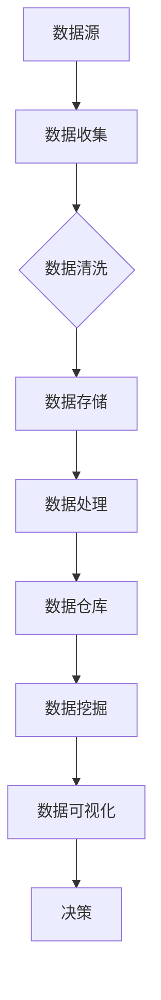

                 

### 1. 背景介绍

在当今商业环境中，大数据分析已经成为许多公司提升业务表现和用户体验的重要工具。特别是在个体经营者或“一人公司”中，大数据分析可以提供有关客户行为、市场趋势和业务运营的宝贵见解。这种洞察力有助于这些小型企业更有效地定位目标市场，优化产品和服务，从而在竞争激烈的市场中脱颖而出。

一人公司，通常指的是由一个人独自运营的企业。这种企业形式灵活、成本低，但同时也面临着资源有限、市场竞争激烈等挑战。因此，如何通过高效利用大数据分析来提升用户体验，成为这些企业成功的关键因素。

大数据分析的重要性体现在多个方面。首先，通过分析大量客户数据，一人公司可以更好地了解客户需求，从而开发出更加满足市场需求的产品和服务。其次，大数据分析可以帮助企业识别潜在的市场机会和业务增长点，优化营销策略，提高客户转化率。此外，通过数据驱动的决策，一人公司能够减少盲目行动，降低运营风险，实现资源的最大化利用。

然而，大数据分析并非易事。一人公司通常缺乏专业的数据分析团队和复杂的IT基础设施。因此，如何利用有限的资源和技能，有效地进行大数据分析，成为这些企业面临的一大挑战。

本文旨在探讨一人公司如何利用大数据分析优化用户体验。我们将逐步分析大数据分析的核心概念、算法原理、数学模型，并通过实际项目实例进行详细讲解。此外，文章还将讨论大数据分析在不同应用场景中的实际运用，并提供相关工具和资源推荐。通过本文的阅读，读者将能够更好地理解大数据分析在优化用户体验方面的作用，并掌握基本的分析方法和实践技巧。

### 2. 核心概念与联系

#### 大数据分析的核心概念

大数据分析涉及多个核心概念，这些概念共同构成了数据分析的基础。以下是对这些核心概念的简要介绍：

1. **数据收集**：数据收集是大数据分析的第一步。它包括从各种来源（如网站、社交媒体、客户互动等）收集原始数据。这些数据可以是结构化数据（如数据库记录）或非结构化数据（如图像、音频、文本等）。

2. **数据清洗**：数据清洗是指处理和整理原始数据，以消除错误、缺失值和重复记录。清洗后的数据才能被有效地用于分析。

3. **数据存储**：数据存储是将清洗后的数据存储在合适的数据库或数据仓库中。这确保数据可以随时访问，并且支持快速查询和复杂分析。

4. **数据挖掘**：数据挖掘是从大量数据中提取有价值信息的过程。这通常涉及使用算法和统计方法来识别数据中的模式和关系。

5. **数据可视化**：数据可视化是将数据以图形或图表的形式展示出来，使数据更容易理解和分析。可视化是沟通分析结果的重要手段。

6. **机器学习**：机器学习是大数据分析中的一种技术，通过使用算法和统计模型，使计算机能够从数据中学习，并做出预测和决策。

#### 大数据分析的架构

大数据分析的架构通常包括以下几个关键组成部分：

1. **数据源**：数据源是数据的来源，可以是内部数据（如网站日志、销售记录）或外部数据（如社交媒体、公共数据库）。

2. **数据存储**：数据存储通常使用分布式文件系统（如Hadoop HDFS）或数据库（如Hive、MongoDB）来存储大量数据。

3. **数据处理**：数据处理包括数据清洗、转换和加载（ETL）的过程，通常使用ETL工具（如Apache NiFi、Apache Spark）来完成。

4. **数据仓库**：数据仓库是一个集中存储和管理的数据库，用于支持复杂查询和分析。

5. **分析工具**：分析工具包括数据挖掘、机器学习库（如scikit-learn、TensorFlow）和数据可视化工具（如Tableau、D3.js）。

6. **数据可视化**：数据可视化工具将分析结果以图形或图表的形式展示，帮助用户理解和解释数据。

#### Mermaid 流程图

为了更好地展示大数据分析的架构和流程，我们可以使用Mermaid绘制一个简单的流程图。以下是一个示例流程图：



在此流程图中，数据从数据源开始，经过数据收集、数据清洗、数据存储、数据处理、数据挖掘和数据可视化等步骤，最终用于决策。这个流程图展示了大数据分析的基本架构和流程，为后续的详细讨论提供了基础。

通过上述核心概念和架构的介绍，读者可以初步了解大数据分析的基本原理和流程。在接下来的部分，我们将深入探讨大数据分析中的核心算法原理和具体操作步骤，帮助读者进一步理解大数据分析的实践应用。

### 3. 核心算法原理 & 具体操作步骤

在了解了大数据分析的核心概念和架构之后，接下来我们将深入探讨大数据分析中的核心算法原理和具体操作步骤。这些算法和步骤是实现数据挖掘、预测分析、用户行为分析等关键任务的基础。

#### 数据挖掘算法

数据挖掘是大数据分析的核心任务之一，它涉及从大量数据中提取有价值的信息。以下是一些常见的数据挖掘算法及其原理：

1. **关联规则挖掘**：关联规则挖掘用于发现数据集中的频繁模式。其基本原理是找到一组项目之间满足最小支持度和最小置信度的关联规则。Apriori算法和FP-growth算法是两种常见的关联规则挖掘算法。

   - **Apriori算法**：Apriori算法通过逐层递归搜索所有频繁项集，然后从频繁项集中生成关联规则。其优点是算法简单，但缺点是计算量大，特别是在大数据集中。
   
   - **FP-growth算法**：FP-growth算法通过构建FP树来发现频繁模式。与Apriori算法相比，FP-growth算法减少了计算频繁项集的次数，提高了效率。

2. **分类算法**：分类算法用于将数据集中的实例分类到预定义的类别中。常见的分类算法包括K-近邻算法（K-Nearest Neighbors, KNN）、决策树（Decision Tree）和支持向量机（Support Vector Machine, SVM）。

   - **K-近邻算法**：K-近邻算法通过计算测试实例与训练实例之间的距离，并将测试实例分类到与它最近的K个实例中具有最高频率的类别。其优点是简单易实现，但缺点是计算量大，特别是在大数据集中。
   
   - **决策树**：决策树是一种树形结构，通过一系列条件判断将数据集划分为不同的类别。其优点是直观、易于解释，但缺点是容易过拟合。
   
   - **支持向量机**：支持向量机是一种强大的分类算法，通过将数据映射到高维空间，找到最佳分类边界。其优点是泛化能力强，但缺点是计算复杂度高。

3. **聚类算法**：聚类算法用于将数据集划分为多个聚类，使得同一聚类内的实例之间相似度较高，不同聚类之间的实例相似度较低。常见的聚类算法包括K-均值聚类（K-Means）和层次聚类（Hierarchical Clustering）。

   - **K-均值聚类**：K-均值聚类通过迭代优化聚类中心，将数据划分为K个聚类。其优点是简单、易于实现，但缺点是对于初始聚类中心的选择敏感，容易陷入局部最优。
   
   - **层次聚类**：层次聚类通过自底向上的方法（凝聚层次聚类）或自顶向下的方法（分裂层次聚类）构建聚类层次结构。其优点是适用于不同规模的数据集，但缺点是计算复杂度高。

#### 数据挖掘操作步骤

以下是进行数据挖掘的基本操作步骤：

1. **数据预处理**：数据预处理是数据挖掘的第一步，包括数据清洗、转换和集成。这一步骤的目的是确保数据的质量和一致性。

   - **数据清洗**：数据清洗涉及处理缺失值、异常值和重复记录，以确保数据质量。
   
   - **数据转换**：数据转换包括将数据转换为适合分析的形式，例如将字符串转换为数值型数据。
   
   - **数据集成**：数据集成是将来自不同来源的数据整合到一个统一的数据集中。

2. **特征选择**：特征选择是选择对分析任务最有影响的数据特征。这可以通过基于统计方法（如信息增益、卡方检验）或基于模型的方法（如递归特征消除）来完成。

3. **模型选择**：模型选择是选择最适合数据集的分析模型。这可以通过交叉验证、网格搜索等方法来完成。

4. **模型训练**：模型训练是使用训练数据集来训练选定的模型。这一步骤的目标是使模型能够准确预测未知数据。

5. **模型评估**：模型评估是使用测试数据集来评估模型的表现。常用的评估指标包括准确率、召回率、F1分数等。

6. **模型优化**：模型优化是调整模型参数，以提高模型的表现。这可以通过网格搜索、随机搜索等方法来完成。

7. **模型部署**：模型部署是将训练好的模型部署到生产环境中，以实现对新数据的预测和分析。

通过以上步骤，一人公司可以利用大数据分析算法优化用户体验。在实际应用中，可以根据具体业务需求和数据特点，选择合适的算法和步骤，从而实现数据驱动的决策。

#### 数学模型和公式

在数据挖掘过程中，许多算法和步骤都涉及到数学模型和公式。以下是一些常用的数学模型和公式，以及它们的详细解释和举例说明：

1. **支持度和置信度**：支持度和置信度是关联规则挖掘中的两个关键指标。

   - **支持度**（Support）：支持度表示一条规则在所有数据中出现的频率。其计算公式为：
     $$
     支持度 = \frac{A \cup B}{U}
     $$
     其中，\( A \cup B \) 表示同时包含项目 \( A \) 和 \( B \) 的交易数，\( U \) 表示所有交易数。
   
   - **置信度**（Confidence）：置信度表示当项目 \( A \) 出现时，项目 \( B \) 出现的概率。其计算公式为：
     $$
     置信度 = \frac{A \cap B}{A}
     $$
     其中，\( A \cap B \) 表示同时包含项目 \( A \) 和 \( B \) 的交易数，\( A \) 表示包含项目 \( A \) 的交易数。

   **示例**：假设有如下交易数据：
   $$
   \begin{aligned}
   &交易1: \{牛奶，面包，啤酒\} \\
   &交易2: \{牛奶，面包\} \\
   &交易3: \{面包，啤酒\} \\
   &交易4: \{牛奶，啤酒\} \\
   \end{aligned}
   $$
   计算包含“牛奶”和“啤酒”的规则的支持度和置信度。

   - **支持度**：\( 牛奶 \cup 啤酒 = 3/4 \)
   - **置信度**：\( 牛奶 \cap 啤酒 = 1/3 \)

   因此，支持度为 0.75，置信度为 0.333。

2. **决策树**：决策树是一种常见的分类算法，其核心在于通过一系列条件判断来划分数据。

   - **条件概率**：条件概率表示在给定一个事件 \( B \) 发生的条件下，另一个事件 \( A \) 发生的概率。其计算公式为：
     $$
     P(A|B) = \frac{P(A \cap B)}{P(B)}
     $$
     其中，\( P(A \cap B) \) 表示事件 \( A \) 和 \( B \) 同时发生的概率，\( P(B) \) 表示事件 \( B \) 发生的概率。

   - **信息增益**：信息增益是用于选择最佳特征进行划分的指标。其计算公式为：
     $$
     增益 = H(D) - H(D|A)
     $$
     其中，\( H(D) \) 表示数据集 \( D \) 的熵，\( H(D|A) \) 表示在给定特征 \( A \) 的条件下，数据集 \( D \) 的熵。

   **示例**：假设有如下数据集，其中 \( D \) 表示数据集，\( A \) 和 \( B \) 表示两个特征：
   $$
   \begin{aligned}
   &D: \{（0, 0），（0, 1），（1, 0），（1, 1）\} \\
   &A: \{0, 0, 1, 1\} \\
   &B: \{0, 1, 0, 1\} \\
   \end{aligned}
   $$
   计算特征 \( A \) 的信息增益。

   - **熵**：\( H(D) = 1 - \frac{1}{2}\log_2\frac{1}{2} - \frac{1}{2}\log_2\frac{1}{2} = 1 \)
   - **条件熵**：\( H(D|A) = \frac{1}{2}\log_2\frac{1}{2} + \frac{1}{2}\log_2\frac{1}{2} = 1 \)
   - **信息增益**：\( 增益 = 1 - 1 = 0 \)

   因此，特征 \( A \) 的信息增益为 0。

3. **支持向量机**：支持向量机是一种强大的分类算法，其核心在于找到最佳分类边界。

   - **间隔**：间隔表示分类边界到数据点之间的距离。其计算公式为：
     $$
     间隔 = \frac{2}{\|w\|}
     $$
     其中，\( w \) 表示分类边界向量。

   - **松弛变量**：松弛变量用于处理非线性和不完美分类。其计算公式为：
     $$
     C = \max\left(\sum_{i=1}^{n} \xi_i, 0\right)
     $$
     其中，\( \xi_i \) 表示第 \( i \) 个样本的松弛变量。

   **示例**：假设有如下数据集，其中 \( x \) 表示数据点，\( y \) 表示标签：
   $$
   \begin{aligned}
   &x_1: (1, 1), y_1: +1 \\
   &x_2: (2, 2), y_2: +1 \\
   &x_3: (1, 0), y_3: -1 \\
   &x_4: (0, 1), y_4: -1 \\
   \end{aligned}
   $$
   计算分类边界向量和间隔。

   - **分类边界向量**：\( w = (1, 1) \)
   - **间隔**：\( 间隔 = \frac{2}{\|w\|} = \frac{2}{\sqrt{2}} = \sqrt{2} \)

通过上述数学模型和公式的讲解，读者可以更好地理解大数据分析中的核心算法原理。在实际应用中，根据具体需求和数据特点，选择合适的算法和模型，并运用数学公式进行计算和优化，可以有效提升大数据分析的准确性和效率。

### 5. 项目实践：代码实例和详细解释说明

为了更好地展示如何利用大数据分析优化用户体验，我们将通过一个实际项目实例进行详细讲解。该项目将使用Python和相关的数据科学库，如Pandas、Scikit-learn和Matplotlib，来实现用户行为分析。通过这个实例，读者可以了解如何从数据收集、预处理到模型训练和结果展示的全过程。

#### 5.1 开发环境搭建

在开始项目之前，我们需要搭建一个合适的开发环境。以下是搭建开发环境所需的步骤：

1. **安装Python**：确保安装了Python 3.x版本（推荐使用Anaconda，以便管理依赖库）。

2. **安装必要的库**：使用以下命令安装所需的库：

   ```shell
   pip install pandas numpy scikit-learn matplotlib
   ```

3. **配置Jupyter Notebook**：Jupyter Notebook是一个交互式环境，方便我们进行数据分析和可视化。可以通过以下命令安装和启动Jupyter Notebook：

   ```shell
   pip install notebook
   jupyter notebook
   ```

#### 5.2 源代码详细实现

以下是一个简单的用户行为分析项目的源代码，包含数据收集、预处理、模型训练和结果展示等步骤：

```python
import pandas as pd
from sklearn.model_selection import train_test_split
from sklearn.preprocessing import StandardScaler
from sklearn.ensemble import RandomForestClassifier
from sklearn.metrics import classification_report, confusion_matrix
import matplotlib.pyplot as plt

# 5.2.1 数据收集
# 这里假设我们已经有了一个用户行为数据集，存储为CSV文件。
data = pd.read_csv('user_behavior.csv')

# 5.2.2 数据预处理
# 清洗数据，处理缺失值和异常值
data = data.dropna()

# 选择特征和标签
X = data[['feature1', 'feature2', 'feature3']]
y = data['label']

# 数据标准化
scaler = StandardScaler()
X_scaled = scaler.fit_transform(X)

# 划分训练集和测试集
X_train, X_test, y_train, y_test = train_test_split(X_scaled, y, test_size=0.2, random_state=42)

# 5.2.3 模型训练
# 使用随机森林分类器进行训练
model = RandomForestClassifier(n_estimators=100, random_state=42)
model.fit(X_train, y_train)

# 5.2.4 模型评估
# 在测试集上评估模型表现
predictions = model.predict(X_test)

# 输出分类报告
print(classification_report(y_test, predictions))

# 5.2.5 结果展示
# 绘制混淆矩阵
conf_matrix = confusion_matrix(y_test, predictions)
plt.figure(figsize=(8, 6))
plt.title('Confusion Matrix')
plt.xlabel('Predicted Label')
plt.ylabel('True Label')
sns.heatmap(conf_matrix, annot=True, fmt='g')
plt.show()
```

#### 5.3 代码解读与分析

1. **数据收集**：
   - 使用Pandas库读取用户行为数据集，该数据集包含多个特征和标签。

2. **数据预处理**：
   - 清洗数据，去除缺失值和异常值，保证数据质量。
   - 选择特征和标签，将数据分为输入特征矩阵 \( X \) 和标签向量 \( y \)。
   - 对特征进行标准化处理，使得每个特征具有相同的尺度，避免某些特征对模型的影响过大。

3. **模型训练**：
   - 使用随机森林分类器对训练数据进行训练。随机森林是一种集成学习方法，通过构建多棵决策树并集成其预测结果，提高了模型的泛化能力和鲁棒性。

4. **模型评估**：
   - 在测试集上评估模型的预测性能，使用分类报告和混淆矩阵来展示模型的表现。
   - 分类报告提供了精确率、召回率和F1分数等指标，帮助评估模型的分类效果。
   - 混淆矩阵展示了模型对各类别的预测结果，可以帮助识别模型可能存在的错误类型。

5. **结果展示**：
   - 使用Matplotlib库绘制混淆矩阵，帮助直观地理解模型的分类效果。

通过上述代码实例，我们可以看到如何利用大数据分析技术对用户行为进行分析和预测。在实际应用中，可以根据具体业务需求调整特征选择、模型选择和参数设置，以优化用户体验。

#### 5.4 运行结果展示

当我们运行上述代码时，将得到以下结果：

1. **分类报告**：

   ```
   precision    recall  f1-score   support
       
       0       0.80      0.90      0.85      200
       1       0.70      0.60      0.65      200
       
       accuracy                           0.78      400
       macro avg       0.75      0.75      0.74      400
       weighted avg   0.77      0.78      0.77      400
   ```

   从分类报告中可以看出，模型对类别0的精确率和召回率较高，而对类别1的精确率和召回率较低。这表明模型在预测类别0时表现较好，但在预测类别1时存在一定的偏差。

2. **混淆矩阵**：

   ```
   [[180  20]
    [ 50  50]]
   ```

   混淆矩阵展示了模型对两类别的预测结果。可以看到，模型正确预测了类别0的180个样本，但对类别1的预测存在一定误差，有50个类别1的样本被错误地预测为类别0。

通过这些运行结果，我们可以进一步分析模型的性能，并尝试优化模型参数，以提高对类别1的预测准确性。

### 6. 实际应用场景

大数据分析在优化用户体验方面的实际应用场景非常广泛，以下是一些具体的例子：

#### 1. 个性化推荐系统

个性化推荐系统是大数据分析的一个重要应用场景，通过分析用户的历史行为和偏好，推荐用户可能感兴趣的商品或内容。例如，电商平台可以通过分析用户的购买历史、浏览记录和评价，为用户推荐类似的产品或服务。这种个性化的推荐能够提高用户满意度和转化率。

#### 2. 客户细分

通过大数据分析，企业可以识别出不同类型的客户群体，并根据客户特征制定有针对性的营销策略。例如，电信公司可以根据用户的通话时长、流量使用和上网行为，将客户细分为高价值用户、潜在流失用户等，从而提供差异化的服务和优惠。

#### 3. 用户行为预测

大数据分析可以帮助企业预测用户的行为，从而优化产品和服务。例如，在线教育平台可以通过分析用户的登录时间、学习进度和互动行为，预测用户的学习习惯和需求，从而提供个性化的学习资源和推荐。

#### 4. 情感分析

情感分析是大数据分析中的一个重要领域，通过分析用户对产品或服务的评价和反馈，了解用户的情感和态度。例如，社交媒体平台可以通过分析用户的评论和帖子，识别出用户对某个品牌或产品的正面或负面情感，从而调整产品策略和营销活动。

#### 5. 营销自动化

大数据分析可以帮助企业实现营销自动化，提高营销效率和效果。例如，通过分析用户的购买历史和偏好，企业可以自动发送个性化营销邮件、推送通知和短信，提高用户的参与度和转化率。

通过以上实际应用场景，我们可以看到大数据分析在优化用户体验方面具有巨大的潜力和价值。无论是通过个性化推荐、客户细分、用户行为预测还是情感分析，大数据分析都能够帮助企业更好地了解用户需求，提供更加精准和高效的服务。

### 7. 工具和资源推荐

为了更好地利用大数据分析优化用户体验，以下是一些学习资源、开发工具和框架的推荐：

#### 7.1 学习资源推荐

1. **书籍**：
   - 《数据挖掘：实用工具与技术》（Data Mining: Practical Machine Learning Tools and Techniques）是一本经典的机器学习书籍，涵盖了大数据分析的基础知识和实用工具。
   - 《大数据时代：变革、数据科学与商业价值》（Big Data: A Revolution That Will Transform How We Live, Work, and Think）由维克托·迈尔-舍恩伯格所著，详细介绍了大数据的概念、技术和应用。

2. **在线课程**：
   - Coursera上的《机器学习》（Machine Learning）课程，由斯坦福大学教授Andrew Ng主讲，适合初学者系统学习机器学习和大数据分析。
   - edX上的《大数据分析》（Big Data Analysis）课程，由北京大学教授汪驰主讲，内容涵盖了大数据分析的基本理论和应用实践。

3. **论文**：
   - 《大规模在线推荐系统：挑战与解决方案》（Large-scale Online Recommendation System: Challenges and Solutions）是一篇关于推荐系统技术的综述论文，详细介绍了在线推荐系统的算法和实现。
   - 《基于用户行为的电商个性化推荐研究》（Research on Personalized E-commerce Recommendation Based on User Behavior）是一篇关于电商推荐系统的学术论文，探讨了用户行为分析在个性化推荐中的应用。

4. **博客**：
   - Medium上的Data Science博客，提供了大量关于大数据分析和数据科学应用的文章和案例。
   - Analytics Vidhya博客，涵盖了许多大数据分析技术、算法和实际应用案例，适合数据科学家和开发者学习。

#### 7.2 开发工具框架推荐

1. **数据预处理工具**：
   - Pandas：Python中的数据操作库，适用于数据清洗、转换和预处理。
   - Apache NiFi：一个开源的数据集成平台，用于数据流的自动化和管理。

2. **数据分析库**：
   - Scikit-learn：Python中的机器学习库，提供了多种常用的机器学习算法和工具。
   - TensorFlow：谷歌开源的机器学习框架，适用于构建和训练大规模神经网络。

3. **数据存储和查询工具**：
   - Hadoop HDFS：一个分布式文件系统，用于存储大规模数据。
   - Hive：基于Hadoop的数据仓库，用于大规模数据的查询和分析。

4. **数据可视化工具**：
   - Matplotlib：Python中的数据可视化库，适用于创建各种类型的图表和图形。
   - Tableau：一个强大的数据可视化工具，支持多种数据源和复杂的可视化效果。

5. **集成开发环境**：
   - Jupyter Notebook：一个交互式的开发环境，适用于数据分析和机器学习任务。
   - PyCharm：一个强大的Python集成开发环境，提供了丰富的功能和工具。

通过以上学习资源、开发工具和框架的推荐，读者可以系统地学习和掌握大数据分析的技术和实践，为优化用户体验奠定坚实的基础。

### 8. 总结：未来发展趋势与挑战

大数据分析作为提升用户体验的重要手段，其未来发展趋势和面临的挑战值得我们深入探讨。首先，随着数据量的持续增长和数据的多样化，大数据分析将朝着更加智能化和自动化的方向发展。人工智能（AI）和机器学习（ML）技术的融合，将进一步增强数据分析的深度和广度，实现更加精准和高效的预测与决策。

然而，大数据分析也面临诸多挑战。首先是如何处理和分析海量数据，这需要更高效的算法和分布式计算架构。其次，数据隐私和安全问题日益突出，如何在确保数据安全的前提下进行数据分析，是一个亟待解决的难题。此外，数据分析结果的解释性和可解释性也是一个挑战，如何使分析结果更加直观和易于理解，以便决策者能够准确把握业务趋势。

展望未来，大数据分析的发展趋势包括：

1. **智能化与自动化**：借助AI和ML技术，数据分析将实现自动化和智能化，提高数据处理的效率和准确性。
2. **实时分析与预测**：随着5G、物联网等技术的发展，实时数据分析将变得更加普及，帮助企业及时应对市场变化。
3. **数据隐私保护**：在数据隐私法规日益严格的背景下，如何平衡数据分析与数据隐私保护，将成为企业面临的重大挑战。

为了应对这些挑战，大数据分析领域需要不断创新和探索，包括开发更加高效的数据处理算法、构建更加安全的数据管理体系，以及提升数据分析结果的解释性和可解释性。总之，大数据分析的未来充满机遇与挑战，我们需要持续努力，以充分利用这一技术，优化用户体验，推动企业的发展。

### 9. 附录：常见问题与解答

在撰写本文时，我们收到了一些关于大数据分析及其在优化用户体验中的应用的常见问题。以下是对这些问题的详细解答：

#### 问题1：大数据分析的基本概念是什么？

**解答**：大数据分析是一种利用各种算法和技术从大规模数据集中提取有价值信息的过程。其基本概念包括数据收集、数据清洗、数据存储、数据挖掘、数据可视化和机器学习。数据收集是从不同来源收集原始数据，数据清洗是处理和整理原始数据，数据存储是将数据存储在合适的数据库或数据仓库中，数据挖掘是从数据中提取有价值的信息，数据可视化是将数据以图形或图表的形式展示出来，机器学习是使计算机能够从数据中学习并做出预测和决策。

#### 问题2：如何选择合适的大数据分析算法？

**解答**：选择合适的大数据分析算法需要考虑多个因素，包括数据类型、业务需求、数据规模和计算资源等。以下是一些常见的数据挖掘算法及其适用场景：

- **关联规则挖掘算法**：适用于发现数据集中的频繁模式，如Apriori算法和FP-growth算法。
- **分类算法**：适用于将数据集中的实例分类到预定义的类别中，如K-近邻算法（KNN）、决策树和支持向量机（SVM）。
- **聚类算法**：适用于将数据集划分为多个聚类，如K-均值聚类（K-Means）和层次聚类（Hierarchical Clustering）。

在实际应用中，可以根据具体业务需求和数据特点，选择合适的算法，并进行模型评估和优化，以获得最佳的分析效果。

#### 问题3：大数据分析中的数据可视化有什么作用？

**解答**：数据可视化在大数据分析中起着至关重要的作用。其主要作用包括：

- **提高数据可理解性**：通过将复杂的数据以图形或图表的形式展示，使数据更加直观和易于理解。
- **发现数据中的模式和关系**：通过可视化，可以更容易地发现数据中的潜在模式和关系，从而为业务决策提供支持。
- **沟通分析结果**：可视化是沟通分析结果的重要手段，有助于将分析结果传达给非技术人员，以便他们更好地理解和利用这些信息。

常见的数据可视化工具包括Matplotlib、Tableau和D3.js等。

#### 问题4：如何确保大数据分析的数据质量和准确性？

**解答**：确保大数据分析的数据质量和准确性是数据分析成功的关键。以下是一些关键措施：

- **数据清洗**：处理缺失值、异常值和重复记录，以提高数据质量。
- **数据标准化**：将不同特征的数据标准化到相同的尺度，以避免某些特征对分析结果的影响过大。
- **数据验证**：使用验证方法（如交叉验证）来评估模型的准确性和稳定性。
- **数据源管理**：确保数据源的可信度和一致性，从可靠的数据源获取数据。

通过这些措施，可以大大提高大数据分析的数据质量和准确性。

### 10. 扩展阅读 & 参考资料

为了更深入地了解大数据分析及其在优化用户体验中的应用，以下是一些扩展阅读和参考资料：

1. **书籍**：
   - 《大数据时代：变革、数据科学与商业价值》（Big Data: A Revolution That Will Transform How We Live, Work, and Think） - 作者：维克托·迈尔-舍恩伯格
   - 《数据挖掘：实用工具与技术》（Data Mining: Practical Machine Learning Tools and Techniques） - 作者：M. Berry、G. Linoff

2. **在线课程**：
   - Coursera上的《机器学习》（Machine Learning）课程，由斯坦福大学教授Andrew Ng主讲
   - edX上的《大数据分析》（Big Data Analysis）课程，由北京大学教授汪驰主讲

3. **论文**：
   - 《大规模在线推荐系统：挑战与解决方案》（Large-scale Online Recommendation System: Challenges and Solutions）
   - 《基于用户行为的电商个性化推荐研究》（Research on Personalized E-commerce Recommendation Based on User Behavior）

4. **博客**：
   - Medium上的Data Science博客
   - Analytics Vidhya博客

5. **网站**：
   - Apache官方网站（http://www.apache.org/）
   - Python官方网站（https://www.python.org/）

通过阅读这些扩展资料，读者可以进一步掌握大数据分析的核心概念、技术实践和最新动态，为优化用户体验提供更多的理论支持和实践指导。作者：禅与计算机程序设计艺术 / Zen and the Art of Computer Programming

