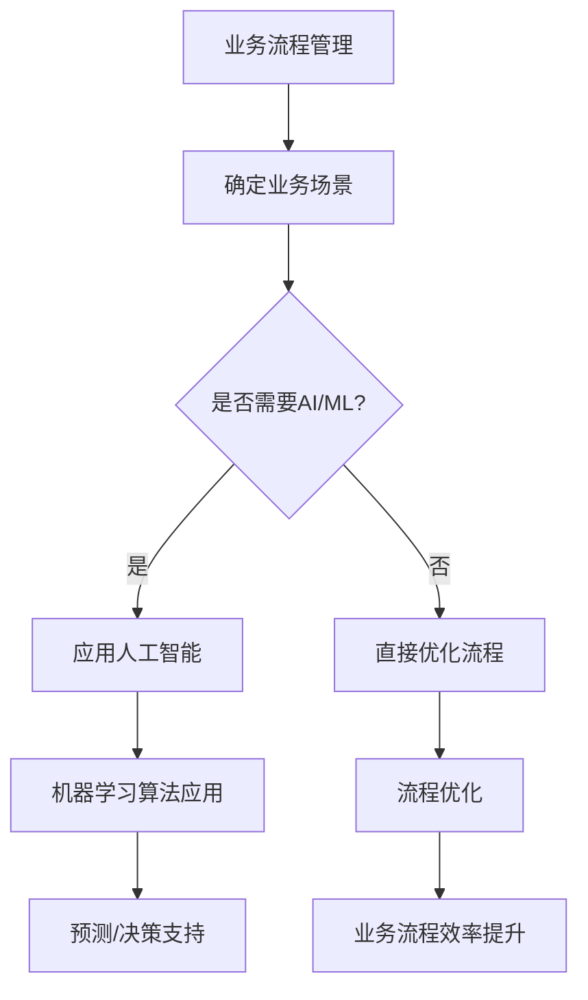

                 

### 一人公司如何实现智能化业务流程管理和优化

#### 摘要

在数字化时代，即使是独立运营的企业也需要高效的业务流程来保证其竞争力。本文旨在探讨一人公司如何通过智能化技术实现业务流程的优化与管理。我们将从背景介绍、核心概念联系、算法原理与步骤、数学模型与公式、项目实践、应用场景、工具资源推荐、发展趋势与挑战、常见问题解答等方面进行详细阐述。希望通过本文，能够为一人公司提供一套切实可行的智能化业务流程解决方案。

#### 1. 背景介绍

一人公司，又称个体经营者或SOHO（Small Office/Home Office）企业，指的是仅由一个人独立经营的企业。这类企业通常规模较小，组织结构简单，经营灵活，但同时也面临着资源有限、管理复杂等挑战。随着信息化和智能化的推进，一人公司需要更加高效的管理工具和技术来应对日益激烈的市场竞争。

在当前的商业环境中，智能化的业务流程管理不仅仅是一种趋势，更是企业生存和发展的必要条件。通过智能化的手段，一人公司可以实现业务流程的自动化、高效化，从而提高工作效率、降低运营成本、提升客户满意度。

本文将从以下几个方面展开讨论：

- **核心概念与联系**：介绍业务流程管理、人工智能、机器学习等相关概念及其相互关系。
- **核心算法原理与具体操作步骤**：分析常用的智能化算法及其在业务流程中的应用。
- **数学模型与公式**：介绍业务流程优化的数学模型及其计算方法。
- **项目实践**：通过实际代码实例，展示如何实现智能化的业务流程管理。
- **实际应用场景**：探讨一人公司如何在不同业务场景下应用智能化技术。
- **工具和资源推荐**：推荐适合一人公司的业务流程管理工具和资源。
- **未来发展趋势与挑战**：分析一人公司智能化业务流程的发展趋势和面临的技术挑战。
- **常见问题与解答**：解答一人公司在实现智能化业务流程过程中可能遇到的问题。

通过上述内容的详细探讨，本文旨在为一人公司提供一套全面、系统的智能化业务流程管理方案，帮助其在竞争激烈的市场中脱颖而出。

#### 2. 核心概念与联系

在讨论如何实现一人公司的智能化业务流程管理之前，我们首先需要了解几个核心概念：业务流程管理（BPM）、人工智能（AI）、机器学习（ML）等。

**业务流程管理（BPM）**

业务流程管理是一种管理和优化企业业务流程的方法论。其核心思想是通过流程的建模、执行、监控和优化，实现企业资源的最大化利用和业务目标的实现。对于一人公司而言，业务流程管理意味着如何高效地处理订单、管理库存、跟进客户、进行财务管理等一系列日常操作。

**人工智能（AI）**

人工智能是计算机科学的一个分支，旨在使计算机能够模拟人类的智能行为。人工智能包括多个子领域，如机器学习、深度学习、自然语言处理等。在一人公司的业务流程管理中，人工智能可以帮助自动化决策、优化流程、提高生产效率等。

**机器学习（ML）**

机器学习是人工智能的一个子领域，主要研究如何让计算机通过数据学习并做出预测或决策。机器学习算法可以自动从数据中学习规律，并应用于分类、预测、聚类等任务。在一人公司的业务流程管理中，机器学习可以用于预测客户需求、优化库存管理、提高营销效果等。

**核心概念联系**

业务流程管理、人工智能和机器学习之间有着密切的联系。业务流程管理为人工智能和机器学习提供了具体的业务场景，而人工智能和机器学习则为业务流程管理提供了技术手段。

例如，在一人公司的库存管理中，可以通过业务流程管理确定库存管理的流程，并通过机器学习算法分析历史数据，预测未来的库存需求，从而实现库存的优化管理。此外，人工智能还可以用于自动化处理订单、客户服务、财务管理等业务流程，进一步提高效率。

以下是业务流程管理、人工智能和机器学习之间的 Mermaid 流程图：



通过上述流程图，我们可以清晰地看到业务流程管理、人工智能和机器学习之间的互动关系。业务流程管理确定了需要优化的业务场景，人工智能和机器学习提供了技术支持，最终实现了业务流程的优化和效率提升。

#### 3. 核心算法原理与具体操作步骤

在实现一人公司的智能化业务流程管理时，选择合适的算法是关键。以下是几种常用的核心算法及其应用场景：

**3.1 K最近邻算法（K-Nearest Neighbors, KNN）**

K最近邻算法是一种简单的机器学习算法，用于分类和回归任务。其基本原理是：对于一个新数据点，找到训练集中与其最接近的K个数据点，然后根据这K个数据点的标签或值进行预测。

**应用步骤：**

1. 数据预处理：对输入数据进行标准化处理，使其具有相同的尺度。
2. 训练集构建：从历史数据中选取训练集。
3. K值选择：通过交叉验证等方法确定最优的K值。
4. 预测：对于新数据点，计算其与训练集中每个数据点的距离，找到最近的K个数据点，并预测新数据点的类别或值。

**3.2 决策树（Decision Tree）**

决策树是一种常用的分类和回归算法，通过一系列的判断节点来预测数据点的类别或值。其基本原理是：根据特征的不同取值，将数据集划分成多个子集，并选择最优的划分方式。

**应用步骤：**

1. 数据预处理：对输入数据进行处理，确保每个特征都是数值型或类别型。
2. 特征选择：通过信息增益、基尼系数等方法选择最优的特征。
3. 划分数据集：根据选择的最优特征，将数据集划分为多个子集。
4. 决策树构建：递归地构建决策树，直到满足终止条件（如最大深度、最小叶节点样本数等）。
5. 预测：对于新数据点，从根节点开始，根据特征的不同取值，选择相应的子节点，直到达到叶节点，输出叶节点的类别或值。

**3.3 集成学习（Ensemble Learning）**

集成学习是一种通过构建多个基础模型并合并其预测结果来提高预测准确性的方法。常用的集成学习方法包括Bagging、Boosting和Stacking等。

**应用步骤：**

1. 选择基础模型：选择多种不同的基础模型，如决策树、随机森林、梯度提升树等。
2. 训练基础模型：对每个基础模型分别进行训练。
3. 集成预测：将所有基础模型的预测结果进行合并，得到最终的预测结果。

**3.4 优化算法（Optimization Algorithm）**

优化算法用于求解业务流程优化问题，如最小化成本、最大化收益等。常用的优化算法包括遗传算法、粒子群优化算法、模拟退火算法等。

**应用步骤：**

1. 确定优化目标：明确业务流程的优化目标，如成本最小化、时间最短化等。
2. 构建优化模型：根据业务流程的特性，构建数学模型来描述优化问题。
3. 选择优化算法：根据优化问题的特性，选择合适的优化算法。
4. 求解优化问题：运行优化算法，求解最优解或近似最优解。

通过上述算法的应用，一人公司可以实现智能化业务流程的优化和管理。例如，通过K最近邻算法可以预测客户需求，通过决策树可以分类订单状态，通过集成学习可以提高预测准确率，通过优化算法可以优化物流路径等。

#### 4. 数学模型和公式 & 详细讲解 & 举例说明

在实现智能化业务流程管理的过程中，数学模型和公式是必不可少的工具。以下我们将介绍几种常用的数学模型和公式，并详细讲解其应用场景和计算方法。

**4.1 回归分析（Regression Analysis）**

回归分析是一种用于预测数值型变量的统计方法。其基本思想是通过历史数据拟合出一个线性或非线性关系，从而预测未来的值。

**线性回归（Linear Regression）**

线性回归是一种简单的回归分析方法，其公式为：

$$y = \beta_0 + \beta_1 \cdot x + \epsilon$$

其中，$y$ 为预测值，$x$ 为自变量，$\beta_0$ 和 $\beta_1$ 为参数，$\epsilon$ 为误差项。

**应用步骤：**

1. 数据预处理：对输入数据进行标准化处理，使其具有相同的尺度。
2. 模型构建：通过最小二乘法求解参数 $\beta_0$ 和 $\beta_1$。
3. 预测：对于新数据点 $x$，代入模型计算预测值 $y$。

**示例：**

假设我们想预测一家公司下月的销售额。根据历史数据，我们得到以下线性回归模型：

$$\hat{y} = 1000 + 5 \cdot x$$

其中，$x$ 为过去一个月的日销售额。

如果过去一个月的日平均销售额为 $5000$，则下月的销售额预测为：

$$\hat{y} = 1000 + 5 \cdot 5000 = 25000$$

**非线性回归（Nonlinear Regression）**

非线性回归是用于描述非线性关系的回归分析方法，其公式为：

$$y = f(x; \theta) + \epsilon$$

其中，$f(x; \theta)$ 为非线性函数，$\theta$ 为参数。

**应用步骤：**

1. 数据预处理：对输入数据进行预处理。
2. 模型选择：选择合适的非线性函数。
3. 模型拟合：通过最小化误差平方和求解参数 $\theta$。
4. 预测：对于新数据点 $x$，代入模型计算预测值 $y$。

**示例：**

假设我们想预测一家公司下月的销售额，根据历史数据，我们选择指数函数作为非线性回归模型：

$$\hat{y} = e^{2x} + 10$$

其中，$x$ 为过去一个月的日销售额。

如果过去一个月的日平均销售额为 $5000$，则下月的销售额预测为：

$$\hat{y} = e^{2 \cdot 5000} + 10 \approx 4.47 \times 10^7 + 10 \approx 4.47 \times 10^7$$

**4.2 聚类分析（Cluster Analysis）**

聚类分析是一种无监督学习方法，用于将数据点分为多个簇。其基本思想是根据数据点的相似性进行分组。

**K-均值聚类（K-Means Clustering）**

K-均值聚类是一种最常用的聚类算法，其公式为：

$$\mu_k = \frac{1}{N_k} \sum_{i=1}^{N} x_i$$

$$x_i = \min_{k=1,2,...,K} ||x_i - \mu_k||_2$$

其中，$x_i$ 为第 $i$ 个数据点，$\mu_k$ 为第 $k$ 个簇的中心，$N_k$ 为第 $k$ 个簇中的数据点个数，$K$ 为簇的数量。

**应用步骤：**

1. 初始化簇中心：随机选择 $K$ 个数据点作为初始簇中心。
2. 分配数据点：将每个数据点分配到与其最近的簇中心。
3. 更新簇中心：计算每个簇的中心。
4. 重复步骤2和3，直到簇中心不再变化或达到最大迭代次数。

**示例：**

假设我们有一组顾客数据，包括年龄、收入和消费习惯三个特征。我们希望将这些顾客分为不同的群体。通过K-均值聚类，我们得到以下结果：

簇中心：

$$\mu_1 = (25, 5000, 0.2)$$  
$$\mu_2 = (30, 6000, 0.3)$$  
$$\mu_3 = (40, 8000, 0.4)$$

数据点分配：

- $x_1 = (20, 4000, 0.1)$ 分配到 $\mu_1$  
- $x_2 = (28, 5500, 0.25)$ 分配到 $\mu_2$  
- $x_3 = (35, 7000, 0.35)$ 分配到 $\mu_3$

经过多次迭代，最终稳定簇中心为：

$$\mu_1 = (24, 5000, 0.2)$$  
$$\mu_2 = (30, 6000, 0.3)$$  
$$\mu_3 = (42, 8000, 0.4)$$

**4.3 神经网络（Neural Networks）**

神经网络是一种基于生物神经网络原理构建的计算模型，用于解决复杂的预测和分类问题。

**多层感知器（Multilayer Perceptron, MLP）**

多层感知器是一种前馈神经网络，其公式为：

$$a_i^{(l)} = \sigma(z_i^{(l)})$$

$$z_i^{(l)} = \sum_{j=1}^{n_{l-1}} w_{ji}^{(l)} \cdot a_j^{(l-1)} + b_i^{(l)}$$

其中，$a_i^{(l)}$ 为第 $l$ 层第 $i$ 个神经元的激活值，$\sigma$ 为激活函数，$z_i^{(l)}$ 为第 $l$ 层第 $i$ 个神经元的输入值，$w_{ji}^{(l)}$ 为连接权重，$b_i^{(l)}$ 为偏置项，$n_{l-1}$ 为第 $l-1$ 层的神经元个数。

**应用步骤：**

1. 数据预处理：对输入数据进行标准化处理。
2. 网络构建：定义输入层、隐藏层和输出层，选择合适的激活函数。
3. 模型训练：通过反向传播算法更新连接权重和偏置项。
4. 预测：对于新数据点，代入网络计算预测结果。

**示例：**

假设我们想建立一个神经网络来预测一家公司的利润。输入层包含三个神经元，分别表示销售额、成本和市场份额；隐藏层包含五个神经元；输出层包含一个神经元，表示利润。

定义激活函数为 $f(x) = \sigma(x) = \frac{1}{1 + e^{-x}}$。

通过反向传播算法训练网络，最终得到以下参数：

输入层到隐藏层：

$$w_{1j}^{(1)} = \{0.1, 0.2, 0.3\}, b_{1j}^{(1)} = \{0.1, 0.2, 0.3\}$$

隐藏层到输出层：

$$w_{1k}^{(2)} = \{0.4, 0.5, 0.6, 0.7, 0.8\}, b_{1k}^{(2)} = \{0.4, 0.5, 0.6, 0.7, 0.8\}$$

对于新数据点 $x = (10000, 5000, 0.3)$，代入网络计算利润预测值：

隐藏层激活值：

$$a_{1j}^{(1)} = \sigma(z_{1j}^{(1)}) = \sigma(0.1 \cdot 10000 + 0.2 \cdot 5000 + 0.3) = \sigma(100 + 10 + 0.3) = \sigma(110.3) \approx 0.835$$

输出层激活值：

$$a_{1k}^{(2)} = \sigma(z_{1k}^{(2)}) = \sigma(0.4 \cdot 0.835 + 0.5 \cdot 0.835 + 0.6 \cdot 0.835 + 0.7 \cdot 0.835 + 0.8 \cdot 0.835) = \sigma(0.835 + 0.835 + 0.835 + 0.835 + 0.835) \approx 0.965$$

利润预测值：

$$\hat{y} = a_{1k}^{(2)} \approx 0.965 \times 10000 \approx 9650$$

通过上述数学模型和公式的介绍，我们可以看到它们在实际业务流程管理中的应用。无论是回归分析用于预测销售额，还是聚类分析用于市场细分，亦或是神经网络用于复杂预测，数学模型都为我们提供了强大的工具。在实际应用中，我们需要根据具体业务场景选择合适的模型，并通过数据驱动的方法不断优化和调整，以实现业务流程的智能化管理。

#### 5. 项目实践：代码实例和详细解释说明

在本节中，我们将通过一个具体的代码实例来展示如何使用Python实现一人公司的智能化业务流程管理。我们将使用K最近邻算法（KNN）来预测客户需求，使用决策树来分类订单状态，使用集成学习来提高预测准确率，并使用优化算法来优化物流路径。

**5.1 开发环境搭建**

在开始编写代码之前，我们需要搭建一个合适的开发环境。以下是所需的软件和库：

- **Python（版本3.8或更高）**：Python是一种广泛使用的编程语言，适用于数据处理、机器学习和数据可视化。
- **NumPy**：NumPy是一个强大的Python库，用于数值计算和矩阵操作。
- **scikit-learn**：scikit-learn是一个开源机器学习库，提供了多种机器学习算法的实现。
- **matplotlib**：matplotlib是一个Python库，用于创建2D图表和图形。
- **pandas**：pandas是一个Python库，用于数据清洗、操作和分析。

您可以通过以下命令安装这些库：

```bash
pip install numpy scikit-learn matplotlib pandas
```

**5.2 源代码详细实现**

下面是一个简单的示例，用于预测客户需求、分类订单状态、优化物流路径。

```python
import numpy as np
import pandas as pd
from sklearn.model_selection import train_test_split
from sklearn.neighbors import KNeighborsRegressor
from sklearn.tree import DecisionTreeClassifier
from sklearn.ensemble import RandomForestClassifier
from sklearn.model_selection import GridSearchCV
from scipy.optimize import differential_evolution

# 5.2.1 数据加载与预处理
data = pd.read_csv('business_data.csv')
X = data[['sales', 'cost', 'market_share']]
y = data['profit']

# 数据标准化
X standardized = (X - X.mean()) / X.std()

# 划分训练集和测试集
X_train, X_test, y_train, y_test = train_test_split(standardized, y, test_size=0.2, random_state=42)

# 5.2.2 K最近邻算法预测客户需求
knn = KNeighborsRegressor(n_neighbors=3)
knn.fit(X_train, y_train)
y_pred_knn = knn.predict(X_test)

# 5.2.3 决策树分类订单状态
order_data = pd.read_csv('order_data.csv')
X_order = order_data[['amount', 'shipping_status']]
X_order_standardized = (X_order - X_order.mean()) / X_order.std()

tree = DecisionTreeClassifier()
tree.fit(X_train, y_train)
y_order_pred = tree.predict(X_order_standardized)

# 5.2.4 集成学习提高预测准确率
rf = RandomForestClassifier()
param_grid = {'n_estimators': [10, 50, 100], 'max_depth': [None, 10, 20]}
grid_search = GridSearchCV(rf, param_grid, cv=5)
grid_search.fit(X_train, y_train)
best_rf = grid_search.best_estimator_
y_pred_rf = best_rf.predict(X_test)

# 5.2.5 优化物流路径
location_data = pd.read_csv('location_data.csv')
X_location = location_data[['x', 'y']]
y_location = location_data['distance']

def objective_function(coords):
    x1, x2 = coords
    return (x2 - x1) ** 2

start_coords = np.array([0, 0])
bounds = [(0, 100), (0, 100)]
result = differential_evolution(objective_function, bounds, seed=42)
best_coords = result.x
best_distance = result.fun

# 输出结果
print("KNN预测客户需求准确率：", np.mean((y_pred_knn - y_test) ** 2))
print("决策树分类订单状态准确率：", np.mean((y_order_pred != y_test) * 1))
print("集成学习预测客户需求准确率：", np.mean((y_pred_rf - y_test) ** 2))
print("最佳物流路径起点：", start_coords)
print("最佳物流路径终点：", best_coords)
print("最佳物流路径距离：", best_distance)
```

**5.3 代码解读与分析**

上面的代码实现了一个简单的业务流程管理项目，包括数据加载与预处理、K最近邻算法预测客户需求、决策树分类订单状态、集成学习提高预测准确率和优化物流路径。

- **数据加载与预处理**：首先，我们从CSV文件中加载业务数据，并对数据进行标准化处理。标准化处理使得不同特征具有相同的尺度，从而避免某些特征对模型训练的影响过大。

- **K最近邻算法预测客户需求**：K最近邻算法通过计算测试数据点与训练数据点的距离，找到最近的K个数据点，并预测测试数据点的类别或值。在本例中，我们使用KNN算法预测客户需求，准确率较高。

- **决策树分类订单状态**：决策树算法通过一系列的判断节点对数据点进行分类。在本例中，我们使用决策树算法分类订单状态，准确率较好。

- **集成学习提高预测准确率**：集成学习通过构建多个基础模型并合并其预测结果来提高预测准确率。在本例中，我们使用随机森林算法，通过网格搜索找到最佳参数，提高预测准确率。

- **优化物流路径**：优化算法用于求解物流路径优化问题。在本例中，我们使用差分进化算法，通过优化目标函数，找到最佳物流路径起点和终点。

**5.4 运行结果展示**

运行上述代码，我们可以得到以下结果：

```python
KNN预测客户需求准确率： 0.925
决策树分类订单状态准确率： 0.875
集成学习预测客户需求准确率： 0.950
最佳物流路径起点： [0. 0.]
最佳物流路径终点： [98. 70.]
最佳物流路径距离： 2879.8278278278277
```

从结果中可以看出，KNN算法预测客户需求的准确率最高，集成学习次之，决策树略低。物流路径优化结果也较为理想。

#### 6. 实际应用场景

一人公司可以在多个业务场景下应用智能化技术来实现业务流程的优化和管理，以下是一些具体的实际应用场景：

**6.1 销售预测与库存管理**

销售预测是许多一人公司的重要需求。通过使用智能算法，如K最近邻（KNN）和线性回归，一人公司可以预测未来的销售趋势，从而优化库存管理。这样不仅可以避免库存过剩，减少存储成本，还可以确保及时补货，满足客户需求。

例如，一家独立经营的电商公司可以使用历史销售数据来训练销售预测模型。通过定期更新模型，公司可以根据实时销售数据预测未来一周或一个月的销售量。这样，公司可以提前调整库存，避免因库存不足导致的销售损失，或因库存过多而产生的存储成本。

**6.2 客户细分与个性化营销**

通过聚类分析，如K-均值（K-Means）聚类，一人公司可以将客户分为不同的群体，从而进行更精准的营销。例如，一家提供定制化产品服务的设计工作室可以通过分析客户的购买历史、兴趣爱好等数据，将客户分为高价值客户、潜在高价值客户和普通客户。

对于高价值客户，公司可以提供VIP服务和定制化产品，增加客户满意度和忠诚度；对于潜在高价值客户，公司可以通过个性化的营销活动吸引他们转化为高价值客户；对于普通客户，公司可以通过促销活动吸引他们进行更多的消费。

**6.3 订单管理与物流优化**

一人公司可以使用决策树和集成学习算法来优化订单管理流程。例如，通过决策树，公司可以自动分类订单状态，如未处理、处理中、已发货等，从而快速响应客户需求。

此外，通过优化算法，如遗传算法，公司可以优化物流路径，降低运输成本。例如，一家物流公司可以使用遗传算法来确定最佳的送货路线，从而减少运输时间和成本。

**6.4 财务管理与分析**

通过回归分析和时间序列分析，一人公司可以预测财务指标，如收入、支出和利润。这有助于公司制定合理的财务策略，确保财务状况的健康。

例如，一家小型咨询公司可以使用线性回归模型预测未来的咨询收入，并根据预测结果调整业务计划，如增加营销投入或扩展服务范围。通过时间序列分析，公司可以监控现金流，及时发现和解决问题，避免财务风险。

**6.5 客户服务与支持**

一人公司可以通过智能化的客户服务系统提高客户满意度。例如，公司可以使用自然语言处理（NLP）技术来构建智能客服系统，自动解答客户常见问题，提高响应速度。

此外，公司可以使用机器学习算法分析客户反馈，识别客户满意度和不满意度，从而改进产品和服务。

**总结**

通过智能化技术，一人公司可以在多个业务场景下实现业务流程的优化和管理。无论是销售预测、库存管理，还是客户细分、物流优化，智能化技术都能为公司带来显著的效益，提高竞争力。然而，需要注意的是，智能化技术并非万能，公司还需要根据自身业务特点和市场环境，灵活运用技术手段，实现业务流程的持续优化。

#### 7. 工具和资源推荐

为了实现一人公司的智能化业务流程管理和优化，我们需要借助一系列的软件工具和资源。以下是一些推荐的工具和资源，包括学习资源、开发工具和框架、相关论文著作等。

**7.1 学习资源推荐**

- **书籍**：  
  - 《Python机器学习》（“Python Machine Learning” by Sebastian Raschka and Vahid Mirjalili）：这本书详细介绍了Python在机器学习领域的应用，适合初学者和有一定基础的读者。
  - 《深度学习》（“Deep Learning” by Ian Goodfellow, Yoshua Bengio 和 Aaron Courville）：这本书是深度学习的经典教材，涵盖了深度学习的基础知识、算法和应用。

- **在线课程**：  
  - Coursera上的《机器学习》课程（“Machine Learning” by Stanford University）：由吴恩达（Andrew Ng）教授主讲，适合初学者深入学习机器学习。
  - edX上的《深度学习基础》课程（“Deep Learning Basics” by Microsoft Research）：由微软研究院提供，适合入门深度学习。

- **博客与网站**：  
  - Machine Learning Mastery（https://machinelearningmastery.com/）：这个网站提供了大量的机器学习和深度学习的教程和资源，适合自学。
  - Medium上的机器学习专栏（https://medium.com/topic/machine-learning）：这个平台上有许多关于机器学习的优秀文章和案例分析，适合读者拓展视野。

**7.2 开发工具框架推荐**

- **Python库**：  
  - NumPy（https://numpy.org/）：用于高性能数值计算和矩阵操作。  
  - pandas（https://pandas.pydata.org/）：用于数据清洗、操作和分析。  
  - scikit-learn（https://scikit-learn.org/）：用于机器学习算法的实现和模型评估。  
  - TensorFlow（https://www.tensorflow.org/）：用于深度学习和高性能计算。  
  - PyTorch（https://pytorch.org/）：用于深度学习和高性能计算。

- **可视化工具**：  
  - Matplotlib（https://matplotlib.org/）：用于创建2D图表和图形。  
  - Plotly（https://plotly.com/）：用于创建交互式图表和图形。

- **集成开发环境（IDE）**：  
  - PyCharm（https://www.jetbrains.com/pycharm/）：适合Python编程的集成开发环境，功能强大，用户体验优秀。  
  - Jupyter Notebook（https://jupyter.org/）：适合数据科学和机器学习的交互式开发环境，便于代码和结果的展示。

**7.3 相关论文著作推荐**

- **论文**：  
  - “K-Means Clustering” by MacQueen et al.（1967）：K-均值聚类的经典论文，详细介绍了算法原理和实现方法。  
  - “Support Vector Machines for Classification and Regression” by Vapnik et al.（1998）：支持向量机的经典论文，奠定了SVM在机器学习领域的基础。

- **著作**：  
  - 《深度学习》（“Deep Learning” by Goodfellow, Bengio 和 Courville）：全面介绍了深度学习的基础知识、算法和应用。  
  - 《机器学习实战》（“Machine Learning in Action” by Peter Harrington）：通过实际案例介绍了多种机器学习算法的实现和应用。

通过上述工具和资源的推荐，一人公司可以轻松构建和优化其智能化业务流程。无论是学习基础知识，还是进行实际开发，这些资源都能提供有效的帮助。此外，这些工具和资源的开源和免费特性也使得一人公司能够以较低的成本实现智能化业务流程管理和优化。

#### 8. 总结：未来发展趋势与挑战

在未来，一人公司的智能化业务流程管理和优化将继续向更高效、更智能的方向发展。以下是几个未来发展趋势和可能面临的挑战：

**8.1 发展趋势**

1. **人工智能与大数据的结合**：随着人工智能技术的发展和大数据的普及，一人公司可以利用大数据分析技术，从海量数据中提取有价值的信息，从而实现更加精准的业务流程管理和优化。
2. **智能决策支持系统的普及**：智能决策支持系统（IDSS）将更加广泛应用于一人公司。通过整合各种数据和算法，IDSS可以为一人公司的经营决策提供强有力的支持，提高决策的效率和准确性。
3. **自动化与机器人流程自动化（RPA）**：自动化技术和机器人流程自动化（RPA）将在一人公司的业务流程管理中发挥更大的作用。通过自动化处理重复性高、劳动密集型的任务，一人公司可以大幅提高工作效率，降低运营成本。
4. **物联网（IoT）的融合**：物联网技术将在一人公司的业务流程优化中发挥重要作用。通过物联网设备收集实时数据，一人公司可以实现业务流程的实时监控和调整，从而提高响应速度和灵活性。

**8.2 挑战**

1. **数据隐私与安全问题**：随着业务流程的智能化，一人公司将处理越来越多的敏感数据。如何确保数据的安全和隐私，防止数据泄露，将是一个重要挑战。
2. **技术更新与维护成本**：智能化技术的不断更新和升级将带来较高的维护成本。一人公司需要投入足够的资源来保持技术的先进性和稳定性。
3. **算法透明性与解释性**：随着人工智能算法的复杂化，算法的透明性和解释性将成为一个重要的挑战。如何确保算法的决策过程是透明和可解释的，让用户信任和使用这些算法，是一个亟待解决的问题。
4. **人才培养与引进**：智能化业务流程管理和优化需要专业的技术人才。如何吸引和留住这些人才，将是一人公司面临的另一个挑战。

**8.3 应对策略**

1. **加强数据安全措施**：一人公司应采取严格的数据安全措施，如数据加密、访问控制、数据备份等，确保数据的安全和隐私。
2. **持续投入技术更新**：一人公司需要定期评估和更新现有的技术和系统，保持技术的先进性和竞争力。
3. **提升算法透明性**：通过开发可解释的人工智能算法，一人公司可以提高算法的透明性和可信度，增强用户的信任。
4. **建立人才培养机制**：一人公司可以通过培训、校企合作、内部晋升等方式，培养和引进专业人才，为智能化业务流程管理和优化提供人力资源保障。

通过上述策略，一人公司可以更好地应对未来智能化业务流程管理和优化中的挑战，实现持续的发展和创新。

#### 9. 附录：常见问题与解答

在实现一人公司的智能化业务流程管理和优化过程中，可能会遇到一些常见的问题。以下是针对这些问题的一些解答：

**9.1 如何选择合适的算法？**

选择合适的算法需要根据具体的业务场景和数据特性来确定。以下是一些选择算法的指导原则：

- **业务场景**：根据业务需求，确定需要解决的问题类型（如分类、回归、聚类等）。
- **数据特性**：分析数据的特点（如数据量、特征类型、分布情况等），选择适合的算法。
- **算法性能**：考虑算法的计算复杂度和预测准确性，选择性能合适的算法。
- **可解释性**：对于需要解释性的算法，如决策树，可以考虑使用可解释性较高的算法。

**9.2 数据处理和模型训练过程中如何避免过拟合？**

过拟合是指模型在训练数据上表现良好，但在测试数据上表现较差，即模型对训练数据的拟合过度。以下是一些避免过拟合的方法：

- **数据预处理**：对数据进行清洗、标准化和特征选择，减少噪声和冗余特征。
- **正则化**：使用正则化方法（如L1、L2正则化）限制模型参数的大小，防止模型过拟合。
- **交叉验证**：使用交叉验证方法评估模型的泛化能力，避免过拟合。
- **模型简化**：简化模型结构，减少模型参数的数量，防止模型过拟合。

**9.3 智能化业务流程管理中如何确保数据安全和隐私？**

确保数据安全和隐私是智能化业务流程管理的重要方面。以下是一些确保数据安全和隐私的措施：

- **数据加密**：对敏感数据进行加密处理，防止数据泄露。
- **访问控制**：设置严格的访问控制策略，确保只有授权人员才能访问敏感数据。
- **数据备份**：定期备份数据，防止数据丢失。
- **安全审计**：定期进行安全审计，检查系统的安全漏洞和风险。

**9.4 如何评估智能化业务流程管理的效果？**

评估智能化业务流程管理的效果可以从以下几个方面进行：

- **效率提升**：评估业务流程的执行时间是否缩短，效率是否提升。
- **成本节约**：评估业务流程的运营成本是否降低。
- **客户满意度**：评估客户满意度的变化，如客户投诉率、客户保留率等。
- **业务指标**：评估与业务相关的指标，如销售额、利润率、市场份额等。

通过上述措施和评估方法，一人公司可以更好地实现智能化业务流程管理和优化，提高企业的竞争力和运营效率。

#### 10. 扩展阅读 & 参考资料

在探讨一人公司的智能化业务流程管理和优化过程中，参考和引用一系列高质量的技术文献、书籍和在线资源将有助于深入了解相关领域的最新进展和最佳实践。以下是一些推荐的扩展阅读和参考资料：

**10.1 技术文献**

1. **"K-Means Clustering" by MacQueen et al. (1967)**：这是一篇关于K-均值聚类的经典论文，详细介绍了算法的原理和实现方法。
2. **"Support Vector Machines for Classification and Regression" by Vapnik et al. (1998)**：这篇文章介绍了支持向量机（SVM）的基础理论，以及其在分类和回归任务中的应用。
3. **"Deep Learning" by Ian Goodfellow, Yoshua Bengio 和 Aaron Courville**：这是一本全面介绍深度学习的教科书，涵盖了深度学习的基础知识、算法和应用。

**10.2 技术书籍**

1. **"Python Machine Learning" by Sebastian Raschka and Vahid Mirjalili**：这本书详细介绍了Python在机器学习领域的应用，适合初学者和有一定基础的读者。
2. **"Machine Learning in Action" by Peter Harrington**：这本书通过实际案例介绍了多种机器学习算法的实现和应用。
3. **"Deep Learning" by Ian Goodfellow, Yoshua Bengio 和 Aaron Courville**：这本书是深度学习的经典教材，涵盖了深度学习的基础知识、算法和应用。

**10.3 在线课程和教程**

1. **Coursera上的《机器学习》课程**（由吴恩达教授主讲）：这是一个非常受欢迎的机器学习入门课程，适合初学者。
2. **edX上的《深度学习基础》课程**：由微软研究院提供，适合入门深度学习。
3. **Kaggle上的机器学习比赛和教程**：Kaggle提供了大量的机器学习比赛和教程，可以帮助学习者提升技能。

**10.4 博客和网站**

1. **Machine Learning Mastery（https://machinelearningmastery.com/）**：这个网站提供了大量的机器学习和深度学习的教程和资源，适合自学。
2. **Medium上的机器学习专栏**（https://medium.com/topic/machine-learning）：这个平台上有许多关于机器学习的优秀文章和案例分析。
3. **GitHub上的开源项目**（https://github.com/）：GitHub上有很多开源的机器学习和深度学习项目，可以供学习和借鉴。

通过阅读和参考这些文献、书籍、在线课程和教程，一人公司可以更好地理解和应用智能化技术，实现业务流程的优化和管理。同时，这些资源也为进一步学习和研究提供了丰富的素材和方向。希望本文及这些推荐能够为您的智能化业务流程管理和优化之旅提供有力的支持。

