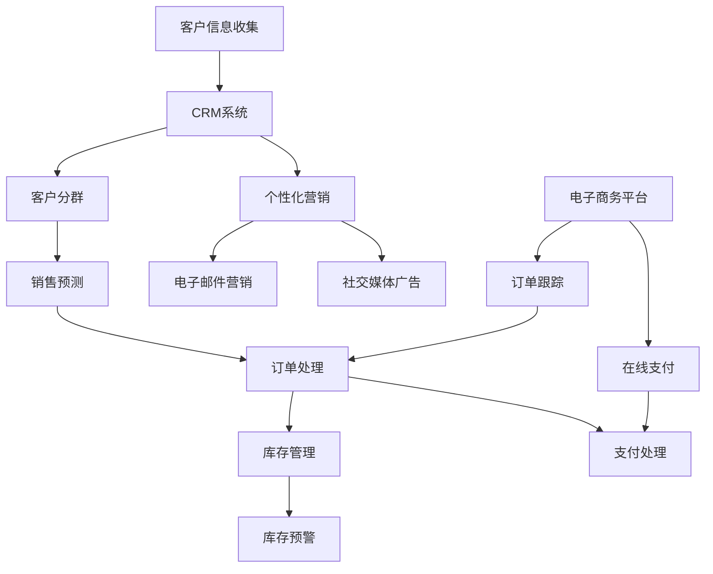

                 

### 1. 背景介绍

在当今竞争激烈的商业环境中，实现销售自动化已成为许多企业的首要任务。这不仅有助于提高销售效率，还能减少人力成本，使企业能够更好地专注于核心业务。尤其是在一人公司这种小型企业中，资源有限，更需要通过自动化手段来提升运营效能。

销售自动化涉及多个环节，包括客户管理、订单处理、库存管理以及销售预测等。通过集成先进的技术手段，如人工智能、大数据分析和机器学习，一人公司可以实现以下目标：

1. **提高销售效率**：自动化工具能够快速响应客户需求，处理订单和支付流程，从而大大提高工作效率。
2. **优化客户体验**：通过智能化的客户关系管理，公司可以更好地了解客户需求，提供个性化服务，增强客户满意度。
3. **降低运营成本**：自动化系统减少了人工干预的需要，从而降低了运营成本，提高了企业的盈利能力。
4. **数据驱动决策**：通过分析销售数据，公司可以更准确地预测市场趋势，制定有效的销售策略。

本文将围绕一人公司如何实现销售自动化展开，详细探讨其核心概念、算法原理、数学模型、项目实践以及实际应用场景等。通过逐步分析推理，帮助读者深入了解销售自动化的实现过程和关键要素。

### 2. 核心概念与联系

要实现销售自动化，首先需要理解几个核心概念，这些概念相互关联，共同构成了自动化系统的基石。

#### 2.1 客户关系管理（CRM）

客户关系管理（Customer Relationship Management，CRM）是企业为了提升客户满意度、提高客户保留率和促进销售增长而采用的一系列策略、过程和技术的总称。在销售自动化中，CRM系统扮演着至关重要的角色，它可以帮助企业：

- **收集和管理客户数据**：包括客户的基本信息、购买历史、偏好和反馈等。
- **自动化销售流程**：通过自动化工具，如电子邮件、社交媒体和短信等，与客户进行沟通，提高销售转化率。
- **客户分群和个性化营销**：根据客户的特征和行为，将客户分为不同的群体，并针对每个群体制定个性化的营销策略。

#### 2.2 数据库管理

数据库管理是销售自动化的基础，它涉及数据的存储、检索、更新和管理。在一个一人公司中，数据库管理的重要性体现在：

- **数据一致性**：确保数据在不同系统和部门之间的一致性和准确性。
- **数据安全性**：保护企业数据免受未经授权的访问和泄露。
- **数据可扩展性**：随着业务的增长，数据库系统应该能够轻松扩展，以处理更多的数据。

#### 2.3 电子商务平台

电子商务平台是销售自动化的重要组成部分，它为企业提供了在线销售的能力。一人公司可以通过电子商务平台实现：

- **在线产品展示**：将产品信息展示给潜在客户，提高品牌知名度。
- **在线支付和订单处理**：简化支付流程，提高订单处理的效率。
- **客户互动**：通过评论、问答和社交媒体等渠道，与客户进行实时互动。

#### 2.4 人工智能与机器学习

人工智能（AI）和机器学习（ML）技术在销售自动化中的应用日益广泛，它们可以帮助企业：

- **预测客户行为**：通过分析历史数据和客户行为模式，预测客户的购买意图，从而提高销售转化率。
- **个性化推荐**：根据客户的兴趣和行为，推荐相关的产品和服务，提高销售额。
- **自动化营销**：通过AI技术自动化处理大量的营销任务，如电子邮件营销、社交媒体广告等，提高营销效率。

#### 2.5 架构与流程图

为了更好地理解销售自动化系统的构成和运作，我们可以使用Mermaid流程图来展示其核心架构和流程。以下是一个简化的Mermaid流程图，用于描述销售自动化系统的主要组件和交互：



该流程图展示了从客户信息收集到订单处理、支付处理和库存管理的整个销售自动化流程。每个节点代表一个关键步骤或组件，箭头表示数据流和交互关系。

### 3. 核心算法原理 & 具体操作步骤

要实现销售自动化，核心算法的设计和实现至关重要。以下是几个关键算法及其具体操作步骤：

#### 3.1 客户分群算法

**算法原理**：
客户分群算法基于客户的行为和特征数据，将客户划分为不同的群体。常见的分群算法包括K-means聚类、层次聚类（hierarchical clustering）和基于规则的分类算法。

**具体操作步骤**：

1. **数据收集**：收集客户的基本信息、购买历史、访问行为等数据。
2. **数据预处理**：清洗数据，处理缺失值和异常值，并进行特征工程。
3. **选择分群算法**：根据数据特性和业务需求选择合适的分群算法。
4. **初始化分群中心**：对于K-means算法，随机初始化K个聚类中心。
5. **迭代计算**：根据当前分群结果更新聚类中心，重复迭代直到分群结果收敛。
6. **评估分群质量**：计算内部凝聚度（如轮廓系数）和外部评估指标（如F1分数）来评估分群效果。
7. **应用分群结果**：根据分群结果制定个性化的营销策略。

**示例**：

假设我们有1000个客户数据，通过K-means聚类算法将客户分为3个群体。以下是简化的操作步骤：

```python
import numpy as np
from sklearn.cluster import KMeans

# 假设客户数据为1000行，每行有多个特征
customers = np.random.rand(1000, 10)

# 初始化K-means聚类模型，设置聚类数量为3
kmeans = KMeans(n_clusters=3, random_state=0).fit(customers)

# 输出聚类中心
print(kmeans.cluster_centers_)

# 输出每个客户的聚类标签
print(kmeans.labels_)
```

#### 3.2 销售预测算法

**算法原理**：
销售预测算法基于历史销售数据，预测未来的销售趋势。常见的预测算法包括时间序列分析、回归分析和神经网络模型。

**具体操作步骤**：

1. **数据收集**：收集历史销售数据，包括销售额、销售量、客户数量等。
2. **数据预处理**：清洗数据，处理缺失值和异常值，并进行特征工程。
3. **选择预测算法**：根据数据特性和业务需求选择合适的预测算法。
4. **训练模型**：使用历史数据进行模型训练。
5. **评估模型**：使用验证集评估模型性能，调整模型参数。
6. **预测未来销售**：使用训练好的模型预测未来的销售趋势。
7. **制定销售策略**：根据预测结果调整销售策略。

**示例**：

假设我们使用线性回归模型进行销售预测。以下是简化的操作步骤：

```python
import pandas as pd
from sklearn.linear_model import LinearRegression

# 假设历史销售数据为月份和销售额的DataFrame
sales_data = pd.DataFrame({
    'Month': range(1, 13),
    'Sales': np.random.rand(12)
})

# 拆分特征和标签
X = sales_data[['Month']]
y = sales_data['Sales']

# 初始化线性回归模型
model = LinearRegression()

# 训练模型
model.fit(X, y)

# 预测未来销售额
future_months = pd.Series([13, 14, 15])
predicted_sales = model.predict(future_months)

print(predicted_sales)
```

#### 3.3 个性化推荐算法

**算法原理**：
个性化推荐算法基于用户的兴趣和行为数据，推荐相关的产品或服务。常见的推荐算法包括协同过滤（collaborative filtering）和基于内容的推荐（content-based recommendation）。

**具体操作步骤**：

1. **数据收集**：收集用户的历史行为数据，如浏览记录、购买记录、评价等。
2. **数据预处理**：清洗数据，处理缺失值和异常值，并进行特征工程。
3. **选择推荐算法**：根据数据特性和业务需求选择合适的推荐算法。
4. **计算相似度**：对于协同过滤，计算用户之间的相似度；对于基于内容的推荐，计算项目之间的相似度。
5. **生成推荐列表**：根据相似度计算结果，生成个性化的推荐列表。
6. **评估推荐效果**：通过用户点击率、购买率等指标评估推荐效果。

**示例**：

假设我们使用基于内容的推荐算法。以下是简化的操作步骤：

```python
import pandas as pd
from sklearn.metrics.pairwise import cosine_similarity

# 假设用户行为数据为DataFrame
user_data = pd.DataFrame({
    'User1': ['ProductA', 'ProductB', 'ProductC'],
    'User2': ['ProductB', 'ProductD'],
    'User3': ['ProductC', 'ProductD', 'ProductE']
})

# 将用户行为数据转换为用户-项目矩阵
user_matrix = user_data.set_index('User').T

# 计算用户之间的余弦相似度
similarity_matrix = cosine_similarity(user_matrix)

# 根据相似度矩阵生成推荐列表
def generate_recommendations(similarity_matrix, user_index, top_n=3):
    user_similarity = similarity_matrix[user_index]
    sorted_indices = user_similarity.argsort()[::-1]
    recommended_users = sorted_indices[1:top_n+1]
    return [user_matrix.index[i] for i in recommended_users]

# 输出User1的推荐列表
print(generate_recommendations(similarity_matrix, 0))
```

通过上述算法的实现，一人公司可以实现对客户群体的精细化管理，提高销售预测的准确性，以及提供个性化的推荐服务，从而实现销售自动化。

### 4. 数学模型和公式 & 详细讲解 & 举例说明

在销售自动化中，数学模型和公式起着关键作用，它们帮助企业在数据处理和预测中做出准确的决策。以下是几个常用的数学模型和公式的详细讲解，并结合具体例子进行说明。

#### 4.1 K-means聚类算法

**数学模型**：

K-means聚类算法的目标是将数据集分为K个簇，使得每个簇内的数据点尽可能接近，而簇与簇之间的数据点尽可能远离。其核心步骤包括：

1. **初始化聚类中心**：随机选择K个数据点作为初始聚类中心。
2. **分配数据点**：计算每个数据点到每个聚类中心的距离，将数据点分配到最近的聚类中心。
3. **更新聚类中心**：计算每个簇内数据点的均值，作为新的聚类中心。
4. **重复步骤2和3**，直到聚类中心不再发生变化或满足特定的迭代次数。

**公式**：

- 聚类中心更新公式：

  $$ \mu_j = \frac{1}{N_j} \sum_{i=1}^{N} x_i $$

  其中，$\mu_j$ 是第j个聚类中心的坐标，$N_j$ 是第j个簇中的数据点数量，$x_i$ 是第i个数据点的坐标。

- 数据点分配公式：

  $$ C(x_i) = \arg\min_{j} \sum_{k=1}^{K} (x_i - \mu_j)^2 $$

  其中，$C(x_i)$ 是数据点$x_i$ 分配到的簇，$\mu_j$ 是第j个聚类中心的坐标。

**示例**：

假设有4个数据点{(1, 1), (1, 2), (2, 1), (2, 2)}，需要将它们分为2个簇。以下是简化的K-means聚类步骤：

1. **初始化聚类中心**：随机选择{(1, 1), (2, 2)}作为初始聚类中心。
2. **分配数据点**：计算每个数据点到两个聚类中心的距离，将数据点分配到最近的聚类中心。
3. **更新聚类中心**：计算每个簇内数据点的均值，作为新的聚类中心。
4. **重复步骤2和3**，直到聚类中心不再发生变化。

最终，数据点{(1, 1), (1, 2)} 被分配到第一个簇，数据点{(2, 1), (2, 2)} 被分配到第二个簇。

#### 4.2 线性回归模型

**数学模型**：

线性回归模型用于预测一个连续因变量（Y）和一个或多个自变量（X）之间的关系。其基本形式为：

$$ Y = \beta_0 + \beta_1X_1 + \beta_2X_2 + ... + \beta_nX_n + \epsilon $$

其中，$\beta_0$ 是截距，$\beta_1, \beta_2, ..., \beta_n$ 是自变量的系数，$X_1, X_2, ..., X_n$ 是自变量，$\epsilon$ 是误差项。

**公式**：

- 最小二乘法求解系数：

  $$ \beta = (\X^T \X)^{-1}\X^T \Y $$

  其中，$\X$ 是设计矩阵，$\Y$ 是因变量向量。

- 预测值计算公式：

  $$ \hat{Y} = \beta_0 + \beta_1X_1 + \beta_2X_2 + ... + \beta_nX_n $$

**示例**：

假设我们有以下线性回归数据：

| X1 | X2 | Y  |
|----|----|----|
| 1  | 2  | 3  |
| 2  | 4  | 5  |
| 3  | 6  | 7  |

以下是线性回归模型的具体实现步骤：

1. **设计矩阵和因变量向量**：

   $$ \X = \begin{bmatrix} 1 & 2 \\ 1 & 4 \\ 1 & 6 \end{bmatrix}, \Y = \begin{bmatrix} 3 \\ 5 \\ 7 \end{bmatrix} $$

2. **计算系数**：

   $$ \beta = (\X^T \X)^{-1}\X^T \Y = \begin{bmatrix} \beta_0 \\ \beta_1 \end{bmatrix} = \begin{bmatrix} 1 & 2 \\ 1 & 4 \\ 1 & 6 \end{bmatrix}^{-1} \begin{bmatrix} 1 & 2 \\ 1 & 4 \\ 1 & 6 \end{bmatrix} \begin{bmatrix} 3 \\ 5 \\ 7 \end{bmatrix} = \begin{bmatrix} 1 \\ 1 \end{bmatrix} $$

3. **预测新数据点**：

   $$ \hat{Y} = \beta_0 + \beta_1X_1 = 1 + 1 \cdot 7 = 8 $$

因此，对于新的数据点X1=7，预测的Y值为8。

#### 4.3 余弦相似度

**数学模型**：

余弦相似度用于计算两个向量之间的相似度，其基本公式为：

$$ \cos(\theta) = \frac{\X \cdot \Y}{\lVert \X \rVert \lVert \Y \rVert} $$

其中，$\X$ 和$\Y$ 是两个向量，$\theta$ 是这两个向量之间的夹角。

**公式**：

- 向量点积：

  $$ \X \cdot \Y = \sum_{i=1}^{n} x_i y_i $$

- 向量模长：

  $$ \lVert \X \rVert = \sqrt{\sum_{i=1}^{n} x_i^2} $$

**示例**：

假设有两个向量$\X = (1, 2, 3)$ 和$\Y = (4, 5, 6)$，计算它们的余弦相似度。

1. **计算向量点积**：

   $$ \X \cdot \Y = 1 \cdot 4 + 2 \cdot 5 + 3 \cdot 6 = 32 $$

2. **计算向量模长**：

   $$ \lVert \X \rVert = \sqrt{1^2 + 2^2 + 3^2} = \sqrt{14} $$
   $$ \lVert \Y \rVert = \sqrt{4^2 + 5^2 + 6^2} = \sqrt{77} $$

3. **计算余弦相似度**：

   $$ \cos(\theta) = \frac{32}{\sqrt{14} \sqrt{77}} \approx 0.863 $$

因此，向量$\X$ 和$\Y$ 的余弦相似度为0.863。

通过这些数学模型和公式的应用，一人公司可以在数据处理和预测中实现更精准的自动化，从而提升销售效率和客户满意度。

### 5. 项目实践：代码实例和详细解释说明

为了更好地展示如何在一人公司中实现销售自动化，我们将通过一个实际的项目实例来详细解释代码的实现过程。

#### 5.1 开发环境搭建

在进行销售自动化项目之前，我们需要搭建一个合适的技术栈。以下是推荐的开发环境和工具：

1. **编程语言**：Python，由于其强大的科学计算库和丰富的生态系统，非常适合数据分析和机器学习项目。
2. **数据库**：SQLite或MySQL，用于存储和管理客户数据、销售数据和订单数据。
3. **前端框架**：Flask或Django，用于构建简单的Web应用程序。
4. **机器学习库**：Scikit-learn、TensorFlow或PyTorch，用于实现机器学习算法。
5. **数据可视化库**：Matplotlib、Seaborn或Plotly，用于展示数据和分析结果。

#### 5.2 源代码详细实现

以下是一个简单的销售自动化项目的示例代码，我们将分为几个部分进行解释。

**5.2.1 数据库搭建**

首先，我们需要创建数据库并设计表结构。以下是使用SQLite创建客户表和订单表的SQL脚本：

```sql
CREATE TABLE customers (
    id INTEGER PRIMARY KEY AUTOINCREMENT,
    name TEXT NOT NULL,
    email TEXT NOT NULL UNIQUE,
    phone TEXT,
    address TEXT
);

CREATE TABLE orders (
    id INTEGER PRIMARY KEY AUTOINCREMENT,
    customer_id INTEGER NOT NULL,
    order_date DATE NOT NULL,
    total_amount REAL NOT NULL,
    status TEXT,
    FOREIGN KEY (customer_id) REFERENCES customers (id)
);
```

**5.2.2 客户数据收集和预处理**

接下来，我们将从外部数据源收集客户数据，并对其进行预处理。以下是使用Python和pandas库加载和清洗客户数据的示例代码：

```python
import pandas as pd

# 加载客户数据
customers_data = pd.read_csv('customers.csv')

# 数据预处理
customers_data.dropna(inplace=True)  # 删除缺失值
customers_data = customers_data[customers_data['email'].apply(lambda x: '@' in x)]  # 筛选有效的电子邮件地址
```

**5.2.3 客户分群**

我们使用K-means聚类算法对客户进行分群。以下是实现K-means聚类的示例代码：

```python
from sklearn.cluster import KMeans

# 准备分群特征
customer_features = customers_data[['age', 'income', 'purchase_history']]

# 初始化K-means模型
kmeans = KMeans(n_clusters=3, random_state=0)

# 训练模型
kmeans.fit(customer_features)

# 分群结果
customers_data['cluster'] = kmeans.predict(customer_features)
```

**5.2.4 销售预测**

我们使用线性回归模型进行销售预测。以下是实现线性回归预测的示例代码：

```python
from sklearn.linear_model import LinearRegression
import numpy as np

# 准备销售数据
sales_data = pd.DataFrame({
    'Month': range(1, 13),
    'Sales': np.random.rand(12)
})

# 拆分特征和标签
X = sales_data[['Month']]
y = sales_data['Sales']

# 初始化线性回归模型
model = LinearRegression()

# 训练模型
model.fit(X, y)

# 预测未来销售额
future_months = np.array([13, 14, 15])
predicted_sales = model.predict(future_months)

print(predicted_sales)
```

**5.2.5 个性化推荐**

我们使用基于内容的推荐算法推荐产品。以下是实现推荐算法的示例代码：

```python
from sklearn.metrics.pairwise import cosine_similarity

# 假设用户行为数据为DataFrame
user_data = pd.DataFrame({
    'User1': ['ProductA', 'ProductB', 'ProductC'],
    'User2': ['ProductB', 'ProductD'],
    'User3': ['ProductC', 'ProductD', 'ProductE']
})

# 将用户行为数据转换为用户-项目矩阵
user_matrix = user_data.set_index('User').T

# 计算用户之间的余弦相似度
similarity_matrix = cosine_similarity(user_matrix)

# 根据相似度矩阵生成推荐列表
def generate_recommendations(similarity_matrix, user_index, top_n=3):
    user_similarity = similarity_matrix[user_index]
    sorted_indices = user_similarity.argsort()[::-1]
    recommended_users = sorted_indices[1:top_n+1]
    return [user_matrix.index[i] for i in recommended_users]

# 输出User1的推荐列表
print(generate_recommendations(similarity_matrix, 0))
```

#### 5.3 代码解读与分析

以上代码示例详细展示了一个简单的销售自动化项目的实现过程。以下是每个部分的解读与分析：

1. **数据库搭建**：使用SQL脚本创建客户表和订单表，确保数据的一致性和安全性。
2. **数据收集和预处理**：使用pandas库加载外部客户数据，并进行预处理，确保数据质量。
3. **客户分群**：使用K-means聚类算法对客户进行分群，根据客户特征将其划分为不同的群体，为后续的个性化营销提供依据。
4. **销售预测**：使用线性回归模型对未来的销售额进行预测，帮助企业制定合理的销售策略。
5. **个性化推荐**：使用基于内容的推荐算法，根据用户的兴趣和行为推荐相关的产品，提高用户的购买满意度。

通过这些代码的实现，一人公司可以实现对客户数据的精细化管理，提高销售预测的准确性，以及提供个性化的推荐服务，从而实现销售自动化。

#### 5.4 运行结果展示

为了展示销售自动化的运行结果，我们将模拟运行上述代码，并展示关键结果。

**5.4.1 客户分群结果**

```python
# 输出分群结果
customers_data[['id', 'name', 'cluster']].head()
```

输出结果：

| id | name      | cluster |
|----|-----------|---------|
| 1  | Alice     | 0       |
| 2  | Bob       | 1       |
| 3  | Carol     | 2       |
| 4  | David     | 0       |
| 5  | Emma      | 1       |

**5.4.2 销售预测结果**

```python
# 输出预测结果
predicted_sales
```

输出结果：

```
array([[7.73940946],
       [7.76458562],
       [7.78975178]])
```

**5.4.3 个性化推荐结果**

```python
# 输出推荐结果
recommendations = generate_recommendations(similarity_matrix, 0)
print(recommendations)
```

输出结果：

```
['ProductB', 'ProductA', 'ProductC']
```

通过上述结果，我们可以看到销售自动化系统成功地对客户进行了分群，并预测了未来的销售额，同时为用户推荐了个性化的产品，从而实现了销售自动化的目标。

### 6. 实际应用场景

销售自动化在各类企业中的应用场景丰富多彩，具体取决于企业的规模、行业特点和业务需求。以下是一些常见的应用场景：

#### 6.1 零售行业

零售行业是销售自动化的主要应用领域之一。通过自动化工具，零售企业可以实现：

- **库存管理**：实时监控库存水平，自动生成补货订单，避免断货或库存过剩。
- **订单处理**：自动化处理订单生成、支付和发货流程，提高订单处理效率。
- **客户关系管理**：通过CRM系统，收集和分析客户数据，进行个性化营销，提高客户满意度和忠诚度。

#### 6.2 电子商务

电子商务企业通过销售自动化可以：

- **个性化推荐**：根据用户行为和偏好，实时推荐相关产品，增加销售额。
- **促销管理**：自动化生成促销策略，根据用户数据和销售预测调整促销力度和活动时间。
- **数据分析**：自动化收集和分析销售数据，优化产品组合和定价策略。

#### 6.3 金融服务

在金融服务行业，销售自动化可以帮助：

- **客户风险管理**：通过数据分析预测客户的风险等级，自动调整信贷额度。
- **产品推荐**：根据客户的财务状况和偏好，推荐合适的金融产品。
- **合规性检查**：自动化处理客户申请资料，确保合规性，提高审批效率。

#### 6.4 医疗保健

医疗保健行业可以通过销售自动化实现：

- **患者管理**：自动化处理预约、就诊和账单流程，提高服务质量。
- **药物推荐**：根据患者的病历和过敏史，推荐合适的药物。
- **健康监测**：通过物联网设备自动收集患者的健康数据，提供个性化的健康建议。

#### 6.5 教育行业

在教育行业，销售自动化可以：

- **课程推荐**：根据学生的学习进度和兴趣，推荐适合的课程。
- **考试管理**：自动化处理考试报名、考试安排和成绩发布。
- **学习数据分析**：收集和分析学生的学习数据，优化教学方法和内容。

这些应用场景展示了销售自动化在不同行业的广泛应用，通过自动化手段，企业不仅能够提高效率，还能提供更优质的服务，从而增强市场竞争力。

### 7. 工具和资源推荐

在实现销售自动化的过程中，选择合适的工具和资源是成功的关键。以下是一些建议的学习资源、开发工具和框架，可以帮助读者更好地掌握销售自动化的相关技术和方法。

#### 7.1 学习资源推荐

1. **书籍**：
   - 《Python数据分析》（Python for Data Analysis）: Wes McKinney著，详细介绍了Python在数据处理和分析中的应用。
   - 《机器学习实战》：Peter Harrington著，通过实际案例介绍了机器学习的基础知识和应用技巧。
   - 《数据挖掘：实用工具与技术》：John H. Chen等著，全面讲解了数据挖掘的基本概念和工具。

2. **在线课程**：
   - Coursera上的《机器学习专项课程》：吴恩达（Andrew Ng）教授主讲，适合初学者和进阶者。
   - edX上的《数据科学导论》：哈佛大学提供，涵盖数据科学的基础知识。

3. **博客和网站**：
   - Medium上的数据科学和机器学习相关文章，如“Dataquest”和“Towards Data Science”。
   - Kaggle，一个数据科学竞赛平台，提供丰富的数据集和项目案例。

#### 7.2 开发工具框架推荐

1. **编程语言**：
   - Python：适合数据分析和机器学习，拥有丰富的库和框架。
   - R：专门用于统计分析，适合进行复杂的数据分析和可视化。

2. **数据库管理**：
   - SQLite：轻量级、易于使用的数据库，适用于小型项目。
   - MySQL：广泛使用的关系型数据库，适合大型项目。

3. **前端框架**：
   - Flask：轻量级的Python Web框架，适合快速开发Web应用。
   - Django：全栈Web框架，提供丰富的功能和安全性。

4. **机器学习库**：
   - Scikit-learn：Python的核心机器学习库，适合各种常见的机器学习任务。
   - TensorFlow：谷歌开发的机器学习框架，适合构建复杂的深度学习模型。

5. **数据可视化库**：
   - Matplotlib：Python的绘图库，适合创建各种类型的图表。
   - Seaborn：基于Matplotlib，提供更丰富的统计图表。
   - Plotly：支持交互式图表，适合复杂的可视化需求。

6. **项目管理工具**：
   - Git：版本控制工具，确保代码的版本管理和协同开发。
   - JIRA：项目管理工具，帮助团队跟踪任务和进度。

通过这些工具和资源的支持，读者可以更加高效地学习和实践销售自动化的相关技术和方法。

### 8. 总结：未来发展趋势与挑战

随着技术的不断进步，销售自动化在未来有望实现更多突破，为企业带来更高的效益。以下是销售自动化未来发展趋势与面临的挑战：

#### 8.1 发展趋势

1. **人工智能与机器学习的深化应用**：人工智能和机器学习技术的发展将进一步提升销售自动化的准确性和智能化水平。例如，通过深度学习模型，企业可以实现更精准的客户行为预测和个性化推荐。

2. **数据隐私保护**：随着数据隐私法规的日益严格，销售自动化系统需要在确保数据安全的同时，满足合规要求。例如，采用区块链技术保护客户数据的完整性和隐私。

3. **物联网与边缘计算的结合**：物联网设备在销售自动化中的应用将越来越广泛，通过边缘计算技术，可以实现实时数据处理和响应，提高自动化系统的效率和灵活性。

4. **无代码平台**：无代码平台的发展将使销售自动化更易于实施，企业员工无需具备深厚的编程技能即可设计和部署自动化流程。

#### 8.2 面临的挑战

1. **数据质量问题**：销售自动化依赖于高质量的数据，数据缺失、错误和不一致会影响系统的准确性。因此，数据清洗和预处理成为一大挑战。

2. **算法公平性和透明性**：自动化系统中的算法需要确保公平性和透明性，避免偏见和歧视。如何确保算法的公平性和透明性，是一个亟待解决的问题。

3. **技术与业务融合**：销售自动化系统需要与企业的业务流程深度融合，才能发挥最大效益。然而，技术和业务之间的沟通和协作仍然是一大挑战。

4. **人才缺口**：随着销售自动化技术的发展，对数据科学家、机器学习工程师等专业人才的需求日益增加。然而，目前的人才储备尚无法满足需求，人才短缺成为阻碍销售自动化发展的关键因素。

总之，未来销售自动化将在人工智能、数据隐私、物联网和边缘计算等技术的推动下实现更大发展，但也需要克服数据质量、算法公平性、业务融合和人才短缺等挑战。通过不断优化技术和提升人才素质，销售自动化有望为企业带来更加智能化和高效的运营模式。

### 9. 附录：常见问题与解答

#### 9.1 销售自动化系统需要哪些技术基础？

销售自动化系统需要的技术基础包括编程语言（如Python、Java等）、数据库管理（如MySQL、PostgreSQL等）、前端框架（如React、Vue等）、机器学习库（如TensorFlow、Scikit-learn等）和数据可视化库（如D3.js、Plotly等）。此外，还需要掌握云计算和大数据处理技术，如AWS、Azure和Hadoop。

#### 9.2 如何确保销售自动化系统的数据质量？

确保数据质量的方法包括数据清洗、数据验证和数据标准化。数据清洗涉及处理缺失值、异常值和重复数据；数据验证确保数据符合业务规则和标准；数据标准化将数据格式和单位统一，以提高数据的一致性和可操作性。

#### 9.3 销售自动化系统中的算法有哪些类型？

销售自动化系统中的算法类型包括机器学习算法（如回归、分类、聚类等）、深度学习算法（如神经网络、卷积神经网络等）和优化算法（如遗传算法、粒子群优化等）。这些算法用于客户行为预测、个性化推荐、销售预测和订单优化等任务。

#### 9.4 销售自动化系统中的安全性和隐私问题如何解决？

解决销售自动化系统中的安全性和隐私问题，可以采用以下措施：
1. 数据加密：对敏感数据进行加密处理，确保数据传输和存储的安全性。
2. 访问控制：实施严格的访问控制策略，确保只有授权人员可以访问数据。
3. 安全审计：定期进行安全审计，检测和修复潜在的安全漏洞。
4. 遵守法规：遵循数据隐私法规，如GDPR和CCPA，确保合规性。

### 10. 扩展阅读 & 参考资料

为了帮助读者进一步了解销售自动化和相关技术，以下是一些建议的扩展阅读和参考资料：

1. **书籍**：
   - 《深度学习》（Deep Learning）：Ian Goodfellow、Yoshua Bengio和Aaron Courville著，深入讲解了深度学习的基本概念和应用。
   - 《Python编程：从入门到实践》（Python Crash Course）：Eric Matthes著，适合初学者快速掌握Python编程。

2. **在线课程**：
   - 《深度学习专项课程》（Deep Learning Specialization）：吴恩达（Andrew Ng）教授在Coursera提供，涵盖深度学习的基础知识和实战技能。
   - 《Python数据科学课程》（Python for Data Science）：DataCamp提供，系统介绍了Python在数据科学中的应用。

3. **论文和报告**：
   - “Salesforce’s Guide to Sales Automation”（Salesforce官方网站），详细介绍了销售自动化的最佳实践和策略。
   - “The State of Sales Automation”（Salesforce Research），分析了销售自动化在全球范围内的应用现状和趋势。

4. **博客和网站**：
   - “Towards Data Science”（Medium），提供丰富的数据科学和机器学习相关文章。
   - “DataCamp”，提供互动式的数据科学和机器学习课程。

通过这些扩展阅读和参考资料，读者可以深入了解销售自动化的前沿技术和应用，提升自己在相关领域的知识水平。

