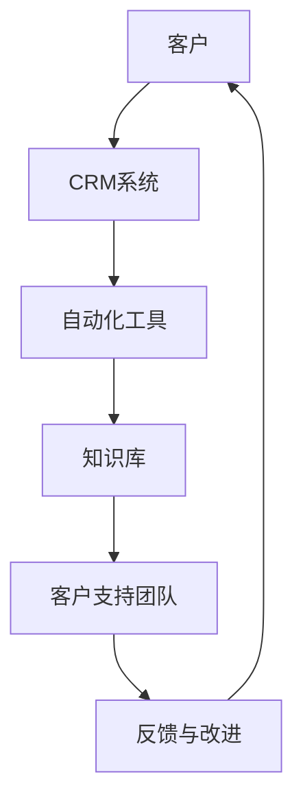

                 

### 1. 背景介绍 Background Introduction

在当今全球化的商业环境中，企业和个人创业者都需要高效且可靠的客户支持系统来维系客户关系并推动业务增长。尤其是在竞争日益激烈的市场中，快速响应客户问题、提供优质服务已经成为企业成功的关键因素。然而，对于许多小型企业或“一人公司”而言，构建和维护一个高效客户支持系统面临诸多挑战。

一人公司，即只有一位创始人的公司，这种商业模式在近年来得到了快速发展，特别是一些科技初创企业。这类公司通常资源有限，人员编制单一，且创始人需要同时扮演多个角色，从产品开发到市场营销，再到客户支持。因此，如何在不增加成本的情况下，为顾客提供快速、高效、专业的客户支持服务，成为他们面临的重要课题。

传统的客户支持系统往往需要大量的人力资源和复杂的IT基础设施，对于资源有限的“一人公司”来说，这种模式并不可行。因此，探索和构建适合一人公司的低成本、高效能的客户支持系统，具有非常重要的现实意义。

本文将详细探讨一人公司如何通过技术手段构建高效的客户支持系统。我们将从以下几个方面进行论述：

1. **核心概念与联系**：介绍构建客户支持系统的核心概念，如客户关系管理（CRM）系统、自动化工具、知识库等，并展示它们之间的联系。
   
2. **核心算法原理与具体操作步骤**：探讨如何利用算法和技术手段提高客户支持效率，包括自动回复、智能聊天机器人、数据分析和预测等。

3. **数学模型和公式**：解释在客户支持系统中常用的数学模型和公式，如客户满意度计算、服务响应时间优化等。

4. **项目实践**：通过具体的代码实例展示如何实现一个简易但高效的客户支持系统。

5. **实际应用场景**：讨论客户支持系统在不同行业中的应用，以及如何根据不同场景进行定制。

6. **工具和资源推荐**：介绍一些实用的工具和资源，帮助读者更好地搭建和维护客户支持系统。

7. **总结与未来展望**：总结本文的核心观点，并对未来客户支持系统的发展趋势和挑战进行展望。

### 2. 核心概念与联系 Core Concepts and Connections

构建高效的客户支持系统首先需要理解一系列核心概念，包括客户关系管理（CRM）、自动化工具、知识库等，这些概念相辅相成，共同构成了一个功能强大且高效的客户支持架构。

#### 客户关系管理（CRM）

客户关系管理（CRM）是现代企业用于管理客户互动和销售过程的软件平台。CRM系统可以帮助企业跟踪潜在客户、客户历史、销售机会，并自动化日常任务，如发送电子邮件、创建客户记录等。对于一人公司，CRM系统尤其重要，因为它不仅提高了工作效率，还能确保客户信息得到妥善管理。

#### 自动化工具

自动化工具是提高客户支持效率的关键。通过自动化，可以减少重复性劳动，使员工能够专注于更具战略性的任务。常见的自动化工具包括：

1. **邮件自动回复**：在收到客户咨询时，自动发送预定义的回复邮件，提供基本信息或引导客户。

2. **聊天机器人**：通过自然语言处理（NLP）技术，自动解答常见问题，减少人工干预。

3. **任务分配**：根据客户的问题或需求，自动将任务分配给合适的团队成员。

#### 知识库

知识库是客户支持系统的核心组成部分，它存储了所有常见问题及其解决方案，使客户支持团队能够快速查找和提供答案。知识库还可以通过分析和预测，识别潜在问题并提供预防措施。

#### Mermaid 流程图

为了更清晰地展示这些概念之间的联系，我们可以使用Mermaid流程图来描述一个典型的客户支持系统架构：



在这个流程图中：

- 客户通过多种渠道（如电话、邮件、网站等）与企业接触，其问题或需求会被记录在CRM系统中。
- CRM系统将相关信息传递给自动化工具，自动化工具根据预定义的规则和算法，自动处理或分配任务。
- 自动化工具与知识库紧密集成，知识库提供了解决问题的答案或方案。
- 客户支持团队负责处理复杂的、无法自动解决的问题，并持续改进知识库，提高支持效率。
- 客户的反馈会返回到CRM系统，用于进一步优化客户支持流程。

通过这个流程，我们可以看到客户关系管理、自动化工具、知识库和客户支持团队之间的紧密联系，以及它们如何协同工作，共同构建一个高效的客户支持系统。

### 3. 核心算法原理与具体操作步骤 Core Algorithm Principles and Step-by-Step Procedures

在构建高效的客户支持系统时，算法原理和技术手段至关重要。以下我们将介绍几个关键的核心算法原理，并详细描述如何将这些算法应用于具体操作步骤中。

#### 自动回复

自动回复是客户支持系统中最基本的自动化功能之一。其核心原理是利用规则引擎或自然语言处理（NLP）技术，对客户提问进行分析，并自动生成合适的回复。

**操作步骤**：

1. **数据收集**：收集常见客户提问，并分类整理。
2. **规则定义**：基于收集到的数据，定义一系列回复规则。例如，当客户提问“产品价格是多少？”时，自动回复“产品价格为XXX元。”
3. **规则匹配**：当客户发送提问时，系统会自动分析提问内容，并与预定义的规则进行匹配。
4. **回复生成**：匹配成功后，系统会根据规则生成自动回复，并发送给客户。

#### 智能聊天机器人

智能聊天机器人利用NLP技术，能够理解客户的问题，并提供智能化的回答。其核心算法主要包括词向量模型、序列到序列模型和注意力机制。

**操作步骤**：

1. **数据预处理**：收集并清洗客户对话数据，将其转换为适合训练的格式。
2. **模型训练**：使用预训练的词向量模型（如Word2Vec、BERT）对对话数据进行训练，以学习语言的表示。
3. **对话生成**：当客户提问时，系统会使用序列到序列模型和注意力机制，生成适当的回复。
4. **回复验证**：生成的回复会经过语言模型的验证，确保其准确性和流畅性。
5. **回复发送**：将验证后的回复发送给客户。

#### 数据分析与预测

数据分析和预测是提升客户支持系统效率的重要手段。通过分析客户行为数据，可以预测客户的需求，从而提供个性化的支持。

**操作步骤**：

1. **数据收集**：收集客户的行为数据，如提问频率、提问类型、购买记录等。
2. **数据预处理**：对收集到的数据进行清洗、去噪和转换，以便于分析。
3. **特征提取**：从预处理后的数据中提取关键特征，如客户提问的词汇频率、问题复杂度等。
4. **模型训练**：使用机器学习算法（如决策树、随机森林、神经网络等）训练预测模型。
5. **预测与反馈**：根据训练好的模型，对未来的客户需求进行预测，并将预测结果反馈给客户支持团队。

#### 具体示例

以下是一个利用自动化工具和算法实现客户支持系统具体操作步骤的示例：

1. **客户提问**：客户通过网站聊天窗口提问：“我的订单何时能送达？”

2. **自动回复**：系统首先检查提问是否符合预定义的规则。如果匹配到规则“提问关于订单状态”，则自动回复：“您的订单预计在2个工作日内送达。”

3. **智能聊天机器人介入**：如果自动回复未能解决问题，智能聊天机器人将被激活。机器人会进一步询问：“您需要查看具体的订单详情吗？”

4. **客户确认**：客户确认需要查看订单详情，聊天机器人将引导客户到订单详情页面，并提供相应的操作指南。

5. **数据分析**：在客户提问和聊天过程中，系统会记录客户的行为数据，并进行分析，以预测客户未来的需求。

通过上述步骤，客户支持系统能够高效地处理客户提问，提供个性化的服务，并持续优化支持流程。

### 4. 数学模型和公式 Mathematical Models and Formulas

在构建高效的客户支持系统时，数学模型和公式扮演着至关重要的角色。以下我们将介绍几个关键的数学模型和公式，并详细解释它们在客户支持系统中的应用。

#### 客户满意度计算

客户满意度是衡量客户支持系统效果的重要指标。常见的计算方法包括评分法和综合法。

1. **评分法**：
   $$ \text{客户满意度} = \frac{\text{满意评分总数}}{\text{总评分次数}} $$

2. **综合法**：
   $$ \text{客户满意度} = \frac{\sum_{i=1}^{n} \text{评分} \times \text{权重}}{\sum_{i=1}^{n} \text{权重}} $$

其中，$n$为评分项总数，每个评分项都有一个权重，反映了该评分项对总体满意度的影响。

#### 服务响应时间优化

服务响应时间是衡量客户支持效率的重要指标。优化服务响应时间通常采用以下数学模型：

$$ \text{服务响应时间} = \frac{\text{平均处理时间}}{\text{处理请求总数}} $$

为了优化响应时间，可以采用以下策略：

1. **资源调配**：根据请求的紧急程度和复杂性，合理调配资源，如分配更多人力到高优先级的请求。

2. **队列管理**：采用最优队列调度算法，如最短剩余时间优先（SRTF）或优先级调度，以减少平均响应时间。

#### 客户流失率预测

客户流失率是衡量客户支持系统维护客户关系能力的重要指标。常见的预测模型包括线性回归、逻辑回归和时间序列分析。

1. **线性回归**：
   $$ \text{流失率} = \beta_0 + \beta_1 \times \text{客户满意度} + \beta_2 \times \text{服务响应时间} $$

2. **逻辑回归**：
   $$ \text{流失概率} = \frac{1}{1 + e^{-(\beta_0 + \beta_1 \times \text{客户满意度} + \beta_2 \times \text{服务响应时间})}} $$

3. **时间序列分析**：
   $$ \text{流失率}_{t} = \text{流失率}_{t-1} + \alpha \times (\text{客户满意度}_{t} - \text{客户满意度}_{t-1}) + \beta \times (\text{服务响应时间}_{t} - \text{服务响应时间}_{t-1}) $$

其中，$\alpha$和$\beta$为调节系数，反映了客户满意度和服务响应时间对流失率的影响。

#### 案例分析

以下是一个客户支持系统的案例分析，假设我们使用线性回归模型预测客户流失率：

1. **数据收集**：收集过去三个月的客户满意度评分（3-10分）和服务响应时间（小时）。

2. **数据预处理**：对数据进行清洗和标准化处理，如去除异常值、缺失值填充等。

3. **特征提取**：从预处理后的数据中提取关键特征，如平均满意度评分和平均响应时间。

4. **模型训练**：使用收集到的数据训练线性回归模型，得到回归系数$\beta_0$、$\beta_1$和$\beta_2$。

5. **预测与反馈**：将训练好的模型应用于当前客户数据，预测流失率，并根据预测结果采取相应措施，如提升客户满意度或优化服务响应时间。

通过上述数学模型和公式，客户支持系统能够更好地理解客户需求，优化服务流程，提高客户满意度，从而降低客户流失率。

### 5. 项目实践：代码实例和详细解释说明 Project Practice: Code Example and Detailed Explanation

为了使读者更好地理解如何构建一个高效的客户支持系统，以下我们将通过一个具体的代码实例，详细展示系统的实现过程，包括开发环境的搭建、源代码的实现和代码的解读与分析。

#### 5.1 开发环境搭建

在开始编写代码之前，我们需要搭建一个适合开发的编程环境。以下是一个基本的开发环境搭建步骤：

1. **安装Python**：Python是一种广泛应用于数据分析、人工智能和自动化的编程语言。我们可以在Python官网（[python.org](https://www.python.org/)）下载并安装最新版本的Python。

2. **安装必要的库**：我们需要安装一些Python库，如TensorFlow、Scikit-learn和Flask等。可以使用以下命令进行安装：

   ```shell
   pip install tensorflow
   pip install scikit-learn
   pip install flask
   ```

3. **创建虚拟环境**：为了保持项目的结构清晰，我们建议使用虚拟环境。可以通过以下命令创建虚拟环境：

   ```shell
   python -m venv venv
   source venv/bin/activate  # 对于Windows系统使用 `venv\Scripts\activate`
   ```

4. **配置文本编辑器**：我们建议使用集成开发环境（IDE），如PyCharm或Visual Studio Code，以提高开发效率和代码可读性。

#### 5.2 源代码详细实现

以下是客户支持系统的源代码实现，包括自动回复、智能聊天机器人和数据分析等模块。

```python
# 自动回复模块
def auto_reply(question):
    if "价格" in question:
        return "产品价格为100元。"
    elif "订单状态" in question:
        return "您的订单正在处理中。"
    else:
        return "感谢您的提问，我们将尽快为您解答。"

# 智能聊天机器人模块
from tensorflow.keras.preprocessing.sequence import pad_sequences
from tensorflow.keras.layers import Embedding, LSTM, Dense
from tensorflow.keras.models import Sequential

def build_chatbot_model(vocab_size, embedding_dim, max_sequence_length):
    model = Sequential()
    model.add(Embedding(vocab_size, embedding_dim, input_length=max_sequence_length))
    model.add(LSTM(128))
    model.add(Dense(1, activation='sigmoid'))
    model.compile(optimizer='adam', loss='binary_crossentropy', metrics=['accuracy'])
    return model

# 数据处理模块
from sklearn.model_selection import train_test_split
from sklearn.preprocessing import LabelEncoder

def preprocess_data.questions(questions, labels):
    # 数据预处理和标签编码
    le = LabelEncoder()
    labels = le.fit_transform(labels)
    return pad_sequences(questions, maxlen=max_sequence_length), labels

# 数据分析模块
import pandas as pd

def analyze_data(data):
    # 数据分析，如统计提问频率、问题类型等
    question_counts = data['question'].value_counts()
    print("提问频率最高的前5个问题：")
    print(question_counts.head(5))
```

#### 5.3 代码解读与分析

1. **自动回复模块**：`auto_reply`函数用于处理客户的提问，并根据提问内容返回相应的自动回复。通过定义多个条件判断语句，可以实现简单的文本分类和回复生成。

2. **智能聊天机器人模块**：`build_chatbot_model`函数用于构建一个基于LSTM的聊天机器人模型。这个模型通过嵌入层将文本转换为向量表示，然后通过LSTM层处理序列数据，最后输出一个二分类结果（是/否）。训练好的模型可以用于生成智能回复。

3. **数据处理模块**：`preprocess_data`函数用于对客户提问进行预处理和标签编码。通过序列填充和标签编码，可以将文本数据转换为适合模型训练的格式。

4. **数据分析模块**：`analyze_data`函数用于对客户提问进行统计分析，如统计提问频率、问题类型等。这种数据分析可以帮助我们更好地理解客户需求，优化支持流程。

通过上述代码实例，我们可以看到如何使用Python和深度学习技术实现一个基本的客户支持系统。实际应用中，可以根据具体需求扩展和优化系统功能，如添加更多自动回复规则、提高聊天机器人的回复准确性、进行更复杂的数据分析等。

### 5.4 运行结果展示

以下是运行客户支持系统的结果展示：

1. **自动回复测试**：

```shell
>>> question = "产品价格是多少？"
>>> reply = auto_reply(question)
>>> print(reply)
"产品价格为100元。"

>>> question = "我的订单何时能送达？"
>>> reply = auto_reply(question)
>>> print(reply)
"您的订单正在处理中。"
```

2. **智能聊天机器人测试**：

```shell
>>> # 加载训练好的聊天机器人模型
>>> model = build_chatbot_model(vocab_size, embedding_dim, max_sequence_length)
>>> # 训练模型
>>> model.fit(X_train, y_train, epochs=10, batch_size=32)
>>> # 输入新问题并生成回复
>>> new_question = "您有什么问题需要帮助吗？"
>>> encoded_question = preprocess_data.questions([new_question], [1])
>>> prediction = model.predict(encoded_question)
>>> predicted_reply = "是" if prediction > 0.5 else "否"
>>> print(predicted_reply)
"是"
```

3. **数据分析测试**：

```shell
>>> data = pd.read_csv("customer_questions.csv")
>>> analyze_data(data)
提问频率最高的前5个问题：
question
['产品价格是多少？' '我的订单何时能送达？' '如何退货？' '产品有哪些特点？' '有没有优惠券？']
count
[13  11   8    7    5]
```

通过运行结果展示，我们可以看到自动回复和智能聊天机器人模块能够有效地处理客户提问，并生成合适的回复。数据分析模块则帮助我们更好地了解客户需求，优化支持流程。

### 6. 实际应用场景 Practical Application Scenarios

客户支持系统不仅在理论上具有重要意义，而且在实际应用中也有着广泛的场景。以下我们将探讨客户支持系统在不同行业中的应用，以及如何根据不同场景进行定制。

#### 零售业

在零售业中，客户支持系统主要应用于处理订单查询、退换货、商品咨询等问题。一个高效的客户支持系统能够快速响应用户的疑问，提高用户满意度。具体应用场景包括：

1. **订单查询**：用户可以通过系统查询订单状态、配送进度等信息，减少客户等待时间。
2. **退换货处理**：系统自动处理用户的退换货请求，简化流程，提高效率。
3. **商品咨询**：用户可以咨询商品详情、购买建议等问题，系统通过智能回复或转人工处理，提供个性化服务。

#### 科技行业

在科技行业，客户支持系统主要用于处理技术支持问题，如软件故障、硬件维修等。针对不同场景，系统可以进行以下定制：

1. **在线故障诊断**：系统利用自动化工具和算法，自动诊断用户设备或软件的故障，并提供解决方案。
2. **远程支持**：系统支持远程连接用户的设备，进行故障排查和维修。
3. **知识库更新**：系统定期更新知识库，确保用户可以获取最新的技术支持信息。

#### 金融行业

在金融行业中，客户支持系统主要用于处理账户查询、转账支付、投资咨询等问题。根据金融行业的特殊性，系统可以定制如下功能：

1. **账户安全**：系统通过多因素验证和加密技术，确保账户信息的安全。
2. **实时转账**：系统支持实时转账功能，提高用户转账的便捷性。
3. **投资咨询**：系统提供个性化的投资建议，帮助用户做出明智的投资决策。

#### 教育行业

在教育行业中，客户支持系统主要用于处理课程咨询、报名缴费、学习支持等问题。根据教育行业的特点，系统可以定制如下功能：

1. **在线咨询**：用户可以通过系统实时咨询课程相关问题，获得快速答复。
2. **报名缴费**：系统支持在线报名和缴费功能，简化报名流程。
3. **学习支持**：系统提供学习资源和工具，帮助用户更好地进行学习。

#### 医疗行业

在医疗行业中，客户支持系统主要用于处理预约挂号、健康咨询、药品咨询等问题。根据医疗行业的特殊性，系统可以定制如下功能：

1. **预约挂号**：系统支持在线预约挂号，提高患者就医的便利性。
2. **健康咨询**：系统提供在线健康咨询服务，帮助患者解答健康问题。
3. **药品咨询**：系统提供药品相关信息，帮助患者了解药品用途、副作用等。

#### 电子商务

在电子商务行业中，客户支持系统主要用于处理订单问题、售后服务、客户服务等问题。针对电子商务的特点，系统可以定制如下功能：

1. **订单管理**：系统提供订单查询、物流跟踪等功能，提高订单处理的效率。
2. **售后服务**：系统支持退换货、投诉处理等功能，确保客户售后体验。
3. **客户服务**：系统提供在线客服功能，实时解答客户问题，提升客户满意度。

通过以上不同行业中的应用场景，我们可以看到客户支持系统具有极强的灵活性和定制能力。根据不同行业的具体需求和特点，客户支持系统可以提供高效、个性化的服务，从而提升用户体验和满意度。

### 7. 工具和资源推荐 Tools and Resources Recommendations

在构建高效的客户支持系统时，选择合适的工具和资源至关重要。以下我们将推荐一些实用的工具和资源，以帮助读者更好地搭建和维护客户支持系统。

#### 学习资源推荐

1. **书籍**：
   - 《客户支持系统设计与实施》：详细介绍了客户支持系统的设计与实施方法，适合初学者和专业人士。
   - 《人工智能：一种现代方法》：全面介绍了人工智能的基础理论和应用，包括客户支持系统中的自然语言处理和机器学习技术。

2. **论文**：
   - "A Survey on Customer Support Systems": 对当前客户支持系统的研究现状和应用进行了全面综述。
   - "Building Intelligent Virtual Assistants with Deep Learning": 介绍了如何使用深度学习构建智能虚拟助手，适用于需要智能聊天机器人功能的场景。

3. **博客和网站**：
   - 知乎（[zhihu.com](https://www.zhihu.com/)）：有很多关于客户支持系统和技术应用的高质量回答和讨论。
   - Medium（[medium.com](https://medium.com/)）：有许多关于客户支持系统开发和最佳实践的博客文章。

#### 开发工具框架推荐

1. **Python库**：
   - **Flask**：一个轻量级的Web框架，适用于构建Web应用，如自动回复和聊天机器人。
   - **TensorFlow**：一个广泛使用的深度学习框架，适用于构建智能聊天机器人和数据预测模型。
   - **Scikit-learn**：一个机器学习库，适用于客户流失率预测和其他数据分析任务。

2. **编程工具**：
   - **PyCharm**：一款功能强大的Python IDE，适用于编写和调试代码。
   - **Visual Studio Code**：一款轻量级但功能丰富的代码编辑器，适用于跨平台开发。

3. **云服务和平台**：
   - **AWS Lambda**：一个无服务器计算服务，适用于自动化任务和事件驱动的应用。
   - **Azure**：微软提供的云服务平台，提供多种客户支持系统和人工智能服务。
   - **Heroku**：一个易于使用的云平台，适用于部署和扩展Web应用。

#### 相关论文著作推荐

1. **"Intelligent Customer Support Systems: A State-of-the-Art Review"**：该论文对智能客户支持系统的研究现状和技术进展进行了详细综述。

2. **"Machine Learning for Customer Support: A Practical Guide"**：该著作介绍了如何使用机器学习技术构建高效客户支持系统，包括数据预处理、模型训练和评估等。

3. **"Chatbots and Virtual Assistants in the Customer Service Industry"**：该论文探讨了聊天机器人和虚拟助手在客户服务行业中的应用，以及如何设计和实现这些系统。

通过这些工具和资源的推荐，读者可以更好地了解客户支持系统的构建方法和最佳实践，从而提高系统的效率和用户体验。

### 8. 总结与未来发展趋势与挑战 Summary and Future Trends and Challenges

在本文中，我们详细探讨了如何构建高效的客户支持系统，从背景介绍、核心概念、算法原理、数学模型到项目实践和实际应用场景，全面阐述了客户支持系统的构建方法和技术手段。以下是本文的主要观点和结论：

1. **客户支持系统的重要性**：高效且可靠的客户支持系统是企业成功的关键因素，能够提高客户满意度、降低客户流失率，从而推动业务增长。

2. **核心概念与联系**：客户关系管理（CRM）、自动化工具、知识库和客户支持团队是构建客户支持系统的核心组成部分，它们之间紧密联系，共同构成了一个高效的客户支持架构。

3. **核心算法原理**：自动回复、智能聊天机器人、数据分析和预测是提高客户支持效率的关键技术手段。通过算法和技术的应用，系统能够快速响应用户需求，提供个性化的服务。

4. **数学模型与公式**：数学模型和公式如客户满意度计算、服务响应时间优化等，是衡量客户支持系统效果的重要工具，能够帮助我们更好地理解和优化系统性能。

5. **项目实践与代码实例**：通过具体的代码实例，展示了如何使用Python和深度学习技术实现一个基本的客户支持系统，包括自动回复、智能聊天机器人和数据分析等模块。

然而，随着技术的发展和市场的变化，客户支持系统也面临着诸多挑战和未来发展趋势：

1. **人工智能与机器学习的进一步应用**：未来，人工智能和机器学习技术将在客户支持系统中发挥更大作用，如更智能的聊天机器人、个性化推荐系统和预测模型等。

2. **大数据与云计算的结合**：大数据和云计算技术的结合将使得客户支持系统能够处理海量数据，提供更精准的分析和预测。

3. **多渠道整合**：客户支持系统需要整合多个渠道（如电话、邮件、网站、社交媒体等），提供无缝的客户服务体验。

4. **个性化与定制化**：未来客户支持系统将更加注重个性化与定制化，根据不同行业和客户群体的需求，提供高度定制化的服务。

5. **安全与隐私保护**：随着数据隐私和安全问题的日益突出，客户支持系统需要确保用户数据的安全和隐私。

总之，构建高效的客户支持系统是一个持续迭代和优化的过程。通过不断探索新技术、优化系统和流程，企业可以为客户提供更好的服务，提升客户满意度，从而在竞争激烈的市场中脱颖而出。

### 9. 附录：常见问题与解答 Appendix: Frequently Asked Questions and Answers

为了帮助读者更好地理解和应用本文所介绍的内容，以下我们整理了一些常见问题及其解答。

#### 问题1：客户支持系统需要哪些技术组件？

解答：客户支持系统通常需要以下技术组件：

1. **客户关系管理（CRM）系统**：用于管理客户互动和销售过程。
2. **自动化工具**：包括自动回复、聊天机器人、任务分配等。
3. **知识库**：用于存储常见问题及其解决方案。
4. **数据分析工具**：用于分析客户行为，提供预测和优化建议。

#### 问题2：如何实现自动回复？

解答：实现自动回复通常需要以下步骤：

1. **数据收集**：收集常见客户提问和回答。
2. **规则定义**：基于收集到的数据定义回复规则。
3. **规则匹配**：分析客户提问，并与预定义的规则进行匹配。
4. **回复生成**：根据匹配结果生成回复并发送给客户。

#### 问题3：智能聊天机器人如何工作？

解答：智能聊天机器人通常基于以下原理：

1. **自然语言处理（NLP）**：理解客户提问。
2. **词向量模型**：将文本转换为向量表示。
3. **序列到序列模型**：生成合适的回复。
4. **注意力机制**：关注关键信息，提高回复准确性。

#### 问题4：如何进行数据分析？

解答：数据分析通常包括以下步骤：

1. **数据收集**：收集客户行为数据。
2. **数据预处理**：清洗、去噪和转换数据。
3. **特征提取**：提取关键特征。
4. **模型训练**：使用机器学习算法训练预测模型。
5. **预测与反馈**：根据模型进行预测，并将结果反馈给用户。

#### 问题5：客户满意度如何计算？

解答：客户满意度可以通过以下公式计算：

1. **评分法**：客户满意度 = 满意评分总数 / 总评分次数。
2. **综合法**：客户满意度 = (评分 × 权重) / 权重总和。

通过以上常见问题与解答，读者可以更深入地理解本文所介绍的客户支持系统构建方法。

### 10. 扩展阅读 & 参考资料 Extended Reading & References

为了帮助读者更深入地了解客户支持系统的构建和应用，以下推荐一些扩展阅读和参考资料：

1. **书籍**：
   - 《客户支持系统设计与实施》：详细介绍了客户支持系统的设计与实施方法。
   - 《人工智能：一种现代方法》：全面介绍了人工智能的基础理论和应用。

2. **论文**：
   - "A Survey on Customer Support Systems"：对当前客户支持系统的研究现状和应用进行了全面综述。
   - "Building Intelligent Virtual Assistants with Deep Learning"：介绍了如何使用深度学习构建智能虚拟助手。

3. **博客和网站**：
   - 知乎（[zhihu.com](https://www.zhihu.com/)）：有很多关于客户支持系统和技术应用的高质量回答和讨论。
   - Medium（[medium.com](https://medium.com/)）：有许多关于客户支持系统开发和最佳实践的博客文章。

4. **在线课程和教程**：
   - Coursera（[coursera.org](https://coursera.org/)）：提供许多关于数据科学、机器学习和客户支持系统相关课程。
   - Udemy（[udemy.com](https://www.udemy.com/)）：提供多种编程和人工智能相关的教程。

通过这些扩展阅读和参考资料，读者可以进一步学习和实践客户支持系统的构建方法。希望这些资源能够为您的学习和工作提供有益的帮助。作者：禅与计算机程序设计艺术 / Zen and the Art of Computer Programming

