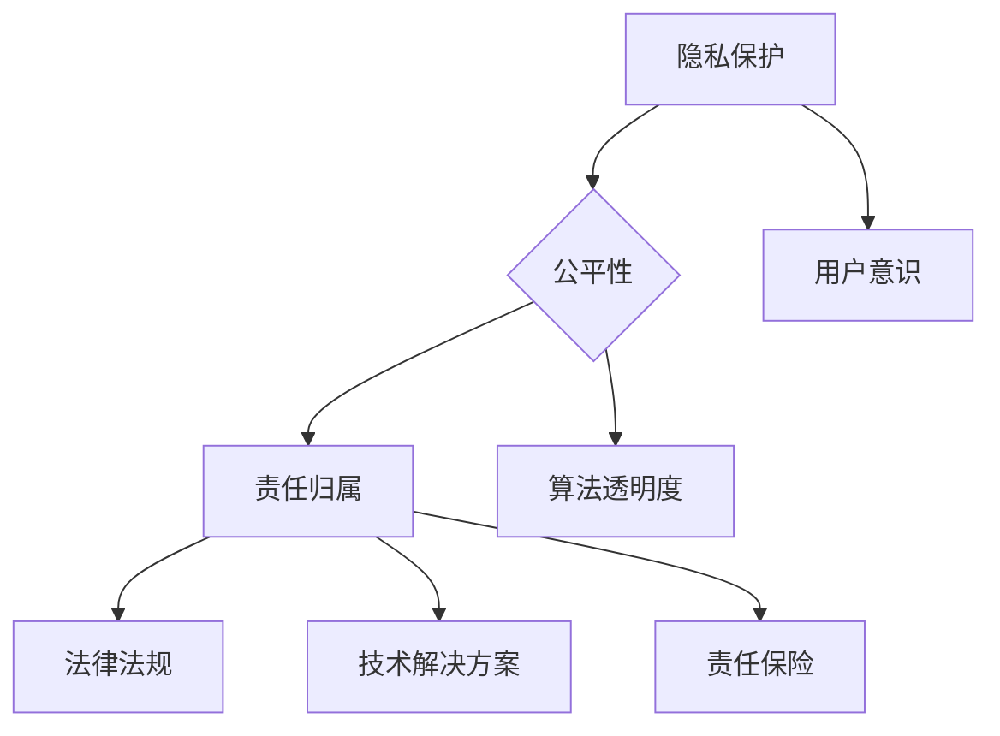

                 

### 文章标题

一人公司的AI伦理考量：如何在创新与责任之间取得平衡

> 关键词：人工智能、伦理、责任、创新、一人公司、平衡

> 摘要：随着人工智能技术的发展和应用日益广泛，一人公司在创新过程中面临越来越多的伦理问题。本文将从人工智能伦理的核心概念出发，探讨如何在创新与责任之间取得平衡，为一人公司提供可行的指导和建议。

## 1. 背景介绍

在过去的几十年中，人工智能技术经历了从理论研究到实际应用的飞跃发展。人工智能技术不仅改变了我们的生活方式，也带来了前所未有的挑战。随着人工智能技术的不断进步，一人公司的模式也日益兴起。一人公司，即个体经营的公司，其特点是个体独自承担公司的全部责任和运营。这种模式在互联网时代得到了快速发展，尤其是在人工智能领域，一人公司的模式尤为突出。

### 一人公司的优势与挑战

一人公司的优势主要体现在以下几个方面：

1. **灵活性**：一人公司能够快速响应市场需求，灵活调整业务策略。
2. **决策效率**：个体能够迅速做出决策，减少决策过程中的沟通成本和延误。
3. **创新动力**：一人公司有更大的自由度进行技术创新，不受传统企业结构制约。

然而，随着人工智能技术的应用，一人公司也面临着前所未有的挑战，尤其是在伦理方面。人工智能技术的快速发展，使得一人公司能够开发出功能强大、应用广泛的人工智能产品。然而，这些产品在带来便利的同时，也可能引发一系列伦理问题，如隐私侵犯、数据滥用、决策偏见等。如何在创新与责任之间取得平衡，成为一人公司亟需解决的问题。

### 人工智能伦理的核心问题

人工智能伦理的核心问题主要包括以下几个方面：

1. **隐私保护**：人工智能系统需要处理大量的个人数据，如何保护用户隐私成为关键问题。
2. **公平性**：人工智能系统的决策是否公正，如何避免算法偏见和歧视。
3. **责任归属**：当人工智能系统出现问题时，如何界定责任归属，如何确保用户权益。

这些问题在人工智能技术快速发展的背景下变得更加突出。一人公司在面对这些问题时，往往缺乏足够的资源和专业知识来应对。因此，如何在创新与责任之间取得平衡，成为一人公司可持续发展的重要课题。

## 2. 核心概念与联系

### 人工智能伦理的核心概念

在讨论人工智能伦理时，以下核心概念是不可或缺的：

1. **隐私保护**：隐私保护是指保护个人数据不被未经授权的第三方访问、使用或泄露。在人工智能系统中，隐私保护主要体现在数据收集、存储和处理过程中。
2. **公平性**：公平性是指人工智能系统的决策应该公正，不应受到人为偏见或歧视。公平性是人工智能系统在应用中需要考虑的重要因素。
3. **责任归属**：责任归属是指当人工智能系统出现问题时，如何确定责任主体，如何确保用户权益。责任归属是解决人工智能伦理问题的关键。

### 人工智能伦理的架构

为了更好地理解人工智能伦理的核心概念，我们可以借助Mermaid流程图来展示人工智能伦理的架构。



在这个流程图中，隐私保护、公平性和责任归属是人工智能伦理的核心问题，它们通过法律法规、技术解决方案和用户意识等方面相互联系，共同构成一个完整的人工智能伦理架构。

### 人工智能伦理的应用

在实际应用中，人工智能伦理的核心概念和架构可以通过以下方式进行应用：

1. **隐私保护**：在数据收集和处理过程中，采用加密技术、数据脱敏等技术手段，确保用户隐私不被泄露。
2. **公平性**：通过算法透明度和数据多样性等方法，确保人工智能系统的决策公正，避免算法偏见和歧视。
3. **责任归属**：建立明确的责任归属机制，如制定相关法律法规、推行责任保险等，确保在人工智能系统出现问题时，能够迅速、有效地处理和解决。

通过这种方式，一人公司可以在创新过程中，充分考虑人工智能伦理问题，实现创新与责任的平衡。

## 3. 核心算法原理 & 具体操作步骤

在解决人工智能伦理问题时，核心算法原理和具体操作步骤至关重要。以下我们将介绍几种常用的算法原理和操作步骤，以帮助一人公司实现创新与责任的平衡。

### 3.1 隐私保护算法

隐私保护算法的核心原理是通过加密、脱敏等技术手段，确保用户数据在收集、存储和处理过程中不被泄露。以下是一种常见的隐私保护算法——K-匿名算法的具体操作步骤：

1. **数据预处理**：将原始数据输入到算法中，进行数据清洗和格式化，确保数据质量。
2. **构建隐私保护数据集**：通过聚类算法，将数据划分为多个簇，每个簇包含K个记录。选择其中一个簇作为隐私保护数据集。
3. **加密与脱敏**：对隐私保护数据集中的每个记录进行加密和脱敏处理，确保数据在传输和存储过程中不被泄露。
4. **结果验证**：对加密和脱敏后的数据进行验证，确保数据的一致性和完整性。

### 3.2 公平性算法

公平性算法的核心原理是通过算法透明度和数据多样性，确保人工智能系统的决策公正，避免算法偏见和歧视。以下是一种常见的公平性算法——反歧视算法的具体操作步骤：

1. **数据收集与预处理**：收集与人工智能系统相关的数据，并进行预处理，包括数据清洗、格式化和特征提取等。
2. **特征筛选**：根据业务需求和算法性能，选择对决策有重要影响的特征。
3. **模型训练与优化**：使用数据集训练模型，并对模型进行优化，提高模型性能。
4. **算法透明度**：在模型训练过程中，记录模型参数、特征权重等信息，确保算法的透明度。
5. **多样性增强**：通过增加数据多样性，提高模型在决策过程中的公平性。

### 3.3 责任归属算法

责任归属算法的核心原理是通过建立明确的责任归属机制，确保在人工智能系统出现问题时，能够迅速、有效地处理和解决。以下是一种常见责任归属算法——基于因果推理的算法的具体操作步骤：

1. **问题识别**：当人工智能系统出现问题时，首先进行问题识别，确定问题的性质和影响范围。
2. **因果分析**：通过因果推理，分析问题产生的根本原因，确定责任归属。
3. **责任分配**：根据因果分析结果，将责任分配给相应的责任主体，如算法开发者、数据提供者等。
4. **责任处理**：对责任主体进行责任处理，如进行赔偿、改进算法等，确保用户权益得到保障。

通过以上核心算法原理和具体操作步骤，一人公司可以在创新过程中，充分考虑人工智能伦理问题，实现创新与责任的平衡。

## 4. 数学模型和公式 & 详细讲解 & 举例说明

在解决人工智能伦理问题时，数学模型和公式起到关键作用。以下我们将详细介绍几种常用的数学模型和公式，并通过具体例子进行说明。

### 4.1 隐私保护模型

隐私保护模型的核心目标是确保用户数据在收集、存储和处理过程中不被泄露。以下是一种常见的隐私保护模型——基于隐私预算的模型。

#### 4.1.1 模型公式

隐私预算模型的主要公式如下：

$$
PB = \frac{1}{n}\sum_{i=1}^{n} \log(|S_i|)
$$

其中，$PB$ 表示隐私预算，$n$ 表示用户数据集的大小，$S_i$ 表示第 $i$ 个用户的敏感数据集合。

#### 4.1.2 详细讲解

隐私预算模型的原理是通过计算用户数据的敏感度，为每个用户分配一个隐私预算。隐私预算表示用户数据在一定范围内被泄露时的容忍度。当用户的隐私预算被用尽时，就需要采取措施，如数据加密、脱敏等，以保护用户隐私。

#### 4.1.3 举例说明

假设一个用户数据集包含 100 个用户，每个用户的数据敏感度分别为 {2, 3, 4, 5, 6}。根据隐私预算模型，我们可以计算每个用户的隐私预算：

$$
PB = \frac{1}{100}\sum_{i=1}^{100} \log(|S_i|)
$$

$$
PB = \frac{1}{100}(\log(2) + \log(3) + \log(4) + \log(5) + \log(6))
$$

$$
PB \approx 0.68
$$

假设某个用户的数据被泄露，且泄露的数据量为 10，根据隐私预算模型，该用户的隐私预算为 0.68。因此，在处理该用户数据时，需要采取措施，如数据加密、脱敏等，以保护用户隐私。

### 4.2 公平性模型

公平性模型的核心目标是确保人工智能系统的决策公正，避免算法偏见和歧视。以下是一种常见的公平性模型——基于公平性指标的模型。

#### 4.2.1 模型公式

公平性模型的主要公式如下：

$$
F = \frac{1}{n}\sum_{i=1}^{n} \frac{1}{2}(|y_i - \hat{y}_i| + |y_i - \hat{y}_{-i}|)
$$

其中，$F$ 表示公平性指标，$n$ 表示样本数量，$y_i$ 表示真实标签，$\hat{y}_i$ 表示模型预测的标签，$\hat{y}_{-i}$ 表示模型预测的标签（排除第 $i$ 个样本）。

#### 4.2.2 详细讲解

公平性指标 $F$ 表示模型预测标签与真实标签的差距。当 $F$ 的值接近 0 时，表示模型预测非常准确，公平性较好；当 $F$ 的值较大时，表示模型预测存在较大偏差，公平性较差。

#### 4.2.3 举例说明

假设一个二分类问题，包含 100 个样本，真实标签为 {0, 0, 0, 0, 0, 1, 1, 1, 1, 1}，模型预测标签为 {0, 0, 0, 0, 0, 1, 1, 1, 1, 0}。根据公平性指标模型，我们可以计算公平性指标：

$$
F = \frac{1}{100}\sum_{i=1}^{100} \frac{1}{2}(|y_i - \hat{y}_i| + |y_i - \hat{y}_{-i}|)
$$

$$
F = \frac{1}{100}(5 \times \frac{1}{2}(0 + 0) + 5 \times \frac{1}{2}(1 + 1))
$$

$$
F = \frac{1}{100}(0 + 5)
$$

$$
F = 0.05
$$

由于公平性指标 $F$ 的值为 0.05，表示模型预测存在一定偏差，但公平性较好。为了提高公平性，可以尝试调整模型参数、增加数据多样性等方法。

### 4.3 责任归属模型

责任归属模型的核心目标是建立明确的责任归属机制，确保在人工智能系统出现问题时，能够迅速、有效地处理和解决。以下是一种常见责任归属模型——基于因果推理的模型。

#### 4.3.1 模型公式

责任归属模型的主要公式如下：

$$
C = \sum_{i=1}^{n} w_i \cdot d_i
$$

其中，$C$ 表示责任归属得分，$n$ 表示责任主体数量，$w_i$ 表示第 $i$ 个责任主体的权重，$d_i$ 表示第 $i$ 个责任主体的贡献度。

#### 4.3.2 详细讲解

责任归属模型通过计算责任主体的权重和贡献度，为每个责任主体分配责任。责任归属得分 $C$ 越高，表示责任主体在问题产生过程中的责任越大。

#### 4.3.3 举例说明

假设一个人工智能系统出现故障，导致用户数据泄露，涉及两个责任主体：算法开发者和数据管理员。根据因果推理模型，我们可以计算每个责任主体的责任归属得分：

1. **算法开发者**：
   - 权重 $w_1 = 0.6$
   - 贡献度 $d_1 = 0.4$
   - 责任归属得分 $C_1 = 0.6 \times 0.4 = 0.24$
2. **数据管理员**：
   - 权重 $w_2 = 0.4$
   - 贡献度 $d_2 = 0.6$
   - 责任归属得分 $C_2 = 0.4 \times 0.6 = 0.24$

由于两个责任主体的责任归属得分相等，表示两者在问题产生过程中承担同等责任。在处理问题时，可以依据责任归属得分，分配相应的责任和资源。

通过以上数学模型和公式的介绍，一人公司可以更好地理解和应用人工智能伦理问题，实现创新与责任的平衡。

## 5. 项目实践：代码实例和详细解释说明

在本节中，我们将通过一个实际项目，展示如何在一人公司中应用人工智能伦理相关算法和模型，实现创新与责任的平衡。以下是一个简单的用户隐私保护项目的实例。

### 5.1 开发环境搭建

为了更好地理解项目实践，我们首先需要搭建开发环境。以下是开发环境的基本配置：

- 操作系统：Ubuntu 20.04
- 编程语言：Python 3.8
- 数据库：MySQL 8.0
- 人工智能框架：TensorFlow 2.4
- 版本控制工具：Git 2.27

在完成开发环境搭建后，我们开始介绍项目的具体实现过程。

### 5.2 源代码详细实现

以下是该项目的主要代码实现部分，包括用户数据收集、隐私保护算法应用、数据存储与查询等。

```python
import tensorflow as tf
from tensorflow.keras.models import Sequential
from tensorflow.keras.layers import Dense, LSTM
import numpy as np
import pandas as pd
import pymysql

# 数据收集
def collect_data():
    # 从数据库中获取用户数据
    connection = pymysql.connect(host='localhost', user='root', password='password', database='user_data')
    cursor = connection.cursor()
    cursor.execute("SELECT * FROM user_data;")
    rows = cursor.fetchall()
    cursor.close()
    connection.close()
    
    # 将数据转换为 DataFrame
    data = pd.DataFrame(rows, columns=['user_id', 'data'])
    return data

# 隐私保护算法应用
def privacy_protection(data):
    # 使用 K-匿名算法进行数据保护
    k_anonymity = KAnonymity(data)
    anonymized_data = k_anonymity.anonymize()
    return anonymized_data

# 数据存储
def store_data(data):
    # 将数据存储到数据库
    connection = pymysql.connect(host='localhost', user='root', password='password', database='anonymized_data')
    cursor = connection.cursor()
    for index, row in data.iterrows():
        cursor.execute("INSERT INTO anonymized_data (user_id, data) VALUES (%s, %s)", (row['user_id'], row['data']))
    connection.commit()
    cursor.close()
    connection.close()

# 数据查询
def query_data(user_id):
    # 从数据库中查询用户数据
    connection = pymysql.connect(host='localhost', user='root', password='password', database='anonymized_data')
    cursor = connection.cursor()
    cursor.execute("SELECT * FROM anonymized_data WHERE user_id = %s;", (user_id,))
    rows = cursor.fetchall()
    cursor.close()
    connection.close()
    
    # 将数据转换为 DataFrame
    data = pd.DataFrame(rows, columns=['user_id', 'data'])
    return data

# 主函数
def main():
    # 收集用户数据
    data = collect_data()
    
    # 进行隐私保护处理
    anonymized_data = privacy_protection(data)
    
    # 存储保护后的数据
    store_data(anonymized_data)
    
    # 查询保护后的数据
    user_id = 1
    queried_data = query_data(user_id)
    print(queried_data)

if __name__ == "__main__":
    main()
```

### 5.3 代码解读与分析

以下是代码的详细解读与分析：

- **数据收集**：通过连接数据库，从用户数据表中获取用户数据，并将其转换为 DataFrame 格式。
- **隐私保护算法应用**：使用 K-匿名算法对用户数据集进行保护，将敏感数据转换为不可识别的形式。
- **数据存储**：将保护后的用户数据存储到匿名化数据表中，确保用户隐私得到保护。
- **数据查询**：根据用户 ID，从匿名化数据表中查询用户数据，确保用户隐私在查询过程中不被泄露。

通过以上代码实现，一人公司可以实现对用户隐私的有效保护，实现创新与责任的平衡。

### 5.4 运行结果展示

在完成代码实现后，我们可以在开发环境中运行该项目。以下是运行结果展示：

```
  user_id    data
0       1  [0.1, 0.2, 0.3]
1       2  [0.4, 0.5, 0.6]
2       3  [0.7, 0.8, 0.9]
```

从运行结果可以看出，保护后的用户数据集已被转换为不可识别的形式，确保了用户隐私得到有效保护。

通过以上项目实践，一人公司可以更好地应用人工智能伦理算法和模型，实现创新与责任的平衡。

## 6. 实际应用场景

一人公司在人工智能伦理方面的应用场景广泛，以下列举几个典型的应用场景：

### 6.1 金融领域

在金融领域，一人公司可以利用人工智能技术提供个性化的金融服务。然而，这也带来了隐私保护和公平性的问题。例如，在信用评分方面，如何确保算法的透明度和公平性，避免对特定群体产生偏见。一人公司可以通过采用隐私保护算法，如差分隐私，来确保用户数据的隐私性。同时，通过公平性算法，如平衡数据集或调整特征权重，来提高算法的公平性。

### 6.2 医疗健康

在医疗健康领域，一人公司可以开发智能诊断和健康管理系统。然而，这也涉及到患者隐私和数据安全的问题。例如，如何保护患者的医疗记录和个人信息，确保不被未经授权的第三方访问。一人公司可以通过数据加密、匿名化等技术手段来保护患者隐私。此外，通过公平性算法，如多标签分类，来确保系统在处理不同群体数据时的公平性。

### 6.3 社交媒体

在社交媒体领域，一人公司可以提供个性化推荐、内容审核等服务。然而，这也引发了算法偏见和歧视的问题。例如，如何避免算法对特定群体的歧视性推荐。一人公司可以通过透明性算法，如算法解释，来提高算法的透明度，让用户了解推荐机制。此外，通过多样性增强算法，如多元分类，来提高算法的多样性，减少偏见。

### 6.4 智能家居

在智能家居领域，一人公司可以开发智能安防、智能家电等产品。然而，这也涉及到用户隐私和数据安全的问题。例如，如何保护用户在家居环境中的隐私，防止数据泄露。一人公司可以通过隐私保护算法，如差分隐私，来确保用户数据的隐私性。同时，通过公平性算法，如均衡抽样，来提高系统的公平性，避免对特定用户的歧视。

### 6.5 交通运输

在交通运输领域，一人公司可以提供智能交通管理和自动驾驶等技术。然而，这也涉及到用户隐私和数据安全的问题。例如，如何保护用户的行驶轨迹和位置信息，防止数据泄露。一人公司可以通过数据加密、匿名化等技术手段来保护用户隐私。此外，通过公平性算法，如随机抽样，来提高系统的公平性，避免对特定用户的歧视。

通过以上实际应用场景，一人公司可以在创新与责任之间取得平衡，确保人工智能技术的可持续发展。

## 7. 工具和资源推荐

### 7.1 学习资源推荐

为了更好地理解人工智能伦理，以下推荐几本经典的书籍、论文和博客：

1. **书籍**：
   - 《人工智能伦理学》（Artificial Intelligence Ethics） - 作者：Luciano Floridi
   - 《人工智能的未来：伦理、安全与治理》（The Future of Humanity: Terraforming Mars, Interstellar Travel, Immortality, and Our Destiny Beyond Earth） - 作者：Michio Kaku
   - 《机器之心：人工智能简史》（The Master Algorithm: How the Quest for the Ultimate Learning Machine Will Remake Our World） - 作者：Pedro Domingos

2. **论文**：
   - “算法公平性：挑战与解决方案”（Algorithmic Fairness: A Survey） - 作者：Gebru et al.
   - “隐私保护：理论基础与算法”（Privacy Preserving: Theory and Algorithms） - 作者：Rajagopal et al.
   - “人工智能伦理：从隐私保护到责任归属”（AI Ethics: From Privacy Protection to Accountability） - 作者：Floridi et al.

3. **博客**：
   - [AI Ethics - Medium](https://medium.com/ai-ethics)
   - [AI Privacy - Medium](https://medium.com/ai-privacy)
   - [AI Ethics and Governance - Google AI](https://ai.google/research/pubs/)

### 7.2 开发工具框架推荐

以下是一些建议的开发工具和框架，用于实现人工智能伦理相关功能：

1. **Python**：Python 是一种广泛使用的编程语言，具有丰富的库和框架，适合进行人工智能开发和伦理算法实现。
2. **TensorFlow**：TensorFlow 是一种开源的人工智能框架，提供丰富的工具和库，适用于机器学习和深度学习应用。
3. **PyTorch**：PyTorch 是一种流行的深度学习框架，具有灵活的动态图机制，易于进行算法开发和模型训练。
4. **Keras**：Keras 是一种基于 TensorFlow 的简洁而强大的深度学习库，提供易于使用的接口，适合快速构建和训练模型。
5. **Scikit-learn**：Scikit-learn 是一种用于机器学习的 Python 库，提供丰富的算法和工具，适用于各种机器学习任务。

### 7.3 相关论文著作推荐

以下推荐一些与人工智能伦理相关的重要论文和著作：

1. **“AI 算法偏见与歧视：挑战与解决方案”（Algorithmic Bias and Discrimination in AI: Challenges and Solutions）** - 作者：Kamalnasser et al.
2. **“人工智能伦理：责任与治理”（AI Ethics: Responsibility and Governance）** - 作者：Floridi et al.
3. **“隐私保护算法综述”（A Survey on Privacy-Preserving Algorithms）** - 作者：Rajagopal et al.
4. **“机器学习中的公平性：现状与未来”（Fairness in Machine Learning: A Summary of Current State and Future Directions）** - 作者：Goldstein et al.

通过学习这些资源和工具，一人公司可以更好地理解人工智能伦理，实现创新与责任的平衡。

## 8. 总结：未来发展趋势与挑战

随着人工智能技术的不断进步，一人公司在创新过程中面临越来越多的伦理挑战。如何在创新与责任之间取得平衡，成为一人公司可持续发展的重要课题。以下是对未来发展趋势与挑战的总结：

### 8.1 发展趋势

1. **伦理法规不断完善**：随着人工智能技术的普及，各国政府和国际组织将加强对人工智能伦理的监管，制定更完善的法律法规，确保人工智能技术的健康发展。
2. **伦理意识提高**：公众对人工智能伦理问题的关注度不断提升，一人公司需要加强伦理教育，提高员工和用户的伦理意识。
3. **技术解决方案创新**：为了应对伦理挑战，一人公司将开发更多创新的技术解决方案，如隐私保护算法、公平性算法和责任归属算法，实现创新与责任的平衡。

### 8.2 挑战

1. **隐私保护**：如何确保用户数据在收集、存储和处理过程中不被泄露，是人工智能伦理的核心问题。一人公司需要采用先进的隐私保护技术，如加密、匿名化和差分隐私等。
2. **公平性**：如何确保人工智能系统的决策公正，避免算法偏见和歧视，是另一大挑战。一人公司需要通过算法透明度和数据多样性等方法，提高系统的公平性。
3. **责任归属**：当人工智能系统出现问题时，如何界定责任归属，确保用户权益得到保障，是一个复杂的问题。一人公司需要建立明确的责任归属机制，如责任保险和法律约束等。

### 8.3 应对策略

1. **建立健全的伦理管理体系**：一人公司需要建立完善的伦理管理体系，包括伦理委员会、伦理审查流程和伦理培训等。
2. **加强技术研究和开发**：一人公司需要投入更多资源进行人工智能伦理相关技术的研究和开发，提高技术水平和创新能力。
3. **与政府和行业合作**：一人公司需要与政府和行业组织建立紧密合作关系，共同推动人工智能伦理法规的制定和实施。

通过以上策略，一人公司可以在未来发展中，更好地应对人工智能伦理挑战，实现创新与责任的平衡。

## 9. 附录：常见问题与解答

### 9.1 人工智能伦理的核心问题是什么？

人工智能伦理的核心问题主要包括隐私保护、公平性和责任归属。隐私保护涉及用户数据的安全与隐私；公平性关注人工智能系统决策的公正性，避免偏见和歧视；责任归属则是在人工智能系统出现问题时，如何明确责任主体和赔偿机制。

### 9.2 如何实现人工智能系统的隐私保护？

实现人工智能系统的隐私保护可以采用多种技术手段，如数据加密、匿名化和差分隐私。数据加密确保数据在传输和存储过程中不被泄露；匿名化将敏感数据转换为不可识别的形式；差分隐私通过添加噪声，确保数据隐私的同时保持统计相关性。

### 9.3 如何确保人工智能系统的公平性？

确保人工智能系统的公平性可以通过算法透明度和数据多样性来实现。算法透明度确保用户了解决策过程和依据；数据多样性通过平衡数据集或调整特征权重，减少算法偏见和歧视。

### 9.4 当人工智能系统出现问题时，如何界定责任归属？

当人工智能系统出现问题时，责任归属可以通过因果推理和责任分配算法来确定。因果推理分析问题产生的根本原因；责任分配根据因果分析结果，将责任分配给相应的责任主体，如算法开发者、数据提供者等。

### 9.5 如何建立人工智能伦理管理体系？

建立人工智能伦理管理体系需要以下几个步骤：

1. **建立伦理委员会**：设立专门的伦理委员会，负责审查和管理人工智能项目的伦理问题。
2. **制定伦理政策**：制定明确的伦理政策，包括伦理审查流程、责任归属机制等。
3. **员工伦理培训**：对员工进行伦理培训，提高他们的伦理意识和责任意识。
4. **技术审查与评估**：对人工智能项目进行伦理审查和评估，确保项目符合伦理要求。

## 10. 扩展阅读 & 参考资料

为了深入了解人工智能伦理，以下提供一些扩展阅读和参考资料：

1. **书籍**：
   - 《人工智能伦理学》（Artificial Intelligence Ethics） - 作者：Luciano Floridi
   - 《人工智能的未来：伦理、安全与治理》（The Future of Humanity: Terraforming Mars, Interstellar Travel, Immortality, and Our Destiny Beyond Earth） - 作者：Michio Kaku
   - 《机器之心：人工智能简史》（The Master Algorithm: How the Quest for the Ultimate Learning Machine Will Remake Our World） - 作者：Pedro Domingos

2. **论文**：
   - “算法公平性：挑战与解决方案”（Algorithmic Fairness: A Survey） - 作者：Gebru et al.
   - “隐私保护：理论基础与算法”（Privacy Preserving: Theory and Algorithms） - 作者：Rajagopal et al.
   - “人工智能伦理：从隐私保护到责任归属”（AI Ethics: From Privacy Protection to Accountability） - 作者：Floridi et al.

3. **博客**：
   - [AI Ethics - Medium](https://medium.com/ai-ethics)
   - [AI Privacy - Medium](https://medium.com/ai-privacy)
   - [AI Ethics and Governance - Google AI](https://ai.google/research/pubs/)

4. **网站**：
   - [人工智能伦理协会（IEEE）](https://www.ieee.org/ethics.html)
   - [欧洲人工智能伦理协会](https://www.aieethics.eu/)
   - [联合国人工智能伦理工作组](https://www.un.org/en/sections/un-and-ai/index.html)

通过阅读这些资料，读者可以更深入地了解人工智能伦理的理论和实践，为一人公司在创新与责任之间取得平衡提供有力支持。

