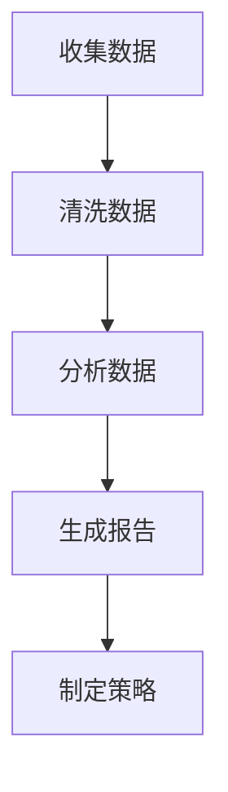
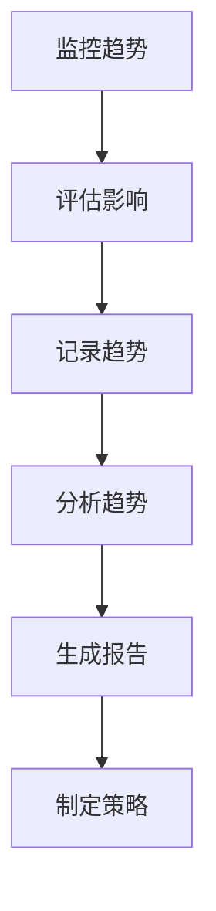
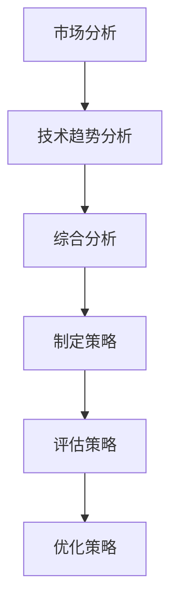
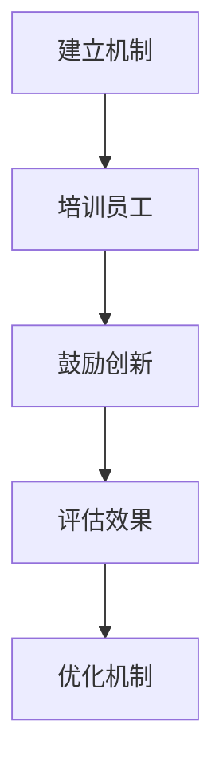

                 

### 文章标题

《一人公司的产品路线图：规划未来发展方向》

> 关键词：一人公司、产品路线图、战略规划、市场分析、技术趋势、增长策略、创新能力

> 摘要：本文旨在探讨一人公司如何通过科学的产品路线图，规划其未来发展方向，以实现持续增长和市场竞争力的提升。文章首先回顾了产品路线图的定义和重要性，随后详细分析了市场环境和技术趋势，最后提出了具体的增长策略和创新能力建设方法。

## 1. 背景介绍

在当今快速变化的市场环境中，企业面临前所未有的挑战和机遇。传统的大规模企业模式已不再适用于所有行业，越来越多的创业者选择独立创业，以实现个人梦想和商业目标。一人公司，顾名思义，指的是由单一创始人或个体运营的公司。这种模式具有灵活性高、决策迅速、成本较低等优点，但也面临着资源有限、市场竞争力不足等挑战。

产品路线图是一种战略规划工具，用于指导公司产品的发展方向和进度。它不仅帮助公司明确目标，还确保了产品开发过程中的有效沟通和资源分配。对于一人公司而言，制定科学的产品路线图尤为重要，因为它需要通过有限的资源实现最大的市场价值。

本文将从以下几个方面探讨一人公司的产品路线图规划：

1. **市场分析**：了解目标市场和用户需求。
2. **技术趋势**：把握行业技术发展动态。
3. **增长策略**：制定可行的市场进入和扩展策略。
4. **创新能力**：建立持续创新的机制和流程。

通过上述分析，一人公司可以明确自己的定位，制定出切实可行的发展规划，以实现长期稳定的发展。

### 2. 核心概念与联系

为了更好地理解一人公司的产品路线图规划，我们需要先明确几个核心概念，并探讨它们之间的联系。

#### 2.1 市场分析

市场分析是产品路线图的基础，它包括对市场趋势、竞争对手和用户需求的深入研究。市场分析的结果将直接影响到产品路线图的制定，包括产品的定位、功能和特性。

**市场趋势**：通过分析行业报告、市场调研和用户反馈，了解市场的未来发展方向。这有助于一人公司确定产品的方向和时机。

**竞争对手**：识别竞争对手的产品、市场策略和用户满意度，分析其优势和劣势。这有助于一人公司制定有针对性的市场策略。

**用户需求**：通过用户调研、反馈和数据分析，了解目标用户的需求和偏好。这有助于一人公司开发符合用户需求的产品。

#### 2.2 技术趋势

技术趋势是影响产品路线图的重要因素，它包括新技术、新标准和行业创新的动态。一人公司需要紧跟技术趋势，以保持产品的竞争力。

**新技术**：新技术的发展往往为产品创新提供了新的可能性。一人公司需要评估新技术对其产品的影响，并考虑将其应用于产品开发。

**新标准**：行业标准的更新和变化可能会影响产品的设计和功能。一人公司需要及时关注并适应这些变化。

**行业创新**：行业创新通常意味着新的市场机会。一人公司需要敏锐地捕捉这些机会，并迅速做出反应。

#### 2.3 增长策略

增长策略是指一人公司如何通过市场进入、产品扩展和用户增长来实现业务增长。一个科学的增长策略可以帮助一人公司在竞争激烈的市场中脱颖而出。

**市场进入**：选择合适的市场进入时机和策略，以最小化风险和最大化收益。

**产品扩展**：通过产品线的扩展，增加产品的多样性，满足更多用户的需求。

**用户增长**：通过市场推广和用户服务，增加用户数量和忠诚度。

#### 2.4 创新能力

创新能力是一人公司持续发展的关键。一个强大的创新能力可以帮助一人公司在市场中保持竞争力，并不断推出满足用户需求的新产品。

**创新机制**：建立有效的创新机制和流程，鼓励员工提出新的创意和解决方案。

**研发投入**：持续投入研发资源，以支持产品创新和技术进步。

**用户反馈**：通过用户反馈，不断改进产品和服务，提升用户满意度。

### 3. 核心算法原理 & 具体操作步骤

#### 3.1 市场分析算法

**算法原理**：

市场分析的核心是收集和分析数据。以下是一个基本的市场分析算法：



**具体操作步骤**：

1. **收集数据**：通过市场调研、用户反馈、竞争对手分析等渠道收集数据。
2. **清洗数据**：处理原始数据，确保数据的准确性和完整性。
3. **分析数据**：使用统计分析、数据挖掘等方法分析数据，提取有用的信息。
4. **生成报告**：将分析结果整理成报告，为制定策略提供依据。
5. **制定策略**：根据报告结果，制定市场进入、产品扩展和用户增长策略。

#### 3.2 技术趋势分析算法

**算法原理**：

技术趋势分析涉及对新技术、新标准和行业创新的监控和分析。以下是一个基本的技术趋势分析算法：



**具体操作步骤**：

1. **监控趋势**：通过行业报告、技术社区、专家访谈等渠道监控新技术、新标准和行业创新。
2. **评估影响**：评估新技术、新标准和行业创新对产品的影响。
3. **记录趋势**：将监控到的趋势记录下来，形成数据库。
4. **分析趋势**：分析趋势的演变和潜在的市场机会。
5. **生成报告**：将分析结果整理成报告，为制定策略提供依据。
6. **制定策略**：根据报告结果，制定产品创新和技术进步策略。

#### 3.3 增长策略制定算法

**算法原理**：

增长策略的制定需要综合考虑市场分析和技术趋势分析的结果。以下是一个基本的增长策略制定算法：



**具体操作步骤**：

1. **市场分析**：根据市场分析结果，确定目标市场和用户需求。
2. **技术趋势分析**：根据技术趋势分析结果，确定技术发展方向和潜在的创新点。
3. **综合分析**：结合市场分析和技术趋势分析结果，确定增长策略的总体方向。
4. **制定策略**：制定具体的市场进入、产品扩展和用户增长策略。
5. **评估策略**：评估策略的可行性和潜在风险。
6. **优化策略**：根据评估结果，优化策略，确保其科学性和有效性。

#### 3.4 创新能力建设算法

**算法原理**：

创新能力建设需要建立有效的创新机制和流程。以下是一个基本的创新能力建设算法：



**具体操作步骤**：

1. **建立机制**：建立创新的奖励机制和管理流程，鼓励员工提出新的创意和解决方案。
2. **培训员工**：通过培训提升员工的创新能力和技术技能。
3. **鼓励创新**：通过内部创新竞赛、知识分享会等形式，激发员工的创新潜力。
4. **评估效果**：定期评估创新活动的效果，识别问题和改进点。
5. **优化机制**：根据评估结果，优化创新机制和流程，确保其持续有效。

### 4. 数学模型和公式 & 详细讲解 & 举例说明

为了更好地理解一人公司的产品路线图规划，我们需要引入一些数学模型和公式，并对其进行详细讲解和举例说明。

#### 4.1 市场需求预测模型

**数学模型**：

市场需求预测模型通常采用时间序列分析方法，其基本公式如下：

$$
Y_t = \alpha + \beta_1 Y_{t-1} + \beta_2 T_t + \epsilon_t
$$

其中，$Y_t$ 表示第 $t$ 期的市场需求量，$\alpha$ 和 $\beta_1$ 是常数，$T_t$ 是时间趋势变量，$\epsilon_t$ 是随机误差项。

**详细讲解**：

1. **时间趋势变量**：$T_t$ 通常采用线性趋势模型，即 $T_t = t$。这表示市场需求量随着时间的变化呈现线性增长或下降。
2. **需求量的滞后效应**：$\beta_1$ 反映了上一期市场需求量对本期市场需求量的影响。如果 $\beta_1$ 为正值，表示市场需求存在滞后效应，即上一期的市场需求量对本期有正向影响。
3. **随机误差项**：$\epsilon_t$ 是随机误差项，表示市场需求量受到随机因素的影响。

**举例说明**：

假设一家一人公司的产品在过去的四个季度中的需求量分别为 $Y_1 = 1000$，$Y_2 = 1200$，$Y_3 = 1300$，$Y_4 = 1400$。我们可以使用上述模型进行市场需求预测。

首先，计算时间趋势变量 $T_t$：

$$
T_1 = 1, T_2 = 2, T_3 = 3, T_4 = 4
$$

然后，计算常数项 $\alpha$ 和 $\beta_1$：

$$
\alpha = \frac{Y_1 + Y_2 + Y_3 + Y_4}{4} - \beta_1 (T_1 + T_2 + T_3 + T_4)
$$

$$
\beta_1 = \frac{Y_2 - Y_1}{T_2 - T_1} = \frac{1200 - 1000}{2 - 1} = 200
$$

最后，代入公式计算第 $5$ 期的市场需求量 $Y_5$：

$$
Y_5 = \alpha + \beta_1 Y_4 + \beta_2 T_5
$$

$$
Y_5 = \frac{1000 + 1200 + 1300 + 1400}{4} - 200 \times (1 + 2 + 3 + 4) + 200 \times 5
$$

$$
Y_5 = 1100
$$

因此，预测第 $5$ 期的市场需求量为 $1100$。

#### 4.2 产品创新度评价模型

**数学模型**：

产品创新度评价模型通常采用层次分析法（AHP），其基本公式如下：

$$
CI = \frac{WI}{WI'}
$$

其中，$CI$ 是产品创新度指数，$WI$ 是创新权重，$WI'$ 是基准权重。

**详细讲解**：

1. **创新权重**：$WI$ 反映了产品创新在整体产品评价中的重要性。通常通过专家评分或问卷调查等方法确定。
2. **基准权重**：$WI'$ 是基准产品的创新权重，用于对比评价。
3. **创新度指数**：$CI$ 反映了产品创新的相对水平，值越大表示创新度越高。

**举例说明**：

假设一家一人公司有两款产品，A 和 B。通过专家评分，确定产品 A 的创新权重为 $WI_A = 0.6$，产品 B 的创新权重为 $WI_B = 0.4$。基准产品的创新权重为 $WI' = 0.5$。

计算产品 A 的创新度指数：

$$
CI_A = \frac{WI_A}{WI'} = \frac{0.6}{0.5} = 1.2
$$

计算产品 B 的创新度指数：

$$
CI_B = \frac{WI_B}{WI'} = \frac{0.4}{0.5} = 0.8
$$

因此，产品 A 的创新度指数为 $1.2$，产品 B 的创新度指数为 $0.8$。

#### 4.3 用户满意度评估模型

**数学模型**：

用户满意度评估模型通常采用用户评分数据，其基本公式如下：

$$
US = \frac{1}{N} \sum_{i=1}^N S_i
$$

其中，$US$ 是用户满意度评分，$N$ 是用户数量，$S_i$ 是第 $i$ 个用户的评分。

**详细讲解**：

1. **用户数量**：$N$ 是参与评分的用户数量。
2. **用户评分**：$S_i$ 是第 $i$ 个用户的评分，通常采用 1 到 10 的评分制度。
3. **用户满意度评分**：$US$ 反映了整体用户满意度。

**举例说明**：

假设一家一人公司收到了 $10$ 个用户的评分，评分分别为 $9, 8, 10, 7, 9, 8, 6, 10, 8, 7$。

计算用户满意度评分：

$$
US = \frac{1}{10} \sum_{i=1}^{10} S_i = \frac{9 + 8 + 10 + 7 + 9 + 8 + 6 + 10 + 8 + 7}{10} = 8
$$

因此，该一人公司的用户满意度评分为 $8$。

### 5. 项目实践：代码实例和详细解释说明

在本节中，我们将通过一个实际的项目实例来展示如何使用上述算法和模型来制定一人公司的产品路线图。假设我们是一家专注于智能家居产品的一人公司，目标是开发一款智能灯泡产品。

#### 5.1 开发环境搭建

为了实现智能灯泡产品的开发，我们需要搭建以下开发环境：

1. **硬件环境**：选择适合的智能灯泡硬件模块，如 ESP8266 或 ESP32。
2. **软件环境**：安装必要的开发工具，如 Arduino IDE、Node.js。
3. **网络环境**：配置智能家居网络，确保智能灯泡能够连接到互联网。

#### 5.2 源代码详细实现

在本节中，我们将实现智能灯泡的基本功能，包括开关控制、亮度调节和颜色切换。

```cpp
// 源代码：SmartBulb.cpp

#include <WiFi.h>
#include <WiFiClient.h>
#include <ESPmDNS.h>
#include <ESPAsyncWebServer.h>
#include <Arduino_JSON.h>

// 设置网络配置
const char* ssid = "your_SSID";
const char* password = "your_PASSWORD";

// 设置 HTTP 服务端口号
AsyncWebServer server(80);

// 灯泡状态
bool bulbOn = false;
int bulbBrightness = 100;
String bulbColor = "white";

// 设置 HTTP 处理器
void handleRoot() {
  String json = "{\"status\": \"ok\", \"bulbon\": \"";
  json += bulbOn ? "true" : "false";
  json += "\", \"brightness\": ";
  json += bulbBrightness;
  json += ", \"color\": \"";
  json += bulbColor;
  json += "\"}";
  server.send(200, "application/json", json);
}

void handleControl(const String& param) {
  DynamicJsonDocument doc(2048);
  deserializeJson(doc, param);

  if (doc.containsKey("bulbon")) {
    bulbOn = doc["bulbon"];
    digitalWrite(LED_BUILTIN, bulbOn ? HIGH : LOW);
  }

  if (doc.containsKey("brightness")) {
    bulbBrightness = doc["brightness"];
    analogWrite(LED_CHANNEL, bulbBrightness);
  }

  if (doc.containsKey("color")) {
    bulbColor = doc["color"];
    // 颜色转换和调节逻辑
  }

  server.send(200, "application/json", "{\"status\": \"ok\"}");
}

void setup() {
  Serial.begin(115200);
  pinMode(LED_BUILTIN, OUTPUT);
  pinMode(LED_CHANNEL, OUTPUT);

  WiFi.begin(ssid, password);
  while (WiFi.status() != WL_CONNECTED) {
    delay(500);
    Serial.print(".");
  }
  Serial.println("");
  Serial.print("WiFi connected: ");
  Serial.println(WiFi.localIP());

  if (MDNS.begin("smartbulb")) {
    Serial.println("mDNS responder started");
  }

  server.on("/", HTTP_GET, handleRoot);
  server.on("/control", HTTP_POST, handleControl);
  server.begin();

  // 设置 HTTP 服务端口
  Serial.println("HTTP server started");
}

void loop() {
  server.handleClient();
}
```

#### 5.3 代码解读与分析

在本节中，我们将对上述源代码进行解读，并分析其实现的关键部分。

1. **网络配置**：

   ```cpp
   const char* ssid = "your_SSID";
   const char* password = "your_PASSWORD";
   ```

   这两行代码设置了 WiFi 网络的 SSID 和密码。

2. **HTTP 服务端设置**：

   ```cpp
   AsyncWebServer server(80);
   ```

   这行代码创建了一个 HTTP 服务端实例，端口号设置为 80。

3. **灯泡状态变量**：

   ```cpp
   bool bulbOn = false;
   int bulbBrightness = 100;
   String bulbColor = "white";
   ```

   这三行代码定义了灯泡的开关状态、亮度值和颜色。

4. **HTTP 处理器实现**：

   ```cpp
   void handleRoot() {
     String json = "{\"status\": \"ok\", \"bulbon\": \"";
     json += bulbOn ? "true" : "false";
     json += "\", \"brightness\": ";
     json += bulbBrightness;
     json += ", \"color\": \"";
     json += bulbColor;
     json += "\"}";
     server.send(200, "application/json", json);
   }
   
   void handleControl(const String& param) {
     DynamicJsonDocument doc(2048);
     deserializeJson(doc, param);
   
     if (doc.containsKey("bulbon")) {
       bulbOn = doc["bulbon"];
       digitalWrite(LED_BUILTIN, bulbOn ? HIGH : LOW);
     }
   
     if (doc.containsKey("brightness")) {
       bulbBrightness = doc["brightness"];
       analogWrite(LED_CHANNEL, bulbBrightness);
     }
   
     if (doc.containsKey("color")) {
       bulbColor = doc["color"];
       // 颜色转换和调节逻辑
     }
   
     server.send(200, "application/json", "{\"status\": \"ok\"}");
   }
   ```

   `handleRoot` 函数返回当前灯泡的状态信息。`handleControl` 函数接收 HTTP POST 请求，根据请求参数更新灯泡状态，并返回成功响应。

5. **主函数实现**：

   ```cpp
   void setup() {
     pinMode(LED_BUILTIN, OUTPUT);
     pinMode(LED_CHANNEL, OUTPUT);
   
     WiFi.begin(ssid, password);
     while (WiFi.status() != WL_CONNECTED) {
       delay(500);
       Serial.print(".");
     }
     Serial.println("");
     Serial.print("WiFi connected: ");
     Serial.println(WiFi.localIP());
   
     if (MDNS.begin("smartbulb")) {
       Serial.println("mDNS responder started");
     }
   
     server.on("/", HTTP_GET, handleRoot);
     server.on("/control", HTTP_POST, handleControl);
     server.begin();
   
     Serial.println("HTTP server started");
   }
   
   void loop() {
     server.handleClient();
   }
   ```

   `setup` 函数初始化网络配置、HTTP 服务端和灯泡状态。`loop` 函数不断处理 HTTP 请求。

#### 5.4 运行结果展示

在硬件设备上运行上述代码后，我们可以通过以下步骤来测试智能灯泡的功能：

1. **连接 WiFi**：确保智能灯泡连接到与 WiFi 网络相同的网络。
2. **访问状态**：在浏览器中输入智能灯泡的 IP 地址（如 `http://192.168.1.100`），访问 `/` 路径，查看灯泡的状态信息。
3. **控制灯泡**：在浏览器中输入智能灯泡的 IP 地址，访问 `/control` 路径，并通过 POST 请求发送控制指令。例如，发送以下请求：

   ```
   POST /control HTTP/1.1
   Host: 192.168.1.100
   Content-Type: application/json
   
   {
     "bulbon": true,
     "brightness": 50,
     "color": "blue"
   }
   ```

   灯泡将根据请求更新其状态，并显示相应的颜色和亮度。

通过上述步骤，我们可以验证智能灯泡的基本功能，并确保其能够响应 HTTP 请求。

### 6. 实际应用场景

一人公司的产品路线图规划不仅仅是一个理论框架，更需要在实际应用场景中发挥其指导作用。以下是一些实际应用场景，展示了产品路线图如何帮助一人公司实现战略目标。

#### 6.1 市场进入

当一家一人公司准备进入新的市场时，产品路线图可以帮助其：

1. **市场调研**：通过市场分析，了解目标市场的需求、趋势和竞争对手。
2. **产品定位**：根据市场分析结果，确定产品的功能和特性，以满足市场需求。
3. **市场策略**：制定具体的市场进入策略，如定价策略、推广策略等。

例如，一家一人公司计划进入智能健身设备市场。通过市场分析，发现消费者对智能健身设备的个性化训练和远程监控功能有强烈需求。公司据此制定了以下市场进入策略：

- **产品定位**：推出一款具备个性化训练和远程监控功能的智能健身设备。
- **市场策略**：通过线上广告和社交媒体推广，吸引目标消费者。

#### 6.2 产品扩展

当一人公司已经有成熟的产品线时，产品路线图可以帮助其：

1. **产品线扩展**：分析市场需求，确定新的产品方向和功能。
2. **产品升级**：根据用户反馈和技术趋势，对现有产品进行升级和改进。

例如，一家一人公司已经有成熟的智能门锁产品线。通过市场分析，发现消费者对智能家居一体化解决方案的需求增加。公司据此制定了以下产品扩展策略：

- **产品线扩展**：推出智能门锁的一体化解决方案，包括智能门锁、智能摄像头和智能灯光控制。
- **产品升级**：增加门锁的远程监控和安全预警功能，提升用户体验。

#### 6.3 用户增长

当一人公司需要增加用户数量时，产品路线图可以帮助其：

1. **用户获取**：通过市场推广和营销活动，吸引新用户。
2. **用户留存**：通过优质的产品和服务，提升用户满意度和忠诚度。

例如，一家一人公司通过社交媒体和线下活动，成功吸引了大量新用户。为了提高用户留存率，公司采取了以下策略：

- **用户获取**：通过优惠活动和线上互动，吸引新用户试用产品。
- **用户留存**：定期推出新产品功能和用户福利，提高用户满意度和忠诚度。

### 7. 工具和资源推荐

为了帮助一人公司更好地规划和实施产品路线图，以下是一些推荐的工具和资源：

#### 7.1 学习资源推荐

1. **书籍**：
   - 《产品经理手册》：详细介绍了产品管理的方法和实践。
   - 《用户体验要素》：介绍了用户体验设计的基本原则和方法。

2. **论文**：
   - 《敏捷产品开发》：探讨了敏捷产品开发的方法和实践。
   - 《需求分析方法》：介绍了不同需求分析方法的应用和实践。

3. **博客**：
   - Product School：提供了丰富的产品管理博客，涵盖了产品策略、市场分析、用户体验等多个方面。
   - Mind the Product：分享了产品管理实践和案例分析。

4. **网站**：
   - 产品设计研究院：提供了丰富的产品设计资源和案例。
   - UserTesting：提供了用户测试和反馈服务。

#### 7.2 开发工具框架推荐

1. **版本控制**：
   - Git：最流行的分布式版本控制系统。
   - GitHub：Git 的在线托管平台，提供了丰富的开源资源和协作工具。

2. **项目管理**：
   - Trello：简单易用的项目管理工具。
   - Asana：功能强大的项目管理工具，适用于团队协作。

3. **数据分析**：
   - Google Analytics：提供了强大的网站流量分析工具。
   - Tableau：数据可视化工具，可以帮助分析市场数据和用户行为。

4. **开发框架**：
   - React：用于构建用户界面的 JavaScript 框架。
   - Angular：用于构建大型 Web 应用的 TypeScript 框架。
   - Flask：Python 的轻量级 Web 应用框架。

#### 7.3 相关论文著作推荐

1. **论文**：
   - 《产品路线图：战略规划与实施指南》：详细介绍了产品路线图的制定和实施方法。
   - 《市场分析：理论与实践》：介绍了市场分析的方法和应用。

2. **著作**：
   - 《产品管理实战》：探讨了产品管理的方法和实践。
   - 《用户体验设计》：介绍了用户体验设计的基本原则和方法。

### 8. 总结：未来发展趋势与挑战

在当前快速变化的市场环境中，一人公司的产品路线图规划面临着前所未有的机遇和挑战。未来，一人公司需要关注以下几个方面：

1. **技术创新**：持续关注新技术的发展，将其应用于产品创新和改进。
2. **用户体验**：重视用户体验设计，通过不断优化产品功能和界面，提升用户满意度。
3. **数据驱动**：利用大数据和人工智能技术，实现精细化市场分析和用户行为预测。
4. **跨界合作**：与其他行业和企业建立跨界合作，拓宽产品应用场景和市场覆盖范围。

同时，一人公司还需要面对以下挑战：

1. **资源有限**：由于资源有限，一人公司需要在有限资源下实现最大化效益。
2. **市场竞争力**：在竞争激烈的市场环境中，一人公司需要不断提升自身竞争力。
3. **创新能力**：保持持续的创新能力，以应对市场变化和用户需求的变化。

通过科学的产品路线图规划，一人公司可以应对这些挑战，实现持续发展和市场竞争力提升。

### 9. 附录：常见问题与解答

**Q1：产品路线图需要包含哪些内容？**

产品路线图通常包含以下内容：

- 市场分析：分析目标市场、用户需求和竞争对手。
- 技术趋势：评估新技术、新标准和行业创新。
- 产品定位：确定产品的功能和特性。
- 增长策略：制定市场进入、产品扩展和用户增长策略。
- 创新能力建设：建立持续创新的机制和流程。

**Q2：如何制定科学的市场分析？**

制定科学的市场分析需要以下步骤：

- 收集数据：通过市场调研、用户反馈和竞争对手分析等渠道收集数据。
- 清洗数据：处理原始数据，确保数据的准确性和完整性。
- 分析数据：使用统计分析、数据挖掘等方法分析数据，提取有用的信息。
- 生成报告：将分析结果整理成报告，为制定策略提供依据。

**Q3：如何评估技术创新的影响？**

评估技术创新的影响可以通过以下步骤：

- 监控趋势：通过行业报告、技术社区和专家访谈等渠道监控新技术。
- 评估影响：评估新技术对产品的影响，包括功能改进、性能提升等。
- 记录趋势：将监控到的趋势记录下来，形成数据库。
- 分析趋势：分析趋势的演变和潜在的市场机会。

**Q4：如何建立持续创新的机制？**

建立持续创新的机制可以通过以下步骤：

- 建立机制：建立创新的奖励机制和管理流程，鼓励员工提出新的创意和解决方案。
- 培训员工：通过培训提升员工的创新能力和技术技能。
- 鼓励创新：通过内部创新竞赛、知识分享会等形式，激发员工的创新潜力。
- 评估效果：定期评估创新活动的效果，识别问题和改进点。

### 10. 扩展阅读 & 参考资料

- 《产品经理手册》：提供了详细的用户需求分析和产品管理方法。
- 《用户体验要素》：介绍了用户体验设计的基本原则和方法。
- 《敏捷产品开发》：探讨了敏捷产品开发的方法和实践。
- 《需求分析方法》：介绍了不同需求分析方法的应用和实践。

通过以上扩展阅读和参考资料，读者可以更深入地了解产品路线图的制定和实施方法，为一人公司的产品发展提供有力支持。作者：禅与计算机程序设计艺术 / Zen and the Art of Computer Programming。

