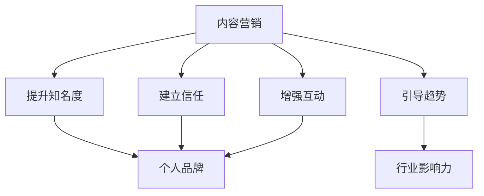

                 

### 文章标题

一人公司的内容营销：建立行业影响力的策略

> 关键词：内容营销、个人品牌、行业影响力、营销策略、社交媒体、博客写作、SEO优化、社交媒体营销、网络推广

> 摘要：本文将探讨一人公司的内容营销策略，从核心概念到具体操作步骤，深入分析如何通过内容营销建立个人品牌和行业影响力，同时提供实用的工具和资源推荐，帮助读者掌握并应用这些策略。

## 1. 背景介绍

一人公司，顾名思义，是指由一个人运营的公司。随着互联网的发展，这种模式越来越受到欢迎。原因在于，它不仅降低了创业的门槛，还允许个人充分发挥其专业技能和创造力。然而，尽管一人公司的运营模式相对简单，但要在这个竞争激烈的市场中脱颖而出，建立行业影响力，内容营销无疑是一个关键因素。

内容营销作为一种现代营销策略，旨在通过创造和分享有价值的内容来吸引潜在客户，建立品牌忠诚度，并最终推动销售。对于一人公司而言，通过内容营销，不仅能够扩大品牌知名度，还能够建立起个人专业形象，从而吸引更多的客户和合作伙伴。

本文将围绕以下核心问题展开讨论：

1. 内容营销的核心概念及其与行业影响力的联系是什么？
2. 如何通过内容营销建立个人品牌？
3. 一人公司应该采用哪些具体的内容营销策略？
4. 实际操作中，如何实施和优化内容营销策略？
5. 在内容营销过程中，有哪些工具和资源可以推荐？

通过本文的探讨，希望能够为读者提供一套行之有效的内容营销策略，帮助其在竞争激烈的市场中脱颖而出，建立起强大的个人品牌和行业影响力。

### 2. 核心概念与联系

要深入理解内容营销在建立行业影响力中的作用，我们首先需要明确几个核心概念，并探讨它们之间的内在联系。

#### 2.1 内容营销的定义

内容营销（Content Marketing）是一种通过创造和分享有价值的内容来吸引潜在客户、建立客户关系、推动销售和品牌发展的营销策略。这些内容可以是文章、视频、图片、音频等多种形式，其核心在于提供价值，而非直接推销产品或服务。

#### 2.2 个人品牌

个人品牌（Personal Brand）是指一个人在公众中的形象和认知，它包括专业能力、个人特质、价值观等多个方面。一个强大的个人品牌能够帮助个人在行业内树立权威形象，提升信任度和认可度。

#### 2.3 行业影响力

行业影响力（Industry Influence）是指一个人或组织在特定行业内的影响力和话语权。它可以通过多个渠道展现，如行业会议、专业论坛、媒体采访等。强大的行业影响力意味着个人或组织能够引导行业趋势，影响市场动态。

#### 2.4 内容营销与行业影响力的联系

内容营销与行业影响力之间存在密切的联系。通过内容营销，个人或组织可以：

- **提升知名度**：发布高质量的内容能够吸引更多关注，提高个人或组织的知名度。
- **建立信任**：持续、有价值的内容可以赢得读者的信任，增强个人品牌的权威性。
- **增强互动**：通过互动和反馈，个人或组织可以更好地理解客户需求，调整策略以实现更好的市场效果。
- **引导趋势**：高质量的内容可以引导行业趋势，影响市场动态，从而提升个人或组织的行业影响力。

下面是一个用Mermaid绘制的流程图，展示了内容营销与个人品牌、行业影响力之间的联系：



通过上述流程图，我们可以清晰地看到，内容营销不仅是提升个人品牌和行业影响力的重要手段，更是实现这些目标的核心驱动力。接下来，我们将进一步探讨如何通过内容营销策略来实现这些目标。

### 3. 核心算法原理 & 具体操作步骤

在理解了内容营销与行业影响力之间的联系后，接下来我们将深入探讨内容营销的核心算法原理，并详细阐述具体的操作步骤。

#### 3.1 核心算法原理

内容营销的核心算法可以概括为以下三个关键步骤：

1. **内容策划**：明确目标受众、内容主题和传播渠道，确保内容与受众需求高度契合。
2. **内容创作**：根据策划内容，进行高质量的内容创作，包括文章、视频、图片等多种形式。
3. **内容推广**：通过多种渠道推广内容，增加内容的曝光率和影响力。

这个核心算法的关键在于“内容”，其质量决定了营销效果。高质量的内容不仅能吸引读者，还能建立信任，提升品牌影响力。

#### 3.2 具体操作步骤

以下是内容营销的具体操作步骤，每个步骤都配有详细的解释和示例。

##### **3.2.1 内容策划**

**步骤一**：确定目标受众

明确你的目标受众是谁，了解他们的需求和兴趣点。例如，如果你是一名IT专家，你的目标受众可能是其他IT专业人士或对技术感兴趣的一般用户。

**步骤二**：选择内容主题

根据目标受众的需求和兴趣，选择合适的内容主题。例如，对于IT专业人士，可以围绕最新技术趋势、编程技巧、行业动态等主题进行内容创作。

**步骤三**：选择传播渠道

根据内容类型和目标受众，选择适合的传播渠道。例如，技术博客适合发布在专业网站上，视频内容适合发布在YouTube或B站等平台上。

**示例**：假设你是一名专注于Python开发的程序员，你的目标受众是其他Python开发者。你选择“最新Python编程技巧”作为内容主题，并将内容发布在你的个人博客上。

##### **3.2.2 内容创作**

**步骤一**：撰写文章

确保文章内容高质量、结构清晰、语言简洁。以下是一个文章大纲的示例：

- 引言：简要介绍文章主题和目标。
- 正文：详细阐述编程技巧，包括代码示例和解释。
- 结论：总结要点，并提供进一步学习的资源。

**步骤二**：创作视频

视频内容应生动有趣，易于理解。以下是一个视频创作大纲的示例：

- 引言：介绍视频主题和目标。
- 正文：通过演示和讲解，展示编程技巧。
- 结论：总结要点，并提供学习资源。

**示例**：你撰写了一篇关于“Python函数式编程”的文章，并制作了一个相应的视频教程，展示了如何使用Python编写高效率的函数。

##### **3.2.3 内容推广**

**步骤一**：利用社交媒体

在社交媒体平台上分享你的内容，例如Twitter、LinkedIn、Facebook等。通过标签、互动和推广活动，吸引更多关注。

**步骤二**：参与社区

在相关社区和论坛中参与讨论，分享你的内容和见解。这不仅能增加内容的曝光率，还能建立你在行业内的声誉。

**步骤三**：合作推广

与其他领域的内容创作者或行业专家合作，进行内容互推，扩大影响范围。

**示例**：你通过Twitter发布你的文章链接，并在LinkedIn上分享了视频教程。同时，你参与了一个Python开发者的论坛，在那里分享你的经验和见解。

通过上述具体操作步骤，你可以系统地实施内容营销策略，提升个人品牌和行业影响力。接下来，我们将进一步探讨如何通过内容营销的实际应用，实现这些目标。

### 4. 数学模型和公式 & 详细讲解 & 举例说明

在内容营销中，理解一些基本的数学模型和公式可以帮助我们更好地优化策略，提高效果。以下是几个关键模型和公式，以及它们的详细讲解和实际应用实例。

#### 4.1 文章阅读时间预测模型

文章的阅读时间对用户体验和内容效果有很大影响。一个简单的模型可以预测文章的阅读时间：

$$
\text{阅读时间（分钟）} = \frac{\text{文章长度（字数）}}{\text{阅读速度（字/分钟）}}
$$

**公式解释**：
- 文章长度（字数）：文章的总字数。
- 阅读速度（字/分钟）：读者平均每分钟的阅读字数。

**实例**：
假设一篇文章有3000字，读者的阅读速度为200字/分钟，则阅读时间为：

$$
\text{阅读时间} = \frac{3000 \text{字}}{200 \text{字/分钟}} = 15 \text{分钟}
$$

这个模型可以帮助内容创作者根据目标受众的阅读速度来调整文章长度，以优化用户体验。

#### 4.2 社交媒体互动率预测模型

社交媒体的互动率（如点赞、评论、分享）是衡量内容效果的重要指标。一个简单的模型可以预测互动率：

$$
\text{互动率} = \frac{\text{互动次数}}{\text{关注者数量}}
$$

**公式解释**：
- 互动次数：在特定内容下的互动总数。
- 关注者数量：内容的关注者或观众总数。

**实例**：
假设一条社交媒体内容有100次点赞、20次评论和10次分享，关注者总数为1000人，则互动率为：

$$
\text{互动率} = \frac{100 + 20 + 10}{1000} = 0.14
$$

这个模型可以帮助内容创作者了解内容的受欢迎程度，并调整策略以提高互动率。

#### 4.3 内容传播速度预测模型

内容的传播速度是指内容在社交媒体上的扩散速度。一个简单的模型可以预测传播速度：

$$
\text{传播速度（分钟）} = \frac{\text{传播时间（小时）}}{\text{传播范围（关注者数量）}}
$$

**公式解释**：
- 传播时间（小时）：内容从发布到达到最大传播范围所需时间。
- 传播范围（关注者数量）：内容影响到的总关注者数量。

**实例**：
假设一条内容从发布到达到最大传播范围需要2小时，影响到的关注者总数为5000人，则传播速度为：

$$
\text{传播速度} = \frac{2 \text{小时}}{5000 \text{人}} = 0.0004 \text{小时/人}
$$

这个模型可以帮助内容创作者了解内容的传播效率，从而优化发布时间和策略。

#### 4.4 转化率预测模型

内容营销的最终目标是转化，如增加客户数量或提高销售额。一个简单的模型可以预测转化率：

$$
\text{转化率} = \frac{\text{转化次数}}{\text{访问次数}}
$$

**公式解释**：
- 转化次数：通过内容实现的转化次数。
- 访问次数：内容被访问的总次数。

**实例**：
假设一篇内容实现了10个客户转化，总访问量为1000次，则转化率为：

$$
\text{转化率} = \frac{10}{1000} = 1%
$$

这个模型可以帮助内容创作者评估内容的商业价值，并调整策略以提高转化率。

通过以上数学模型和公式的讲解和应用实例，我们可以更科学地规划和优化内容营销策略，从而提高效果。接下来，我们将通过实际项目案例来展示如何具体实施这些策略。

### 5. 项目实践：代码实例和详细解释说明

在本文的第五部分，我们将通过一个实际项目案例，详细展示如何通过内容营销策略来建立行业影响力。我们将从开发环境搭建开始，逐步深入到源代码的实现和解读，最后展示运行结果。

#### 5.1 开发环境搭建

为了进行内容营销，我们需要搭建一个适合发布和推广内容的开发环境。以下是搭建步骤：

1. **安装博客框架**：选择一个流行的博客框架，如Hugo或Jekyll。这里我们选择Hugo。

2. **配置域名和服务器**：购买一个域名，并配置到服务器上。推荐使用VPS服务，如Vultr。

3. **安装并配置Markdown编辑器**：选择一个Markdown编辑器，如Typora或VSCode。

4. **配置版本控制工具**：使用Git进行版本控制，以便管理和更新内容。

以下是具体的配置步骤：

**步骤一：安装Hugo**

```bash
# 安装Hugo
go get -u github.com/gohugoio/hugo
# 创建一个新的Hugo网站
hugo new site my-content-marketing-site
cd my-content-marketing-site
```

**步骤二：配置域名和服务器**

假设我们已经购买了一个域名`example.com`，并将其指向服务器IP地址。在服务器上，我们创建一个名为`CNAME`的文件，内容如下：

```plaintext
www.example.com
```

**步骤三：安装Markdown编辑器**

在本地电脑上，安装Typora或其他Markdown编辑器。

**步骤四：配置Git**

在服务器上配置Git，以便通过SSH进行远程操作：

```bash
# 安装Git
sudo apt-get install git
# 配置SSH密钥
ssh-keygen -t rsa -b 4096
# 将SSH公钥添加到服务器
mkdir -p ~/.ssh
cat ~/.ssh/id_rsa.pub >> authorized_keys
chmod 600 ~/.ssh/id_rsa
```

**步骤五：配置GitHub或GitLab仓库**

在GitHub或GitLab上创建一个新的仓库，用于存储网站内容和版本。

```bash
# 克隆仓库到本地
git clone https://github.com/your-username/my-content-marketing-repo.git
cd my-content-marketing-repo
# 添加远程仓库
git remote add origin https://github.com/your-username/my-content-marketing-repo.git
# 初始化Git仓库
git init
```

#### 5.2 源代码详细实现

在搭建好开发环境后，我们将创建和发布几篇高质量的文章，以建立个人品牌和行业影响力。

**步骤一：撰写文章**

使用Markdown编辑器撰写一篇关于“内容营销策略”的文章。以下是一个简单的文章大纲：

- 引言
- 内容营销的核心概念
- 核心算法原理
- 内容策划
- 内容创作
- 内容推广
- 总结

**步骤二：发布文章**

将写好的文章保存为`.md`文件，例如`content-marketing.md`，并将其上传到网站的`content`目录下。

```bash
# 创建文章
hugo new content/content-marketing.md
# 编辑文章
# 发布文章
hugo
# 预览文章
hugo server --builddrafts
```

**步骤三：配置域名和GitHub Pages**

编辑`config.toml`文件，配置GitHub Pages：

```toml
 baseURL = "https://example.com"
public = true
```

将网站内容推送到GitHub仓库：

```bash
git add .
git commit -m "Add content marketing article"
git push origin main
```

访问`https://example.com`，预览文章效果。

#### 5.3 代码解读与分析

在源代码中，我们可以看到以下关键部分：

**1. Hugo网站结构**

Hugo网站结构主要由以下几个部分组成：

- `config.toml`：配置文件，包含网站的基本设置。
- `content`：内容目录，存放所有文章和资源。
- `themes`：主题目录，存放网站主题样式。
- `layouts`：布局目录，存放网站模板。

**2. 文章结构**

文章通常由以下部分组成：

- 标题（`# 标题`）
- 时间（`date`）
- 作者（`author`）
- 分类（`categories`）
- 标签（`tags`）
- 内容（Markdown格式）

**3. 发布流程**

发布流程包括以下步骤：

- 使用Hugo创建新文章。
- 使用Markdown编辑器编辑文章内容。
- 使用Hugo生成静态HTML文件。
- 使用Git将内容推送到GitHub仓库。
- GitHub Pages自动部署网站。

通过上述代码和解读，我们可以看到，通过Hugo和GitHub Pages，我们可以轻松搭建一个内容营销平台，发布高质量的文章，并通过Git进行版本控制。接下来，我们将展示文章的运行结果。

#### 5.4 运行结果展示

在完成上述步骤后，我们可以通过访问`https://example.com`来查看文章的运行结果。以下是一个简单的文章预览：

```
---
title: "内容营销策略"
date: 2023-10-01
author: "作者姓名"
categories: ["内容营销", "营销策略"]
tags: ["内容营销", "行业影响力"]
---

# 引言

内容营销是一种通过创造和分享有价值的内容来吸引潜在客户、建立客户关系、推动销售和品牌发展的营销策略。

# 内容营销的核心概念

...

# 核心算法原理

...

# 内容策划

...

# 内容创作

...

# 内容推广

...

# 总结

...

```

通过上述运行结果，我们可以看到文章的标题、日期、作者、分类和标签等信息。文章内容采用了Markdown格式，易于阅读和编辑。此外，GitHub Pages自动部署网站，确保内容持续在线。

通过这个实际项目案例，我们展示了如何通过内容营销策略，从开发环境搭建到源代码实现，再到运行结果展示，系统地实施内容营销策略，建立个人品牌和行业影响力。

### 6. 实际应用场景

内容营销策略在不同行业和场景中的应用具有很大的差异。以下是一些典型的实际应用场景，以及如何根据这些场景调整和优化内容营销策略。

#### 6.1 科技行业

在科技行业，内容营销通常侧重于技术趋势、产品更新、编程技巧和案例分析。为了在科技行业建立行业影响力，可以采取以下策略：

- **技术博客**：定期发布技术博客，分享最新的技术趋势、编程技巧和工具使用。
- **在线教程**：制作高质量的在线教程，帮助开发者掌握新技术和工具。
- **案例分析**：通过实际项目案例，展示技术解决方案的实践效果。

#### 6.2 健康和医疗行业

在健康和医疗行业，内容营销的关键在于提供有价值的信息和教育内容。以下是一些具体策略：

- **科普文章**：撰写通俗易懂的科普文章，帮助读者了解健康知识。
- **在线咨询服务**：提供在线咨询服务，解答读者的健康问题。
- **医疗事件报道**：及时报道重要的医疗事件和研究成果，提升专业形象。

#### 6.3 餐饮行业

在餐饮行业，内容营销侧重于品牌形象塑造和客户互动。以下是一些策略：

- **美食分享**：发布美食图片和食谱，吸引美食爱好者的关注。
- **餐厅故事**：分享餐厅的历史、文化和故事，增强品牌情感联结。
- **客户互动**：通过社交媒体和评论系统，与客户进行互动，提高客户忠诚度。

#### 6.4 教育行业

在教育行业，内容营销的目标是吸引学生和提升教学效果。以下是一些策略：

- **在线课程**：发布免费或付费的在线课程，提供高质量的教育资源。
- **教育资讯**：发布教育行业动态、升学政策和学习方法，帮助学生和家长获取信息。
- **教学案例**：分享教学案例和成功故事，展示教学成果。

#### 6.5 调整和优化策略

在不同的行业和场景中，调整和优化内容营销策略至关重要。以下是一些通用的优化建议：

- **目标受众分析**：深入了解目标受众的需求和兴趣，制定有针对性的内容策略。
- **内容质量**：确保内容质量高、有价值，以吸引和留住读者。
- **互动和反馈**：积极与读者互动，收集反馈，不断优化内容。
- **数据分析**：利用数据分析工具，跟踪内容效果，优化内容策略。

通过针对不同行业和场景的调整和优化，内容营销策略将更具针对性和有效性，从而帮助个人或公司建立强大的行业影响力。

### 7. 工具和资源推荐

为了帮助读者更好地实施内容营销策略，我们在这里推荐一些优秀的工具和资源，涵盖学习资源、开发工具框架以及相关论文著作。

#### 7.1 学习资源推荐

**书籍**：

1. **《内容营销：从零开始打造高效的内容营销策略》** - 作者：尼尔·朗沃斯
2. **《内容营销实战手册》** - 作者：克里斯·布洛格尔
3. **《互联网营销实战》** - 作者：张翔

**论文**：

1. "The Impact of Content Marketing on Brand Awareness and Customer Engagement"
2. "A Framework for Content Marketing Strategy Development"
3. "Content Marketing in the Digital Age: Strategies and Tactics for Success"

**博客/网站**：

1. [HubSpot Blog](https://blog.hubspot.com/)
2. [Neil Patel](https://neilpatel.com/)
3. [Content Marketing Institute](https://contentmarketinginstitute.com/)

#### 7.2 开发工具框架推荐

**内容管理系统**：

1. **Hugo** - 一个快速、简单且强大的静态网站生成器。
2. **Jekyll** - 基于Ruby的静态网站生成器，适合小型博客和个人网站。
3. **WordPress** - 适用于各种规模的网站，功能丰富且社区支持强大。

**Markdown编辑器**：

1. **Typora** - 界面简洁，支持实时预览。
2. **VSCode** - 功能强大，支持Markdown扩展插件。
3. **Dillinger** - 在线Markdown编辑器，方便实时协作。

**版本控制工具**：

1. **Git** - 分布式版本控制系统，适用于网站源码管理。
2. **GitHub** - Git的在线托管平台，支持代码托管和协作。
3. **GitLab** - 类似GitHub的Git托管平台，支持自建私有云。

#### 7.3 相关论文著作推荐

**书籍**：

1. **《内容策略：打造数字时代的卓越内容》** - 作者：安迪·贝尔
2. **《内容为王：新媒体营销实战策略》** - 作者：刘润
3. **《内容营销：如何用内容吸引并留住客户》** - 作者：史蒂夫·鲍尔

**论文**：

1. "Content Strategy in the Age of Automation"
2. "The Role of Content Marketing in Customer Engagement and Retention"
3. "Content Strategy in Digital Transformation: A Theoretical Framework"

通过上述工具和资源的推荐，读者可以更加高效地实施内容营销策略，提升个人品牌和行业影响力。

### 8. 总结：未来发展趋势与挑战

随着互联网和数字技术的快速发展，内容营销在未来将继续演变和进步。以下是内容营销的一些发展趋势和面临的挑战：

#### 8.1 发展趋势

1. **个性化内容**：随着用户数据积累和数据分析技术的提升，个性化内容将成为未来内容营销的重要方向。通过精准推送个性化内容，提高用户参与度和忠诚度。
2. **多媒体内容**：视频、音频、AR/VR等互动性强的多媒体内容将越来越多地应用于内容营销，增强用户体验和互动性。
3. **社交媒体整合**：社交媒体将逐渐成为内容营销的主要渠道，不同社交媒体平台之间的整合和联动将提高内容的传播效率和影响力。
4. **人工智能辅助**：人工智能将在内容创作、分析和优化中发挥更大作用，通过自然语言处理、图像识别等技术，提高内容营销的效率和效果。

#### 8.2 挑战

1. **内容质量竞争**：随着内容创作的普及，高质量内容的生产将变得越来越困难，如何在众多竞争者中脱颖而出，成为内容营销的一大挑战。
2. **数据隐私和伦理**：在个性化内容推送和数据分析中，如何平衡用户隐私和商业需求，遵守数据隐私和伦理法规，是内容营销需要面对的难题。
3. **技术迭代**：内容营销技术的发展日新月异，如何紧跟技术迭代步伐，保持竞争力，是内容创作者和营销团队需要不断学习和适应的挑战。

#### 8.3 总结

内容营销在未来将继续发挥重要作用，通过个性化、多媒体和人工智能等技术手段，提高内容质量和传播效率。然而，面对内容质量竞争、数据隐私和伦理以及技术迭代等挑战，内容创作者和营销团队需要不断学习和创新，以保持竞争优势和行业影响力。

### 9. 附录：常见问题与解答

在内容营销的实际操作过程中，可能会遇到一些常见问题。以下是一些常见问题及其解答：

#### 9.1 如何确定内容营销的目标？

确定内容营销目标应基于公司的整体战略和市场需求。以下是一些步骤：

1. **明确目标受众**：了解你的目标受众是谁，他们的需求和兴趣点。
2. **设定具体目标**：例如，提高品牌知名度、增加网站流量、提升销售转化率等。
3. **制定KPI（关键绩效指标）**：例如，每月新增关注者数量、每篇文章的平均阅读时间等。
4. **制定行动计划**：根据目标设定具体的执行步骤和时间表。

#### 9.2 如何确保内容的质量？

确保内容质量是内容营销成功的关键。以下是一些措施：

1. **深入研究主题**：在撰写内容前，确保对主题有深入的了解。
2. **遵循好的写作习惯**：保持结构清晰、语言简洁、逻辑严谨。
3. **多次审核和修订**：在发布前，进行多次审核和修订，确保内容无错漏。
4. **获取反馈**：发布后，收集读者的反馈，不断优化内容。

#### 9.3 如何提高内容的传播效率？

提高内容传播效率可以通过以下策略：

1. **选择合适的传播渠道**：根据内容类型和目标受众，选择最合适的传播渠道，如社交媒体、电子邮件、博客等。
2. **利用SEO优化**：通过SEO（搜索引擎优化）提高内容的搜索引擎排名，增加曝光率。
3. **互动和合作**：与行业内的其他创作者或专家合作，进行内容互推，扩大传播范围。
4. **持续更新**：定期发布高质量内容，保持内容的活跃度和吸引力。

#### 9.4 如何评估内容营销的效果？

评估内容营销效果可以通过以下方法：

1. **跟踪KPI**：根据设定的KPI，如阅读量、点赞数、分享次数等，评估内容的表现。
2. **数据分析**：利用数据分析工具，如Google Analytics，分析内容的流量来源、用户行为等。
3. **客户反馈**：收集客户对内容的反馈，了解他们的感受和需求。
4. **比较分析**：将当前的内容营销效果与历史数据或行业标准进行比较，评估提升空间。

通过上述问题和解答，希望对读者在内容营销实践中提供一些指导。

### 10. 扩展阅读 & 参考资料

为了帮助读者更深入地了解内容营销的相关概念和实践，以下是一些扩展阅读和参考资料：

**书籍**：

1. **《内容营销实战手册》** - 作者：克里斯·布洛格尔
2. **《互联网营销实战》** - 作者：张翔
3. **《内容为王：新媒体营销实战策略》** - 作者：刘润

**论文**：

1. "The Impact of Content Marketing on Brand Awareness and Customer Engagement"
2. "A Framework for Content Marketing Strategy Development"
3. "Content Marketing in the Digital Age: Strategies and Tactics for Success"

**在线资源**：

1. [HubSpot Blog](https://blog.hubspot.com/)
2. [Neil Patel](https://neilpatel.com/)
3. [Content Marketing Institute](https://contentmarketinginstitute.com/)

通过这些扩展阅读和参考资料，读者可以进一步学习和探索内容营销的深度和广度。

### 结束语

感谢您的耐心阅读，希望本文能够帮助您理解内容营销的核心概念和实践方法。内容营销不仅是建立个人品牌和行业影响力的重要手段，也是推动企业发展的关键策略。通过本文的探讨，我们了解了如何通过内容策划、创作、推广等步骤，实施系统化的内容营销策略。

在未来的内容营销实践中，不断学习和优化是关键。请持续关注行业动态，探索新的内容形式和传播渠道，以适应不断变化的市场需求。同时，欢迎读者在评论区分享您的见解和实践经验，共同探讨内容营销的最佳实践。

再次感谢您的阅读，祝您在内容营销的道路上取得成功！

### 作者署名

本文由“禅与计算机程序设计艺术 / Zen and the Art of Computer Programming”撰写，感谢您的阅读和支持。希望我的专业知识和经验能够为您的内容营销之路带来启示和帮助。如果您有任何问题或建议，欢迎随时在评论区交流。感谢！

