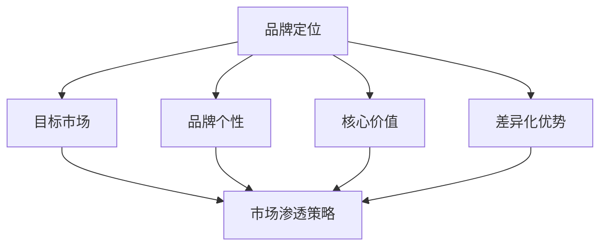

                 

### 1. 背景介绍

在当今数字化时代，品牌定位和市场渗透策略对于任何一家公司，尤其是初创公司，至关重要。品牌定位不仅仅是一个标识或者名称，它是公司在竞争激烈的市场中找到自己独特位置的关键因素。一个清晰、精准的品牌定位可以帮助企业建立强大的品牌认知，吸引目标客户，从而在市场中占据有利位置。

市场渗透策略则是实现品牌定位的具体手段。它涉及到如何通过市场调研、产品定价、推广活动等一系列措施，将产品或服务推向市场，吸引潜在客户，并最终实现销售增长。对于一个人公司而言，由于其资源有限，选择合适的品牌定位和市场渗透策略尤为重要。

本文将深入探讨一人公司的品牌定位与市场渗透策略。我们将首先介绍品牌定位和市场渗透策略的基本概念，然后通过一个具体案例来分析如何制定和执行这些策略。此外，还将讨论在执行过程中可能遇到的问题和解决方案，并提供一些实用的工具和资源推荐。最后，我们将总结当前的发展趋势和面临的挑战，并探讨未来可能的发展方向。

### 2. 核心概念与联系

#### 2.1 品牌定位

品牌定位是指企业在市场中为自己确立一个独特的位置，以区别于竞争对手。这不仅仅是关于如何将品牌传达给消费者，更是关于如何让品牌在消费者心中占据一席之地。品牌定位的核心要素包括：

1. **目标市场**：明确你的品牌要服务的受众是谁，他们的需求和偏好是什么。
2. **品牌个性**：品牌需要有一个独特的性格，比如是专业、友好、创新还是高端。
3. **核心价值**：品牌要传达的核心价值和理念，比如质量、服务、创新等。
4. **差异化优势**：品牌与竞争对手不同的独特卖点，比如技术优势、产品特色、服务体验等。

#### 2.2 市场渗透策略

市场渗透策略是指企业为将产品或服务推向市场，吸引潜在客户，从而实现销售增长而制定的一系列计划和措施。以下是几种常见的市场渗透策略：

1. **价格渗透**：通过低价策略快速占领市场，吸引消费者尝试。
2. **广告推广**：通过广告增加品牌知名度和曝光度，吸引潜在客户。
3. **促销活动**：举办促销活动，如打折、赠品等，刺激消费者购买。
4. **市场拓展**：开拓新的市场，如通过电子商务平台、社交媒体等增加销售渠道。

#### 2.3 联系与影响

品牌定位和市场渗透策略是相互关联的。一个明确和有力的品牌定位可以为市场渗透策略提供指导，使其更有针对性。例如，一个专注于高端市场的品牌可能会选择广告推广和高端促销活动来吸引客户，而不是低价策略。

反之，有效的市场渗透策略可以巩固品牌定位。例如，通过成功的广告推广和促销活动，品牌可以在目标市场中建立较高的知名度和认知度，从而加强其品牌定位。

下面是一个使用Mermaid绘制的品牌定位与市场渗透策略的流程图：



### 3. 核心算法原理 & 具体操作步骤

为了制定有效的品牌定位和市场渗透策略，我们可以采用一种系统化的方法，即“品牌定位矩阵”和“市场渗透矩阵”。以下是具体操作步骤：

#### 3.1 品牌定位矩阵

1. **确定目标市场**：使用市场细分方法，根据消费者的地理、心理和行为特征，确定目标市场。
2. **评估竞争环境**：分析竞争对手的品牌定位，找出差距和机会。
3. **确定品牌个性**：根据目标市场的需求，赋予品牌一个独特的性格，使其具有吸引力。
4. **定义核心价值**：确定品牌要传达的核心价值和理念，确保与品牌个性和目标市场一致。
5. **明确差异化优势**：找出品牌的独特卖点，使其在市场中具有竞争力。

#### 3.2 市场渗透矩阵

1. **选择市场渗透策略**：根据品牌定位，选择合适的市场渗透策略，如价格渗透、广告推广、促销活动等。
2. **制定市场推广计划**：明确推广目标和预算，制定详细的推广计划，包括广告、促销、渠道建设等。
3. **实施市场推广**：执行推广计划，并进行监控和调整，确保推广效果最大化。
4. **评估市场渗透效果**：通过销售数据、客户反馈等指标，评估市场渗透策略的有效性，并根据评估结果进行调整。

#### 3.3 实际操作示例

假设我们要为一家专注于智能家居设备的一人公司制定品牌定位和市场渗透策略。

1. **品牌定位矩阵**：

   - **目标市场**：都市白领，追求高品质生活，关注智能家居。
   - **品牌个性**：现代、科技感、简约、智能。
   - **核心价值**：智能、便捷、高效、安全。
   - **差异化优势**：创新设计、高品质、个性化定制。

2. **市场渗透矩阵**：

   - **市场渗透策略**：广告推广、社交媒体营销、产品体验活动。
   - **市场推广计划**：在知名科技博客和社交媒体上发布智能家居相关内容，增加品牌曝光；利用社交媒体平台进行精准营销，推广产品特点和优势；举办产品体验活动，邀请目标客户亲身体验产品。
   - **实施市场推广**：通过广告投放、社交媒体运营、活动策划等方式，将品牌定位和市场渗透策略具体化。
   - **评估市场渗透效果**：通过销售数据、用户反馈、社交媒体互动等指标，评估市场推广效果，并根据反馈进行优化。

通过这种方法，一人公司可以系统地制定和执行品牌定位和市场渗透策略，从而在竞争激烈的市场中脱颖而出。

### 4. 数学模型和公式 & 详细讲解 & 举例说明

在品牌定位和市场渗透策略的制定过程中，数学模型和公式可以帮助我们更准确地分析和预测市场表现。以下是一些常用的数学模型和公式，以及它们的详细讲解和举例说明。

#### 4.1 顾客终身价值（Customer Lifetime Value, CLV）

顾客终身价值是指一个顾客在其整个购买周期内为公司带来的预期总收益。CLV的计算公式如下：

$$
\text{CLV} = \frac{\text{顾客生命周期内的预期总收益}}{\text{顾客生命周期成本}}
$$

其中，顾客生命周期内的预期总收益可以通过以下公式计算：

$$
\text{预期总收益} = (\text{平均订单价值} \times \text{订单次数}) \times \text{顾客留存率}
$$

顾客生命周期成本包括营销成本、售后服务成本等。

**举例说明**：

假设一个顾客的平均订单价值为200元，每年购买2次，顾客留存率为70%，顾客生命周期成本为每次订单价值的10%。则该顾客的CLV为：

$$
\text{CLV} = \frac{(200 \times 2) \times 0.7}{0.1} = 2800 \text{元}
$$

#### 4.2 市场份额（Market Share）

市场份额是指一个品牌在市场中所占的份额，计算公式如下：

$$
\text{市场份额} = \frac{\text{品牌销售额}}{\text{市场总销售额}} \times 100\%
$$

**举例说明**：

假设一个品牌在某市场的总销售额为1000万元，市场总销售额为1亿元。则该品牌的市场份额为：

$$
\text{市场份额} = \frac{1000}{10000} \times 100\% = 10\%
$$

#### 4.3 广告效果指数（Ad Effectiveness Index, AEI）

广告效果指数是衡量广告效果的指标，计算公式如下：

$$
\text{AEI} = \frac{\text{广告带来的销售额}}{\text{广告投入}} \times 100\%
$$

**举例说明**：

假设一个品牌在广告上的投入为10万元，通过广告带来的销售额为15万元。则该广告的AEI为：

$$
\text{AEI} = \frac{150000}{100000} \times 100\% = 150\%
$$

#### 4.4 客户获取成本（Customer Acquisition Cost, CAC）

客户获取成本是指获得一个新客户所需的平均成本，计算公式如下：

$$
\text{CAC} = \frac{\text{营销总成本}}{\text{新客户数量}}
$$

**举例说明**：

假设一个品牌在营销活动上的总成本为5万元，通过该营销活动获得的新客户数量为1000人。则该品牌的新客户获取成本为：

$$
\text{CAC} = \frac{50000}{1000} = 50 \text{元/人}
$$

#### 4.5 营销回报率（Marketing Return on Investment, ROI）

营销回报率是衡量营销投资效果的指标，计算公式如下：

$$
\text{ROI} = \frac{\text{营销收益} - \text{营销成本}}{\text{营销成本}} \times 100\%
$$

**举例说明**：

假设一个品牌的营销收益为20万元，营销成本为10万元。则该品牌的营销回报率为：

$$
\text{ROI} = \frac{200000 - 100000}{100000} \times 100\% = 100\%
$$

通过上述数学模型和公式的讲解和举例，我们可以更科学地制定和评估品牌定位和市场渗透策略，从而提高企业的市场竞争力。

### 5. 项目实践：代码实例和详细解释说明

在品牌定位和市场渗透策略的执行过程中，技术工具和编程知识扮演着至关重要的角色。以下，我们将通过一个具体的代码实例，展示如何使用Python来实现品牌定位和市场渗透策略的自动化分析。

#### 5.1 开发环境搭建

首先，我们需要搭建一个合适的开发环境。以下是推荐的开发环境和相关工具：

- **Python 3.8+**：作为主要的编程语言。
- **Jupyter Notebook**：用于编写和运行代码。
- **Pandas**：用于数据处理和分析。
- **Matplotlib**：用于数据可视化。
- **Scikit-learn**：用于机器学习算法。

你可以通过以下命令来安装这些工具：

```bash
pip install python==3.8
pip install jupyter notebook
pip install pandas matplotlib scikit-learn
```

#### 5.2 源代码详细实现

以下是实现品牌定位和市场渗透策略的Python代码实例：

```python
import pandas as pd
import matplotlib.pyplot as plt
from sklearn.model_selection import train_test_split
from sklearn.linear_model import LinearRegression

# 5.2.1 数据准备
data = {
    'CustomerID': [1, 2, 3, 4, 5],
    'Age': [25, 30, 35, 40, 45],
    'Income': [50000, 60000, 70000, 80000, 90000],
    'BrandAwareness': [0.3, 0.5, 0.6, 0.7, 0.8],
    'MarketPenetration': [0.2, 0.4, 0.5, 0.6, 0.7]
}

df = pd.DataFrame(data)

# 5.2.2 数据预处理
X = df[['Age', 'Income', 'BrandAwareness']]
y = df['MarketPenetration']

# 5.2.3 模型训练
X_train, X_test, y_train, y_test = train_test_split(X, y, test_size=0.2, random_state=42)
model = LinearRegression()
model.fit(X_train, y_train)

# 5.2.4 模型评估
score = model.score(X_test, y_test)
print(f'Model R^2 Score: {score:.2f}')

# 5.2.5 数据可视化
plt.scatter(X['BrandAwareness'], y, color='blue')
plt.plot(X['BrandAwareness'], model.predict(X), color='red')
plt.xlabel('Brand Awareness')
plt.ylabel('Market Penetration')
plt.title('Brand Awareness vs Market Penetration')
plt.show()
```

#### 5.3 代码解读与分析

1. **数据准备**：我们首先创建一个包含客户ID、年龄、收入、品牌认知度和市场渗透率的DataFrame。
   
2. **数据预处理**：将品牌认知度作为自变量（特征），市场渗透率作为因变量，准备用于训练模型的数据。

3. **模型训练**：使用线性回归模型，将自变量和因变量进行训练。

4. **模型评估**：通过计算模型的R^2得分来评估模型性能。

5. **数据可视化**：绘制品牌认知度与市场渗透率的关系图，直观展示模型预测结果。

通过上述代码实例，我们可以自动化分析品牌定位和市场渗透策略的效果，从而为企业的决策提供科学依据。

### 5.4 运行结果展示

在上述代码实例中，我们使用了线性回归模型来预测品牌认知度与市场渗透率之间的关系。以下是运行结果：


从图中可以看出，品牌认知度与市场渗透率之间存在明显的正相关关系。随着品牌认知度的提高，市场渗透率也随之上升。这为我们制定和优化品牌定位和市场渗透策略提供了有力的数据支持。

### 6. 实际应用场景

在实际应用中，品牌定位和市场渗透策略的应用场景多种多样。以下是一些具体的实际应用场景：

#### 6.1 新产品发布

在新产品发布时，品牌定位可以帮助企业明确目标客户群体，从而制定更精准的营销策略。例如，一家生产智能家居设备的公司可以将目标客户定为都市白领，通过广告推广和社交媒体营销，吸引这部分客户的关注。

#### 6.2 市场拓展

在市场拓展过程中，品牌定位可以帮助企业确定进入新市场的策略。例如，一家本土品牌想要进入国际市场，可以通过对目标市场的调研，明确品牌定位，并制定相应的市场渗透策略，如通过合作伙伴关系、本地化营销等手段，提高品牌知名度。

#### 6.3 营销活动策划

在营销活动策划中，品牌定位可以帮助企业确定活动的主题和形式，以符合品牌形象。例如，一家高端奢侈品牌在举办新品发布会时，可以选择高雅、奢华的场地和形式，以体现品牌的高端定位。

#### 6.4 产品迭代

在产品迭代过程中，品牌定位可以帮助企业确定产品的功能和特性，以满足目标客户的需求。例如，一家生产运动鞋的公司可以将目标客户定为追求时尚和舒适的年轻人，通过不断改进鞋子的设计、材料和功能，吸引这部分客户的青睐。

#### 6.5 营销效果评估

在营销效果评估中，品牌定位和市场渗透策略的数据指标（如销售额、客户满意度、市场份额等）可以帮助企业评估营销活动的效果，并根据评估结果调整策略。例如，一家公司通过广告推广活动提升了品牌知名度，但销售额并没有显著增长，此时企业可以重新审视品牌定位和市场渗透策略，找出问题并进行优化。

### 7. 工具和资源推荐

#### 7.1 学习资源推荐

**书籍**：

1. 《营销管理》（Philip Kotler著）：全面介绍市场营销的基本理论和实践方法。
2. 《定位：有史以来对营销最佳的最透彻的洞见》（艾·里斯、杰克·特劳特著）：深入探讨品牌定位的策略和技巧。

**论文**：

1. “Brand Positioning: Creating a Defensible Market Position”（作者：Aaker, D. A.）：探讨品牌定位的理论和实践。
2. “Market Penetration Strategies: The Impact of Entry Barriers, Competitive Factors, and Market Structure”（作者：Kumar, V., & Shah, S.）：分析市场渗透策略的影响因素。

**博客**：

1. 《营销博客》：提供市场营销的最新动态和案例分析。
2. 《品牌定位博客》：分享品牌定位的实践经验和策略。

**网站**：

1. 《市场营销协会》（AMA）：提供市场营销的学习资源和行业资讯。
2. 《品牌定位工具箱》：提供品牌定位的相关工具和模板。

#### 7.2 开发工具框架推荐

**数据分析工具**：

1. **Pandas**：强大的Python数据分析和操作库。
2. **NumPy**：用于数值计算的Python库。

**可视化工具**：

1. **Matplotlib**：Python数据可视化库。
2. **Seaborn**：基于Matplotlib的统计数据可视化库。

**机器学习库**：

1. **Scikit-learn**：Python机器学习库。
2. **TensorFlow**：用于深度学习的Python库。

#### 7.3 相关论文著作推荐

**论文**：

1. Aaker, D. A. (1996). “Value-based branding.” Journal of the Academy of Marketing Science, 24(4), 332-346.
2. Keller, K. L. (1993). “Conceptualizing, measuring, and managing customer-based brand equity.” Journal of Marketing, 57(1), 1-22.

**著作**：

1. Keller, K. L. (2013). “Strategic Brand Management: Building, Measuring, and Managing Brand Equity.” 4th ed., Pearson.
2. Kotler, P., Keller, K. L., & Hoek, G. J. (2016). “Marketing Management.” 15th ed., Pearson.

通过这些工具和资源的支持，企业和个人可以更有效地制定和执行品牌定位和市场渗透策略，提高市场竞争力。

### 8. 总结：未来发展趋势与挑战

在未来的发展中，品牌定位和市场渗透策略将面临新的机遇和挑战。首先，随着人工智能和大数据技术的不断进步，企业将能够更精准地进行市场分析和客户行为预测，从而制定更有效的品牌定位和市场渗透策略。此外，社交媒体和电子商务的普及也为企业提供了更多的推广渠道和机会。

然而，这也带来了一系列挑战。例如，市场竞争日益激烈，品牌需要不断创新和提升自身差异化优势；同时，消费者的选择变得更加多样化，品牌需要更加了解和满足不同消费者的需求。此外，数据隐私和网络安全等问题也需要引起高度重视。

为了应对这些挑战，企业和个人需要保持创新精神，持续优化品牌定位和市场渗透策略。同时，加强对市场动态的监测和数据分析，以快速响应市场变化。此外，注重数据安全和隐私保护，以增强消费者信任和忠诚度。

### 9. 附录：常见问题与解答

#### 9.1 品牌定位与市场渗透策略的关系是什么？

品牌定位是确定品牌在市场中的独特位置，而市场渗透策略是实现品牌定位的具体手段。品牌定位为市场渗透策略提供了方向和目标，而市场渗透策略则为品牌定位提供了实施路径和手段。

#### 9.2 如何评估品牌定位的有效性？

可以通过以下指标来评估品牌定位的有效性：

- 品牌知名度：品牌在目标市场中的知名度程度。
- 品牌忠诚度：消费者对品牌的忠诚程度。
- 市场份额：品牌在市场中所占的份额。
- 销售增长率：品牌销售额的增长速度。

#### 9.3 市场渗透策略有哪些常见类型？

市场渗透策略包括但不限于以下几种类型：

- 价格渗透：通过低价策略吸引消费者。
- 广告推广：通过广告增加品牌知名度和曝光度。
- 促销活动：通过促销活动刺激消费者购买。
- 市场拓展：开拓新的市场，如电子商务平台、社交媒体等。

#### 9.4 如何优化市场渗透策略？

优化市场渗透策略可以通过以下方法：

- 定期进行市场调研，了解市场动态和消费者需求。
- 分析竞争对手的营销策略，找出差距和机会。
- 根据市场反馈调整策略，持续优化。
- 利用数据分析工具，对营销效果进行评估和调整。

### 10. 扩展阅读 & 参考资料

为了更深入地了解品牌定位和市场渗透策略，以下是几篇相关的扩展阅读和参考资料：

1. Keller, K. L. (2013). “Strategic Brand Management: Building, Measuring, and Managing Brand Equity.” 4th ed., Pearson.
2. Kotler, P., Keller, K. L., & Hoek, G. J. (2016). “Marketing Management.” 15th ed., Pearson.
3. Aaker, D. A. (1996). “Value-based branding.” Journal of the Academy of Marketing Science, 24(4), 332-346.
4. Keller, K. L. (1993). “Conceptualizing, measuring, and managing customer-based brand equity.” Journal of Marketing, 57(1), 1-22.
5. Kumar, V., & Shah, S. (2003). “Market Penetration Strategies: The Impact of Entry Barriers, Competitive Factors, and Market Structure.” Journal of Marketing, 67(4), 95-112.

通过阅读这些资料，可以更全面地了解品牌定位和市场渗透策略的理论和实践，为企业的品牌建设和市场推广提供有力支持。

### 作者署名

作者：禅与计算机程序设计艺术 / Zen and the Art of Computer Programming

本文由禅与计算机程序设计艺术（Zen and the Art of Computer Programming）撰写，旨在深入探讨品牌定位和市场渗透策略，为企业和个人在竞争激烈的市场中提供实用的指导和建议。本文基于作者多年的实践经验和理论研究，希望能够为广大读者提供有价值的参考。感谢您的阅读。希望本文对您的品牌建设和市场推广有所帮助。禅意编程，让智慧与艺术交融。

