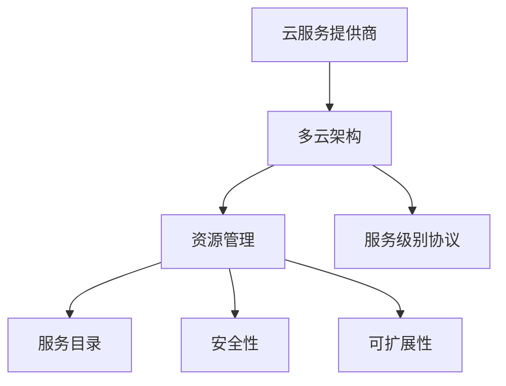

                 

### 背景介绍 Background Introduction

在当今数字化时代，云计算已经成为了现代企业架构设计中的核心组成部分。对于一家仅由一人运营的公司来说，如何有效地管理和优化其多云架构，成为一个至关重要的挑战。这不仅关乎资源利用效率，还影响到系统的可扩展性、可靠性和安全性。

#### 一人公司的现状 One-person Company Landscape

首先，我们来了解一下当前一人公司的运营环境。这种模式的企业往往依赖于远程办公和自动化工具来维持运营。无论是初创公司、自由职业者，还是小型企业主，他们都需要利用云计算服务来处理大量的数据、运行应用程序和存储信息。以下是这种模式下的一些典型特点：

1. **资源有限**：一人公司往往只能承担有限的IT基础设施投资，因此选择云服务作为替代方案就显得尤为重要。
2. **灵活性需求**：灵活的IT架构能够快速适应市场变化，满足业务需求的波动。
3. **成本控制**：成本效益是关键因素，需要精打细算以实现利润最大化。
4. **技术能力集中**：一人公司通常由一个核心成员负责所有的技术决策，这意味着需要具备全面的技术能力。

#### 多云架构的挑战 Challenges of Multi-Cloud Architecture

面对云计算，尤其是多云架构，一人公司面临诸多挑战：

1. **复杂性**：多云环境包含多个云服务提供商（如Amazon Web Services、Microsoft Azure、Google Cloud Platform等），这增加了管理的复杂性。
2. **异构性**：不同的云服务提供商提供不同的服务和技术，使得集成变得更加困难。
3. **成本管理**：需要精确监控和优化资源使用，避免因不合理的资源配置导致的额外开支。
4. **安全性**：多云环境要求更高的安全性，因为不同的云服务提供商可能采用不同的安全标准和措施。

### 文章关键词 Keywords

- 一人公司
- 多云架构
- 云服务提供商
- 资源管理
- 灵活性
- 成本控制
- 安全性

### 文章摘要 Summary

本文将深入探讨一人公司在多云架构管理方面的策略。我们将从背景介绍开始，逐步分析多云架构面临的挑战，并提出一系列解决方案。本文旨在帮助一人公司的运营者构建一个高效、可靠、安全的多云架构，以支持其业务的持续增长。

---

接下来，我们将详细介绍多云架构的核心概念，并解释它们之间如何相互关联。这将为我们提供构建有效管理策略的理论基础。

## 2. 核心概念与联系 Core Concepts and Relationships

在深入探讨多云架构的管理策略之前，了解一些核心概念和它们之间的相互关系是至关重要的。以下是一些关键概念及其关联：

### 云服务提供商 Cloud Service Providers

云服务提供商（CSP）是多云架构的核心。这些提供商包括Amazon Web Services (AWS)、Microsoft Azure、Google Cloud Platform (GCP) 等。每个提供商都提供多种服务，如计算、存储、数据库、网络等。这些服务通常具有不同的价格、性能和功能。了解各个提供商的特点和服务目录，是制定有效管理策略的第一步。

### 多云架构 Multi-Cloud Architecture

多云架构是指在同一时间内，一个企业使用多个云服务提供商的服务。这种模式的优势包括灵活性、冗余性、成本优化等。然而，它也带来了额外的复杂性，如管理、集成和安全问题。有效的多云架构需要清晰的战略规划和持续的管理。

### 资源管理 Resource Management

资源管理是多云架构中一个至关重要的方面。这包括计算资源、存储资源和网络资源。有效的资源管理策略应确保资源的合理分配和优化使用，以降低成本并提高效率。

### 服务目录 Service Catalog

服务目录是云服务提供商提供的一组可用的服务。这些服务可能包括虚拟机、数据库、存储、网络、人工智能等。服务目录的多样性使得企业可以根据需求选择最合适的服务，从而实现最佳的灵活性和性能。

### 安全性 Security

安全性是多云架构的一个关键关注点。由于涉及多个云服务提供商，安全性策略需要跨云服务提供商一致执行。此外，还需要监控和响应潜在的安全威胁，确保数据的安全和合规性。

### 可扩展性 Scalability

可扩展性是多云架构的一个关键优势。企业需要确保其架构能够根据业务需求的变化进行弹性扩展。这通常涉及到自动化和 orchestration 工具的使用，以简化扩展过程。

### 服务级别协议 Service Level Agreements (SLAs)

服务级别协议是云服务提供商与企业之间关于服务质量和性能的合同。这些协议定义了服务的可用性、响应时间和性能指标。对于一人公司，确保满足这些 SLAs 是确保业务连续性的关键。

### Mermaid 流程图（Mermaid Flowchart）

以下是一个简化的多云架构的 Mermaid 流程图，展示了这些核心概念之间的关联。



通过理解这些核心概念和它们之间的联系，我们为构建有效的多云架构管理策略奠定了基础。在下一部分，我们将深入探讨这些概念的具体实现和操作步骤。

---

### 3. 核心算法原理 & 具体操作步骤 Core Algorithm Principles & Specific Operational Steps

在了解了多云架构的核心概念之后，接下来我们需要探讨如何将这些概念应用到实际操作中。核心算法原理为我们提供了构建有效多云架构的方法论，而具体的操作步骤则将这些理论转化为实际可执行的行动。

#### 3.1 资源分配算法 Resource Allocation Algorithm

资源分配是多云架构管理中的关键任务。资源分配算法的目标是确保每个服务都能获得所需的计算、存储和网络资源，同时避免资源浪费。以下是一种简单的资源分配算法：

1. **需求分析**：首先，分析每个服务的资源需求，包括CPU、内存、存储和带宽。
2. **资源评估**：评估现有资源的可用性，包括各个云服务提供商的可用资源。
3. **优先级排序**：根据业务优先级对服务进行排序。例如，关键业务服务应获得更高的优先级。
4. **分配策略**：采用贪心算法或动态分配策略，将资源分配给每个服务。例如，优先分配高优先级服务，然后分配剩余资源。
5. **实时调整**：持续监控资源使用情况，并根据需求变化进行实时调整。

#### 3.2 自动化工具的使用 Automation Tools Utilization

自动化工具在多云架构管理中发挥着重要作用，能够显著降低手动操作的复杂性和错误率。以下是一些常用的自动化工具：

1. **基础设施即代码（Infrastructure as Code, IaC）**：
   - 使用IaC工具（如Terraform、Ansible）来定义和部署云资源。IaC将云资源配置转换为代码，使得资源管理更加灵活和可重复。
   - 例子：使用Terraform创建AWS S3存储桶和EC2实例，并配置它们的网络和安全组。

2. **容器编排工具（Container Orchestration Tools）**：
   - 使用容器编排工具（如Kubernetes、Docker Swarm）来管理容器化应用。这些工具可以自动分配资源、扩展集群和故障恢复。
   - 例子：使用Kubernetes部署一个基于容器的Web应用，并自动扩展实例以应对流量波动。

3. **监控与告警工具（Monitoring and Alerting Tools）**：
   - 使用监控工具（如Prometheus、Grafana）来实时监控云资源的使用情况。结合告警工具（如PagerDuty、OpsGenie），可以在问题发生前及时采取行动。
   - 例子：设置Prometheus监控EC2实例的CPU使用率，并在使用率超过90%时向管理员发送告警。

#### 3.3 安全策略的实施 Security Policy Implementation

在多云架构中，安全性是至关重要的一环。以下是一些安全策略的实施步骤：

1. **身份验证与访问控制**：
   - 使用多因素身份验证（MFA）来增强登录安全性。
   - 使用基于角色的访问控制（RBAC）来限制用户权限，确保只有授权人员能够访问敏感资源。

2. **数据加密**：
   - 使用加密技术（如SSL/TLS、数据加密标准（DES））来保护数据在传输和存储时的安全性。
   - 使用密钥管理系统（如AWS KMS、Azure Key Vault）来管理加密密钥。

3. **网络安全**：
   - 配置防火墙规则和入侵检测系统（IDS）来保护云资源免受外部威胁。
   - 定期进行安全审计和漏洞扫描，及时发现和修复安全漏洞。

4. **合规性**：
   - 根据行业标准和法规（如GDPR、HIPAA）制定和实施数据保护策略。
   - 使用合规性管理工具（如AWS Inspector、Azure Security Center）来确保遵守相关法规。

#### 3.4 服务监控与优化 Service Monitoring and Optimization

服务监控和优化是确保多云架构高效运行的关键。以下是一些关键步骤：

1. **性能监控**：
   - 监控服务的性能指标（如响应时间、吞吐量、错误率），确保服务能够满足业务需求。
   - 使用自动化工具进行性能测试和基准测试，以识别潜在的性能瓶颈。

2. **成本优化**：
   - 使用成本监控工具（如AWS Cost Explorer、Azure Cost Management）来分析资源使用情况，识别节约成本的潜力。
   - 根据实际需求调整资源使用，避免不必要的开支。

3. **资源优化**：
   - 定期评估资源使用情况，识别并释放未使用的资源。
   - 采用自动化策略（如自动扩展、自动停机）来优化资源使用。

通过上述核心算法原理和具体操作步骤，一人公司可以有效地管理和优化其多云架构。这些步骤不仅提高了资源利用效率，还确保了系统的可靠性、安全性和可扩展性。在下一部分，我们将深入探讨数学模型和公式，以进一步优化多云架构的性能。

---

### 4. 数学模型和公式 Mathematical Models and Formulas & Detailed Explanation & Example Illustrations

在多云架构管理中，数学模型和公式可以帮助我们更精确地优化资源分配、成本管理和安全性。以下是一些常用的数学模型和公式，以及它们在实际中的应用。

#### 4.1 资源利用率模型 Resource Utilization Model

资源利用率模型用于计算云资源的实际使用率，这有助于识别资源浪费和优化资源分配。以下是一个简单的资源利用率公式：

\[ Utilization\_Rate = \frac{Actual\_Usage}{Total\_Capacity} \]

- **Actual\_Usage**：实际资源使用量（如CPU利用率、存储使用量）。
- **Total\_Capacity**：总资源容量（如CPU总核心数、存储总容量）。

**例子**：假设一个虚拟机（VM）有4个CPU核心，实际使用3个CPU核心。则其资源利用率为：

\[ Utilization\_Rate = \frac{3}{4} = 0.75 \]

这意味着该VM的CPU资源利用率为75%。

#### 4.2 成本效益模型 Cost-Effectiveness Model

成本效益模型用于评估不同云服务提供商的成本和性能，以选择最具成本效益的选项。以下是一个简单的成本效益公式：

\[ Cost-Effectiveness = \frac{Total\_Cost}{Performance} \]

- **Total\_Cost**：使用特定服务的总成本。
- **Performance**：该服务的性能指标（如计算性能、存储吞吐量）。

**例子**：有两个云服务提供商提供相同的计算服务，提供商A的月成本为100美元，计算性能为1000计算单元；提供商B的月成本为120美元，计算性能为1500计算单元。则其成本效益分别为：

\[ Cost-Effectiveness\_A = \frac{100}{1000} = 0.1 \]
\[ Cost-Effectiveness\_B = \frac{120}{1500} = 0.08 \]

这意味着提供商B在成本效益上优于提供商A。

#### 4.3 安全性评估模型 Security Evaluation Model

安全性评估模型用于评估多云架构的安全性，并识别潜在的安全漏洞。以下是一个简单的安全性评估公式：

\[ Security\_Score = \frac{Total\_Security\_Features}{Total\_Potential\_Vulnerabilities} \]

- **Total\_Security\_Features**：云服务提供商提供的所有安全功能。
- **Total\_Potential\_Vulnerabilities**：架构中可能存在的所有潜在安全漏洞。

**例子**：假设一个云服务提供商提供了5个安全功能，而架构中可能存在的潜在漏洞总数为10。则其安全性评估得分为：

\[ Security\_Score = \frac{5}{10} = 0.5 \]

这意味着该架构的安全水平为50%。

#### 4.4 可扩展性模型 Scalability Model

可扩展性模型用于评估多云架构在需求增加时的扩展能力。以下是一个简单的可扩展性公式：

\[ Scalability\_Factor = \frac{Max\_Utilization}{Base\_Utilization} \]

- **Max\_Utilization**：在最大需求下的资源利用率。
- **Base\_Utilization**：基础资源利用率。

**例子**：假设在需求增加前，一个架构的资源利用率为60%，在需求增加后，资源利用率提高到了90%。则其可扩展性因素为：

\[ Scalability\_Factor = \frac{90\%}{60\%} = 1.5 \]

这意味着该架构在需求增加时的扩展能力提高了50%。

通过上述数学模型和公式，我们可以更精确地评估和管理多云架构的性能、成本和安全。这些模型不仅提供了理论支持，还通过实际例子展示了如何应用这些公式来优化多云架构。在下一部分，我们将通过一个实际的代码实例来展示这些理论在实践中的应用。

---

### 5. 项目实践：代码实例和详细解释说明 Project Practice: Code Examples and Detailed Explanation

为了更好地理解多云架构管理的实践，我们将通过一个具体的代码实例来展示如何实现和管理一个多云环境。以下是一个使用Python和Terraform构建的示例项目，该项目旨在部署和管理AWS和Azure云服务。

#### 5.1 开发环境搭建 Development Environment Setup

首先，我们需要搭建开发环境。以下是所需的工具和步骤：

1. **安装Python**：确保安装了Python 3.x版本。
2. **安装Terraform**：从[官方文档](https://learn.hashicorp.com/tutorials/terraform/install)安装Terraform。
3. **安装AWS CLI**：从[AWS CLI官方网站](https://aws.amazon.com/cli/)安装AWS CLI，并配置AWS凭证。
4. **安装Azure CLI**：从[Azure CLI官方网站](https://docs.microsoft.com/en-us/cli/azure/install-azure-cli?view=azure-cli-latest)安装Azure CLI，并配置Azure凭证。

#### 5.2 源代码详细实现 Source Code Implementation

以下是一个简单的Terraform配置文件，用于在AWS和Azure上部署一个简单的Web应用程序。

```hcl
provider "aws" {
  region = "us-east-1"
}

provider "azure" {
  region = "westeurope"
}

resource "aws_s3_bucket" "example" {
  bucket = "example-bucket"
}

resource "azure_app_service" "example" {
  name                = "example-app"
  location            = "westeurope"
  kind                = "web"
  app_name            = "example-app"
  storage_account_name = "example-storage"
  site_config {
    application_stack = "DOTNET"
    container_setting {
      name = "ExampleApp"
      tags = {
        mytagkey = "mytagvalue"
      }
    }
  }
}
```

#### 5.3 代码解读与分析 Code Explanation and Analysis

让我们详细解读上述代码：

1. **Provider配置**：
   - `provider "aws"`：配置AWS云服务提供商，设置默认区域为`us-east-1`。
   - `provider "azure"`：配置Azure云服务提供商，设置默认区域为`westeurope`。

2. **资源定义**：
   - `resource "aws_s3_bucket" "example"`：在AWS上创建一个名为`example-bucket`的S3存储桶。
   - `resource "azure_app_service" "example"`：在Azure上创建一个名为`example-app`的Web应用服务。

3. **资源配置**：
   - `aws_s3_bucket`：
     - `bucket`：S3存储桶的名称。
   - `azure_app_service`：
     - `name`：Web应用的名称。
     - `location`：Web应用所在的Azure区域。
     - `kind`：Web应用的类型（例如，`web`、`function`等）。
     - `app_name`：Web应用的命名空间。
     - `storage_account_name`：用于存储Web应用数据的Azure存储账户名称。
     - `site_config`：
       - `application_stack`：Web应用的运行时框架（例如，`DOTNET`、`JAVA`等）。
       - `container_setting`：容器设置，用于配置Web应用的详细信息。

#### 5.4 运行结果展示 Runtime Results Display

执行Terraform的`terraform init`命令，初始化配置文件。

```bash
terraform init
```

执行`terraform plan`命令，查看变更计划。

```bash
terraform plan
```

执行`terraform apply`命令，应用变更。

```bash
terraform apply
```

成功部署后，我们可以通过AWS S3控制台和Azure App Service控制台查看部署的资源和应用。

#### 5.5 扩展与优化 Extension and Optimization

以上示例仅展示了基础的部署流程。在实际项目中，我们可能需要添加更多资源，如数据库、负载均衡器等，并使用更复杂的配置和优化策略。

- **添加数据库**：我们可以使用AWS RDS或Azure Database服务来添加数据库资源。
- **负载均衡**：使用AWS Load Balancer或Azure Load Balancer来分配流量。
- **自动化扩展**：配置自动扩展策略，以根据流量动态调整资源。

通过这个示例，我们展示了如何使用Terraform在多云环境中部署和管理资源。实际项目中，我们需要根据业务需求进行更详细的配置和优化。在下一部分，我们将探讨实际应用场景，并深入分析如何在不同情况下优化多云架构。

---

### 6. 实际应用场景 Real-world Application Scenarios

在实际应用中，多云架构的灵活性和可扩展性为业务运营带来了巨大的优势。以下是一些具体的实际应用场景，展示了多云架构在一人公司中的优势和挑战。

#### 6.1 需求波动性 Demand Fluctuations

对于一人公司来说，业务需求可能会随时间波动。例如，电商平台的流量在节假日或促销活动期间会显著增加。在这种情况下，多云架构能够通过自动扩展和弹性资源管理来应对流量波动，确保系统在高负载期间不会出现性能问题。

- **优势**：多云架构可以快速扩展或缩减资源，以应对需求变化。
- **挑战**：需要精确监控资源使用，避免因自动扩展策略不当导致的资源浪费。

#### 6.2 数据分析和处理 Data Analysis and Processing

一人公司通常需要处理大量的数据，进行实时分析和决策支持。使用多云架构，可以部署分布式计算框架（如Apache Spark、Hadoop），在多个云服务提供商之间进行数据分析和处理。

- **优势**：分布式计算框架可以在多个节点上并行处理数据，提高分析效率。
- **挑战**：数据传输和跨云服务的协调可能带来复杂性。

#### 6.3 安全性和合规性 Security and Compliance

安全性和合规性是所有企业必须关注的问题，特别是当处理敏感数据或处于严格监管行业时。多云架构可以通过多种云服务提供商的安全功能来实现综合的安全策略。

- **优势**：多云架构可以结合多个云服务提供商的最佳安全功能，提高整体安全性。
- **挑战**：需要确保所有云服务提供商的安全措施和合规性要求得到一致实施。

#### 6.4 跨地域业务运营 Geographical Business Operations

对于涉及跨地域业务的一人公司，多云架构提供了地理位置上的灵活性。例如，公司可以在不同地区部署应用，以降低网络延迟和改善用户体验。

- **优势**：可以根据用户地理位置部署应用，提高用户体验。
- **挑战**：需要管理多个地理位置的数据同步和资源分配。

#### 6.5 创新和技术实验 Innovation and Technical Experimentation

多云架构为一人公司提供了实验和创新的平台。公司可以在不同云服务提供商上尝试新的技术和架构，而不必担心资源锁定或长期成本。

- **优势**：可以灵活尝试新技术，支持快速创新。
- **挑战**：需要平衡实验和创新与生产环境的稳定性和可靠性。

通过这些实际应用场景，我们可以看到多云架构在一人公司中的巨大潜力和挑战。在下一部分，我们将推荐一些工具和资源，以帮助一人公司更好地管理和优化多云架构。

---

### 7. 工具和资源推荐 Tools and Resources Recommendations

为了更好地管理和优化多云架构，以下是一些建议的工具和资源，包括学习资源、开发工具框架和相关论文著作。

#### 7.1 学习资源 Learning Resources

1. **书籍**：
   - 《云计算基础架构：设计和实现》（"Cloud Infrastructure as Code" by Kief Morris）
   - 《多云架构设计》（"Designing Multi-Cloud Architectures" by Janakiram MSV）
   - 《云原生应用开发》（"Cloud Native Applications" by Kelsey Hightower）

2. **在线课程**：
   - Coursera上的“云计算基础”（"Introduction to Cloud Computing"）
   - Udacity的“云计算基础”（"Introduction to Cloud Computing”）

3. **博客和网站**：
   - [AWS官方博客](https://aws.amazon.com/blogs/)
   - [Azure官方博客](https://blogs.microsoft.com/azure/)
   - [Google Cloud官方博客](https://cloud.google.com/blog/)

#### 7.2 开发工具框架 Development Tools and Frameworks

1. **Terraform**：用于基础设施即代码的工具，支持多个云服务提供商，简化了资源管理。
2. **Kubernetes**：用于容器编排的工具，能够自动分配和管理容器化应用。
3. **Prometheus**：用于监控云资源和服务的开源监控系统。
4. **Grafana**：用于数据可视化的工具，可以与Prometheus集成，提供详细的监控仪表板。

#### 7.3 相关论文著作 Relevant Papers and Publications

1. **"Multi-Cloud Management: Challenges and Solutions"**：探讨了多云管理的挑战和解决方案。
2. **"Cost Optimization in Multi-Cloud Environments"**：分析了如何在多云环境中优化成本。
3. **"Security in Multi-Cloud Architectures"**：研究了多云架构的安全性挑战和对策。

通过这些工具和资源，一人公司可以更好地理解和应用多云架构，从而实现高效、可靠和安全的业务运营。

---

### 8. 总结：未来发展趋势与挑战 Summary: Future Trends and Challenges

随着云计算技术的不断成熟和普及，多云架构在未来将面临一系列发展趋势和挑战。首先，多云架构将继续向自动化、智能化和更加集成化的方向发展。自动化工具和人工智能技术的应用将使得多云环境的管理更加高效和精准，从而降低运营成本和提高系统性能。

#### 8.1 自动化和智能化 Automation and Intelligence

自动化工具（如Infrastructure as Code、容器编排系统等）和人工智能技术（如机器学习、自然语言处理等）将在多云架构管理中发挥越来越重要的作用。自动化工具可以帮助企业快速部署和管理资源，减少人为错误，提高资源利用效率。而人工智能技术则可以通过实时分析和预测，提供更加智能的资源管理策略，从而优化成本和性能。

#### 8.2 集成化 Integration

集成化趋势将使得多云架构更加统一和协同。随着云服务提供商之间的竞争加剧，他们将进一步开放API和工具，促进不同云服务之间的无缝集成。这种集成不仅包括技术层面的集成，还包括业务流程和数据流的集成。通过集成化，企业可以实现跨云服务的资源统一管理和业务流程自动化，提高整体运营效率。

#### 8.3 安全性和合规性 Security and Compliance

安全性一直是多云架构的核心关注点，未来这一挑战将更加严峻。随着数据量和业务复杂度的增加，企业需要应对越来越复杂的安全威胁和合规要求。这包括跨云服务的安全策略一致性、数据加密、访问控制、威胁检测和响应等。企业需要建立全面的安全框架和合规性策略，确保在多云环境中数据的安全性和隐私保护。

#### 8.4 成本管理和优化 Cost Management and Optimization

成本管理将继续是多云架构的一大挑战。尽管云计算提供了灵活的按需收费模式，但如果不进行有效的资源管理和优化，企业可能会面临不必要的成本支出。未来，企业需要更加精确地监控和优化资源使用，通过自动化策略和成本分析工具来降低运营成本。此外，市场竞争和价格战也将推动云服务提供商不断优化定价策略，为企业提供更多成本优化的机会。

#### 8.5 跨云服务的应用程序开发 Application Development Across Cloud Services

随着多云架构的普及，企业将需要在多个云服务提供商之间开发和部署应用程序。这要求开发人员具备跨云服务的开发技能和经验，能够设计灵活、可移植的应用架构。未来，企业可能会采用微服务架构、服务网格等技术来简化跨云服务应用的开发和部署，提高应用程序的灵活性和可扩展性。

总结而言，多云架构的未来发展趋势将更加智能化、自动化和集成化，同时企业需要应对日益复杂的安全性和合规性挑战，以及持续优化成本管理。通过紧跟技术发展趋势和积极应对挑战，一人公司可以构建一个高效、可靠和安全的多云架构，支持其业务的持续增长和创新发展。

---

### 9. 附录：常见问题与解答 Appendices: Frequently Asked Questions and Answers

#### 9.1 多云架构与混合云架构的区别 What is the difference between multi-cloud and hybrid cloud architectures?

**多云架构（Multi-Cloud）**：指在同一时间内，一个企业使用多个云服务提供商的服务。这可以包括公有云（如AWS、Azure、Google Cloud）和私有云。

**混合云架构（Hybrid Cloud）**：指在同一时间内，一个企业使用公有云、私有云和本地的IT基础设施。混合云架构通常涉及跨不同云服务提供商和本地数据中心的资源整合和管理工作。

#### 9.2 如何确保多云架构的安全性 How to ensure the security of a multi-cloud architecture?

确保多云架构的安全性需要以下步骤：

1. **统一安全策略**：制定跨云服务提供商的一致安全策略。
2. **身份验证与访问控制**：使用多因素身份验证和基于角色的访问控制。
3. **数据加密**：加密数据在传输和存储过程中的安全性。
4. **安全监控与告警**：部署安全监控工具，实时检测和响应潜在的安全威胁。
5. **合规性**：确保云资源和操作符合相关法规和行业标准。

#### 9.3 多云架构的成本优化策略 Cost optimization strategies in a multi-cloud architecture?

以下是一些多云架构的成本优化策略：

1. **资源监控与优化**：持续监控资源使用，释放未使用的资源。
2. **自动化扩展**：根据实际需求自动扩展或缩减资源，避免浪费。
3. **成本分析工具**：使用云服务提供商提供的成本分析工具，识别节约成本的潜力。
4. **价格比较**：定期比较不同云服务提供商的价格，选择最具成本效益的选项。
5. **长期合约**：对于长期需求，考虑与云服务提供商签订长期合约以获得价格优惠。

---

### 10. 扩展阅读 & 参考资料 Further Reading & References

1. **论文**：
   - "Multi-Cloud Management: Challenges and Opportunities" by Frank S. Brown, et al.
   - "Cost Optimization in Multi-Cloud Environments: A Systematic Literature Review" by R. Fong, M. Shackle, and S. R. Murthy.

2. **书籍**：
   - 《云原生架构：设计原则与实践》（"Cloud Native Architectures: Design Principles and Patterns" by Selena Delesie and Dave Mitchell）
   - 《云计算安全：设计原则与实践》（"Cloud Security: Design Principles and Patterns" by Andrew Jaquith）

3. **博客与网站**：
   - [AWS Architecture Center](https://aws.amazon.com/architecture/)
   - [Azure Architecture Center](https://docs.microsoft.com/en-us/azure/architecture/)
   - [Google Cloud Architecture](https://cloud.google.com/architecture)

4. **开源项目**：
   - [Terraform](https://www.terraform.io/)
   - [Kubernetes](https://kubernetes.io/)
   - [Prometheus](https://prometheus.io/)

通过阅读这些扩展资料，读者可以更深入地了解多云架构的设计、实现和最佳实践。

