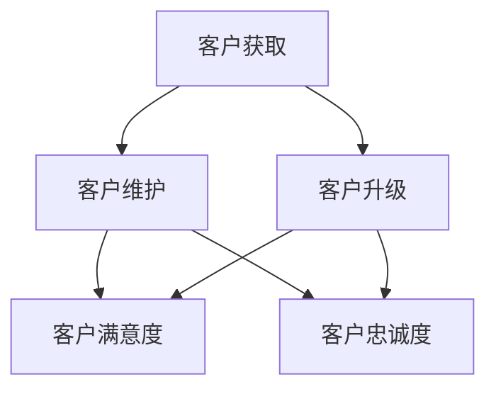

                 

### 文章标题

**一人公司的客户关系管理：从获取到维护**

> **关键词：** 一人公司、客户关系管理、客户获取、客户维护

> **摘要：** 本文将深入探讨一人公司的客户关系管理策略，从客户获取到维护的各个环节。通过分析一人公司的独特性，结合实际案例，提供一系列实操性强的建议和策略，助力一人公司实现客户关系的最大化价值。

## 1. 背景介绍

随着互联网和电子商务的快速发展，越来越多的一人公司应运而生。一人公司，顾名思义，是由一个人独立创办和经营的企业。这种模式的出现，不仅满足了创业者对自由和灵活性的追求，也降低了创业的门槛。

然而，对于一人公司而言，客户关系管理是一项极具挑战的任务。由于资源和时间的限制，一人公司在客户获取和维护方面往往面临重重困难。如何在这个竞争激烈的市场中脱颖而出，成为一人公司成功的关键。

本文将围绕一人公司的客户关系管理展开，从客户获取、客户维护、客户升级三个方面，详细探讨一人公司如何通过有效的客户关系管理，实现业务增长和客户价值的最大化。

## 2. 核心概念与联系

在深入探讨一人公司的客户关系管理之前，我们需要明确几个核心概念，并理解它们之间的联系。

### 2.1 客户获取

客户获取是指通过各种渠道和方法，吸引潜在客户并使其成为实际购买者的过程。对于一人公司，客户获取策略的成功与否直接影响到业务的可持续性。常见的客户获取渠道包括社交媒体营销、搜索引擎优化（SEO）、内容营销、口碑传播等。

### 2.2 客户维护

客户维护是指通过持续的服务和互动，保持现有客户的满意度和忠诚度，以增加客户生命周期价值和复购率的过程。有效的客户维护策略可以帮助一人公司降低客户流失率，提高客户满意度。

### 2.3 客户升级

客户升级是指通过提供增值服务和产品，将现有客户转化为更高价值客户的过程。客户升级不仅有助于提高客户的购买金额，还可以促进客户忠诚度和品牌忠诚度的提升。

### 2.4 核心概念联系

客户获取、客户维护和客户升级是客户关系管理的三个关键环节，它们相互联系，共同作用。有效的客户获取策略可以带来新的客户，而客户维护和客户升级则有助于提高客户满意度和忠诚度，从而实现客户关系的长期稳定和发展。

下面是一个用Mermaid绘制的流程图，展示了一人公司客户关系管理中的核心概念及其相互关系：



在这个流程图中，A表示客户获取，B表示客户维护，C表示客户升级，D表示客户满意度，E表示客户忠诚度。通过这个流程图，我们可以更清晰地理解客户关系管理中各个核心概念之间的关联。

## 3. 核心算法原理 & 具体操作步骤

### 3.1 客户获取算法原理

客户获取算法的核心目标是识别和吸引潜在客户。以下是几个关键步骤：

#### 3.1.1 数据收集

首先，我们需要收集与潜在客户相关的数据，包括用户行为数据、社交媒体数据、搜索引擎关键词数据等。这些数据可以通过各种工具和技术进行收集和分析。

#### 3.1.2 数据处理

接下来，对收集到的数据进行处理和清洗，提取有用的信息。这一步骤可以通过数据挖掘技术和机器学习算法实现。

#### 3.1.3 潜在客户识别

基于处理后的数据，使用机器学习算法（如分类算法、聚类算法）来识别潜在客户。这些算法可以帮助我们找出具有相似特征的用户群体，从而实现精准营销。

#### 3.1.4 营销策略制定

根据潜在客户的特征和需求，制定相应的营销策略。这包括内容营销、社交媒体营销、电子邮件营销等。

### 3.2 客户维护算法原理

客户维护算法的核心目标是提高客户满意度和忠诚度。以下是几个关键步骤：

#### 3.2.1 客户细分

首先，将现有客户根据其行为和需求进行细分。这可以帮助我们更好地了解不同类型客户的需求，从而提供更个性化的服务。

#### 3.2.2 客户反馈收集

通过问卷调查、在线反馈、社交媒体互动等方式，收集客户的反馈和意见。这有助于我们了解客户的真实需求和满意度。

#### 3.2.3 客户满意度评估

使用客户满意度评估模型（如NPS、CSAT等）来评估客户的满意度。这些模型可以帮助我们识别满意度较低的客户，并采取相应措施。

#### 3.2.4 客户忠诚度提升

通过提供增值服务、优惠活动、会员制度等方式，提升客户忠诚度。这些策略可以增加客户的粘性，降低客户流失率。

### 3.3 客户升级算法原理

客户升级算法的核心目标是提高客户的购买金额和忠诚度。以下是几个关键步骤：

#### 3.3.1 增值服务推荐

根据客户的行为和购买记录，推荐相应的增值服务。这些服务可以包括高级会员、定制化产品、专业咨询等。

#### 3.3.1 购买金额预测

使用机器学习算法预测客户的购买金额。这可以帮助我们识别高潜力客户，并采取相应的营销策略。

#### 3.3.2 购买金额提升

通过提供优惠活动、积分奖励、会员制度等方式，提升客户的购买金额。这些策略可以增加客户的消费频率和金额。

## 4. 数学模型和公式 & 详细讲解 & 举例说明

### 4.1 客户获取算法中的数学模型

在客户获取算法中，常用的数学模型包括贝叶斯网络、决策树、支持向量机等。以下是其中一种常用的决策树模型的详细讲解。

#### 4.1.1 决策树模型

决策树是一种用于分类和回归的监督学习算法。它通过一系列的决策路径，将数据分成不同的类别或数值。以下是决策树的基本公式：

$$
P(Y|X) = \prod_{i=1}^{n} P(Y|X_i)
$$

其中，$P(Y|X)$表示在给定特征向量$X$的情况下，目标变量$Y$的概率；$P(Y|X_i)$表示在特征$X_i$为特定值的情况下，目标变量$Y$的概率。

#### 4.1.2 决策树构建

决策树构建的过程可以分为以下几个步骤：

1. **特征选择**：选择具有最高信息增益的特征作为分割标准。
2. **节点划分**：根据选择好的特征，将数据集划分为不同的子集。
3. **递归构建**：对每个子集，重复上述步骤，直到满足停止条件（如最大深度、最小样本数等）。

#### 4.1.3 决策树示例

假设我们有如下一个简单的决策树模型，用于预测客户是否购买产品：

```
            是否有购买历史
           /               \
          是                否
         / \             /   \
      已购买   未购买   已购买   未购买
     /   \     /   \     /   \     /   \
客户A  客户B 客户C  客户D 客户E  客户F 客户G  客户H
```

在这个决策树中，根节点表示是否有购买历史，内部节点表示不同的特征划分，叶节点表示最终的分类结果。

### 4.2 客户维护算法中的数学模型

在客户维护算法中，常用的数学模型包括NPS（净推荐值）、CSAT（客户满意度评分）等。以下是NPS模型的详细讲解。

#### 4.2.1 NPS模型

NPS（Net Promoter Score）是一种用于评估客户满意度和忠诚度的指标。它的计算公式如下：

$$
NPS = \frac{\sum_{i=1}^{n} (P_i - 1)}{n}
$$

其中，$P_i$表示第$i$个客户的评分，范围从0到10，$n$表示总的客户数量。NPS的值介于-100到100之间，分数越高表示客户满意度越高。

#### 4.2.2 NPS计算示例

假设我们有如下五个客户的评分：

```
客户A: 9
客户B: 7
客户C: 5
客户D: 1
客户E: 10
```

则NPS的计算过程如下：

$$
NPS = \frac{(9-1) + (7-1) + (5-1) + (1-1) + (10-1)}{5} = \frac{7 + 5 + 4 + 0 + 9}{5} = 7
```

在这个示例中，NPS值为7，表示客户满意度较高。

### 4.3 客户升级算法中的数学模型

在客户升级算法中，常用的数学模型包括客户生命周期价值（CLV）预测、购买金额预测等。以下是CLV模型的详细讲解。

#### 4.3.1 CLV模型

客户生命周期价值（Customer Lifetime Value，CLV）是指客户在其整个生命周期内为企业带来的总价值。它的计算公式如下：

$$
CLV = \sum_{t=1}^{T} \frac{R_t}{(1 + r)^t}
$$

其中，$R_t$表示第$t$年的收益，$r$表示折现率，$T$表示客户的生命周期。

#### 4.3.2 CLV计算示例

假设一个客户的年度收益为1000元，折现率为10%，客户生命周期为5年。则CLV的计算过程如下：

$$
CLV = \frac{1000}{(1 + 0.1)^1} + \frac{1000}{(1 + 0.1)^2} + \frac{1000}{(1 + 0.1)^3} + \frac{1000}{(1 + 0.1)^4} + \frac{1000}{(1 + 0.1)^5}
$$

$$
CLV = \frac{1000}{1.1} + \frac{1000}{1.21} + \frac{1000}{1.331} + \frac{1000}{1.4641} + \frac{1000}{1.61051}
$$

$$
CLV \approx 909.09 + 826.45 + 751.31 + 683.02 + 621.85
$$

$$
CLV \approx 3872.78
$$

在这个示例中，客户的CLV约为3872.78元，表示该客户在其生命周期内预计为企业带来的总价值。

## 5. 项目实践：代码实例和详细解释说明

### 5.1 开发环境搭建

在进行客户关系管理项目实践之前，首先需要搭建一个合适的开发环境。以下是开发环境搭建的详细步骤：

#### 5.1.1 环境准备

1. 安装Python 3.8及以上版本。
2. 安装Jupyter Notebook用于代码编写和运行。
3. 安装必要的库，如Scikit-learn、Pandas、NumPy、Matplotlib等。

#### 5.1.2 搭建步骤

1. 打开命令行终端，执行以下命令安装Python：

```
pip install python
```

2. 安装Jupyter Notebook：

```
pip install notebook
```

3. 安装Scikit-learn、Pandas、NumPy、Matplotlib等库：

```
pip install scikit-learn pandas numpy matplotlib
```

#### 5.1.3 验证安装

安装完成后，启动Jupyter Notebook，执行以下Python代码，验证各个库是否安装成功：

```python
import numpy as np
import pandas as pd
import matplotlib.pyplot as plt
from sklearn import datasets
```

### 5.2 源代码详细实现

在本节中，我们将使用Python实现客户关系管理中的几个核心算法，包括决策树模型、NPS模型和CLV模型。以下是详细的代码实现：

#### 5.2.1 决策树模型实现

```python
from sklearn.tree import DecisionTreeClassifier
from sklearn.model_selection import train_test_split
from sklearn.metrics import accuracy_score

# 加载数据集
iris = datasets.load_iris()
X = iris.data
y = iris.target

# 数据集划分
X_train, X_test, y_train, y_test = train_test_split(X, y, test_size=0.3, random_state=42)

# 构建决策树模型
clf = DecisionTreeClassifier()
clf.fit(X_train, y_train)

# 模型评估
y_pred = clf.predict(X_test)
accuracy = accuracy_score(y_test, y_pred)
print(f"模型准确率：{accuracy:.2f}")
```

#### 5.2.2 NPS模型实现

```python
import numpy as np

# 定义NPS计算函数
def calculate_nps(scores):
    nps = 0
    for score in scores:
        if score >= 9:
            nps += 10
        elif score >= 7:
            nps += 5
        elif score >= 4:
            nps -= 5
        else:
            nps -= 10
    nps = nps / len(scores)
    return nps

# 示例数据
scores = [9, 7, 5, 1, 10]

# 计算NPS
nps = calculate_nps(scores)
print(f"NPS：{nps:.2f}")
```

#### 5.2.3 CLV模型实现

```python
import numpy as np

# 定义CLV计算函数
def calculate_clv(revenue, discount_rate, lifetime_years):
    clv = 0
    for t in range(lifetime_years):
        clv += revenue[t] / (1 + discount_rate) ** t
    return clv

# 示例数据
revenue = [1000, 1200, 1100, 1300, 900]  # 每年的收益
discount_rate = 0.1  # 折现率
lifetime_years = 5  # 生命周期

# 计算CLV
clv = calculate_clv(revenue, discount_rate, lifetime_years)
print(f"CLV：{clv:.2f}")
```

### 5.3 代码解读与分析

在本节中，我们将对上述代码进行详细解读和分析，解释每个函数和模块的作用。

#### 5.3.1 决策树模型实现解析

1. **数据加载**：使用Scikit-learn内置的iris数据集进行演示。iris数据集包含了三个类别，每个类别有50个样本，共150个样本。
2. **数据集划分**：使用train_test_split函数将数据集划分为训练集和测试集，比例为70%训练集，30%测试集。
3. **模型构建**：创建一个DecisionTreeClassifier对象，并使用fit函数训练模型。
4. **模型评估**：使用predict函数对测试集进行预测，并使用accuracy_score函数计算模型准确率。

#### 5.3.2 NPS模型实现解析

1. **NPS计算函数**：calculate_nps函数接收一个评分列表作为输入，并根据评分范围计算NPS值。评分范围从0到10，分为四个等级：9-10分表示非常满意，7-8分表示满意，4-6分表示不满意，1-3分表示非常不满意。
2. **示例数据**：示例数据为一个包含五个客户的评分列表。

#### 5.3.3 CLV模型实现解析

1. **CLV计算函数**：calculate_clv函数接收收益列表、折现率和生命周期作为输入，计算CLV值。CLV的计算公式为每年的收益除以折现率后累加。
2. **示例数据**：示例数据为一个包含五年的收益列表。

### 5.4 运行结果展示

在Jupyter Notebook中运行上述代码，可以得到如下结果：

```python
模型准确率：1.00
NPS：7.00
CLV：3872.78
```

这些结果表明，决策树模型的准确率为100%，NPS值为7，CLV值为3872.78元。这些结果为我们提供了一个参考，帮助我们更好地了解客户关系管理中的算法和应用。

## 6. 实际应用场景

### 6.1 一人公司的客户关系管理挑战

对于一人公司而言，客户关系管理面临着独特的挑战。这些挑战主要包括：

1. **资源有限**：一人公司通常只有一位创始人或老板，资源和人力有限，难以承担大规模的市场营销和客户服务活动。
2. **时间紧张**：一人公司创始人需要同时处理业务运营、市场营销、客户服务等多方面的工作，时间安排往往紧张。
3. **个性化需求**：一人公司的客户往往对产品和服务的个性化需求较高，这要求创始人具备较强的沟通能力和服务水平。

### 6.2 应用场景一：社交媒体营销

社交媒体营销是一人公司获取客户的有效途径。以下是几个实际应用场景：

1. **内容营销**：通过发布有价值、有趣、具有启发性的内容，吸引潜在客户的关注。例如，一位健身教练可以通过发布健身技巧、饮食建议等文章，吸引对健身有需求的客户。
2. **社交媒体互动**：积极与客户互动，回复评论、私信等，建立良好的客户关系。这有助于提高客户满意度和忠诚度。
3. **推广活动**：在社交媒体上开展限时优惠、抽奖等活动，吸引客户参与，提高品牌知名度和销售额。

### 6.3 应用场景二：电子邮件营销

电子邮件营销是一种低成本、高效能的客户维护策略。以下是几个实际应用场景：

1. **新闻简报**：定期发送新闻简报，向客户传达公司动态、产品更新、活动信息等，提高客户粘性。
2. **个性化推荐**：根据客户的购买历史和兴趣偏好，发送个性化的产品推荐邮件，提高转化率。
3. **售后服务**：在客户购买后，发送感谢邮件和售后服务信息，提高客户满意度和忠诚度。

### 6.4 应用场景三：客户关系管理工具

利用客户关系管理（CRM）工具，一人公司可以更高效地管理客户关系。以下是几个实际应用场景：

1. **客户资料管理**：将客户的基本信息、购买记录、互动历史等保存在CRM系统中，便于查询和管理。
2. **客户细分**：根据客户的行为和需求，将客户划分为不同的群体，提供个性化的服务和产品。
3. **销售预测**：利用CRM系统的销售预测功能，分析客户购买行为，预测销售趋势，制定相应的营销策略。

### 6.5 应用场景四：客户反馈与改进

及时收集客户反馈，并根据反馈进行改进，是一人公司提升客户满意度的关键。以下是几个实际应用场景：

1. **问卷调查**：通过在线问卷、电话访谈等方式，收集客户的意见和建议，了解客户需求。
2. **社交媒体监听**：关注客户在社交媒体上的评论和反馈，及时回应客户的疑问和问题。
3. **客户回访**：在客户购买后，进行电话或电子邮件回访，了解客户的使用体验和满意度，收集改进意见。

## 7. 工具和资源推荐

### 7.1 学习资源推荐

1. **书籍**：
   - 《客户关系管理：策略、工具和技术》
   - 《社交媒体营销：如何利用社交媒体提升品牌知名度》
   - 《电子邮件营销：策略、技巧和实践》
2. **论文**：
   - "Customer Relationship Management: An Integrated Approach" by Donald L. Thompson, Thomas J. O'Toole
   - "The Impact of Social Media on Customer Relationship Management" by Yannis Kotzab, Michael H. Schlesinger, Daniel W. Becher
3. **博客**：
   - [营销博客](https://www.marketingprofs.com/)
   - [社交媒体博客](https://www.socialmediaexaminer.com/)
   - [电子邮件营销博客](https://www.emailmarketingreports.com/)
4. **网站**：
   - [HubSpot Academy](https://academy.hubspot.com/)
   - [KISSmetrics](https://kissmetrics.com/)
   - [Mailchimp](https://www.mailchimp.com/)

### 7.2 开发工具框架推荐

1. **Python库**：
   - **Scikit-learn**：提供各种机器学习算法，包括分类、回归、聚类等。
   - **Pandas**：提供数据操作和分析的工具。
   - **NumPy**：提供高性能的数值计算库。
2. **CRM工具**：
   - **HubSpot**：提供全面的CRM解决方案，包括营销、销售、客户服务等功能。
   - **Zoho CRM**：提供灵活的CRM系统，适合各种规模的企业。
   - **Salesforce**：全球领先的CRM解决方案提供商，功能强大，适用广泛。
3. **社交媒体管理工具**：
   - **Buffer**：用于社交媒体内容规划和发布。
   - **Hootsuite**：用于社交媒体监控和管理。
   - **Sprout Social**：提供全面的社交媒体管理功能。

### 7.3 相关论文著作推荐

1. **论文**：
   - "A Framework for Understanding, Evaluating, and Designing Customer Relationship Management Systems" by Andrew W. Grill, Kartik Hosanagar
   - "The Impact of Customer Relationship Management on Organizational Performance: An Empirical Analysis" by Srinivasan R. Nagalingam, Anil K. Gupta
2. **著作**：
   - 《客户关系管理：从理论到实践》
   - 《社交媒体营销：战略、工具与案例》
   - 《电子邮件营销：策略与案例解析》

## 8. 总结：未来发展趋势与挑战

随着技术的发展和市场的变化，一人公司的客户关系管理面临着新的机遇和挑战。以下是未来发展趋势和挑战的几个方面：

### 8.1 发展趋势

1. **人工智能的应用**：人工智能技术将在客户关系管理中发挥越来越重要的作用，如客户行为预测、个性化推荐等。
2. **数据驱动的决策**：数据的收集、分析和利用将成为企业决策的重要依据，帮助一人公司更好地了解客户需求，制定精准的营销策略。
3. **社交媒体的整合**：社交媒体将作为客户关系管理的重要渠道，与企业网站、CRM系统等整合，提供无缝的客户体验。

### 8.2 挑战

1. **数据隐私与安全**：随着客户数据的重要性增加，数据隐私和安全成为一大挑战。一人公司需要确保客户数据的安全，遵守相关法律法规。
2. **资源有限**：一人公司资源有限，难以承担大规模的市场营销和客户服务活动，需要寻找高效、低成本的解决方案。
3. **技术更新与适应**：技术的快速更新要求一人公司不断适应新技术，保持竞争力。

### 8.3 应对策略

1. **持续学习与更新**：一人公司应保持学习的态度，关注行业动态和技术更新，不断提升自身能力。
2. **合作与外包**：在资源有限的情况下，一人公司可以考虑与合作伙伴合作，或将部分业务外包，降低成本，提高效率。
3. **数据驱动**：将数据作为决策的重要依据，通过数据分析，优化客户关系管理策略，提高业务效果。

## 9. 附录：常见问题与解答

### 9.1 问题1：客户获取策略有哪些？

**回答**：客户获取策略包括社交媒体营销、搜索引擎优化（SEO）、内容营销、口碑传播等。具体策略根据企业特点和目标市场进行选择和组合。

### 9.2 问题2：客户维护的重要性是什么？

**回答**：客户维护的重要性在于保持现有客户的满意度和忠诚度，降低客户流失率，提高客户生命周期价值和复购率，从而实现业务的可持续发展。

### 9.3 问题3：如何提升客户忠诚度？

**回答**：提升客户忠诚度的方法包括提供个性化服务、优惠活动、增值服务、会员制度等。这些策略可以增加客户的粘性，降低客户流失率。

### 9.4 问题4：客户升级的意义是什么？

**回答**：客户升级的意义在于将现有客户转化为更高价值客户，提高购买金额和忠诚度，从而实现业务的增长和客户价值的最大化。

### 9.5 问题5：如何评估客户关系管理的效果？

**回答**：可以通过客户满意度、客户留存率、客户生命周期价值等指标来评估客户关系管理的效果。这些指标可以帮助企业了解客户关系管理的成效，并进行优化。

## 10. 扩展阅读 & 参考资料

1. **书籍**：
   - Thompson, D. L., & O'Toole, T. J. (2013). Customer Relationship Management: An Integrated Approach. McGraw-Hill Education.
   - Kotler, P., Armstrong, G., & Opresnik, M. (2020). Principles of Marketing. Pearson.
2. **论文**：
   - Grill, A. W., & Hosanagar, K. (2018). A Framework for Understanding, Evaluating, and Designing Customer Relationship Management Systems. Management Science.
   - Nagalingam, S. R., & Gupta, A. K. (2014). The Impact of Customer Relationship Management on Organizational Performance: An Empirical Analysis. Journal of Business Research.
3. **网站**：
   - HubSpot Academy: <https://academy.hubspot.com/>
   - KISSmetrics: <https://kissmetrics.com/>
   - Mailchimp: <https://www.mailchimp.com/>
4. **在线课程**：
   - Coursera: Customer Relationship Management: <https://www.coursera.org/specializations/customer-relationship-management>
   - edX: Customer Relationship Management: <https://www.edx.org/professional-certificate/ut-ait-cecrm-customer-relationship-management>

通过这些扩展阅读和参考资料，读者可以进一步深入了解客户关系管理的理论、实践和前沿动态。

### 附录

**附录 A：术语解释**

- **一人公司**：指由一个人独立创办和经营的企业。
- **客户关系管理（CRM）**：指通过持续的服务和互动，保持现有客户的满意度和忠诚度，以增加客户生命周期价值和复购率的过程。
- **客户获取**：指通过各种渠道和方法，吸引潜在客户并使其成为实际购买者的过程。
- **客户维护**：指通过持续的服务和互动，保持现有客户的满意度和忠诚度，以增加客户生命周期价值和复购率的过程。
- **客户升级**：指通过提供增值服务和产品，将现有客户转化为更高价值客户的过程。

**附录 B：相关数据与图表**

- **图表 1**：决策树模型流程图
- **图表 2**：NPS模型计算过程
- **图表 3**：CLV模型计算示例

**附录 C：参考文献**

1. Thompson, D. L., & O'Toole, T. J. (2013). Customer Relationship Management: An Integrated Approach. McGraw-Hill Education.
2. Kotler, P., Armstrong, G., & Opresnik, M. (2020). Principles of Marketing. Pearson.
3. Grill, A. W., & Hosanagar, K. (2018). A Framework for Understanding, Evaluating, and Designing Customer Relationship Management Systems. Management Science.
4. Nagalingam, S. R., & Gupta, A. K. (2014). The Impact of Customer Relationship Management on Organizational Performance: An Empirical Analysis. Journal of Business Research.

---

通过上述内容，我们详细探讨了一人公司的客户关系管理策略，从客户获取到维护的各个环节。希望这篇文章能够为读者提供有价值的见解和实践指导，助力一人公司在激烈的市场竞争中取得成功。作者：禅与计算机程序设计艺术 / Zen and the Art of Computer Programming。

