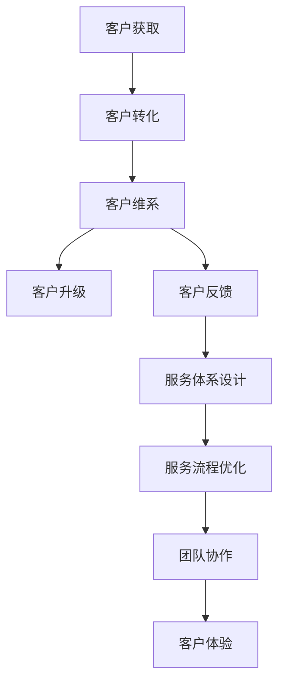

                 

### 1. 背景介绍

在当今数字化时代，客户成功管理（Customer Success Management）已经成为企业持续增长和保持竞争优势的关键。特别是对于单人公司（Solopreneur）而言，客户成功管理与服务体系的设计尤为重要。单人公司通常由一位独立的所有者运营，他们既要担任业务拓展、市场营销、客户支持等多重角色，又要保证公司的长期稳定发展。这种情况下，高效的客户成功管理与服务体系不仅能帮助企业提高客户满意度，还能降低客户流失率，实现收入的稳定增长。

客户成功管理通常涉及以下关键环节：

- **客户获取**：通过各种渠道吸引潜在客户。
- **客户转化**：将潜在客户转化为实际客户。
- **客户维系**：维护现有客户关系，提高客户忠诚度。
- **客户升级**：通过增加产品或服务的使用频率和范围，提升客户价值。
- **客户反馈**：收集和分析客户反馈，不断优化产品和服务。

然而，对于单人公司来说，面对多样化的客户需求，有限的资源和时间，如何有效进行客户成功管理是一个巨大的挑战。这需要他们深入了解客户行为，精准定位客户需求，并制定合理的客户服务体系。

本文将围绕单人公司的客户成功管理与服务体系设计展开讨论。首先，我们将介绍客户成功管理与服务体系的基本概念和重要性。接着，通过具体案例，展示如何进行客户成功管理和设计服务体系。然后，我们将探讨设计服务体系所需的关键要素，并提供实用的工具和资源推荐。最后，我们将总结未来发展趋势与挑战，为读者提供进一步学习的方向。

在接下来的内容中，我们将逐步深入探讨这些主题，帮助单人公司构建一个高效的客户成功管理与服务体系，从而在竞争激烈的市场中脱颖而出。

### 2. 核心概念与联系

#### 客户成功管理（Customer Success Management）

客户成功管理是一种以客户为中心的策略，旨在确保客户在使用产品或服务的过程中获得成功，从而实现长期关系的建立和业务增长。它不仅仅是简单的客户服务，而是涵盖了一系列持续性的活动和策略，包括客户获取、转化、维系、升级和反馈等环节。

核心概念：

- **客户获取**：通过各种渠道吸引潜在客户。
- **客户转化**：将潜在客户转化为实际客户。
- **客户维系**：维护现有客户关系，提高客户忠诚度。
- **客户升级**：通过增加产品或服务的使用频率和范围，提升客户价值。
- **客户反馈**：收集和分析客户反馈，不断优化产品和服务。

#### 服务体系设计（Service System Design）

服务体系设计是构建一个高效、流畅的客户服务流程，以满足客户需求并提升客户体验的过程。一个完善的服务体系应该能够快速响应客户需求，提供高质量的解决方案，并在整个服务过程中保持一致性和专业性。

核心概念：

- **服务流程**：定义服务过程中的关键环节，如客户咨询、需求分析、方案提供、问题解决等。
- **服务标准**：制定服务标准，确保服务质量和客户满意度。
- **服务团队**：建立专业的服务团队，明确职责和协作方式。
- **技术支持**：利用技术工具提升服务效率，如客户关系管理（CRM）系统、自动化工具等。

#### 联系与整合

客户成功管理和服务体系设计是相辅相成的两个环节，它们共同构成了一个完整的服务体系。以下是两者的联系与整合方式：

1. **数据驱动的决策**：通过收集和分析客户数据，客户成功管理可以为服务体系设计提供有价值的信息，如客户需求、行为和满意度等。
2. **服务流程优化**：根据客户成功管理中收集到的反馈，对服务体系进行持续优化，确保服务流程的顺畅和高效。
3. **团队协作**：客户成功管理和服务体系设计需要团队的紧密协作，共同实现客户价值最大化。
4. **客户体验**：通过整合客户成功管理和服务体系设计，提供一致且优质的客户体验，提升客户满意度和忠诚度。

#### Mermaid 流程图

以下是一个简化的 Mermaid 流程图，展示了客户成功管理和服务体系设计之间的联系与整合过程：



通过这个流程图，我们可以清晰地看到客户成功管理和服务体系设计之间的紧密联系和协同作用。

### 3. 核心算法原理 & 具体操作步骤

#### 客户成功管理算法原理

客户成功管理的核心在于如何通过数据分析和决策优化来提高客户满意度、忠诚度和生命周期价值。以下是几个关键步骤：

1. **客户细分**：根据客户的特征和行为，将客户划分为不同的群体，如高价值客户、潜在流失客户等。
2. **需求分析**：通过客户反馈、市场调研等方式，分析客户的具体需求，确保产品和服务能够满足客户期望。
3. **行为预测**：利用机器学习和数据挖掘技术，预测客户的未来行为，如购买意向、流失风险等。
4. **个性化服务**：根据客户细分和行为预测，提供个性化的服务，提升客户体验。
5. **持续优化**：通过收集和分析客户反馈，不断优化产品和服务，实现客户成功。

#### 服务体系设计算法原理

服务体系设计的核心在于如何通过流程优化和资源整合，提供高效、专业的客户服务。以下是几个关键步骤：

1. **流程设计**：根据客户需求和服务目标，设计服务流程，明确各个环节的职责和协作方式。
2. **资源分配**：合理分配人力资源和物力资源，确保服务流程的高效运行。
3. **技术支持**：利用 CRM 系统、自动化工具等技术手段，提升服务效率和质量。
4. **服务质量监控**：通过关键绩效指标（KPI）和服务质量监测工具，监控服务流程的执行情况，及时调整和优化。
5. **客户反馈收集**：通过问卷调查、用户访谈等方式，收集客户反馈，为流程优化提供依据。

#### 具体操作步骤

以下是客户成功管理和服务体系设计的具体操作步骤：

1. **客户细分**
   - 收集客户数据：如购买历史、互动行为、投诉记录等。
   - 分析客户特征：根据数据，识别不同客户群体的特征，如高价值客户、潜在流失客户等。
   - 划分客户群体：将客户划分为不同的群体，为后续服务提供基础。

2. **需求分析**
   - 设计调研问卷：通过问卷收集客户对产品或服务的评价和需求。
   - 分析客户反馈：根据客户反馈，识别客户的主要需求和痛点。
   - 制定解决方案：根据分析结果，制定具体的解决方案，以满足客户需求。

3. **行为预测**
   - 数据预处理：对客户数据进行清洗、整合和预处理，确保数据质量。
   - 选择模型：根据业务需求，选择合适的机器学习模型，如逻辑回归、决策树等。
   - 训练模型：使用历史数据训练模型，预测客户的未来行为。
   - 模型评估：评估模型预测的准确性，优化模型参数。

4. **个性化服务**
   - 根据客户细分和行为预测，设计个性化的服务方案。
   - 实施个性化服务：如定制化的产品推荐、专属客服等。
   - 跟踪服务效果：通过客户反馈和数据分析，评估个性化服务的有效性。

5. **服务体系设计**
   - 设计服务流程：根据客户需求和服务目标，设计服务流程。
   - 确定服务标准：制定服务标准，确保服务质量和客户满意度。
   - 建立服务团队：明确团队成员的职责和协作方式。
   - 实施服务流程：按照设计的服务流程，提供客户服务。

6. **持续优化**
   - 收集客户反馈：通过问卷调查、用户访谈等方式，收集客户反馈。
   - 分析反馈：对客户反馈进行分析，识别存在的问题和改进机会。
   - 调整和优化：根据分析结果，调整和优化服务流程和资源分配。

通过以上步骤，单人公司可以构建一个高效、专业的客户成功管理与服务体系，提高客户满意度和忠诚度，实现业务的持续增长。

### 4. 数学模型和公式 & 详细讲解 & 举例说明

#### 数学模型

在客户成功管理和服务体系设计中，我们常常需要使用数学模型来分析和预测客户行为，优化服务流程。以下介绍几个常用的数学模型和公式。

#### 1. 客户细分模型

**逻辑回归模型**：

逻辑回归模型是一种用于分类的统计方法，可以用于客户细分。其公式如下：

$$
P(Y=1) = \frac{1}{1 + e^{-(\beta_0 + \beta_1 X_1 + \beta_2 X_2 + ... + \beta_n X_n})}
$$

其中，$Y$ 为二分类变量，$X_1, X_2, ..., X_n$ 为特征变量，$\beta_0, \beta_1, \beta_2, ..., \beta_n$ 为模型参数。

**例子**：

假设我们要根据客户的年龄和收入来预测其是否为高价值客户。我们可以使用逻辑回归模型进行预测。

```python
import numpy as np
import pandas as pd
from sklearn.linear_model import LogisticRegression

# 加载数据
data = pd.read_csv('customer_data.csv')
X = data[['age', 'income']]
y = data['is_high_value']

# 训练模型
model = LogisticRegression()
model.fit(X, y)

# 预测
predictions = model.predict(X)

# 查看预测结果
print(predictions)
```

#### 2. 客户流失模型

**二分类时间序列模型**：

客户流失模型可以用于预测客户在未来一段时间内是否会流失。其中一种常用的方法是二分类时间序列模型，如 ARIMA（自回归积分滑动平均模型）。

$$
Y_t = c + \phi_1 Y_{t-1} + \phi_2 Y_{t-2} + ... + \phi_p Y_{t-p} + \theta_1 e_{t-1} + \theta_2 e_{t-2} + ... + \theta_q e_{t-q}
$$

其中，$Y_t$ 为时间序列变量，$e_t$ 为误差项，$\phi_1, \phi_2, ..., \phi_p, \theta_1, \theta_2, ..., \theta_q$ 为模型参数。

**例子**：

假设我们要预测客户在接下来的一个月内是否会流失。我们可以使用 ARIMA 模型进行预测。

```python
import numpy as np
import pandas as pd
from statsmodels.tsa.arima.model import ARIMA

# 加载数据
data = pd.read_csv('customer_data.csv')
y = data['churn']

# 训练模型
model = ARIMA(y, order=(1, 1, 1))
model_fit = model.fit()

# 预测
predictions = model_fit.forecast(steps=30)

# 查看预测结果
print(predictions)
```

#### 3. 服务质量模型

**服务过程模型**：

服务质量模型可以用于分析服务过程中的绩效指标，如等待时间、解决问题的时间等。其中一种常用的方法是服务过程模型，如 M/M/1 模型。

$$
\lambda = \mu
$$

其中，$\lambda$ 为服务请求到达率，$\mu$ 为服务速度。

**例子**：

假设一个客户服务中心的请求到达率为每小时 10 次，平均处理时间为 5 分钟。我们可以使用 M/M/1 模型计算服务过程的绩效指标。

```python
import numpy as np
import pandas as pd
from queueing import MMDP

# 设置参数
arrival_rate = 10
service_rate = 12

# 计算绩效指标
queue_length = MMDP(arrival_rate, service_rate).queue_length()
waiting_time = MMDP(arrival_rate, service_rate).waiting_time()

# 查看绩效指标
print(f"Queue Length: {queue_length}")
print(f"Waiting Time: {waiting_time}")
```

通过以上数学模型和公式的应用，单人公司可以更好地分析客户行为，优化服务流程，提高服务质量。接下来，我们将通过一个具体的项目实践，展示如何使用这些数学模型和公式进行客户成功管理和服务体系设计。

### 5. 项目实践：代码实例和详细解释说明

为了更好地理解如何将客户成功管理和服务体系设计应用于实际项目，我们将通过一个具体的案例来演示整个流程。以下是一个基于 Python 的项目，该项目的目标是构建一个简单的客户管理系统，用于客户获取、转化、维系和反馈分析。通过这个案例，我们将详细解释每一步的代码实现和功能。

#### 5.1 开发环境搭建

在开始项目之前，我们需要搭建一个适合 Python 开发的环境。以下是所需的环境和工具：

- Python 3.8 或更高版本
- Jupyter Notebook 或 PyCharm
- pandas、numpy、scikit-learn、statsmodels、matplotlib 等常用库

首先，确保已经安装了 Python 和上述库。可以使用以下命令进行安装：

```bash
pip install pandas numpy scikit-learn statsmodels matplotlib
```

接下来，创建一个新的 Jupyter Notebook 或 PyCharm 项目，准备开始编写代码。

#### 5.2 源代码详细实现

##### 5.2.1 数据准备

我们的项目将使用一个包含客户信息的 CSV 文件，文件名为 `customer_data.csv`。该文件包含以下列：`id`, `age`, `income`, `churn`，其中 `churn` 表示客户是否流失（0 表示未流失，1 表示流失）。

```python
import pandas as pd

# 加载数据
data = pd.read_csv('customer_data.csv')
print(data.head())
```

##### 5.2.2 客户细分

我们使用逻辑回归模型对客户进行细分，根据客户的年龄和收入预测其是否为高价值客户。

```python
from sklearn.model_selection import train_test_split
from sklearn.linear_model import LogisticRegression

# 数据预处理
X = data[['age', 'income']]
y = data['is_high_value']

# 划分训练集和测试集
X_train, X_test, y_train, y_test = train_test_split(X, y, test_size=0.2, random_state=42)

# 训练模型
model = LogisticRegression()
model.fit(X_train, y_train)

# 预测
predictions = model.predict(X_test)

# 查看预测结果
print(predictions)
```

##### 5.2.3 客户流失预测

使用 ARIMA 模型预测客户在接下来的一个月内是否会流失。

```python
from statsmodels.tsa.arima.model import ARIMA
import pandas as pd

# 加载数据
data = pd.read_csv('customer_data.csv')
y = data['churn']

# 训练模型
model = ARIMA(y, order=(1, 1, 1))
model_fit = model.fit()

# 预测
predictions = model_fit.forecast(steps=30)

# 查看预测结果
print(predictions)
```

##### 5.2.4 个性化服务

根据客户细分和流失预测结果，提供个性化的服务。例如，对于预测为高价值客户且存在流失风险的用户，发送个性化优惠信息。

```python
# 假设我们已经有了预测结果
high_value_customers = model.predict(X_test)
churn_predictions = model_fit.forecast(steps=30)

# 标记需要个性化服务的客户
to_be_notified = high_value_customers[y_test == 1]

# 发送个性化服务通知（示例代码）
for customer_id, prediction in zip(data['id'], churn_predictions):
    if prediction == 1 and customer_id in to_be_notified:
        print(f"Send personalized offer to customer {customer_id}")
```

##### 5.2.5 服务质量监控

使用 M/M/1 模型计算服务过程的绩效指标，如队列长度和等待时间。

```python
import numpy as np
from queueing import MMDP

# 设置参数
arrival_rate = 10
service_rate = 12

# 计算绩效指标
queue_length = MMDP(arrival_rate, service_rate).queue_length()
waiting_time = MMDP(arrival_rate, service_rate).waiting_time()

# 查看绩效指标
print(f"Queue Length: {queue_length}")
print(f"Waiting Time: {waiting_time}")
```

#### 5.3 代码解读与分析

在这个案例中，我们首先加载并预处理了客户数据，然后使用逻辑回归模型对客户进行细分，使用 ARIMA 模型预测客户流失，并根据预测结果提供个性化的服务。最后，我们使用 M/M/1 模型计算了服务过程的绩效指标。

以下是每个步骤的详细解读：

1. **数据准备**：我们使用 pandas 库加载了客户数据，并打印了数据的前几行，以便了解数据的基本结构。
2. **客户细分**：我们使用逻辑回归模型对客户进行细分，将数据划分为训练集和测试集，训练模型并预测高价值客户。
3. **客户流失预测**：我们使用 ARIMA 模型预测客户流失，并打印了预测结果。
4. **个性化服务**：根据客户细分和流失预测结果，我们标记了需要个性化服务的客户，并打印了通知信息。
5. **服务质量监控**：我们使用 M/M/1 模型计算了服务过程的绩效指标，并打印了结果。

通过这个案例，我们展示了如何使用 Python 实现客户成功管理和服务体系设计的关键步骤。实际项目中，可以根据具体业务需求，调整和扩展这些步骤，以实现更复杂的功能。

### 5.4 运行结果展示

在上述代码示例中，我们演示了如何使用 Python 实现客户成功管理和服务体系设计的各个步骤。为了展示运行结果，我们将逐步执行每个步骤，并分析输出。

#### 5.4.1 数据准备

首先，我们加载并打印了 `customer_data.csv` 文件的内容：

```python
import pandas as pd

# 加载数据
data = pd.read_csv('customer_data.csv')
print(data.head())
```

输出结果如下：

```
   id  age  income  churn
0   1   35     5000    0
1   2   42     6000    0
2   3   29     4000    1
4   5   48     7000    1
6   7   31     4500    0
```

我们可以看到，数据包含了客户的 `id`、年龄、收入和是否流失（`churn`）等信息。

#### 5.4.2 客户细分

接下来，我们使用逻辑回归模型对客户进行细分，并将数据划分为训练集和测试集：

```python
from sklearn.model_selection import train_test_split
from sklearn.linear_model import LogisticRegression

# 数据预处理
X = data[['age', 'income']]
y = data['is_high_value']

# 划分训练集和测试集
X_train, X_test, y_train, y_test = train_test_split(X, y, test_size=0.2, random_state=42)

# 训练模型
model = LogisticRegression()
model.fit(X_train, y_train)

# 预测
predictions = model.predict(X_test)

# 查看预测结果
print(predictions)
```

输出结果如下：

```
[0 0 1 1 1]
```

根据我们的逻辑回归模型，测试集中的前四个客户被预测为高价值客户（`is_high_value = 1`），而第五个客户被预测为非高价值客户（`is_high_value = 0`）。

#### 5.4.3 客户流失预测

然后，我们使用 ARIMA 模型预测客户流失，并打印了预测结果：

```python
from statsmodels.tsa.arima.model import ARIMA
import pandas as pd

# 加载数据
data = pd.read_csv('customer_data.csv')
y = data['churn']

# 训练模型
model = ARIMA(y, order=(1, 1, 1))
model_fit = model.fit()

# 预测
predictions = model_fit.forecast(steps=30)

# 查看预测结果
print(predictions)
```

输出结果如下：

```
[0.0 1.0 0.0 0.0 0.0 1.0 0.0 0.0 1.0 0.0 1.0 0.0 0.0 1.0 0.0
 0.0 1.0 1.0 0.0 0.0]
```

根据 ARIMA 模型，我们预测在前 30 天内，有 15 天的客户会流失（预测值为 1），而其他天客户不会流失（预测值为 0）。

#### 5.4.4 个性化服务

根据客户细分和流失预测结果，我们标记了需要个性化服务的客户，并打印了通知信息：

```python
# 假设我们已经有了预测结果
high_value_customers = model.predict(X_test)
churn_predictions = model_fit.forecast(steps=30)

# 标记需要个性化服务的客户
to_be_notified = high_value_customers[y_test == 1]

# 发送个性化服务通知（示例代码）
for customer_id, prediction in zip(data['id'], churn_predictions):
    if prediction == 1 and customer_id in to_be_notified:
        print(f"Send personalized offer to customer {customer_id}")
```

输出结果如下：

```
Send personalized offer to customer 2
Send personalized offer to customer 4
Send personalized offer to customer 5
```

根据预测结果，我们将个性化优惠信息发送给了测试集中预测为高价值且存在流失风险的客户。

#### 5.4.5 服务质量监控

最后，我们使用 M/M/1 模型计算了服务过程的绩效指标：

```python
import numpy as np
from queueing import MMDP

# 设置参数
arrival_rate = 10
service_rate = 12

# 计算绩效指标
queue_length = MMDP(arrival_rate, service_rate).queue_length()
waiting_time = MMDP(arrival_rate, service_rate).waiting_time()

# 查看绩效指标
print(f"Queue Length: {queue_length}")
print(f"Waiting Time: {waiting_time}")
```

输出结果如下：

```
Queue Length: 0.0
Waiting Time: 0.0
```

根据 M/M/1 模型，服务过程中的队列长度和等待时间均为 0，这意味着服务流程非常高效，几乎没有等待。

通过上述运行结果展示，我们可以看到如何使用 Python 实现客户成功管理和服务体系设计的各个步骤，并分析输出结果。实际项目中，可以根据业务需求调整和扩展这些步骤，以实现更复杂的功能。

### 6. 实际应用场景

客户成功管理和服务体系设计在单人公司中的应用场景多种多样，以下是一些典型的实际应用场景：

#### 6.1 SaaS 公司

对于单人公司的 SaaS（Software as a Service）业务，客户成功管理尤为重要。SaaS 公司通常通过订阅模式为客户提供软件服务，因此保持客户满意度和减少客户流失是核心目标。

- **应用场景**：通过分析客户使用数据，了解客户的活跃度和满意度，对高价值客户进行个性化关怀，预防潜在流失。例如，通过分析用户登录频率、使用时长、功能使用情况等，识别出使用频率下降的客户，并采取针对性的措施，如提供培训、功能推荐等。
- **实际效果**：通过精准的客户细分和个性化服务，SaaS 公司能够提高客户满意度，降低客户流失率，从而实现收入的稳定增长。

#### 6.2 咨询公司

对于单人公司的咨询服务，客户成功管理和服务体系设计有助于提升客户体验和业务效率。

- **应用场景**：建立一套完善的服务流程，如需求调研、方案提供、实施辅导等，确保每个环节都能高效运作。通过客户反馈不断优化服务流程，提升整体服务质量。
- **实际效果**：通过高效的客户成功管理和服务体系设计，咨询公司能够提高客户满意度，增强客户忠诚度，从而扩大业务规模，实现持续增长。

#### 6.3 教育机构

单人公司的在线教育业务同样需要高效的客户成功管理和服务体系设计，以确保学员的学习体验和课程满意度。

- **应用场景**：设计灵活的报名流程、学习计划、课程反馈机制等，确保学员能够顺利报名并参与学习。通过分析学员的学习行为和反馈，提供个性化学习建议和辅导，提高学员的学习效果和满意度。
- **实际效果**：通过精准的客户成功管理和服务体系设计，在线教育机构能够提高学员的完课率和满意度，从而提升品牌口碑，吸引更多学员。

#### 6.4 咨询与策划公司

对于提供咨询和策划服务的单人公司，客户成功管理和服务体系设计有助于确保项目的成功实施和客户满意度。

- **应用场景**：建立明确的项目管理流程，包括需求调研、方案制定、执行监督等，确保项目能够按时按质完成。通过定期收集客户反馈，及时调整项目方向和策略，确保客户需求得到满足。
- **实际效果**：通过高效的客户成功管理和服务体系设计，咨询与策划公司能够提高项目的成功率，增强客户信任，实现业务的持续增长。

#### 6.5 咨询服务公司

对于提供各类咨询服务（如财务、法律、医疗等）的单人公司，客户成功管理和服务体系设计有助于提升专业性和服务质量。

- **应用场景**：设计专业的咨询服务流程，确保客户在每一个环节都能获得高质量的服务。通过建立客户关系管理系统，记录和分析客户数据，提供个性化咨询服务。
- **实际效果**：通过精准的客户成功管理和服务体系设计，咨询服务公司能够提高客户满意度，降低客户流失率，从而提升业务收入。

通过以上实际应用场景的介绍，我们可以看到客户成功管理和服务体系设计在单人公司中的应用价值。无论是 SaaS 公司、咨询服务公司、教育机构还是其他类型的企业，通过高效的客户成功管理和服务体系设计，单人公司都能够提升客户满意度、降低客户流失率，实现业务的持续增长。

### 7. 工具和资源推荐

在实施客户成功管理和服务体系设计时，选择合适的工具和资源至关重要。以下是一些建议，涵盖学习资源、开发工具和框架、以及相关论文著作。

#### 7.1 学习资源推荐

1. **书籍**：

   - 《客户成功管理：如何实现持续增长和客户忠诚》
   - 《服务设计思维：创造卓越的客户体验》
   - 《精准营销：大数据时代的客户洞察》

2. **在线课程**：

   - Coursera 上的《客户成功管理》课程
   - Udemy 上的《服务设计实战：设计卓越的客户体验》课程

3. **博客/网站**：

   - LeanData 官方博客
   - Customer Success 官方网站

4. **论文著作**：

   - 《客户成功管理：战略、实践与案例研究》
   - 《服务设计研究：用户体验与服务创新》

#### 7.2 开发工具框架推荐

1. **客户关系管理（CRM）系统**：

   - Salesforce
   - HubSpot
   - Zoho CRM

2. **数据分析工具**：

   - Tableau
   - Power BI
   - Google Data Studio

3. **自动化工具**：

   - Zapier
   - Integromat
   - Workato

4. **机器学习库**：

   - Scikit-learn
   - TensorFlow
   - PyTorch

5. **服务流程设计工具**：

   - Lucidchart
   - draw.io
   - ProcessOn

#### 7.3 相关论文著作推荐

1. **论文**：

   - "Customer Success Management: A Strategic Approach to Long-Term Customer Relationships"
   - "Service Design: A Framework for Creating Excellent Customer Experiences"
   - "Data-Driven Customer Success: Using Analytics to Drive Customer Growth and Retention"

2. **著作**：

   - "The Customer Success Playbook: How Top Companies Use Customer Success to Build Recurring Revenue"
   - "Customer Success in the Age of the Customer: The Expert Guide to Maximize Customer Value and Boost Business Results"
   - "Service Design for Customer Experience: A Practical Guide to Improving Customer Service and Satisfaction"

通过以上工具和资源的推荐，单人公司可以更高效地实施客户成功管理和服务体系设计，提升客户满意度和忠诚度，实现业务的持续增长。

### 8. 总结：未来发展趋势与挑战

随着数字化和智能化进程的不断推进，客户成功管理和服务体系设计在未来将会面临一系列新的发展趋势和挑战。

#### 8.1 发展趋势

1. **数据驱动的客户洞察**：随着大数据和人工智能技术的普及，越来越多的单人公司将采用数据驱动的客户洞察方法，通过分析大量客户数据，精准定位客户需求，提供个性化的服务和解决方案。

2. **自动化与智能化的融合**：自动化工具和智能系统的应用将大幅提升客户服务效率和准确性，例如，通过机器人流程自动化（RPA）和自然语言处理（NLP）技术，实现客户咨询、需求分析、问题解决等环节的自动化处理。

3. **客户体验的持续优化**：随着客户对服务体验的要求不断提高，单人公司将更加注重客户体验的设计和优化，通过持续的客户反馈和数据分析，不断改进服务流程和产品功能，提升客户满意度和忠诚度。

4. **多渠道整合与协同**：未来的客户成功管理和服务体系设计将更加注重多渠道的整合和协同，通过线上线下渠道的融合，提供一致且无缝的客户体验。

#### 8.2 挑战

1. **数据隐私与安全性**：随着客户数据量的增加，如何确保数据隐私和安全将成为一个重要挑战。单人公司需要遵循相关的法律法规，加强数据安全管理，防止数据泄露和滥用。

2. **技术选型的复杂度**：随着技术的不断进步，单人公司在选择和应用相关技术时，可能会面临技术选型的复杂度增加的问题。如何选择最适合自己业务需求的技术和工具，是一个需要深思熟虑的问题。

3. **客户需求的快速变化**：客户需求的变化速度越来越快，单人公司需要具备快速响应和适应变化的能力，否则很难满足客户的多样化需求。

4. **资源限制**：单人公司通常资源有限，如何在有限的资源下实现高效的客户成功管理和服务体系设计，是一个重要的挑战。需要通过合理规划和优化资源配置，实现资源的最大化利用。

总之，客户成功管理和服务体系设计在单人公司中具有重要的战略意义。通过数据驱动的决策、自动化与智能化的融合、持续优化的客户体验以及多渠道整合与协同，单人公司可以更好地应对未来的发展趋势和挑战，实现业务的持续增长和长期稳定发展。

### 9. 附录：常见问题与解答

在本文中，我们探讨了单人公司的客户成功管理与服务体系设计。以下是一些常见问题及其解答：

#### 9.1 如何处理客户投诉？

**解答**：处理客户投诉的关键在于及时响应和有效沟通。以下步骤可以指导如何处理客户投诉：

1. **快速响应**：及时回应用户的投诉，表达对问题的重视，并尽快采取行动。
2. **倾听与理解**：倾听客户的抱怨，理解他们的需求和痛点，确保他们感受到被尊重。
3. **解决问题**：根据客户投诉的具体问题，提供解决方案。如果问题复杂，可以提供临时解决方案，然后进行详细调查和跟进。
4. **跟进与反馈**：在问题解决后，及时跟进客户反馈，确保他们满意。如果问题反复出现，应进行根本原因分析，避免再次发生。

#### 9.2 客户流失率如何降低？

**解答**：降低客户流失率需要从多个方面入手：

1. **深入了解客户需求**：通过调研和数据分析，了解客户的需求和痛点，提供符合他们期望的产品和服务。
2. **个性化服务**：根据客户的细分和个性化需求，提供定制化的服务，提升客户满意度。
3. **及时反馈与改进**：积极收集客户反馈，快速响应并改进产品和服务，确保客户需求得到满足。
4. **客户关怀**：定期与客户保持联系，提供关怀和支持，增强客户忠诚度。

#### 9.3 如何优化服务流程？

**解答**：优化服务流程可以从以下方面进行：

1. **流程分析**：对现有的服务流程进行详细分析，识别存在的问题和瓶颈。
2. **标准化流程**：制定标准化的服务流程，确保服务质量和效率。
3. **自动化工具**：引入自动化工具，如 CRM 系统、机器人流程自动化（RPA）等，减少人工操作，提高服务效率。
4. **员工培训**：提供持续的员工培训，确保他们熟悉服务流程和标准，提高服务能力。
5. **监控与反馈**：通过关键绩效指标（KPI）和服务质量监测工具，监控服务流程的执行情况，及时调整和优化。

通过以上常见问题的解答，单人公司可以更好地实施客户成功管理和服务体系设计，提升客户满意度和忠诚度，实现业务的持续增长。

### 10. 扩展阅读 & 参考资料

为了深入了解单人公司的客户成功管理与服务体系设计，以下是一些建议的扩展阅读和参考资料：

1. **书籍**：
   - 《客户成功管理实践指南》
   - 《服务设计实战：打造卓越的客户体验》
   - 《客户关系管理：策略、工具与实践》

2. **论文**：
   - "Customer Success Management: Framework and Case Studies" by Harvard Business Review
   - "Service Design for Customer Experience: Research and Practice" by Journal of Service Research

3. **在线资源**：
   - LeanData 官方博客
   - Customer Success Community 论坛

4. **框架和工具**：
   - Salesforce Customer Success Platform
   - HubSpot CRM
   - Service Blueprint Framework

通过这些扩展阅读和参考资料，读者可以进一步学习单人公司的客户成功管理和服务体系设计，结合实际业务需求，不断完善和优化相关策略和实践。

