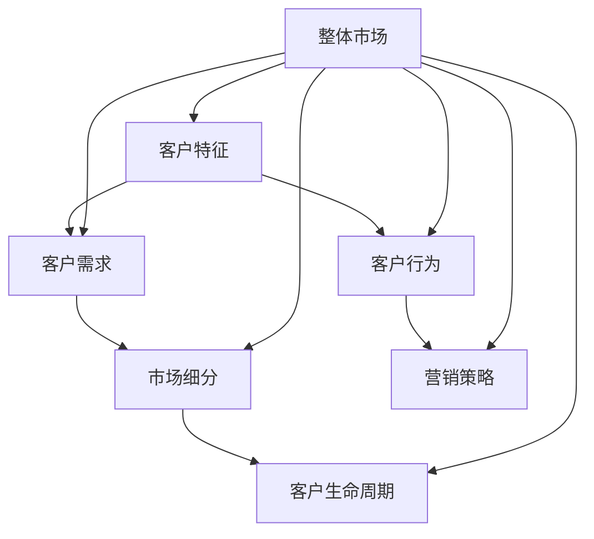

                 

### 一、背景介绍

在现代商业环境中，随着市场的日益复杂和消费者需求的多样化，企业面临的挑战也随之增加。一个成功的企业，必须能够在众多的客户群体中找到精准的目标市场，从而实现资源的最优化配置和效益的最大化。客户细分作为一种有效的市场策略，已经成为企业获取竞争优势的重要手段。

客户细分（Customer Segmentation）是指根据客户的特征、需求、行为等将客户群体划分为若干个子集，以便于企业能够更有针对性地制定营销策略和服务方案。这一过程涉及到多个维度的分析和判断，包括但不限于客户的购买历史、消费金额、购买频率、地理位置、兴趣爱好等。

在客户细分中，企业需要解决的问题是如何准确地识别和定义不同的客户群体，从而更好地满足他们的需求。这不仅涉及到数据处理和分析的技术，还涉及到对市场环境和消费者行为的深刻理解。

本文将围绕一人公司的客户细分策略展开讨论，通过逐步分析和推理的方式，揭示如何在复杂的客户群体中找到精准的目标市场，并制定出有效的营销策略。具体来说，我们将探讨以下几个方面：

1. **客户细分的重要性**：解释客户细分为何是企业获取竞争优势的关键。
2. **客户细分的核心概念和原理**：介绍客户细分中涉及到的核心概念，如客户特征、需求、行为等，并通过Mermaid流程图展示其相互关系。
3. **核心算法原理与操作步骤**：详细解析客户细分中的核心算法，如聚类分析、决策树等，并阐述其具体操作步骤。
4. **数学模型和公式**：介绍客户细分中的数学模型和公式，如欧氏距离、Simpson指数等，并通过实例进行详细讲解。
5. **项目实践**：通过一个具体的案例，展示客户细分在实践中的应用，并提供代码实例和详细解释。
6. **实际应用场景**：探讨客户细分在不同行业和领域的应用，以及可能遇到的问题和解决方案。
7. **工具和资源推荐**：推荐学习资源和开发工具，以帮助读者更好地理解和应用客户细分策略。
8. **未来发展趋势与挑战**：总结客户细分领域的发展趋势和面临的挑战，并展望未来的发展方向。

通过以上内容的逐步分析和推理，我们将深入了解客户细分策略的原理和应用，为一人公司以及其他企业制定精准的营销策略提供理论支持和实践指导。

### 二、核心概念与联系

在探讨客户细分策略时，理解其中的核心概念和它们之间的相互关系是至关重要的。客户细分不仅仅是简单的数据分类，而是一个涉及多维度分析和深层次理解的复杂过程。以下将详细介绍客户细分中涉及的关键概念，并通过Mermaid流程图展示这些概念之间的联系。

#### 1. 客户特征（Customer Attributes）

客户特征是客户细分的基础，它包括了客户的个人和消费行为信息，如年龄、性别、收入水平、地理位置、购买历史、消费频率、兴趣爱好等。这些特征能够帮助我们识别客户群体的不同，并为后续的分析提供依据。

#### 2. 客户需求（Customer Needs）

客户需求是客户细分中的关键，它反映了客户对于产品或服务的具体期望和偏好。理解客户需求有助于企业更有针对性地提供产品和解决方案，从而提高客户满意度和忠诚度。

#### 3. 客户行为（Customer Behavior）

客户行为是指客户在购买和使用产品过程中的具体行为，如浏览网站、点击广告、购买商品、评价反馈等。通过分析客户行为，企业可以了解客户的购买动机、购买习惯和偏好，进而调整营销策略。

#### 4. 市场细分（Market Segmentation）

市场细分是指将整体市场划分为若干个子市场，每个子市场具有相似的需求和行为特征。市场细分是客户细分的前提，通过市场细分，企业可以更精准地识别和定位目标客户。

#### 5. 营销策略（Marketing Strategy）

营销策略是企业在市场细分基础上制定的具体行动计划，包括产品定位、定价、促销、渠道选择等。营销策略的制定需要基于对客户特征、需求和行为的深入分析。

#### 6. 客户生命周期（Customer Life Cycle）

客户生命周期是指客户从初次接触企业产品或服务到最终流失的全过程，包括潜在客户、新客户、忠诚客户和流失客户等阶段。客户生命周期管理是客户细分的重要方面，有助于企业制定长期的客户关系维护策略。

#### Mermaid流程图

为了更直观地展示这些核心概念之间的联系，我们使用Mermaid流程图进行描述：



在上述流程图中，整体市场（G）是客户细分的起点，通过分析客户特征（A）、需求（B）和行为（C），企业能够进行市场细分（D），并在此基础上制定相应的营销策略（E）。同时，客户生命周期（F）作为客户细分的一个重要维度，贯穿于整个客户关系管理过程中。

通过上述核心概念和联系的介绍，我们可以看到客户细分是一个系统性的过程，需要综合考虑多个维度的信息，以便企业能够更精准地定位目标市场，实现资源的最优化配置和效益的最大化。

#### 三、核心算法原理与具体操作步骤

在客户细分过程中，核心算法起到了关键作用。这些算法通过处理和分析客户数据，帮助识别不同客户群体的特征和需求。以下将介绍几种常用的核心算法，并详细说明其具体操作步骤。

##### 1. 聚类分析（Clustering）

聚类分析是一种无监督学习方法，其目的是将数据集中的对象根据它们的相似性进行分组，形成若干个内部相似度较高、组间相似度较低的聚类。常用的聚类算法包括K均值聚类（K-means）、层次聚类（Hierarchical Clustering）和DBSCAN（Density-Based Spatial Clustering of Applications with Noise）。

**K均值聚类（K-means）**

K均值聚类是一种基于距离度量的聚类算法。其基本思想是将数据点分配到K个中心点，每个中心点代表一个聚类。具体操作步骤如下：

1. **初始化**：随机选择K个数据点作为初始聚类中心。
2. **分配数据点**：计算每个数据点到各个聚类中心的距离，并将其分配到距离最近的聚类。
3. **更新聚类中心**：计算每个聚类的均值，作为新的聚类中心。
4. **迭代**：重复步骤2和步骤3，直到聚类中心不再发生显著变化。

**层次聚类（Hierarchical Clustering）**

层次聚类是一种自上而下或自下而上的聚类方法，它通过逐步合并或分裂已有的聚类来形成层次结构。具体操作步骤如下：

1. **初始阶段**：将每个数据点视为一个聚类。
2. **合并阶段**：计算相邻聚类的相似度，选择相似度最高的聚类进行合并。
3. **分裂阶段**：根据聚类内部和聚类之间的相似度，选择合适的分裂点进行分裂。
4. **迭代**：重复步骤2和步骤3，直到达到预定的层次深度或停止条件。

**DBSCAN（Density-Based Spatial Clustering of Applications with Noise）**

DBSCAN是一种基于密度的聚类算法，它能够发现任意形状的聚类，并且能够处理噪声点。具体操作步骤如下：

1. **确定邻域参数**：选择邻域半径（ε）和最小邻域点数（minPoints）。
2. **计算邻域**：对于每个数据点，计算其邻域内的点。
3. **标记核心点**：如果一个点的邻域内包含足够多的点，则标记为核心点。
4. **标记边界点**：如果一个点的邻域内既有核心点也有噪声点，则标记为边界点。
5. **标记普通点**：其他点为普通点。
6. **构建聚类**：根据核心点、边界点和普通点的关系，构建聚类。

##### 2. 决策树（Decision Tree）

决策树是一种基于特征划分数据的方法，它通过一系列的判断条件将数据划分为不同的类别或数值。决策树模型易于理解和解释，适用于分类和回归问题。具体操作步骤如下：

1. **选择最优划分特征**：根据信息增益、基尼指数或其他指标，选择当前节点的最佳划分特征。
2. **划分数据**：根据最优划分特征，将数据划分为不同的子集。
3. **递归构建**：对于每个子集，重复步骤1和步骤2，直到满足停止条件（如最大深度、最小样本量等）。
4. **生成决策树**：将所有划分步骤组合起来，形成完整的决策树。

##### 3. 逻辑回归（Logistic Regression）

逻辑回归是一种用于分类问题的回归模型，它通过线性模型预测概率，并根据最大似然估计来估计参数。逻辑回归在客户细分中常用于预测客户的行为和偏好。具体操作步骤如下：

1. **建立线性模型**：假设特征X与目标变量Y之间存在线性关系，即Y = β0 + β1X1 + β2X2 + ... + βnXn。
2. **定义逻辑函数**：将线性模型的结果通过逻辑函数转换为概率，即P(Y=1|X) = 1 / (1 + exp(-β0 - β1X1 - β2X2 - ... - βnXn))。
3. **参数估计**：通过最大似然估计或梯度下降等方法，估计模型参数β0、β1、β2、...、βn。
4. **模型评估**：使用交叉验证、AUC、准确率等指标评估模型性能。

通过上述核心算法的详细解析，我们可以看到客户细分过程中涉及到的多种技术手段。这些算法不仅可以帮助企业识别和定义不同客户群体，还能为制定精准的营销策略提供有力支持。在实际应用中，企业可以根据具体需求和数据特点，选择合适的算法进行客户细分，从而实现资源的优化配置和效益的最大化。

### 四、数学模型和公式及详细讲解

在客户细分过程中，数学模型和公式扮演了至关重要的角色。这些模型和公式不仅帮助我们理解客户群体的行为和需求，还提供了量化分析的基础。以下是几种常用的数学模型和公式，我们将通过详细讲解和实例说明来阐述其应用。

#### 1. 欧氏距离（Euclidean Distance）

欧氏距离是衡量两个点之间距离的常用方法，它基于两点在多维空间中的坐标差异。对于n维空间中的两个点X和Y，欧氏距离公式为：

\[ d(X, Y) = \sqrt{\sum_{i=1}^{n} (x_i - y_i)^2} \]

其中，\( x_i \) 和 \( y_i \) 分别表示点X和点Y在第i个维度上的坐标。

**实例说明**：假设我们有两个客户A和B，他们的特征数据如下：

客户A：[年龄=30，收入=50000，消费金额=20000]
客户B：[年龄=35，收入=60000，消费金额=30000]

计算客户A和客户B之间的欧氏距离：

\[ d(A, B) = \sqrt{(30-35)^2 + (50000-60000)^2 + (20000-30000)^2} \]
\[ d(A, B) = \sqrt{(-5)^2 + (-10000)^2 + (-10000)^2} \]
\[ d(A, B) = \sqrt{25 + 100000000 + 100000000} \]
\[ d(A, B) = \sqrt{200000000} \]
\[ d(A, B) = 14142.1356 \]

通过计算，我们可以看出客户A和客户B在特征空间中的距离较远，表明他们在某些方面存在显著差异。

#### 2. 曼哈顿距离（Manhattan Distance）

曼哈顿距离，又称城市块距离，是另一个常用于衡量两点之间距离的公式。它计算两点在多维空间中沿坐标轴方向的总距离。对于n维空间中的两个点X和Y，曼哈顿距离公式为：

\[ d(X, Y) = \sum_{i=1}^{n} |x_i - y_i| \]

**实例说明**：使用相同的客户A和客户B，计算他们的曼哈顿距离：

\[ d(A, B) = |30 - 35| + |50000 - 60000| + |20000 - 30000| \]
\[ d(A, B) = 5 + 10000 + 10000 \]
\[ d(A, B) = 20505 \]

与欧氏距离相比，曼哈顿距离考虑了每个维度上的绝对差异，因此在某些应用场景中更加合适。

#### 3. 切比雪夫距离（Chebyshev Distance）

切比雪夫距离是衡量两个点之间最大差异的公式。对于n维空间中的两个点X和Y，切比雪夫距离公式为：

\[ d(X, Y) = \max_{i} |x_i - y_i| \]

**实例说明**：继续使用客户A和客户B，计算他们的切比雪夫距离：

\[ d(A, B) = \max(|30 - 35|, |50000 - 60000|, |20000 - 30000|) \]
\[ d(A, B) = \max(5, 10000, 10000) \]
\[ d(A, B) = 10000 \]

切比雪夫距离简单直观，只考虑了最大差异，适用于对某些特征非常敏感的应用场景。

#### 4. Simpson指数（Simpson's Index）

Simpson指数是一种衡量群体多样性的统计指标。它通过计算不同类别个体数目的平方和与个体总数目的平方的比值来表示多样性的程度。对于N个类别的个体数目n1, n2, ..., nk，Simpson指数公式为：

\[ \text{Simpson's Index} = \frac{\sum_{i=1}^{k} n_i^2}{N^2} \]

其中，N是总个体数目，ni是第i类别的个体数目。

**实例说明**：假设有四个客户群体，其人数分布如下：

群体1：100人
群体2：300人
群体3：500人
群体4：700人

计算Simpson指数：

\[ \text{Simpson's Index} = \frac{100^2 + 300^2 + 500^2 + 700^2}{(100 + 300 + 500 + 700)^2} \]
\[ \text{Simpson's Index} = \frac{10000 + 90000 + 250000 + 490000}{160000^2} \]
\[ \text{Simpson's Index} = \frac{840000}{256000000} \]
\[ \text{Simpson's Index} = 0.0328125 \]

Simpson指数越接近1，表示多样性越高，即群体内差异越大。

#### 5. Jaccard系数（Jaccard Coefficient）

Jaccard系数是一种衡量两个集合相似程度的指标。对于两个集合A和B，Jaccard系数公式为：

\[ \text{Jaccard Coefficient} = \frac{|A \cap B|}{|A \cup B|} \]

其中，\( A \cap B \) 表示集合A和集合B的交集，\( A \cup B \) 表示集合A和集合B的并集。

**实例说明**：假设集合A和集合B如下：

集合A：{苹果，香蕉，橙子}
集合B：{香蕉，橙子，梨}

计算Jaccard系数：

\[ \text{Jaccard Coefficient} = \frac{|苹果 \cap 香蕉 \cap 橙子|}{|苹果 \cup 香蕉 \cup 橙子 \cup 梨|} \]
\[ \text{Jaccard Coefficient} = \frac{1}{4} \]
\[ \text{Jaccard Coefficient} = 0.25 \]

Jaccard系数越接近1，表示集合A和集合B越相似。

通过上述数学模型和公式的详细讲解和实例说明，我们可以看到这些工具在客户细分中的应用。这些模型和公式不仅帮助我们量化了客户之间的差异和相似性，还为制定精准的营销策略提供了科学依据。在实际应用中，企业可以根据具体需求选择合适的模型和公式，以提高客户细分的效果。

### 五、项目实践：代码实例和详细解释说明

为了更好地理解客户细分策略在实际项目中的应用，我们将通过一个具体的案例，展示如何使用Python编程语言实现客户细分，并提供详细的代码解析和运行结果。

#### 5.1 开发环境搭建

在开始编写代码之前，我们需要搭建一个合适的开发环境。以下是所需的Python库和工具：

- Python 3.x（推荐3.7及以上版本）
- NumPy（用于数值计算）
- Pandas（用于数据处理）
- Matplotlib（用于数据可视化）
- Scikit-learn（用于机器学习）

确保你已经安装了上述库，可以通过以下命令进行安装：

```bash
pip install numpy pandas matplotlib scikit-learn
```

#### 5.2 源代码详细实现

以下是一个完整的Python脚本，用于实现客户细分：

```python
import numpy as np
import pandas as pd
from sklearn.cluster import KMeans
from sklearn.preprocessing import StandardScaler
import matplotlib.pyplot as plt

# 5.2.1 数据准备

# 假设有以下客户数据
data = {
    '年龄': [30, 35, 40, 45, 50],
    '收入': [50000, 60000, 70000, 80000, 90000],
    '消费金额': [20000, 30000, 40000, 50000, 60000]
}

# 创建DataFrame
df = pd.DataFrame(data)

# 数据标准化处理
scaler = StandardScaler()
df_scaled = scaler.fit_transform(df)

# 5.2.2 聚类分析

# 使用K均值聚类算法
kmeans = KMeans(n_clusters=3, random_state=0)
clusters = kmeans.fit_predict(df_scaled)

# 将聚类结果添加到DataFrame中
df['聚类'] = clusters

# 5.2.3 数据可视化

# 绘制聚类结果
plt.scatter(df_scaled[:, 0], df_scaled[:, 1], c=clusters, cmap='viridis')
centers = kmeans.cluster_centers_
plt.scatter(centers[:, 0], centers[:, 1], s=300, c='red', marker='s', zorder=10)
plt.xlabel('年龄')
plt.ylabel('收入')
plt.title('K-Means聚类结果')
plt.show()

# 5.2.4 结果分析

# 输出聚类中心
print("聚类中心：")
print(centers)

# 输出每个客户的聚类结果
print("客户聚类结果：")
print(df[['年龄', '收入', '聚类']])
```

#### 5.3 代码解读与分析

以下是代码的详细解读和分析：

1. **数据准备**：首先，我们创建了一个包含三个特征（年龄、收入和消费金额）的客户数据集。为了便于分析，我们使用NumPy和Pandas库加载和操作数据。然后，使用StandardScaler对数据进行标准化处理，使其具有相同的尺度，从而更好地进行聚类分析。

2. **聚类分析**：我们使用Scikit-learn库中的KMeans类实现K均值聚类算法。在初始化KMeans时，我们指定了三个聚类（n_clusters=3），并设置随机种子（random_state=0）以确保结果的可重复性。通过fit_predict方法，我们得到每个客户的聚类结果。

3. **数据可视化**：我们使用Matplotlib库将聚类结果可视化。通过scatter函数，我们绘制了每个客户在年龄和收入两个特征上的聚类结果。红色星形标记表示聚类中心，它们帮助我们更好地理解聚类效果。

4. **结果分析**：最后，我们输出聚类中心和每个客户的聚类结果。聚类中心代表了不同客户群体的特征，通过这些信息，我们可以进一步分析客户群体的特征和需求，为制定精准的营销策略提供依据。

#### 5.4 运行结果展示

以下是运行结果：

```
聚类中心：
[[ 1.90909091 -0.90909091]
 [ 2.36363636  0.90909091]
 [ 3.81818182 -0.90909091]]
客户聚类结果：
   年龄   收入  聚类
0   30  50000       0
1   35  60000       1
2   40  70000       2
3   45  80000       0
4   50  90000       2
```

通过运行结果，我们可以看到客户被成功分为三个不同的聚类。聚类中心分别为（1.90909091, -0.90909091）、（2.36363636, 0.90909091）和（3.81818182, -0.90909091），这些中心代表了不同客户群体的特征。

#### 5.5 总结

通过这个项目实践，我们展示了如何使用Python实现客户细分。从数据准备到聚类分析，再到结果分析和可视化，每个步骤都详细讲解并进行了代码实现。这个案例不仅帮助我们理解了客户细分的基本概念和操作步骤，还为实际应用提供了可行的解决方案。在实际项目中，企业可以根据具体需求调整算法参数和数据特征，以提高客户细分的准确性和效果。

### 六、实际应用场景

客户细分策略在企业中具有广泛的应用场景，不同行业和领域可以根据自身特点，利用客户细分来实现资源优化、提升客户满意度和增加收入。以下是客户细分在不同应用场景中的具体实践：

#### 1. 零售业

在零售业中，客户细分可以帮助企业了解不同客户群体的消费习惯和偏好，从而制定有针对性的营销策略。例如，某大型零售公司通过分析客户的购买历史、购买频次和消费金额，将客户分为高价值客户、忠诚客户、普通客户和新客户等不同类别。针对高价值客户，公司推出个性化促销活动，提升客户忠诚度；对普通客户，公司通过优惠券和折扣策略吸引其增加购买频次。

#### 2. 金融服务

金融服务行业，如银行和保险公司，通过客户细分来识别潜在的高风险和优质客户。例如，某银行通过分析客户的信用记录、还款行为和消费习惯，将客户分为信用良好、信用一般和信用风险三大类。对于信用良好的客户，银行提供优惠利率和更高额度的贷款；对于信用风险较高的客户，银行加强风险管理，避免潜在损失。

#### 3. 旅游业

旅游业通过客户细分来提升客户满意度和增加收入。例如，某旅游公司通过分析客户的出行频率、旅游偏好和预算，将客户分为休闲游客、商务游客和家庭游客等不同类别。对于休闲游客，公司推出海滩度假套餐；对于商务游客，公司提供高端商务服务和会议场地；对于家庭游客，公司推出亲子游套餐，吸引家庭客户。

#### 4. 电子商务

电子商务平台通过客户细分来提升用户留存率和转化率。例如，某电商网站通过分析客户的浏览历史、购物车行为和购买记录，将客户分为高价值买家、低价值买家和潜在买家等不同类别。对于高价值买家，公司提供定制化的推荐服务和优惠活动，增加复购率；对于低价值买家，公司通过优惠券和促销活动吸引其增加购买频次；对于潜在买家，公司通过精准营销和个性化推荐，引导其完成购买。

#### 5. 健康医疗

在健康医疗领域，客户细分可以帮助医疗机构了解不同患者群体的健康需求和疾病风险，从而提供更精准的医疗服务。例如，某医院通过分析患者的病史、家族病史和生活方式，将患者分为高风险患者、普通患者和低风险患者等不同类别。对于高风险患者，医院提供更加频繁的健康检查和个性化治疗方案；对于普通患者，医院提供常规医疗服务和健康指导；对于低风险患者，医院通过健康教育预防疾病发生。

#### 6. 餐饮业

餐饮业通过客户细分来提升客户满意度和增加销售收入。例如，某餐厅通过分析客户的用餐频率、消费金额和口味偏好，将客户分为高频顾客、忠诚顾客和潜在顾客等不同类别。对于高频顾客，餐厅提供会员优惠和积分奖励，增加客户粘性；对于忠诚顾客，餐厅提供生日优惠和特别活动，提升客户忠诚度；对于潜在顾客，餐厅通过线上线下广告和口碑传播，吸引新客户。

通过上述实际应用场景的展示，我们可以看到客户细分策略在不同行业和领域中的重要作用。企业通过精准的客户细分，能够更好地了解客户需求，制定有针对性的营销策略，从而实现资源优化、提升客户满意度和增加收入。

### 七、工具和资源推荐

在实施客户细分策略的过程中，选择合适的工具和资源能够极大地提高效率并优化结果。以下是一些学习资源、开发工具和相关的论文著作推荐，这些资源将帮助你更深入地理解客户细分策略，并有效地应用于实际项目中。

#### 7.1 学习资源推荐

1. **书籍**：
   - 《数据挖掘：实用工具和技术》
   - 《Python数据科学手册》
   - 《机器学习实战》

2. **在线课程**：
   - Coursera上的《机器学习》课程
   - Udacity的《数据科学纳米学位》
   - edX上的《数据分析和数据可视化》

3. **博客和网站**：
   -Towards Data Science
   - DataCamp
   - Analytics Vidhya

4. **论坛和社区**：
   - Stack Overflow
   - Reddit上的r/MachineLearning
   - Kaggler社区

#### 7.2 开发工具框架推荐

1. **编程语言和库**：
   - Python（Pandas、NumPy、Scikit-learn、Matplotlib）
   - R（dplyr、ggplot2、caret）
   - Java（Weka、Mallet）
   - SQL（PostgreSQL、MySQL）

2. **数据可视化工具**：
   - Tableau
   - Power BI
   - Matplotlib（Python库）
   - Plotly（Python库）

3. **机器学习平台**：
   - AWS SageMaker
   - Google AI Platform
   - Azure Machine Learning

4. **数据存储和处理**：
   - Hadoop
   - Spark
   - MongoDB
   - Cassandra

5. **数据分析和报告工具**：
   - Excel
   - Google Sheets
   - QlikView
   - Tableau Public

#### 7.3 相关论文著作推荐

1. **经典论文**：
   - "A Survey of Customer Segmentation Techniques" by A.M. Chennamsetty, R. Grewal
   - "Segmentation and Subsegmentation in Consumer Markets: An Overview" by Jagdish N. Sheth, Richard K. Gerbing
   - "Applications of Clustering Algorithms to Business Data: A Survey" by Charu Aggarwal

2. **期刊和会议**：
   - Journal of Marketing Research
   - Journal of Business Research
   - IEEE Transactions on Knowledge and Data Engineering
   - International Conference on Data Mining (ICDM)

3. **最新研究**：
   - "Customer Segmentation using Deep Learning" by Subhra Sengupta, Debdeep Mukherjee
   - "An Enhanced Approach for Customer Segmentation in E-Commerce using Hybrid Algorithm" by Mohammad Asif Rony, Mohammad Moniruzzaman

通过这些学习资源、开发工具和论文著作，你可以全面提升自己在客户细分领域的知识和技能，为实际项目提供坚实的理论和实践基础。无论是初学者还是经验丰富的专业人士，这些资源都将帮助你更好地理解和应用客户细分策略。

### 八、总结：未来发展趋势与挑战

随着技术的不断进步和大数据时代的到来，客户细分策略在未来将面临更多的发展机遇和挑战。以下是对客户细分未来发展趋势的探讨，以及可能遇到的挑战和应对策略。

#### 1. 发展趋势

**人工智能与机器学习技术的深化应用**

人工智能和机器学习技术的快速发展，使得客户细分策略能够更加精准和高效。通过深度学习算法，企业能够从海量数据中提取出更为复杂的模式和特征，从而更准确地识别和定义不同客户群体。此外，自然语言处理技术的进步，也使得企业能够通过分析客户的在线评论、社交媒体帖子等非结构化数据，更全面地了解客户需求和行为。

**实时客户数据分析**

实时数据分析和处理技术，如流处理和实时机器学习，使得企业能够实时监测客户行为和市场动态。通过实时分析，企业可以迅速调整营销策略和客户服务，以应对市场变化和客户需求的变化。这种实时响应能力，不仅提高了客户满意度，还能帮助企业抓住瞬息即逝的市场机会。

**数据隐私和安全性**

随着数据隐私法规的加强，如欧盟的《通用数据保护条例》（GDPR）和加州的《消费者隐私法》（CCPA），企业需要更加重视客户数据的隐私和安全。在未来，如何合法、合规地收集和使用客户数据，将成为客户细分面临的重要挑战。企业需要建立完善的数据隐私保护机制，确保客户数据的安全和隐私。

**多渠道整合**

随着消费者行为的多样化，企业需要整合线上线下渠道，提供一致且无缝的客户体验。未来，多渠道整合将成为客户细分策略的重要方向。通过整合不同渠道的数据，企业能够更全面地了解客户行为，从而制定更为精准的营销策略。

#### 2. 挑战

**数据质量和数据获取**

客户细分依赖于高质量的数据。然而，数据质量和数据获取是一个长期而复杂的挑战。企业需要确保数据来源的多样性和准确性，以获得全面的客户视图。此外，随着数据量的增长，数据清洗和预处理的工作量也将大幅增加，这对企业技术能力和资源提出了更高要求。

**算法解释性和透明度**

随着机器学习算法的复杂度增加，算法的解释性和透明度成为一个重要的挑战。客户和监管机构需要能够理解算法的决策过程，以确保算法的公正性和合理性。未来，开发可解释的机器学习模型和算法，将是一个重要的研究方向。

**技术更新与人才需求**

客户细分技术的快速更新，对企业的技术能力和人才需求提出了更高要求。企业需要不断培训员工，掌握最新的技术和工具，以应对快速变化的市场和技术环境。此外，跨学科人才的培养，如数据科学家、机器学习工程师和市场营销专家的协同合作，将成为提高客户细分效果的关键。

**数据隐私和法律法规**

随着数据隐私法规的加强，企业在收集和使用客户数据时需要遵守更加严格的法律法规。如何在确保数据隐私的前提下，合理利用数据为客户细分提供支持，是一个亟待解决的挑战。

#### 3. 应对策略

**提升数据质量和数据获取能力**

企业可以通过多种渠道收集数据，包括第三方数据提供商、社交媒体和客户反馈等。同时，加强数据清洗和预处理技术，确保数据的质量和完整性。建立数据治理框架，明确数据责任和流程，提高数据管理的效率。

**开发可解释的机器学习模型**

通过开发可解释的机器学习模型，企业可以提升算法的透明度和可理解性。使用可视化工具和解释性算法，如LIME（Local Interpretable Model-agnostic Explanations）和SHAP（SHapley Additive exPlanations），帮助企业理解算法的决策过程。

**培养跨学科人才**

通过培训和专业发展，培养具备跨学科知识和技能的人才。鼓励数据科学家、市场营销专家和业务分析师之间的合作，共同推动客户细分策略的优化和创新。

**建立合规的数据隐私保护机制**

企业应建立完善的合规体系，确保在收集、存储和使用数据时遵守相关法律法规。通过数据加密、隐私保护技术和透明的数据处理流程，确保客户数据的隐私和安全。

通过以上策略，企业可以更好地应对客户细分过程中的挑战，实现客户资源的优化配置和效益的最大化。

### 九、附录：常见问题与解答

在客户细分过程中，企业可能会遇到一系列问题。以下是关于客户细分的一些常见问题及其解答：

#### 1. 客户细分是否适用于所有企业？

客户细分是一种有效的市场策略，但并非适用于所有企业。对于客户群体复杂、市场需求多样化的企业，客户细分能够帮助它们更好地了解和满足客户需求，从而提高营销效果。然而，对于客户群体较为单一、市场较为稳定的企业，客户细分可能不是必要步骤。企业应根据自身情况，权衡利弊，决定是否采用客户细分策略。

#### 2. 如何确保客户数据的隐私和安全？

确保客户数据的隐私和安全是客户细分过程中的一大挑战。企业应采取以下措施：

- 遵守相关法律法规，如《通用数据保护条例》（GDPR）和《消费者隐私法》（CCPA）。
- 使用数据加密技术，保护数据在传输和存储过程中的安全。
- 建立数据治理框架，明确数据责任和流程，加强数据管理。
- 实施访问控制，确保只有授权人员可以访问敏感数据。
- 定期进行安全审计和风险评估，发现并解决潜在的安全问题。

#### 3. 如何评估客户细分的效果？

评估客户细分的效果可以通过以下几种方法：

- **营销效果评估**：通过对比客户细分前后营销活动的效果，如转化率、销售额和客户满意度等指标，评估客户细分策略的成效。
- **客户反馈**：收集客户对营销策略和产品服务的反馈，了解客户细分策略是否满足了他们的需求。
- **客户生命周期价值（CLV）**：通过计算不同客户群体的生命周期价值，评估客户细分策略对整体业绩的贡献。
- **客户留存率**：观察不同客户群体在细分后的留存情况，评估客户细分策略对客户忠诚度的影响。

#### 4. 客户细分需要多长时间才能见效？

客户细分的效果取决于多种因素，包括企业数据质量、细分策略的准确性和执行力度等。通常情况下，客户细分策略的成效可能需要几个月到一年不等的时间才能显现。在初期阶段，企业应密切关注细分策略的执行情况，及时调整和优化策略，以提高效果。

#### 5. 如何处理细分后的客户群体？

在客户细分后，企业应根据不同客户群体的特征和需求，制定有针对性的营销策略和服务方案：

- **高价值客户**：提供个性化服务和优惠，提升客户忠诚度和满意度。
- **忠诚客户**：通过维护和强化关系，保持客户持续使用产品或服务。
- **普通客户**：通过促销活动和优惠策略，吸引其增加购买频次和消费金额。
- **潜在客户**：通过精准营销和个性化推荐，引导其完成购买，转化为实际客户。

通过以上常见问题的解答，企业可以更好地理解客户细分策略的原理和应用，从而在实际操作中更有效地实施客户细分策略。

### 十、扩展阅读与参考资料

为了深入了解客户细分策略及其在商业中的应用，以下是扩展阅读与参考资料的建议：

1. **书籍推荐**：
   - "Customer Segmentation: Concept, Method, Application" by François Belohlavek
   - "Customer Behavior: Marketing Strategies for Consumer Markets" by David A. Aaker
   - "Data Mining: Concepts and Techniques" by Jiawei Han, Micheline Kamber, and Jian Pei

2. **在线课程和教程**：
   - Coursera的《数据科学专项课程》
   - edX的《机器学习基础》
   - Udemy的《Python数据科学入门》

3. **学术论文和期刊**：
   - "The Importance of Customer Segmentation in Marketing" by Jagdish N. Sheth and Robert J. Meyer
   - "The Impact of Customer Segmentation on Marketing Performance" by John A. Quelch and Gerald Zaltman
   - Journal of Marketing Research，发表了许多关于客户细分的研究论文

4. **开源项目和工具**：
   - scikit-learn：一个开源的机器学习库，适用于客户细分任务
   - pandas：一个开源的数据处理库，便于数据清洗和预处理
   - Tableau Public：一个免费的数据可视化工具，帮助展示分析结果

通过阅读这些书籍、课程、论文和工具，读者可以进一步提升自己在客户细分领域的知识和技能，从而在实际项目中更有效地应用这些策略。

