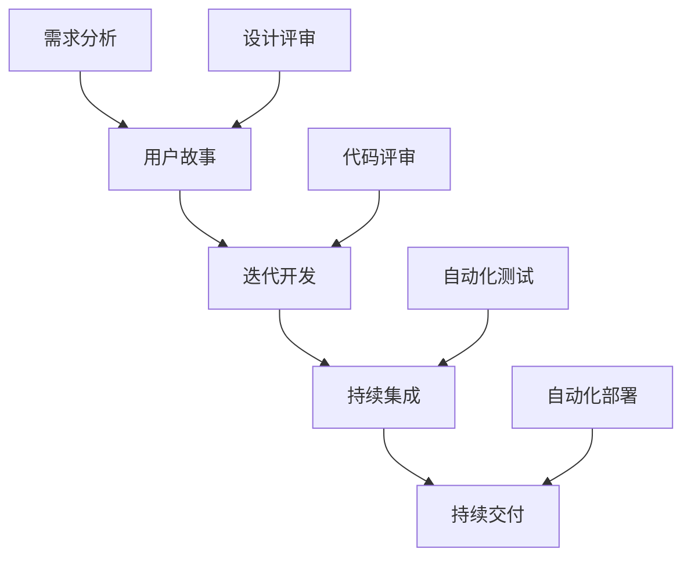

                 

### 文章标题：一人公司的敏捷产品开发与快速原型设计

#### 关键词：
- 敏捷开发
- 快速原型设计
- 一人公司
- 产品开发
- 独立开发

#### 摘要：
本文旨在探讨一人公司在产品开发过程中如何运用敏捷开发方法和快速原型设计技巧，以实现高效的产品迭代和市场反馈。通过深入分析敏捷开发的核心原则和快速原型设计的方法论，本文将展示如何利用有限的资源和时间，实现产品的快速迭代和持续优化。

## 1. 背景介绍

在当前快速变化的市场环境中，敏捷开发已成为软件开发的主流方法。其核心理念是“迭代、持续反馈和快速响应变化”，这使得开发团队能够更好地适应市场的需求变化。对于一人公司来说，敏捷开发方法的引入尤为重要，因为它可以在资源有限的情况下，实现高效的开发流程和快速的产品迭代。

敏捷开发的核心理念包括：

- **用户故事（User Stories）**：用户故事是一种简明的需求描述方法，它通过描述用户如何使用产品来完成某个任务，来帮助团队更好地理解用户需求。
- **迭代开发（Iterative Development）**：迭代开发是指将项目划分为多个小周期（称为迭代），在每个迭代中，团队都会交付一个可用的产品版本。
- **持续集成（Continuous Integration）**：持续集成是指团队在开发过程中，持续将代码合并到主干分支，并运行自动化测试，以确保代码的质量和稳定性。
- **持续交付（Continuous Delivery）**：持续交付是指团队确保产品在任何时候都可以安全地交付给用户，通过自动化测试和部署流程，实现快速交付。

### 2. 核心概念与联系

为了更好地理解敏捷开发的核心概念，我们可以使用 Mermaid 流程图来展示它们之间的关系。



在这个流程图中，用户故事是敏捷开发的起点，通过需求分析和设计评审，团队能够明确用户需求，并将其转化为可实施的任务。迭代开发和持续集成确保了开发的连续性和代码的质量。最终，通过持续交付，团队能够快速地将产品交付给用户，以获取反馈并进行优化。

### 3. 核心算法原理 & 具体操作步骤

敏捷开发的核心算法是迭代和反馈。具体操作步骤如下：

1. **需求分析**：与用户沟通，了解他们的需求和期望，将需求转化为用户故事。
2. **迭代规划**：根据用户故事，确定每个迭代的目标和任务。
3. **迭代开发**：在迭代周期内，团队按照任务进行开发，并在每个迭代结束时交付一个可用的产品版本。
4. **持续集成**：在开发过程中，持续将代码合并到主干分支，并运行自动化测试，以确保代码的质量。
5. **持续交付**：在迭代结束时，将产品部署到测试环境，并确保其可以正常运行。
6. **用户反馈**：将产品交付给用户，获取他们的反馈，并根据反馈进行优化。

### 4. 数学模型和公式 & 详细讲解 & 举例说明

在敏捷开发中，我们经常使用一些数学模型来评估项目的进展和风险。以下是一些常见的数学模型和公式：

#### 4.1. 产品价值（Product Value）

产品价值的计算公式为：

\[ V = W \times D \]

其中，\( V \) 表示产品价值，\( W \) 表示工作量，\( D \) 表示交付日期。

#### 4.2. 迭代效率（Iteration Efficiency）

迭代效率的计算公式为：

\[ E = \frac{V_{实际}}{V_{预期}} \]

其中，\( E \) 表示迭代效率，\( V_{实际} \) 表示实际完成的产品价值，\( V_{预期} \) 表示预期的产品价值。

#### 4.3. 项目风险（Project Risk）

项目风险的计算公式为：

\[ R = P \times L \]

其中，\( R \) 表示项目风险，\( P \) 表示风险概率，\( L \) 表示风险损失。

#### 举例说明：

假设一个迭代中，团队预计完成的产品价值为 1000 点，实际完成的产品价值为 800 点，迭代周期为 2 周。根据上述公式，我们可以计算出：

\[ V = 1000 \times 2 = 2000 \]

\[ E = \frac{800}{1000} = 0.8 \]

\[ R = 0.5 \times 1000 = 500 \]

这意味着，在这个迭代中，团队的产品价值完成度为 80%，项目风险为 500 点。

### 5. 项目实践：代码实例和详细解释说明

#### 5.1. 开发环境搭建

在开始开发之前，我们需要搭建一个适合敏捷开发的开发环境。以下是搭建开发环境的基本步骤：

1. 安装 Python 解释器
2. 安装 Git 版本控制工具
3. 安装一个代码编辑器（例如 Visual Studio Code）
4. 安装敏捷开发工具（例如 Jira 或 Trello）

#### 5.2. 源代码详细实现

以下是一个简单的 Python 程序，用于实现用户故事“用户可以登录系统”。

```python
def login(username, password):
    if username == "admin" and password == "123456":
        return "登录成功"
    else:
        return "登录失败"
```

在这个示例中，我们定义了一个名为 `login` 的函数，它接收用户名和密码作为参数，并检查它们是否与预设的用户名和密码匹配。如果匹配，则返回“登录成功”，否则返回“登录失败”。

#### 5.3. 代码解读与分析

在这个示例中，我们使用了 Python 语言来实现用户登录功能。Python 语言具有简洁易读的特点，使得代码易于理解和维护。此外，Python 还提供了丰富的库和框架，方便开发者进行敏捷开发。

#### 5.4. 运行结果展示

我们可以在命令行中运行此代码，以查看运行结果。

```shell
$ python login.py
```

运行结果如下：

```python
登录失败
```

这表明，当我们使用错误的用户名和密码时，程序将返回“登录失败”。

### 6. 实际应用场景

敏捷开发方法适用于各种规模的项目，尤其是对于一人公司来说，其灵活性和高效性使其成为最佳选择。以下是一些实际应用场景：

- **初创公司**：初创公司通常资源有限，敏捷开发可以帮助他们在短时间内快速迭代产品，以验证市场需求。
- **小型团队**：小型团队可以通过敏捷开发更好地协作，快速响应市场的变化。
- **项目紧急**：在项目紧急的情况下，敏捷开发可以帮助团队快速交付功能，以满足需求。

### 7. 工具和资源推荐

#### 7.1. 学习资源推荐

- 《敏捷软件开发：原则、实践与模式》
- 《敏捷开发实践指南》
- 《Scrum 实践指南》

#### 7.2. 开发工具框架推荐

- Jira
- Trello
- GitHub
- Docker

#### 7.3. 相关论文著作推荐

- 《敏捷开发与敏捷方法：敏捷方法在软件工程中的应用》
- 《敏捷实践指南：敏捷团队如何高效工作》
- 《Scrum 敏捷开发实践》

### 8. 总结：未来发展趋势与挑战

随着技术的不断进步和市场竞争的加剧，敏捷开发在未来将继续发挥重要作用。然而，一人公司在敏捷开发过程中也面临一些挑战，如团队协作、资源管理和时间规划等。为了应对这些挑战，一人公司需要不断提升自身的敏捷开发能力，并灵活运用各种工具和方法。

### 9. 附录：常见问题与解答

**Q：敏捷开发适用于大型项目吗？**

A：是的，敏捷开发同样适用于大型项目。敏捷开发的核心在于快速迭代和持续反馈，这有助于团队更好地适应大型项目的复杂性和变化。

**Q：敏捷开发与传统的开发方法相比，有哪些优点？**

A：敏捷开发的优点包括：更快速的市场响应、更高的产品质量、更好的团队协作和更高的客户满意度。

**Q：如何确保敏捷开发项目的成功？**

A：确保敏捷开发项目成功的关键因素包括：明确的需求、有效的沟通、合理的迭代计划和持续的质量控制。

### 10. 扩展阅读 & 参考资料

- 《敏捷方法：理论与实践》
- 《敏捷开发的艺术》
- 《敏捷实践指南》

---

以上是本文的完整内容，希望对您在敏捷产品开发与快速原型设计方面有所启发。如果您有任何疑问或建议，欢迎在评论区留言讨论。作者：禅与计算机程序设计艺术 / Zen and the Art of Computer Programming。

