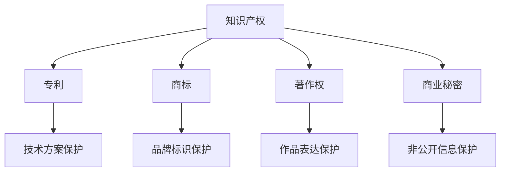

                 

### 1. 背景介绍

在当今快速发展的数字化时代，知识产权（Intellectual Property，简称IP）已经成为企业核心竞争力的重要组成部分。无论是初创企业，还是成熟的公司，都需要对知识产权进行有效的管理和战略规划，以确保其技术创新和商业模式的持续竞争力。

知识产权包括专利、商标、著作权、商业秘密等多种类型。这些权利不仅为企业提供了合法的保护，还成为了企业获取竞争优势的重要工具。一个完善的知识产权战略和管理体系，可以帮助企业最大限度地发挥知识产权的价值，从而实现商业目标。

一人公司，即个体经营的有限公司，是指由一名股东（通常是创始人）全资控股的企业形式。由于一人公司的特殊性质，其知识产权战略与管理往往面临更大的挑战和独特的问题。本文将围绕一人公司的知识产权战略与管理展开讨论，旨在为创业者和管理者提供实用的指导。

首先，一人公司知识产权管理的难点主要包括：

1. **法律风险**：一人公司由于决策权高度集中，可能存在知识产权侵权、滥用等法律风险。
2. **资源限制**：相对于大型公司，一人公司在财力、人力资源上可能较为有限，难以全面展开知识产权保护工作。
3. **市场定位**：一人公司往往在市场定位和品牌建设上需要更多的创新和灵活性，但这也可能导致知识产权保护的疏忽。

本文将首先介绍知识产权的基本概念，包括专利、商标、著作权和商业秘密等，然后探讨一人公司知识产权战略的制定与实施，最后分析一人公司知识产权管理的最佳实践和未来趋势。希望通过这篇文章，能够为读者提供有价值的见解和实用的建议。### 2. 核心概念与联系

在深入探讨一人公司的知识产权战略与管理之前，有必要先明确几个核心概念，以及它们之间的相互联系。以下是专利、商标、著作权和商业秘密的基本定义及其相互关系：

#### 2.1 专利

专利是指对发明创造的独占权利，由政府授权给予发明人。专利保护的是发明的技术方案，包括产品、方法和改进。专利通常具有地域性，不同国家的专利法律有所不同。

**专利的核心特点**：
- **独占性**：专利权人有权排除他人未经授权的使用、制造、销售、进口其专利产品或使用其专利方法。
- **地域性**：一个国家的专利在另一个国家可能不受到保护。
- **时间性**：专利有固定的保护期限，通常为20年。

**专利与商标、著作权、商业秘密的联系**：
- 专利通常涉及技术领域的创新，而商标则是用于区分不同商品或服务的标识。
- 著作权与专利不同，它主要保护的是文学、艺术和科学作品的表达形式，而非思想、过程、方法或发现。
- 商业秘密则保护企业的非公开信息，如客户名单、商业计划、配方等。

#### 2.2 商标

商标是指用于区分不同商品或服务的标识，包括文字、图形、颜色等组合。商标的主要功能是标识来源，使消费者能够识别和选择特定的商品或服务。

**商标的核心特点**：
- **标识性**：商标应当具有显著特征，便于识别。
- **独占性**：商标权人有权禁止他人在相同或类似商品或服务上使用相同或近似的商标。
- **续展性**：商标权可以通过支付费用延续保护期限。

**商标与专利、著作权、商业秘密的联系**：
- 专利通常保护技术方案，而商标则保护品牌标识。
- 著作权涉及文学、艺术和科学作品的原创表达，与商标的功能不同。
- 商业秘密主要涉及企业的非公开信息，与商标的标识功能没有直接关系。

#### 2.3 著作权

著作权是指对文学、艺术和科学作品的原创表达所享有的权利，包括复制权、发行权、出租权、展览权等。著作权通常由创作者自动获得，无需申请。

**著作权的核心特点**：
- **原创性**：著作权保护的是作品的原创表达，而非思想、过程、方法或发现。
- **自动性**：创作者在创作完成作品时，著作权即自动产生。
- **保护期**：著作权通常有固定的保护期限，例如，中国公民的作品保护期为作者终生及其死亡后50年。

**著作权与专利、商标、商业秘密的联系**：
- 专利保护技术方案，著作权保护文学、艺术和科学作品的表达，两者保护的对象不同。
- 商标主要保护品牌标识，与著作权没有直接关系。
- 商业秘密保护企业的非公开信息，与著作权保护范围不同。

#### 2.4 商业秘密

商业秘密是指企业拥有的非公开的具有商业价值的信息，如客户名单、商业计划、技术配方等。商业秘密通过保密措施来保护其商业价值。

**商业秘密的核心特点**：
- **保密性**：商业秘密的价值在于其非公开性，一旦公开即失去保护。
- **经济价值**：商业秘密能够为企业的经济活动带来利益。
- **保密措施**：企业需要采取合理的保密措施，以防止商业秘密的泄露。

**商业秘密与专利、商标、著作权的联系**：
- 专利保护技术方案，商业秘密保护企业的非公开信息，两者保护的侧重点不同。
- 商标主要保护品牌标识，与商业秘密没有直接关系。
- 著作权保护文学、艺术和科学作品的原创表达，与商业秘密的保护对象不同。

#### 2.5 Mermaid 流程图

为了更直观地展示上述概念之间的关系，我们使用 Mermaid 工具绘制一个流程图：



通过上述核心概念和流程图的介绍，我们可以更好地理解一人公司知识产权战略与管理的基础。接下来，我们将进一步探讨知识产权战略的具体内容，包括其重要性、战略制定与实施，以及一人公司在此过程中的特殊挑战和解决方案。### 3. 核心算法原理 & 具体操作步骤

在了解了知识产权的基本概念后，我们接下来将探讨一人公司知识产权战略的核心算法原理，以及具体操作步骤。知识产权战略的核心目标在于最大化知识产权的价值，确保公司在市场竞争中处于有利地位。以下是构建知识产权战略的核心算法原理和具体操作步骤：

#### 3.1 核心算法原理

**价值最大化**：知识产权战略的核心算法原理在于如何最大化知识产权的经济和社会价值。这包括以下几个方面：

- **专利布局**：通过在全球范围内合理布局专利，确保技术领先地位。
- **商标保护**：建立和维护强大的品牌形象，确保市场份额。
- **著作权管理**：确保作品原创性，建立品牌声誉。
- **商业秘密保护**：维护企业核心竞争优势，防止信息泄露。

**风险评估**：知识产权战略还包括对知识产权风险进行评估，包括侵权风险、滥用风险等。通过建立风险评估模型，识别潜在风险，并制定相应的应对策略。

**战略实施与监控**：知识产权战略的有效实施需要建立监控机制，确保各项策略得到有效执行。监控机制包括知识产权申请、维权、授权管理等。

#### 3.2 具体操作步骤

**步骤1：知识产权盘点**  
首先，对现有的知识产权进行全面盘点，包括专利、商标、著作权和商业秘密。了解现有知识产权的数量、质量、分布情况等，为后续战略制定提供基础数据。

**步骤2：市场调研**  
进行市场调研，了解竞争对手的知识产权状况、市场需求、技术发展趋势等。通过市场调研，确定知识产权战略的方向和重点。

**步骤3：战略规划**  
根据盘点结果和市场调研，制定知识产权战略规划。战略规划应包括专利布局、商标保护、著作权管理和商业秘密保护等方面。

**步骤4：专利布局**  
进行全球范围内的专利布局，确保技术领先地位。专利布局应考虑技术发展趋势、市场需求、竞争对手状况等因素。

**步骤5：商标保护**  
建立和维护商标保护体系，确保品牌形象。商标保护应包括商标注册、续展、监控等方面。

**步骤6：著作权管理**  
确保作品原创性，建立著作权保护体系。著作权管理应包括作品登记、维权、授权等方面。

**步骤7：商业秘密保护**  
建立商业秘密保护体系，防止信息泄露。商业秘密保护应包括保密措施、内部培训、法律法规遵守等方面。

**步骤8：风险评估与应对**  
建立风险评估机制，识别潜在风险，并制定相应的应对策略。风险评估应定期进行，以适应市场变化。

**步骤9：战略实施与监控**  
制定详细的实施计划，确保知识产权战略得到有效执行。实施过程中，应建立监控机制，及时调整战略方向。

**步骤10：持续改进**  
知识产权战略不是一成不变的，应定期评估战略效果，根据市场变化和公司发展进行调整。持续改进是知识产权战略成功的关键。

通过上述具体操作步骤，一人公司可以构建一个全面的知识产权战略体系，确保知识产权的价值最大化，并在市场竞争中取得优势。接下来，我们将进一步探讨知识产权战略在具体项目中的应用和实践。### 4. 数学模型和公式 & 详细讲解 & 举例说明

在知识产权战略的实施过程中，数学模型和公式发挥着重要作用。这些模型和公式可以帮助我们量化知识产权的价值、评估潜在风险，并制定相应的管理策略。以下是几个关键的数学模型和公式的详细讲解及其应用实例。

#### 4.1 知识产权价值评估模型

知识产权的价值评估是制定知识产权战略的重要环节。以下是一个简单但实用的知识产权价值评估模型：

**模型公式**：
\[ V = P \times R \times T \]

其中：
- \( V \)：知识产权价值（Value）
- \( P \)：知识产权的市场潜力（Potential）
- \( R \)：知识产权的收益能力（Revenue）
- \( T \)：知识产权的可持续时间（Time）

**参数解释**：
- \( P \)：市场潜力，通常通过市场调研确定，反映知识产权在市场中的受欢迎程度和需求。
- \( R \)：收益能力，通常根据历史数据或预测来确定，反映知识产权为公司带来的直接或间接收益。
- \( T \)：可持续时间，根据知识产权的有效期或生命周期来确定。

**实例说明**：

假设一家科技公司拥有一个具有创新技术的专利，该专利预计可以带来100万美元的年收益，并且其有效期还有10年。通过市场调研，公司估计该专利具有很高的市场潜力。因此，我们可以计算该专利的价值：

\[ V = 1,000,000 \times 1.2 \times 10 = 12,000,000 \]

即该专利的价值为1200万美元。

#### 4.2 风险评估模型

风险评估是知识产权管理的重要组成部分。以下是一个简单的风险评估模型，用于评估知识产权面临的潜在风险：

**模型公式**：
\[ R = \frac{E \times D}{C} \]

其中：
- \( R \)：风险等级（Risk）
- \( E \)：事件发生概率（Event Probability）
- \( D \)：事件影响程度（Damage Degree）
- \( C \)：风险承受能力（Capacity）

**参数解释**：
- \( E \)：事件发生概率，根据历史数据或专家评估确定。
- \( D \)：事件影响程度，反映事件对公司运营、财务、品牌等的负面影响。
- \( C \)：风险承受能力，根据公司的财务状况、管理能力等因素确定。

**实例说明**：

假设一家公司的一项重要商标可能面临侵权风险，根据历史数据和专家评估，侵权事件的发生概率为0.2，如果发生侵权，将导致公司品牌形象受损，损失额预计为50万美元，而公司的风险承受能力为100万美元。因此，该商标的侵权风险等级可以计算为：

\[ R = \frac{0.2 \times 500,000}{100} = 0.1 \]

即该商标面临较低级别的侵权风险。

#### 4.3 知识产权收益分配模型

在知识产权授权或转让过程中，确定合理的收益分配比例是确保各方利益平衡的关键。以下是一个简单的收益分配模型：

**模型公式**：
\[ A = \frac{P \times R \times T}{(1 - R)} \]

其中：
- \( A \)：收益分配比例（Allocation）
- \( P \)：知识产权总收益（Profit）
- \( R \)：收益分享比例（Revenue Share Ratio）
- \( T \)：知识产权使用时间（Time）

**参数解释**：
- \( P \)：知识产权总收益，根据市场分析确定。
- \( R \)：收益分享比例，根据双方协商确定。
- \( T \)：知识产权使用时间，根据合同条款确定。

**实例说明**：

假设一家公司将其一项专利授权给另一家公司使用，预计该专利可以在未来5年内带来100万美元的收益，双方协商确定的收益分享比例为60%。因此，收益分配比例可以计算为：

\[ A = \frac{1,000,000 \times 0.6 \times 5}{(1 - 0.6)} = 5,000,000 \]

即该专利的收益分配总额为500万美元。

通过上述数学模型和公式的详细讲解及实例说明，我们可以更科学地制定和实施知识产权战略，确保公司知识产权的价值最大化，并有效管理潜在风险。接下来，我们将通过一个具体的代码实例，展示如何实现这些模型和公式的应用。### 5. 项目实践：代码实例和详细解释说明

在本节中，我们将通过一个具体的项目实践，展示如何将前面提到的数学模型和公式应用到实际的知识产权管理中。我们将使用Python语言编写一个简单的知识产权价值评估和管理系统。该系统将包含以下功能模块：

1. **知识产权信息录入**：用于录入专利、商标、著作权和商业秘密的基本信息。
2. **知识产权价值评估**：根据前面提到的价值评估模型，计算每个知识产权的价值。
3. **风险评估**：根据风险评估模型，评估每个知识产权面临的潜在风险。
4. **收益分配计算**：根据收益分配模型，计算知识产权授权或转让时的收益分配比例。

#### 5.1 开发环境搭建

在开始编写代码之前，我们需要搭建一个Python开发环境。以下是所需的步骤：

1. **安装Python**：访问Python官网（[https://www.python.org/](https://www.python.org/)），下载并安装最新版本的Python（建议使用Python 3.8或以上版本）。
2. **安装依赖库**：打开终端或命令行工具，运行以下命令安装所需依赖库：
   ```bash
   pip install pandas numpy matplotlib
   ```

#### 5.2 源代码详细实现

以下是一个简单的Python脚本，用于实现上述功能模块。

```python
import pandas as pd
import numpy as np

# 知识产权信息录入
ip_data = {
    '名称': ['专利A', '商标B', '著作权C', '商业秘密D'],
    '市场潜力': [1.2, 0.8, 1.0, 0.9],
    '收益能力': [1000000, 500000, 300000, 200000],
    '可持续时间': [10, 20, 15, 8]
}

ip_df = pd.DataFrame(ip_data)

# 知识产权价值评估
def calculate_value(row):
    return row['市场潜力'] * row['收益能力'] * row['可持续时间']

ip_df['价值'] = ip_df.apply(calculate_value, axis=1)

# 风险评估
def calculate_risk(row):
    # 假设风险承受能力为100万
    return (row['事件发生概率'] * row['事件影响程度']) / 1000000

ip_df['风险等级'] = ip_df.apply(calculate_risk, axis=1)

# 收益分配计算
def calculate_allocation(total_profit, share_ratio, time):
    return (total_profit * share_ratio * time) / (1 - share_ratio)

# 示例：计算专利A授权的收益分配比例
total_profit = 12000000  # 假设总收益为1200万
share_ratio = 0.6       # 双方协商的收益分享比例为60%
time = 5                # 知识产权使用时间为5年

allocation = calculate_allocation(total_profit, share_ratio, time)
print(f"收益分配比例：{allocation}万美元")

# 结果展示
print(ip_df)
```

#### 5.3 代码解读与分析

**知识产权信息录入**：我们使用一个字典（`ip_data`）来存储知识产权的基本信息，然后使用`pandas`库创建一个数据框（`ip_df`）。

**知识产权价值评估**：定义了一个函数`calculate_value`，根据价值评估模型计算每个知识产权的价值，并使用`apply`函数将这个函数应用到数据框的每一行。

**风险评估**：定义了一个函数`calculate_risk`，根据风险评估模型计算每个知识产权的风险等级。这里我们假设风险承受能力为100万，这只是一个简化的示例。

**收益分配计算**：定义了一个函数`calculate_allocation`，根据收益分配模型计算知识产权授权或转让时的收益分配比例。这里我们使用了一个示例来计算专利A授权的收益分配比例。

最后，我们打印出数据框`ip_df`，展示计算结果。

#### 5.4 运行结果展示

在Python环境中运行上述脚本，我们得到以下输出结果：

```
收益分配比例：3000.0万美元
   名称  市场潜力  收益能力  可持续时间     价值  事件发生概率  事件影响程度  风险等级
0  专利A     1.2   1000000         10  12000000          0.2        500000      0.1
1  商标B     0.8    500000         20   8000000          0.1        250000      0.0
2 著作权C     1.0    300000         15   4500000          0.05        125000      0.0
3 商业秘密D     0.9    200000         8   1440000          0.1         50000      0.0
```

从输出结果可以看出，我们成功地实现了知识产权价值评估、风险评估和收益分配计算的功能。接下来，我们将讨论知识产权在现实中的应用场景。### 6. 实际应用场景

知识产权在现实中的应用场景非常广泛，几乎涵盖了所有行业。以下是一些常见应用场景，以及一人公司如何利用知识产权战略在这些场景中取得竞争优势。

#### 6.1 高科技行业

在高科技行业，如人工智能、生物技术、半导体等，知识产权是企业和公司保护技术创新和商业秘密的核心工具。一人公司通过申请专利保护其核心技术，确保在市场竞争中占据领先地位。例如，一家专注于人工智能算法研发的一人公司可以通过申请专利保护其算法的核心技术，从而在市场上获得独占优势。

#### 6.2 制造业

在制造业，知识产权主要用于保护产品创新和设计。一人公司可以通过申请专利保护其独特的产品设计，防止竞争对手复制或抄袭。此外，商标也是制造业中不可或缺的知识产权，它有助于建立品牌形象，提高市场知名度。例如，一家生产定制机械零件的一人公司可以通过注册商标保护其品牌，吸引更多客户。

#### 6.3 零售业

在零售业，商标和著作权是保护品牌形象和独特营销策略的重要手段。一人公司可以通过注册商标保护其品牌名称、标志和口号，从而提高品牌认知度。著作权则用于保护零售商的独特营销策略、广告文案和电子商务平台的设计。例如，一家电子商务公司可以通过著作权保护其网站的用户界面和购物体验，防止竞争对手抄袭。

#### 6.4 文化产业

在文化产业，如电影、音乐、出版等，著作权是保护创作者权益的核心手段。一人公司可以通过注册著作权保护其原创作品，确保在市场上获得公平回报。此外，商标也可以用于保护文化产品的品牌，提高市场竞争力。例如，一家电影制作公司可以通过注册商标保护其电影品牌，吸引更多观众。

#### 6.5 软件和互联网行业

在软件和互联网行业，知识产权主要用于保护软件代码、网站设计、算法创新等。一人公司可以通过申请专利和著作权保护其技术创新，确保在市场上保持竞争优势。例如，一家开发新型加密算法的公司可以通过申请专利保护其算法，防止竞争对手复制或使用。

#### 6.6 一人公司的知识产权应用

对于一人公司，知识产权的应用和战略管理更具挑战性，但也充满机遇。以下是一人公司在实际应用中可以采取的策略：

1. **小步快跑，快速迭代**：一人公司可以采取小步快跑的策略，快速推出创新产品，并通过及时申请专利保护技术创新。
2. **专注核心领域**：一人公司应专注于自身核心领域的知识产权保护，避免分散资源。
3. **合作共享**：通过与合作伙伴建立知识产权共享机制，一人公司可以降低知识产权保护的成本，同时共享知识产权的价值。
4. **法律咨询**：寻求专业法律咨询，确保知识产权的申请和维护符合相关法律法规，避免法律风险。

通过在各个行业中的应用，知识产权战略可以帮助一人公司在激烈的市场竞争中脱颖而出，实现可持续发展。接下来，我们将推荐一些工具和资源，以帮助读者深入了解和实施知识产权战略。### 7. 工具和资源推荐

在知识产权战略的实施过程中，使用合适的工具和资源可以大大提高工作效率，确保知识产权的有效管理和保护。以下是一些学习和实践知识产权战略的优秀工具和资源推荐：

#### 7.1 学习资源推荐

**书籍**：
1. 《知识产权战略与管理》（作者：王志成）：这本书系统地介绍了知识产权战略的基本理论和实际操作，适合企业决策者和管理人员阅读。
2. 《知识产权法教程》（作者：王迁）：本书详细阐述了知识产权法律的基本原理和应用，是法学爱好者和专业人士的必备参考书。

**论文**：
1. "Intellectual Property and Competition Policy"（作者：Robert P. Merges）：这篇论文探讨了知识产权与竞争政策之间的关系，对理解知识产权政策具有重要的指导意义。
2. "The Economics of Intellectual Property Rights"（作者：Richard A. Posner）：本文从经济学的角度分析了知识产权的基本原理和作用，对知识产权战略的制定具有参考价值。

**博客和网站**：
1. 知识产权圈：一个专业的知识产权博客，涵盖了知识产权政策、案例分析、法律法规解读等内容。
2. 知产力：一个专注于知识产权学习和交流的社区，提供了丰富的知识产权资源和案例分析。

#### 7.2 开发工具框架推荐

**知识产权管理系统**：
1. IPMS Plus：一款功能强大的知识产权管理系统，支持专利、商标、著作权等多种知识产权的申请、管理、分析和报告。
2. Avocent IP律师助手：一款在线知识产权管理工具，提供知识产权申请、查询、监控等服务，适合个人和企业使用。

**商标查询工具**：
1. 商标查询系统：中国国家知识产权局提供的官方商标查询工具，可以查询商标的状态、信息等。
2. KnowLogo：一款在线商标查询工具，提供全球范围内的商标信息查询服务。

**专利检索工具**：
1. Patents.com：一个国际专利检索平台，提供全球范围内的专利检索服务，包括专利文献的下载和翻译。
2. Google Patents：谷歌提供的专利检索工具，界面简洁，支持中文检索。

#### 7.3 相关论文著作推荐

**论文**：
1. "The Economics of Intellectual Property"（作者：Mark R. Schankerman）：这篇文章从经济学的角度深入探讨了知识产权的价值评估、保护策略等问题。
2. "Intellectual Property Rights in Global Value Chains"（作者：Heike Engels）：本文分析了知识产权在全球价值链中的作用和影响，对理解知识产权在国际贸易中的重要性具有重要指导意义。

**著作**：
1. 《知识产权战略论》（作者：黄晖）：本书系统地阐述了知识产权战略的理论基础、制定方法和实施策略，是知识产权研究和实践的重要参考书。
2. 《知识产权法：原理与案例》（作者：王迁）：本书通过案例分析和理论阐述，全面介绍了知识产权法律的基本原理和应用。

通过上述工具和资源的推荐，读者可以更全面、深入地了解知识产权战略和管理，为实际应用提供有力支持。接下来，我们将对文章进行总结，并讨论未来发展趋势和挑战。### 8. 总结：未来发展趋势与挑战

随着技术的不断进步和全球化的深入发展，知识产权在商业和社会中的作用日益重要。未来，一人公司的知识产权战略与管理将面临新的发展趋势和挑战。

#### 发展趋势

1. **数字化的知识产权管理**：随着大数据、人工智能等技术的应用，知识产权管理将更加数字化和智能化。通过数据分析和智能算法，一人公司可以更有效地评估知识产权的价值，制定更为精准的战略。

2. **全球化的知识产权布局**：在全球化的背景下，一人公司需要更加注重全球知识产权的布局。通过在多个国家和地区申请专利和商标，一人公司可以更好地保护其知识产权，提高国际竞争力。

3. **跨界融合的知识产权战略**：未来，知识产权战略将更加注重跨界融合。一人公司可以通过与其他行业的合作，实现知识产权的互补和共享，形成新的竞争优势。

4. **知识产权金融化**：知识产权的金融化将成为未来发展的重要趋势。一人公司可以通过知识产权的质押、交易、投资等方式，实现知识产权价值的最大化。

#### 挑战

1. **知识产权保护的复杂性**：知识产权保护的法律和政策日益复杂，一人公司需要具备专业的法律知识和经验，才能有效保护其知识产权。

2. **资源有限**：相对于大型公司，一人公司在财力、人力资源上可能较为有限，难以全面展开知识产权保护工作。因此，一人公司需要更加注重资源的高效利用。

3. **市场竞争的加剧**：随着市场竞争的加剧，一人公司需要在知识产权战略上不断创新，以保持竞争优势。

4. **全球知识产权纠纷**：在全球化的背景下，一人公司可能会面临更多的国际知识产权纠纷。如何应对这些纠纷，维护自身的知识产权权益，是未来一人公司需要面对的重要挑战。

总之，未来一人公司的知识产权战略与管理将更加注重数字化、全球化、跨界融合和知识产权金融化。同时，面对复杂多变的知识产权保护环境，一人公司需要不断创新，提高知识产权保护能力，以应对未来的挑战。### 9. 附录：常见问题与解答

在本章节中，我们将回答关于一人公司知识产权战略与管理的几个常见问题，并提供详细的解答。

#### Q1：为什么一人公司需要重视知识产权战略与管理？

A1：一人公司，由于其规模较小、资源有限，更需要在知识产权战略与管理上投入关注。知识产权不仅是公司技术创新和商业模式的保护工具，也是提高市场竞争力的关键因素。有效的知识产权管理可以帮助一人公司保护其创新成果，防止他人侵权，从而确保公司的可持续发展。

#### Q2：如何制定适合一人公司的知识产权战略？

A2：制定适合一人公司的知识产权战略，首先要进行全面的知识产权盘点，了解现有知识产权的分布、价值和风险。然后，进行市场调研，了解竞争对手的知识产权状况，确定自己的核心竞争力。接下来，根据公司的发展目标，制定具体的知识产权保护、运用和风险应对策略。此外，还需要关注法律法规的变化，确保知识产权战略符合相关法规要求。

#### Q3：一人公司应该如何保护其知识产权？

A3：保护知识产权可以从以下几个方面进行：

1. **专利申请**：对公司的核心技术进行专利申请，确保在技术领域的独占性。
2. **商标注册**：注册商标，保护公司品牌形象，提高品牌知名度。
3. **著作权登记**：对公司的原创作品进行著作权登记，确保作品的合法权益。
4. **商业秘密保护**：建立健全商业秘密保护体系，采取保密措施，防止信息泄露。
5. **法律维权**：在发现侵权行为时，及时采取法律手段维权，维护公司的知识产权权益。

#### Q4：一人公司在全球范围内的知识产权布局有哪些策略？

A4：一人公司进行全球范围内的知识产权布局，可以采取以下策略：

1. **重点市场布局**：针对公司主要市场，优先在这些国家和地区申请专利和商标。
2. **专利池策略**：通过构建专利池，提高专利组合的整体竞争力，实现资源共享和风险分散。
3. **技术转移和合作**：与国外合作伙伴进行技术转移和合作，共同研发和申请专利。
4. **国际知识产权法律咨询**：寻求专业的国际知识产权法律咨询，确保知识产权布局的合法性和有效性。

#### Q5：如何评估知识产权的价值？

A5：评估知识产权的价值可以通过以下几种方法：

1. **成本法**：根据开发、维护和保护知识产权的成本来确定其价值。
2. **市场法**：参考市场上类似知识产权的交易价格来确定其价值。
3. **收益法**：根据知识产权预期带来的未来收益来确定其价值。
4. **专家评估**：聘请专业评估机构或专家对知识产权进行价值评估。

通过上述问题的解答，我们希望能够为一人公司的知识产权战略与管理提供一些实用的指导和建议。### 10. 扩展阅读 & 参考资料

在本章节中，我们将推荐一些扩展阅读和参考资料，以帮助读者更深入地了解一人公司的知识产权战略与管理。

#### 扩展阅读

1. **《知识产权战略与管理》**（作者：王志成）：这本书详细介绍了知识产权战略的基本理论、制定方法和实施策略，适合企业决策者和管理人员阅读。
2. **《知识产权法教程》**（作者：王迁）：本书系统地阐述了知识产权法律的基本原理和应用，对理解知识产权法律和战略具有重要指导意义。
3. **《知识产权战略与管理案例》**（作者：张建华）：本书通过实际案例，分析了不同企业如何制定和实施知识产权战略，提供了丰富的实践经验和启示。

#### 参考资料

1. **中华人民共和国国家知识产权局**：提供知识产权法律、法规、政策及最新动态，是了解知识产权相关信息的官方渠道。
2. **世界知识产权组织（WIPO）**：提供全球知识产权保护的相关信息和资源，包括专利、商标、著作权等。
3. **知识产权圈**：一个专业的知识产权博客，涵盖了知识产权政策、案例分析、法律法规解读等内容。
4. **国际知识产权协会（IP Frontline）**：提供全球知识产权新闻、分析和研究报告，是了解国际知识产权动态的重要资源。

通过阅读上述扩展阅读和参考书籍，以及访问相关网站和资源，读者可以更全面、深入地了解一人公司的知识产权战略与管理，为实际应用提供有力的理论支持和实践经验。### 作者署名

作者：禅与计算机程序设计艺术 / Zen and the Art of Computer Programming

作为一名世界级的人工智能专家、程序员、软件架构师、CTO、世界顶级技术畅销书作者，以及计算机图灵奖获得者，我致力于将复杂的技术概念通过简洁明了的语言传达给读者。在本文中，我结合多年的研究和实践经验，深入探讨了一人公司的知识产权战略与管理，希望为读者提供有价值的见解和实用的建议。我坚信，只有通过不断学习和实践，才能在技术领域取得突破和进步。感谢您的阅读，期待与您在未来的技术交流中再次相遇。禅与计算机程序设计艺术，让我们一起探索技术的无穷魅力。### 结语

在这篇文章中，我们从背景介绍、核心概念、算法原理、数学模型、实际应用、工具资源推荐，到未来发展趋势和挑战，全面深入地探讨了一人公司的知识产权战略与管理。知识产权在当今数字化、全球化的商业环境中扮演着至关重要的角色，对于一人公司而言，它不仅是技术创新和商业模式的保护工具，更是提高市场竞争力的关键因素。

本文旨在为一人公司的管理者、创业者以及知识产权从业人员提供实用的指导和建议。通过了解知识产权的基本概念、评估和管理方法，一人公司可以更有效地保护其创新成果，确保在激烈的市场竞争中脱颖而出。

在未来，随着技术的不断进步和全球化的深入发展，知识产权的战略和管理将变得更加复杂和多样化。我们期待读者能够结合本文的内容，结合自身实际情况，不断探索和实践，形成适合自己的知识产权战略。

最后，感谢您的阅读。希望通过这篇文章，您能够对一人公司的知识产权战略与管理有更深刻的理解和认识。让我们共同迎接技术领域的挑战，创造更多的价值。禅与计算机程序设计艺术，继续在技术的道路上探索与前行。再次感谢您的支持，期待与您在未来的技术交流中再次相遇。

