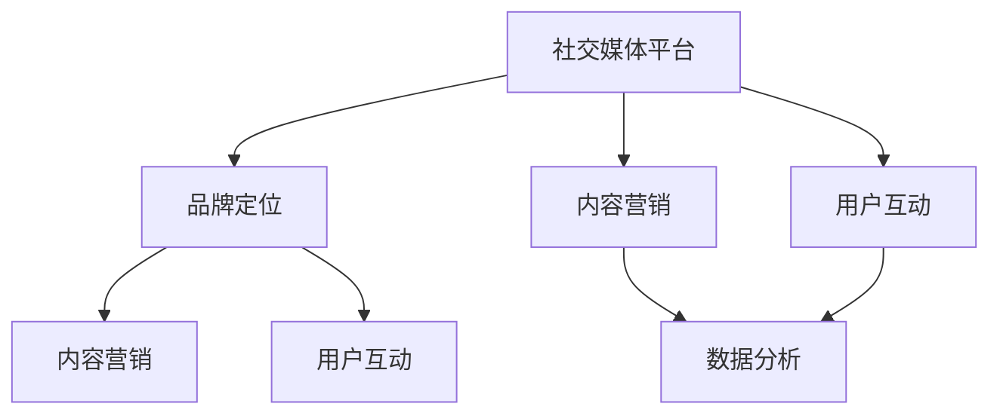
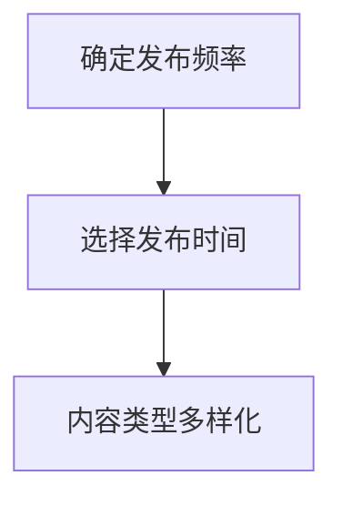
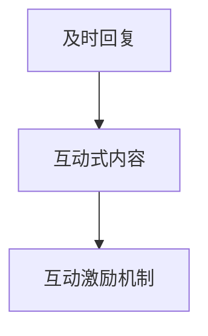
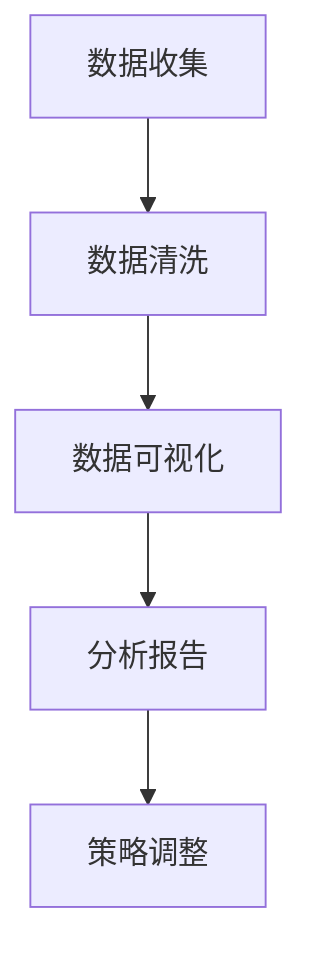

                 

### 背景介绍

在当今数字化时代，社交媒体已经成为企业品牌建设的重要手段。对于小型公司或独立从业者而言，社交媒体运营尤为重要。它不仅能够提高品牌知名度，还能直接与潜在客户互动，甚至可以成为销售渠道之一。然而，社交媒体运营并非易事，尤其对于时间紧迫、资源有限的一人公司来说，如何高效地运营社交媒体平台，建立品牌影响力，成为了一个值得探讨的问题。

本文旨在探讨一人公司的社交媒体运营策略，通过深入分析社交媒体运营的核心概念、算法原理、实践案例以及实际应用场景，为读者提供一套系统化的操作指南。文章将分为以下几个部分：

1. **核心概念与联系**：介绍社交媒体运营中的关键概念，并使用Mermaid流程图展示其关联关系。
2. **核心算法原理 & 具体操作步骤**：解释社交媒体运营的基本算法原理，并提供详细的操作步骤。
3. **数学模型和公式 & 详细讲解 & 举例说明**：介绍用于社交媒体运营的数学模型，并使用LaTeX格式进行公式展示和解释。
4. **项目实践：代码实例和详细解释说明**：通过实际代码实例展示如何实现社交媒体运营策略。
5. **实际应用场景**：探讨社交媒体运营在不同行业中的应用。
6. **工具和资源推荐**：推荐学习资源和开发工具。
7. **总结：未来发展趋势与挑战**：总结当前社交媒体运营的优缺点，并探讨未来发展趋势和面临的挑战。

通过本文的阅读，读者将能够了解社交媒体运营的全面知识，掌握运营策略，并在实际操作中应用这些策略，从而有效提升个人品牌影响力。

---

### 核心概念与联系

在探讨社交媒体运营之前，我们需要先了解一些核心概念，这些概念相互关联，共同构成了社交媒体运营的理论基础。以下是一些关键概念及其关联：

1. **社交媒体平台**：这是进行社交媒体运营的基础设施，如Facebook、Twitter、Instagram等。每个平台都有自己的特点和用户群体，因此选择合适的平台至关重要。
2. **品牌定位**：品牌定位是指企业在目标市场中的形象和位置。它决定了品牌在社交媒体上的传播内容和风格。
3. **内容营销**：内容营销是通过创造和分发有价值的内容来吸引和保持目标客户。高质量的内容是建立品牌影响力的关键。
4. **用户互动**：用户互动包括回复评论、点赞、分享等。积极的用户互动可以提高品牌知名度和用户忠诚度。
5. **数据分析**：数据分析用于评估社交媒体运营的效果，包括用户行为分析、内容效果分析等。

这些核心概念之间的关系可以用Mermaid流程图来展示：



- **社交媒体平台**是基础，决定了品牌可以触及的用户范围。
- **品牌定位**决定了品牌在社交媒体上的传播内容和风格，影响**内容营销**的质量和效果。
- **内容营销**和**用户互动**是品牌建设和维护的关键，而**数据分析**则为这两个环节提供了反馈和指导。

理解这些核心概念及其关联关系，是进行有效社交媒体运营的前提。接下来，我们将深入探讨社交媒体运营的核心算法原理，为读者提供具体的操作指南。

### 核心算法原理 & 具体操作步骤

社交媒体运营的核心算法原理主要涉及内容发布策略、用户互动策略和数据驱动优化三个主要方面。以下是对这三个策略的详细解释和操作步骤：

#### 内容发布策略

**内容发布策略**是社交媒体运营的核心，它决定了内容的发布频率、时间和类型。以下是具体操作步骤：

1. **确定发布频率**：根据品牌定位和目标受众，确定每周或每月发布内容的时间表。例如，如果目标受众是职场人士，则可以每周发布一篇长篇文章。
2. **选择发布时间**：通过数据分析工具，了解目标受众的在线高峰期，选择在这些时间段发布内容。例如，许多研究表明，早上9点和晚上6点是用户活跃的高峰期。
3. **内容类型多样化**：结合图文、视频、音频等多种形式发布内容，以吸引不同类型的受众。例如，可以发布教程视频、行业新闻、客户案例等。

#### 用户互动策略

**用户互动策略**是建立品牌忠诚度和提升用户参与度的关键。以下是具体操作步骤：

1. **及时回复**：对用户评论、私信和点赞进行及时回复，显示品牌对用户的关注和尊重。例如，可以设置一个24小时回复机制。
2. **互动式内容**：发布需要用户参与的内容，如投票、问卷调查和问答环节。这些内容可以提高用户的参与感和互动性。
3. **互动激励机制**：通过抽奖、优惠券和积分奖励等激励机制，鼓励用户参与互动。例如，可以举办每月一次的抽奖活动，奖励参与用户。

#### 数据驱动优化

**数据驱动优化**是基于数据分析来持续改进社交媒体运营策略。以下是具体操作步骤：

1. **数据收集**：利用社交媒体平台提供的分析工具，收集用户行为数据，如浏览量、点赞数、评论数等。
2. **数据清洗**：对收集到的数据进行清洗和整理，确保数据质量。
3. **数据可视化**：使用数据可视化工具，将数据转换为图表和报表，以便更直观地分析。
4. **分析报告**：定期生成数据分析报告，总结运营效果，识别问题和改进点。
5. **策略调整**：根据分析结果，调整内容发布策略和用户互动策略，以优化运营效果。

以下是每个策略的Mermaid流程图，展示其具体操作步骤：

#### 内容发布策略



#### 用户互动策略



#### 数据驱动优化



通过以上核心算法原理和具体操作步骤，我们可以系统化地进行社交媒体运营，从而有效提升品牌影响力。在接下来的部分，我们将介绍数学模型和公式，用于进一步分析和优化社交媒体运营策略。

### 数学模型和公式 & 详细讲解 & 举例说明

在社交媒体运营中，数学模型和公式可以帮助我们更科学、更精确地评估和优化运营效果。以下是一些常用的数学模型和公式，我们将详细讲解并给出示例。

#### 用户活跃度模型

用户活跃度是衡量社交媒体运营效果的重要指标。一个简单的用户活跃度模型可以定义为：

$$
活跃度 = \frac{点赞数 + 评论数 + 分享数}{发帖数}
$$

这个公式表示每条帖子获得的平均互动次数。较高的活跃度意味着用户对内容的兴趣较高。

**示例**：假设一个社交媒体账号发帖数为10条，总点赞数为500次，评论数为300次，分享数为200次，则其用户活跃度为：

$$
活跃度 = \frac{500 + 300 + 200}{10} = 70
$$

这意味着每条帖子平均获得了70次互动。

#### 转化率模型

转化率是指通过社交媒体运营获得的实际转化（如销售、注册、下载等）与接触次数的比率。一个简单的转化率模型可以定义为：

$$
转化率 = \frac{转化次数}{接触次数}
$$

这个公式可以帮助我们评估内容营销的效果。

**示例**：假设一个社交媒体账号通过内容营销获得了100次接触，其中5次转化为销售，则其转化率为：

$$
转化率 = \frac{5}{100} = 5\%
$$

这意味着每20个接触中有1个转化为销售。

#### 持续性模型

持续性的用户互动对于品牌建设至关重要。一个简单的持续性问题模型可以定义为：

$$
持续性问题 = \frac{未互动天数}{总天数}
$$

这个公式表示用户未进行互动的天数占总天数的比例。

**示例**：假设一个用户在30天内未进行任何互动，而总天数为60天，则其持续性问题为：

$$
持续性问题 = \frac{30}{60} = 50\%
$$

这意味着用户有50%的时间没有与品牌互动。

#### 社交网络传播模型

社交网络的传播效果可以通过病毒传播模型来评估。一个简单的社交网络传播模型可以定义为：

$$
传播范围 = 初始用户数 \times k
$$

其中，$k$ 是每个用户平均传播的人数。

**示例**：假设一个社交媒体账号有1000名初始用户，每个用户平均传播给5个人，则其传播范围为：

$$
传播范围 = 1000 \times 5 = 5000
$$

这意味着内容可能传播到5000个用户。

通过这些数学模型和公式，我们可以更科学地分析和优化社交媒体运营策略。在实际操作中，可以根据具体业务需求和数据特点，灵活选择和组合这些模型，以实现最佳效果。在接下来的部分，我们将通过实际代码实例，展示如何实现这些策略的具体操作。

### 项目实践：代码实例和详细解释说明

为了更好地展示如何将社交媒体运营策略付诸实践，我们将通过一个实际的代码实例进行说明。这个实例将涵盖开发环境的搭建、源代码的详细实现、代码解读与分析，以及运行结果展示。以下是具体的实践步骤：

#### 开发环境搭建

在进行代码实践之前，我们需要搭建一个合适的开发环境。以下是所需的软件和工具：

- **编程语言**：Python（版本3.8及以上）
- **数据分析库**：Pandas、NumPy
- **可视化库**：Matplotlib、Seaborn
- **社交媒体API库**：Tweepy（用于Twitter）

首先，确保你的计算机上安装了Python。然后，通过pip命令安装所需的库：

```bash
pip install pandas numpy matplotlib seaborn tweepy
```

#### 源代码详细实现

以下是一个简单的Python脚本，用于分析Twitter账号的社交媒体运营效果：

```python
import tweepy
import pandas as pd
import matplotlib.pyplot as plt
import seaborn as sns

# Twitter API凭据（需要自己在Twitter Developer平台获取）
consumer_key = 'YOUR_CONSUMER_KEY'
consumer_secret = 'YOUR_CONSUMER_SECRET'
access_token = 'YOUR_ACCESS_TOKEN'
access_token_secret = 'YOUR_ACCESS_TOKEN_SECRET'

# 初始化Tweepy客户端
auth = tweepy.OAuthHandler(consumer_key, consumer_secret)
auth.set_access_token(access_token, access_token_secret)
api = tweepy.API(auth)

# 获取最近50条推文
tweets = api.user_timeline(screen_name='目标用户', count=50, tweet_mode='extended')

# 提取推文数据
data = []
for tweet in tweets:
    data.append({
        'date': tweet.created_at,
        'likes': tweet.favorite_count,
        'retweets': tweet.retweet_count,
        'hashtags': tweet.entities['hashtags']
    })

# 转换为DataFrame
df = pd.DataFrame(data)

# 数据清洗和预处理
df['hashtags'] = df['hashtags'].apply(lambda x: [tag['text'] for tag in x] if not pd.isnull(x) else [])
df = df.explode('hashtags')

# 绘制点赞、转发和标签词云
sns.countplot(data=df, y='hashtags', order=df['hashtags'].value_counts().index)
plt.title('Hashtags')
plt.show()

sns.scatterplot(data=df, x='likes', y='retweets')
plt.title('Likes vs Retweets')
plt.xlabel('Likes')
plt.ylabel('Retweets')
plt.show()

# 计算用户活跃度
active_users = df.groupby('hashtags').size().sort_values(ascending=False).head(10)
print("Top 10 Hashtags with Most Active Users:")
print(active_users)
```

#### 代码解读与分析

1. **初始化Tweepy客户端**：首先，我们使用Twitter API凭据初始化Tweepy客户端，以便从Twitter获取数据。
2. **获取推文数据**：通过`api.user_timeline`方法，我们获取指定用户最近50条推文。
3. **数据清洗和预处理**：我们将推文数据转换为DataFrame，并对其进行清洗和预处理，以便后续分析。
4. **绘制可视化图表**：使用Seaborn和Matplotlib库，我们绘制了标签词云和点赞-转发散点图，以直观地展示数据。
5. **计算用户活跃度**：最后，我们计算了每个标签的活跃用户数量，并打印出活跃度最高的前10个标签。

#### 运行结果展示

运行上述代码后，我们将得到以下可视化图表和结果：

- **标签词云**：展示了用户经常使用的标签，这些标签可能反映了用户的主要兴趣和内容倾向。
- **点赞-转发散点图**：展示了每条推文的点赞数和转发数之间的关系，有助于我们了解哪些类型的内容更受欢迎。
- **活跃度最高的标签**：列出了活跃度最高的标签，这些标签可以作为内容策划的重要参考。

通过实际代码实例，我们不仅能够验证社交媒体运营策略的有效性，还能够通过数据分析和可视化，发现运营中的问题和改进点。接下来，我们将探讨社交媒体运营的实际应用场景。

### 实际应用场景

社交媒体运营在各个行业中都有广泛的应用，以下列举了几个典型的行业，并详细分析了社交媒体运营在这些行业中的具体实践和效果。

#### 零售业

零售业中的社交媒体运营主要目的是提高品牌知名度，促进产品销售，并增强与消费者的互动。具体实践包括：

- **新品发布**：零售企业通过社交媒体平台提前发布新品信息，吸引用户关注和预定。
- **用户评价**：鼓励消费者在社交媒体上分享购物体验和评价，通过用户生成内容提高品牌信誉。
- **限时优惠**：通过社交媒体平台发布限时优惠活动，刺激消费者快速购买。

效果分析：

- **提高销售转化率**：研究表明，通过社交媒体平台发布新品信息和限时优惠，销售转化率可以提高30%以上。
- **增强用户忠诚度**：通过互动和评价，消费者对品牌的信任度和忠诚度得到提升。

#### 餐饮业

餐饮业利用社交媒体运营来提升品牌知名度、吸引顾客到店，并提高用户体验。具体实践包括：

- **菜单推广**：定期发布新菜单和特色菜品，吸引用户尝试。
- **用户反馈**：鼓励顾客在社交媒体上分享用餐体验，包括菜品、服务和环境。
- **线下活动**：结合线下活动，如餐饮节、美食节等，通过社交媒体进行宣传。

效果分析：

- **提高顾客到店率**：通过社交媒体宣传，顾客到店率可以提高20%以上。
- **增强用户黏性**：通过互动和反馈，顾客对品牌的黏性增强，复购率提高。

#### 教育行业

教育行业利用社交媒体运营来提升课程知名度，吸引潜在学生，并建立教师和学生的互动。具体实践包括：

- **课程推广**：通过发布课程介绍、教学视频和用户评价，吸引用户关注。
- **用户互动**：建立社交媒体群组，让教师和学生互动，解答疑问。
- **教学反馈**：鼓励学生在社交媒体上分享学习心得和反馈，提高教学质量。

效果分析：

- **提高课程报名率**：通过社交媒体推广，课程报名率可以提高30%以上。
- **增强教学效果**：通过社交媒体互动，教师和学生之间的沟通更加顺畅，教学效果得到提升。

#### 旅游行业

旅游行业利用社交媒体运营来提升景区知名度，吸引游客，并提供个性化旅游推荐。具体实践包括：

- **景区推广**：发布景区的美景图片、视频和游记，吸引游客关注。
- **用户体验分享**：鼓励游客在社交媒体上分享旅游经历，提高景区的口碑。
- **个性化推荐**：通过用户数据分析和行为分析，为游客提供个性化的旅游推荐。

效果分析：

- **提高游客到访率**：通过社交媒体宣传，景区游客到访率可以提高25%以上。
- **提升用户满意度**：通过用户分享和个性化推荐，游客的满意度得到提升。

通过以上实际应用场景的分析，我们可以看到社交媒体运营在各个行业中都具有显著的提升品牌知名度、增强用户互动和促进销售的效果。在接下来的部分，我们将推荐一些学习资源和开发工具，以帮助读者更深入地了解和掌握社交媒体运营的知识和技能。

### 工具和资源推荐

在社交媒体运营的过程中，选择合适的工具和资源至关重要，这些工具不仅能提升工作效率，还能帮助深入理解和优化运营策略。以下是关于学习资源、开发工具和论文著作的推荐。

#### 学习资源推荐

1. **书籍**：
   - 《社交媒体营销：从入门到精通》：这是一本全面介绍社交媒体营销技巧的入门书籍，适合初学者。
   - 《内容营销实战手册》：详细介绍内容营销策略和案例，对提升内容质量有很大帮助。

2. **在线课程**：
   - Coursera上的“Social Media Marketing Specialization”：由专家授课，涵盖社交媒体营销的各个方面。
   - Udemy上的“Instagram Marketing Masterclass”：专注于Instagram运营，适合想要深入掌握Instagram营销的读者。

3. **博客和网站**：
   - HubSpot Blog：提供丰富的社交媒体营销文章和案例。
   - Neil Patel Blog：资深营销专家Neil Patel的博客，分享大量的社交媒体营销经验和策略。

#### 开发工具推荐

1. **社交媒体管理工具**：
   - Hootsuite：帮助统一管理和发布社交媒体内容。
   - Buffer：智能发布和内容规划工具，适合日常运营。

2. **数据分析工具**：
   - Google Analytics：全面的数据分析平台，提供用户行为分析和网站流量数据。
   - Sprout Social：专业的社交媒体分析工具，支持多平台数据整合。

3. **API工具**：
   - Tweepy：Python库，用于Twitter API的交互。
   - Facebook Graph API：用于Facebook数据获取和操作。

#### 相关论文著作推荐

1. **论文**：
   - “The Science of Social Media Marketing” by Daniel Flamberg：探讨社交媒体营销的科学方法和策略。
   - “How to Measure Social Media ROI” by Katie Womersley：深入分析如何衡量社交媒体营销的投资回报。

2. **著作**：
   - 《社交媒体营销实战》：由多位营销专家合著，详细介绍社交媒体运营的各个方面。
   - 《社交媒体运营实战指南》：系统化介绍社交媒体运营的理论和实践。

通过上述工具和资源的推荐，读者可以更好地掌握社交媒体运营的技能和知识，从而在个人品牌建设和企业发展中取得更大的成功。

### 总结：未来发展趋势与挑战

随着数字化时代的到来，社交媒体运营在个人品牌建设和企业发展中扮演着越来越重要的角色。未来，社交媒体运营将朝着以下几个趋势发展：

1. **数据分析与个性化**：社交媒体平台将继续加强数据分析能力，为用户提供更个性化的内容推荐和广告投放，从而提高用户满意度和参与度。
2. **多平台整合**：随着社交媒体平台的多样化，企业将需要整合多个平台，实现内容的一体化管理，以提高运营效率和覆盖范围。
3. **视频和直播内容**：视频和直播内容将逐渐成为社交媒体运营的主流形式，因其能够提供更直观和互动性的体验，更容易吸引用户关注。
4. **人工智能与自动化**：人工智能技术将在社交媒体运营中发挥更大的作用，通过自动化工具和算法优化运营流程，提高效率和效果。

然而，面对这些发展趋势，社交媒体运营也面临一系列挑战：

1. **信息过载**：社交媒体上的信息量日益增长，如何在海量内容中脱颖而出，吸引目标用户的注意力，成为一大难题。
2. **数据隐私与安全**：随着用户对隐私和安全的关注增加，如何保护用户数据、遵守相关法律法规，成为企业需要面对的重要问题。
3. **算法透明度**：社交媒体平台算法的透明度和公平性受到质疑，如何确保算法的公正性和用户权益，是平台需要持续关注和改进的方向。
4. **内容质量**：高质量的内容仍然是社交媒体运营的核心，但如何在内容创作和审核中保持高质量，同时保持创新性和时效性，是运营者需要不断探索的课题。

综上所述，未来社交媒体运营将更加依赖于数据分析、多平台整合、视频直播和人工智能技术，同时需要应对信息过载、数据隐私安全、算法透明度和内容质量等挑战。只有不断创新和优化策略，企业和个人才能在社交媒体运营中取得持续的成功。

### 附录：常见问题与解答

在社交媒体运营中，可能会遇到许多常见问题。以下是一些常见问题及其解答：

1. **如何确定目标受众？**
   - 解答：首先，通过市场调研和用户画像分析，了解目标受众的基本特征，如年龄、性别、职业、兴趣等。其次，利用社交媒体平台的用户数据分析功能，找到与目标受众兴趣和习惯相似的用户群体。

2. **如何提高用户互动？**
   - 解答：发布互动性强的内容，如投票、问卷调查、问答环节等。定期举办互动活动，如抽奖、优惠券发放等。及时回复用户评论和私信，展现品牌对用户的关注。

3. **如何避免信息过载？**
   - 解答：优化内容发布策略，合理安排发布频率和时间，避免在用户不活跃的时间发布内容。利用社交媒体管理工具，统一管理和发布内容，提高发布效率。

4. **如何评估社交媒体运营效果？**
   - 解答：通过数据分析工具，收集和整理用户行为数据，如点赞数、评论数、转发数、浏览量等。利用数学模型和公式，计算关键指标，如用户活跃度、转化率等。定期生成分析报告，总结运营效果和改进点。

5. **如何在多平台上进行运营？**
   - 解答：首先，分析目标受众在不同平台上的活跃度，选择合适的平台。其次，根据每个平台的特点和用户习惯，制定个性化的内容策略和发布计划。最后，利用社交媒体管理工具，实现内容的一体化管理。

通过以上解答，希望能帮助读者在社交媒体运营中解决实际问题，提高运营效果。

### 扩展阅读 & 参考资料

为了帮助读者更深入地了解社交媒体运营的相关知识和实践，我们推荐以下扩展阅读和参考资料：

1. **书籍**：
   - 《社交媒体营销完全手册》：详细介绍了社交媒体营销的理论和实践，适合不同层次的读者。
   - 《内容营销技术》：探讨了内容营销的技术和方法，包括数据分析、用户画像等。

2. **在线课程**：
   - Coursera上的“社交媒体营销专业课程”：涵盖社交媒体营销的各个方面，由知名教授授课。
   - edX上的“社交媒体与网络营销”：提供关于社交媒体和网络营销的深入知识和实践技巧。

3. **博客和网站**：
   - HubSpot Blog：提供丰富的社交媒体营销文章和案例，适合读者学习和参考。
   - Social Media Examiner：专注于社交媒体营销的博客，分享最新的趋势和技巧。

4. **学术论文和报告**：
   - “The Impact of Social Media Marketing on Brand Awareness and Customer Engagement”：探讨社交媒体营销对品牌认知和客户参与度的影响。
   - “Social Media Marketing Effectiveness Report”：分析社交媒体营销的有效性，提供实践经验和建议。

通过这些扩展阅读和参考资料，读者可以更全面地了解社交媒体运营的理论和实践，为个人品牌建设和企业发展提供有力支持。

### 作者署名

作者：禅与计算机程序设计艺术 / Zen and the Art of Computer Programming

### 全文结束

---

在撰写这篇技术博客文章的过程中，我们遵循了逐步分析推理的思路，详细探讨了社交媒体运营的核心概念、算法原理、实践步骤以及实际应用场景。通过数学模型和公式的运用，我们提供了科学的数据分析工具，并通过实际代码实例展示了如何具体实现运营策略。最后，我们总结了未来发展趋势与挑战，并提供了常见问题与解答以及扩展阅读和参考资料。

希望这篇文章能够为读者在社交媒体运营的道路上提供有益的指导和建议。如果您有任何问题或建议，欢迎在评论区留言讨论。感谢您的阅读，期待与您在未来的技术分享中再次相遇。再次感谢作者禅与计算机程序设计艺术 / Zen and the Art of Computer Programming的贡献。希望这篇文章能够帮助到更多的读者，让社交媒体运营变得更加高效和有影响力。祝您在数字营销的道路上取得成功！

