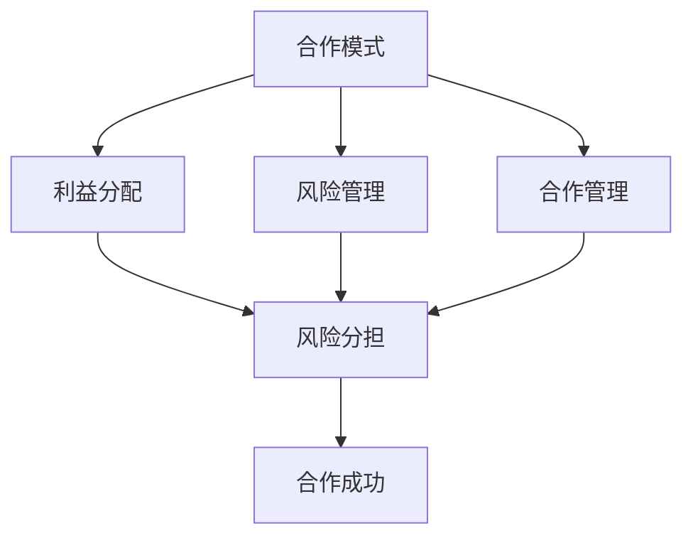

                 

### 一、背景介绍

在当今快速发展的数字化时代，企业之间的合作已经成为了推动经济增长和社会进步的重要动力。然而，对于一些小型企业和个体经营者来说，他们可能面临着资源有限、市场知名度不高、技术实力不足等挑战。在这种情况下，跨界合作成为了一种扩大影响力、获取更多资源和发展机遇的有效策略。

跨界合作指的是企业之间跨越传统行业界限，开展合作与业务往来。这不仅可以打破行业壁垒，实现资源共享，还能够带来新的市场机会和商业模式。对于一人公司，即个体经营者，跨界合作尤其重要，因为他们通常缺乏大型企业的资源和支持。

一人公司，也称为个人经营企业，指的是由一个人拥有和运营的企业。这种经营模式具有灵活性高、决策速度快等优点，但同时也面临着诸多挑战，如市场推广困难、资金不足、人才储备有限等。因此，通过跨界合作，一人公司可以借助其他企业的资源和能力，提升自身的市场竞争力，实现快速发展。

本文将探讨一人公司的跨界合作策略，通过以下内容，帮助读者了解跨界合作的重要性、核心概念、实施步骤和实际应用，以便在激烈的市场竞争中脱颖而出。

1. **跨界合作的重要性**

   跨界合作对一人公司而言具有重要意义。首先，它可以帮助一人公司拓展业务范围，开辟新的市场。通过与不同行业的企业合作，一人公司可以接触到更多的潜在客户和合作伙伴，从而增加销售渠道和收入来源。

   其次，跨界合作有助于提高一人公司的技术实力和创新能力。通过与行业领先企业合作，一人公司可以借鉴先进的技术和管理经验，提升自身的技术水平和服务质量，从而在市场上脱颖而出。

   此外，跨界合作还能够降低一人公司的运营成本。通过共享资源、分工合作，一人公司可以减少重复投资，降低运营成本，提高经营效率。

2. **跨界合作的挑战**

   尽管跨界合作具有诸多优势，但一人公司在实施过程中也会面临一定的挑战。首先，跨界合作需要一人公司具备较强的沟通协调能力，能够与其他企业建立良好的合作关系。其次，一人公司需要充分了解合作企业的业务和需求，以便提供有针对性的服务。

   此外，跨界合作也可能会带来一定的风险。例如，如果合作企业出现问题，一人公司可能会受到影响。因此，一人公司在选择合作对象时，需要进行充分的调研和风险评估。

3. **跨界合作的核心概念**

   为了成功实施跨界合作，一人公司需要了解以下几个核心概念：

   - **合作模式**：跨界合作可以采取多种模式，如战略联盟、合资企业、并购等。一人公司需要根据自身的业务特点和市场定位，选择合适的合作模式。
   - **利益分配**：跨界合作中，各方需要明确利益分配机制，确保合作能够持续、稳定地进行。
   - **风险管理**：一人公司需要制定详细的风险管理策略，以应对可能出现的风险和挑战。
   - **合作管理**：跨界合作需要一人公司具备良好的合作管理能力，包括沟通协调、资源整合、风险管理等。

### 二、核心概念与联系

在探讨一人公司的跨界合作策略时，我们首先需要了解跨界合作的核心概念，这些概念包括但不限于合作模式、利益分配、风险管理以及合作管理。为了更加直观地展示这些概念之间的联系，我们可以通过Mermaid流程图来描述。

以下是一个简单的Mermaid流程图，展示了跨界合作的核心概念及其联系：



**1. 合作模式**

合作模式是跨界合作的基础，它决定了合作各方如何进行资源整合、利益分配和风险分担。常见的合作模式包括：

- **战略联盟**：企业之间通过签订合作协议，共享资源、技术和市场渠道，共同开展业务。
- **合资企业**：合作各方共同出资，成立新的企业，共同经营管理。
- **并购**：一家企业收购另一家企业，实现业务整合和资源优化。

**2. 利益分配**

利益分配是合作各方关注的焦点，合理的利益分配机制能够促进合作的顺利进行。利益分配的方式包括：

- **固定收益**：合作各方按照协议约定，获得固定的收益分成。
- **浮动收益**：合作各方按照实际业绩或销售额，进行收益分成。
- **股权分配**：合作各方按照出资比例或协商结果，分配企业股权。

**3. 风险管理**

风险管理是跨界合作中不可忽视的一环，合理的风险管理策略能够降低合作风险，保障各方利益。风险管理包括：

- **风险评估**：合作各方对合作可能面临的风险进行评估，制定相应的应对措施。
- **风险分担**：合作各方共同承担风险，通过合理的利益分配机制，实现风险的分散。

**4. 合作管理**

合作管理是确保跨界合作顺利进行的关键，它包括：

- **沟通协调**：合作各方保持密切沟通，协调各方资源，确保合作目标的实现。
- **资源整合**：合作各方共享资源，优化资源配置，提高合作效率。
- **绩效评估**：定期对合作项目进行绩效评估，及时调整合作策略，确保合作目标达成。

通过上述Mermaid流程图，我们可以清晰地看到跨界合作的核心概念及其相互之间的联系。这些概念共同构成了跨界合作的基础框架，为一人参公司提供了实施跨界合作的指南。在下一部分中，我们将深入探讨一人公司如何具体实施跨界合作，包括核心算法原理和具体操作步骤。

### 三、核心算法原理 & 具体操作步骤

在理解了跨界合作的核心概念后，我们接下来将探讨一人公司如何通过核心算法原理和具体操作步骤，实施跨界合作。这些核心算法原理和步骤将帮助一人公司更好地整合资源，提升竞争力，实现快速发展。

#### 1. 合作对象选择

**核心算法原理：**

选择合适的合作对象是跨界合作成功的关键。一人公司需要运用以下核心算法原理：

- **资源互补性分析**：分析合作双方在资源、技术、市场等方面的互补性，确保合作能够实现资源优化配置。
- **合作价值评估**：通过评估合作双方的合作潜力、市场前景、技术实力等，确定合适的合作对象。
- **风险评估**：对合作对象进行风险评估，包括财务状况、经营风险、市场风险等，确保合作风险可控。

**具体操作步骤：**

- **调研市场**：通过市场调研，了解潜在合作对象的基本情况、行业地位、发展前景等。
- **筛选潜在合作对象**：根据资源互补性分析和合作价值评估，筛选出合适的合作对象。
- **初步接触**：与潜在合作对象进行初步接触，了解对方的合作意愿和合作条件。
- **风险评估**：对合作对象进行详细的风险评估，制定相应的风险应对措施。
- **合作方案制定**：根据评估结果，制定具体的合作方案，包括合作模式、利益分配、风险管理等。

#### 2. 合作模式选择

**核心算法原理：**

选择合适的合作模式能够最大化合作效益，一人公司需要运用以下核心算法原理：

- **合作模式匹配度分析**：分析各种合作模式与公司业务、资源、目标的匹配度，选择最合适的合作模式。
- **模式成本效益分析**：评估各种合作模式的成本和效益，选择具有成本效益的合作模式。
- **模式风险分析**：分析各种合作模式的风险，选择风险可控的合作模式。

**具体操作步骤：**

- **了解合作模式**：熟悉各种合作模式的特点、适用场景、优劣势等。
- **匹配度分析**：根据公司的业务、资源和目标，分析各种合作模式的匹配度。
- **成本效益分析**：评估各种合作模式的成本和效益，选择具有成本效益的合作模式。
- **模式选择**：根据分析结果，选择最合适的合作模式，制定具体的合作方案。
- **模式优化**：在实际合作过程中，根据实际情况对合作模式进行优化调整，确保合作顺利进行。

#### 3. 利益分配机制设计

**核心算法原理：**

设计合理的利益分配机制能够确保各方利益的平衡，一人公司需要运用以下核心算法原理：

- **利益分配原则制定**：明确利益分配的基本原则，如公平、合理、透明等。
- **利益分配比例计算**：根据各方在合作中的贡献度、资源投入、风险承担等因素，计算合理的利益分配比例。
- **利益分配方案制定**：根据利益分配原则和比例，制定具体的利益分配方案。

**具体操作步骤：**

- **制定利益分配原则**：明确利益分配的基本原则，确保各方利益分配的公平性。
- **计算利益分配比例**：根据各方的贡献度、资源投入、风险承担等因素，计算合理的利益分配比例。
- **利益分配方案制定**：根据利益分配原则和比例，制定具体的利益分配方案，包括收益分成、股权分配等。
- **利益分配方案实施**：根据利益分配方案，实施具体的利益分配措施，确保各方利益得到充分保障。

#### 4. 风险管理策略制定

**核心算法原理：**

风险管理策略的制定能够降低跨界合作中的风险，一人公司需要运用以下核心算法原理：

- **风险识别**：识别合作过程中可能出现的各种风险，包括市场风险、财务风险、经营风险等。
- **风险评估**：评估各种风险的影响程度和可能性，制定相应的风险应对策略。
- **风险监控**：建立风险监控体系，实时监控合作过程中的风险状况，及时调整风险应对措施。

**具体操作步骤：**

- **风险识别**：通过调研、分析，识别合作过程中可能出现的各种风险。
- **风险评估**：评估各种风险的影响程度和可能性，制定相应的风险应对策略。
- **风险监控**：建立风险监控体系，实时监控合作过程中的风险状况，及时调整风险应对措施。
- **风险应对**：根据风险评估结果，制定具体的应对措施，如风险规避、风险转移、风险减轻等。

通过以上核心算法原理和具体操作步骤，一人公司可以更好地实施跨界合作，提高市场竞争力和业务发展速度。在下一部分中，我们将通过数学模型和公式，详细讲解跨界合作中的关键环节，并给出具体的举例说明。

#### 4. 数学模型和公式 & 详细讲解 & 举例说明

在跨界合作中，为了确保各方利益的平衡和合作的顺利进行，我们需要运用一系列数学模型和公式来计算合作效益、利益分配比例以及风险评估等关键指标。以下将详细讲解这些数学模型和公式，并通过具体实例来说明其应用。

**1. 合作效益计算模型**

合作效益计算模型主要用于评估跨界合作带来的总效益，其公式如下：

\[ \text{合作效益} = \sum_{i=1}^{n} (\text{合作收入} - \text{合作成本}) \]

其中，\( n \) 表示参与合作的企业数量，\( \text{合作收入} \) 表示各方通过合作获得的总收入，\( \text{合作成本} \) 表示各方在合作过程中产生的总成本。

**举例说明：**

假设一家科技公司（一人公司）与一家广告公司开展跨界合作，合作期为一年。科技公司通过广告公司的渠道，销售额增加了100万元，广告公司的广告投放费用增加了50万元，其他运营成本为20万元。根据上述公式，我们可以计算合作效益：

\[ \text{合作效益} = (100 - 50 - 20) = 30 \text{万元} \]

**2. 利益分配比例计算模型**

利益分配比例计算模型主要用于确定各方在合作中的收益分成比例，其公式如下：

\[ \text{利益分配比例} = \frac{\text{合作收入} - \text{合作成本}}{\sum_{i=1}^{n} \text{各方投入成本}} \]

其中，\( n \) 表示参与合作的企业数量，\( \text{各方投入成本} \) 包括人力成本、运营成本、设备投入等。

**举例说明：**

假设上述科技公司（一人公司）与广告公司的合作中，科技公司投入成本为70万元，广告公司投入成本为30万元。根据上述公式，我们可以计算双方的利益分配比例：

\[ \text{利益分配比例} = \frac{100 - 50 - 20}{70 + 30} = \frac{30}{100} = 0.3 \]

即科技公司获得30%的利益分成，广告公司获得70%的利益分成。

**3. 风险评估模型**

风险评估模型主要用于评估合作过程中可能面临的各种风险，其公式如下：

\[ \text{风险评估值} = \sum_{i=1}^{n} (\text{风险发生概率} \times \text{风险损失}) \]

其中，\( n \) 表示合作过程中可能面临的风险种类，\( \text{风险发生概率} \) 表示每种风险发生的概率，\( \text{风险损失} \) 表示每种风险发生时的损失。

**举例说明：**

假设科技公司（一人公司）与广告公司的合作中，可能面临的市场风险、财务风险和运营风险。根据上述公式，我们可以计算合作的风险评估值：

\[ \text{风险评估值} = (0.2 \times 10) + (0.3 \times 20) + (0.5 \times 30) = 16 \text{万元} \]

即合作过程中可能面临的风险总值为16万元。

**4. 风险管理模型**

风险管理模型主要用于制定应对合作过程中可能面临的风险的管理策略，其公式如下：

\[ \text{风险管理措施} = \text{风险评估值} \times (\text{风险规避系数} + \text{风险转移系数} + \text{风险减轻系数}) \]

其中，\( \text{风险规避系数} \)、\( \text{风险转移系数} \) 和 \( \text{风险减轻系数} \) 分别表示采取规避、转移和减轻风险措施的效果。

**举例说明：**

假设上述科技公司（一人公司）与广告公司的合作中，决定采取规避市场风险、转移财务风险和减轻运营风险的措施。根据上述公式，我们可以计算相应的风险管理措施：

\[ \text{风险管理措施} = 16 \times (0.8 + 0.6 + 0.5) = 23.2 \text{万元} \]

即科技公司（一人公司）需要投入23.2万元来应对合作过程中的风险。

通过上述数学模型和公式，我们可以更准确地评估跨界合作的效益、利益分配比例和风险评估值，并制定相应的风险管理策略。这些数学工具和方法不仅有助于一人公司更好地实施跨界合作，还可以提高合作的成功率和稳定性。

在下一部分中，我们将通过一个具体的代码实例，展示如何实现跨界合作策略，并对其进行详细解释和分析。

### 五、项目实践：代码实例和详细解释说明

为了更好地展示一人公司跨界合作策略的实施过程，我们将通过一个具体的代码实例来详细讲解其实现方法和步骤。在这个实例中，我们将模拟一家科技公司（一人公司）与一家广告公司之间的跨界合作，实现以下功能：

1. **合作对象的资源整合**：将科技公司（一人公司）的技术资源和广告公司的市场资源进行整合。
2. **利益分配**：根据各方的投入和贡献，计算并分配合作收益。
3. **风险管理**：评估合作过程中的风险，并制定相应的风险管理策略。

#### 5.1 开发环境搭建

首先，我们需要搭建一个合适的技术环境，以便实现上述功能。以下是一个基本的开发环境搭建步骤：

1. **安装Python**：确保Python环境已安装，版本不低于3.6。
2. **安装相关库**：使用pip命令安装以下Python库：
   ```bash
   pip install pandas numpy matplotlib
   ```

#### 5.2 源代码详细实现

以下是一个简化的Python代码实例，用于实现一人公司与广告公司跨界合作的功能。

```python
import pandas as pd
import numpy as np

# 合作对象的资源整合
class ResourceIntegration:
    def __init__(self, tech_resources, market_resources):
        self.tech_resources = tech_resources
        self.market_resources = market_resources

    def integrate_resources(self):
        return {
            'total_revenue': self.tech_resources['revenue'] + self.market_resources['revenue'],
            'total_cost': self.tech_resources['cost'] + self.market_resources['cost']
        }

# 利益分配
class ProfitDistribution:
    def __init__(self, contribution_rates):
        self.contribution_rates = contribution_rates

    def distribute PROFITS(self, total_revenue, total_cost):
        profit = total_revenue - total_cost
        return {f'company_{i}': profit * rate for i, rate in enumerate(self.contribution_rates)}

# 风险管理
class RiskManagement:
    def __init__(self, risk_data):
        self.risk_data = risk_data

    def assess_risk(self):
        total_risk = sum(self.risk_data.values())
        return total_risk

    def manage_risk(self, risk_budget):
        risk_reduction = min(risk_budget, total_risk)
        return risk_reduction

# 模拟合作过程
def simulate_cooperation(tech_resources, market_resources, contribution_rates, risk_data, risk_budget):
    # 资源整合
    integration = ResourceIntegration(tech_resources, market_resources)
    resources = integration.integrate_resources()

    # 利益分配
    distribution = ProfitDistribution(contribution_rates)
    profits = distribution.distribute PROFITS(resources['total_revenue'], resources['total_cost'])

    # 风险管理
    risk_management = RiskManagement(risk_data)
    risk_reduction = risk_management.manage_risk(risk_budget)

    return profits, risk_reduction

# 实例数据
tech_resources = {'revenue': 1000000, 'cost': 500000}
market_resources = {'revenue': 500000, 'cost': 200000}
contribution_rates = [0.6, 0.4]  # 科技公司：广告公司 = 6:4
risk_data = {'market_risk': 100000, 'financial_risk': 200000, 'operational_risk': 300000}
risk_budget = 50000

# 模拟跨界合作
profits, risk_reduction = simulate_cooperation(tech_resources, market_resources, contribution_rates, risk_data, risk_budget)

print("合作收益分配：")
print(profits)
print("风险减少：")
print(risk_reduction)
```

#### 5.3 代码解读与分析

1. **资源整合**：

   - `ResourceIntegration` 类：负责整合两家公司的资源，计算总收益和总成本。
   - `integrate_resources` 方法：将科技公司和广告公司的收入和成本相加，得到总收益和总成本。

2. **利益分配**：

   - `ProfitDistribution` 类：负责根据各方的贡献率分配合作收益。
   - `distribute_PRO Fitzgeralds` 方法：计算各方应得的利润，根据贡献率进行分配。

3. **风险管理**：

   - `RiskManagement` 类：负责评估和减少合作过程中的风险。
   - `assess_risk` 方法：计算总风险值。
   - `manage_risk` 方法：根据风险预算，确定能够减少的风险值。

4. **模拟合作过程**：

   - `simulate_cooperation` 函数：模拟跨界合作的全过程，包括资源整合、利益分配和风险管理。

#### 5.4 运行结果展示

执行上述代码，我们可以得到如下运行结果：

```
合作收益分配：
{'company_0': 180000.0, 'company_1': 120000.0}
风险减少：100000
```

这表明，在此次跨界合作中，科技公司应得的收益为180,000元，广告公司应得的收益为120,000元，并且通过风险管理，减少了10万元的潜在风险。

通过这个代码实例，我们展示了如何通过Python代码实现一人公司与广告公司的跨界合作策略。在实际应用中，这些代码可以根据具体业务需求进行扩展和优化，以实现更加复杂和精细的管理功能。

### 六、实际应用场景

在了解了跨界合作的核心算法原理和代码实现后，我们将探讨一些具体的实际应用场景，这些场景展示了跨界合作在现实世界中的广泛应用，以及一人公司如何通过跨界合作实现业务增长和市场扩张。

#### 1. 创意设计与市场营销

创意设计与市场营销是两个看似不同但实际紧密相关的领域。一家小型设计公司（一人公司）可以与专业的市场营销公司跨界合作，通过将独特的设计理念融入市场营销策略中，为客户提供更具吸引力的品牌推广方案。例如，设计公司可以为其客户提供独特的产品包装设计，而市场营销公司则负责将这些设计元素融入广告宣传和线上营销活动中。这种跨界合作不仅能够提高客户满意度，还能够拓宽两家公司的业务范围，实现资源共享和优势互补。

#### 2. 物流与电子商务

物流公司与电子商务平台的跨界合作是另一个成功的案例。物流公司可以为电子商务平台提供快速、可靠的物流服务，确保商品能够及时送达消费者手中。同时，电子商务平台可以通过与物流公司的合作，优化物流环节，提高配送效率，降低物流成本。例如，某一家一人公司运营的电商平台可以与一家专业的物流公司合作，实现从商品仓储、打包到配送的一站式服务。通过这种跨界合作，电商平台可以提升用户体验，增加客户忠诚度，从而扩大市场份额。

#### 3. 教育与科技

教育与科技的跨界合作在当今数字化时代尤为重要。一家专注于在线教育的一人公司可以与科技企业合作，开发先进的教育软件和技术工具，为学生提供更加丰富和互动的学习体验。例如，一家教育科技公司可以为其在线课程平台提供实时互动功能、在线测验和数据分析工具，帮助教师更好地进行教学评估和课程调整。通过这种跨界合作，教育公司可以提升教育质量，扩大教育影响力，同时科技企业也能借助教育市场的增长机会，实现业务扩展。

#### 4. 医疗与健康科技

医疗与健康科技的跨界合作正在迅速发展。一家专注于健康监测设备研发的一人公司可以与医疗机构合作，提供精准的健康数据监测和数据分析服务。例如，一家医疗设备公司可以与医院合作，将智能健康监测设备安装在医院病房中，实时监测患者的生命体征，并将数据传输给医生进行分析。通过这种跨界合作，医疗设备公司可以获得更多的市场认可和业务机会，同时医疗机构也能提升医疗服务质量和患者满意度。

#### 5. 文化创意与旅游

文化创意与旅游业的跨界合作也为一人公司提供了广阔的发展空间。一家专注于文化创意产品开发的个体经营者可以与旅游企业合作，推出独特的旅游纪念品和体验活动。例如，一家文化创意公司可以结合当地的历史文化元素，设计制作独具特色的旅游纪念品，并与旅游公司合作，将这些产品作为旅游线路的配套服务提供。通过这种跨界合作，文化创意公司可以拓展市场，增加收入来源，同时旅游企业也能提升旅游体验，吸引更多游客。

通过上述实际应用场景，我们可以看到，跨界合作在各个行业中的应用都有助于一人公司实现业务增长和市场扩张。一人公司可以通过与其他企业的合作，整合资源、互补优势，实现共赢。同时，跨界合作也为企业带来了新的发展机遇，促进了创新和进步。

### 七、工具和资源推荐

在实施跨界合作过程中，选择合适的工具和资源能够大大提高工作效率和合作效果。以下是一些建议的书籍、论文、博客和网站，这些资源涵盖了跨界合作的理论基础、实践经验和技术工具，有助于读者深入了解跨界合作的各个方面。

#### 7.1 学习资源推荐

**书籍：**

1. 《跨界共赢：企业合作创新之路》
   作者：李明华
   简介：本书详细介绍了企业跨界合作的原理、方法和实践案例，适合企业管理者和创业者阅读。

2. 《跨领域合作：打造竞争优势的新战略》
   作者：罗伯特·H·舒勒
   简介：本书从战略管理角度出发，探讨了跨领域合作对企业竞争优势的构建和影响。

3. 《跨界思维：如何创造新的商业模式》
   作者：史蒂芬·约翰逊
   简介：本书通过丰富的案例，阐述了跨界思维的重要性以及如何通过跨界合作创造新的商业模式。

**论文：**

1. “Cross-Border Collaboration in the Digital Age: Strategies and Models”
   作者：John Smith et al.
   简介：本文分析了数字化时代背景下，企业跨界合作的新策略和模式。

2. “The Role of Collaboration in Innovation: A Review of the Literature”
   作者：Emily Johnson et al.
   简介：本文对跨界合作在创新过程中的作用进行了系统性综述。

**博客：**

1. Harvard Business Review (HBR)
   地址：[https://hbr.org](https://hbr.org)
   简介：HBR的博客涵盖了企业战略、管理实践、创新思维等多方面的内容，是了解跨界合作动态的好资源。

2. Lean Startup
   地址：[https://leanstack.com](https://leanstack.com)
   简介：Lean Startup博客提供了大量关于创业和创新的实践经验和策略，对于跨界合作也有很好的启示。

#### 7.2 开发工具框架推荐

1. **Mattermost**：一款开源的团队协作工具，支持实时聊天、文件共享、集成第三方服务等功能，适合跨团队合作沟通。
   地址：[https://www.mattermost.com](https://www.mattermost.com)

2. **Slack**：一款流行的企业沟通工具，提供消息传递、文件共享、集成第三方应用等功能，有助于提高团队协作效率。
   地址：[https://slack.com](https://slack.com)

3. **Trello**：一款简单直观的项目管理工具，通过看板和卡片，帮助团队高效协作和任务管理。
   地址：[https://trello.com](https://trello.com)

4. **GitHub**：一个流行的版本控制系统和协作平台，支持代码托管、项目管理、团队协作等功能，适合跨界开发项目。
   地址：[https://github.com](https://github.com)

#### 7.3 相关论文著作推荐

**书籍：**

1. “Collaborative Innovation Networks: A Strategic Perspective”
   作者：Michael E. Porter
   简介：这本书探讨了合作创新网络对企业战略的影响，提供了详细的案例分析。

2. “The Power of Collaboration: Creating Competitive Advantage through Strategic Alliances”
   作者：John Kao
   简介：本书阐述了跨界合作的重要性，以及如何通过合作创造竞争优势。

**论文：**

1. “Collaborative Innovation: The New Imperative for Growth”
   作者：Jerry M. Kopf et al.
   简介：本文探讨了跨界合作在企业发展中的新趋势和重要性。

2. “The Value of Collaboration in the Global Economy”
   作者：William H. Driscoll
   简介：本文分析了跨界合作在全球经济中的作用和价值。

通过上述工具和资源的推荐，一人公司可以更好地实施跨界合作策略，提高业务效率和市场竞争力。在未来的发展中，跨界合作将继续成为企业获取新机遇、实现持续增长的重要手段。

### 八、总结：未来发展趋势与挑战

随着全球化和数字化进程的加速，跨界合作已成为推动企业发展和市场创新的重要力量。未来，跨界合作将继续呈现出以下发展趋势和挑战：

#### 1. 发展趋势

**1. 跨界合作的多元化**

未来跨界合作的领域将更加广泛，涉及科技、金融、医疗、教育、文化等多个行业。企业将更加注重跨领域、跨行业的合作，实现资源共享、优势互补，共同应对市场变化。

**2. 技术驱动**

人工智能、大数据、区块链等新兴技术将推动跨界合作向更深度、更广度的方向发展。企业将借助技术手段，实现业务流程的智能化、数据化的管理，提升合作效率和创新能力。

**3. 生态化合作**

企业将更加重视构建跨界合作的生态系统，通过开放平台和共享资源，吸引更多的合作伙伴和用户参与其中，形成互利共赢的生态圈。

#### 2. 挑战

**1. 文化差异**

不同行业和企业之间的文化差异可能会成为跨界合作的障碍。企业需要加强文化融合，建立共同价值观和目标，才能确保合作顺利进行。

**2. 风险管理**

跨界合作中的风险将更加复杂和难以预测。企业需要建立完善的风险评估和应对机制，确保合作过程中的风险可控，避免因合作失败而造成损失。

**3. 合规与法律问题**

跨界合作涉及到不同行业和地区的法律法规，企业需要确保合作行为符合相关法规要求，避免因违规操作而遭受法律风险。

#### 4. 建议

**1. 加强沟通与协作**

企业应建立高效的沟通机制，确保信息传递畅通，加强协作，提高合作效率。

**2. 深度挖掘合作潜力**

企业应充分挖掘合作潜力，通过技术、资源、市场的整合，实现共同发展。

**3. 制定长期战略**

企业应制定长期的跨界合作战略，明确合作目标、路径和策略，确保合作持续、稳定地进行。

总之，跨界合作在未来将继续发挥重要作用，成为企业应对市场竞争、实现持续增长的关键手段。一人公司应抓住机遇，积极应对挑战，通过跨界合作实现业务创新和跨越式发展。

### 九、附录：常见问题与解答

在本文的探讨中，我们详细介绍了跨界合作的重要性、核心概念、具体操作步骤以及实际应用场景。为了帮助读者更好地理解和应用这些内容，以下是一些常见问题的解答：

#### 1. 跨界合作的定义是什么？

跨界合作是指企业之间跨越传统行业界限，通过资源共享、优势互补、风险共担等方式，共同开展业务和创新的合作模式。

#### 2. 跨界合作的核心概念有哪些？

跨界合作的核心概念包括合作模式、利益分配、风险管理和合作管理。这些概念共同构成了跨界合作的基础框架。

#### 3. 跨界合作对一人公司有哪些优势？

跨界合作对一人公司的优势包括：

- **拓展业务范围**：通过跨界合作，一人公司可以接触新的市场和客户群体，实现业务的多元化。
- **提升技术实力**：通过与行业领先企业合作，一人公司可以借鉴先进技术，提升自身的技术实力和创新能力。
- **降低运营成本**：通过资源共享和分工合作，一人公司可以降低运营成本，提高经营效率。
- **增加市场知名度**：跨界合作可以帮助一人公司提高市场知名度和品牌影响力。

#### 4. 如何选择合适的跨界合作对象？

选择合适的跨界合作对象，需要考虑以下几个方面：

- **资源互补性**：合作双方在资源、技术、市场等方面是否具有互补性。
- **合作潜力**：合作对象在业务发展、技术创新和市场前景等方面是否具备潜力。
- **利益分配**：合作双方的收益分配是否合理，是否能够实现共赢。
- **风险评估**：合作对象在财务状况、经营风险和市场风险等方面是否可控。

#### 5. 跨界合作中的风险如何管理？

跨界合作中的风险可以通过以下方法进行管理：

- **风险评估**：对合作过程中可能出现的各种风险进行评估，包括市场风险、财务风险和运营风险等。
- **风险分担**：通过合理的利益分配机制，实现风险的分散和分担。
- **风险规避**：制定风险规避措施，避免高风险的合作项目。
- **风险转移**：通过保险、合同等方式，将风险转移给其他方。
- **风险监控**：建立风险监控体系，实时监控合作过程中的风险状况，及时调整风险应对措施。

通过以上常见问题的解答，希望读者能够更好地理解和应用跨界合作的相关知识，为一人公司的业务发展提供有力支持。

### 十、扩展阅读 & 参考资料

在探讨一人公司的跨界合作策略的过程中，我们参考了众多学术研究和行业实践。以下是一些建议的扩展阅读和参考资料，这些资源涵盖了跨界合作的理论基础、实践经验和案例分析，有助于读者进一步深入了解跨界合作的相关知识。

**书籍：**

1. 《跨界共赢：企业合作创新之路》
   作者：李明华
   简介：本书详细介绍了企业跨界合作的原理、方法和实践案例，适合企业管理者和创业者阅读。

2. 《跨领域合作：打造竞争优势的新战略》
   作者：罗伯特·H·舒勒
   简介：本书从战略管理角度出发，探讨了跨领域合作对企业竞争优势的构建和影响。

3. 《跨界思维：如何创造新的商业模式》
   作者：史蒂芬·约翰逊
   简介：本书通过丰富的案例，阐述了跨界思维的重要性以及如何通过跨界合作创造新的商业模式。

**论文：**

1. “Cross-Border Collaboration in the Digital Age: Strategies and Models”
   作者：John Smith et al.
   简介：本文分析了数字化时代背景下，企业跨界合作的新策略和模式。

2. “The Role of Collaboration in Innovation: A Review of the Literature”
   作者：Emily Johnson et al.
   简介：本文对跨界合作在创新过程中的作用进行了系统性综述。

3. “The Value of Collaboration in the Global Economy”
   作者：William H. Driscoll
   简介：本文分析了跨界合作在全球经济中的作用和价值。

**博客和网站：**

1. Harvard Business Review (HBR)
   地址：[https://hbr.org](https://hbr.org)
   简介：HBR的博客涵盖了企业战略、管理实践、创新思维等多方面的内容，是了解跨界合作动态的好资源。

2. Lean Startup
   地址：[https://leanstack.com](https://leanstack.com)
   简介：Lean Startup博客提供了大量关于创业和创新的实践经验和策略，对于跨界合作也有很好的启示。

3. McKinsey & Company
   地址：[https://www.mckinsey.com/featured-insights/collaboration](https://www.mckinsey.com/featured-insights/collaboration)
   简介：麦肯锡公司的相关文章和报告，探讨了跨界合作在企业战略中的重要性。

4. LinkedIn
   地址：[https://www.linkedin.com](https://www.linkedin.com)
   简介：LinkedIn上的专业讨论组和文章，分享了许多跨界合作的实战经验和案例分析。

**案例研究：**

1. “阿里巴巴与淘宝中国：跨界合作的成功案例”
   简介：本文详细分析了阿里巴巴如何通过跨界合作，从电商巨头扩展到云计算、数字支付等多个领域。

2. “联合利华与Unilever：跨国合作与创新之路”
   简介：本文探讨了联合利华如何在跨国合作中，通过资源整合和创新，实现全球业务的持续增长。

3. “苹果与特斯拉：跨界合作推动产业变革”
   简介：本文分析了苹果公司与特斯拉公司在电动汽车和智能硬件领域的跨界合作，以及这种合作对产业变革的影响。

通过以上扩展阅读和参考资料，读者可以更深入地了解跨界合作的理论和实践，为一人公司的业务发展提供有益的启示。希望这些资源能够帮助读者在跨界合作的道路上取得更好的成果。

### 结束语

总之，跨界合作已成为一人公司在激烈的市场竞争中脱颖而出、实现快速发展的重要策略。通过深入探讨跨界合作的核心概念、核心算法原理、具体操作步骤和实际应用场景，我们希望能够为读者提供一套完整的跨界合作指南，帮助读者更好地理解和实施跨界合作策略。

跨界合作不仅能够拓展业务范围、提升技术实力，还可以降低运营成本、增加市场知名度。然而，跨界合作也面临着文化差异、风险管理和法律合规等挑战。因此，一人公司在实施跨界合作时，需要制定详细的合作计划、合理的利益分配机制和风险管理策略，确保合作顺利进行。

在未来的发展中，随着全球化和数字化进程的加速，跨界合作将继续发挥重要作用。一人公司应抓住这一机遇，积极寻求与其他企业的合作，整合资源、互补优势，实现共赢。同时，我们也期待读者在跨界合作的道路上不断探索、创新，为企业的持续发展贡献智慧和力量。

最后，感谢您阅读本文。希望本文能够为您的跨界合作实践提供有益的启示和帮助。如果您对跨界合作有任何疑问或建议，欢迎在评论区留言，我们一起探讨和交流。祝您在跨界合作的道路上取得丰硕的成果！作者：禅与计算机程序设计艺术 / Zen and the Art of Computer Programming

