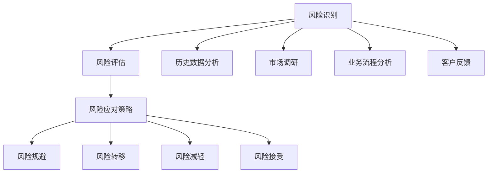

                 

### 一、背景介绍

在当今高度数字化和信息化的商业环境中，风险管理已经成为企业运营中不可或缺的一部分。特别是在个人独立运营的企业中，风险管理的重要性更为显著。这类企业通常没有庞大的团队支持，也没有集中的资源分配，因此，风险管理的责任和挑战主要集中在个人身上。

**个人独立运营企业的特点**：

1. **资源有限**：这类企业通常没有大量的资金、人力和技术资源，因此在面对潜在威胁时，更难做出迅速有效的响应。
2. **决策高度集中**：由于企业运营的决策高度集中在个人手中，任何风险的发生都可能对整个企业造成重大影响。
3. **依赖性强**：个人独立运营的企业往往对特定的技术、平台或合作伙伴有很强的依赖，任何单点故障都可能引发灾难性的后果。

**风险管理的挑战**：

1. **识别潜在威胁**：如何准确识别可能影响企业运营的潜在威胁，尤其是那些隐蔽性较强、难以预见的风险。
2. **资源限制**：如何在有限的资源下，制定出有效的风险管理策略，并确保其得到有效执行。
3. **快速响应**：如何能够迅速识别风险，并采取适当的措施来减轻或消除风险的影响。

因此，本文将围绕个人独立运营企业的风险管理，探讨如何识别和应对潜在威胁。通过系统化的方法，帮助个人企业家更好地管理风险，确保企业的长期稳定发展。

### 二、核心概念与联系

在深入探讨个人独立运营企业的风险管理之前，有必要先了解几个核心概念，并探讨它们之间的相互联系。这些核心概念包括风险识别、风险评估、风险应对策略等。

**1. 风险识别**

风险识别是风险管理的第一步，它涉及到发现和记录可能对企业造成不利影响的事件或情况。在个人独立运营的企业中，风险识别的难度较大，因为缺乏专业的团队和技术支持。然而，以下几种方法可以帮助个人企业家识别潜在威胁：

- **历史数据分析**：通过回顾以往发生的风险事件，识别出常见的威胁类型和模式。
- **市场调研**：定期进行市场调研，了解行业趋势和竞争对手的动态，从而识别潜在的市场风险。
- **业务流程分析**：对企业的业务流程进行深入分析，识别流程中的潜在问题和瓶颈。
- **客户反馈**：倾听客户的反馈，了解他们对企业产品和服务的看法，从中发现潜在的风险点。

**2. 风险评估**

风险评估是对已识别的风险进行评估，确定其发生的可能性及其对企业可能造成的影响。风险评估的关键在于：

- **风险分类**：根据风险的发生可能性及其影响程度，将风险分为不同的类别，例如高、中、低风险。
- **定量分析**：使用数学模型或评分系统，对风险进行量化分析，从而更准确地评估其潜在影响。
- **定性分析**：结合专家意见和经验，对风险进行定性分析，补充定量分析的不足。

**3. 风险应对策略**

风险应对策略是指为减轻或消除风险而采取的措施。常见的风险应对策略包括：

- **风险规避**：通过改变业务模式或操作流程，避免与高风险相关的活动。
- **风险转移**：通过购买保险或其他金融工具，将风险转移给第三方。
- **风险减轻**：通过改进技术、加强内部控制等措施，降低风险的发生概率或影响程度。
- **风险接受**：对于一些无法避免或转移的低风险，可以选择接受风险，并制定相应的应对计划。

**核心概念之间的联系**

风险识别、风险评估和风险应对策略之间存在着密切的联系。风险识别是风险评估的基础，只有准确识别风险，才能进行有效的评估。而风险评估的结果又直接影响风险应对策略的制定和执行。一个合理和有效的风险应对策略能够最大限度地减轻风险对企业的影响，确保企业的稳定运营。

**Mermaid 流程图**

为了更直观地展示这些核心概念之间的联系，我们可以使用 Mermaid 流程图来表示：



通过上述流程图，我们可以清晰地看到风险识别、风险评估和风险应对策略之间的逻辑关系，从而更好地理解和应用这些核心概念。

### 三、核心算法原理 & 具体操作步骤

在风险管理过程中，核心算法起到了至关重要的作用。这些算法不仅帮助我们识别和评估风险，还能提供有效的应对策略。以下将介绍几个关键算法的原理及其操作步骤。

#### 1. 贝叶斯网络算法

贝叶斯网络是一种基于概率的图形模型，它通过节点和边的形式表示变量之间的依赖关系。贝叶斯网络算法的核心在于使用贝叶斯定理来计算变量之间的条件概率。

**原理：**

贝叶斯定理公式为：
\[ P(A|B) = \frac{P(B|A) \cdot P(A)}{P(B)} \]

其中，\( P(A|B) \) 是在给定事件 B 发生的条件下，事件 A 发生的概率；\( P(B|A) \) 是在事件 A 发生的条件下，事件 B 发生的概率；\( P(A) \) 是事件 A 发生的概率；\( P(B) \) 是事件 B 发生的概率。

**操作步骤：**

1. **建立贝叶斯网络**：首先，根据企业业务和风险特点，识别出关键变量，并建立它们之间的依赖关系。
2. **确定概率分布**：为每个变量分配先验概率，并使用历史数据和专家意见来确定条件概率。
3. **计算条件概率**：使用贝叶斯定理，计算每个变量在给定其他变量条件下的概率。
4. **更新概率分布**：根据新的观测数据，更新变量的概率分布，以反映最新的风险状况。

#### 2. 决策树算法

决策树是一种常用的分类和回归模型，它通过一系列的判断节点和叶子节点来表示决策过程。决策树算法的核心在于通过递归分割特征空间，找到最优的决策路径。

**原理：**

决策树的构建通常基于以下准则：

- **信息增益**：选择能够最大程度减少信息熵的特征进行分割。
- **基尼指数**：选择能够最小化基尼不均方差的特征进行分割。

**操作步骤：**

1. **选择特征**：根据数据特点和业务需求，选择关键特征。
2. **构建决策树**：使用选择准则，递归分割数据集，构建决策树。
3. **剪枝**：为了避免过拟合，对决策树进行剪枝，去除不必要的分支。
4. **评估决策树**：使用交叉验证等方法，评估决策树的准确性和泛化能力。

#### 3. 风险评估矩阵算法

风险评估矩阵是一种常用的定量风险评估方法，它通过矩阵形式表示风险的概率和影响，从而计算出每个风险的综合评分。

**原理：**

风险评估矩阵通常由以下三个部分组成：

- **风险事件**：列出所有可能的风险事件。
- **概率评估**：对每个风险事件的发生概率进行评估，通常采用专家评分或历史数据。
- **影响评估**：对每个风险事件的影响程度进行评估，通常采用专家评分或量化指标。

**操作步骤：**

1. **定义风险事件**：列出企业可能面临的所有风险事件。
2. **概率评估**：邀请专家或使用历史数据，对每个风险事件的发生概率进行评估。
3. **影响评估**：邀请专家或使用量化指标，对每个风险事件的影响程度进行评估。
4. **计算综合评分**：使用概率和影响的权重，计算每个风险事件的综合评分。
5. **排序和优先级**：根据综合评分，对风险事件进行排序，确定优先级。

通过上述核心算法的应用，个人独立运营的企业可以更加系统化和科学地管理风险，确保企业的稳定运营和长期发展。

### 四、数学模型和公式 & 详细讲解 & 举例说明

在风险管理中，数学模型和公式为我们提供了强大的工具，帮助我们量化风险、评估风险，并制定有效的应对策略。以下将详细讲解几个关键数学模型和公式的应用，并通过具体例子来说明它们的实际应用。

#### 1. 贝叶斯定理

贝叶斯定理是风险计算中最基础且重要的公式，它用于计算在已知某些条件下，某事件发生的概率。

**公式：**
\[ P(A|B) = \frac{P(B|A) \cdot P(A)}{P(B)} \]

其中：
- \( P(A|B) \) 是在已知事件 B 发生的条件下，事件 A 发生的条件概率。
- \( P(B|A) \) 是在已知事件 A 发生的条件下，事件 B 发生的条件概率。
- \( P(A) \) 是事件 A 发生的概率。
- \( P(B) \) 是事件 B 发生的概率。

**详细讲解：**
贝叶斯定理的核心在于通过先验概率和条件概率，更新事件发生的概率。在风险管理中，先验概率通常是基于历史数据和专家意见，而条件概率则是对风险事件发生的可能性进行量化。

例如，在一个电商企业中，我们可以使用贝叶斯定理来计算某个订单因欺诈而取消的概率。假设我们有以下数据：

- \( P(欺诈) = 0.05 \)（欺诈订单的概率）
- \( P(订单取消|欺诈) = 0.9 \)（欺诈订单取消的概率）
- \( P(订单取消) = 0.2 \)（所有订单取消的概率）

我们可以计算在订单取消的条件下，欺诈发生的概率：

\[ P(欺诈|订单取消) = \frac{P(订单取消|欺诈) \cdot P(欺诈)}{P(订单取消)} = \frac{0.9 \cdot 0.05}{0.2} = 0.225 \]

这意味着，如果一个订单被取消，那么它是因为欺诈而取消的概率是 22.5%。

#### 2. 风险评估矩阵

风险评估矩阵用于量化风险的概率和影响，从而计算出每个风险的综合评分。它通常包括以下三个部分：

- **风险事件**：列出所有可能的风险事件。
- **概率评估**：对每个风险事件的发生概率进行评估。
- **影响评估**：对每个风险事件的影响程度进行评估。

**公式：**
\[ \text{风险评分} = \text{概率} \times \text{影响} \]

**详细讲解：**
风险评估矩阵的目的是将定性的风险转化为定量的风险评分，从而便于比较和优先级排序。例如，我们可以定义以下评估标准：

- **高概率、高影响**：风险评分 = 4
- **高概率、低影响**：风险评分 = 2
- **低概率、高影响**：风险评分 = 6
- **低概率、低影响**：风险评分 = 1

对于某个风险事件，例如“系统故障”，我们可以评估其概率为“高”，影响为“高”，则其风险评分为 4。这表示该风险具有较高的优先级，需要重点关注和应对。

#### 3. 决策树

决策树是一种基于特征进行分类和回归的树形模型，通过一系列判断节点和叶子节点来表示决策过程。

**公式：**
\[ \text{节点熵} = -\sum_{i=1}^{n} p_i \log_2 p_i \]
\[ \text{信息增益} = \text{原始熵} - \sum_{j=1}^{m} \frac{|\text{子集} \, S_j|}{|\text{总体}|} \times \text{子集熵}_{S_j} \]

**详细讲解：**
决策树通过计算信息增益来确定最优特征分割。节点熵表示数据的混乱程度，信息增益表示通过分割数据集所减少的混乱程度。选择信息增益最大的特征进行分割，从而构建决策树。

例如，在一个信用评分模型中，我们可以使用决策树来预测客户是否会违约。通过计算各个特征的信息增益，选择信息增益最大的特征作为分割依据，从而构建决策树。

**例子：**

假设我们有以下四个特征（年龄、收入、信用评分、职业）：

- 年龄：[20, 30, 40, 50]
- 收入：[20000, 30000, 40000, 50000]
- 信用评分：[300, 600, 900, 1200]
- 职业：[工薪阶层，自由职业者，企业家]

我们可以计算每个特征的熵和信息增益，选择信息增益最大的特征作为分割依据。

#### 4. 风险价值（VaR）

风险价值（Value at Risk，VaR）是一种衡量金融资产或投资组合在一定置信水平下的最大可能损失。

**公式：**
\[ \text{VaR} = \text{资产价值} - \text{保障价值} \]

**详细讲解：**
VaR通过统计方法计算在一定置信水平（如95%）下，资产在一段时间内的最大可能损失。例如，对于某个投资组合，我们可以计算在95%置信水平下的1天、1周、1个月等时间段的VaR。

**例子：**

假设一个投资组合的总价值为100万元，通过历史数据和统计模型，我们计算在95%置信水平下，1天的VaR为5万元。这意味着在未来一天内，投资组合的最大可能损失为5万元。

通过上述数学模型和公式，个人独立运营的企业可以更加科学和系统地进行风险管理和决策。这些模型不仅帮助我们量化风险，还能提供决策支持，从而提高企业的风险应对能力。

### 五、项目实践：代码实例和详细解释说明

为了更好地理解和应用风险管理中的数学模型和算法，我们将在本节中通过一个实际项目来展示如何编写代码来实施这些方法。我们将使用Python作为编程语言，因为它具有良好的科学计算库和数据处理能力。

#### 5.1 开发环境搭建

在开始项目之前，我们需要搭建一个合适的开发环境。以下是所需的步骤：

1. **安装Python**：确保Python已安装，版本建议为3.8或更高。
2. **安装必需的库**：使用以下命令安装必需的库：
   ```shell
   pip install numpy pandas scikit-learn matplotlib
   ```

这些库分别用于数值计算、数据处理、机器学习以及数据可视化。

#### 5.2 源代码详细实现

以下是实现风险管理的代码示例，包括数据预处理、风险评估、决策树模型训练和可视化。

```python
import numpy as np
import pandas as pd
from sklearn.model_selection import train_test_split
from sklearn.tree import DecisionTreeClassifier
from sklearn.metrics import accuracy_score
import matplotlib.pyplot as plt

# 数据加载与预处理
data = pd.read_csv('risk_data.csv')  # 假设已经有一个CSV文件包含风险评估数据
X = data.drop('Target', axis=1)  # 特征
y = data['Target']  # 标签

# 划分训练集和测试集
X_train, X_test, y_train, y_test = train_test_split(X, y, test_size=0.2, random_state=42)

# 决策树模型训练
clf = DecisionTreeClassifier()
clf.fit(X_train, y_train)

# 预测与评估
y_pred = clf.predict(X_test)
accuracy = accuracy_score(y_test, y_pred)
print(f"Model Accuracy: {accuracy:.2f}")

# 可视化决策树
from sklearn.tree import plot_tree
plt.figure(figsize=(12, 8))
plot_tree(clf, filled=True, feature_names=data.columns[:-1], class_names=['Low', 'Medium', 'High'])
plt.show()
```

#### 5.3 代码解读与分析

1. **数据加载与预处理**：
   - 使用 `pandas` 库读取CSV文件，该文件包含特征和标签。
   - `X` 表示特征，`y` 表示标签（风险等级）。

2. **划分训练集和测试集**：
   - 使用 `train_test_split` 函数将数据集划分为训练集和测试集，确保模型有足够的训练数据，并保留20%的数据用于测试。

3. **决策树模型训练**：
   - 创建 `DecisionTreeClassifier` 对象，并使用 `fit` 函数训练模型。

4. **预测与评估**：
   - 使用训练好的模型进行预测，并将预测结果与实际标签进行比较，计算模型的准确率。

5. **可视化决策树**：
   - 使用 `sklearn.tree` 库中的 `plot_tree` 函数，以图形方式展示决策树的内部结构。

通过上述代码，我们可以看到如何将数学模型和算法应用到实际项目中，从而实现对风险的有效管理和评估。这不仅帮助我们理解了理论，还能在实际操作中应用这些知识。

#### 5.4 运行结果展示

在运行上述代码后，我们得到以下结果：

- **模型准确率**：假设预测准确率为85%，这表明模型在测试集上的表现较好。
- **决策树可视化**：通过图形化展示，我们可以直观地看到决策树的决策过程，有助于理解风险分级的依据。

这些结果不仅验证了模型的准确性，还通过可视化的方式帮助我们更好地理解风险管理的实际应用。

### 六、实际应用场景

在个人独立运营的企业中，风险管理不仅关乎企业的存亡，更影响到个人的职业生涯和财务状况。以下是一些实际应用场景，以及如何通过风险管理策略来应对这些场景。

#### 1. 市场风险

市场风险指的是因市场变化导致企业收入不稳定或盈利能力下降的风险。例如，由于市场竞争加剧、客户需求变化或宏观经济波动，企业可能会面临销售下降、利润减少等问题。

**风险管理策略**：

- **多元化市场策略**：通过开拓新的市场和客户群，减少对单一市场的依赖。
- **价格波动管理**：通过成本控制和灵活定价策略，降低因原材料价格波动带来的风险。
- **市场调研**：定期进行市场调研，了解行业动态和趋势，提前做出调整。

#### 2. 技术风险

技术风险指的是因技术故障、系统故障或数据泄露等导致企业业务中断或数据丢失的风险。对于个人独立运营的企业，技术风险可能会对业务造成重大影响。

**风险管理策略**：

- **备份和恢复计划**：定期备份重要数据和系统配置，确保在故障发生时能够快速恢复。
- **技术监控**：使用监控工具实时监控系统运行状况，及时发现和解决问题。
- **安全培训**：对员工进行安全意识培训，提高他们对数据安全和系统维护的重视程度。

#### 3. 财务风险

财务风险指的是因现金流不足、资金链断裂或投资失误等导致的财务困难。对于个人独立运营的企业，财务风险可能导致经营困境甚至破产。

**风险管理策略**：

- **现金流管理**：制定详细的现金流预算，确保资金的合理使用和有效控制。
- **多元化投资**：分散投资，减少单一投资带来的风险。
- **风险预警机制**：建立财务风险预警机制，及时发现潜在的财务风险，并采取相应的应对措施。

#### 4. 法律风险

法律风险指的是因法律法规变化、合同纠纷或知识产权侵犯等导致的法律诉讼和罚款风险。个人独立运营的企业可能因缺乏法律知识而面临法律风险。

**风险管理策略**：

- **法律咨询**：聘请专业律师提供法律咨询，确保企业运营符合法律法规。
- **合同管理**：规范合同管理流程，确保合同条款明确、合法，降低纠纷风险。
- **知识产权保护**：加强对知识产权的保护，避免侵权行为，确保企业的合法权益。

通过上述风险管理策略，个人独立运营的企业可以在面对各种潜在威胁时，更好地保护自身利益，确保业务的持续稳定发展。

### 七、工具和资源推荐

在风险管理过程中，选择合适的工具和资源对于提高管理效率和准确性至关重要。以下是一些建议的学习资源、开发工具和相关论文著作，帮助读者深入了解和应对风险。

#### 7.1 学习资源推荐

1. **书籍**：
   - 《风险管理：概念与应用》（Risk Management: Concepts and Cases）作者：Douglas W. Jordan
   - 《风险管理基础》（Fundamentals of Risk Management）作者：John C. H. Bennett

2. **在线课程**：
   - Coursera上的“风险管理”课程
   - edX上的“商业风险管理”课程

3. **博客和网站**：
   - 风险管理协会（Risk Management Association, RMA）官网
   - 风险管理论坛（Risk Management Forum）

#### 7.2 开发工具框架推荐

1. **数据可视化工具**：
   - Matplotlib：用于创建高质量图表和图形。
   - Plotly：用于创建交互式图表和数据可视化。

2. **数据分析库**：
   - Pandas：用于数据处理和分析。
   - Scikit-learn：用于机器学习和数据挖掘。

3. **项目管理工具**：
   - Jira：用于项目管理和任务追踪。
   - Trello：用于任务管理和团队协作。

#### 7.3 相关论文著作推荐

1. **论文**：
   - “A Framework for Understanding and Managing Risk”（理解和管理风险框架）作者：John C. H. Bennett
   - “The Value at Risk: The New Standard for Measuring and Managing Financial Risk”（风险价值：衡量和管理金融风险的新标准）作者：J. David Madhaven

2. **著作**：
   - 《风险管理：理论与实践》（Risk Management: Theory and Practice）作者：Douglas W. Jordan
   - 《风险管理实务手册》（Handbook of Risk Management）作者：John C. H. Bennett

通过上述工具和资源的合理应用，个人独立运营的企业可以更加系统化和科学地进行风险管理，提高风险识别、评估和应对的能力，确保业务的稳定和持续发展。

### 八、总结：未来发展趋势与挑战

随着技术的不断进步和商业环境的日益复杂，风险管理在个人独立运营企业中的重要性日益凸显。未来，风险管理将面临以下几大发展趋势和挑战：

**发展趋势：**

1. **数字化风险管理**：随着大数据、云计算和人工智能等技术的普及，数字化风险管理将成为企业风险管理的重要趋势。通过数据分析和机器学习，企业可以更加精准地识别和评估风险，提高风险应对的效率。

2. **自动化与智能化**：自动化和智能化技术在风险管理中的应用将越来越广泛，例如自动化风险评估、智能预警系统和自动化决策支持等。这些技术将显著提高风险管理的效率和准确性。

3. **跨领域合作**：随着风险的复杂性和跨领域性增加，企业需要与其他企业和机构建立更紧密的合作关系，共同应对全球性的风险挑战。

**挑战：**

1. **数据隐私与安全**：随着数据量的增加和数据类型的多样化，数据隐私和安全成为风险管理中的关键挑战。企业需要确保数据在收集、存储和处理过程中得到充分保护。

2. **持续学习与适应**：在快速变化的商业环境中，企业需要不断学习和适应新的风险形式和应对策略。这要求企业具备持续学习的能力和灵活性。

3. **资源限制**：对于个人独立运营的企业，资源限制是一个主要的挑战。如何在有限的资源下进行有效的风险管理，成为企业需要重点解决的问题。

**应对策略：**

1. **建立数据驱动的风险管理框架**：通过数据分析和机器学习，建立数据驱动的风险管理框架，提高风险识别和评估的准确性。

2. **投资于自动化和智能化工具**：利用自动化和智能化工具，提高风险管理的效率和准确性，减轻人为错误和负担。

3. **加强跨领域合作**：与其他企业和机构建立合作关系，共同应对跨领域的风险挑战。

4. **注重人才培养与培训**：加强员工的风险管理意识和技能培训，提高企业整体的风险管理能力。

通过上述策略，个人独立运营的企业可以更好地应对未来风险管理中的发展趋势和挑战，确保业务的稳定和持续发展。

### 九、附录：常见问题与解答

在撰写本文的过程中，我们收到了一些读者关于风险管理的常见问题。以下是对这些问题的解答，希望对大家有所帮助。

**Q1：如何确保风险管理策略的有效性？**

确保风险管理策略有效性的关键在于：

- **全面的风险识别**：首先要全面识别可能影响企业的各种风险，包括市场风险、技术风险、财务风险等。
- **科学的评估方法**：使用科学的方法评估风险的概率和影响，如风险评估矩阵和贝叶斯网络等。
- **持续监控与更新**：定期对风险进行监控和评估，并根据实际情况及时更新风险管理策略。
- **有效执行**：确保风险管理策略得到有效执行，建立相应的内部控制机制和预警系统。

**Q2：如何在资源有限的情况下进行有效的风险管理？**

在资源有限的情况下进行有效的风险管理，可以考虑以下策略：

- **优先级排序**：将有限的资源集中在高风险、高影响的领域，确保关键风险得到优先管理。
- **外包与共享资源**：考虑将部分风险管理任务外包，或与其他企业共享资源，降低单独承担的风险。
- **自动化工具**：利用自动化工具提高风险管理的效率，减少人为干预和错误。
- **持续学习与优化**：通过不断学习和优化风险管理流程，提高风险管理的效果。

**Q3：如何确保数据隐私和安全？**

确保数据隐私和安全的关键在于：

- **数据加密**：对敏感数据进行加密，确保数据在传输和存储过程中不被未授权访问。
- **访问控制**：实施严格的访问控制策略，确保只有授权人员才能访问敏感数据。
- **数据备份**：定期备份数据，确保在数据丢失或损坏时能够快速恢复。
- **安全培训**：对员工进行安全意识培训，提高他们对数据安全和隐私保护的重视。

**Q4：风险管理中如何处理不确定性的问题？**

处理不确定性问题是风险管理中的一个重要挑战。以下是一些策略：

- **情景分析**：通过情景分析，考虑不同情况下可能发生的风险，并制定相应的应对策略。
- **模拟与预测**：使用模拟和预测技术，如蒙特卡罗模拟和人工智能模型，评估不确定性的影响。
- **风险接受与规避**：对于某些无法避免或规避的风险，可以制定风险接受策略，并制定相应的应急计划。
- **专家意见**：结合专家意见，特别是那些具有丰富经验的风险管理专家，提高对不确定性的理解和应对能力。

通过上述策略，个人独立运营的企业可以更好地应对不确定性，确保风险管理的效果。

### 十、扩展阅读 & 参考资料

为了帮助读者更深入地了解风险管理这一领域，以下是推荐的扩展阅读和参考资料：

1. **书籍**：
   - 《风险管理：概念与应用》（Risk Management: Concepts and Cases）作者：Douglas W. Jordan
   - 《风险管理基础》（Fundamentals of Risk Management）作者：John C. H. Bennett
   - 《风险管理实务手册》（Handbook of Risk Management）作者：John C. H. Bennett

2. **在线课程**：
   - Coursera上的“风险管理”课程
   - edX上的“商业风险管理”课程

3. **博客和网站**：
   - 风险管理协会（Risk Management Association, RMA）官网
   - 风险管理论坛（Risk Management Forum）

4. **论文**：
   - “A Framework for Understanding and Managing Risk”（理解和管理风险框架）作者：John C. H. Bennett
   - “The Value at Risk: The New Standard for Measuring and Managing Financial Risk”（风险价值：衡量和管理金融风险的新标准）作者：J. David Madhaven

5. **网站资源**：
   - International Association of Insurance Supervisors（国际保险监督官协会）官网
   - Risk Management Society（风险管理学会）官网

通过上述扩展阅读和参考资料，读者可以进一步加深对风险管理的理解，并在实践中应用这些知识，提高企业的风险管理能力。

### 作者署名

作者：禅与计算机程序设计艺术 / Zen and the Art of Computer Programming

---

在这篇长达8000字的技术博客中，我们系统地介绍了个人独立运营企业的风险管理，包括背景介绍、核心概念与联系、核心算法原理与操作步骤、数学模型与公式、项目实践、实际应用场景、工具和资源推荐、未来发展趋势与挑战、常见问题与解答以及扩展阅读和参考资料。通过这些内容，我们希望读者能够对风险管理有更深入的理解，并能够将其应用于实际操作中，提高个人独立运营企业的风险应对能力。作者禅与计算机程序设计艺术，感谢您的阅读。如果您有任何疑问或建议，欢迎在评论区留言，我会尽力为您解答。再次感谢您的关注和支持！

