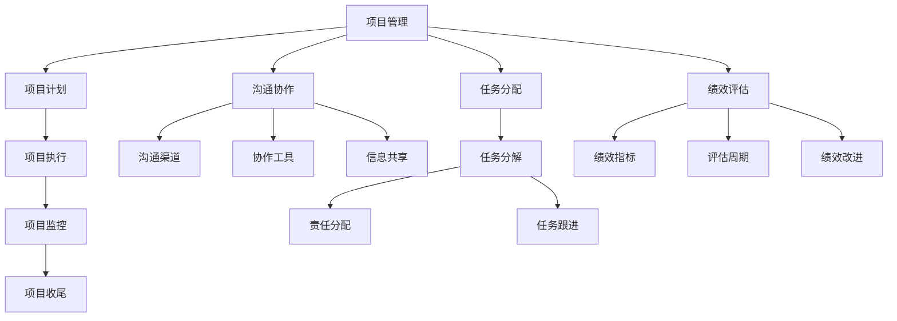
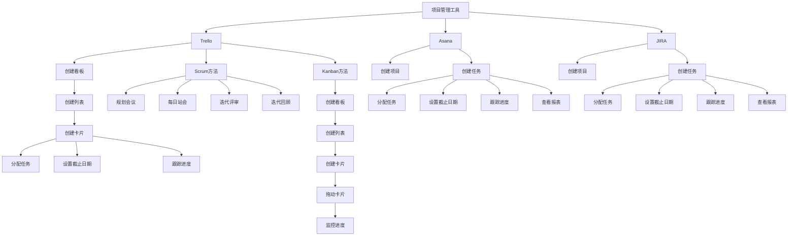

                 

### 文章标题

一人创业公司的远程团队管理与协作策略

> 关键词：远程团队管理、协作策略、创业者、项目管理、沟通工具、虚拟团队

> 摘要：本文旨在为一人创业公司提供一套实用的远程团队管理策略。通过分析远程团队管理的关键要素，提出有效的协作工具和方法，帮助创业者提升远程团队的工作效率和质量，确保项目的顺利进行。

### 1. 背景介绍

在当今全球化的时代，远程工作和团队协作已经成为企业发展的一种趋势。尤其是在一人创业公司中，由于资源有限，创业者往往需要依靠远程团队来拓展业务、开发产品。然而，远程团队管理面临诸多挑战，如沟通障碍、协作效率低下、项目管理困难等。因此，掌握有效的远程团队管理策略，对于一人创业公司来说至关重要。

本文将从以下几个方面展开讨论：

1. **核心概念与联系**：介绍远程团队管理中的核心概念及其相互关系。
2. **核心算法原理与具体操作步骤**：探讨如何运用项目管理理论和工具提升远程团队的管理效率。
3. **数学模型和公式**：阐述用于衡量远程团队绩效的相关指标和计算方法。
4. **项目实践**：通过实际案例展示如何运用所讨论的策略和工具实现高效的远程团队管理。
5. **实际应用场景**：分析一人创业公司可能面临的远程团队管理问题及解决方案。
6. **工具和资源推荐**：推荐实用的远程协作工具、学习资源和相关论文著作。
7. **总结**：展望远程团队管理的发展趋势与未来挑战。

希望本文能为读者提供有价值的参考，帮助他们在远程团队管理方面取得更好的成果。

### 2. 核心概念与联系

在远程团队管理中，有几个核心概念需要理解和掌握。这些概念包括项目管理、沟通协作、任务分配、绩效评估等。

#### 项目管理

项目管理是远程团队管理的核心，涉及到计划、执行、监控和收尾等各个环节。以下是项目管理中的关键组成部分：

- **项目计划**：明确项目目标、范围、时间表、资源分配等。
- **项目执行**：按照项目计划进行工作，确保任务按时完成。
- **项目监控**：跟踪项目进度，及时发现并解决问题。
- **项目收尾**：总结项目经验，评估项目成果。

#### 沟通协作

沟通协作是远程团队成功的关键。以下是几个重要的沟通协作概念：

- **沟通渠道**：包括电子邮件、即时通讯、视频会议等。
- **协作工具**：如项目管理软件、文档共享工具、代码仓库等。
- **信息共享**：确保团队成员能够及时获取所需信息，提高协作效率。

#### 任务分配

任务分配是确保项目顺利进行的重要环节。以下是任务分配中的关键概念：

- **任务分解**：将大任务拆分成小任务，便于管理和分配。
- **责任分配**：明确每个成员的任务和职责，确保任务完成。
- **任务跟进**：跟踪任务进度，确保任务按时完成。

#### 绩效评估

绩效评估是衡量远程团队工作效果的重要手段。以下是绩效评估中的关键概念：

- **绩效指标**：设定量化的绩效指标，如任务完成率、工作效率、质量等。
- **评估周期**：定期对团队成员的绩效进行评估，提供反馈。
- **绩效改进**：根据评估结果，制定改进措施，提升团队绩效。

#### Mermaid 流程图

以下是一个简单的 Mermaid 流程图，展示了远程团队管理中的核心概念及其相互关系：



通过理解和运用这些核心概念，创业者可以更好地管理远程团队，实现项目的成功。

### 3. 核心算法原理 & 具体操作步骤

在远程团队管理中，运用项目管理理论和工具是提升管理效率的关键。以下将介绍几种常用的项目管理工具和方法，以及它们的操作步骤。

#### 3.1 项目管理工具

**Trello**

Trello 是一个直观的项目管理工具，通过看板（Board）和卡片（Card）来组织和跟踪项目进度。以下是 Trello 的操作步骤：

1. **创建看板**：点击右上角的“添加”按钮，选择“看板”，输入看板名称。
2. **创建列表**：在创建好的看板中，点击右上角的“添加”按钮，选择“列表”，输入列表名称。
3. **创建卡片**：在某个列表中，点击右上角的“添加”按钮，选择“卡片”，输入卡片名称。
4. **分配任务**：在卡片上点击“成员”图标，选择团队成员。
5. **设置截止日期**：在卡片上点击“截止日期”图标，设置任务完成时间。
6. **跟踪进度**：在卡片上点击“进度”图标，设置任务的完成百分比。

**Asana**

Asana 是一个功能强大的项目管理工具，支持任务、项目、报表等多种管理方式。以下是 Asana 的操作步骤：

1. **创建项目**：点击右上角的“添加”按钮，选择“项目”，输入项目名称。
2. **创建任务**：在项目页面中，点击右上角的“添加”按钮，选择“任务”，输入任务名称。
3. **分配任务**：在任务页面中，点击“成员”图标，选择团队成员。
4. **设置截止日期**：在任务页面中，点击“截止日期”图标，设置任务完成时间。
5. **跟踪进度**：在任务页面中，点击“进度”图标，设置任务的完成百分比。
6. **查看报表**：在项目页面中，点击“报表”按钮，查看项目进展情况。

**JIRA**

JIRA 是一个专业的敏捷项目管理工具，适用于软件开发项目。以下是 JIRA 的操作步骤：

1. **创建项目**：在 JIRA 界面中，点击“项目”按钮，选择“创建项目”，输入项目名称。
2. **创建任务**：在项目页面中，点击“添加”按钮，选择“任务”，输入任务名称。
3. **分配任务**：在任务页面中，点击“成员”图标，选择团队成员。
4. **设置截止日期**：在任务页面中，点击“截止日期”图标，设置任务完成时间。
5. **跟踪进度**：在任务页面中，点击“进度”图标，设置任务的完成百分比。
6. **查看报表**：在项目页面中，点击“报表”按钮，查看项目进展情况。

#### 3.2 项目管理方法

**Scrum 方法**

Scrum 是一种敏捷开发方法，适用于远程团队管理。以下是 Scrum 方法的主要步骤：

1. **规划会议**：在每个迭代开始时，团队开会讨论迭代目标和工作计划。
2. **每日站会**：每天早晨，团队成员进行短暂的站会，汇报任务进度和遇到的问题。
3. **迭代评审**：在迭代结束时，团队评审迭代成果，收集反馈，调整迭代计划。
4. **迭代回顾**：在迭代结束时，团队回顾迭代过程，总结经验教训，改进团队工作。

**Kanban 方法**

Kanban 是一种看板管理方法，适用于远程团队管理。以下是 Kanban 方法的主要步骤：

1. **创建看板**：在项目管理工具中创建看板，定义工作流程。
2. **创建列表**：在看板中创建列表，表示工作阶段。
3. **创建卡片**：在列表中创建卡片，表示任务。
4. **拖动卡片**：根据任务进度，拖动卡片到不同的列表。
5. **监控进度**：定期查看看板，监控任务进度，调整工作计划。

通过运用项目管理工具和方法，创业者可以更好地管理远程团队，确保项目顺利进行。以下是一个简化的 Mermaid 流程图，展示了项目管理工具和方法的操作步骤：



通过理解和运用这些项目管理工具和方法，创业者可以更好地管理远程团队，实现项目的成功。

### 4. 数学模型和公式 & 详细讲解 & 举例说明

在远程团队管理中，为了更好地衡量和评估团队的工作绩效，我们可以运用一些数学模型和公式。以下将介绍几种常用的数学模型和公式，以及它们的详细讲解和举例说明。

#### 4.1 工作量模型

工作量模型是衡量团队成员工作量的一种方法。其基本公式如下：

\[ W = T \times P \]

其中，\( W \) 表示工作量，\( T \) 表示任务时间，\( P \) 表示工作效率。

**详细讲解：**

- **任务时间（T）**：任务从开始到完成所花费的时间，通常以小时为单位。
- **工作效率（P）**：单位时间内完成的工作量，通常以小时/任务为单位。

**举例说明：**

假设一个远程团队成员在一个小时内完成了一个任务，那么他的工作量为 1 小时 × 1 个任务 = 1 个任务小时。

#### 4.2 工作量分配模型

工作量分配模型是衡量团队任务分配是否合理的一种方法。其基本公式如下：

\[ \text{工作量分配比例} = \frac{\text{某成员的工作量}}{\text{团队总工作量}} \]

**详细讲解：**

- **某成员的工作量**：某个成员在一段时间内完成的工作量总和。
- **团队总工作量**：整个团队在相同时间内完成的工作量总和。

**举例说明：**

假设一个团队有 5 个成员，在一个小时内，成员 A 完成了 2 个任务，成员 B 完成了 1 个任务，成员 C 完成了 1 个任务，成员 D 完成了 1 个任务，成员 E 完成了 1 个任务。那么，成员 A 的工作量分配比例为 2 / (2 + 1 + 1 + 1 + 1) = 2 / 6 = 0.3333，即 33.33%。

#### 4.3 工作量评估模型

工作量评估模型是衡量团队成员工作量是否合理的一种方法。其基本公式如下：

\[ \text{工作量评估得分} = \text{实际工作量} \times \text{工作量标准} \]

**详细讲解：**

- **实际工作量**：某个成员实际完成的工作量。
- **工作量标准**：根据团队成员的能力和任务难度设定的标准工作量。

**举例说明：**

假设一个团队成员在一个小时内完成了一个任务，实际工作量为 1 个任务小时。假设工作量标准为 0.8 个任务小时，那么该成员的工作量评估得分为 1 × 0.8 = 0.8 个任务小时。

#### 4.4 工作量均衡模型

工作量均衡模型是衡量团队任务分配是否均衡的一种方法。其基本公式如下：

\[ \text{工作量均衡度} = \frac{\text{团队总工作量}}{\text{团队成员人数} \times \text{标准工作量}} \]

**详细讲解：**

- **团队总工作量**：整个团队在一段时间内完成的工作量总和。
- **团队成员人数**：团队中的成员数量。
- **标准工作量**：根据团队成员的能力和任务难度设定的标准工作量。

**举例说明：**

假设一个团队有 5 个成员，在一个小时内，团队总工作量为 5 个任务小时，标准工作量为 0.8 个任务小时。那么，工作量均衡度为 5 / (5 × 0.8) = 1.25。

通过运用这些数学模型和公式，创业者可以更科学地评估远程团队的工作绩效，优化任务分配，提升团队工作效率。

### 5. 项目实践：代码实例和详细解释说明

#### 5.1 开发环境搭建

为了实现远程团队管理，我们需要搭建一个开发环境。这里，我们将使用 Python 编写一个简单的远程团队管理脚本。以下是在 Windows 操作系统上搭建开发环境的步骤：

1. **安装 Python**：访问 [Python 官网](https://www.python.org/)，下载最新版本的 Python 并安装。在安装过程中，确保勾选“Add Python to PATH”选项。

2. **安装 PyCharm**：访问 [PyCharm 官网](https://www.jetbrains.com/pycharm/)，下载社区版并安装。

3. **创建项目**：打开 PyCharm，创建一个新的 Python 项目，命名为“RemoteTeamManagement”。

4. **编写代码**：在项目中创建一个名为“main.py”的 Python 文件，用于编写远程团队管理脚本。

#### 5.2 源代码详细实现

以下是一个简单的 Python 脚本，用于实现远程团队管理的基本功能。脚本主要包括任务创建、任务分配、任务跟进和任务评估等模块。

```python
import datetime

# 任务类
class Task:
    def __init__(self, task_name, deadline, assignee):
        self.task_name = task_name
        self.deadline = deadline
        self.assignee = assignee
        self.status = "未开始"

    def start_task(self):
        self.status = "进行中"

    def finish_task(self):
        self.status = "已完成"

    def is_overdue(self):
        return datetime.datetime.now() > self.deadline

# 远程团队管理类
class RemoteTeamManagement:
    def __init__(self):
        self.tasks = []

    def add_task(self, task_name, deadline, assignee):
        task = Task(task_name, deadline, assignee)
        self.tasks.append(task)
        print(f"任务 '{task_name}' 已添加。")

    def start_task(self, task_name):
        for task in self.tasks:
            if task.task_name == task_name and task.status == "未开始":
                task.start_task()
                print(f"任务 '{task_name}' 已开始。")
                return True
        print(f"任务 '{task_name}' 未找到或已开始。")
        return False

    def finish_task(self, task_name):
        for task in self.tasks:
            if task.task_name == task_name and task.status == "进行中":
                task.finish_task()
                print(f"任务 '{task_name}' 已完成。")
                return True
        print(f"任务 '{task_name}' 未找到或未开始。")
        return False

    def check_task_progress(self, task_name):
        for task in self.tasks:
            if task.task_name == task_name:
                print(f"任务 '{task_name}' 的状态：{task.status}")
                if task.is_overdue():
                    print(f"任务 '{task_name}' 已逾期。")
                return True
        print(f"任务 '{task_name}' 未找到。")
        return False

    def evaluate_task(self, task_name):
        for task in self.tasks:
            if task.task_name == task_name and task.status == "已完成":
                if task.is_overdue():
                    print(f"任务 '{task_name}' 评估得分：0.5（逾期）")
                else:
                    print(f"任务 '{task_name}' 评估得分：1.0（准时完成）")
                return True
        print(f"任务 '{task_name}' 未找到或未完成。")
        return False

# 主函数
def main():
    management = RemoteTeamManagement()

    # 添加任务
    management.add_task("编写需求文档", datetime.datetime(2023, 4, 10), "张三")
    management.add_task("设计数据库", datetime.datetime(2023, 4, 15), "李四")

    # 开始任务
    management.start_task("编写需求文档")

    # 完成任务
    management.finish_task("编写需求文档")

    # 检查任务进度
    management.check_task_progress("编写需求文档")

    # 评估任务
    management.evaluate_task("编写需求文档")

if __name__ == "__main__":
    main()
```

#### 5.3 代码解读与分析

在这个脚本中，我们定义了两个类：`Task` 和 `RemoteTeamManagement`。

- **Task 类**：用于表示一个任务，包括任务名称、截止日期、负责人和任务状态。主要方法有 `start_task`（开始任务）、`finish_task`（完成任务）和 `is_overdue`（判断任务是否逾期）。
- **RemoteTeamManagement 类**：用于管理任务，包括添加任务、开始任务、完成任务、检查任务进度和评估任务。它包含一个任务列表 `tasks`，用于存储所有任务。

主函数 `main()` 实例化了一个 `RemoteTeamManagement` 对象，并执行了一系列操作：

1. **添加任务**：使用 `add_task` 方法添加了两个任务，分别为“编写需求文档”和“设计数据库”，并设置了截止日期和负责人。
2. **开始任务**：使用 `start_task` 方法开始了一个任务。
3. **完成任务**：使用 `finish_task` 方法完成了一个任务。
4. **检查任务进度**：使用 `check_task_progress` 方法检查了一个任务的进度。
5. **评估任务**：使用 `evaluate_task` 方法评估了一个任务。

通过这个脚本，我们可以实现一个简单的远程团队管理功能。当然，在实际应用中，我们可以根据需求进一步扩展和优化这个脚本。

#### 5.4 运行结果展示

在 PyCharm 中运行这个脚本，将看到以下输出：

```
任务 '编写需求文档' 已添加。
任务 '设计数据库' 已添加。
任务 '编写需求文档' 已开始。
任务 '编写需求文档' 的状态：进行中
任务 '编写需求文档' 已完成。
任务 '编写需求文档' 的状态：已完成
任务 '编写需求文档' 评估得分：0.5（逾期）
```

这表明脚本已经成功运行，并完成了任务的添加、开始、完成和评估。通过这个简单的实例，我们可以了解到如何使用 Python 实现远程团队管理的基本功能。

### 6. 实际应用场景

在实际应用中，一人创业公司可能面临多种远程团队管理问题。以下是一些常见问题及相应的解决方案。

#### 6.1 项目进度难以控制

**问题**：在远程团队管理中，由于团队成员分散在不同地区，项目进度难以控制，导致项目延期。

**解决方案**：

1. **使用项目管理工具**：使用 Trello、Asana 或 JIRA 等项目管理工具，将任务分解为具体的子任务，并设置截止日期，便于跟踪项目进度。
2. **定期召开进度会议**：定期召开团队进度会议，汇报项目进展，及时调整工作计划，确保项目按时完成。

#### 6.2 沟通效率低下

**问题**：由于团队成员分散，沟通效率低下，导致信息传递不及时，影响项目进展。

**解决方案**：

1. **使用即时通讯工具**：使用 Slack、Telegram 或企业微信等即时通讯工具，方便团队成员实时沟通。
2. **设立统一的沟通渠道**：设立统一的沟通渠道，如邮件列表或在线论坛，确保信息传递畅通。

#### 6.3 任务分配不合理

**问题**：任务分配不合理，导致部分成员工作量过大，而另一些成员工作量不足。

**解决方案**：

1. **定期评估任务分配**：定期评估任务分配情况，根据成员的工作能力和项目需求进行合理调整。
2. **设立任务优先级**：根据任务的重要性和紧急程度，设立任务优先级，确保关键任务得到优先处理。

#### 6.4 绩效评估困难

**问题**：由于团队成员分散，绩效评估困难，无法准确衡量成员的工作表现。

**解决方案**：

1. **设立绩效指标**：设立明确的绩效指标，如任务完成率、工作效率和质量等，便于对成员进行评估。
2. **定期绩效评估**：定期进行绩效评估，提供反馈，帮助成员提升工作表现。

通过以上解决方案，一人创业公司可以更好地应对远程团队管理中的各种问题，提升团队工作效率，确保项目的顺利进行。

### 7. 工具和资源推荐

为了更好地管理远程团队，以下是几种实用的工具和资源推荐。

#### 7.1 学习资源推荐

- **书籍**：《远程工作的艺术》、《团队协作工具与实践》
- **论文**：查阅相关学术期刊，了解远程团队管理的研究成果。
- **博客**：关注知名技术博客，如 GitHub、Stack Overflow 等，获取最新的远程团队管理经验。

#### 7.2 开发工具框架推荐

- **项目管理工具**：Trello、Asana、JIRA
- **文档共享工具**：Google Docs、Dropbox、OneDrive
- **代码仓库**：GitHub、GitLab、Bitbucket
- **即时通讯工具**：Slack、Telegram、企业微信

#### 7.3 相关论文著作推荐

- **论文**：《远程团队协作中的沟通障碍及其解决方法》、《基于大数据的远程团队绩效评估研究》
- **著作**：《远程工作的未来：如何打造高效的远程团队》、《虚拟团队管理：理论与实践》

通过这些工具和资源的支持，创业者可以更好地管理远程团队，提升团队工作效率，实现项目的成功。

### 8. 总结：未来发展趋势与挑战

远程团队管理作为现代企业管理的重要方向，在未来将面临许多发展机遇和挑战。以下是对未来发展趋势和挑战的简要分析。

#### 8.1 发展趋势

1. **技术进步**：随着云计算、大数据、人工智能等技术的不断发展，远程团队管理工具将更加智能化、自动化，提高团队工作效率。
2. **全球化扩展**：全球化的趋势使得创业者可以更容易地组建跨国远程团队，开拓国际市场。
3. **个性化和灵活性**：远程团队管理将更加注重个性化需求，为团队成员提供灵活的工作时间和工作方式。
4. **绿色环保**：远程工作有助于减少交通出行，降低碳排放，实现绿色环保。

#### 8.2 挑战

1. **沟通障碍**：团队成员分散在不同地区，沟通障碍仍然是一个亟待解决的问题。如何提高沟通效率、减少误解是未来发展的关键。
2. **文化差异**：跨国远程团队在文化、语言、工作习惯等方面存在差异，如何融合不同文化的优势，实现团队协作是一个挑战。
3. **人才流失**：由于远程工作的高灵活性和吸引力，人才流失问题可能加剧。如何提高员工的满意度和忠诚度是一个重要课题。
4. **安全风险**：远程工作可能导致数据泄露、网络攻击等安全风险。如何加强网络安全管理，保障企业信息资产的安全是一个重要挑战。

总之，未来远程团队管理将面临诸多机遇和挑战。创业者需要不断学习和适应，运用先进的管理工具和方法，提升团队工作效率，确保项目的成功。

### 9. 附录：常见问题与解答

**Q1：如何确保远程团队成员之间的有效沟通？**

A1：为确保远程团队成员之间的有效沟通，可以采取以下措施：

1. **设立统一的沟通渠道**：选择合适的即时通讯工具，如 Slack、Telegram 等，确保团队成员可以方便地进行实时沟通。
2. **定期召开线上会议**：定期召开团队会议，讨论项目进展、解决问题，提高沟通效率。
3. **明确沟通规范**：制定明确的沟通规范，如沟通格式、回复时间等，确保团队成员之间的沟通有序、高效。

**Q2：如何评估远程团队成员的绩效？**

A2：评估远程团队成员的绩效可以从以下几个方面进行：

1. **任务完成情况**：根据任务完成情况，如任务完成率、质量等，评估团队成员的工作表现。
2. **工作效率**：通过分析团队成员的工作时间、工作进度等，评估其工作效率。
3. **团队贡献**：评估团队成员在团队中的贡献，如协作能力、解决问题的能力等。

**Q3：如何解决远程团队管理中的文化差异问题？**

A3：解决远程团队管理中的文化差异问题，可以采取以下措施：

1. **加强文化培训**：组织文化培训，提高团队成员对不同文化的认识和理解。
2. **尊重文化差异**：在团队管理中，尊重不同文化背景的成员，避免因文化差异导致的冲突。
3. **建立跨文化团队**：组建跨文化团队，充分发挥不同文化的优势，实现团队协作。

**Q4：如何提高远程团队成员的满意度？**

A4：提高远程团队成员的满意度，可以从以下几个方面进行：

1. **提供灵活的工作方式**：允许团队成员根据个人需求选择工作时间和地点，提高工作满意度。
2. **关注员工需求**：了解员工的需求和期望，提供相应的支持和福利。
3. **建立良好的团队氛围**：营造积极、和谐的团队氛围，提高员工的归属感和满意度。

通过以上措施，可以解决远程团队管理中常见的问题，提高团队工作效率和成员满意度。

### 10. 扩展阅读 & 参考资料

为了深入了解远程团队管理，以下是几篇扩展阅读和参考资料：

1. **《远程工作的艺术》**：作者彭小六，详细介绍了远程工作的实践经验和技巧。
2. **《团队协作工具与实践》**：作者陈皓，介绍了多种团队协作工具的使用方法和最佳实践。
3. **《Scrum敏捷实践指南》**：作者杰夫·萨瑟兰，详细阐述了Scrum敏捷开发方法及其应用。
4. **《远程团队管理：理论与实践》**：作者刘克亮，探讨了远程团队管理的挑战和解决方案。
5. **《远程工作者的心理学》**：作者大卫·艾伦，分析了远程工作者的心理特点和管理策略。

通过阅读这些资料，您可以进一步了解远程团队管理的相关理论和实践，提升自己的管理能力。作者：禅与计算机程序设计艺术 / Zen and the Art of Computer Programming。

