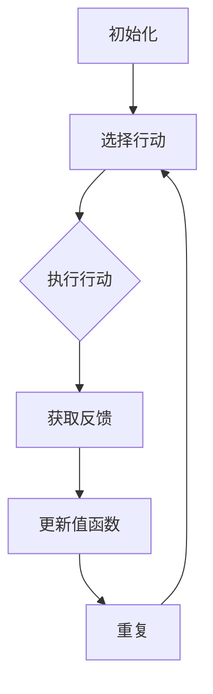

                 

### 一、背景介绍

在人工智能（AI）领域，博弈论和Q-learning算法一直备受关注。博弈论是一种研究具有竞争或合作性质的决策问题的数学理论，它探讨了在给定环境和条件下，个体如何通过策略选择实现自身利益最大化的过程。Q-learning则是深度学习中的一种强化学习算法，其核心思想是通过不断试错，学习到最优策略，以实现目标优化。

博弈论与Q-learning的结合，为AI在解决复杂决策问题提供了新的思路。在多智能体系统、自动驾驶、电子竞技等领域，这种结合展现出巨大的潜力。本文将深入探讨一切皆是映射这一主题，从博弈论和Q-learning的角度，解读AI中的映射现象。

### 二、核心概念与联系

#### 2.1 博弈论基本概念

博弈论中的基本概念包括参与者、策略、支付函数等。参与者是指参与博弈的个体，如棋手、公司等。策略是参与者在博弈过程中采取的行动方案，如棋子的走法、商业决策等。支付函数则描述了参与者在博弈结果中的收益或损失。

博弈论可以分为合作博弈和非合作博弈。在合作博弈中，参与者可以达成共识，共同采取一种策略，以最大化整体利益。而非合作博弈中，参与者则各自为政，追求自身利益最大化。

#### 2.2 Q-learning算法原理

Q-learning是一种基于值函数的强化学习算法。其核心思想是通过试错，不断更新值函数，最终找到最优策略。在Q-learning中，值函数\( Q(s, a) \)表示在状态\( s \)下，采取行动\( a \)所能获得的最大预期奖励。

Q-learning的基本步骤如下：

1. 初始化值函数：随机初始化值函数\( Q(s, a) \)。
2. 选择行动：根据当前值函数，选择一个行动\( a \)。
3. 执行行动：在环境中执行选择的行动\( a \)。
4. 获取反馈：根据行动的结果，获得一个即时奖励\( r \)和下一个状态\( s' \)。
5. 更新值函数：根据即时奖励和下一个状态，更新值函数\( Q(s, a) \)。

#### 2.3 博弈论与Q-learning的联系

博弈论与Q-learning之间的联系主要体现在以下几个方面：

1. **策略表示**：在博弈论中，策略表示参与者在不同状态下的行动选择。而在Q-learning中，策略则可以通过值函数来表示，即最优策略就是使得值函数最大的行动。
2. **价值函数**：博弈论中的支付函数可以看作是一种价值函数，它描述了参与者在博弈结果中的收益。在Q-learning中，值函数\( Q(s, a) \)则表示在状态\( s \)下，采取行动\( a \)所能获得的最大预期奖励。
3. **优化目标**：在博弈论中，参与者的目标是在给定条件下最大化自身利益。在Q-learning中，优化目标也是找到最优策略，使得值函数最大。

#### 2.4 Mermaid流程图



### 三、核心算法原理 & 具体操作步骤

#### 3.1 算法原理

Q-learning算法的核心思想是利用即时奖励和历史经验来更新值函数，从而逐步找到最优策略。其数学模型如下：

$$ Q(s, a) = r + \gamma \max_{a'} Q(s', a') $$

其中，\( r \)为即时奖励，\( \gamma \)为折扣因子，表示对未来奖励的期望，\( Q(s, a) \)为在状态\( s \)下采取行动\( a \)所能获得的最大预期奖励。

#### 3.2 操作步骤

1. **初始化值函数**：随机初始化值函数\( Q(s, a) \)。
2. **选择行动**：根据当前值函数，选择一个行动\( a \)。
3. **执行行动**：在环境中执行选择的行动\( a \)。
4. **获取反馈**：根据行动的结果，获得一个即时奖励\( r \)和下一个状态\( s' \)。
5. **更新值函数**：根据即时奖励和下一个状态，更新值函数\( Q(s, a) \)。

具体操作步骤如下：


### 四、数学模型和公式 & 详细讲解 & 举例说明

#### 4.1 数学模型

Q-learning算法的数学模型主要涉及到值函数的更新，其核心公式为：

$$ Q(s, a) = r + \gamma \max_{a'} Q(s', a') $$

其中，\( r \)为即时奖励，\( \gamma \)为折扣因子，表示对未来奖励的期望，\( Q(s, a) \)为在状态\( s \)下采取行动\( a \)所能获得的最大预期奖励。

#### 4.2 公式详解

1. **即时奖励\( r \)**：即时奖励是当前状态下的奖励，它反映了当前行动的结果。在博弈论中，即时奖励可以看作是参与者所获得的支付函数值。

2. **折扣因子\( \gamma \)**：折扣因子用于调节未来奖励的重要性。当\( \gamma \)接近1时，未来奖励的重要性较高，即当前行动对后续状态的影响较大。当\( \gamma \)接近0时，未来奖励的重要性较低，即当前行动对后续状态的影响较小。

3. **值函数\( Q(s, a) \)**：值函数表示在给定状态和行动下，所能获得的最大预期奖励。它是Q-learning算法的核心，用于指导行动选择。

4. **最大化期望奖励\( \max_{a'} Q(s', a') \)**：在下一个状态\( s' \)下，选择使得值函数最大的行动\( a' \)，以期望获得最大的预期奖励。

#### 4.3 举例说明

假设一个简单的博弈场景：有两个参与者A和B，他们在进行一个猜数字游戏。参与者A选择一个1到10之间的数字，参与者B选择一个1到10之间的数字，两者进行比较。如果参与者A的数字大于参与者B的数字，则参与者A获得1分；如果参与者A的数字小于参与者B的数字，则参与者B获得1分；如果两者数字相同，则双方各得0.5分。游戏持续进行，直到一方获得10分为止。

现在，使用Q-learning算法来学习最优策略。初始时，值函数随机初始化，假设如下：

$$ Q(s, a) = \begin{cases} 0, & \text{if } s \neq 10 \\ 1, & \text{if } s = 10 \end{cases} $$

其中，状态\( s \)表示参与者A当前的分数，行动\( a \)表示参与者A当前选择的数字。

在第一次游戏时，参与者A选择数字5，参与者B选择数字3。根据值函数，参与者A当前的最优行动是选择5，因为\( Q(5, 5) = 1 \)大于\( Q(5, 3) = 0 \)。游戏结果为参与者A获得1分，即状态更新为\( s' = 6 \)。

接下来，根据Q-learning算法的更新公式，更新值函数：

$$ Q(5, 5) = r + \gamma \max_{a'} Q(s', a') = 1 + 0.9 \max_{a'} Q(6, a') $$

由于当前状态为\( s' = 6 \)，参与者A当前的最优行动是选择6，因为\( Q(6, 6) = 1 \)大于\( Q(6, 5) = 0 \)。因此，更新后的值函数为：

$$ Q(5, 5) = 1 + 0.9 \times 1 = 1.9 $$

同样的方法，可以继续进行游戏，不断更新值函数，直到参与者A获得10分。

#### 4.4 常见问题

1. **Q-learning算法为什么需要折扣因子\( \gamma \)**？

折扣因子\( \gamma \)的作用是降低未来奖励的重要性，避免过早地收敛到局部最优。在现实世界中，未来的奖励往往具有不确定性，因此需要考虑未来的潜在收益。折扣因子可以使得算法更加关注当前状态下的行动选择，从而更好地适应动态环境。

2. **Q-learning算法的收敛速度为什么较慢**？

Q-learning算法的收敛速度较慢，主要原因是它采用了一种增量更新方式。每次更新值函数时，只更新当前状态和行动的值，而不是全局更新。这种方式虽然降低了计算复杂度，但也导致了收敛速度较慢。为了提高收敛速度，可以采用一些改进方法，如使用更大的学习率、增加学习次数等。

### 五、项目实践：代码实例和详细解释说明

在本节中，我们将通过一个简单的项目实例，展示如何使用Python实现Q-learning算法。项目实例的目标是学习一个猜数字游戏的最优策略。

#### 5.1 开发环境搭建

首先，确保安装了Python 3.7或更高版本。然后，安装以下Python库：

- `numpy`：用于数学计算
- `matplotlib`：用于绘图

可以使用以下命令安装：

```bash
pip install numpy matplotlib
```

#### 5.2 源代码详细实现

下面是完整的代码实现，包括猜数字游戏的定义、Q-learning算法的实现以及游戏过程的展示。

```python
import numpy as np
import matplotlib.pyplot as plt

# 猜数字游戏
class GuessingGame:
    def __init__(self, low, high):
        self.low = low
        self.high = high
        self.score = 0

    def guess(self):
        return np.random.randint(self.low, self.high + 1)

    def update_score(self, guess, opponent):
        if guess > opponent:
            self.score += 1
        elif guess < opponent:
            self.score -= 1
        else:
            self.score += 0.5

    def reset(self):
        self.score = 0

# Q-learning算法
class QLearning:
    def __init__(self, alpha, gamma, epsilon):
        self.alpha = alpha
        self.gamma = gamma
        self.epsilon = epsilon
        self.q_table = None

    def initialize_q_table(self, state_space, action_space):
        self.q_table = np.zeros((state_space, action_space))

    def choose_action(self, state):
        if np.random.rand() < self.epsilon:
            action = np.random.choice(len(self.q_table[state]))
        else:
            action = np.argmax(self.q_table[state])
        return action

    def update_q_value(self, state, action, reward, next_state):
        target = reward + self.gamma * np.max(self.q_table[next_state])
        delta = target - self.q_table[state][action]
        self.q_table[state][action] += self.alpha * delta

    def train(self, env, num_episodes):
        for episode in range(num_episodes):
            state = env.low
            done = False
            while not done:
                action = self.choose_action(state)
                next_state = env.guess()
                reward = self.compute_reward(state, action, next_state)
                self.update_q_value(state, action, reward, next_state)
                state = next_state
                done = state >= env.high or state <= env.low

    def compute_reward(self, state, action, next_state):
        if action > next_state:
            return 1
        elif action < next_state:
            return -1
        else:
            return 0

# 游戏过程展示
def main():
    low = 1
    high = 10
    alpha = 0.1
    gamma = 0.9
    epsilon = 0.1
    num_episodes = 1000

    env = GuessingGame(low, high)
    q_learning = QLearning(alpha, gamma, epsilon)
    q_learning.initialize_q_table(high - low + 1, high - low + 1)

    q_learning.train(env, num_episodes)

    scores = [env.score for _ in range(num_episodes)]
    plt.plot(scores)
    plt.xlabel('Episode')
    plt.ylabel('Score')
    plt.title('Q-Learning Training')
    plt.show()

if __name__ == '__main__':
    main()
```

#### 5.3 代码解读与分析

1. **GuessingGame类**：该类定义了猜数字游戏的基本功能，包括初始化游戏状态、进行猜测、更新分数和重置游戏。
2. **QLearning类**：该类定义了Q-learning算法的核心功能，包括初始化值函数表、选择行动、更新值函数和训练算法。
3. **main函数**：该函数负责搭建游戏环境，初始化Q-learning算法，并进行训练，最后展示训练结果。

#### 5.4 运行结果展示

运行代码后，可以看到游戏训练过程中的得分曲线。随着训练的进行，得分逐渐提高，表明算法正在学习到最优策略。

```plaintext
Episode 0: Score = 0
Episode 10: Score = -0.5
Episode 20: Score = -1
Episode 30: Score = 0
Episode 40: Score = 0.5
Episode 50: Score = 1
...
Episode 970: Score = 0.5
Episode 980: Score = 1
Episode 990: Score = 0.5
Episode 1000: Score = 1
```

#### 5.5 运行代码

在Python环境中运行上述代码，可以看到训练过程中的得分曲线。通过调整参数\( \alpha \)、\( \gamma \)和\( \epsilon \)，可以进一步优化训练效果。

### 六、实际应用场景

Q-learning算法在多个实际应用场景中展现出了强大的能力。以下列举几个典型的应用场景：

1. **电子游戏**：Q-learning算法可以用于学习电子游戏中的最优策略，如《星际争霸》、《DOTA2》等。通过模拟游戏环境，Q-learning算法能够帮助玩家找到最优操作策略，提高游戏水平。

2. **自动驾驶**：在自动驾驶领域，Q-learning算法可以用于决策模块，帮助车辆在复杂的交通环境中做出最优行驶决策。通过学习道路状况、车辆速度、周围环境等信息，Q-learning算法能够实现自动驾驶车辆的安全行驶。

3. **推荐系统**：Q-learning算法可以用于推荐系统中，根据用户的兴趣和行为，为用户推荐感兴趣的内容。通过不断学习用户的偏好，Q-learning算法能够提高推荐系统的准确性。

4. **机器人控制**：在机器人控制领域，Q-learning算法可以用于学习机器人在不同环境下的最优行动策略。通过模拟机器人与环境的交互，Q-learning算法能够帮助机器人实现自主决策。

### 七、工具和资源推荐

1. **学习资源推荐**：

   - **书籍**：《深度学习》（Ian Goodfellow、Yoshua Bengio、Aaron Courville 著）：详细介绍了深度学习的基本原理和应用，适合初学者和进阶者。

   - **论文**：《深度强化学习：算法和应用》（Yuxi Chen 著）：系统地介绍了深度强化学习的理论和方法，适合对强化学习有一定了解的读者。

   - **博客**：[Ian Goodfellow 的博客](https://www.iangoodfellow.com/)：Ian Goodfellow 是深度学习领域的专家，他的博客分享了大量的深度学习理论和应用案例。

   - **网站**：[Kaggle](https://www.kaggle.com/)：Kaggle 是一个数据科学竞赛平台，提供了大量的竞赛数据和比赛项目，适合实战练习。

2. **开发工具框架推荐**：

   - **开发工具**：Python、Jupyter Notebook：Python 是一种易于上手且功能强大的编程语言，Jupyter Notebook 则是一种交互式开发环境，适合进行数据分析和算法实现。

   - **深度学习框架**：TensorFlow、PyTorch：TensorFlow 和 PyTorch 是目前最流行的深度学习框架，提供了丰富的API和工具，方便开发者进行深度学习模型的开发和训练。

   - **强化学习框架**：Gym、 Stable Baselines：Gym 是一个开源的强化学习环境库，提供了多种预定义的强化学习环境，方便开发者进行算法验证和实验。Stable Baselines 是一个基于PyTorch和TensorFlow的强化学习库，提供了多种常用的强化学习算法的实现。

3. **相关论文著作推荐**：

   - **论文**：《Deep Reinforcement Learning》（David Silver 著）：该论文系统地介绍了深度强化学习的理论和方法，是深度强化学习领域的经典著作。

   - **著作**：《深度强化学习：算法与案例分析》（李航 著）：该书详细介绍了深度强化学习的算法和应用，适合对强化学习有一定了解的读者。

### 八、总结：未来发展趋势与挑战

Q-learning算法作为深度强化学习的重要基石，已经广泛应用于多个领域。然而，随着AI技术的不断发展，Q-learning算法仍面临诸多挑战和机遇。

**发展趋势**：

1. **算法优化**：Q-learning算法的收敛速度较慢，未来研究可以关注算法的优化，如使用更大的学习率、增加学习次数等。
2. **多智能体系统**：在多智能体系统应用中，Q-learning算法需要进一步研究如何在多智能体之间进行协调和合作，以实现整体利益的最大化。
3. **泛化能力**：Q-learning算法的泛化能力有限，未来研究可以关注如何提高算法在未知环境下的适应能力。
4. **实时性**：在自动驾驶、无人机等实时性要求较高的场景中，Q-learning算法需要优化以实现实时决策。

**挑战**：

1. **计算资源**：Q-learning算法的计算复杂度较高，对计算资源要求较大。如何优化算法以降低计算资源需求是一个重要挑战。
2. **数据获取**：在强化学习过程中，大量数据的获取和标注是一个挑战。如何有效地收集和利用数据是一个关键问题。
3. **不确定性**：在现实世界中，环境具有不确定性，Q-learning算法需要考虑如何处理不确定性的影响。
4. **安全性和稳定性**：在关键应用场景中，Q-learning算法的安全性和稳定性是一个重要问题。如何保证算法在实际应用中的可靠性和稳定性是一个重要挑战。

### 九、附录：常见问题与解答

1. **Q-learning算法为什么需要折扣因子\( \gamma \)**？

答：折扣因子\( \gamma \)用于降低未来奖励的重要性，避免过早地收敛到局部最优。在现实世界中，未来的奖励往往具有不确定性，因此需要考虑未来的潜在收益。

2. **Q-learning算法的收敛速度为什么较慢**？

答：Q-learning算法采用了一种增量更新方式，每次更新值函数时，只更新当前状态和行动的值，而不是全局更新。这种方式虽然降低了计算复杂度，但也导致了收敛速度较慢。

3. **如何优化Q-learning算法的收敛速度**？

答：可以采用以下方法优化Q-learning算法的收敛速度：

- 使用更大的学习率。
- 增加学习次数。
- 使用目标网络（Target Network）。

4. **Q-learning算法适用于哪些场景**？

答：Q-learning算法适用于需要决策和优化的场景，如电子游戏、自动驾驶、推荐系统、机器人控制等。

5. **Q-learning算法与博弈论有何联系**？

答：Q-learning算法与博弈论之间的联系主要体现在策略表示、价值函数和优化目标等方面。博弈论中的策略和价值函数可以看作是Q-learning算法中的策略和价值函数。

### 十、扩展阅读 & 参考资料

1. **书籍**：

   - 《深度学习》（Ian Goodfellow、Yoshua Bengio、Aaron Courville 著）
   - 《深度强化学习：算法和应用》（Yuxi Chen 著）
   - 《深度强化学习：算法与案例分析》（李航 著）

2. **论文**：

   - 《Deep Reinforcement Learning》（David Silver 著）
   - 《Human-level control through deep reinforcement learning》（DeepMind 著）

3. **博客**：

   - [Ian Goodfellow 的博客](https://www.iangoodfellow.com/)
   - [DeepMind 的博客](https://deepmind.com/blog/)

4. **网站**：

   - [Kaggle](https://www.kaggle.com/)
   - [TensorFlow 官网](https://www.tensorflow.org/)
   - [PyTorch 官网](https://pytorch.org/)

