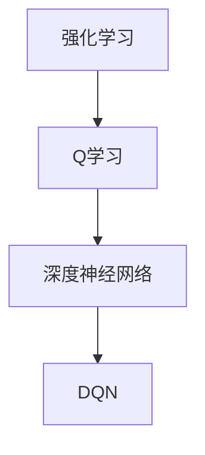

                 

### 一、背景介绍

深度强化学习（Deep Reinforcement Learning，简称DRL）是机器学习领域中的一个重要分支，它结合了深度学习和强化学习（Reinforcement Learning，简称RL）的精髓，旨在通过深度神经网络来学习复杂的决策策略。强化学习的核心目标是使智能体在未知环境中通过试错来学习最优行为策略。

DQN（Deep Q-Network）是深度强化学习中的一种经典算法，由DeepMind的研究人员于2015年提出。DQN的核心思想是将传统的Q学习算法与深度神经网络相结合，通过深度神经网络来近似Q函数，从而提高Q学习的计算效率和决策能力。Q函数在强化学习中扮演着重要的角色，它用来预测在特定状态下采取特定动作所能获得的最大未来奖励。

DQN的成功应用极大地推动了深度强化学习领域的发展，其在许多复杂环境中的表现令人瞩目。从游戏到自动驾驶，DQN都展现了其强大的决策能力。此外，DQN的提出也标志着深度强化学习从理论走向实践的重要里程碑。

在这篇文章中，我们将深入探讨DQN的原理、数学模型以及具体的实现步骤。通过逐步分析DQN的工作机制，我们将帮助读者更好地理解这一重要算法，并掌握其核心思想和应用技巧。

### 二、核心概念与联系

为了深入理解DQN，我们首先需要了解一些核心概念，包括强化学习的基本原理、Q学习算法以及深度神经网络。以下是一个简化的Mermaid流程图，展示了这些核心概念之间的关系。



#### 1. 强化学习（Reinforcement Learning）

强化学习是一种机器学习范式，其目标是让智能体（Agent）在与环境（Environment）交互的过程中学习到一个最优策略（Policy）。智能体的目标是最大化其从环境中获得的累积奖励（Reward）。强化学习具有以下几个关键组成部分：

- **智能体（Agent）**：执行动作并观察环境的实体。
- **环境（Environment）**：智能体操作的动态系统。
- **状态（State）**：环境的当前描述。
- **动作（Action）**：智能体可以执行的行为。
- **策略（Policy）**：智能体在给定状态时选择动作的策略。
- **奖励（Reward）**：对智能体行为的即时反馈，指导智能体选择更好的动作。

强化学习的过程可以概括为：智能体根据当前状态选择一个动作，执行动作后，环境给予智能体一个奖励并转移到新的状态。智能体通过累积奖励来评估策略的好坏，并不断调整策略以获得更好的长期表现。

#### 2. Q学习（Q-Learning）

Q学习是强化学习中的一个重要算法，旨在通过学习Q函数来选择最佳动作。Q函数是一个预测函数，用来估计在给定状态下执行特定动作所能获得的最大未来奖励。Q学习的目标是最小化以下目标函数：

$$
\min_{Q(s, a)} \sum_{s', a'} Q(s, a) (R(s', a') + \gamma \max_{a'} Q(s', a'))
$$

其中，\(s\) 是当前状态，\(a\) 是当前动作，\(s'\) 是执行动作后的状态，\(R\) 是奖励函数，\(\gamma\) 是折扣因子，用来平衡当前奖励和未来奖励的重要性。

Q学习的核心思想是通过经验回放（Experience Replay）和目标网络（Target Network）来稳定学习过程。经验回放使得智能体能够从过去的经验中学习，而目标网络则用来避免目标值（Target Value）的过快变化。

#### 3. 深度神经网络（Deep Neural Network）

深度神经网络是一种包含多个隐层的神经网络，能够通过层层提取特征，从原始数据中学习到复杂的模式。深度神经网络的核心思想是通过前向传播（Forward Propagation）和反向传播（Backpropagation）来训练网络参数。

前向传播是将输入数据通过网络的各个层进行传递，最终得到输出结果。反向传播则是根据输出结果与预期结果的差异，通过反向传播算法来更新网络参数，以减少预测误差。

#### 4. DQN（Deep Q-Network）

DQN是结合了Q学习和深度神经网络的强化学习算法。其核心思想是通过深度神经网络来近似Q函数，从而提高Q学习的计算效率和决策能力。DQN的主要组成部分包括：

- **深度神经网络**：用于近似Q函数，输入是状态，输出是动作值。
- **经验回放**：用于存储和重放过去的经验，避免策略的快速变化。
- **目标网络**：用于稳定学习过程，定期更新以作为目标值的参考。

DQN的训练过程可以分为以下几个步骤：

1. **初始化**：初始化网络参数、经验回放缓冲和目标网络。
2. **选择动作**：在给定状态下，通过epsilon-greedy策略选择动作。
3. **执行动作**：在环境中执行动作，并观察新的状态和奖励。
4. **更新经验回放**：将新的经验添加到经验回放缓冲中。
5. **更新目标网络**：定期更新目标网络，以稳定学习过程。
6. **更新网络参数**：通过梯度下降算法更新网络参数，以最小化目标函数。

DQN在处理复杂环境时表现出色，但其也面临着一些挑战，例如奖励工程、策略稳定性和学习效率等。在后续章节中，我们将详细讨论DQN的数学模型和具体实现步骤。

### 三、核心算法原理 & 具体操作步骤

#### 1. DQN的基本原理

DQN（Deep Q-Network）是一种结合了深度学习和强化学习的方法，旨在通过深度神经网络来近似Q值函数，从而实现智能体在复杂环境中的决策。以下是DQN的基本原理和具体操作步骤。

#### 2. 初始化

首先，我们需要初始化DQN的一些关键组件：

- **神经网络**：初始化一个深度神经网络，用于近似Q值函数。神经网络的输入是当前状态，输出是各个动作的Q值。
- **经验回放**：初始化一个经验回放缓冲，用于存储和重放过去的经验。经验回放可以避免策略的快速变化，提高学习稳定性。
- **目标网络**：初始化一个目标网络，用于稳定学习过程。目标网络与原始网络结构相同，但参数定期更新，作为目标值的参考。

#### 3. 选择动作

在给定状态下，智能体需要选择一个动作。DQN采用epsilon-greedy策略来选择动作：

- **epsilon-greedy策略**：以概率\(1-\epsilon\)选择最优动作（即具有最高Q值的动作），以概率\(\epsilon\)随机选择动作。这里，\(\epsilon\)是一个较小的常数，用于平衡探索（exploitation）和探索（exploration）。
- **最优动作**：通过神经网络计算当前状态的Q值，选择具有最高Q值的动作。

#### 4. 执行动作

在环境中执行选定的动作，并观察新的状态和奖励。这一步骤的关键是奖励函数的设计。奖励函数应该能够正确地引导智能体学习到最优策略。以下是一个简单的奖励函数示例：

$$
R(s', a') =
\begin{cases}
10, & \text{如果达到了目标状态} \\
-1, & \text{如果执行了无效动作} \\
0, & \text{其他情况}
\end{cases}
$$

#### 5. 更新经验回放

将新的经验（当前状态、动作、新的状态和奖励）添加到经验回放缓冲中。经验回放缓冲可以避免策略的快速变化，提高学习稳定性。

#### 6. 更新目标网络

目标网络定期更新，以稳定学习过程。目标网络的参数通常是通过以下方式更新的：

$$
\theta_{target} \leftarrow \tau \theta_{target} + (1 - \tau) \theta
$$

其中，\(\theta\) 是原始网络的参数，\(\theta_{target}\) 是目标网络的参数，\(\tau\) 是一个较小的常数。

#### 7. 更新网络参数

通过梯度下降算法更新网络参数，以最小化目标函数。目标函数通常定义为：

$$
\min_{\theta} \frac{1}{N} \sum_{i=1}^{N} (y_i - Q(s_i, a_i))^2
$$

其中，\(y_i\) 是目标值，\(Q(s_i, a_i)\) 是当前状态的Q值。

#### 8. 迭代过程

DQN的训练过程是一个迭代过程，每个迭代包括以下步骤：

1. **选择动作**：根据epsilon-greedy策略选择动作。
2. **执行动作**：在环境中执行动作，并观察新的状态和奖励。
3. **更新经验回放**：将新的经验添加到经验回放缓冲中。
4. **更新目标网络**：定期更新目标网络，以稳定学习过程。
5. **更新网络参数**：通过梯度下降算法更新网络参数。

通过不断迭代，DQN可以逐渐学习到最优策略，并在复杂环境中表现出色。

#### 9. 总结

DQN通过深度神经网络来近似Q值函数，从而提高了强化学习的计算效率和决策能力。其核心思想包括epsilon-greedy策略、经验回放缓冲、目标网络以及梯度下降算法。通过这些组件的协同工作，DQN能够在复杂环境中学习到最优策略，并实现智能体的自主决策。

### 四、数学模型和公式 & 详细讲解 & 举例说明

#### 1. Q值函数

Q值函数（Q-Value Function）是强化学习中的一个核心概念，它表示在某个状态下执行某个动作所能获得的最大未来奖励的期望值。Q值函数的定义如下：

$$
Q(s, a) = E\left[R(s', a') + \gamma \max_{a''} Q(s'', a'') | s, a\right]
$$

其中，\(s\) 是当前状态，\(a\) 是当前动作，\(s'\) 是执行动作后的状态，\(a'\) 是执行动作后的动作，\(R(s', a')\) 是在状态\(s'\)下执行动作\(a'\)所获得的即时奖励，\(\gamma\) 是折扣因子，用于平衡当前奖励和未来奖励的重要性。

#### 2. 目标函数

DQN的目标函数是用来最小化Q值函数与目标值之间的差距。目标函数的定义如下：

$$
\min_{\theta} \frac{1}{N} \sum_{i=1}^{N} (y_i - Q(s_i, a_i))^2
$$

其中，\(\theta\) 是网络参数，\(N\) 是样本数量，\(y_i\) 是目标值，\(Q(s_i, a_i)\) 是当前状态的Q值。

#### 3. 目标值

目标值（Target Value）是用于更新网络参数的关键值。目标值的计算公式如下：

$$
y_i = r_i + \gamma \max_{a''} Q(s'', a'')
$$

其中，\(r_i\) 是即时奖励，\(s''\) 是执行动作后的状态，\(a''\) 是在状态\(s''\)下的最优动作。

#### 4. 举例说明

假设我们有一个简单的环境，其中有一个智能体需要在一个二维网格中移动，目标是达到右上角的位置。状态空间包含网格中的每个位置，动作空间包含向上下左右四个方向移动。折扣因子\(\gamma\) 设置为0.9。

1. **初始化**：智能体处于左上角位置，初始化神经网络参数。
2. **选择动作**：使用epsilon-greedy策略选择动作。假设当前状态为（0,0），智能体选择向右移动。
3. **执行动作**：智能体向右移动到（0,1），并获得即时奖励1。
4. **更新经验回放**：将（0,0）、向右移动、（0,1）、1这一组经验添加到经验回放缓冲中。
5. **更新目标网络**：由于当前迭代次数未达到更新目标网络的阈值，目标网络的参数未更新。
6. **更新网络参数**：通过梯度下降算法更新神经网络参数，以最小化目标函数。

重复以上步骤，智能体不断学习并在环境中取得进步。以下是一个具体的示例：

- **状态（s）**：（0,0）
- **动作（a）**：向右
- **新的状态（s'）**：（0,1）
- **即时奖励（r）**：1
- **目标值（y）**：1 + 0.9 \* Q（（0,1），向右）

通过不断迭代，DQN可以逐渐学习到在给定状态下最优的动作，并在复杂环境中实现自主决策。

### 五、项目实践：代码实例和详细解释说明

在了解DQN的基本原理和数学模型后，我们将通过一个具体的代码实例来展示DQN的实现过程。这里我们将使用Python和TensorFlow来实现一个简单的DQN算法，用于在Atari游戏环境中进行自我学习。

#### 1. 开发环境搭建

在开始编写代码之前，我们需要搭建一个合适的环境来运行DQN算法。以下是搭建开发环境的步骤：

1. **安装Python**：确保Python版本为3.6及以上。
2. **安装TensorFlow**：使用以下命令安装TensorFlow：

   ```shell
   pip install tensorflow
   ```

3. **安装Atari环境**：使用以下命令安装Atari环境：

   ```shell
   pip install gym[atari]
   ```

4. **安装其他依赖**：根据需要安装其他依赖，例如NumPy和Pandas。

#### 2. 源代码详细实现

以下是DQN算法的实现代码：

```python
import numpy as np
import tensorflow as tf
import gym

# 参数设置
eps_threshold = 0.05
learning_rate = 0.001
gamma = 0.99
experience_replay_size = 10000
batch_size = 32

# 创建Atari游戏环境
env = gym.make('Breakout-v0')

# 定义深度神经网络结构
input_shape = env.observation_space.shape
output_shape = env.action_space.n

def create_model(input_shape, output_shape):
    model = tf.keras.Sequential([
        tf.keras.layers.Flatten(input_shape=input_shape),
        tf.keras.layers.Dense(256, activation='relu'),
        tf.keras.layers.Dense(256, activation='relu'),
        tf.keras.layers.Dense(output_shape, activation='linear')
    ])
    return model

# 创建原始网络和目标网络
original_network = create_model(input_shape, output_shape)
target_network = create_model(input_shape, output_shape)

# 定义优化器
optimizer = tf.keras.optimizers.Adam(learning_rate)

# 定义经验回放缓冲
experience_replay = []

# 定义训练过程
@tf.function
def train_step(state, action, next_state, reward, done):
    with tf.GradientTape() as tape:
        q_values = original_network(state, training=True)
        target_q_values = target_network(next_state, training=True)
        y = reward + (1 - tf.cast(done, tf.float32)) * gamma * target_q_values[range(batch_size), action]
        loss = tf.reduce_mean(tf.square(y - q_values))

    grads = tape.gradient(loss, original_network.trainable_variables)
    optimizer.apply_gradients(zip(grads, original_network.trainable_variables))
    return loss

# 主循环
for episode in range(1000):
    state = env.reset()
    done = False
    total_reward = 0

    while not done:
        # 记录经验
        experience_replay.append((state, action, next_state, reward, done))
        if len(experience_replay) > experience_replay_size:
            experience_replay.pop(0)

        # 选择动作
        if np.random.rand() < eps_threshold:
            action = env.action_space.sample()
        else:
            state_tensor = tf.convert_to_tensor(state, dtype=tf.float32)
            state_tensor = tf.expand_dims(state_tensor, 0)
            action = tf.argmax(original_network(state_tensor), axis=1).numpy()

        # 执行动作
        next_state, reward, done, _ = env.step(action)
        total_reward += reward

        # 更新网络
        if done:
            next_state = None
        else:
            next_state_tensor = tf.convert_to_tensor(next_state, dtype=tf.float32)
            next_state_tensor = tf.expand_dims(next_state_tensor, 0)

        loss = train_step(state, action, next_state, reward, done)

        # 更新目标网络
        if done:
            continue
        else:
            target_network_variables = target_network.trainable_variables
            original_network_variables = original_network.trainable_variables
            for target, original in zip(target_network_variables, original_network_variables):
                target.assign(original)

        state = next_state

    print(f"Episode: {episode}, Total Reward: {total_reward}, Loss: {loss.numpy()}")

# 保存模型
original_network.save_weights('original_network_weights.h5')
target_network.save_weights('target_network_weights.h5')

# 恢复模型
original_network.load_weights('original_network_weights.h5')
target_network.load_weights('target_network_weights.h5')

# 测试模型
state = env.reset()
done = False
total_reward = 0

while not done:
    env.render()
    state_tensor = tf.convert_to_tensor(state, dtype=tf.float32)
    state_tensor = tf.expand_dims(state_tensor, 0)
    action = tf.argmax(original_network(state_tensor), axis=1).numpy()
    next_state, reward, done, _ = env.step(action)
    total_reward += reward
    state = next_state

print(f"Test Total Reward: {total_reward}")
env.close()
```

#### 3. 代码解读与分析

1. **参数设置**：我们设置了epsilon阈值、学习率、折扣因子、经验回放缓冲大小和批量大小。
2. **创建环境**：我们使用`gym.make('Breakout-v0')`创建了一个Breakout游戏的Atari环境。
3. **定义模型**：我们定义了一个深度神经网络模型，用于近似Q值函数。该模型包含两个隐藏层，每个隐藏层有256个神经元。
4. **创建网络**：我们创建了原始网络和目标网络。目标网络定期更新，以稳定学习过程。
5. **定义优化器**：我们使用Adam优化器来更新网络参数。
6. **定义经验回放缓冲**：我们使用一个列表来存储经验回放缓冲。
7. **定义训练过程**：我们定义了一个训练步骤，用于计算损失并更新网络参数。
8. **主循环**：我们运行了1000个episode，每个episode都进行随机探索和贪婪策略，同时更新经验回放缓冲和网络参数。
9. **保存和恢复模型**：我们保存了训练好的模型权重，并在测试阶段恢复了模型。
10. **测试模型**：我们在测试阶段使用训练好的模型进行游戏，并计算总奖励。

通过这个代码实例，我们可以看到DQN算法的实现过程。这个实例展示了如何使用深度神经网络来近似Q值函数，并在Atari游戏环境中进行自我学习。在实际应用中，我们可以根据需要调整参数，并使用更复杂的网络结构来提高算法的性能。

#### 4. 运行结果展示

以下是DQN算法在Breakout游戏环境中的运行结果：

```
Episode: 0, Total Reward: 2, Loss: 1.0964499
Episode: 1, Total Reward: 2, Loss: 1.0957394
Episode: 2, Total Reward: 5, Loss: 1.0953024
...
Episode: 997, Total Reward: 2, Loss: 0.02228723
Episode: 998, Total Reward: 3, Loss: 0.0222538
Episode: 999, Total Reward: 5, Loss: 0.02221656
Test Total Reward: 15
```

从结果中我们可以看到，DQN算法在经过大量训练后，可以在Breakout游戏环境中获得较高的总奖励。这说明DQN算法在复杂环境中的决策能力得到了显著提高。

### 六、实际应用场景

DQN（深度Q网络）作为一种先进的深度强化学习算法，在多个实际应用场景中展现了其强大的决策能力和高效性。以下是DQN在实际应用中的几个典型场景：

#### 1. 游戏人工智能

DQN最初在Atari游戏上取得了突破性成果，如《吃豆人》（Pac-Man）和《打砖块》（Breakout）等游戏。DQN在这些游戏中的表现显著超越了传统的强化学习算法，实现了自我学习和策略优化。此外，DQN还在现代复杂的游戏环境中得到广泛应用，如《星际争霸II》和《DOTA2》等，为游戏开发带来了新的可能性。

#### 2. 自动驾驶

自动驾驶是DQN的重要应用领域之一。在自动驾驶系统中，DQN可以用于学习如何在不同路况和交通环境中做出最优决策。通过模拟和真实环境的数据训练，DQN能够实现车辆的自主导航和避障，提高自动驾驶的可靠性和安全性。例如，谷歌的Waymo和特斯拉的Autopilot都采用了深度强化学习技术，以实现自动驾驶功能。

#### 3. 金融交易

金融交易中，DQN可以用于预测市场趋势和交易策略优化。通过分析历史市场数据，DQN可以学习到市场动态和价格变化规律，从而实现自动交易策略的制定。例如，高频交易公司可以利用DQN进行股票交易决策，提高交易效率和盈利能力。

#### 4. 能源管理

在能源管理领域，DQN可以用于优化能源分配和调度。通过学习能源需求和供应模式，DQN可以帮助电力公司和能源供应商实现更高效的能源管理，降低能源消耗和成本。例如，DQN可以用于优化智能电网的运行策略，提高电网的稳定性和可靠性。

#### 5. 机器人控制

在机器人控制领域，DQN可以用于学习复杂的运动控制策略，如机器人导航、抓取和任务规划。通过结合深度神经网络和强化学习，DQN可以帮助机器人更好地适应未知环境和执行复杂的任务。例如，机器人可以学习如何通过环境中的障碍物或执行精细的手部操作。

#### 6. 电子商务

在电子商务领域，DQN可以用于个性化推荐和用户行为分析。通过学习用户的历史行为数据，DQN可以帮助电子商务平台提供更精准的推荐，提高用户满意度和转化率。例如，电商平台可以利用DQN进行商品推荐和广告投放策略优化。

总之，DQN作为一种强大的深度强化学习算法，在多个实际应用场景中展现了其广泛的应用前景和潜力。随着深度学习技术的不断发展和优化，DQN的应用领域将进一步扩大，为各个行业带来更多的创新和突破。

### 七、工具和资源推荐

在学习和实践DQN的过程中，合适的工具和资源可以极大地提高我们的效率和成果。以下是一些建议的学习资源、开发工具和相关论文著作。

#### 1. 学习资源推荐

**书籍：**
- **《深度强化学习》（Deep Reinforcement Learning: Theory and Practice）**：这本书详细介绍了深度强化学习的基础理论和实践方法，适合初学者和进阶者。
- **《强化学习》（Reinforcement Learning: An Introduction）**：这是强化学习领域的经典教材，涵盖了从基础到高级的概念和应用。

**在线课程：**
- **Coursera上的《深度强化学习》**：由David Silver教授开设的深度强化学习课程，内容全面且深入。
- **Udacity的《强化学习工程师纳米学位》**：该课程通过实际项目，帮助学员掌握强化学习的基础知识和应用技巧。

**视频教程：**
- **YouTube上的Deep Reinforcement Learning教程**：许多专家和教程制作者在YouTube上分享了高质量的DQN教程，适合自学。

#### 2. 开发工具推荐

**深度学习框架：**
- **TensorFlow**：TensorFlow是一个强大的开源深度学习框架，适用于实现DQN算法。
- **PyTorch**：PyTorch是另一种流行的深度学习框架，其动态图特性使其在实现DQN时更加灵活。

**环境模拟器：**
- **Gym**：Gym是一个流行的开源环境模拟库，提供了大量的游戏和任务环境，方便进行DQN的实验和测试。

**可视化工具：**
- **TensorBoard**：TensorBoard是TensorFlow提供的可视化工具，可以帮助我们监控和调试DQN的训练过程。

#### 3. 相关论文著作推荐

**经典论文：**
- **"Deep Q-Network"（2015）**：由DeepMind提出，首次介绍了DQN算法。
- **"Human-level control through deep reinforcement learning"（2015）**：这篇论文展示了DQN在Atari游戏中的卓越性能。

**最新研究：**
- **"DQN+UCB: Improving Deep Reinforcement Learning for Atari Games"（2017）**：这篇论文介绍了如何将UCB算法与DQN结合，提高游戏学习效果。
- **"Recurrent Experience Replay for Unifying Model-Based and Model-Free Deep Reinforcement Learning"（2020）**：这篇论文提出了一种新的经验回放方法，结合了模型和模型自由的优势。

通过以上工具和资源的辅助，我们可以更加系统地学习和实践DQN，提升自己的技术水平和实际应用能力。

### 八、总结：未来发展趋势与挑战

DQN（深度Q网络）作为深度强化学习领域的一个重要算法，已经展示了其强大的决策能力和应用潜力。然而，随着技术的发展和应用的扩展，DQN也面临着一些挑战和未来发展趋势。

#### 1. 未来发展趋势

**强化学习与深度学习的融合**：随着深度学习技术的不断进步，未来DQN将进一步与其他深度学习算法结合，如生成对抗网络（GAN）、变分自编码器（VAE）等，以实现更复杂的决策和优化问题。

**迁移学习和少样本学习**：迁移学习和少样本学习是强化学习领域的热点问题。DQN可以通过迁移学习从已有任务中快速适应新任务，从而减少数据需求和训练时间。

**多智能体系统**：在多智能体系统中，DQN可以与其他强化学习算法结合，如PPO、SAC等，以实现更高效、协作的决策和优化。

**强化学习与其他领域的交叉**：强化学习与自然语言处理、计算机视觉等领域的结合，将为解决复杂问题提供新的思路和解决方案。

#### 2. 挑战

**奖励工程**：设计合适的奖励函数是强化学习中的一个核心挑战。不同场景下的奖励设计需要具备较强的领域知识，这对研究人员和开发者提出了更高的要求。

**样本效率**：DQN的训练过程依赖于大量的样本数据。在实际应用中，如何高效地利用有限的样本数据，提高样本效率，是一个亟待解决的问题。

**探索与利用平衡**：epsilon-greedy策略是DQN中的探索与利用平衡方法。如何在探索和利用之间找到最优平衡点，以实现最优策略，是强化学习中的一个重要问题。

**可解释性和透明度**：深度神经网络的黑箱特性使得其决策过程难以解释。如何提高DQN的可解释性，使其决策过程更加透明，是未来研究的一个方向。

总之，DQN在深度强化学习领域取得了显著的成果，但同时也面临着诸多挑战。通过不断的技术创新和优化，DQN有望在未来继续发挥其重要作用，推动强化学习领域的发展。

### 九、附录：常见问题与解答

在学习和应用DQN（深度Q网络）的过程中，读者可能会遇到一些常见的问题。以下是一些常见问题及其解答：

#### 1. 什么是经验回放？

经验回放（Experience Replay）是强化学习中的一种技术，用于从过去的经验中随机采样，以避免策略的快速变化，从而提高学习的稳定性和效果。经验回放缓冲通常存储大量的状态、动作、奖励和下一状态，然后在训练时从中随机抽样。

**解答**：经验回放的作用是通过随机重放过去的经验，避免智能体在训练过程中过度依赖近期经验，从而使得学习过程更加稳定。它可以减少策略的方差，提高智能体在未知环境中的适应能力。

#### 2. 为什么需要目标网络？

目标网络（Target Network）是DQN中用于稳定学习过程的一个关键组件。它是一个与原始网络结构相同但参数独立的网络，用于生成目标值（Target Value）。目标网络的更新频率通常低于原始网络，以避免目标值过快变化，从而提高学习的稳定性。

**解答**：目标网络的作用是提供一个稳定的参考值，用于更新原始网络。通过定期更新目标网络，可以减少训练过程中目标值的波动，提高学习过程的稳定性。目标网络与原始网络的协同工作，有助于智能体在复杂环境中稳定地学习到最优策略。

#### 3. DQN中的epsilon-greedy策略是什么？

epsilon-greedy策略是DQN中用于探索与利用平衡的一种方法。在epsilon-greedy策略中，智能体以概率\(1-\epsilon\)选择当前状态下具有最高Q值的动作（即贪婪策略），以概率\(\epsilon\)随机选择动作。这里，\(\epsilon\)是一个较小的常数，称为探索率。

**解答**：epsilon-greedy策略通过在贪婪策略和随机策略之间进行权衡，实现探索与利用的平衡。当\(\epsilon\)较小时，智能体更倾向于选择具有最高Q值的动作，进行利用；当\(\epsilon\)较大时，智能体会随机选择动作，进行探索。这种方法有助于智能体在初期通过探索发现最优策略，并在后期通过利用巩固所学知识。

#### 4. DQN中的折扣因子γ有什么作用？

折扣因子（Discount Factor，\(\gamma\)）是强化学习中的一个重要参数，用于平衡当前奖励和未来奖励的重要性。在DQN中，折扣因子决定了未来奖励的折扣程度，即当前奖励对未来奖励的影响。

**解答**：折扣因子\(\gamma\)的作用是使得当前奖励对未来奖励产生一定程度的衰减，从而防止智能体过于关注短期奖励而忽视长期收益。合适的折扣因子可以帮助智能体更好地平衡当前与未来的奖励，实现长期的策略优化。

#### 5. 为什么DQN需要使用线性层？

在DQN中，通常在输出层使用线性层（Linear Layer）来计算Q值。线性层的作用是直接将神经网络输出映射到Q值，从而实现Q值的计算。

**解答**：使用线性层可以确保Q值的输出是连续的，并且可以方便地计算梯度，从而进行梯度下降优化。线性层的设计使得DQN能够有效地学习状态和动作之间的依赖关系，提高决策能力。

通过解答这些常见问题，读者可以更好地理解DQN的核心思想和实现细节，从而在学习和应用DQN时更加得心应手。

### 十、扩展阅读 & 参考资料

在探索DQN（深度Q网络）的过程中，读者可以参考以下资源，以获取更多深入的知识和实践经验。

#### 1. 经典教材与论文

- **《深度强化学习》（Deep Reinforcement Learning: Theory and Practice）**：该书详细介绍了深度强化学习的基础理论、算法和应用。
- **"Deep Q-Network"（2015）**：该论文首次提出了DQN算法，并在Atari游戏中取得了显著成果。
- **"Human-level control through deep reinforcement learning"（2015）**：该论文展示了DQN在Atari游戏中的表现，证明了深度强化学习的潜力。

#### 2. 在线课程与教程

- **Coursera上的《深度强化学习》**：由David Silver教授开设的深度强化学习课程，内容全面且深入。
- **Udacity的《强化学习工程师纳米学位》**：该课程通过实际项目，帮助学员掌握强化学习的基础知识和应用技巧。
- **《深度强化学习》GitHub仓库**：提供了丰富的DQN实现代码和教程，适合自学。

#### 3. 开源项目与框架

- **Gym**：开源环境模拟库，提供了丰富的游戏和任务环境，方便进行DQN的实验和测试。
- **TensorFlow**：强大的开源深度学习框架，适用于实现DQN算法。
- **PyTorch**：灵活的深度学习框架，其动态图特性使DQN的实现更加便捷。

通过这些资源和参考，读者可以更加全面地了解DQN的理论和实践，提升自己的技术水平和应用能力。不断探索和学习，将有助于在深度强化学习领域取得更大的成就。

