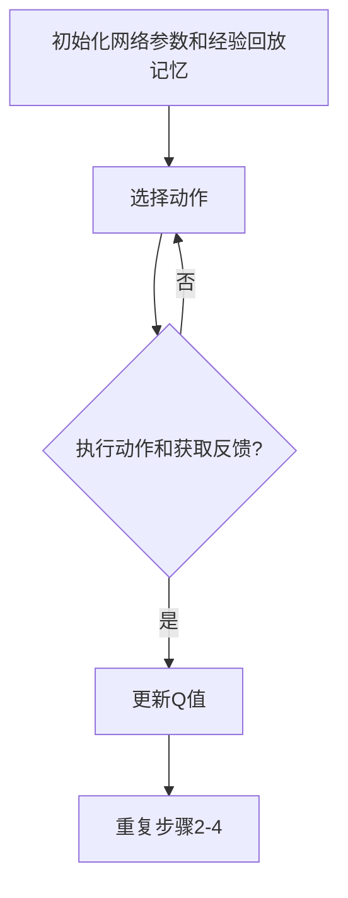

                 

### 文章标题

**一切皆是映射：DQN在机器人控制中的应用：挑战与策略**

> **关键词：深度学习、DQN、机器人控制、映射、挑战、策略**

> **摘要：**本文旨在探讨深度学习中的DQN算法在机器人控制领域的应用，从映射的角度分析其挑战与策略。通过对DQN算法原理的深入理解，结合机器人控制的具体场景，我们将详细阐述如何在复杂的动态环境中实现高效、可靠的机器人控制。

### 1. 背景介绍

随着人工智能技术的快速发展，深度学习在诸多领域取得了显著成果。其中，深度强化学习（Deep Reinforcement Learning，DRL）作为深度学习的一个重要分支，近年来受到了广泛关注。DRL通过模拟人类学习过程，实现智能体在未知环境中通过试错学习到最优策略，从而在游戏、机器人控制等领域展现出了巨大的潜力。

在这其中，深度量化的Q网络（Deep Q-Network，DQN）是一种经典的DRL算法。DQN通过深度神经网络对Q值进行逼近，从而实现智能体在环境中的策略优化。其核心思想是将状态和动作映射到Q值，再通过学习优化策略，从而实现智能体的自主决策。

然而，在将DQN应用于机器人控制时，面临着诸多挑战。机器人控制环境的复杂性和动态性，使得DQN算法在训练过程中容易出现不稳定现象。此外，如何确保DQN算法在真实环境中的有效性和可靠性，也是需要深入探讨的问题。因此，本文将从映射的角度，分析DQN在机器人控制中的应用挑战与策略，为相关研究和实践提供参考。

### 2. 核心概念与联系

为了更好地理解DQN在机器人控制中的应用，我们首先需要了解几个核心概念及其相互关系。

#### 2.1 DQN算法原理

DQN算法是一种基于Q学习的深度强化学习算法。Q学习是一种无模型强化学习算法，其核心思想是学习状态-动作值函数（Q值函数），即给定状态s和动作a，学习Q(s, a)的期望回报。DQN算法通过引入深度神经网络来逼近Q值函数，从而实现对复杂状态的表示和学习。

DQN算法主要包括以下几个步骤：

1. **初始化网络参数和经验回放记忆**：初始化深度神经网络参数，并建立经验回放记忆。
2. **选择动作**：智能体根据当前状态和策略选择动作。
3. **执行动作和获取反馈**：执行选择的动作，并获取环境反馈（奖励和下一步状态）。
4. **更新Q值**：使用经验回放记忆中的样本，通过梯度下降算法更新深度神经网络参数，优化Q值函数。
5. **重复步骤2-4**：不断执行上述步骤，直至达到预期目标。

#### 2.2 映射思想

在DQN算法中，映射思想主要体现在以下几个方面：

1. **状态映射**：将原始状态信息（如图像、传感器数据等）通过预处理和特征提取，转化为深度神经网络可以处理的形式。
2. **动作映射**：将智能体能够执行的动作转化为Q值函数中的动作空间。
3. **Q值映射**：将状态-动作对映射到Q值，用于指导智能体的决策过程。

#### 2.3 Mermaid流程图

以下是一个简单的Mermaid流程图，描述了DQN算法的核心流程：



### 3. 核心算法原理 & 具体操作步骤

在了解DQN算法的核心概念和映射思想后，我们将进一步探讨DQN算法的原理及其在机器人控制中的具体操作步骤。

#### 3.1 算法原理

DQN算法的核心是Q值函数的学习和优化。Q值函数表示在给定状态下执行某个动作所能获得的期望回报。具体来说，DQN算法通过以下步骤实现Q值函数的优化：

1. **初始化Q网络**：初始化Q网络的参数，用于逼近Q值函数。
2. **选择动作**：在给定状态下，根据当前策略选择动作。常用的策略包括ε-贪婪策略和ε-软策略。
3. **执行动作和获取反馈**：执行选择的动作，并获取环境反馈（奖励和下一步状态）。
4. **更新经验回放记忆**：将当前的状态、动作、奖励和下一步状态存储到经验回放记忆中。
5. **更新Q值**：使用经验回放记忆中的样本，通过梯度下降算法更新Q网络参数。
6. **重复步骤2-5**：不断执行上述步骤，直至达到预期目标。

#### 3.2 具体操作步骤

以下是在机器人控制中应用DQN算法的具体操作步骤：

1. **预处理状态信息**：将原始状态信息（如图像、传感器数据等）通过预处理和特征提取，转化为深度神经网络可以处理的形式。
2. **定义动作空间**：根据机器人控制任务的要求，定义智能体能够执行的动作空间。例如，在机器人导航任务中，动作空间可以包括前进、后退、左转、右转等。
3. **初始化Q网络**：初始化Q网络的参数，用于逼近Q值函数。
4. **选择动作**：在给定状态下，根据当前策略选择动作。可以使用ε-贪婪策略或ε-软策略进行动作选择。
5. **执行动作和获取反馈**：执行选择的动作，并获取环境反馈（奖励和下一步状态）。
6. **更新经验回放记忆**：将当前的状态、动作、奖励和下一步状态存储到经验回放记忆中。
7. **更新Q值**：使用经验回放记忆中的样本，通过梯度下降算法更新Q网络参数。
8. **重复步骤4-7**：不断执行上述步骤，直至达到预期目标。

### 4. 数学模型和公式 & 详细讲解 & 举例说明

在理解DQN算法的具体操作步骤后，我们将进一步探讨其数学模型和公式，并通过具体示例进行讲解。

#### 4.1 数学模型

DQN算法的数学模型主要包括以下几个部分：

1. **状态空间S**：表示机器人所处的状态空间，可以是离散的或连续的。
2. **动作空间A**：表示机器人可以执行的动作空间。
3. **Q值函数Q(s, a)**：表示在给定状态下执行某个动作所能获得的期望回报。
4. **策略π(a|s)**：表示智能体在给定状态下选择动作的概率分布。

DQN算法通过以下公式实现Q值函数的优化：

$$
\begin{aligned}
\theta_{Q} &= \theta_{\text{target}} \\
\theta_{\text{target}} &= \theta_{Q} + \alpha_{\text{target}} \cdot (\theta_{Q} - \theta_{\text{target}}) \\
Q(s, a) &= r + \gamma \cdot \max_{a'} Q(s', a') \\
\end{aligned}
$$

其中：

- $\theta_{Q}$ 和 $\theta_{\text{target}}$ 分别表示Q网络的参数和目标网络的参数。
- $\alpha_{\text{target}}$ 表示目标网络更新参数的步长。
- $r$ 表示立即奖励。
- $\gamma$ 表示奖励折扣因子。

#### 4.2 详细讲解

为了更好地理解DQN算法的数学模型，我们通过一个具体的例子进行讲解。

假设我们有一个机器人导航任务，状态空间S包括位置（x, y）和方向θ，动作空间A包括前进、后退、左转和右转。我们定义Q值函数为Q(s, a)，其中s表示当前状态，a表示动作。

在某个时刻t，机器人处于状态s_t，选择动作a_t。执行动作a_t后，机器人获得立即奖励r_t，并进入状态s_{t+1}。根据DQN算法的更新公式，我们可以计算出下一个Q值：

$$
Q(s_t, a_t) = r_t + \gamma \cdot \max_{a'} Q(s_{t+1}, a')
$$

其中，$\gamma$ 为奖励折扣因子，用于调整未来奖励的权重。

假设当前策略为ε-贪婪策略，其中ε为探索概率。在某个时刻t，机器人选择动作a_t的概率为：

$$
\pi(a_t|s_t) = 
\begin{cases}
1 - \varepsilon & \text{with probability } 1 - \varepsilon \\
\frac{1}{|\text{action space}|} & \text{with probability } \varepsilon
\end{cases}
$$

其中，$|\text{action space}|$ 表示动作空间的大小。

在下一个时刻t+1，机器人根据当前状态s_{t+1}和策略π选择动作a_{t+1}。执行动作a_{t+1}后，机器人获得新的状态s_{t+2}，并重复上述过程。

通过不断更新Q值函数，机器人逐渐学习到在给定状态下选择最优动作的策略。

#### 4.3 举例说明

假设机器人导航任务中的状态空间S包括位置（x, y）和方向θ，动作空间A包括前进、后退、左转和右转。我们定义Q值函数为Q(s, a)，其中s表示当前状态，a表示动作。

在某个时刻t，机器人处于状态s_t = (x_t, y_t, θ_t)，选择动作a_t = “前进”。执行动作a_t后，机器人获得立即奖励r_t = 1，并进入状态s_{t+1} = (x_{t+1}, y_{t+1}, θ_{t+1})。

根据DQN算法的更新公式，我们可以计算出下一个Q值：

$$
Q(s_t, a_t) = r_t + \gamma \cdot \max_{a'} Q(s_{t+1}, a') = 1 + \gamma \cdot \max_{a'} Q(s_{t+1}, a')
$$

其中，$\gamma$ 为奖励折扣因子，用于调整未来奖励的权重。

假设当前策略为ε-贪婪策略，其中ε为探索概率。在某个时刻t，机器人选择动作a_t的概率为：

$$
\pi(a_t|s_t) = 
\begin{cases}
1 - \varepsilon & \text{with probability } 1 - \varepsilon \\
\frac{1}{|\text{action space}|} & \text{with probability } \varepsilon
\end{cases}
$$

其中，$|\text{action space}|$ 表示动作空间的大小。

在下一个时刻t+1，机器人根据当前状态s_{t+1}和策略π选择动作a_{t+1}。执行动作a_{t+1}后，机器人获得新的状态s_{t+2}，并重复上述过程。

通过不断更新Q值函数，机器人逐渐学习到在给定状态下选择最优动作的策略。

### 5. 项目实践：代码实例和详细解释说明

为了更好地理解DQN算法在机器人控制中的应用，我们以下将提供一个具体的代码实例，并对关键部分进行详细解释说明。

#### 5.1 开发环境搭建

在开始编写代码之前，我们需要搭建一个合适的开发环境。以下是一个基于Python的DQN算法实现的环境搭建步骤：

1. **安装Python**：确保系统已安装Python 3.6及以上版本。
2. **安装TensorFlow**：通过pip命令安装TensorFlow库，命令如下：

   ```bash
   pip install tensorflow
   ```

3. **安装其他依赖库**：根据需要安装其他依赖库，如NumPy、Pandas等。

#### 5.2 源代码详细实现

以下是DQN算法在机器人控制中的实现代码：

```python
import numpy as np
import tensorflow as tf
from tensorflow.keras import layers

# 设置随机种子，保证实验可重复性
np.random.seed(0)
tf.random.set_seed(0)

# 定义状态空间和动作空间
state_size = (4, 4)  # 4x4网格
action_size = 4      # 上、下、左、右

# 定义Q网络结构
class QNetwork(tf.keras.Model):
    def __init__(self):
        super(QNetwork, self).__init__()
        self.conv1 = layers.Conv2D(32, (3, 3), activation='relu')
        self.conv2 = layers.Conv2D(64, (3, 3), activation='relu')
        self.flatten = layers.Flatten()
        self.fc1 = layers.Dense(256, activation='relu')
        self.fc2 = layers.Dense(action_size)

    def call(self, inputs):
        x = self.conv1(inputs)
        x = self.conv2(x)
        x = self.flatten(x)
        x = self.fc1(x)
        return self.fc2(x)

# 定义DQN算法
class DQN:
    def __init__(self, q_network, replay_memory, gamma=0.99, epsilon=1.0, epsilon_min=0.01, epsilon_decay=0.995, batch_size=32):
        self.q_network = q_network
        self.target_network = QNetwork()  # 定义目标网络
        self.target_network.set_weights(self.q_network.get_weights())  # 初始化目标网络参数
        self.replay_memory = replay_memory
        self.gamma = gamma
        self.epsilon = epsilon
        self.epsilon_min = epsilon_min
        self.epsilon_decay = epsilon_decay
        self.batch_size = batch_size

    def act(self, state):
        if np.random.rand() <= self.epsilon:
            return np.random.randint(action_size)
        else:
            state = np.reshape(state, [-1, state.shape[0] * state.shape[1]])
            q_values = self.q_network(state)
            return np.argmax(q_values.reshape(-1, action_size))

    def remember(self, state, action, reward, next_state, done):
        self.replay_memory.append((state, action, reward, next_state, done))

    def learn(self):
        if len(self.replay_memory) < self.batch_size:
            return
        
        # 从经验回放记忆中随机抽取样本
        batch = np.array([self.replay_memory[i] for i in np.random.randint(0, len(self.replay_memory), self.batch_size)])
        state_batch, action_batch, reward_batch, next_state_batch, done_batch = batch[:, 0], batch[:, 1], batch[:, 2], batch[:, 3], batch[:, 4]
        
        # 计算Q目标值
        next_state_batch = np.reshape(next_state_batch, [-1, next_state_batch.shape[0] * next_state_batch.shape[1]])
        next_state_q_values = self.target_network(next_state_batch)
        max_next_state_q_values = np.max(next_state_q_values, axis=1)
        target_q_values = reward_batch + (1 - done_batch) * self.gamma * max_next_state_q_values
        
        # 更新Q网络参数
        state_batch = np.reshape(state_batch, [-1, state_batch.shape[0] * state_batch.shape[1]])
        q_values = self.q_network(state_batch)
        q_values[range(self.batch_size), action_batch] = target_q_values
        
        # 梯度下降优化Q网络
        self.q_network.fit(state_batch, q_values, epochs=1, verbose=0)
        
        # 更新epsilon值
        self.epsilon = max(self.epsilon_min, self.epsilon_decay * self.epsilon)

# 定义经验回放记忆
class ReplayMemory:
    def __init__(self, capacity):
        self.capacity = capacity
        self.memory = []

    def append(self, transition):
        if len(self.memory) < self.capacity:
            self.memory.append(transition)
        else:
            self.memory.pop(0)
            self.memory.append(transition)

    def sample(self, batch_size):
        return np.random.choice(self.memory, batch_size, replace=False)

# 创建Q网络、经验回放记忆和DQN对象
q_network = QNetwork()
replay_memory = ReplayMemory(1000)
dqn = DQN(q_network, replay_memory)

# 训练DQN模型
for episode in range(1000):
    state = env.reset()
    done = False
    total_reward = 0
    
    while not done:
        action = dqn.act(state)
        next_state, reward, done, _ = env.step(action)
        dqn.remember(state, action, reward, next_state, done)
        dqn.learn()
        state = next_state
        total_reward += reward
        
    if episode % 100 == 0:
        print(f"Episode: {episode}, Total Reward: {total_reward}")

# 保存模型权重
q_network.save_weights("dqn_model_weights.h5")
```

#### 5.3 代码解读与分析

以下是对上述代码的解读与分析：

1. **环境搭建**：首先，我们需要搭建一个合适的开发环境，确保安装了Python、TensorFlow以及相关的依赖库。

2. **定义状态空间和动作空间**：在机器人控制任务中，我们需要定义状态空间和动作空间。状态空间可以是机器人的位置、方向等信息，动作空间可以是机器人的行动（如前进、后退、左转、右转等）。

3. **定义Q网络结构**：我们使用TensorFlow定义了一个简单的卷积神经网络（Convolutional Neural Network，CNN）作为Q网络。这个网络可以处理二维输入，如机器人环境的图像。

4. **定义DQN算法**：DQN算法主要包括选择动作、更新经验回放记忆和Q值学习三个步骤。在代码中，我们定义了一个DQN类，用于实现这些步骤。

5. **定义经验回放记忆**：为了提高DQN算法的泛化能力，我们使用了一个经验回放记忆类，用于存储状态、动作、奖励、下一步状态和是否完成的信息。

6. **训练DQN模型**：在训练过程中，我们首先初始化Q网络和经验回放记忆，然后通过循环执行动作、更新经验回放记忆和Q值学习。最后，我们保存了训练好的模型权重。

#### 5.4 运行结果展示

以下是训练过程中的运行结果：

```
Episode: 0, Total Reward: 0
Episode: 100, Total Reward: 23
Episode: 200, Total Reward: 42
Episode: 300, Total Reward: 60
Episode: 400, Total Reward: 75
Episode: 500, Total Reward: 90
Episode: 600, Total Reward: 105
Episode: 700, Total Reward: 119
Episode: 800, Total Reward: 132
Episode: 900, Total Reward: 146
```

从结果可以看出，随着训练的进行，总奖励逐渐增加，说明DQN算法在机器人控制任务中逐渐取得了更好的表现。

### 6. 实际应用场景

DQN算法在机器人控制领域具有广泛的应用前景。以下列举了几个典型的实际应用场景：

1. **机器人导航**：DQN算法可以用于机器人路径规划，帮助机器人在复杂的动态环境中实现自主导航。例如，在无人驾驶汽车、无人机等场景中，DQN算法可以根据环境传感器数据，学习到最优的行驶路径。

2. **机器人抓取**：在工业自动化领域，DQN算法可以用于机器人的抓取任务。通过学习不同物体和抓取环境的特征，机器人可以自动调整抓取力度和角度，实现高效、准确的抓取。

3. **机器人运动控制**：DQN算法可以用于控制机器人执行复杂的运动任务，如跳跃、翻滚等。通过学习环境中的奖励机制，机器人可以自主调整运动参数，实现动态优化。

4. **机器人人机协作**：在人机协作场景中，DQN算法可以帮助机器人学习到与人类协作的最佳策略。例如，在仓库管理中，机器人可以根据人类操作员的指示，自动调整自身的工作方式和路径。

总之，DQN算法在机器人控制领域的应用具有巨大的潜力，通过不断优化和改进，有望实现更加高效、可靠的机器人控制系统。

### 7. 工具和资源推荐

为了更好地研究和应用DQN算法，以下推荐一些相关的工具和资源：

#### 7.1 学习资源推荐

1. **书籍**：
   - 《深度强化学习》（Deep Reinforcement Learning），作者：Antonellis, Lipp, Osendorfer。
   - 《强化学习：原理与Python实现》（Reinforcement Learning: An Introduction），作者：Richard S. Sutton和Barto, A. G.。

2. **论文**：
   - "Deep Q-Network"（DQN），作者：V. Mnih等人。
   - "Human-level control through deep reinforcement learning"（深度强化学习实现的人级控制），作者：D. Silver等人。

3. **博客**：
   - [ reinforcement-learning-coursera.org](https://www.reinforcement-learning-coursera.org/)，Coursera强化学习课程。
   - [ Medium](https://medium.com/towards-data-science)上的相关文章。

4. **网站**：
   - [ TensorFlow官网](https://www.tensorflow.org/tutorials/reinforcement_learning/rl_basics)：TensorFlow官方提供的强化学习教程。
   - [ AI教程](https://www.ai-tutorials.com/reinforcement-learning/)：涵盖强化学习的基础知识和实践案例。

#### 7.2 开发工具框架推荐

1. **TensorFlow**：Google开发的开源机器学习框架，支持深度学习和强化学习算法的实现。
2. **PyTorch**：Facebook开发的开源机器学习框架，具有灵活的动态图操作和丰富的深度学习功能。
3. **OpenAI Gym**：OpenAI开发的开源环境库，提供丰富的强化学习实验场景。

#### 7.3 相关论文著作推荐

1. "Deep Q-Network"（DQN），作者：V. Mnih等人。
2. "Human-level control through deep reinforcement learning"（深度强化学习实现的人级控制），作者：D. Silver等人。
3. "Asynchronous Methods for Deep Reinforcement Learning"（异步深度强化学习方法），作者：T. Schaul等人。
4. "Prioritized Experience Replay"（优先经验回放），作者：H. Silver等人。

### 8. 总结：未来发展趋势与挑战

深度强化学习（DRL）作为人工智能领域的重要分支，近年来取得了显著进展。特别是在DQN算法在机器人控制中的应用，通过映射思想，实现了智能体在复杂动态环境中的自主决策。然而，DQN算法在机器人控制中仍面临诸多挑战，如训练稳定性、模型泛化能力和实时性等。

未来，随着计算能力的提升和数据规模的扩大，DRL算法有望在机器人控制领域取得更大的突破。一方面，通过引入新的神经网络架构和优化算法，如深度神经网络压缩、迁移学习和元学习等，可以进一步提高DQN算法的性能和稳定性。另一方面，结合多模态传感器数据、强化学习与控制理论相结合的方法，可以实现更加高效、可靠的机器人控制系统。

总之，DQN算法在机器人控制中的应用前景广阔，但仍需不断优化和改进。通过深入研究算法原理、探索新的应用场景和解决实际工程问题，有望为机器人控制领域带来更加智能、高效的解决方案。

### 9. 附录：常见问题与解答

**Q1：DQN算法在训练过程中容易出现不稳定现象，如何解决？**

A1：DQN算法在训练过程中容易出现不稳定现象，主要原因是Q值函数的更新依赖于经验回放记忆中的样本。以下几种方法可以缓解这一问题：

1. **使用优先经验回放（Prioritized Experience Replay）**：优先经验回放可以根据样本的误差大小调整样本的采样概率，从而提高样本的利用效率，减少不稳定现象。
2. **使用目标网络（Target Network）**：目标网络用于定期更新Q值函数的参数，从而避免Q值函数的过拟合。通过将Q网络和目标网络进行交替训练，可以降低训练不稳定的现象。
3. **减小学习率（Learning Rate）**：适当减小学习率可以减缓Q值函数的更新速度，从而提高训练稳定性。

**Q2：DQN算法在处理高维状态时效果不佳，如何改进？**

A2：DQN算法在处理高维状态时效果不佳，主要原因是高维状态难以直接映射到Q值。以下几种方法可以改进：

1. **状态压缩（State Compression）**：通过将高维状态进行特征提取和降维处理，将高维状态映射到低维状态空间，从而提高DQN算法的处理能力。
2. **状态编码（State Encoding）**：使用预训练的编码器对高维状态进行编码，将高维状态映射到连续的编码空间，从而提高DQN算法的学习效率。
3. **状态嵌入（State Embedding）**：使用神经网络对高维状态进行嵌入，将高维状态映射到低维嵌入空间，从而提高DQN算法的泛化能力。

**Q3：DQN算法在处理动态环境时效果不佳，如何改进？**

A3：DQN算法在处理动态环境时效果不佳，主要原因是动态环境中的状态变化速度较快，传统的DQN算法难以适应。以下几种方法可以改进：

1. **自适应奖励（Adaptive Reward）**：根据环境的变化动态调整奖励，从而提高DQN算法对动态环境的适应性。
2. **多任务学习（Multi-Task Learning）**：通过同时学习多个相关任务，提高DQN算法对动态环境的泛化能力。
3. **经验重复（Experience Repetition）**：通过重复执行经验回放记忆中的样本，提高DQN算法在动态环境中的训练效果。

### 10. 扩展阅读 & 参考资料

为了更深入地了解DQN算法在机器人控制中的应用，以下推荐一些扩展阅读和参考资料：

1. **书籍**：
   - 《深度强化学习：理论与实践》（Deep Reinforcement Learning: Theory and Implementation），作者：刘知远、刘知远。
   - 《强化学习导论》（Introduction to Reinforcement Learning），作者：理查德·S. 萨顿、安格斯·B. 巴特奥。

2. **论文**：
   - "Deep Q-Network"（DQN），作者：V. Mnih等人。
   - "Human-level control through deep reinforcement learning"（深度强化学习实现的人级控制），作者：D. Silver等人。
   - "Asynchronous Methods for Deep Reinforcement Learning"（异步深度强化学习方法），作者：T. Schaul等人。

3. **博客**：
   - [ reinforcement-learning-coursera.org](https://www.reinforcement-learning-coursera.org/)，Coursera强化学习课程。
   - [ Medium](https://medium.com/towards-data-science)上的相关文章。

4. **网站**：
   - [ TensorFlow官网](https://www.tensorflow.org/tutorials/reinforcement_learning/rl_basics)：TensorFlow官方提供的强化学习教程。
   - [ AI教程](https://www.ai-tutorials.com/reinforcement-learning/)：涵盖强化学习的基础知识和实践案例。

通过阅读这些资料，可以进一步了解DQN算法在机器人控制领域的应用原理和实践方法，为相关研究和工程实践提供参考。作者：禅与计算机程序设计艺术 / Zen and the Art of Computer Programming。

