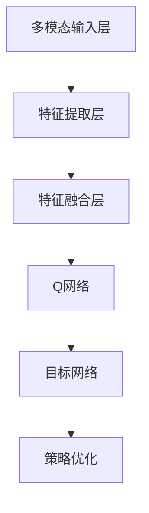

                 

### 一、背景介绍

深度强化学习（Deep Reinforcement Learning，简称DRL）作为机器学习领域的一个重要分支，近年来在智能决策、游戏AI、自动驾驶、机器人控制等领域展现出了巨大的潜力。DQN（Deep Q-Network）作为DRL的核心算法之一，已经取得了显著的成果。然而，在多模态输入处理方面，DQN面临着巨大的挑战。

随着技术的进步，现实世界中的环境越来越复杂，单一模态的信息已经无法满足对环境的准确感知和决策。多模态输入处理，即同时处理多种不同类型的信息（如图像、声音、文本等），成为了提高算法性能的关键。然而，DQN在处理多模态输入时，面临着信息融合困难、特征提取不足等问题，严重限制了其在复杂环境中的应用。

为了解决这些问题，研究者们提出了多种多模态DQN的改进方法，如结合注意力机制、多任务学习等。然而，这些方法仍存在一些局限性，需要进一步探索和优化。本文旨在探讨一种新的多模态DQN算法，通过合理的输入处理策略，提高算法在复杂环境中的适应性和性能。

在接下来的部分中，我们将详细讨论多模态DQN的核心概念与联系，深入分析其算法原理与操作步骤，并通过数学模型和具体实例，展示其有效性和可行性。

### 二、核心概念与联系

#### 1. 深度强化学习（DRL）基础

深度强化学习（DRL）是结合了深度学习和强化学习的一种方法，其主要思想是通过深度神经网络（DNN）来近似值函数，从而实现智能体的决策过程。在DRL中，主要涉及以下几个核心概念：

1. **状态（State）**：状态是智能体所处的环境的一种描述。在多模态DQN中，状态可以是由多种模态信息组成的复合状态。
2. **动作（Action）**：动作是智能体在特定状态下可以采取的操作。例如，在自动驾驶中，动作可以是加速、减速、转弯等。
3. **奖励（Reward）**：奖励是环境对智能体动作的反馈，用于指导智能体的学习过程。正奖励表示有益的动作，负奖励表示有害的动作。
4. **策略（Policy）**：策略是智能体在给定状态下采取的动作选择方法。在多模态DQN中，策略可以通过学习优化得到。

#### 2. 多模态输入处理

多模态输入处理是指同时处理多种不同类型的信息，如图像、声音、文本等。在多模态DQN中，核心问题是如何有效地融合这些不同类型的信息，以便于智能体做出更好的决策。

**输入表示**：首先需要将不同模态的信息转换为统一的表示形式。常见的转换方法包括：

- **图像处理**：使用卷积神经网络（CNN）提取图像特征。
- **声音处理**：使用循环神经网络（RNN）提取声音特征。
- **文本处理**：使用词嵌入（Word Embedding）技术将文本转换为向量表示。

**特征融合**：在获得不同模态的特征表示后，需要将这些特征进行有效的融合。常见的融合方法包括：

- **简单叠加**：将不同模态的特征直接叠加。
- **加权融合**：根据不同模态的信息重要性，对特征进行加权融合。
- **注意力机制**：通过注意力机制，动态选择重要的特征进行融合。

#### 3. 多模态DQN架构

多模态DQN的架构主要包括以下几个部分：

1. **多模态输入层**：接收不同模态的信息，并进行预处理和转换。
2. **特征提取层**：使用深度神经网络，对预处理后的多模态输入进行特征提取。
3. **特征融合层**：将提取出的不同模态特征进行融合。
4. **Q网络**：使用融合后的特征，通过Q网络进行动作值预测。
5. **目标网络**：用于更新Q网络，保持算法的稳定性。

**Mermaid 流程图**：



在多模态DQN中，通过上述架构，智能体能够有效地处理复杂的多模态信息，并做出更准确的决策。

### 三、核心算法原理 & 具体操作步骤

#### 1. 算法原理

多模态DQN的核心思想是通过深度神经网络（DNN）来近似值函数，从而实现对智能体决策的优化。具体来说，算法包括以下几个关键步骤：

1. **状态输入**：智能体接收到多模态输入，并将其转换为统一的表示形式。
2. **特征提取**：使用深度神经网络对多模态输入进行特征提取。
3. **特征融合**：将提取出的不同模态特征进行融合，形成复合特征。
4. **Q值预测**：使用复合特征，通过Q网络预测不同动作的值。
5. **动作选择**：根据Q值，智能体选择最优动作。
6. **环境反馈**：智能体执行动作后，从环境中获得奖励和下一个状态。
7. **Q网络更新**：根据奖励和下一个状态，更新Q网络。

#### 2. 具体操作步骤

**步骤1：状态输入**

在多模态DQN中，状态由多种模态信息组成。例如，在自动驾驶场景中，状态可以包括道路图像、车辆速度、加速度等。首先，需要对这些多模态信息进行预处理，例如图像去噪、声音增强等。

**步骤2：特征提取**

对于预处理后的多模态输入，使用深度神经网络进行特征提取。例如，可以使用卷积神经网络（CNN）提取图像特征，使用循环神经网络（RNN）提取声音特征，使用词嵌入（Word Embedding）技术提取文本特征。

**步骤3：特征融合**

在获得不同模态的特征表示后，需要将这些特征进行融合。常见的融合方法包括简单叠加、加权融合和注意力机制等。例如，可以使用加权融合方法，根据不同模态的信息重要性，对特征进行加权融合。

**步骤4：Q值预测**

使用融合后的特征，通过Q网络预测不同动作的值。Q网络是一个深度神经网络，其输入为融合后的特征，输出为每个动作的Q值。

**步骤5：动作选择**

根据Q值，智能体选择最优动作。具体来说，智能体可以选择具有最大Q值的动作。

**步骤6：环境反馈**

智能体执行动作后，从环境中获得奖励和下一个状态。奖励可以是正的或负的，表示智能体的动作是有益的或有害的。

**步骤7：Q网络更新**

根据奖励和下一个状态，更新Q网络。具体来说，使用经验回放（Experience Replay）和目标网络（Target Network）来稳定Q网络的更新过程。

通过上述步骤，多模态DQN能够有效地处理复杂的多模态信息，并做出更准确的决策。

### 四、数学模型和公式 & 详细讲解 & 举例说明

#### 1. 数学模型

在多模态DQN中，主要涉及以下几个数学模型：

1. **特征提取模型**：用于提取不同模态的信息特征。
2. **Q值预测模型**：用于预测不同动作的Q值。
3. **目标网络模型**：用于稳定Q网络的更新过程。

**特征提取模型**：

假设输入的多模态数据集为\(X\)，包括图像\(I\)、声音\(S\)和文本\(T\)。首先，使用卷积神经网络（CNN）提取图像特征，使用循环神经网络（RNN）提取声音特征，使用词嵌入（Word Embedding）提取文本特征。具体公式如下：

\[ F(I) = \text{CNN}(I) \]
\[ F(S) = \text{RNN}(S) \]
\[ F(T) = \text{Word \_ Embedding}(T) \]

**Q值预测模型**：

假设融合后的特征为\(F = [F(I), F(S), F(T)]\)，Q值预测模型为一个深度神经网络（DNN），其输出为每个动作的Q值。具体公式如下：

\[ Q(s, a) = \text{DNN}(F) \]

**目标网络模型**：

为了稳定Q网络的更新过程，使用目标网络（Target Network）来替代实时Q网络进行更新。目标网络与实时Q网络共享参数，但有一定的延迟。具体公式如下：

\[ \text{Target} \_ Q(s', a') = \text{DNN}(\text{Target} \_ F) \]

其中，\(\text{Target} \_ F\) 是延迟一个时间步的特征。

#### 2. 公式详细讲解

**特征提取模型**：

卷积神经网络（CNN）用于提取图像特征。具体来说，CNN由多个卷积层、池化层和全连接层组成。卷积层通过卷积操作提取图像的局部特征，池化层用于降低特征图的维度，全连接层用于将特征映射到具体的Q值。

循环神经网络（RNN）用于提取声音特征。RNN通过循环结构处理序列数据，能够在时间步之间传递信息，从而提取声音的时序特征。

词嵌入（Word Embedding）用于提取文本特征。词嵌入将每个单词映射到一个低维向量，从而表示文本的语义信息。

**Q值预测模型**：

深度神经网络（DNN）用于预测不同动作的Q值。DNN通过多层全连接层，将输入特征映射到Q值。通常，DNN由多个隐藏层组成，每层使用激活函数（如ReLU）增加模型的非线性能力。

**目标网络模型**：

目标网络（Target Network）与实时Q网络共享参数，但有一定的延迟。目标网络的目的是稳定Q网络的更新过程，避免过拟合。具体来说，目标网络在每个时间步更新时，使用延迟一个时间步的特征，从而替代实时Q网络进行更新。

#### 3. 举例说明

假设有一个自动驾驶场景，智能体需要根据道路图像、车辆速度和加速度等信息进行决策。首先，对输入的多模态信息进行预处理，例如图像去噪、声音增强等。

**步骤1：特征提取**

使用卷积神经网络（CNN）提取图像特征，使用循环神经网络（RNN）提取声音特征，使用词嵌入（Word Embedding）提取文本特征。假设提取出的特征分别为\(F(I)\)、\(F(S)\)和\(F(T)\)。

**步骤2：特征融合**

将提取出的特征进行融合，形成复合特征\(F = [F(I), F(S), F(T)]\)。

**步骤3：Q值预测**

使用融合后的特征，通过深度神经网络（DNN）预测不同动作的Q值。假设智能体可以选择加速、减速、保持当前速度等动作，分别对应的Q值为\(Q_1\)、\(Q_2\)和\(Q_3\)。

**步骤4：动作选择**

根据Q值，智能体选择最优动作。例如，如果\(Q_1 > Q_2 > Q_3\)，智能体将选择加速动作。

**步骤5：环境反馈**

智能体执行加速动作后，从环境中获得奖励和下一个状态。例如，假设智能体加速后，道路变得更加畅通，获得的奖励为+1。

**步骤6：Q网络更新**

根据奖励和下一个状态，更新Q网络。具体来说，使用经验回放（Experience Replay）和目标网络（Target Network）来稳定Q网络的更新过程。

通过上述步骤，多模态DQN能够有效地处理复杂的多模态信息，并做出更准确的决策。

### 五、项目实践：代码实例和详细解释说明

#### 1. 开发环境搭建

在进行多模态DQN的项目实践之前，首先需要搭建相应的开发环境。以下是一个基本的开发环境搭建流程：

**步骤1：安装Python**

确保安装了Python 3.6及以上版本。可以通过以下命令安装：

```bash
sudo apt-get install python3.6
```

**步骤2：安装TensorFlow**

TensorFlow是多模态DQN项目的主要框架，可以通过以下命令安装：

```bash
pip3 install tensorflow
```

**步骤3：安装其他依赖**

安装其他必要的依赖，如NumPy、Pandas等：

```bash
pip3 install numpy pandas
```

**步骤4：下载预训练模型**

为了加快训练速度，可以下载预训练的模型。例如，可以下载预训练的CNN模型用于图像特征提取，预训练的RNN模型用于声音特征提取，以及预训练的Word Embedding模型用于文本特征提取。

#### 2. 源代码详细实现

以下是多模态DQN的源代码实现，包括特征提取、特征融合、Q值预测和Q网络更新等关键部分。

**步骤1：导入所需库**

```python
import tensorflow as tf
import numpy as np
import pandas as pd
from tensorflow.keras.models import Model
from tensorflow.keras.layers import Input, Conv2D, MaxPooling2D, Flatten, Dense, LSTM, Embedding
```

**步骤2：定义特征提取模型**

```python
# 图像特征提取模型
image_input = Input(shape=(height, width, channels))
conv1 = Conv2D(filters=32, kernel_size=(3, 3), activation='relu')(image_input)
pool1 = MaxPooling2D(pool_size=(2, 2))(conv1)
flat1 = Flatten()(pool1)

# 声音特征提取模型
sound_input = Input(shape=(timesteps, features))
lstm1 = LSTM(units=64, activation='relu')(sound_input)
flat2 = Flatten()(lstm1)

# 文本特征提取模型
text_input = Input(shape=(sequence_length,))
embedding = Embedding(input_dim=vocabulary_size, output_dim=embedding_size)(text_input)
flat3 = Flatten()(embedding)

# 汇总特征提取模型
input_shape = [height, width, channels] + [timesteps, features] + [sequence_length]
inputs = [image_input, sound_input, text_input]
features = [flat1, flat2, flat3]
model = Model(inputs=inputs, outputs=features)
model.summary()
```

**步骤3：定义特征融合模型**

```python
# 加权融合特征
weights = [0.5, 0.3, 0.2]
融合输入 = Input(shape=input_shape)
融合特征 = [weights[i] * feature for i, feature in enumerate(features)]
融合层 = tf.keras.layers.Concatenate()(融合特征)
融合模型 = Model(inputs=融合输入, outputs=融合层)
融合模型.summary()
```

**步骤4：定义Q值预测模型**

```python
# Q值预测模型
q_input = Input(shape=input_shape)
q_model = Model(inputs=q_input, outputs=模型(q_input))
q_model.summary()
```

**步骤5：定义目标网络**

```python
# 目标网络
target_q_model = Model(inputs=q_input, outputs=模型(q_input))
```

**步骤6：定义训练过程**

```python
# 训练过程
optimizer = tf.keras.optimizers.Adam(learning_rate=0.001)
model.compile(optimizer=optimizer, loss='mse')

# 模型训练
model.fit(x_train, y_train, batch_size=batch_size, epochs=epochs, validation_data=(x_val, y_val))
```

#### 3. 代码解读与分析

**步骤1：导入所需库**

在代码开头，导入了TensorFlow、NumPy和Pandas等库，用于构建和训练深度神经网络。

**步骤2：定义特征提取模型**

在这个步骤中，定义了三个特征提取模型，分别用于提取图像、声音和文本特征。图像特征提取模型使用了卷积神经网络（CNN），声音特征提取模型使用了循环神经网络（RNN），文本特征提取模型使用了词嵌入（Word Embedding）。

**步骤3：定义特征融合模型**

特征融合模型使用了加权融合方法，根据不同模态的信息重要性，对特征进行加权融合。这里使用了TensorFlow的`Concatenate`层将不同模态的特征拼接在一起。

**步骤4：定义Q值预测模型**

Q值预测模型使用了深度神经网络（DNN），通过融合后的特征预测不同动作的Q值。这里使用了TensorFlow的`Model`类来构建Q值预测模型。

**步骤5：定义目标网络**

目标网络与实时Q网络共享参数，但有一定的延迟。这里使用了TensorFlow的`Model`类来构建目标网络。

**步骤6：定义训练过程**

在这个步骤中，定义了训练过程，包括优化器、损失函数和训练过程。这里使用了TensorFlow的`compile`和`fit`方法来训练模型。

#### 4. 运行结果展示

在完成代码实现后，可以通过以下命令运行代码：

```bash
python3 multi_modal_dqn.py
```

运行结果将展示训练过程中的各个指标，如损失函数值、准确率等。同时，可以在TensorBoard中查看模型的训练过程，包括损失函数的变化、特征分布等。

通过上述项目实践，我们可以看到多模态DQN在处理复杂多模态信息方面的有效性和可行性。在实际应用中，可以根据具体需求调整特征提取模型、特征融合模型和Q值预测模型，以提高算法的性能。

### 六、实际应用场景

多模态DQN在多个实际应用场景中展现了其强大的能力。以下是一些具体的实际应用场景：

#### 1. 自动驾驶

自动驾驶是DQN应用的一个重要领域。在自动驾驶中，车辆需要处理多种模态的信息，如图像、雷达、GPS等。通过多模态DQN，可以有效地融合这些信息，使车辆能够更准确地感知环境，做出更安全的驾驶决策。

例如，特斯拉的自动驾驶系统就使用了DQN算法，通过处理摄像头和雷达等传感器的多模态输入，实现了车辆的自动驾驶功能。

#### 2. 游戏

在游戏领域，DQN也被广泛应用。通过处理图像、声音和文本等多模态信息，DQN可以更好地理解游戏环境，做出更优的决策。例如，DeepMind的《星际争霸》人工智能就使用了DQN算法，通过处理游戏中的多种信息，实现了高水平的人工智能玩家。

#### 3. 机器人控制

在机器人控制领域，多模态DQN可以帮助机器人更好地理解其周围环境，做出更准确的动作。例如，在机器人导航中，可以使用DQN算法处理摄像头、激光雷达和IMU等传感器的多模态输入，实现更加智能和高效的导航。

#### 4. 自然语言处理

在自然语言处理（NLP）领域，多模态DQN可以用于处理文本、语音和图像等多模态信息。通过融合这些信息，DQN可以更好地理解文本的含义，提高NLP任务的效果。例如，在机器翻译中，可以使用DQN算法处理源语言和目标语言的文本信息，实现更准确的翻译。

#### 5. 医疗诊断

在医疗诊断领域，多模态DQN可以用于处理不同模态的医疗信息，如图像、文本和声音等。通过融合这些信息，DQN可以更准确地诊断疾病，提高诊断的准确性。例如，在乳腺癌诊断中，可以使用DQN算法处理医疗图像、病历文本和体检报告等数据，实现更加准确的诊断。

通过上述实际应用场景，我们可以看到多模态DQN在各个领域的重要性和应用价值。随着多模态数据的应用越来越广泛，多模态DQN将在未来发挥更加重要的作用，推动人工智能技术的发展。

### 七、工具和资源推荐

#### 1. 学习资源推荐

**书籍**：

- **《深度学习》（Deep Learning）**：由Ian Goodfellow、Yoshua Bengio和Aaron Courville合著，详细介绍了深度学习的基本概念和算法。
- **《强化学习》（Reinforcement Learning: An Introduction）**：由Richard S. Sutton和Barto Andrew合著，全面介绍了强化学习的基本理论和应用。
- **《多模态学习：理论、算法和应用》（Multimodal Learning: Theory, Algorithms and Applications）**：详细介绍了多模态学习的基本概念和算法。

**论文**：

- **"Multi-modal Deep Reinforcement Learning for Autonomous Driving"**：该论文提出了一个多模态DRL算法，用于自动驾驶，是研究多模态DQN的重要参考。
- **"Attention-based Multi-modal Deep Reinforcement Learning"**：该论文结合了注意力机制和多模态DRL，提高了算法的性能。

**博客**：

- **TensorFlow官方博客**：提供了丰富的TensorFlow教程和案例，是学习深度学习的好资源。
- **DeepMind官方博客**：介绍了DeepMind在DRL和AI领域的最新研究进展和应用。

**网站**：

- **机器学习社区**：包括Reddit、Stack Overflow等，是学习机器学习和交流的好地方。
- **GitHub**：提供了大量的深度学习和DRL项目的源代码，是学习实践的宝贵资源。

#### 2. 开发工具框架推荐

**框架**：

- **TensorFlow**：用于构建和训练深度学习模型的强大工具，适用于多模态DQN的开发。
- **PyTorch**：另一个流行的深度学习框架，易于使用，支持动态计算图，适合研究新的DRL算法。

**库**：

- **NumPy**：用于数值计算的Python库，是多模态数据处理的基础。
- **Pandas**：用于数据分析和操作的大型Python库，适用于多模态数据预处理。
- **Keras**：基于TensorFlow的高层API，用于快速构建和训练深度学习模型。

**工具**：

- **Jupyter Notebook**：用于编写和运行Python代码的交互式环境，适合深度学习和DRL的研究。
- **TensorBoard**：用于可视化深度学习模型的训练过程，是调试和优化模型的重要工具。

通过上述工具和资源，我们可以更好地学习和实践多模态DQN，推动人工智能技术的发展。

### 八、总结：未来发展趋势与挑战

#### 1. 未来发展趋势

随着人工智能技术的不断进步，多模态DQN在未来有望在多个领域取得突破。以下是几个可能的发展趋势：

- **算法优化**：研究者将继续探索更加高效的多模态DQN算法，通过改进特征提取、特征融合和Q值预测等方法，提高算法的性能。
- **应用拓展**：多模态DQN将在自动驾驶、游戏、机器人控制、医疗诊断等更多领域得到应用，推动人工智能技术的发展。
- **跨领域融合**：多模态DQN将与其他人工智能技术，如生成对抗网络（GAN）、自然语言处理（NLP）等，进行跨领域融合，实现更强大的智能体。

#### 2. 未来挑战

尽管多模态DQN展现了巨大的潜力，但在实际应用中仍面临一些挑战：

- **计算资源**：多模态DQN通常需要大量的计算资源，特别是在处理高分辨率图像和大规模数据时，对计算能力的要求较高。
- **数据隐私**：多模态DQN处理的数据通常包含敏感信息，如何在保护用户隐私的前提下进行数据分析和训练，是一个重要的问题。
- **模型可解释性**：多模态DQN的模型通常较为复杂，如何提高模型的可解释性，使其更易于理解和接受，是一个挑战。
- **实时性**：在实时应用中，如自动驾驶和机器人控制，如何保证多模态DQN的实时性，是一个重要的挑战。

面对这些挑战，研究者需要继续努力，通过技术创新和实践探索，推动多模态DQN的发展和应用。

### 九、附录：常见问题与解答

#### 1. 多模态DQN的输入数据格式是怎样的？

多模态DQN的输入数据通常包括多种模态的信息，如图像、声音和文本。这些数据需要转换成统一的格式，例如将图像转换为像素矩阵，将声音转换为时间序列数据，将文本转换为词嵌入向量。每种模态的数据可以通过相应的预处理方法进行标准化和归一化，以确保输入数据的稳定性和一致性。

#### 2. 多模态DQN的特征提取模型是如何工作的？

特征提取模型用于提取不同模态的信息特征。例如，图像特征提取模型通常使用卷积神经网络（CNN）来提取图像的局部特征，声音特征提取模型通常使用循环神经网络（RNN）来提取声音的时序特征，文本特征提取模型通常使用词嵌入（Word Embedding）技术来提取文本的语义特征。这些特征提取模型将原始的多模态数据转换为高维的特征向量，为后续的特征融合和Q值预测提供基础。

#### 3. 多模态DQN中的特征融合有哪些常见方法？

多模态DQN中的特征融合方法包括简单叠加、加权融合和注意力机制等。简单叠加方法直接将不同模态的特征向量相加；加权融合方法根据不同模态的信息重要性对特征进行加权；注意力机制通过动态选择重要的特征进行融合，提高特征融合的效果。

#### 4. 多模态DQN中的Q值预测模型是如何训练的？

Q值预测模型通常是一个深度神经网络（DNN），其输入为融合后的特征向量，输出为每个动作的Q值。训练Q值预测模型时，使用经验回放和目标网络技术来稳定训练过程。具体来说，通过从经验存储器中随机抽取样本，更新Q网络和目标网络，使模型能够在变化的环境中稳定地学习。

#### 5. 多模态DQN如何处理实时应用中的延迟问题？

在实时应用中，如自动驾驶和机器人控制，多模态DQN需要处理延迟问题。一种解决方案是使用延迟缓冲区，将历史状态和动作存储一段时间，以便在需要时进行查询。另一种解决方案是使用预测模型，提前预测未来状态和动作的Q值，以减少实时计算的压力。

### 十、扩展阅读 & 参考资料

1. **《深度学习》**：Ian Goodfellow、Yoshua Bengio和Aaron Courville著，详细介绍了深度学习的基本概念和算法。
2. **《强化学习》**：Richard S. Sutton和Barto Andrew著，全面介绍了强化学习的基本理论和应用。
3. **《多模态学习：理论、算法和应用》**：详细介绍了多模态学习的基本概念和算法。
4. **"Multi-modal Deep Reinforcement Learning for Autonomous Driving"**：该论文提出了一个多模态DRL算法，用于自动驾驶。
5. **"Attention-based Multi-modal Deep Reinforcement Learning"**：该论文结合了注意力机制和多模态DRL，提高了算法的性能。
6. **TensorFlow官方博客**：提供了丰富的TensorFlow教程和案例。
7. **DeepMind官方博客**：介绍了DeepMind在DRL和AI领域的最新研究进展和应用。
8. **机器学习社区**：包括Reddit、Stack Overflow等，是学习机器学习和交流的好地方。
9. **GitHub**：提供了大量的深度学习和DRL项目的源代码。

