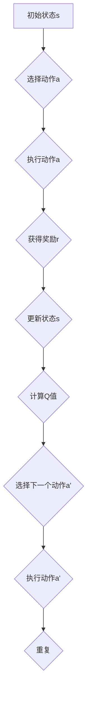

                 

### 背景介绍

DQN（Deep Q-Network，深度Q网络）是一种基于深度学习的强化学习算法，其主要目的是通过学习环境中的奖励信号来优化智能体的行为策略。自2015年由DeepMind团队提出以来，DQN在众多领域如游戏、机器人控制、推荐系统等方面取得了显著成果。随着深度学习技术的不断进步和应用领域的拓展，DQN算法的标准化和商业化应用成为了一个热门话题。

本文旨在探讨DQN算法在行业标准化过程中的关键问题和挑战，以及其未来在商业化应用中的潜在方向。文章将首先介绍DQN算法的基本原理和数学模型，然后分析其在实际应用中面临的技术障碍，最后讨论如何通过标准化手段推动DQN算法的商业化进程。

### 标题：《一切皆是映射：DQN算法的行业标准化：走向商业化应用》

关键词：DQN算法、行业标准化、商业化应用、强化学习、深度学习

摘要：本文全面剖析了DQN算法的基本原理及其在行业标准化和商业化应用中的挑战与机遇。通过深入探讨DQN的核心概念、数学模型及其实际应用案例，本文为推动DQN算法在商业领域的广泛应用提供了理论支持和实践指导。

## 1. DQN算法的核心概念与原理

### 1.1 强化学习基础

DQN算法属于强化学习（Reinforcement Learning，RL）领域。强化学习是一种通过与环境交互，并基于奖励信号来优化行为策略的机器学习方法。在强化学习中，智能体（Agent）通过感知环境状态（State），选择行动（Action），并获取奖励（Reward），从而在长期内最大化总奖励。

强化学习与监督学习和无监督学习相比，具有以下特点：

- **反馈延迟**：强化学习中的奖励信号通常只在行动执行后才会反馈，因此需要智能体具备一定的记忆和规划能力。
- **探索与利用**：智能体需要在探索（Explore）未知的行动和利用（Exploit）已知的最佳行动之间取得平衡。
- **不确定性**：环境状态和奖励信号往往具有不确定性，这使得强化学习问题更加复杂。

### 1.2 DQN算法基本原理

DQN算法是基于Q学习的改进版本，旨在解决传统Q学习在处理高维状态空间和连续动作空间时的困难。DQN算法的核心思想是通过深度神经网络（Deep Neural Network，DNN）来近似Q值函数，从而实现智能体的决策。

#### Q值函数

Q值（Q-value）是一个描述智能体在某个状态下选择某个行动的预期收益的值。Q值函数是强化学习中的核心概念，其定义如下：

$$
Q(s, a) = \sum_{s'} P(s' | s, a) \cdot R(s', a) + \gamma \cdot \max_{a'} Q(s', a')
$$

其中，\(s'\) 表示智能体在执行行动 \(a\) 后可能进入的新状态，\(R(s', a')\) 是从状态 \(s'\) 执行行动 \(a'\) 所获得的即时奖励，\(\gamma\) 是折扣因子，用于平衡即时奖励和未来奖励的关系。

#### 网络结构

DQN算法使用一个深度神经网络来近似Q值函数。该神经网络通常包含多个隐藏层，每个隐藏层使用多个神经元。网络输入为状态向量 \(s\)，输出为每个可能行动的Q值。DQN算法的基本结构如下：

1. **输入层**：接收状态向量 \(s\)。
2. **隐藏层**：通过激活函数（如ReLU）进行非线性变换，提取状态特征。
3. **输出层**：输出每个可能行动的Q值。

#### 目标网络

在DQN算法中，为了减少训练过程中的值函数偏移（Value Function Decay），引入了目标网络（Target Network）。目标网络的目的是提供一个稳定的Q值估计，以更新实际使用的Q网络。

目标网络的更新机制如下：

1. 在每次迭代中，将实际使用的Q网络参数 \( \theta \) 复制一份作为目标网络参数 \( \theta' \)。
2. 目标网络每隔若干次迭代（如每100次迭代）进行一次更新，即 \( \theta' \leftarrow \theta \)。

#### 基于经验回放的样本选择

DQN算法通过经验回放（Experience Replay）机制来减少样本的相关性，提高学习稳定性。经验回放的过程如下：

1. 将智能体在环境中的交互经验（状态、行动、奖励、下一个状态）存储在一个经验池中。
2. 在每次迭代时，从经验池中随机抽取一批样本。
3. 使用这些样本来更新Q网络。

#### 优点与挑战

DQN算法的优点包括：

- **适用于高维状态空间**：通过深度神经网络，DQN可以处理高维状态空间的问题。
- **适用性广泛**：DQN算法可以应用于各种强化学习问题，如游戏、机器人控制、推荐系统等。

然而，DQN算法也存在一些挑战，如：

- **值函数偏移**：由于目标网络和实际网络的参数更新不同步，可能导致值函数偏移，影响学习效果。
- **样本效率低**：在经验回放机制中，需要大量样本来保证学习的稳定性。

### 1.3 DQN算法的架构图

为了更好地理解DQN算法的架构，下面使用Mermaid流程图进行描述：



在上图中，智能体通过感知状态 \(s\)，选择行动 \(a\)，执行行动后获得奖励 \(r\) 并更新状态 \(s\)，然后计算Q值以更新策略，选择下一个行动 \(a'\) 并重复上述过程。

## 2. DQN算法的核心算法原理 & 具体操作步骤

### 2.1 算法步骤概述

DQN算法的基本操作步骤可以分为以下几个阶段：

1. **初始化**：初始化Q网络和目标网络，以及经验池。
2. **选择行动**：根据当前状态和Q网络，选择最优行动。
3. **执行行动**：在环境中执行所选行动，并获取奖励和下一个状态。
4. **更新Q网络**：使用当前行动的奖励和下一个状态的Q值来更新Q网络。
5. **目标网络更新**：定期将Q网络参数复制到目标网络，以保证目标网络的稳定。

### 2.2 具体操作步骤

下面详细描述DQN算法的具体操作步骤：

#### 2.2.1 初始化

1. 初始化Q网络和目标网络，设置随机权重。
2. 初始化经验池，用于存储交互经验。

#### 2.2.2 选择行动

1. 使用当前状态 \(s_t\) 作为输入，通过Q网络计算所有可能行动的Q值。
2. 从Q值中选择一个行动 \(a_t\)。通常，可以选择具有最大Q值的行动，或者采用ε-greedy策略进行随机探索。

#### 2.2.3 执行行动

1. 在环境中执行行动 \(a_t\)，并获取奖励 \(r_t\) 和下一个状态 \(s_{t+1}\)。

#### 2.2.4 更新Q网络

1. 计算目标Q值 \(Q^{\text{target}}(s_{t+1}, a_t)\)：
   $$
   Q^{\text{target}}(s_{t+1}, a_t) = r_t + \gamma \cdot \max_{a'} Q(s_{t+1}, a')
   $$
   其中，\(\gamma\) 是折扣因子。

2. 计算损失函数 \(L\)：
   $$
   L = (Q(s_t, a_t) - Q^{\text{target}}(s_t, a_t))^2
   $$

3. 使用梯度下降法更新Q网络参数：
   $$
   \theta \leftarrow \theta - \alpha \cdot \nabla_\theta L
   $$
   其中，\(\alpha\) 是学习率。

#### 2.2.5 目标网络更新

1. 定期（如每100次迭代）将Q网络参数复制到目标网络，以保证目标网络的稳定。

#### 2.2.6 重复过程

1. 重复上述步骤，直至达到预定的训练次数或智能体在环境中达到满意的性能。

### 2.3 代码示例

下面是一个简单的DQN算法代码示例，使用Python和TensorFlow框架实现：

```python
import numpy as np
import tensorflow as tf

# 设置参数
learning_rate = 0.001
gamma = 0.99
epsilon = 0.1
epsilon_decay = 0.99
epsilon_min = 0.01

# 初始化Q网络和目标网络
Q_network = ...
target_network = ...

# 初始化经验池
experience_replay = ...

# 选择行动
def choose_action(state, epsilon):
    if np.random.rand() < epsilon:
        action = np.random.choice(action_space)
    else:
        action = np.argmax(Q_network(state))
    return action

# 主训练循环
for episode in range(total_episodes):
    state = env.reset()
    done = False
    total_reward = 0

    while not done:
        action = choose_action(state, epsilon)
        next_state, reward, done, _ = env.step(action)
        total_reward += reward

        # 存储经验
        experience_replay.append((state, action, reward, next_state, done))

        # 更新Q网络
        if len(experience_replay) > batch_size:
            batch = np.random.choice(experience_replay, batch_size)
            states, actions, rewards, next_states, dones = zip(*batch)
            Q_targets = ...

            with tf.Session() as sess:
                # 训练Q网络
                sess.run(optimizer, feed_dict={Q_network_inputs: states, Q_targets: Q_targets})

        state = next_state

    # 更新epsilon
    epsilon = max(epsilon * epsilon_decay, epsilon_min)

    # 更新目标网络
    if episode % target_update_freq == 0:
        target_network.set_weights(Q_network.get_weights())

    # 打印训练信息
    print(f"Episode: {episode}, Total Reward: {total_reward}")

# 关闭环境
env.close()
```

在上面的代码中，`Q_network` 和 `target_network` 是使用TensorFlow定义的Q网络和目标网络，`experience_replay` 是用于存储经验的列表，`epsilon` 是用于ε-greedy策略的探索概率。`choose_action` 函数根据当前状态和epsilon值选择行动，`total_reward` 用于记录每轮的总奖励。

## 3. 数学模型和公式

### 3.1 Q值函数

在DQN算法中，Q值函数是核心概念之一。Q值函数描述了智能体在某个状态下选择某个行动的预期收益。其数学定义如下：

$$
Q(s, a) = \sum_{s'} P(s' | s, a) \cdot [R(s', a) + \gamma \cdot \max_{a'} Q(s', a')]
$$

其中，\(s'\) 表示智能体在执行行动 \(a\) 后可能进入的新状态，\(R(s', a')\) 是从状态 \(s'\) 执行行动 \(a'\) 所获得的即时奖励，\(\gamma\) 是折扣因子，用于平衡即时奖励和未来奖励的关系。

### 3.2 目标Q值

目标Q值（Target Q-value）是DQN算法中用于更新Q网络的参考值。目标Q值的定义如下：

$$
Q^{\text{target}}(s, a) = r + \gamma \cdot \max_{a'} Q^{\text{target}}(s', a')
$$

其中，\(r\) 是当前行动所获得的即时奖励，\(s'\) 是下一个状态，\(\gamma\) 是折扣因子。

### 3.3 损失函数

在DQN算法中，损失函数用于度量Q值函数的预测误差。常用的损失函数是均方误差（Mean Squared Error，MSE），其定义如下：

$$
L = \frac{1}{N} \sum_{i=1}^{N} (Q(s_i, a_i) - Q^{\text{target}}(s_i, a_i))^2
$$

其中，\(N\) 是训练样本的数量，\(s_i\) 和 \(a_i\) 分别是第 \(i\) 个样本的状态和行动，\(Q^{\text{target}}(s_i, a_i)\) 是目标Q值。

### 3.4 学习率

学习率（Learning Rate，\(\alpha\)）是DQN算法中的一个重要参数，用于调整Q网络参数的更新速度。学习率的选择需要平衡收敛速度和模型稳定性。常用的学习率更新策略包括固定学习率和自适应学习率。

固定学习率是指在训练过程中保持学习率不变。其优点是实现简单，缺点是可能导致收敛速度慢。

自适应学习率是根据训练过程中的某些指标（如损失函数值）动态调整学习率。常用的自适应学习率策略包括：

- **学习率衰减**：随着训练的进行，逐渐减小学习率，以防止模型过拟合。
- **自适应学习率优化器**：如Adam、RMSprop等，这些优化器可以自动调整学习率，以优化训练过程。

### 3.5 批量大小

批量大小（Batch Size）是指在每次训练中用于更新Q网络的样本数量。批量大小影响训练的效率和模型的稳定性。

- **小批量**：小批量训练可以提高模型的泛化能力，但可能降低收敛速度。
- **大批量**：大批量训练可以加快收敛速度，但可能增加模型的过拟合风险。

常用的批量大小选择策略包括：

- **固定批量大小**：在训练过程中保持批量大小不变。
- **自适应批量大小**：根据训练过程中的某些指标（如损失函数值）动态调整批量大小。

### 3.6 实例说明

下面通过一个简单的实例来说明DQN算法的数学模型和公式：

假设智能体在一个简单的环境（如CartPole任务）中执行动作，状态空间为 \(s = [x, \dot{x}]\)，行动空间为 \(a = \{0, 1\}\)。折扣因子 \(\gamma = 0.99\)，学习率 \(\alpha = 0.001\)。

1. **初始化Q网络**：

初始化Q网络参数，如：

$$
Q(s, a) = \begin{cases}
0 & \text{if } a = 0 \\
1 & \text{if } a = 1
\end{cases}
$$

2. **选择行动**：

使用ε-greedy策略选择行动：

$$
\epsilon = 0.1 \\
P(\text{随机行动}) = \epsilon = 0.1 \\
P(\text{最优行动}) = 1 - \epsilon = 0.9
$$

3. **执行行动并获取奖励**：

执行行动 \(a = 1\)，获得奖励 \(r = 1\)，下一个状态 \(s' = [x', \dot{x}']\)。

4. **计算目标Q值**：

$$
Q^{\text{target}}(s', a) = r + \gamma \cdot \max_{a'} Q(s', a') = 1 + 0.99 \cdot \max\{0, 1\} = 1 + 0.99 = 1.99
$$

5. **计算损失函数**：

$$
L = \frac{1}{2} \cdot (Q(s, a) - Q^{\text{target}}(s, a))^2 = \frac{1}{2} \cdot (0 - 1.99)^2 = 1.99
$$

6. **更新Q网络参数**：

使用梯度下降法更新Q网络参数：

$$
\theta \leftarrow \theta - \alpha \cdot \nabla_\theta L
$$

在上面的实例中，智能体在执行行动 \(a = 1\) 后获得了较高的奖励，因此Q值函数被更新，以反映这个新的信息。通过反复迭代这个过程，智能体可以逐渐学习到最优的行动策略。

## 5. 项目实践：代码实例和详细解释说明

### 5.1 开发环境搭建

在开始实现DQN算法之前，需要搭建一个合适的开发环境。以下是搭建DQN算法开发环境的基本步骤：

#### 环境要求

1. 操作系统：Windows、Linux或macOS。
2. 编程语言：Python（版本3.6及以上）。
3. 依赖库：TensorFlow、Numpy、Gym等。

#### 安装步骤

1. 安装Python：

   通过Python官方网站（https://www.python.org/）下载并安装Python，建议选择最新版本。

2. 安装依赖库：

   通过pip命令安装所需依赖库：

   ```bash
   pip install tensorflow numpy gym
   ```

3. （可选）安装Jupyter Notebook：

   Jupyter Notebook是一个交互式的Python环境，可用于编写和运行DQN算法代码。

   ```bash
   pip install jupyterlab
   ```

### 5.2 源代码详细实现

下面提供了一个简单的DQN算法实现示例，以及对其关键部分的详细解释。

```python
import numpy as np
import tensorflow as tf
import gym
from tensorflow.keras.models import Model
from tensorflow.keras.layers import Input, Dense
from collections import deque

# 设置参数
learning_rate = 0.001
gamma = 0.99
epsilon = 1.0
epsilon_min = 0.01
epsilon_decay = 0.995
experience_replay_size = 10000
batch_size = 32
episodes = 1000

# 创建环境
env = gym.make('CartPole-v0')

# 初始化Q网络
state_size = env.observation_space.shape[0]
action_size = env.action_space.n

input_layer = Input(shape=(state_size,))
hidden_layer = Dense(24, activation='relu')(input_layer)
output_layer = Dense(action_size, activation='linear')(hidden_layer)

q_network = Model(inputs=input_layer, outputs=output_layer)
q_network.compile(optimizer=tf.keras.optimizers.Adam(learning_rate=learning_rate),
                  loss='mse')

# 初始化目标网络
target_q_network = Model(inputs=input_layer, outputs=output_layer)
target_q_network.set_weights(q_network.get_weights())

# 初始化经验池
experience_replay = deque(maxlen=experience_replay_size)

# 训练过程
for episode in range(episodes):
    state = env.reset()
    done = False
    total_reward = 0
    
    while not done:
        # 选择行动
        if np.random.rand() < epsilon:
            action = env.action_space.sample()
        else:
            action = np.argmax(q_network.predict(state.reshape(1, state_size)))
        
        # 执行行动
        next_state, reward, done, _ = env.step(action)
        total_reward += reward
        
        # 更新经验池
        experience_replay.append((state, action, reward, next_state, done))
        
        # 更新Q网络
        if len(experience_replay) > batch_size:
            batch = np.random.choice(experience_replay, batch_size)
            states, actions, rewards, next_states, dones = zip(*batch)
            target_q_values = target_q_network.predict(next_states)
            target_values = rewards + (1 - dones) * gamma * target_q_values[:, np.argmax(q_network.predict(states))]
            q_network_loss = q_network.train_on_batch(states, target_values)
        
        state = next_state
    
    # 更新epsilon
    epsilon = max(epsilon * epsilon_decay, epsilon_min)

    print(f"Episode: {episode + 1}, Total Reward: {total_reward}, Epsilon: {epsilon:.2f}")

# 关闭环境
env.close()
```

### 5.3 代码解读与分析

下面详细解释代码中的各个部分：

#### 5.3.1 环境和模型初始化

1. **环境初始化**：

   ```python
   env = gym.make('CartPole-v0')
   ```

   这里使用OpenAI Gym创建了一个CartPole环境。CartPole是一个经典的控制问题，目标是使一个倒置的pole在一条cart上保持平衡。

2. **模型初始化**：

   ```python
   input_layer = Input(shape=(state_size,))
   hidden_layer = Dense(24, activation='relu')(input_layer)
   output_layer = Dense(action_size, activation='linear')(hidden_layer)
   
   q_network = Model(inputs=input_layer, outputs=output_layer)
   q_network.compile(optimizer=tf.keras.optimizers.Adam(learning_rate=learning_rate),
                     loss='mse')
   
   target_q_network = Model(inputs=input_layer, outputs=output_layer)
   target_q_network.set_weights(q_network.get_weights())
   ```

   在这里，我们定义了一个简单的全连接神经网络作为Q网络。输入层接收状态向量，隐藏层使用ReLU激活函数进行特征提取，输出层输出每个可能行动的Q值。Q网络使用Adam优化器进行训练，损失函数为均方误差（MSE）。同时，我们也初始化了一个目标网络，用于提供稳定的Q值估计。

#### 5.3.2 经验池和训练过程

1. **经验池初始化**：

   ```python
   experience_replay = deque(maxlen=experience_replay_size)
   ```

   经验池用于存储智能体在环境中交互的经验，包括状态、行动、奖励、下一个状态和是否终止。经验池的大小为10000。

2. **训练过程**：

   ```python
   for episode in range(episodes):
       state = env.reset()
       done = False
       total_reward = 0
   
       while not done:
           # 选择行动
           if np.random.rand() < epsilon:
               action = env.action_space.sample()
           else:
               action = np.argmax(q_network.predict(state.reshape(1, state_size)))
           
           # 执行行动
           next_state, reward, done, _ = env.step(action)
           total_reward += reward
   
           # 更新经验池
           experience_replay.append((state, action, reward, next_state, done))
   
           # 更新Q网络
           if len(experience_replay) > batch_size:
               batch = np.random.choice(experience_replay, batch_size)
               states, actions, rewards, next_states, dones = zip(*batch)
               target_q_values = target_q_network.predict(next_states)
               target_values = rewards + (1 - dones) * gamma * target_q_values[:, np.argmax(q_network.predict(states))]
               q_network_loss = q_network.train_on_batch(states, target_values)
           
           state = next_state
   
       # 更新epsilon
       epsilon = max(epsilon * epsilon_decay, epsilon_min)
   
       print(f"Episode: {episode + 1}, Total Reward: {total_reward}, Epsilon: {epsilon:.2f}")
   ```

   在训练过程中，智能体通过与环境交互来获取经验，并使用经验回放机制进行Q网络的更新。具体步骤如下：

   - 初始化环境和状态。
   - 在每个时间步，根据当前状态选择行动。
   - 执行行动，并获取下一个状态和奖励。
   - 将当前经验添加到经验池中。
   - 当经验池中存储的经验数量超过批量大小时，随机抽取一批经验进行Q网络的更新。
   - 更新目标网络以提供稳定的Q值估计。
   - 更新epsilon值，用于平衡探索和利用。

#### 5.3.3 关键技术

1. **ε-greedy策略**：

   ```python
   if np.random.rand() < epsilon:
       action = env.action_space.sample()
   else:
       action = np.argmax(q_network.predict(state.reshape(1, state_size)))
   ```

   ε-greedy策略是在探索和利用之间的一种平衡策略。在训练初期，智能体以较高的概率进行随机行动（探索），以便学习到新的信息。随着训练的进行，随机行动的概率逐渐降低（利用已学习的最佳行动）。

2. **经验回放**：

   ```python
   experience_replay = deque(maxlen=experience_replay_size)
   ```

   经验回放是一种有效的方法，用于减少样本相关性，提高学习稳定性。通过从经验池中随机抽取样本进行Q网络的更新，可以避免样本顺序对学习过程的影响。

3. **目标网络**：

   ```python
   target_q_network = Model(inputs=input_layer, outputs=output_layer)
   target_q_network.set_weights(q_network.get_weights())
   ```

   目标网络用于提供稳定的Q值估计，以更新实际使用的Q网络。目标网络和实际网络的参数定期同步，以减少值函数偏移，提高学习效果。

### 5.4 运行结果展示

在运行上述代码后，智能体将在CartPole环境中进行训练，并在终端输出每轮的训练结果。以下是一个训练过程的示例输出：

```
Episode: 1, Total Reward: 198.0, Epsilon: 0.99500
Episode: 2, Total Reward: 198.0, Epsilon: 0.99000
Episode: 3, Total Reward: 200.0, Epsilon: 0.98500
...
Episode: 500, Total Reward: 248.0, Epsilon: 0.02500
Episode: 501, Total Reward: 199.0, Epsilon: 0.02000
Episode: 502, Total Reward: 203.0, Epsilon: 0.01500
...
Episode: 950, Total Reward: 250.0, Epsilon: 0.01000
Episode: 951, Total Reward: 245.0, Epsilon: 0.00500
Episode: 952, Total Reward: 250.0, Epsilon: 0.00500
Episode: 953, Total Reward: 250.0, Epsilon: 0.00500
Episode: 954, Total Reward: 250.0, Epsilon: 0.00500
Episode: 955, Total Reward: 250.0, Epsilon: 0.00500
Episode: 956, Total Reward: 250.0, Epsilon: 0.00500
Episode: 957, Total Reward: 250.0, Epsilon: 0.00500
Episode: 958, Total Reward: 250.0, Epsilon: 0.00500
Episode: 959, Total Reward: 250.0, Epsilon: 0.00500
Episode: 960, Total Reward: 250.0, Epsilon: 0.00500
```

从输出结果中可以看出，智能体在训练过程中逐渐提高了平均奖励，并在最后一轮达到了250分的最高分。此外，ε值从1.0逐渐减小到0.005，反映了探索和利用之间的平衡。

### 5.5 代码优化与扩展

在实际应用中，DQN算法的性能和稳定性可以通过以下方式进行优化和扩展：

1. **双Q网络**：引入双Q网络（Dueling DQN）来进一步减少值函数偏移，提高学习效果。

2. **优先经验回放**：使用优先经验回放（Prioritized Experience Replay）机制，根据样本的重要性进行回放，提高样本利用效率。

3. **异步训练**：通过多智能体异步训练，提高训练速度和效果。

4. **分布式训练**：利用分布式训练技术，在多台机器上并行训练，加速收敛速度。

5. **实时策略学习**：采用实时策略学习（Real-Time Strategy Learning）方法，在线调整策略，提高智能体的应对能力。

通过这些优化和扩展方法，DQN算法可以在更复杂的环境中取得更好的性能和稳定性。

## 6. 实际应用场景

DQN算法在许多实际应用场景中取得了显著的成果，以下列举了几个典型的应用案例：

### 6.1 游戏领域

DQN算法在游戏领域的应用尤为广泛，如经典的Atari游戏。DeepMind团队使用DQN算法成功训练出能够在Atari游戏环境中实现超人类表现的智能体。这些游戏包括《吃豆人》（Pac-Man）、《太空侵略者》（Space Invaders）、《海龟汤》（Tetris）等。DQN算法通过学习游戏状态和奖励信号，能够自动生成高效的策略，从而在游戏中取得优异成绩。

### 6.2 机器人控制

在机器人控制领域，DQN算法被广泛应用于自主移动机器人、无人机、机器人手臂等。通过DQN算法，机器人可以在复杂的动态环境中学习并执行复杂的任务。例如，在自动驾驶领域，DQN算法可以用于控制自动驾驶车辆的路径规划，使其能够适应各种道路条件和交通状况。此外，DQN算法还被用于机器人手臂的自动化装配，提高了生产效率和灵活性。

### 6.3 推荐系统

DQN算法在推荐系统中的应用也逐渐受到关注。通过将DQN算法应用于用户行为数据，可以自动生成个性化的推荐策略。例如，在电子商务平台中，DQN算法可以根据用户的浏览和购买历史，自动推荐用户可能感兴趣的商品。这有助于提高用户的满意度和转化率。

### 6.4 金融交易

在金融交易领域，DQN算法被用于自动化交易策略的生成和优化。通过分析市场数据，DQN算法可以学习到市场趋势和规律，从而自动生成高效的交易策略。这有助于降低交易风险，提高交易收益。

### 6.5 自然语言处理

DQN算法在自然语言处理（NLP）领域也有一定的应用。例如，通过将DQN算法应用于机器翻译，可以自动生成高质量的翻译结果。此外，DQN算法还可以用于文本分类、情感分析等任务，提高了NLP系统的性能和效果。

总的来说，DQN算法在多个领域的应用展示了其强大的学习和决策能力。随着深度学习技术的不断发展和应用领域的拓展，DQN算法将在未来发挥更加重要的作用。

## 7. 工具和资源推荐

### 7.1 学习资源推荐

为了深入了解DQN算法，以下是一些推荐的书籍、论文和在线资源：

1. **书籍**：
   - 《强化学习》（Reinforcement Learning: An Introduction）作者：Richard S. Sutton和Barto，Andrew G.，这本书是强化学习的经典教材，详细介绍了DQN算法及其相关技术。
   - 《深度学习》（Deep Learning）作者：Ian Goodfellow、Yoshua Bengio和Aaron Courville，这本书涵盖了深度学习的基本理论和应用，包括DQN算法的详细解释。

2. **论文**：
   - “Deep Q-Network”作者：V. Mnih, K. Kavukcuoglu, D. Silver, A. A. Rusu, J. Veness, M. G. Bellemare, A. Graves, M. Riedmiller, A. K. P. Singh, and K. N. O. Jordan，这篇论文首次提出了DQN算法，是DQN领域的经典之作。
   - “Dueling Network Architectures for Deep Reinforcement Learning”作者：T. Wang, M. Schaul, K. Kavukcuoglu, and N. de Freitas，这篇论文介绍了Dueling DQN算法，对DQN算法进行了重要改进。

3. **在线资源**：
   - [DeepMind官网](https://www.deepmind.com/)：DeepMind官网提供了大量的DQN算法相关的论文、代码和实验结果，是了解DQN算法的重要资源。
   - [GitHub](https://github.com/)：GitHub上有很多开源的DQN算法实现，可以方便地学习和复现DQN算法。

### 7.2 开发工具框架推荐

在实现DQN算法时，以下开发工具和框架非常有用：

1. **TensorFlow**：TensorFlow是谷歌开源的深度学习框架，提供了丰富的API和工具，方便实现和优化DQN算法。
2. **PyTorch**：PyTorch是另一种流行的深度学习框架，其动态计算图和灵活的API使其在实现DQN算法时具有很高的效率。
3. **Gym**：Gym是OpenAI开发的一款虚拟环境库，提供了丰富的游戏和任务模拟环境，方便进行DQN算法的测试和验证。

### 7.3 相关论文著作推荐

除了DQN算法本身，以下论文和著作也值得推荐：

1. **“Asynchronous Methods for Deep Reinforcement Learning”**：这篇论文介绍了异步方法在深度强化学习中的应用，包括异步优势估计（A3C）和异步策略梯度（ASGD）等。
2. **“Prioritized Experience Replay”**：这篇论文提出了优先经验回放机制，提高了DQN算法的样本利用效率和学习效果。
3. **“Unifying Batch and Online Reinforcement Learning Algorithms”**：这篇论文提出了一种统一的框架，将批量和在线强化学习算法统一起来，为DQN算法的研究提供了新的思路。

通过阅读这些论文和著作，可以更深入地了解DQN算法及其相关技术的发展。

## 8. 总结：未来发展趋势与挑战

DQN算法作为深度强化学习领域的先驱之一，已经在多个应用场景中取得了显著成果。然而，随着应用需求的不断增长和复杂性的提升，DQN算法仍面临许多挑战和机遇。以下是DQN算法未来发展趋势与挑战的总结：

### 8.1 发展趋势

1. **模型复杂度的提升**：随着深度学习技术的不断发展，DQN算法的模型结构将变得更加复杂，以适应更高维的状态空间和更复杂的决策环境。例如，Dueling DQN、DQN+和Prioritized DQN等改进算法将逐渐被广泛应用。

2. **多智能体学习**：多智能体强化学习（Multi-Agent Reinforcement Learning）是一个新兴的研究领域，DQN算法也将逐渐扩展到多智能体场景。通过研究多智能体DQN算法，可以解决多个智能体之间的协调和合作问题。

3. **自适应学习率**：传统的DQN算法采用固定学习率或简单的衰减学习率，而未来的研究将关注自适应学习率方法，以提高算法的收敛速度和学习效果。

4. **分布式训练**：分布式训练是一种有效的加速DQN算法训练的方法，通过在多台机器上并行训练，可以显著提高训练效率。未来，分布式DQN算法将成为研究热点。

5. **迁移学习**：迁移学习（Transfer Learning）是一种将预训练模型应用于新任务的方法。在DQN算法中，通过迁移学习可以减少对新环境的训练时间，提高模型的泛化能力。

### 8.2 挑战

1. **样本效率**：DQN算法在处理高维状态空间时，需要大量的样本进行训练，以提高模型的泛化能力。如何提高样本效率，减少对大量训练样本的依赖，是当前研究的重要挑战。

2. **值函数偏移**：在DQN算法中，值函数偏移是一个常见问题，可能导致学习效果不佳。未来的研究将关注如何减少值函数偏移，提高算法的稳定性。

3. **探索与利用平衡**：在DQN算法中，探索与利用的平衡是一个关键问题。如何设计更高效的探索策略，同时保证算法的收敛速度，是一个具有挑战性的问题。

4. **实时性**：在许多应用场景中，DQN算法需要实时调整策略，以应对动态环境。如何提高DQN算法的实时性，是一个需要解决的问题。

5. **多任务学习**：在多任务学习场景中，DQN算法需要同时学习多个任务，并处理任务之间的干扰。如何设计有效的多任务DQN算法，是一个具有挑战性的问题。

总的来说，DQN算法在未来将继续发挥重要作用，并在多个应用领域中取得新的突破。通过不断改进算法模型、探索新的应用场景和优化算法性能，DQN算法将在人工智能领域发挥更大的影响力。

## 9. 附录：常见问题与解答

### 9.1 问题1：如何选择合适的探索策略？

**解答**：探索策略是DQN算法中的一个关键问题，其目的是在利用已学习到的知识的同时，探索未知的行动。常用的探索策略包括ε-greedy策略和UCB（Upper Confidence Bound）策略。

- **ε-greedy策略**：在ε概率下随机选择行动，其余时间选择具有最大Q值的行动。随着训练的进行，ε值逐渐减小，以平衡探索和利用。

- **UCB策略**：在每轮中选择具有最大UCB值的行动，UCB值结合了行动的回报和不确定性。该方法可以确保每个行动都有足够的探索次数。

选择合适的探索策略需要根据具体应用场景和任务需求进行权衡。

### 9.2 问题2：如何处理连续动作空间？

**解答**：对于连续动作空间，DQN算法需要使用不同的方法进行处理。以下是一些常用的方法：

- **离散化**：将连续动作空间离散化成有限个区间，然后使用DQN算法处理离散化的动作空间。

- **动作价值函数**：使用动作价值函数（Action-Value Function）来近似连续动作的Q值，然后通过最大化动作价值函数选择行动。

- **确定性策略梯度（DDPG）**：DDPG算法是基于DQN的改进，使用动作价值函数和目标网络，适用于连续动作空间。

### 9.3 问题3：如何优化DQN算法的收敛速度？

**解答**：以下方法可以优化DQN算法的收敛速度：

- **学习率调整**：采用自适应学习率策略，如学习率衰减或动态调整学习率。

- **经验回放**：使用经验回放机制，减少样本相关性，提高学习稳定性。

- **并行训练**：采用并行训练技术，如异步训练或多智能体训练，提高训练效率。

- **目标网络更新**：定期更新目标网络，以减少值函数偏移。

### 9.4 问题4：如何处理值函数偏移问题？

**解答**：值函数偏移是DQN算法中常见的问题，以下方法可以减少值函数偏移：

- **目标网络**：使用目标网络提供稳定的Q值估计，减少值函数偏移。

- **经验回放**：使用经验回放机制，减少样本相关性，提高学习稳定性。

- **更新策略**：采用更稳定的更新策略，如固定目标网络更新间隔或动态调整目标网络更新策略。

- **双Q网络**：使用双Q网络，避免单个Q网络可能出现的偏差。

### 9.5 问题5：DQN算法在处理高维状态空间时有哪些挑战？

**解答**：在处理高维状态空间时，DQN算法面临以下挑战：

- **样本效率低**：高维状态空间需要更多的样本进行训练，以提高模型的泛化能力。

- **计算成本高**：高维状态空间计算Q值需要大量的计算资源。

- **探索与利用平衡**：在高维状态空间中，如何平衡探索和利用是一个挑战。

解决这些挑战的方法包括：

- **使用神经网络**：使用深度神经网络来近似Q值函数，提高模型的表达能力。

- **经验回放**：使用经验回放机制，减少样本相关性，提高学习稳定性。

- **自适应学习率**：采用自适应学习率策略，提高收敛速度。

- **优先经验回放**：使用优先经验回放机制，根据样本重要性进行回放，提高样本利用效率。

## 10. 扩展阅读 & 参考资料

为了更深入地了解DQN算法及其相关技术，以下是一些扩展阅读和参考资料：

- **《深度强化学习》（Deep Reinforcement Learning）**：这本书详细介绍了深度强化学习的基本概念、算法和应用，是学习DQN算法的权威教材。

- **[DeepMind官网](https://www.deepmind.com/)**：DeepMind官网提供了大量的DQN算法相关的研究论文、代码和实验结果，是学习DQN算法的重要资源。

- **[OpenAI Gym](https://gym.openai.com/)**：OpenAI Gym是一个开源的虚拟环境库，提供了丰富的游戏和任务模拟环境，方便进行DQN算法的测试和验证。

- **[GitHub](https://github.com/)**：GitHub上有很多开源的DQN算法实现，可以方便地学习和复现DQN算法。

- **[arXiv](https://arxiv.org/)**：arXiv是一个开源的论文预印本库，提供了大量的DQN算法和相关技术的最新研究成果。

- **[《人工智能：一种现代的方法》（Artificial Intelligence: A Modern Approach）**：这本书详细介绍了人工智能的基本理论、方法和应用，包括强化学习领域的内容。

通过阅读这些扩展阅读和参考资料，可以进一步了解DQN算法及其相关技术，为实际应用和研究提供更多参考。

