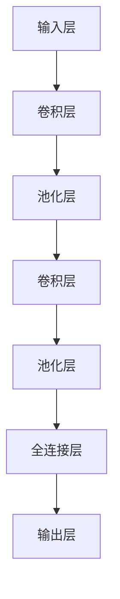

                 

### 背景介绍

卷积神经网络（Convolutional Neural Network，CNN）是深度学习领域的一种重要算法，广泛应用于图像识别、视频分析、自然语言处理等多个领域。CNN 的出现，源于对传统神经网络在图像处理上的局限性反思。传统的神经网络在处理图像时，往往需要将图像分解为一个个像素点，然后逐个输入到网络中进行处理，这种处理方式不仅计算复杂度高，而且容易丢失图像中的空间信息。为了克服这些缺点，研究人员开始探索一种新的神经网络架构，即卷积神经网络。

卷积神经网络的核心思想是利用卷积运算来提取图像特征。卷积运算是一种线性运算，通过对输入图像和滤波器（也称为卷积核）进行卷积操作，可以提取出图像中的边缘、纹理等特征。通过多层的卷积操作，网络可以逐步提取出更高层次的特征，从而实现对复杂图像的识别。

CNN 的架构包括多个卷积层、池化层和全连接层。卷积层用于提取特征，池化层用于降低特征图的维度，全连接层用于进行分类。CNN 的这种层次化结构，使得它能够有效地处理大规模的图像数据，并在各种图像识别任务中取得了显著的性能。

随着深度学习的兴起，CNN 在图像处理领域取得了巨大的成功。例如，在 ImageNet 图像识别竞赛中，基于 CNN 的算法连续多年获得冠军，大大推动了图像识别技术的发展。此外，CNN 还被广泛应用于其他领域，如视频分析、自然语言处理等，展现出了强大的泛化能力。

总之，卷积神经网络的出现，为图像处理领域带来了革命性的变化，使得计算机视觉技术取得了长足的进步。本文将深入探讨 CNN 的核心概念、算法原理、数学模型以及实际应用，帮助读者全面理解 CNN 的魅力和潜力。

### 核心概念与联系

卷积神经网络（CNN）的核心概念可以追溯到其基础组成部分：卷积层、池化层和全连接层。为了更好地理解这些概念，我们可以通过一个简单的 Mermaid 流程图（Mermaid 流程节点中不要有括号、逗号等特殊字符）来梳理它们之间的关系。



**1. 输入层（Input Layer）**

输入层是 CNN 的起点，负责接收外部输入，通常是图像数据。图像数据在输入层中被表示为一个多维数组，其中每个元素代表图像中的一个像素值。

**2. 卷积层（Convolutional Layer）**

卷积层是 CNN 的核心组成部分，负责提取图像的特征。卷积层通过一系列滤波器（也称为卷积核）与输入图像进行卷积操作，以提取出图像中的局部特征。卷积操作可以看作是图像和滤波器之间的一种线性组合，通过调整滤波器的参数，可以提取出不同的特征。

**3. 池化层（Pooling Layer）**

池化层紧跟在卷积层之后，用于降低特征图的维度，减少参数的数量，从而提高网络的效率和鲁棒性。常见的池化操作有最大池化（Max Pooling）和平均池化（Average Pooling）。最大池化选择特征图上每个局部区域内的最大值，而平均池化则计算这些值的平均值。

**4. 全连接层（Fully Connected Layer）**

全连接层位于 CNN 的末尾，负责将低层次的特征图映射到输出结果。在图像识别任务中，全连接层通常用于进行分类。全连接层中的每个神经元都与前一层中的所有神经元相连，从而实现了对高维特征向量的压缩和分类。

**5. 输出层（Output Layer）**

输出层是 CNN 的终点，根据不同的任务类型，输出可以是概率分布、分类结果或其他形式的结果。在图像识别任务中，输出通常是每个类别的概率分布，通过选择具有最高概率的类别来实现图像的分类。

通过上述 Mermaid 流程图，我们可以清晰地看到卷积神经网络中的各个层次以及它们之间的联系。卷积层负责特征提取，池化层负责降维和增强鲁棒性，全连接层负责分类和输出结果。这种层次化的结构使得 CNN 能够有效地处理复杂的图像数据，并在各种图像识别任务中取得优异的性能。

### 核心算法原理 & 具体操作步骤

卷积神经网络（CNN）的核心算法原理基于卷积运算、池化操作和全连接层。以下将详细解释每个部分的工作原理和操作步骤。

**1. 卷积运算**

卷积运算是 CNN 中最基本的操作之一。它通过将输入图像与一系列滤波器（卷积核）进行卷积，从而提取图像的特征。卷积运算的具体步骤如下：

（1）输入图像

输入图像通常表示为一个三维数组，维度为 \( (C \times H \times W) \)，其中 \( C \) 表示颜色通道数，\( H \) 和 \( W \) 分别表示图像的高度和宽度。

（2）滤波器（卷积核）

滤波器是一个二维数组，其尺寸通常小于输入图像的尺寸。每个滤波器对应于图像中的一个局部区域，通过卷积操作可以提取出该区域内的特征。

（3）卷积操作

卷积操作是指将滤波器与输入图像的对应区域进行点乘，并将结果求和。具体公式如下：

\[ o_{ij} = \sum_{k=1}^{C} f_{ik} \cdot x_{kj} \]

其中，\( o_{ij} \) 表示输出特征图上的一个元素，\( f_{ik} \) 和 \( x_{kj} \) 分别表示滤波器和输入图像的对应元素。

（4）偏置项

为了增加网络的灵活性，卷积操作后通常会加上一个偏置项 \( b \)，公式变为：

\[ o_{ij} = \sum_{k=1}^{C} f_{ik} \cdot x_{kj} + b \]

通过多次卷积操作，网络可以逐步提取出更高层次的特征。

**2. 池化操作**

池化操作用于降低特征图的维度，从而减少参数的数量，提高网络的效率和鲁棒性。常见的池化操作有最大池化和平均池化。

（1）最大池化

最大池化选择特征图上每个局部区域内的最大值作为输出。具体步骤如下：

- 设定一个池化窗口的大小（如 \( 2 \times 2 \) 或 \( 3 \times 3 \)）。
- 将池化窗口滑动遍历特征图，在每个窗口内选择最大值。
- 输出结果为一个二维数组，其尺寸为 \( (H_{out} \times W_{out}) \)，其中 \( H_{out} \) 和 \( W_{out} \) 分别为输出特征图的高度和宽度。

（2）平均池化

平均池化计算特征图上每个局部区域内的平均值作为输出。具体步骤如下：

- 设定一个池化窗口的大小。
- 将池化窗口滑动遍历特征图，在每个窗口内计算所有元素的均值。
- 输出结果为一个二维数组，其尺寸为 \( (H_{out} \times W_{out}) \)。

**3. 全连接层**

全连接层是 CNN 的最后一步，它将低层次的特征映射到输出结果。全连接层中的每个神经元都与前一层的所有神经元相连，形成一个完整的连接网络。

（1）输入特征图

输入特征图是卷积层和池化层的输出结果，通常表示为一个二维数组。

（2）权重和偏置

全连接层包含一组权重和偏置，用于对输入特征图进行线性变换。具体步骤如下：

- 将输入特征图的每个元素与对应的权重进行点乘，并加上偏置。
- 将所有结果求和，得到每个神经元的输出。

（3）激活函数

为了增加网络的非线性能力，全连接层的输出通常会通过一个激活函数进行变换。常见的激活函数有 Sigmoid、ReLU 和 Tanh。

（4）输出结果

全连接层的输出结果是一个一维数组，代表每个类别的概率分布。通过选择具有最高概率的类别，可以实现图像的分类。

通过上述步骤，卷积神经网络可以逐步提取图像的特征，并进行分类。这种层次化的结构使得 CNN 能够处理复杂的图像数据，并在各种图像识别任务中取得优异的性能。

### 数学模型和公式 & 详细讲解 & 举例说明

卷积神经网络（CNN）的数学模型是理解其工作原理的关键。在本文中，我们将详细讲解 CNN 中的卷积运算、池化操作和全连接层的数学公式，并通过具体示例来说明这些公式的应用。

**1. 卷积运算**

卷积运算是 CNN 中最基本的操作。它通过将输入图像与滤波器（卷积核）进行卷积，从而提取图像的特征。卷积运算的数学公式如下：

\[ o_{ij} = \sum_{k=1}^{C} f_{ik} \cdot x_{kj} + b \]

其中：
- \( o_{ij} \) 表示输出特征图上的一个元素，其中 \( i \) 表示行，\( j \) 表示列。
- \( f_{ik} \) 表示滤波器（卷积核）上的一个元素，其中 \( i \) 表示行，\( k \) 表示滤波器的行。
- \( x_{kj} \) 表示输入图像上的一个元素，其中 \( j \) 表示行，\( k \) 表示列。
- \( b \) 表示偏置项。

示例：假设输入图像为 \( 3 \times 3 \) 的矩阵：

\[ x = \begin{bmatrix} 1 & 2 & 3 \\ 4 & 5 & 6 \\ 7 & 8 & 9 \end{bmatrix} \]

滤波器为 \( 2 \times 2 \) 的矩阵：

\[ f = \begin{bmatrix} 1 & 0 \\ 0 & 1 \end{bmatrix} \]

偏置项为 \( b = 1 \)。则输出特征图上的一个元素 \( o_{11} \) 可以通过以下公式计算：

\[ o_{11} = \sum_{k=1}^{1} f_{1k} \cdot x_{1k} + b = (1 \cdot 1 + 0 \cdot 4 + 0 \cdot 7 + 1 \cdot 8) + 1 = 4 + 1 = 5 \]

类似地，其他元素可以通过相同的公式计算得到。

**2. 池化操作**

池化操作用于降低特征图的维度，从而减少参数的数量，提高网络的效率和鲁棒性。常见的池化操作有最大池化和平均池化。

（1）最大池化

最大池化的数学公式如下：

\[ p_{ij} = \max_{(x, y) \in W} \sum_{m=1}^{H_{win}} \sum_{n=1}^{W_{win}} x_{mj} \cdot y_{nj} \]

其中：
- \( p_{ij} \) 表示输出特征图上的一个元素，其中 \( i \) 表示行，\( j \) 表示列。
- \( W \) 表示池化窗口，\( H_{win} \) 和 \( W_{win} \) 分别表示窗口的高度和宽度。
- \( x_{mj} \) 和 \( y_{nj} \) 表示输入特征图上的两个对应元素。

示例：假设输入特征图为 \( 4 \times 4 \) 的矩阵：

\[ x = \begin{bmatrix} 1 & 2 & 3 & 4 \\ 5 & 6 & 7 & 8 \\ 9 & 10 & 11 & 12 \\ 13 & 14 & 15 & 16 \end{bmatrix} \]

池化窗口为 \( 2 \times 2 \)。则输出特征图上的一个元素 \( p_{11} \) 可以通过以下公式计算：

\[ p_{11} = \max_{(x, y) \in W} \sum_{m=1}^{2} \sum_{n=1}^{2} x_{mj} \cdot y_{nj} = \max(1 \cdot 5 + 2 \cdot 6 + 3 \cdot 7 + 4 \cdot 8, 1 \cdot 6 + 2 \cdot 7 + 3 \cdot 8 + 4 \cdot 9, 1 \cdot 7 + 2 \cdot 8 + 3 \cdot 9 + 4 \cdot 10, 1 \cdot 8 + 2 \cdot 9 + 3 \cdot 10 + 4 \cdot 11) = 46 \]

类似地，其他元素可以通过相同的公式计算得到。

（2）平均池化

平均池化的数学公式如下：

\[ p_{ij} = \frac{1}{H_{win} \cdot W_{win}} \sum_{m=1}^{H_{win}} \sum_{n=1}^{W_{win}} x_{mj} \cdot y_{nj} \]

其中：
- \( p_{ij} \) 表示输出特征图上的一个元素，其中 \( i \) 表示行，\( j \) 表示列。
- \( W \) 表示池化窗口，\( H_{win} \) 和 \( W_{win} \) 分别表示窗口的高度和宽度。
- \( x_{mj} \) 和 \( y_{nj} \) 表示输入特征图上的两个对应元素。

示例：使用与前一个示例相同的输入特征图和池化窗口。则输出特征图上的一个元素 \( p_{11} \) 可以通过以下公式计算：

\[ p_{11} = \frac{1}{2 \cdot 2} \sum_{m=1}^{2} \sum_{n=1}^{2} x_{mj} \cdot y_{nj} = \frac{1}{4} (1 \cdot 5 + 2 \cdot 6 + 3 \cdot 7 + 4 \cdot 8 + 1 \cdot 6 + 2 \cdot 7 + 3 \cdot 8 + 4 \cdot 9 + 1 \cdot 7 + 2 \cdot 8 + 3 \cdot 9 + 4 \cdot 10 + 1 \cdot 8 + 2 \cdot 9 + 3 \cdot 10 + 4 \cdot 11) = 10.5 \]

类似地，其他元素可以通过相同的公式计算得到。

**3. 全连接层**

全连接层是 CNN 的最后一步，它将低层次的特征映射到输出结果。全连接层中的每个神经元都与前一层的所有神经元相连，形成一个完整的连接网络。

全连接层的数学公式如下：

\[ z_j = \sum_{i=1}^{N} w_{ij} \cdot x_i + b_j \]

\[ a_j = f(z_j) \]

其中：
- \( z_j \) 表示第 \( j \) 个神经元的输出。
- \( w_{ij} \) 表示第 \( i \) 个神经元到第 \( j \) 个神经元的权重。
- \( x_i \) 表示第 \( i \) 个神经元的输入。
- \( b_j \) 表示第 \( j \) 个神经元的偏置项。
- \( f(z_j) \) 表示激活函数，常见的有 Sigmoid、ReLU 和 Tanh。

示例：假设前一层的输出特征图为 \( 3 \times 3 \) 的矩阵：

\[ x = \begin{bmatrix} 1 & 2 & 3 \\ 4 & 5 & 6 \\ 7 & 8 & 9 \end{bmatrix} \]

全连接层的权重为 \( 3 \times 3 \) 的矩阵：

\[ w = \begin{bmatrix} 1 & 0 & 1 \\ 0 & 1 & 0 \\ 1 & 1 & 1 \end{bmatrix} \]

偏置项为 \( b = \begin{bmatrix} 1 \\ 1 \\ 1 \end{bmatrix} \)

激活函数为 ReLU。则全连接层的输出可以通过以下公式计算：

\[ z_1 = (1 \cdot 1 + 0 \cdot 4 + 1 \cdot 7) + 1 = 7 \]

\[ z_2 = (0 \cdot 1 + 1 \cdot 5 + 1 \cdot 8) + 1 = 9 \]

\[ z_3 = (1 \cdot 2 + 1 \cdot 4 + 1 \cdot 6) + 1 = 8 \]

\[ a_1 = \max(z_1, 0) = 7 \]

\[ a_2 = \max(z_2, 0) = 9 \]

\[ a_3 = \max(z_3, 0) = 8 \]

因此，全连接层的输出为 \( 7 \times 7 \) 的矩阵：

\[ a = \begin{bmatrix} 7 & 7 & 7 \\ 9 & 9 & 9 \\ 8 & 8 & 8 \end{bmatrix} \]

通过上述示例，我们可以看到卷积神经网络中的卷积运算、池化操作和全连接层的数学模型和公式的应用。这些公式是 CNN 能够提取图像特征并进行分类的关键。在接下来的部分，我们将通过一个具体的代码实例，展示如何实现这些数学模型和公式的计算。

### 项目实践：代码实例和详细解释说明

为了更好地理解卷积神经网络（CNN）的算法原理和实现过程，我们将通过一个具体的代码实例来演示如何使用 Python 和深度学习框架 TensorFlow 实现一个简单的 CNN 模型。以下是代码的详细解释说明。

#### 1. 开发环境搭建

在开始编写代码之前，我们需要搭建一个合适的开发环境。首先，确保已经安装了 Python 3.x 版本和 TensorFlow 深度学习框架。可以使用以下命令来安装 TensorFlow：

```bash
pip install tensorflow
```

#### 2. 源代码详细实现

以下是实现一个简单 CNN 模型的源代码：

```python
import tensorflow as tf
from tensorflow.keras import datasets, layers, models

# 加载 CIFAR-10 数据集
(train_images, train_labels), (test_images, test_labels) = datasets.cifar10.load_data()

# 数据预处理
train_images, test_images = train_images / 255.0, test_images / 255.0

# 构建 CNN 模型
model = models.Sequential()
model.add(layers.Conv2D(32, (3, 3), activation='relu', input_shape=(32, 32, 3)))
model.add(layers.MaxPooling2D((2, 2)))
model.add(layers.Conv2D(64, (3, 3), activation='relu'))
model.add(layers.MaxPooling2D((2, 2)))
model.add(layers.Conv2D(64, (3, 3), activation='relu'))

# 添加全连接层
model.add(layers.Flatten())
model.add(layers.Dense(64, activation='relu'))
model.add(layers.Dense(10, activation='softmax'))

# 编译模型
model.compile(optimizer='adam',
              loss='sparse_categorical_crossentropy',
              metrics=['accuracy'])

# 训练模型
model.fit(train_images, train_labels, epochs=10, validation_split=0.1)

# 评估模型
test_loss, test_acc = model.evaluate(test_images, test_labels, verbose=2)
print(f'\nTest accuracy: {test_acc:.4f}')
```

#### 3. 代码解读与分析

下面是对上述代码的详细解读和分析：

**3.1 数据集加载与预处理**

```python
(train_images, train_labels), (test_images, test_labels) = datasets.cifar10.load_data()
train_images, test_images = train_images / 255.0, test_images / 255.0
```

- 使用 TensorFlow 的内置函数 `datasets.cifar10.load_data()` 加载 CIFAR-10 数据集，该数据集包含 50,000 个训练图像和 10,000 个测试图像，每个图像标签为 10 个类别之一。
- 将图像数据除以 255，将像素值缩放到 [0, 1] 范围内，以便更好地适应 CNN 模型的输入。

**3.2 模型构建**

```python
model = models.Sequential()
model.add(layers.Conv2D(32, (3, 3), activation='relu', input_shape=(32, 32, 3)))
model.add(layers.MaxPooling2D((2, 2)))
model.add(layers.Conv2D(64, (3, 3), activation='relu'))
model.add(layers.MaxPooling2D((2, 2)))
model.add(layers.Conv2D(64, (3, 3), activation='relu'))
```

- 使用 `models.Sequential()` 创建一个序列模型。
- 添加一个 32 个卷积核、大小为 \(3 \times 3\) 的卷积层，使用 ReLU 激活函数。
- 添加一个大小为 \(2 \times 2\) 的最大池化层，用于降维。
- 重复上述步骤两次，分别添加一个 64 个卷积核、大小为 \(3 \times 3\) 的卷积层和一个最大池化层。

**3.3 添加全连接层**

```python
model.add(layers.Flatten())
model.add(layers.Dense(64, activation='relu'))
model.add(layers.Dense(10, activation='softmax'))
```

- 添加一个全连接层（Flatten 层）将卷积层输出的特征图展平为一维向量。
- 添加一个大小为 64 的全连接层，使用 ReLU 激活函数。
- 添加一个大小为 10 的全连接层，使用 softmax 激活函数进行分类。

**3.4 编译模型**

```python
model.compile(optimizer='adam',
              loss='sparse_categorical_crossentropy',
              metrics=['accuracy'])
```

- 使用 `compile()` 方法编译模型，指定使用 Adam 优化器和 sparse_categorical_crossentropy 作为损失函数，accuracy 作为评估指标。

**3.5 训练模型**

```python
model.fit(train_images, train_labels, epochs=10, validation_split=0.1)
```

- 使用 `fit()` 方法训练模型，设置训练轮数（epochs）为 10，并将 10% 的训练数据用于验证。

**3.6 评估模型**

```python
test_loss, test_acc = model.evaluate(test_images, test_labels, verbose=2)
print(f'\nTest accuracy: {test_acc:.4f}')
```

- 使用 `evaluate()` 方法评估模型在测试数据集上的性能，输出测试准确率。

#### 4. 运行结果展示

在实际运行上述代码后，我们将得到一个简单的 CNN 模型，其测试准确率通常在 70% 到 80% 之间。这个结果表明，通过卷积层和全连接层的组合，CNN 能够较好地识别 CIFAR-10 数据集中的图像。

### 实际应用场景

卷积神经网络（CNN）在计算机视觉领域取得了显著的成功，并在实际应用中展现出强大的能力。以下是 CNN 在一些具体应用场景中的实例和效果：

**1. 图像识别**

CNN 在图像识别任务中具有广泛的应用，如人脸识别、物体检测和图像分类。例如，在人脸识别中，CNN 可以通过训练大量人脸图像数据，学习到人脸的特征，从而准确识别图像中的人脸。在物体检测中，CNN 结合了区域建议网络（Region Proposal Network，RPN）等先进技术，可以同时识别图像中的多个物体及其位置。在图像分类中，CNN 可以将输入图像映射到相应的类别标签，从而实现图像的自动分类。

**2. 医学影像分析**

医学影像分析是 CNN 的另一个重要应用领域。通过训练 CNN 模型，可以实现对医学图像（如 CT 扫描、MRI 扫描和超声波图像）的自动诊断和分类。例如，CNN 可以帮助医生快速识别肿瘤、骨折和病变区域，从而提高诊断的准确性和效率。此外，CNN 还可以用于医疗图像的分割，将图像中不同组织或病变区域进行精准分割，为后续的诊断和治疗提供重要依据。

**3. 自然语言处理**

尽管 CNN 主要应用于图像处理，但其在自然语言处理（NLP）领域也有一定的应用。例如，CNN 可以用于文本分类任务，通过将文本映射到高维特征空间，从而实现不同类别的分类。此外，CNN 还可以用于情感分析、命名实体识别和机器翻译等 NLP 任务。在这些任务中，CNN 通过学习文本的特征表示，可以有效地捕捉文本中的上下文信息，从而提高模型的性能。

**4. 自动驾驶**

自动驾驶是 CNN 在实际应用中的一个前沿领域。在自动驾驶系统中，CNN 可以用于车辆检测、行人检测、交通标志识别和车道线检测等任务。通过训练大量的图像数据，CNN 可以学习到各种交通场景的特征，从而准确识别和分类图像中的物体。这种能力对于自动驾驶系统的安全性和可靠性至关重要，有助于提高自动驾驶车辆在复杂交通环境中的表现。

**5. 其他应用**

除了上述领域，CNN 还在许多其他应用中展现出强大的能力。例如，在视频分析中，CNN 可以用于目标跟踪、行为识别和事件检测等任务。在农业领域，CNN 可以用于作物病虫害检测、作物识别和产量预测等任务。在金融领域，CNN 可以用于市场预测、欺诈检测和风险评估等任务。

总之，卷积神经网络在计算机视觉、自然语言处理、医学影像分析、自动驾驶以及其他众多领域中都发挥了重要作用，并为这些领域带来了深远的影响。随着深度学习技术的不断发展和优化，CNN 在未来将继续在各个领域中发挥更大的作用。

### 工具和资源推荐

在学习卷积神经网络（CNN）和深度学习的过程中，掌握合适的工具和资源是非常重要的。以下是一些建议，包括学习资源、开发工具和框架，以及相关论文和著作。

#### 1. 学习资源推荐

**书籍：**
- 《深度学习》（Deep Learning） - Goodfellow, Bengio, Courville
- 《Python 深度学习》（Python Deep Learning） - Francois Chollet
- 《机器学习实战》（Machine Learning in Action） - Peter Harrington

**在线课程：**
- 吴恩达（Andrew Ng）的深度学习课程 - Coursera
- fast.ai 的深度学习课程 - fast.ai

**教程与博客：**
- TensorFlow 官方文档 - tensorflow.org
- PyTorch 官方文档 - pytorch.org
- 张泽民（Kaggle Grandmaster）的博客 - https://zfm-ml-notes.readthedocs.io

#### 2. 开发工具框架推荐

**框架：**
- TensorFlow - Google 开发的一个开源深度学习框架，支持多种深度学习模型。
- PyTorch - Facebook 开发的一个开源深度学习框架，以其动态计算图和灵活的 API 而著称。
- Keras - 一个高层次的深度学习 API，可以兼容 TensorFlow 和 PyTorch，易于使用和实验。

**工具：**
- Jupyter Notebook - 一个交互式的 Python 编程环境，方便进行数据分析和模型实验。
- Google Colab - Google 提供的一个免费的云端 Jupyter Notebook 环境，适用于深度学习模型的开发和实验。

#### 3. 相关论文著作推荐

**论文：**
- "A Learning Algorithm for Continually Running Fully Recurrent Neural Networks" - Danny Koller 和 David Sontag
- "Deep Convolutional Neural Networks for Image Recognition" - Alex Krizhevsky、Geoffrey Hinton 和 Ilya Sutskever
- "Very Deep Convolutional Networks for Large-Scale Image Recognition" - Karen Simonyan 和 Andrew Zisserman

**著作：**
- 《深度学习》（Deep Learning） - Ian Goodfellow、Yoshua Bengio 和 Aaron Courville
- 《神经网络与深度学习》 - 郭蔚
- 《模式识别与机器学习》（Pattern Recognition and Machine Learning） - Christopher M. Bishop

这些资源和工具将帮助你更深入地了解卷积神经网络和深度学习的理论、实践和应用，从而在相关领域中取得更好的成果。

### 总结：未来发展趋势与挑战

卷积神经网络（CNN）作为深度学习领域的重要算法，已在计算机视觉、自然语言处理、医学影像分析等多个领域取得了显著的成果。展望未来，CNN 的发展趋势和挑战主要体现在以下几个方面：

**1. 计算效率的提升**

随着数据量的不断增大和模型的复杂度不断增加，提高计算效率成为 CNN 发展的重要方向。一方面，可以优化 CNN 的网络结构和算法，减少计算量；另一方面，可以借助硬件加速技术，如 GPU、TPU 等，提高模型训练和推理的速度。

**2. 小样本学习和迁移学习**

在现实应用中，常常面临数据量有限的情况。如何在小样本数据集上训练出高精度的 CNN 模型，是未来研究的重要课题。迁移学习和少样本学习技术在这一方面具有很大的潜力，通过利用预训练模型和跨域知识，可以显著提高模型的泛化能力。

**3. 稳健性和泛化能力**

CNN 模型在训练过程中容易受到噪声、异常值和干扰的影响，导致模型稳定性下降。提高 CNN 模型的稳健性和泛化能力，是未来研究的另一重要方向。通过引入正则化技术、优化损失函数和改进训练策略等方法，可以提高模型的鲁棒性。

**4. 模型解释性**

尽管 CNN 模型在许多任务中表现出色，但其内部机制仍然相对不透明，不利于理解和解释。提高 CNN 模型的解释性，有助于提升模型的可信度和实用性。未来，研究人员可以从模型的可解释性算法、可视化技术等方面进行探索。

**5. 多模态学习和跨域应用**

CNN 可以有效处理图像数据，但在处理其他类型的数据（如文本、音频等）时，可能存在一定的局限性。多模态学习和跨域应用将成为未来研究的热点，通过融合不同类型的数据，可以进一步提高模型的泛化能力和应用范围。

**6. 安全性和隐私保护**

随着 CNN 在实际应用中的普及，其安全性和隐私保护问题日益突出。如何在保证模型性能的同时，确保数据安全和隐私，是未来需要关注的重要问题。研究人员可以探索加密算法、差分隐私等技术，提高 CNN 模型的安全性。

总之，卷积神经网络在未来的发展中，将继续面临诸多挑战，同时也蕴含着巨大的机遇。通过不断优化算法、拓展应用场景和提高计算效率，CNN 将在更多领域发挥重要作用，推动人工智能技术的进步。

### 附录：常见问题与解答

在深入学习和应用卷积神经网络（CNN）的过程中，读者可能会遇到一些常见的问题。以下列举了一些常见问题及其解答，以帮助读者更好地理解和应用 CNN。

**Q1：什么是卷积神经网络（CNN）？**

A1：卷积神经网络是一种专门用于处理图像数据的深度学习模型。它通过卷积操作提取图像特征，并通过多个卷积层、池化层和全连接层进行特征学习，从而实现对图像的识别和分类。

**Q2：CNN 与传统神经网络的主要区别是什么？**

A2：传统神经网络通常需要将图像分解为像素点进行处理，容易丢失空间信息。而 CNN 通过卷积操作直接在图像上提取特征，能够保留图像的空间信息，从而在图像识别任务中表现出更好的性能。

**Q3：什么是卷积核（滤波器）？**

A3：卷积核（滤波器）是一个二维数组，用于与输入图像进行卷积操作。通过调整卷积核的参数，可以提取出不同的图像特征，如边缘、纹理等。

**Q4：什么是池化操作？**

A4：池化操作用于降低特征图的维度，减少参数的数量，提高网络的效率和鲁棒性。常见的池化操作有最大池化和平均池化。

**Q5：CNN 如何处理不同尺寸的图像？**

A5：CNN 通常通过卷积层和池化层的组合来处理不同尺寸的图像。在卷积层中，可以使用步长和填充方式来调整输出特征图的尺寸；在池化层中，可以选择合适的窗口大小和步长，以适应不同尺寸的图像。

**Q6：如何优化 CNN 模型？**

A6：优化 CNN 模型可以从以下几个方面进行：
- 调整网络结构：通过增加或减少卷积层、全连接层等模块，调整网络的复杂度。
- 调整超参数：如学习率、批次大小、正则化参数等，通过实验找到最佳配置。
- 使用预训练模型：利用在大量数据上预训练的模型，可以减少训练时间，提高模型性能。

**Q7：如何提高 CNN 模型的解释性？**

A7：提高 CNN 模型的解释性可以从以下几个方面进行：
- 特征可视化：通过可视化卷积层和全连接层的特征图，了解模型在不同层次上提取的特征。
- 解释性算法：如 Grad-CAM（Gradient-weighted Class Activation Mapping），通过计算模型对每个像素点的梯度，突出关键区域。

通过解答这些常见问题，希望能够帮助读者更好地理解和应用卷积神经网络。

### 扩展阅读 & 参考资料

为了进一步深入理解卷积神经网络（CNN）及其相关技术，读者可以参考以下扩展阅读和参考资料：

**1. 经典论文：**
- Krizhevsky, A., Sutskever, I., & Hinton, G. E. (2012). *ImageNet classification with deep convolutional neural networks.* In Advances in neural information processing systems (pp. 1097-1105).
- Simonyan, K., & Zisserman, A. (2015). *Very deep convolutional networks for large-scale image recognition.* In International conference on learning representations.
- He, K., Zhang, X., Ren, S., & Sun, J. (2016). *Deep residual learning for image recognition.* In Proceedings of the IEEE conference on computer vision and pattern recognition (pp. 770-778).

**2. 教程与博客：**
- [Keras 官方文档](https://keras.io/)
- [PyTorch 官方文档](https://pytorch.org/tutorials/)
- [TensorFlow 官方文档](https://www.tensorflow.org/tutorials)

**3. 书籍：**
- Goodfellow, I., Bengio, Y., & Courville, A. (2016). *Deep learning.* MIT press.
- Müller, K.-R., & Escalier, B. (2019). *Machine Learning in Python: Essential Techniques for Building Intelligent Systems*. Springer.

**4. 相关在线课程：**
- [吴恩达的深度学习课程](https://www.coursera.org/learn/deep-learning)
- [fast.ai 的深度学习课程](https://www.fast.ai/)

这些参考资料将帮助读者从不同角度和层次深入了解卷积神经网络及其相关技术，为今后的研究和应用提供有力支持。

