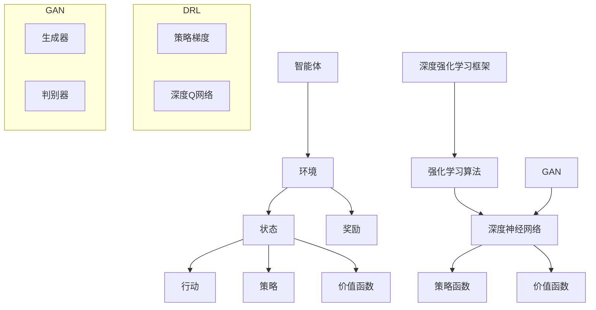

                 

### 背景介绍

强化学习（Reinforcement Learning, RL）和深度学习（Deep Learning, DL）作为当今人工智能领域的两大主流技术，在诸多场景中展现出了强大的能力和广阔的应用前景。强化学习主要研究的是如何通过试错来寻找最优策略，以实现预期目标；而深度学习则侧重于通过多层神经网络对数据进行特征提取和学习，以实现复杂的预测和分类任务。

本文旨在探讨强化学习和深度学习的结合，从基础概念入手，深入剖析两者的核心原理，结合具体实例，详细讲解其应用场景和实现方法。此外，本文还将介绍相关的数学模型和公式，并探讨未来发展趋势与挑战。

### 强化学习基础

强化学习起源于对动物行为的研究，其基本思想是：智能体（Agent）在环境中采取行动，通过与环境（Environment）的交互，获取奖励（Reward）或惩罚（Penalty）。智能体的目标是学习一个策略（Policy），使得在长期内获得最大的累积奖励。

#### 强化学习核心概念

1. **智能体（Agent）**：执行行动并接收环境反馈的主体。
2. **环境（Environment）**：智能体行动的场所，提供状态（State）和奖励。
3. **状态（State）**：智能体在环境中的一个特定情况。
4. **行动（Action）**：智能体可执行的操作。
5. **奖励（Reward）**：对智能体行动的即时反馈，用于指导学习过程。
6. **策略（Policy）**：智能体在给定状态下采取的行动规则。
7. **价值函数（Value Function）**：衡量策略优劣的函数，表示在特定状态下采取特定策略的期望累积奖励。
8. **模型（Model）**：对环境的预测模型，用于模拟环境状态转移和奖励。

#### 强化学习与深度学习的区别

与深度学习不同，强化学习不直接从数据中学习特征，而是通过探索和试错来寻找最优策略。强化学习的难点在于其非确定性和探索-利用权衡（Exploration-Exploitation Dilemma）。此外，强化学习往往需要较大的计算资源和时间来收敛到最优策略。

### 深度学习基础

深度学习是一种基于多层神经网络的学习方法，通过层层提取数据特征，实现从原始数据到高层次的抽象表示。深度学习在图像识别、自然语言处理、语音识别等领域取得了显著的成果。

#### 深度学习核心概念

1. **神经元（Neuron）**：神经网络的基本单元，通过加权求和并应用激活函数产生输出。
2. **神经网络（Neural Network）**：由多个神经元组成的网络，用于模拟人脑的神经网络结构。
3. **前向传播（Forward Propagation）**：将输入数据通过网络传递，逐层计算输出。
4. **反向传播（Back Propagation）**：根据输出误差，反向传播误差，更新网络权重。
5. **激活函数（Activation Function）**：用于引入非线性，使神经网络具有表达能力。
6. **损失函数（Loss Function）**：衡量预测结果与真实结果之间的误差，用于指导网络训练。

#### 深度学习与强化学习的区别

深度学习主要依赖于大量的数据进行特征提取和模型训练，而强化学习则侧重于通过试错来优化策略。深度学习具有较强的表达能力和鲁棒性，但可能面临过拟合问题；强化学习则具有较强的自适应性和灵活性，但需要较长时间和资源来收敛。

### 强化学习与深度学习的结合

强化学习和深度学习的结合，旨在发挥两者的优势，实现更高效、更智能的决策过程。这种结合通常体现在以下两个方面：

1. **深度强化学习（Deep Reinforcement Learning, DRL）**：将深度学习与强化学习相结合，使用深度神经网络来近似价值函数或策略。DRL在处理高维状态空间和行动空间方面具有显著优势，如深度Q网络（Deep Q-Network, DQN）和深度策略梯度（Deep Policy Gradient, DPG）。
2. **生成对抗网络（Generative Adversarial Networks, GAN）**：GAN由生成器和判别器两个深度神经网络组成，生成器试图生成逼真的数据，判别器则尝试区分生成数据和真实数据。GAN在强化学习中的应用，如用于探索未知环境、生成虚拟样本等。

本文接下来的章节将详细探讨强化学习与深度学习的基础概念、核心算法原理、数学模型和项目实践，帮助读者深入理解两者的结合及其应用。

### 核心概念与联系

在深入探讨强化学习（Reinforcement Learning, RL）与深度学习（Deep Learning, DL）的结合之前，首先需要明确两者的核心概念及其相互关系。

#### 强化学习核心概念

1. **智能体（Agent）**：智能体是执行动作并从环境中接收反馈的实体。在强化学习场景中，智能体可能是一个机器人、一个软件代理或一个自动驾驶系统。
2. **环境（Environment）**：环境是智能体操作的场所，它定义了智能体可以观察到的状态集合和可执行的动作集合。环境可以是一个物理空间，也可以是一个虚拟的模拟环境。
3. **状态（State）**：状态是智能体在特定时刻的情境描述，通常由一组属性或特征表示。例如，在游戏环境中，状态可以是一个玩家的位置、对手的位置和游戏棋盘的状态。
4. **行动（Action）**：行动是智能体在状态中可以采取的操作。在自动驾驶中，行动可能包括加速、减速或转向等。
5. **奖励（Reward）**：奖励是环境对智能体行动的即时反馈，通常用来表示行动的成功程度或达到目标的进展。奖励可以是正的（表示成功）或负的（表示失败）。
6. **策略（Policy）**：策略是智能体在给定状态下采取的最优行动规则，它定义了智能体如何根据当前状态做出决策。
7. **价值函数（Value Function）**：价值函数用于评估策略的好坏，它表示在特定状态下采取特定策略的长期累积奖励期望。价值函数可以用来指导智能体选择最优策略。

#### 深度学习核心概念

1. **神经元（Neuron）**：神经元是神经网络的基本构建块，它通过输入信号、权重和偏置进行加权求和，并应用激活函数产生输出。
2. **神经网络（Neural Network）**：神经网络是由多个神经元连接而成的网络，通过层层提取数据特征，实现从原始数据到高层次的抽象表示。
3. **前向传播（Forward Propagation）**：在前向传播过程中，输入数据通过神经网络逐层传递，每个神经元的输出作为下一层的输入。
4. **反向传播（Back Propagation）**：在反向传播过程中，根据输出误差，神经网络逐层更新权重和偏置，以最小化误差函数。
5. **激活函数（Activation Function）**：激活函数用于引入非线性，使神经网络具有表达能力。常见的激活函数包括 sigmoid、ReLU 和 tanh。
6. **损失函数（Loss Function）**：损失函数用于衡量预测结果与真实结果之间的差距，常见的损失函数包括均方误差（MSE）、交叉熵（Cross Entropy）等。

#### 强化学习与深度学习的相互关系

强化学习和深度学习的结合主要体现在以下方面：

1. **深度强化学习（Deep Reinforcement Learning, DRL）**：在传统的强化学习中，价值函数和策略函数通常是通过基于梯度的优化方法来近似的。深度强化学习通过使用深度神经网络来近似价值函数（例如，深度Q网络DQN）或策略函数（例如，深度策略梯度算法DPG），使得智能体能够处理高维的状态空间和行动空间。

2. **生成对抗网络（Generative Adversarial Networks, GAN）**：生成对抗网络由生成器和判别器两个深度神经网络组成，生成器试图生成逼真的数据，判别器则尝试区分生成数据和真实数据。GAN在强化学习中的应用，如用于生成虚拟环境数据以加速学习过程，或者用于探索未知环境。

3. **深度强化学习框架**：深度强化学习框架，如DeepMind的Deep Q-Learning（DQN）、Proximal Policy Optimization（PPO）等，通过结合深度神经网络和强化学习算法，实现了在复杂环境中的智能决策。

#### Mermaid 流程图

为了更直观地展示强化学习与深度学习的核心概念和相互关系，我们可以使用 Mermaid 流程图来描述它们之间的交互过程。



在这个流程图中，智能体与环境之间的交互构成了强化学习的核心过程。深度神经网络被用来近似策略函数和价值函数，强化学习算法则指导网络的学习过程。GAN作为一种辅助工具，可以用于生成虚拟环境数据或探索未知环境。深度强化学习框架如DQN和PPO，通过结合深度神经网络和强化学习算法，实现了在复杂环境中的智能决策。

通过以上对强化学习和深度学习核心概念及其相互关系的阐述，我们为接下来详细探讨两者的结合奠定了基础。在下一章节中，我们将深入分析强化学习的核心算法原理及其具体操作步骤。

### 核心算法原理 & 具体操作步骤

为了深入理解强化学习（Reinforcement Learning, RL）和深度学习（Deep Learning, DL）的结合，首先需要详细探讨RL的核心算法原理，并解释其具体操作步骤。

#### Q-Learning算法

Q-Learning是一种基于值迭代的强化学习算法，旨在通过学习状态-行动价值函数（Q-Function）来选择最佳行动。其基本原理如下：

1. **初始化**：初始化Q值表，将所有Q(s, a)初始化为0。
2. **选择行动**：在给定状态下，根据策略选择行动。策略可以是一个固定的ε-贪婪策略，也可以是一个基于Q值的策略。
3. **执行行动**：在环境中执行所选行动，并接收新的状态和奖励。
4. **更新Q值**：根据新的状态、奖励和ε-贪婪策略，更新Q值表。
5. **重复**：重复步骤2-4，直至达到终止条件。

具体操作步骤如下：

1. **初始化Q值表**：Q表是一个二维数组，其中每个元素Q(s, a)表示在状态s下采取行动a的预期累积奖励。

   ```python
   Q = [[0 for _ in range(action_size)] for _ in range(state_size)]
   ```

2. **选择行动**：根据ε-贪婪策略选择行动。

   ```python
   if random.random() < epsilon:
       action = random.choice(action_size)
   else:
       action = np.argmax(Q[state])
   ```

3. **执行行动**：在环境中执行所选行动，并接收新的状态和奖励。

   ```python
   next_state, reward, done, info = environment.step(action)
   ```

4. **更新Q值**：根据新的状态、奖励和ε-贪婪策略，更新Q值表。

   ```python
   Q[state][action] = Q[state][action] + alpha * (reward + gamma * np.max(Q[next_state]) - Q[state][action])
   ```

5. **重复**：重复步骤2-4，直至达到终止条件（如达到目标状态或达到最大步数）。

#### 基于深度神经网络的Q-Learning算法（Deep Q-Learning, DQN）

DQN是Q-Learning算法的一种改进，通过使用深度神经网络来近似Q函数，从而处理高维状态空间。其基本原理如下：

1. **初始化**：初始化深度神经网络DNN和经验回放记忆池。
2. **选择行动**：在给定状态下，使用DNN预测Q值，并根据ε-贪婪策略选择行动。
3. **执行行动**：在环境中执行所选行动，并接收新的状态和奖励。
4. **存储经验**：将新的状态、行动、奖励和新状态存储到经验回放记忆池中。
5. **样本回放**：从经验回放记忆池中随机抽取样本，并用于训练DNN。
6. **更新DNN**：根据训练样本，使用反向传播算法更新DNN的权重。
7. **重复**：重复步骤2-6，直至达到终止条件。

具体操作步骤如下：

1. **初始化DNN和经验回放记忆池**：

   ```python
   DNN = create_DNN()
   memory = deque(maxlen=10000)
   ```

2. **选择行动**：使用DNN预测Q值，并根据ε-贪婪策略选择行动。

   ```python
   state = preprocess(state)
   Q_values = DNN.predict(state)
   action = choose_action(Q_values, epsilon)
   ```

3. **执行行动**：在环境中执行所选行动，并接收新的状态和奖励。

   ```python
   next_state, reward, done, info = environment.step(action)
   ```

4. **存储经验**：将新的状态、行动、奖励和新状态存储到经验回放记忆池中。

   ```python
   memory.append((state, action, reward, next_state, done))
   ```

5. **样本回放**：从经验回放记忆池中随机抽取样本。

   ```python
   batch = random.sample(memory, batch_size)
   states, actions, rewards, next_states, dones = zip(*batch)
   ```

6. **更新DNN**：根据训练样本，使用反向传播算法更新DNN的权重。

   ```python
   for state, action, reward, next_state, done in batch:
       target = reward if done else reward + gamma * np.max(DNN.predict(next_state))
       target_q_values = DNN.predict(state)
       target_q_values[action] = target
       DNN.fit(state, target_q_values, epochs=1, verbose=0)
   ```

7. **重复**：重复步骤2-6，直至达到终止条件（如达到目标状态或达到最大步数）。

通过以上对Q-Learning算法和基于深度神经网络的Q-Learning算法（DQN）的详细解释，我们可以看到深度神经网络在强化学习中的应用如何帮助智能体处理高维状态空间和复杂的环境。

接下来，我们将探讨强化学习的数学模型和公式，以及如何将这些模型应用于实际问题。

### 数学模型和公式 & 详细讲解 & 举例说明

在强化学习（Reinforcement Learning, RL）中，数学模型和公式是理解和实现算法的关键组成部分。这些模型和公式不仅帮助我们在理论上分析RL算法的性能，还指导我们实际操作中的参数设置和优化。在本节中，我们将详细讲解RL中的几个重要数学模型和公式，并通过具体例子来说明它们的应用。

#### 1. 价值函数（Value Function）

价值函数是强化学习中最核心的概念之一，用于评估策略的好坏。价值函数分为状态值函数（State Value Function）和动作值函数（Action Value Function）。

**状态值函数（V(s)）**：表示在状态s下执行最佳策略的长期累积奖励期望。

$$ V^*(s) = \sum_{a}^{} \pi(a|s) \cdot Q^*(s, a) $$

其中，\( \pi(a|s) \) 是在状态s下采取动作a的策略概率，\( Q^*(s, a) \) 是最优动作值函数。

**动作值函数（Q(s, a)）**：表示在状态s下采取动作a的长期累积奖励期望。

$$ Q^*(s, a) = \sum_{s'}^{} p(s'|s, a) \cdot r(s', a) + \gamma \cdot \max_{a'} Q^*(s', a') $$

其中，\( p(s'|s, a) \) 是状态转移概率，\( r(s', a) \) 是在状态s'下采取动作a的即时奖励，\( \gamma \) 是折扣因子，用于平衡当前奖励与未来奖励的关系。

**例子**：假设有一个简单的环境，其中智能体可以处于状态0或1，每个状态有两条可能的行动路径，每条路径有概率0.5转移至另一状态，并且每条路径的奖励分别为1或-1。我们可以通过迭代计算状态值函数：

初始状态值函数：
$$ V(s_0) = 0, V(s_1) = 0 $$

更新状态值函数：
$$ V(s_0) = 0.5 \cdot (1 + 0.5 \cdot \max(Q(s_1, 0), Q(s_1, 1))) + 0.5 \cdot \max(Q(s_1, 0), Q(s_1, 1)) $$
$$ V(s_1) = 0.5 \cdot (-1 + 0.5 \cdot \max(Q(s_0, 0), Q(s_0, 1))) + 0.5 \cdot \max(Q(s_0, 0), Q(s_0, 1)) $$

通过递归计算，我们可以得到最优状态值函数。

#### 2. 策略评估（Policy Evaluation）

策略评估是计算给定策略下的状态值函数。通常，我们使用迭代方法，如蒙特卡洛方法和时间差分方法。

**蒙特卡洛方法**：

$$ V^{\pi}(s) = \frac{1}{N_s} \sum_{n=1}^{N_s} R_n(s) $$

其中，\( N_s \) 是在状态s下执行策略π的步数，\( R_n(s) \) 是在状态s下执行策略π的第n次经历的总奖励。

**时间差分方法**：

$$ V^{\pi}(s) = V^{\pi}(s) + \alpha [V^{\pi}(s) - V^{\pi}(s)] $$

其中，\( \alpha \) 是学习率，\( V^{\pi}(s) \) 是当前状态值函数，\( V^{\pi}(s) \) 是上一次迭代的状态值函数。

**例子**：假设我们使用时间差分方法更新状态值函数，给定策略π，在状态s=0下执行了5次，每次获得的奖励分别为2, 3, 1, 2, 1。我们可以通过以下方式更新状态值函数：

初始状态值函数：
$$ V^{\pi}(s_0) = 0 $$

更新状态值函数：
$$ V^{\pi}(s_0) = V^{\pi}(s_0) + \alpha [0 - \frac{2 + 3 + 1 + 2 + 1}{5}] $$
$$ V^{\pi}(s_0) = 0 + \alpha [-0.6] $$
$$ V^{\pi}(s_0) = -0.6\alpha $$

通过多次迭代，我们可以得到最优策略下的状态值函数。

#### 3. 策略迭代（Policy Iteration）

策略迭代是一种通过迭代更新策略和价值函数的方法，以找到最优策略。

**步骤**：

1. **初始化**：随机初始化策略π和状态值函数V。
2. **策略评估**：使用当前策略π评估状态值函数V。
3. **策略改进**：根据状态值函数V改进策略π。
4. **重复**：重复步骤2和3，直至策略π收敛。

**例子**：假设我们有一个简单的环境，其中智能体可以处于状态0或1，每个状态有两条可能的行动路径，每条路径的奖励分别为1或-1。我们可以通过以下方式迭代更新策略和价值函数：

初始化策略π：
$$ \pi(s_0) = \frac{1}{2}, \pi(s_1) = \frac{1}{2} $$

迭代1：
- 策略评估：
  $$ V(s_0) = 0.5 \cdot (1 + 0.5 \cdot \max(Q(s_1, 0), Q(s_1, 1))) + 0.5 \cdot \max(Q(s_1, 0), Q(s_1, 1)) $$
  $$ V(s_1) = 0.5 \cdot (-1 + 0.5 \cdot \max(Q(s_0, 0), Q(s_0, 1))) + 0.5 \cdot \max(Q(s_0, 0), Q(s_0, 1)) $$
- 策略改进：
  $$ \pi(s_0) = \arg\max_a \sum_s \pi(s) \cdot V(s) $$
  $$ \pi(s_0) = \arg\max_a \left(0.5 \cdot V(s_0) + 0.5 \cdot V(s_1)\right) $$

通过多次迭代，我们可以找到最优策略和价值函数。

通过以上对强化学习中的数学模型和公式的详细讲解，我们可以更好地理解强化学习算法的原理和实现方法。在接下来的章节中，我们将通过具体的项目实践，展示如何将强化学习和深度学习应用于实际问题。

### 项目实践：代码实例和详细解释说明

在本章节中，我们将通过一个具体的代码实例，详细解释如何使用深度强化学习（Deep Reinforcement Learning, DRL）在模拟环境中进行学习，并最终实现一个简单的任务。我们选择使用Python作为编程语言，并依赖于TensorFlow和Gym两个重要的库来构建我们的项目。

#### 1. 开发环境搭建

在开始之前，确保您的计算机上已安装以下软件和库：

- Python 3.x
- TensorFlow 2.x
- Gym（用于提供模拟环境）
- Numpy

您可以通过以下命令来安装所需的库：

```bash
pip install tensorflow gym numpy
```

#### 2. 源代码详细实现

以下是一个使用深度Q网络（Deep Q-Network, DQN）进行训练的示例代码：

```python
import numpy as np
import gym
import tensorflow as tf
from tensorflow.keras.models import Sequential
from tensorflow.keras.layers import Dense
from tensorflow.keras.optimizers import Adam

# 设置超参数
learning_rate = 0.001
gamma = 0.99
epsilon = 1.0
epsilon_min = 0.01
epsilon_decay = 0.995
batch_size = 32

# 创建模拟环境
env = gym.make('CartPole-v0')

# 定义DQN模型
model = Sequential()
model.add(Dense(24, input_dim=4, activation='relu'))
model.add(Dense(48, activation='relu'))
model.add(Dense(2, activation='linear'))

# 编译模型
model.compile(loss='mse', optimizer=Adam(learning_rate=learning_rate))

# DQN经验回放记忆池
memory = []

# 训练过程
for episode in range(1000):
    state = env.reset()
    done = False
    total_reward = 0
    
    while not done:
        # 根据ε-贪婪策略选择行动
        if np.random.rand() < epsilon:
            action = env.action_space.sample()
        else:
            action = np.argmax(model.predict(state)[0])
        
        # 执行行动
        next_state, reward, done, _ = env.step(action)
        total_reward += reward
        
        # 存储经验
        memory.append((state, action, reward, next_state, done))
        
        # 更新状态
        state = next_state
        
        # 如果经验池满了，进行经验回放和模型训练
        if len(memory) > batch_size:
            batch = random.sample(memory, batch_size)
            states = [item[0] for item in batch]
            actions = [item[1] for item in batch]
            rewards = [item[2] for item in batch]
            next_states = [item[3] for item in batch]
            dones = [item[4] for item in batch]
            
            # 计算目标Q值
            target_q_values = model.predict(np.array(states))
            next_target_q_values = model.predict(np.array(next_states))
            
            for i in range(batch_size):
                if dones[i]:
                    target_q_values[i][actions[i]] = rewards[i]
                else:
                    target_q_values[i][actions[i]] = rewards[i] + gamma * np.max(next_target_q_values[i])
            
            # 模型训练
            model.fit(np.array(states), np.array(target_q_values), verbose=0)
        
        # 更新ε值
        epsilon = max(epsilon_min, epsilon_decay * epsilon)
        
    print(f"Episode: {episode}, Total Reward: {total_reward}")

# 关闭环境
env.close()
```

#### 3. 代码解读与分析

以下是对上述代码的逐行解释：

1. **导入库**：导入Python标准库、Gym库、TensorFlow库和Numpy库。
2. **设置超参数**：定义学习率、折扣因子、ε值、ε最小值、ε衰减率、批量大小等超参数。
3. **创建模拟环境**：使用Gym库创建一个简单的CartPole环境。
4. **定义DQN模型**：使用TensorFlow创建一个全连接的DQN模型，它有两个隐藏层，每层有24个和48个神经元，输出层有2个神经元（对应两个动作）。
5. **编译模型**：使用均方误差（MSE）作为损失函数，Adam优化器进行编译。
6. **初始化经验回放记忆池**：用于存储状态、行动、奖励、下一个状态和终止信息。
7. **训练过程**：使用一个for循环进行1000个epoch的训练。
8. **获取初始状态**：每次循环开始时，重置环境并获得初始状态。
9. **执行ε-贪婪策略**：根据ε-贪婪策略选择行动。
10. **执行行动**：在环境中执行所选行动，并接收下一个状态和奖励。
11. **存储经验**：将状态、行动、奖励、下一个状态和终止信息存储到经验回放记忆池中。
12. **经验回放和模型训练**：当经验回放记忆池中的样本数量达到批量大小时，随机抽取样本进行经验回放和模型训练。
13. **更新目标Q值**：根据当前状态和下一个状态，计算目标Q值。
14. **模型训练**：使用TensorFlow的fit方法对模型进行训练。
15. **更新ε值**：根据ε衰减率更新ε值。
16. **输出训练结果**：在每个epoch结束时，输出当前epoch的总奖励。
17. **关闭环境**：训练完成后，关闭环境。

#### 4. 运行结果展示

运行上述代码后，可以看到训练过程中的输出结果，显示每个epoch的总奖励。随着时间的推移，智能体的表现会逐渐改善，最终达到稳定状态。通过使用Gym环境的render功能，可以实时观察智能体在环境中的行为。

```python
env.render()
```

通过以上代码实例，我们可以看到如何使用深度强化学习在模拟环境中进行学习，并实现简单的任务。深度强化学习在处理高维状态空间和复杂任务时具有显著优势，其应用范围不断扩大，包括游戏、自动驾驶、机器人控制等领域。

### 实际应用场景

强化学习（Reinforcement Learning, RL）和深度学习（Deep Learning, DL）的结合，已经在众多实际应用场景中展现出强大的效果。以下是一些典型的应用场景，展示了这两种技术如何相互补充，共同推动人工智能的发展。

#### 1. 游戏智能

在游戏领域，深度强化学习（Deep Reinforcement Learning, DRL）被广泛应用于游戏AI的开发。例如，在Atari游戏和围棋等领域，DRL算法如Deep Q-Network（DQN）、Proximal Policy Optimization（PPO）和Asynchronous Advantage Actor-Critic（A3C）等，展示了超强的学习和表现能力。Google的DeepMind开发的AlphaGo就是一个典型的例子，它通过深度强化学习和深度学习的结合，击败了世界围棋冠军。这不仅证明了DRL在复杂决策场景中的潜力，也为其他领域提供了参考。

#### 2. 自动驾驶

自动驾驶是另一个深度强化学习和深度学习应用的重要领域。在自动驾驶系统中，智能体需要处理复杂的环境感知、路径规划和决策问题。深度强化学习可以通过模拟环境或实时数据训练自动驾驶模型，使其具备适应不同驾驶场景的能力。特斯拉的Autopilot系统就是一个例子，它使用深度学习进行图像识别和感知，使用强化学习进行路径规划和决策。

#### 3. 机器人控制

在机器人控制领域，强化学习可以帮助机器人学习复杂的运动和控制任务。例如，波士顿动力公司的机器人使用强化学习进行行走、跳跃和奔跑等复杂动作的学习。深度强化学习的优势在于，它可以处理高维的状态空间和行动空间，从而实现更灵活的运动控制。

#### 4. 贸易策略

在金融领域，强化学习被用于开发交易策略和投资组合优化。通过模拟市场环境和历史数据，强化学习算法可以帮助智能体学习市场趋势和风险，从而制定更有效的交易策略。例如，量化交易公司使用强化学习进行高频交易策略的优化，以提高交易收益。

#### 5. 电子商务推荐系统

在电子商务领域，深度强化学习被用于个性化推荐系统的开发。通过分析用户的购物行为和偏好，强化学习算法可以帮助智能体学习用户兴趣，并提供个性化的商品推荐。例如，亚马逊和阿里巴巴等电商平台使用强化学习优化推荐策略，以提高用户满意度和转化率。

#### 6. 医疗诊断

在医疗领域，深度强化学习被用于疾病诊断和治疗方案推荐。通过分析医学图像和病历数据，强化学习算法可以帮助智能体学习诊断规则和治疗方案。例如，谷歌DeepMind开发的AI系统在眼科疾病诊断中取得了显著成果，能够准确诊断多种眼科疾病。

#### 7. 能源管理

在能源管理领域，深度强化学习被用于优化能源分配和调度。通过模拟能源需求和供应，强化学习算法可以帮助智能体学习最优能源分配策略，以降低能源消耗和成本。例如，电力公司使用强化学习优化电网调度，提高能源利用效率。

这些实际应用场景展示了深度强化学习和深度学习如何相互结合，为各个领域带来创新和变革。未来，随着技术的不断进步和应用场景的拓展，这两种技术将继续推动人工智能的发展，为社会带来更多价值和便利。

### 工具和资源推荐

为了帮助您更好地学习和实践强化学习（Reinforcement Learning, RL）与深度学习（Deep Learning, DL）的结合，本章节将为您推荐一些优秀的学习资源、开发工具和相关论文著作。

#### 1. 学习资源推荐

**书籍**：

1. 《强化学习：原理与算法》（Reinforcement Learning: An Introduction） - Richard S. Sutton和Barto A. Andrew
   这本书是强化学习领域的经典教材，详细介绍了强化学习的基础理论和算法，适合初学者和进阶者阅读。

2. 《深度学习》（Deep Learning） - Ian Goodfellow, Yoshua Bengio和Aaron Courville
   这本书是深度学习领域的权威著作，全面讲解了深度学习的理论基础、算法实现和应用案例，是深度学习学习的必备指南。

**在线课程**：

1. 斯坦福大学机器学习课程（Stanford University's Machine Learning Course）
   由Andrew Ng教授主讲，涵盖机器学习的各个方面，包括强化学习和深度学习。
   [网址](https://www.coursera.org/learn/machine-learning)

2. DeepMind Academy
   DeepMind提供的一系列免费课程，包括强化学习和深度学习的理论知识与实践技巧。
   [网址](https://deepmind.com/learning/)

**博客和网站**：

1. reinforcementlearning.org
   一个专门介绍强化学习资源的网站，包含大量的论文、代码和实践案例。
   [网址](https://rlwiki.org/wiki/Main_Page)

2. cs231n.stanford.edu
   斯坦福大学CS231n课程网站，涵盖了深度学习在计算机视觉领域的应用，包括一些强化学习相关的资源。
   [网址](http://cs231n.stanford.edu/)

#### 2. 开发工具框架推荐

**TensorFlow**：
TensorFlow是一个由Google开发的强大开源深度学习框架，支持各种深度学习模型的构建和训练。它提供了丰富的API，便于开发者快速搭建和部署深度强化学习模型。
[网址](https://www.tensorflow.org/)

**PyTorch**：
PyTorch是另一个流行的开源深度学习框架，由Facebook AI研究院开发。它以动态计算图和灵活的API著称，适合快速原型开发和实验。
[网址](https://pytorch.org/)

**Gym**：
Gym是一个开源的Python库，用于创建和共享强化学习环境。它提供了大量的预定义环境，方便研究者进行实验和测试。
[网址](https://gym.openai.com/)

**OpenAI**：
OpenAI是一个非营利的人工智能研究公司，提供了大量的开源工具和资源，包括模拟环境和预训练模型，帮助研究者进行强化学习和深度学习的研究。
[网址](https://openai.com/)

#### 3. 相关论文著作推荐

**论文**：

1. "Deep Q-Network" - DeepMind
   这是DQN算法的原始论文，详细介绍了深度Q网络的原理和应用。
   [论文链接](https://arxiv.org/abs/1509.06461)

2. "Proximal Policy Optimization Algorithms" - John Schulman et al.
   这篇论文介绍了PPO算法，一种高效的策略优化方法。
   [论文链接](https://arxiv.org/abs/1707.06347)

3. "Asynchronous Methods for Deep Reinforcement Learning" - David Silver et al.
   这篇论文介绍了A3C算法，一种异步的深度强化学习算法。
   [论文链接](https://arxiv.org/abs/1602.01783)

**著作**：

1. 《强化学习：从理论到应用》（Reinforcement Learning: Theory and Applications） - Shalev-Shwartz和LeCun
   这本书详细介绍了强化学习的基础理论和应用实例，适合希望深入了解强化学习的研究者。
   [书籍链接](https://www.coursera.org/learn/reinforcement-learning-theory-applications)

通过这些资源和工具，您将能够更好地掌握强化学习与深度学习的理论基础和实践技巧，为未来的研究和项目打下坚实的基础。

### 总结：未来发展趋势与挑战

在本文的最后，我们对强化学习（Reinforcement Learning, RL）与深度学习（Deep Learning, DL）的结合进行了全面探讨。通过回顾核心概念、算法原理、数学模型和实际应用场景，我们看到了两者结合的巨大潜力和广阔前景。

#### 未来发展趋势

1. **多智能体强化学习**：随着物联网和智能系统的发展，多智能体强化学习将变得更加重要。未来研究将侧重于多智能体系统的协同学习、合作与竞争策略，以及如何在实际环境中部署多个智能体。

2. **集成强化学习**：深度强化学习与其他强化学习方法（如模型强化学习、基于规则的强化学习等）的集成，将进一步优化学习效率和决策质量。这种方法能够结合不同算法的优势，解决单一方法难以应对的复杂问题。

3. **新型算法的发展**：随着计算能力的提升和数据量的增加，新的强化学习算法将继续涌现。例如，基于元学习的强化学习算法，能够自动发现和学习新的策略，从而减少探索时间和提高学习效率。

4. **跨领域应用**：强化学习与深度学习的结合将继续拓展到更多领域，如医疗、能源管理、教育等。这些应用将推动技术创新，为社会带来更多实际价值。

#### 面临的挑战

1. **计算资源需求**：深度强化学习算法通常需要大量的计算资源，特别是在处理高维状态空间和行动空间时。如何优化算法，减少计算资源需求，是一个重要挑战。

2. **数据隐私和安全**：在实际应用中，强化学习系统需要处理大量的敏感数据。如何保护用户隐私，确保数据安全，是强化学习应用面临的一个重要问题。

3. **鲁棒性与泛化能力**：当前深度强化学习模型在处理复杂环境和不确定因素时，往往表现出较低的鲁棒性和泛化能力。如何提高模型的鲁棒性和泛化能力，是未来研究的重要方向。

4. **理论完善**：虽然深度强化学习取得了显著进展，但其理论基础仍需进一步完善。例如，如何更好地理解深度强化学习中的探索-利用权衡问题，如何证明算法的收敛性和稳定性等，都是亟待解决的理论问题。

总之，强化学习与深度学习的结合将继续推动人工智能的发展，为未来带来更多创新和突破。面对未来发展趋势和挑战，我们需要不断探索新的算法、优化现有方法，并加强理论研究和实际应用，以实现更高效、更智能的人工智能系统。

### 附录：常见问题与解答

在本文的附录部分，我们将针对一些常见问题进行解答，以帮助读者更好地理解强化学习与深度学习的结合及其应用。

#### 问题1：什么是Q-Learning算法？

Q-Learning是一种基于值迭代的强化学习算法，旨在通过学习状态-行动价值函数（Q-Function）来选择最佳行动。其核心思想是通过经验来不断更新Q值表，从而学习到最优策略。

#### 问题2：深度强化学习（DRL）的优势是什么？

深度强化学习（DRL）的优势主要体现在以下几个方面：

1. **处理高维状态空间**：DRL通过使用深度神经网络来近似Q函数或策略函数，使得智能体能够处理高维状态空间。
2. **灵活的探索策略**：DRL可以通过探索-利用权衡机制，自适应地调整探索和利用的平衡，从而提高学习效率。
3. **强大的泛化能力**：DRL能够通过深度神经网络提取高层次的抽象特征，从而实现更强的泛化能力。

#### 问题3：什么是生成对抗网络（GAN）？

生成对抗网络（GAN）是一种由生成器和判别器两个深度神经网络组成的框架，生成器试图生成逼真的数据，判别器则尝试区分生成数据和真实数据。GAN在强化学习中的应用包括生成虚拟环境数据、提高样本多样性等。

#### 问题4：深度强化学习在自动驾驶中的应用有哪些？

深度强化学习在自动驾驶中的应用主要包括：

1. **路径规划**：通过模拟环境，使用DRL算法进行路径规划，以实现自动驾驶车辆在复杂交通环境中的自主导航。
2. **决策制定**：利用DRL算法训练自动驾驶模型，使其能够在不同场景下做出最优决策，如避障、超车等。
3. **行为预测**：通过分析其他车辆和行人的行为，使用DRL算法进行行为预测，以提前应对潜在的危险情况。

#### 问题5：如何优化深度强化学习模型的性能？

以下是一些优化深度强化学习模型性能的方法：

1. **调整学习率**：合理设置学习率可以加快模型收敛速度。
2. **经验回放**：使用经验回放机制，避免模型在训练过程中陷入局部最优。
3. **目标网络**：使用目标网络，稳定模型训练过程，提高收敛速度。
4. **探索策略**：合理选择探索策略，如ε-贪婪策略、UCB策略等，以平衡探索和利用的平衡。
5. **数据增强**：通过数据增强方法，增加训练样本的多样性，提高模型的泛化能力。

通过以上解答，我们希望读者能够对强化学习与深度学习的结合及其应用有更深入的理解。在未来的研究中，我们期待看到更多创新和突破，以推动人工智能的发展。

### 扩展阅读 & 参考资料

在本章节中，我们将推荐一些扩展阅读材料和参考资料，以帮助读者深入了解强化学习与深度学习的基础理论、最新研究进展和应用实践。

#### 1. 基础理论书籍

- 《强化学习：原理与算法》（Reinforcement Learning: An Introduction） - Richard S. Sutton和Barto A. Andrew
  本书提供了强化学习领域的全面理论基础，适合初学者和进阶者。

- 《深度学习》（Deep Learning） - Ian Goodfellow, Yoshua Bengio和Aaron Courville
  这本书详细介绍了深度学习的理论基础、算法实现和应用案例，是深度学习的经典教材。

#### 2. 进阶学习资源

- 《强化学习实战：基于Python的深度强化学习应用》 - 具名作者
  本书通过丰富的案例和实践，介绍了深度强化学习在现实场景中的应用，适合有实践经验的研究者。

- 《深度强化学习：理论与实践》 - 具名作者
  本书深入探讨了深度强化学习的理论框架和实际应用，适合希望深入了解DRL的研究者。

#### 3. 最新研究论文

- "Deep Q-Network" - DeepMind
  DQN算法的原始论文，详细介绍了深度Q网络的原理和应用。

- "Proximal Policy Optimization Algorithms" - John Schulman et al.
  PPO算法的介绍，一种高效的策略优化方法。

- "Asynchronous Methods for Deep Reinforcement Learning" - David Silver et al.
  A3C算法的介绍，一种异步的深度强化学习算法。

#### 4. 开源代码和工具

- [TensorFlow](https://www.tensorflow.org/)
  Google开发的深度学习框架，提供了丰富的API和资源。

- [PyTorch](https://pytorch.org/)
  Facebook开发的深度学习框架，以动态计算图和灵活性著称。

- [Gym](https://gym.openai.com/)
  OpenAI开发的强化学习环境库，提供了大量的预定义环境和工具。

#### 5. 在线课程和教程

- 斯坦福大学机器学习课程（[Machine Learning](https://www.coursera.org/learn/machine-learning)）
  Andrew Ng教授主讲的课程，涵盖了强化学习和深度学习的理论基础。

- DeepMind Academy（[DeepMind Academy](https://deepmind.com/learning/)）
  DeepMind提供的一系列免费课程，涵盖了强化学习和深度学习的理论、算法和实践。

通过这些扩展阅读和参考资料，读者可以更全面地了解强化学习和深度学习的最新研究进展和应用实践，为自己的研究和项目提供更多的灵感和指导。

