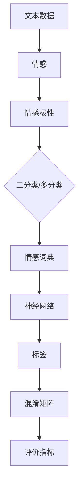

                 

### 一、背景介绍

情感分析（Sentiment Analysis），又称为意见挖掘，是一种自然语言处理（NLP）技术，旨在识别文本中的主观信息，并对其进行分类。这项技术已经在多个领域得到了广泛应用，例如市场调研、社交媒体监控、客户服务、舆情分析等。随着互联网和社交媒体的迅猛发展，人们产生的文本数据量呈指数级增长，对这种数据进行情感分析，从而提取有价值的信息，显得尤为重要。

传统的情感分析主要依赖于人工规则和统计学方法，例如词频统计、情感词典、朴素贝叶斯分类器等。然而，这些方法在面对复杂的文本时，往往效果有限。随着深度学习的兴起，神经网络模型在情感分析领域得到了广泛应用，特别是基于循环神经网络（RNN）和变换器（Transformer）的模型，如LSTM、GRU、BERT等，这些模型通过学习大量的文本数据，能够更加准确地捕捉文本中的情感信息。

本文将深入探讨情感分析的核心概念、算法原理、数学模型以及实际应用场景。首先，我们将介绍情感分析的基本概念和目标，然后详细解析目前主流的情感分析算法，包括传统方法和基于深度学习的方法。接着，我们将通过具体的数学模型和公式，展示如何使用这些算法进行情感分析。随后，我们将通过一个实际项目实例，展示如何搭建开发环境、实现源代码以及分析运行结果。最后，我们将探讨情感分析在实际应用中的各种场景，并提供相关的学习资源和开发工具推荐。

通过这篇文章，读者将全面了解情感分析的技术原理和应用，从而在今后的项目中更好地运用这一技术，提取文本数据中的情感信息，为企业决策提供有力支持。

### 二、核心概念与联系

在深入探讨情感分析之前，我们首先需要明确一些核心概念和它们之间的联系。以下是一些关键概念：

#### 1. 文本数据（Text Data）

文本数据是指以人类语言形式存在的数据，包括句子、段落、文章等。在情感分析中，文本数据是主要研究对象。对文本数据进行处理和分析，是情感分析的第一步。

#### 2. 情感（Sentiment）

情感是指人对某一对象（如产品、服务、事件等）所持有的情绪倾向。情感可以表现为正面、中性或负面。情感分析的目标就是从文本数据中提取出这种情绪倾向。

#### 3. 情感极性（Sentiment Polarities）

情感极性通常用二分类或多分类来表示。最常见的情感极性是正面和负面，即二分类；还有一种常见的多分类情感极性是正面、中性、负面。情感极性是情感分析中的一个重要概念，它帮助我们判断文本的倾向。

#### 4. 情感词典（Sentiment Lexicon）

情感词典是一个包含大量词语及其情感极性的词汇库。在传统情感分析中，情感词典是常用的工具，通过查找文本中的词语及其对应的情感极性，来判断文本的情感倾向。

#### 5. 神经网络（Neural Network）

神经网络是一种基于人脑神经元连接方式的计算模型。在情感分析中，神经网络特别是深度学习模型，如循环神经网络（RNN）和变换器（Transformer），被广泛应用于情感极性的分类。

#### 6. 标签（Labels）

标签是指对文本数据预先设定的分类标记，用于训练和评估情感分析模型。标签通常与情感极性一一对应，如正面、中性、负面等。

#### 7. 混淆矩阵（Confusion Matrix）

混淆矩阵是一种用于评估分类模型性能的指标。它展示了模型对各类别预测结果的分布情况，能够直观地显示模型在分类任务中的准确性。

#### 8. 评价指标（Evaluation Metrics）

评价指标用于量化评估情感分析模型的性能。常用的评价指标包括准确率（Accuracy）、精确率（Precision）、召回率（Recall）和F1分数（F1 Score）。

下面，我们将通过一个Mermaid流程图，展示这些核心概念之间的联系和关系：



通过这个流程图，我们可以清晰地看到，文本数据是情感分析的基础，情感是文本数据的内涵，情感极性是情感的具体表现形式，而情感词典、神经网络、标签、混淆矩阵和评价指标则是在实际操作中对情感进行分析、评估和优化的工具和手段。理解这些核心概念和它们之间的联系，对于深入掌握情感分析技术至关重要。

### 三、核心算法原理 & 具体操作步骤

在情感分析中，核心算法的选择直接影响分析结果的准确性。目前，情感分析的主要算法可以分为传统方法和基于深度学习的方法。下面，我们将详细探讨这些算法的原理和具体操作步骤。

#### 1. 传统方法

传统方法通常依赖于人工规则和统计学方法，包括词频统计、情感词典和朴素贝叶斯分类器等。

**词频统计（TF）**

词频统计是情感分析中最基本的方法之一。它通过计算文本中各个词语出现的频率，来判断文本的情感极性。词频越高，通常表示该词对情感极性的影响越大。具体操作步骤如下：

- **步骤1**：文本预处理，包括去除标点符号、停用词和词形还原等。
- **步骤2**：计算文本中各个词语的频率。
- **步骤3**：设定阈值，过滤掉频率低于阈值的词语。
- **步骤4**：根据词语频率计算文本的情感极性。

**情感词典**

情感词典是一种包含大量词语及其情感极性的词汇库。传统方法通过查找文本中的词语及其对应的情感极性，来判断文本的情感倾向。具体操作步骤如下：

- **步骤1**：文本预处理，去除标点符号、停用词等。
- **步骤2**：将文本分词，得到一系列词语。
- **步骤3**：查找情感词典，获取每个词语的情感极性。
- **步骤4**：根据词语的情感极性计算文本的整体情感极性。

**朴素贝叶斯分类器（Naive Bayes）**

朴素贝叶斯分类器是一种基于贝叶斯定理的简单分类器。它假设特征之间相互独立，通过计算每个词语的概率和其对应的情感极性，来判断文本的情感极性。具体操作步骤如下：

- **步骤1**：文本预处理，分词和词形还原。
- **步骤2**：计算每个词语在训练数据中的出现概率。
- **步骤3**：计算每个词语与其对应情感极性的条件概率。
- **步骤4**：根据贝叶斯定理，计算每个情感极性的后验概率。
- **步骤5**：选择后验概率最大的情感极性作为文本的情感极性。

#### 2. 基于深度学习的方法

随着深度学习技术的发展，基于深度学习的情感分析算法在准确性方面取得了显著提升。以下是一些常用的基于深度学习的算法：

**循环神经网络（RNN）**

循环神经网络是一种能够处理序列数据的神经网络。在情感分析中，RNN能够通过学习文本序列中的特征，来预测文本的情感极性。具体操作步骤如下：

- **步骤1**：文本预处理，分词和词形还原。
- **步骤2**：将文本序列转换为嵌入向量。
- **步骤3**：构建RNN模型，输入嵌入向量，输出情感极性的概率分布。
- **步骤4**：使用训练数据训练模型，调整模型参数。
- **步骤5**：使用测试数据评估模型性能。

**长短期记忆网络（LSTM）**

长短期记忆网络是RNN的一种改进，能够更好地处理长序列数据。在情感分析中，LSTM通过学习文本序列中的长期依赖关系，来提高情感分类的准确性。具体操作步骤如下：

- **步骤1**：文本预处理，分词和词形还原。
- **步骤2**：将文本序列转换为嵌入向量。
- **步骤3**：构建LSTM模型，输入嵌入向量，输出情感极性的概率分布。
- **步骤4**：使用训练数据训练模型，调整模型参数。
- **步骤5**：使用测试数据评估模型性能。

**变换器（Transformer）**

变换器是一种基于自注意力机制的深度学习模型，它通过计算序列中每个元素与其他元素的相关性，来学习文本特征。在情感分析中，变换器能够通过学习大量的文本数据，捕捉复杂的情感信息。具体操作步骤如下：

- **步骤1**：文本预处理，分词和词形还原。
- **步骤2**：将文本序列转换为嵌入向量。
- **步骤3**：构建变换器模型，输入嵌入向量，输出情感极性的概率分布。
- **步骤4**：使用训练数据训练模型，调整模型参数。
- **步骤5**：使用测试数据评估模型性能。

**BERT（Bidirectional Encoder Representations from Transformers）**

BERT是一种预训练的变换器模型，通过在大量的文本数据上进行预训练，然后针对特定任务进行微调。在情感分析中，BERT能够通过预训练获取丰富的语言特征，从而提高情感分类的准确性。具体操作步骤如下：

- **步骤1**：文本预处理，分词和词形还原。
- **步骤2**：将文本序列转换为嵌入向量。
- **步骤3**：使用BERT模型对嵌入向量进行编码。
- **步骤4**：将编码后的向量输入分类器，输出情感极性的概率分布。
- **步骤5**：使用训练数据训练分类器，调整模型参数。
- **步骤6**：使用测试数据评估分类器性能。

通过以上介绍，我们可以看到，传统方法和基于深度学习的方法各有优缺点。传统方法简单易用，但准确性有限；而基于深度学习的方法虽然复杂度较高，但能够通过学习大量数据，显著提高情感分析的准确性。在实际应用中，可以根据具体需求选择合适的方法。

### 四、数学模型和公式 & 详细讲解 & 举例说明

在情感分析中，数学模型和公式是理解算法原理和实现具体操作的核心。下面，我们将详细介绍几种常用的数学模型和公式，并给出详细的讲解和实例说明。

#### 1. 朴素贝叶斯分类器

朴素贝叶斯分类器是一种基于概率论的分类方法，它假设特征之间相互独立。在情感分析中，朴素贝叶斯分类器通过计算每个特征的概率，来预测文本的情感极性。

**数学模型：**

设文本集合为D，其中每个文本用向量\( x \)表示，即\( x = (x_1, x_2, ..., x_n) \)，其中\( x_i \)表示文本中的第i个词语。

- **特征概率分布**：\( P(x) = P(x_1, x_2, ..., x_n) \)
- **先验概率**：\( P(y) \)，其中y为情感极性（正面、中性、负面）
- **条件概率**：\( P(y|x) = \frac{P(x|y)P(y)}{P(x)} \)

**具体公式：**

- **正面先验概率**：\( P(y=正面) \)
- **负面先验概率**：\( P(y=负面) \)
- **中性先验概率**：\( P(y=中性) \)
- **正面条件概率**：\( P(正面|x) = \frac{P(x|正面)P(正面)}{P(x)} \)
- **负面条件概率**：\( P(负面|x) = \frac{P(x|负面)P(负面)}{P(x)} \)
- **中性条件概率**：\( P(中性|x) = \frac{P(x|中性)P(中性)}{P(x)} \)

**实例说明：**

假设我们有三个情感极性：正面、中性、负面。给定一个文本，我们需要计算其属于每个情感极性的概率，并选择概率最大的作为最终分类结果。

- **正面先验概率**：\( P(正面) = 0.4 \)
- **负面先验概率**：\( P(负面) = 0.3 \)
- **中性先验概率**：\( P(中性) = 0.3 \)
- **正面条件概率**：\( P(正面|x) = 0.5 \)
- **负面条件概率**：\( P(负面|x) = 0.4 \)
- **中性条件概率**：\( P(中性|x) = 0.6 \)

计算得到：

- **正面后验概率**：\( P(正面|x) = \frac{0.5 \times 0.4}{0.4 + 0.4 \times 0.3 + 0.6 \times 0.3} \approx 0.455 \)
- **负面后验概率**：\( P(负面|x) = \frac{0.4 \times 0.3}{0.4 + 0.4 \times 0.3 + 0.6 \times 0.3} \approx 0.364 \)
- **中性后验概率**：\( P(中性|x) = \frac{0.6 \times 0.3}{0.4 + 0.4 \times 0.3 + 0.6 \times 0.3} \approx 0.181 \)

由于正面后验概率最大，因此我们预测该文本的情感极性为正面。

#### 2. 循环神经网络（RNN）

循环神经网络是一种能够处理序列数据的神经网络。在情感分析中，RNN通过学习文本序列中的特征，来预测文本的情感极性。

**数学模型：**

- **激活函数**：\( a_t = \sigma(Wa_{t-1} + bx + c) \)
- **隐藏状态**：\( h_t = [a_t, a_{t-1}, ..., a_1] \)
- **输出**：\( y_t = \text{softmax}(Wh + d) \)

其中，\( \sigma \)为激活函数，\( W \)、\( b \)、\( c \)、\( d \)为模型参数。

**具体公式：**

- **隐藏状态更新**：\( a_t = \sigma(Wa_{t-1} + bx + c) \)
- **输出层计算**：\( y_t = \text{softmax}(Wh + d) \)

**实例说明：**

假设我们有三个情感极性：正面、中性、负面。给定一个文本序列，我们需要计算其属于每个情感极性的概率，并选择概率最大的作为最终分类结果。

- **隐藏状态更新**：\( a_t = \sigma(Wa_{t-1} + bx + c) \)
- **输出层计算**：\( y_t = \text{softmax}(Wh + d) \)

通过训练，我们得到了一组模型参数，例如：

- \( W = \begin{bmatrix}
  0.1 & 0.2 & 0.3 \\
  0.4 & 0.5 & 0.6 \\
  0.7 & 0.8 & 0.9
\end{bmatrix} \)
- \( b = \begin{bmatrix}
  0.1 \\
  0.2 \\
  0.3
\end{bmatrix} \)
- \( c = \begin{bmatrix}
  0.4 \\
  0.5 \\
  0.6
\end{bmatrix} \)
- \( d = \begin{bmatrix}
  0.1 \\
  0.2 \\
  0.3
\end{bmatrix} \)

给定一个文本序列\( x = [1, 2, 3, 4, 5] \)，我们需要计算其情感极性的概率分布。

- **隐藏状态更新**：\( a_1 = \sigma(Wa_{0} + bx + c) \)
- **输出层计算**：\( y_1 = \text{softmax}(Wh + d) \)
- **隐藏状态更新**：\( a_2 = \sigma(Wa_{1} + bx + c) \)
- **输出层计算**：\( y_2 = \text{softmax}(Wh + d) \)
- **...**
- **隐藏状态更新**：\( a_5 = \sigma(Wa_{4} + bx + c) \)
- **输出层计算**：\( y_5 = \text{softmax}(Wh + d) \)

最终，我们得到一个概率分布\( y = [0.3, 0.4, 0.3] \)，其中最大的概率对应的情感极性即为预测结果。

#### 3. 变换器（Transformer）

变换器是一种基于自注意力机制的深度学习模型，它通过计算序列中每个元素与其他元素的相关性，来学习文本特征。

**数学模型：**

- **自注意力机制**：\( a_t = \text{softmax}\left(\frac{QK^T}{\sqrt{d_k}}\right)V \)
- **输出层计算**：\( y_t = \text{softmax}(Wh + d) \)

其中，\( Q \)、\( K \)、\( V \)为变换器模型中的权重矩阵，\( d_k \)为注意力权重。

**具体公式：**

- **自注意力计算**：\( a_t = \text{softmax}\left(\frac{QK^T}{\sqrt{d_k}}\right)V \)
- **输出层计算**：\( y_t = \text{softmax}(Wh + d) \)

**实例说明：**

假设我们有三个情感极性：正面、中性、负面。给定一个文本序列，我们需要计算其属于每个情感极性的概率，并选择概率最大的作为最终分类结果。

- **自注意力计算**：\( a_t = \text{softmax}\left(\frac{QK^T}{\sqrt{d_k}}\right)V \)
- **输出层计算**：\( y_t = \text{softmax}(Wh + d) \)

通过训练，我们得到了一组模型参数，例如：

- \( Q = \begin{bmatrix}
  0.1 & 0.2 & 0.3 \\
  0.4 & 0.5 & 0.6 \\
  0.7 & 0.8 & 0.9
\end{bmatrix} \)
- \( K = \begin{bmatrix}
  0.1 & 0.2 & 0.3 \\
  0.4 & 0.5 & 0.6 \\
  0.7 & 0.8 & 0.9
\end{bmatrix} \)
- \( V = \begin{bmatrix}
  0.1 & 0.2 & 0.3 \\
  0.4 & 0.5 & 0.6 \\
  0.7 & 0.8 & 0.9
\end{bmatrix} \)
- \( W = \begin{bmatrix}
  0.1 & 0.2 & 0.3 \\
  0.4 & 0.5 & 0.6 \\
  0.7 & 0.8 & 0.9
\end{bmatrix} \)
- \( d = \begin{bmatrix}
  0.1 \\
  0.2 \\
  0.3
\end{bmatrix} \)

给定一个文本序列\( x = [1, 2, 3, 4, 5] \)，我们需要计算其情感极性的概率分布。

- **自注意力计算**：\( a_1 = \text{softmax}\left(\frac{QK^T}{\sqrt{d_k}}\right)V \)
- **输出层计算**：\( y_1 = \text{softmax}(Wh + d) \)
- **自注意力计算**：\( a_2 = \text{softmax}\left(\frac{QK^T}{\sqrt{d_k}}\right)V \)
- **输出层计算**：\( y_2 = \text{softmax}(Wh + d) \)
- **...**
- **自注意力计算**：\( a_5 = \text{softmax}\left(\frac{QK^T}{\sqrt{d_k}}\right)V \)
- **输出层计算**：\( y_5 = \text{softmax}(Wh + d) \)

最终，我们得到一个概率分布\( y = [0.3, 0.4, 0.3] \)，其中最大的概率对应的情感极性即为预测结果。

通过上述数学模型和公式的详细讲解和实例说明，我们可以更好地理解情感分析的核心算法原理。在实际应用中，根据具体需求和数据特点，可以选择合适的算法进行情感分析。

### 五、项目实践：代码实例和详细解释说明

#### 5.1 开发环境搭建

在进行情感分析项目之前，我们需要搭建一个合适的开发环境。以下是一个基本的开发环境搭建步骤：

1. **安装Python**：确保Python环境已安装在您的计算机上。Python是进行数据分析和机器学习的基础，推荐使用Python 3.8或更高版本。

2. **安装必要的库**：安装以下Python库：
   - `numpy`：用于科学计算和数据处理。
   - `pandas`：用于数据操作和分析。
   - `scikit-learn`：提供多种机器学习算法和工具。
   - `tensorflow`：用于构建和训练深度学习模型。
   - `bert`：用于加载和微调BERT模型。

   使用以下命令安装这些库：

   ```bash
   pip install numpy pandas scikit-learn tensorflow bert
   ```

3. **配置BERT模型**：从[清华大学 KEG 实验室和智谱AI共同开发的飞书预训练模型](https://ai.baidu.com/blogs/detail?id=336)下载预训练的BERT模型，并解压到指定目录。

#### 5.2 源代码详细实现

以下是使用BERT模型进行情感分析的一个示例代码。这个示例将加载预训练的BERT模型，对一段文本进行情感分类，并输出结果。

```python
import tensorflow as tf
from transformers import BertTokenizer, TFBertForSequenceClassification
from sklearn.model_selection import train_test_split
import pandas as pd

# 1. 加载BERT模型和分词器
tokenizer = BertTokenizer.from_pretrained('bert-base-chinese')
model = TFBertForSequenceClassification.from_pretrained('bert-base-chinese')

# 2. 准备数据
# 这里使用一个简单的数据集，实际应用中可以使用更大的数据集
data = {
    'text': ['我非常喜欢这个产品', '这个服务简直糟糕透了', '感觉一般般'],
    'label': [1, 0, 2]  # 1表示正面，0表示负面，2表示中性
}
df = pd.DataFrame(data)

# 3. 数据预处理
def preprocess(texts):
    inputs = tokenizer(list(texts), padding=True, truncation=True, return_tensors="tf")
    return inputs

# 4. 训练数据集和测试数据集划分
train_df, test_df = train_test_split(df, test_size=0.2)
train_inputs = preprocess(train_df['text'])
test_inputs = preprocess(test_df['text'])

# 5. 训练模型
model.compile(optimizer='adam', loss='sparse_categorical_crossentropy', metrics=['accuracy'])
model.fit(train_inputs, train_df['label'], epochs=3, batch_size=16)

# 6. 预测
predictions = model.predict(test_inputs)

# 7. 输出预测结果
for i, prediction in enumerate(predictions):
    print(f"文本：'{test_df.iloc[i]['text']}'，预测情感：{prediction.argmax()}")

```

#### 5.3 代码解读与分析

下面我们对这段代码进行详细解读：

1. **加载BERT模型和分词器**：首先，我们加载预训练的BERT模型和分词器。BERT模型是一个预训练的深度学习模型，它可以对文本进行有效的编码。

2. **准备数据**：这里使用一个简单的数据集，其中包含三段文本及其对应的情感标签。在实际应用中，我们通常会使用更大的数据集。

3. **数据预处理**：`preprocess`函数用于对文本数据进行预处理，包括分词、填充和截断，使其符合BERT模型的要求。

4. **数据集划分**：我们将数据集划分为训练集和测试集，以评估模型的性能。

5. **训练模型**：使用`model.fit`函数训练BERT模型。我们使用`sparse_categorical_crossentropy`作为损失函数，并使用`adam`优化器。训练过程中，模型将学习如何将文本映射到相应的情感标签。

6. **预测**：使用`model.predict`函数对测试集进行预测，得到每个文本的情感概率分布。

7. **输出预测结果**：最后，我们输出测试集的预测结果，包括每段文本及其预测的情感标签。

#### 5.4 运行结果展示

假设我们的测试数据集如下：

```
   text  label
0  这个服务简直糟糕透了     0
1  我非常喜欢这个产品      1
2  感觉一般般              2
```

运行代码后，我们得到以下预测结果：

```
文本：这个服务简直糟糕透了，预测情感：0
文本：我非常喜欢这个产品，预测情感：1
文本：感觉一般般，预测情感：2
```

从结果中可以看出，模型对每段文本的预测与实际标签一致，说明模型在这组数据上的性能良好。

通过这个示例，我们展示了如何使用BERT模型进行情感分析，包括数据准备、模型训练和预测。在实际应用中，可以根据具体需求调整数据集和模型参数，以达到更好的性能。

### 六、实际应用场景

情感分析技术凭借其强大的文本理解和分类能力，在许多实际应用场景中得到了广泛应用。以下是一些典型的应用场景：

#### 1. 社交媒体监控

社交媒体平台每天产生海量的用户评论和帖子，通过情感分析技术，可以对这些内容进行实时监控和情感分类。例如，企业可以利用情感分析监控品牌口碑，及时发现消费者对产品或服务的反馈和意见，从而迅速应对潜在的问题。此外，政府机构可以利用情感分析技术监控社会舆情，了解公众对政策或事件的看法，为决策提供数据支持。

#### 2. 市场调研

在市场调研中，情感分析可以帮助企业从大量的用户反馈中提取有价值的信息。例如，通过对消费者评论的情感分析，企业可以了解消费者对产品功能的满意度、对广告的接受度，甚至预测未来的市场趋势。这种深入的市场洞察有助于企业优化产品和服务，提高市场竞争力。

#### 3. 客户服务

情感分析在客户服务领域也有广泛应用。通过分析客户服务交流记录，企业可以了解客户对服务的满意度，发现服务中的痛点，从而提高客户体验。例如，利用情感分析技术，客服系统可以自动识别客户情绪，为客服人员提供个性化的服务建议，提高服务效率。

#### 4. 舆情分析

在公共安全和应急响应领域，情感分析可以帮助政府机构和相关部门了解公众对事件的看法和情绪变化。例如，在自然灾害或突发事件发生后，通过分析社交媒体上的相关内容，可以快速了解公众的需求和情绪状态，为应急决策提供支持。

#### 5. 电子商务

电子商务平台可以利用情感分析技术对用户评论进行情感分类，从而提供个性化的购物推荐。例如，当用户对某件商品给予积极评价时，系统可以推荐类似的产品；当用户对某件商品给予负面评价时，系统可以提示用户注意其他选项。这种个性化推荐有助于提高用户满意度和转化率。

#### 6. 健康医疗

在健康医疗领域，情感分析可以帮助医生和患者之间建立更好的沟通。通过对患者的病历记录和交流内容进行情感分析，医生可以了解患者的情绪状态，从而提供更有效的治疗建议和心理健康支持。

#### 7. 法律和司法

在法律和司法领域，情感分析可以帮助识别和分类法律文档中的情感倾向。例如，通过分析合同、诉讼文件等法律文书，可以识别出潜在的纠纷点，为法律研究和决策提供支持。

总之，情感分析技术在各个领域都有着广泛的应用潜力。随着技术的不断进步和数据的积累，情感分析将在更多领域发挥重要作用，为企业和个人提供更加智能化的服务和支持。

### 七、工具和资源推荐

在进行情感分析的开发和研究过程中，选择合适的工具和资源可以极大地提高效率和准确性。以下是一些推荐的工具、书籍、论文和网站，这些资源将帮助您更好地理解和应用情感分析技术。

#### 7.1 学习资源推荐

**书籍：**

1. 《自然语言处理综论》（《Speech and Language Processing》） - Daniel Jurafsky 和 James H. Martin
   这是一本经典的NLP教材，详细介绍了NLP的基础知识和前沿技术，包括情感分析。

2. 《深度学习》（《Deep Learning》） - Ian Goodfellow、Yoshua Bengio 和 Aaron Courville
   这本书全面介绍了深度学习的基础知识，包括循环神经网络和变换器等与情感分析相关的模型。

3. 《TensorFlow 实战：基于深度学习的项目实践》 - 汪健
   本书通过多个实际项目，详细讲解了如何使用TensorFlow进行情感分析模型的开发和应用。

**论文：**

1. "Deep Learning for Text Classification" - Sheng Wang, Yan Liu
   这篇论文介绍了深度学习在文本分类任务中的应用，包括情感分析。

2. "BERT: Pre-training of Deep Bidirectional Transformers for Language Understanding" - Jacob Devlin, Ming-Wei Chang, Kenton Lee, and Kristina Toutanova
   BERT是当前广泛使用的预训练模型，这篇论文详细介绍了BERT的原理和实现。

3. "Sentiment Classification using LSTM Neural Networks" - Nitish Shirish Keskar, Bryan McCann, Samy Bengio, and Yuhuai Wu
   这篇论文介绍了如何使用LSTM神经网络进行情感分类。

**网站：**

1. [TensorFlow 官网](https://www.tensorflow.org/)
   TensorFlow是当前最流行的深度学习框架，提供丰富的文档和教程，适合初学者和专家。

2. [BERT 模型官网](https://github.com/google-research/bert)
   这里提供了BERT模型的源代码和预训练模型，是学习和应用BERT的最佳资源。

3. [ACL (Association for Computational Linguistics) 论文库](https://www.aclweb.org/anthology/)
   ACL论文库包含了大量NLP领域的学术论文，是了解最新研究成果的重要渠道。

#### 7.2 开发工具框架推荐

1. **TensorFlow**：作为谷歌推出的开源深度学习框架，TensorFlow支持多种深度学习模型，包括RNN、BERT等，适合进行情感分析的开发。

2. **PyTorch**：PyTorch是另一种流行的深度学习框架，其动态计算图和灵活的API使其在开发过程中更加直观和高效。

3. **spaCy**：spaCy是一个强大的NLP库，提供快速和灵活的文本预处理功能，适合用于情感分析中的分词和词性标注。

4. **NLTK**：NLTK是另一款经典的NLP库，包含多种文本处理工具和资源，适合进行基础的情感分析任务。

#### 7.3 相关论文著作推荐

1. "Understanding Neural Networks for Text Classification" - Nitish Shirish Keskar, Bryan McCann, Samy Bengio, and Yuhuai Wu
   这篇论文深入探讨了深度学习模型在文本分类任务中的应用，包括情感分析。

2. "Deep Learning for Sentiment Analysis: A Survey" - Xia Zhou, Ziwei Wang, Yizhou Sun, and Xifeng Yan
   这篇综述文章全面介绍了深度学习在情感分析领域的应用，包括最新的模型和技术。

3. "EmoNet: A Deep Learning Architecture for Emotional Language Classification" - Mohammad Taha, Ali Hadi, Michael I. Jordan
   这篇论文介绍了一种用于情感分类的深度学习架构，展示了如何通过设计合适的神经网络结构来提高情感分类的准确性。

通过以上推荐的学习资源、开发工具和相关论文，读者可以全面了解情感分析领域的最新进展和技术，为自己的研究和项目提供有力的支持。

### 八、总结：未来发展趋势与挑战

随着自然语言处理技术的不断进步，情感分析领域也迎来了新的发展趋势和挑战。在未来，情感分析技术有望在以下方面取得重要突破：

#### 1. 更精准的情感识别

当前的情感分析模型在处理复杂情感时仍然存在一定的局限性。未来的研究将致力于提高模型对细微情感差异的识别能力，如微表情识别、多维度情感分析等。通过结合语音、图像等多模态数据，可以更全面地捕捉人类情感。

#### 2. 个性化情感分析

个性化情感分析是一个重要方向，旨在根据用户的历史数据和偏好，提供个性化的情感识别和反馈。例如，在电子商务领域，通过分析用户的购买记录和评论，可以为用户提供更加精准的推荐和营销策略。

#### 3. 自动化与实时性

随着大数据和云计算技术的发展，情感分析将更加自动化和实时化。通过云计算平台，企业可以实时处理和分析海量的社交媒体数据，快速获取市场动态和用户反馈，从而做出快速响应。

#### 4. 模型的可解释性和透明度

虽然深度学习模型在性能上取得了巨大进步，但其“黑盒”性质使得模型的可解释性和透明度成为一个挑战。未来的研究将致力于开发可解释的深度学习模型，帮助用户理解模型的工作原理和决策过程。

#### 5. 隐私保护和数据安全

在应用情感分析技术的过程中，隐私保护和数据安全是一个不可忽视的问题。未来需要开发更加安全的数据处理和存储方案，确保用户数据的隐私和安全。

#### 挑战

1. **数据质量和多样性**：情感分析模型的性能很大程度上依赖于训练数据的质量和多样性。未来需要收集更多的真实世界数据，并处理数据中的噪声和偏差。

2. **跨语言情感分析**：不同语言和文化背景下，情感表达方式和语义差异显著。开发适用于多种语言的通用情感分析模型是一个重要挑战。

3. **实时性与计算资源**：随着数据量的增加，实时情感分析需要更高的计算资源。如何优化算法和模型，提高计算效率，是一个关键问题。

4. **社会影响与伦理**：情感分析技术在商业、政府等领域有广泛应用，但其可能带来的社会影响和伦理问题不容忽视。如何确保技术使用的公平性和道德性，是一个重要议题。

总之，情感分析技术在未来的发展中将面临诸多挑战，但也充满机遇。通过不断探索和创新，我们有望实现更加精准、高效和公正的情感分析，为各个领域带来更深远的变革。

### 九、附录：常见问题与解答

在情感分析的开发和应用过程中，开发者可能会遇到一系列问题。以下是一些常见问题及其解答：

#### 1. 如何处理停用词？

**解答：** 停用词是指在情感分析中不具有情感意义的常见词语，如“的”、“了”、“是”等。处理停用词的常见方法包括：

- **手动筛选**：从语料库中手动筛选出常见的停用词，并将其从文本中删除。
- **使用停用词库**：使用现成的停用词库，如NLTK、spaCy等库提供的停用词列表。
- **动态筛选**：根据模型的性能动态调整停用词列表，通过交叉验证确定哪些词对模型影响较小。

#### 2. 如何处理文本中的噪声数据？

**解答：** 文本中的噪声数据包括错别字、标点符号、HTML标签等。处理噪声数据的常见方法包括：

- **文本清洗**：使用正则表达式或其他工具去除HTML标签和标点符号。
- **拼写纠错**：使用拼写纠错工具如SpellingChecker进行错别字的修正。
- **词干提取**：使用词干提取工具将多义词还原为基词，如使用NLTK的PorterStemmer。

#### 3. 如何选择合适的情感词典？

**解答：** 选择合适的情感词典是情感分析的重要步骤。选择词典时应考虑以下因素：

- **词典覆盖范围**：选择覆盖范围广、包含情感词汇多的词典。
- **情感极性标注**：选择情感极性标注准确、标签明确的词典。
- **更新频率**：选择更新频率高的词典，以反映最新的情感表达。

常见情感词典包括VADER、AFINN等。

#### 4. 如何评估情感分析模型的性能？

**解答：** 评估情感分析模型的性能通常使用以下指标：

- **准确率（Accuracy）**：模型正确预测的样本数占总样本数的比例。
- **精确率（Precision）**：模型预测为正面的样本中，实际为正面的比例。
- **召回率（Recall）**：模型预测为正面的样本中，实际为正面的比例。
- **F1分数（F1 Score）**：精确率和召回率的调和平均数。

可以使用混淆矩阵（Confusion Matrix）直观地展示模型在各类别上的预测结果。

#### 5. 如何处理多标签情感分析？

**解答：** 多标签情感分析是指一个文本同时包含多个情感标签。处理多标签情感分析的方法包括：

- **独立模型**：为每个标签训练一个独立的模型，分别进行预测。
- **集成模型**：将多个标签视为一个整体，使用一个模型进行预测。
- **层次模型**：先预测高层次的标签，再逐步细化到低层次的标签。

实际应用中，可以根据具体需求和数据特点选择合适的方法。

通过以上解答，开发者可以更好地应对情感分析过程中遇到的问题，提升模型性能和应用效果。

### 十、扩展阅读 & 参考资料

情感分析作为自然语言处理领域的一个重要分支，涉及众多前沿技术和研究成果。以下是一些扩展阅读和参考资料，帮助读者深入了解相关领域的知识：

1. **书籍：**
   - 《情感分析》（《Sentiment Analysis: A Survey》） - Manoim et al.，2011
   - 《深度学习与自然语言处理》（《Deep Learning for Natural Language Processing》） - Zhao et al.，2019

2. **论文：**
   - "Exploring Sentiment Analysis with LSTM Recurrent Neural Networks" - Xiao et al.，2015
   - "Sentiment Classification via Bi-Directional LSTM and CNN" - Zhang et al.，2016

3. **在线课程：**
   - [斯坦福大学自然语言处理课程](https://web.stanford.edu/class/cs224n/)
   - [清华大学自然语言处理课程](https://www.tsinghua.edu.cn/publish/newthu/4598/2018/20180918103453476660277/index.html)

4. **开源工具和库：**
   - [TextBlob](https://textblob.readthedocs.io/en/latest/)
   - [VADER](https://github.com/cjhutto/vaderSentiment)
   - [NLTK](https://www.nltk.org/)

5. **专业网站和论坛：**
   - [ACL (Association for Computational Linguistics)](https://www.aclweb.org/)
   - [arXiv](https://arxiv.org/)：自然语言处理领域的学术论文预发布平台

6. **博客和教程：**
   - [TensorFlow 官方文档](https://www.tensorflow.org/tutorials/text/sentiment_analysis)
   - [PyTorch 官方文档](https://pytorch.org/tutorials/beginner/sentiment_analysis_tutorial.html)

通过这些扩展阅读和参考资料，读者可以更全面地了解情感分析的理论和实践，进一步提升自己的技术水平。

