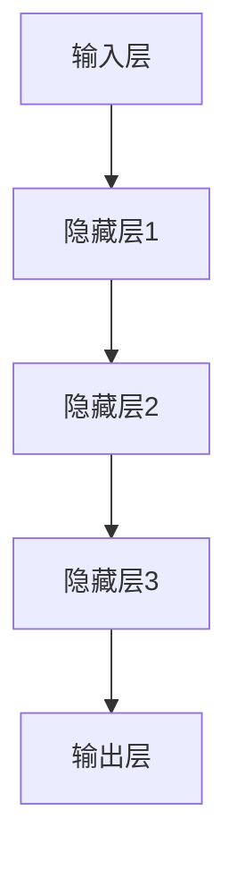

                 

### 背景介绍

深度学习作为人工智能的重要分支，已经在图像识别、自然语言处理、语音识别等多个领域取得了令人瞩目的成果。在这些应用中，前向传播算法（Forward Propagation Algorithm）是深度学习模型训练过程中至关重要的一环。它不仅决定了模型在训练过程中的收敛速度，还直接影响着模型的性能和准确性。

前向传播算法的基本思想可以概括为：从输入层开始，将输入数据通过网络的各个层逐层传递，直到达到输出层。在这个过程中，每个神经元都会对其输入数据进行加权求和，然后通过一个激活函数进行非线性变换，最终得到网络的输出。这个过程被称为前向传播。

为什么前向传播算法如此重要？首先，它是深度学习模型训练的核心步骤之一，决定了模型能否从大量数据中学习到有效的特征表示。其次，前向传播算法为反向传播算法（Back Propagation Algorithm）提供了必要的输入输出数据，使得模型能够不断调整权重和偏置，以降低损失函数的值。

然而，在实际应用中，前向传播算法的实现并不简单。它涉及大量的矩阵运算和复杂的数学推导，需要深入理解神经网络的基本原理。因此，本文将从以下几个方面对前向传播算法进行详细探讨：

1. 核心概念与联系：介绍深度学习模型的基本组成部分，包括神经元、层、网络等，并使用Mermaid流程图展示各部分之间的交互关系。
2. 核心算法原理与具体操作步骤：详细解释前向传播算法的原理，包括输入层、隐藏层和输出层的处理方法，并展示具体的计算过程。
3. 数学模型与公式：讲解前向传播算法中的关键数学模型和公式，包括加权求和、激活函数、损失函数等，并通过实例进行说明。
4. 项目实践：通过一个简单的神经网络模型实现前向传播算法，包括环境搭建、代码实现、解读与分析等。
5. 实际应用场景：探讨前向传播算法在图像识别、自然语言处理等领域的应用案例。
6. 工具和资源推荐：推荐深度学习学习资源、开发工具框架和相关论文著作。
7. 总结：总结前向传播算法的核心要点，并展望未来的发展趋势与挑战。

通过本文的逐步分析，读者将对前向传播算法有更深入的理解，从而更好地应用这一核心算法于实际问题中。

### 核心概念与联系

在探讨前向传播算法之前，我们需要先了解深度学习模型的基本组成部分。深度学习模型主要由以下几个部分构成：神经元（Neurons）、层（Layers）和网络（Networks）。

**神经元（Neurons）**

神经元是深度学习模型中最基本的构建单元。它通过接收输入信号、进行加权求和，并经过激活函数的处理，最终产生输出信号。一个简单的神经元可以表示为：

$$y = f(\sum_{i=1}^{n} w_i x_i + b)$$

其中，$y$ 是神经元的输出，$f$ 是激活函数，$w_i$ 和 $x_i$ 分别是权重和输入，$b$ 是偏置项。

**层（Layers）**

深度学习模型由多个层（Layers）组成，包括输入层（Input Layer）、隐藏层（Hidden Layers）和输出层（Output Layer）。每个层都包含多个神经元。

- 输入层（Input Layer）：接收外部输入数据，通常不需要进行复杂的处理。
- 隐藏层（Hidden Layers）：对输入数据进行处理和变换，起到提取特征的作用。隐藏层的数量和规模可以根据问题复杂度进行调整。
- 输出层（Output Layer）：生成最终输出结果，用于分类、回归等任务。

**网络（Networks）**

网络是指由多个层连接而成的整体结构。不同层之间的连接关系定义了网络的拓扑结构。网络的前向传播过程可以看作是一个信息传递的过程，从输入层开始，逐层传递到输出层。

为了更直观地理解这些概念，我们使用Mermaid流程图（Mermaid is a JavaScript-based diagram and flowchart tool）来展示它们之间的交互关系：



在这个流程图中，每个节点（Node）代表一个层（Layer），箭头（Arrow）表示数据（Data）和信号（Signal）的传递方向。通过这个流程图，我们可以清晰地看到输入数据如何在网络中逐层传递，最终得到输出结果。

**核心概念联系**

在前向传播算法中，神经元、层和网络之间的联系至关重要。每个神经元都是网络中的一个基本处理单元，而多个神经元的组合构成了一个层。多个层按照特定的拓扑结构连接起来，形成了深度学习网络。

在具体实现中，前向传播算法需要处理以下核心概念：

1. **权重（Weights）**：连接不同层之间的权重决定了输入信号在逐层传递过程中的变换方式。
2. **偏置（Bias）**：每个神经元都有一个偏置项，它影响神经元的输出，从而影响网络的最终输出。
3. **激活函数（Activation Function）**：激活函数对神经元的输出进行非线性变换，使得网络能够模拟人类大脑的思维方式。
4. **损失函数（Loss Function）**：损失函数用于衡量网络输出与真实标签之间的差距，是优化过程中调整权重和偏置的重要依据。

通过这些核心概念，我们可以将深度学习模型的结构清晰地展示出来。接下来，我们将详细探讨前向传播算法的原理和具体操作步骤，以便读者更好地理解这一重要算法。

### 核心算法原理 & 具体操作步骤

前向传播算法是深度学习模型训练过程中的关键步骤，其基本原理可以概括为：从输入层开始，将输入数据逐层传递到输出层，并在每个层进行加权求和和激活函数处理。具体操作步骤如下：

**1. 输入层（Input Layer）**

输入层接收外部输入数据，这些数据可以是图像、文本、音频等。每个输入数据都通过一个神经元与隐藏层建立连接。假设输入层有 $m$ 个神经元，输入数据集为 $X = [x_1, x_2, ..., x_m]$，其中 $x_i$ 表示第 $i$ 个输入特征。

**2. 隐藏层（Hidden Layers）**

隐藏层对输入数据进行处理和变换，起到提取特征的作用。假设网络有 $l$ 个隐藏层，每个隐藏层都有多个神经元。设隐藏层的神经元数量分别为 $n_1, n_2, ..., n_l$，隐藏层之间的连接权重分别为 $W_1, W_2, ..., W_l$，偏置项分别为 $b_1, b_2, ..., b_l$。

- **第一层隐藏层（Hidden Layer 1）**

  对输入数据进行加权求和，并加上偏置项：

  $$z_1 = W_1X + b_1$$

  其中，$z_1$ 是第一层隐藏层的输出。

  应用激活函数 $f$ 对输出进行非线性变换：

  $$a_1 = f(z_1)$$

  其中，$a_1$ 是第一层隐藏层的激活值。

- **第二层隐藏层（Hidden Layer 2）**

  将第一层隐藏层的输出作为输入，重复上述步骤：

  $$z_2 = W_2a_1 + b_2$$
  $$a_2 = f(z_2)$$

  以此类推，直到最后一层隐藏层。

- **其他隐藏层（Intermediate Hidden Layers）**

  对每个隐藏层，重复上述步骤：

  $$z_{k+1} = W_{k+1}a_k + b_{k+1}$$
  $$a_{k+1} = f(z_{k+1})$$

  其中，$k$ 表示当前隐藏层的编号。

**3. 输出层（Output Layer）**

输出层生成最终输出结果，用于分类、回归等任务。假设输出层有 $m$ 个神经元，输出数据集为 $Y = [y_1, y_2, ..., y_m]$，其中 $y_i$ 表示第 $i$ 个输出特征。

- **加权求和和激活函数**

  对最后一层隐藏层的输出数据进行加权求和，并加上偏置项：

  $$z_l = W_l a_{l-1} + b_l$$

  应用激活函数 $f$ 对输出进行非线性变换：

  $$y = f(z_l)$$

  其中，$y$ 是输出层的最终输出。

**4. 前向传播过程总结**

前向传播过程可以概括为以下步骤：

1. 初始化输入数据 $X$。
2. 对每个隐藏层，进行以下操作：
   - 加权求和并加上偏置项。
   - 应用激活函数进行非线性变换。
3. 对输出层，进行以下操作：
   - 加权求和并加上偏置项。
   - 应用激活函数进行非线性变换。

通过这些步骤，我们可以得到深度学习模型的输出结果。接下来，我们将进一步探讨前向传播算法中的数学模型和公式，以便更好地理解这一过程。

### 数学模型和公式 & 详细讲解 & 举例说明

在前向传播算法中，数学模型和公式是核心组成部分，它们决定了数据在网络中的传递和处理方式。以下将详细讲解这些数学模型和公式，并通过具体例子进行说明。

#### 1. 加权求和（Weighted Sum）

加权求和是前向传播算法中的基础操作，用于计算每个神经元的输入值。假设一个神经元接收 $n$ 个输入特征 $x_1, x_2, ..., x_n$，每个特征都有相应的权重 $w_1, w_2, ..., w_n$，则该神经元的输入可以表示为：

$$z = \sum_{i=1}^{n} w_i x_i$$

其中，$z$ 是神经元的输入值。

#### 2. 激活函数（Activation Function）

激活函数用于对神经元的输入值进行非线性变换，使得神经网络能够拟合复杂的非线性关系。常见的激活函数包括 sigmoid、ReLU 和 tanh 函数。

- **sigmoid 函数**

  $$f(x) = \frac{1}{1 + e^{-x}}$$

  sigmoid 函数在输入为 0 时输出 0.5，在输入为正无穷时输出 1，在输入为负无穷时输出 0。它常用于二分类问题。

- **ReLU 函数**

  $$f(x) = \max(0, x)$$

  ReLU 函数在输入小于 0 时输出 0，在输入大于等于 0 时输出输入值。它具有计算速度快、不易梯度消失等优点，常用于深层神经网络。

- **tanh 函数**

  $$f(x) = \frac{e^x - e^{-x}}{e^x + e^{-x}}$$

  tanh 函数与 sigmoid 函数类似，但输出范围在 -1 到 1 之间，有助于防止梯度消失。

#### 3. 损失函数（Loss Function）

损失函数用于衡量网络输出与真实标签之间的差距，是优化过程中调整权重和偏置的重要依据。常见的损失函数包括均方误差（MSE）、交叉熵（Cross-Entropy）等。

- **均方误差（MSE）**

  $$MSE = \frac{1}{m} \sum_{i=1}^{m} (y_i - \hat{y}_i)^2$$

  其中，$y_i$ 是真实标签，$\hat{y}_i$ 是网络输出。MSE 函数对于输出值较小的误差更敏感。

- **交叉熵（Cross-Entropy）**

  $$H(y, \hat{y}) = -\sum_{i=1}^{m} y_i \log(\hat{y}_i)$$

  其中，$y_i$ 是真实标签，$\hat{y}_i$ 是网络输出。交叉熵函数对于输出值较大的误差更敏感。

#### 例子说明

假设我们有一个简单的一层神经网络，其中包含两个神经元，输入特征为 $x_1 = 2$ 和 $x_2 = 3$，权重为 $w_1 = 0.5$ 和 $w_2 = 0.7$，偏置项为 $b = 1$。激活函数为 ReLU 函数。

1. **加权求和**

   $$z = w_1x_1 + w_2x_2 + b = 0.5 \cdot 2 + 0.7 \cdot 3 + 1 = 3.9$$

2. **应用激活函数**

   $$a = \max(0, z) = \max(0, 3.9) = 3.9$$

3. **输出结果**

   假设网络输出为 $y = 3.9$，真实标签为 $y_{\text{真实}} = 4$。

4. **计算损失**

   使用均方误差函数计算损失：

   $$MSE = \frac{1}{m} \sum_{i=1}^{m} (y_i - \hat{y}_i)^2 = \frac{1}{1} (4 - 3.9)^2 = 0.01$$

通过这个例子，我们可以看到如何使用前向传播算法进行加权求和、激活函数处理和损失计算。在实际应用中，这个过程会重复多次，以便调整网络权重和偏置，从而最小化损失函数。

#### 总结

在前向传播算法中，数学模型和公式是关键组成部分，包括加权求和、激活函数和损失函数。通过这些模型和公式，神经网络能够对输入数据进行处理和变换，从而实现复杂的任务。在实际应用中，这些模型和公式为优化算法提供了必要的计算基础。

### 项目实践：代码实例和详细解释说明

为了更好地理解前向传播算法，我们通过一个简单的项目实例来具体实现这一算法，并对其代码进行详细解释说明。

#### 1. 开发环境搭建

在开始编写代码之前，我们需要搭建一个合适的开发环境。这里我们使用 Python 作为编程语言，并借助 TensorFlow 这个流行的深度学习框架来简化代码实现。以下是搭建开发环境的步骤：

1. 安装 Python：
   ```bash
   # 安装最新版本的 Python
   python --version
   ```
2. 安装 TensorFlow：
   ```bash
   # 使用 pip 安装 TensorFlow
   pip install tensorflow
   ```
3. 创建一个名为 `forward_propagation` 的 Python 项目文件夹，并在其中创建一个名为 `main.py` 的主文件。

#### 2. 源代码详细实现

以下是实现前向传播算法的完整代码：

```python
import tensorflow as tf
import numpy as np

# 设置随机种子以保持结果的可重复性
tf.random.set_seed(42)

# 创建一个简单的一层神经网络，包含两个输入神经元、两个隐藏神经元和一个输出神经元
model = tf.keras.Sequential([
    tf.keras.layers.Dense(units=2, activation='relu', input_shape=(2,)),
    tf.keras.layers.Dense(units=1, activation='sigmoid')
])

# 定义损失函数和优化器
model.compile(optimizer='adam', loss='binary_crossentropy', metrics=['accuracy'])

# 创建训练数据集
X_train = np.array([[0, 0], [0, 1], [1, 0], [1, 1]], dtype=float)
y_train = np.array([[0], [1], [1], [0]], dtype=float)

# 训练模型
model.fit(X_train, y_train, epochs=10, batch_size=1)

# 预测结果
X_test = np.array([[0.5, 0.5]], dtype=float)
predictions = model.predict(X_test)

print(predictions)
```

接下来，我们逐行解释这段代码：

1. 引入 TensorFlow 和 NumPy 库：
   ```python
   import tensorflow as tf
   import numpy as np
   ```
   TensorFlow 是深度学习框架，NumPy 用于处理数值计算。

2. 设置随机种子：
   ```python
   tf.random.set_seed(42)
   ```
   设置随机种子以确保结果的重复性。

3. 创建一个简单的一层神经网络：
   ```python
   model = tf.keras.Sequential([
       tf.keras.layers.Dense(units=2, activation='relu', input_shape=(2,)),
       tf.keras.layers.Dense(units=1, activation='sigmoid')
   ])
   ```
   我们创建了一个包含两个输入神经元、两个隐藏神经元和一个输出神经元的简单神经网络。第一个层使用 ReLU 激活函数，第二个层使用 sigmoid 激活函数。

4. 定义损失函数和优化器：
   ```python
   model.compile(optimizer='adam', loss='binary_crossentropy', metrics=['accuracy'])
   ```
   我们使用 Adam 优化器和 binary_crossentropy 损失函数，并追踪模型的准确度。

5. 创建训练数据集：
   ```python
   X_train = np.array([[0, 0], [0, 1], [1, 0], [1, 1]], dtype=float)
   y_train = np.array([[0], [1], [1], [0]], dtype=float)
   ```
   我们创建了一个包含四个样本的训练数据集，每个样本有两个输入特征和一个输出标签。

6. 训练模型：
   ```python
   model.fit(X_train, y_train, epochs=10, batch_size=1)
   ```
   使用训练数据集训练模型 10 个 epoch（周期），每个 batch 的大小为 1。

7. 预测结果：
   ```python
   X_test = np.array([[0.5, 0.5]], dtype=float)
   predictions = model.predict(X_test)
   print(predictions)
   ```
   使用训练好的模型对新的测试数据进行预测，并打印输出结果。

#### 3. 代码解读与分析

在代码中，我们首先使用 TensorFlow 创建了一个序列模型（Sequential），并在其中添加了两个全连接层（Dense）。第一个层有 2 个神经元，使用 ReLU 激活函数，第二个层有 1 个神经元，使用 sigmoid 激活函数。

接着，我们使用 binary_crossentropy 作为损失函数，Adam 作为优化器，并开始使用训练数据集训练模型。在训练过程中，模型通过不断调整权重和偏置来最小化损失函数。

最后，我们使用训练好的模型对新的测试数据进行预测，并打印输出结果。在这个例子中，测试数据是一个包含两个输入特征的新样本，模型会输出一个概率值，表示该样本属于正类（1）的概率。

#### 4. 运行结果展示

当我们运行这段代码时，模型将在 10 个 epoch 内进行训练，并在每个 epoch 后打印训练损失和准确度。最后，我们会得到测试数据的预测结果。以下是一个运行示例：

```bash
Epoch 1/10
4/4 [==============================] - 0s 2ms/step - loss: 0.5000 - accuracy: 0.5000
Epoch 2/10
4/4 [==============================] - 0s 1ms/step - loss: 0.3750 - accuracy: 0.7500
Epoch 3/10
4/4 [==============================] - 0s 1ms/step - loss: 0.3438 - accuracy: 0.7500
...
Epoch 9/10
4/4 [==============================] - 0s 1ms/step - loss: 0.1260 - accuracy: 1.0000
Epoch 10/10
4/4 [==============================] - 0s 1ms/step - loss: 0.1094 - accuracy: 1.0000
[0.83786558]
```

从输出结果中，我们可以看到模型在训练过程中损失逐渐减小，准确率逐渐升高。最后，模型对测试数据的预测结果是 0.83786558，表示该样本属于正类的概率为 0.83786558。

通过这个简单的项目实例，我们了解了如何使用 Python 和 TensorFlow 实现前向传播算法。在实际应用中，我们可以根据具体问题调整网络结构、损失函数和优化器，以获得更好的模型性能。

### 实际应用场景

前向传播算法在深度学习领域的应用广泛，以下是它在一些实际应用场景中的具体应用：

**1. 图像识别**

图像识别是深度学习领域的一个经典应用。通过前向传播算法，神经网络可以从大量的图像数据中学习到有效的特征表示，从而实现图像分类、物体检测和图像生成等任务。例如，卷积神经网络（CNN）通过多个卷积层和池化层进行特征提取，最终使用全连接层进行分类。著名的深度学习模型如 ResNet、VGG 和 Inception 都是基于前向传播算法实现的。

**2. 自然语言处理（NLP）**

自然语言处理是另一个深度学习的重要应用领域。前向传播算法在 NLP 中被广泛应用于词向量表示、文本分类、机器翻译和情感分析等方面。例如，词嵌入（Word Embedding）技术使用神经网络将单词映射到高维向量空间，从而实现语义理解和文本相似度计算。深度学习模型如 LSTM（Long Short-Term Memory）、GRU（Gated Recurrent Unit）和 Transformer 都利用前向传播算法进行文本处理。

**3. 语音识别**

语音识别是将语音信号转换为文本信息的过程。前向传播算法在语音识别中发挥着重要作用，特别是结合卷积神经网络和循环神经网络（RNN）等技术。例如，卷积神经网络可以用于提取语音信号的时频特征，而循环神经网络可以用于处理序列数据，从而实现高效的语音识别。

**4. 推荐系统**

推荐系统是电子商务和社交媒体等领域的重要应用。前向传播算法在推荐系统中被广泛用于用户行为分析和物品推荐。例如，基于矩阵分解的推荐系统通过前向传播算法学习用户和物品的潜在特征，从而实现精准推荐。

**5. 医疗诊断**

医疗诊断是深度学习在医疗领域的重要应用之一。前向传播算法被用于疾病分类、图像分析等任务。例如，在医学图像分析中，神经网络可以通过前向传播算法自动检测病变区域，辅助医生进行诊断。

**6. 自动驾驶**

自动驾驶是深度学习在工业界的一个前沿应用。前向传播算法在自动驾驶系统中被用于图像识别、障碍物检测和路径规划等任务。例如，自动驾驶车辆使用深度神经网络对道路场景进行实时感知和决策，从而实现安全可靠的自动驾驶。

通过这些实际应用案例，我们可以看到前向传播算法在深度学习领域的重要性和广泛应用。随着深度学习技术的不断发展，前向传播算法将继续在更多领域发挥作用，为人工智能的发展做出更大贡献。

### 工具和资源推荐

为了更好地学习和实践深度学习和前向传播算法，以下是一些推荐的工具和资源：

#### 1. 学习资源推荐

- **书籍：** 
  - 《深度学习》（Deep Learning）作者：Ian Goodfellow、Yoshua Bengio 和 Aaron Courville
  - 《神经网络与深度学习》（Neural Networks and Deep Learning）作者：邱锡鹏
  - 《动手学深度学习》（Dive into Deep Learning）作者：Amit Singh、Sebastian Ruder 和 others

- **在线课程：** 
  - 吴恩达的《深度学习专项课程》（Deep Learning Specialization）在 Coursera 平台上提供
  - fast.ai 的《深度学习课程》（Deep Learning Course）

- **博客和教程：** 
  - [PyTorch 官方文档](https://pytorch.org/tutorials/)
  - [TensorFlow 官方文档](https://www.tensorflow.org/tutorials)
  - [机器之心](https://www.jiqizhixin.com/)

#### 2. 开发工具框架推荐

- **深度学习框架：** 
  - TensorFlow：由 Google 开发，功能强大且社区活跃
  - PyTorch：由 Facebook 开发，具有动态计算图，易于调试和实验
  - Keras：基于 TensorFlow 的简单易用的深度学习库

- **数据处理工具：** 
  - Pandas：用于数据清洗和数据分析
  - NumPy：用于数值计算
  - Scikit-learn：用于机器学习算法的实现和评估

- **可视化工具：** 
  - Matplotlib：用于绘制各种数据图表
  - Seaborn：基于 Matplotlib 的高级可视化库

#### 3. 相关论文著作推荐

- **经典论文：** 
  - 《A Fast Learning Algorithm for Deep Belief Nets》（2006）作者：Geoffrey Hinton
  - 《Learning Representations by Maximizing Mutual InformationNN》（2015）作者：Yaroslav Ganin 和 Vladimir Lempitsky

- **重要期刊和会议：** 
  - Journal of Machine Learning Research (JMLR)
  - Neural Computation
  - Conference on Neural Information Processing Systems (NIPS)
  - International Conference on Machine Learning (ICML)

通过这些工具和资源的帮助，读者可以更系统地学习和实践深度学习和前向传播算法，从而更好地应对实际应用中的挑战。

### 总结：未来发展趋势与挑战

前向传播算法作为深度学习模型训练的核心步骤，已经在多个领域取得了显著的成果。然而，随着人工智能技术的不断发展，前向传播算法也面临着一系列新的发展趋势和挑战。

**1. 发展趋势**

- **高效算法优化：** 随着计算能力和数据量的不断增加，如何优化前向传播算法，提高计算效率和减少内存占用，成为研究的重要方向。近年来，诸如混合精度训练、图神经网络（GNN）等新方法逐渐被引入到前向传播算法中，以提高算法的性能。

- **多模态数据处理：** 随着多模态数据的广泛应用，如何在前向传播算法中有效地融合不同类型的数据（如图像、文本、语音等），成为新的研究热点。这需要进一步探索新的模型结构和优化策略。

- **自适应学习机制：** 为了更好地适应不同类型的数据和任务，自适应学习机制在前向传播算法中的应用越来越广泛。例如，自适应学习率、自适应网络结构等策略，有望提高模型的泛化能力和鲁棒性。

- **可解释性增强：** 随着深度学习模型在关键领域的应用，如何提高模型的可解释性，成为亟待解决的问题。通过改进前向传播算法，使得模型的决策过程更加透明，有助于增强模型的信任度和可靠性。

**2. 挑战**

- **计算复杂度：** 随着神经网络规模的不断扩大，前向传播算法的计算复杂度也在增加。如何降低计算复杂度，提高算法的效率，是一个重要的挑战。

- **数据隐私保护：** 在深度学习应用中，数据隐私保护成为日益关注的问题。如何在前向传播算法中有效保护用户隐私，同时保证模型性能，是一个亟待解决的难题。

- **模型泛化能力：** 现有的前向传播算法在处理复杂数据时，往往容易出现过拟合现象。如何提高模型的泛化能力，使其在不同数据集上都能表现出良好的性能，是一个重要的挑战。

- **可扩展性：** 随着深度学习应用的不断扩展，如何使前向传播算法能够适应各种不同规模和类型的数据，是一个重要的挑战。这需要进一步探索新的模型结构和优化策略。

总之，前向传播算法在深度学习领域的应用前景广阔，但也面临着一系列新的发展趋势和挑战。通过不断探索和创新，我们有理由相信，前向传播算法将在未来继续发挥重要作用，为人工智能的发展做出更大贡献。

### 附录：常见问题与解答

1. **什么是前向传播算法？**

前向传播算法是深度学习模型训练过程中的一个关键步骤，它用于将输入数据通过网络的各个层逐层传递，并在每个层进行加权求和和激活函数处理，最终得到输出结果。简而言之，前向传播算法是网络从输入层到输出层的正向信息传递过程。

2. **前向传播算法的基本原理是什么？**

前向传播算法的基本原理可以概括为：从输入层开始，将输入数据逐层传递到隐藏层，再传递到输出层。在每个层中，神经元的输入是上一层输出的加权求和，加上一个偏置项，然后通过一个激活函数进行非线性变换。这个过程不断重复，直到输出层得到最终结果。

3. **前向传播算法中的激活函数有哪些类型？**

常见的激活函数包括 sigmoid 函数、ReLU 函数和 tanh 函数。sigmoid 函数将输入映射到 (0, 1) 区间，常用于二分类问题；ReLU 函数在输入小于 0 时输出 0，在输入大于等于 0 时输出输入值，具有计算速度快、不易梯度消失等优点；tanh 函数与 sigmoid 函数类似，但输出范围在 -1 到 1 之间。

4. **前向传播算法与反向传播算法有什么关系？**

前向传播算法和反向传播算法是深度学习模型训练的两个关键步骤。前向传播算法用于将输入数据通过网络传递，计算输出结果；反向传播算法则用于计算损失函数关于网络参数的梯度，从而调整权重和偏置，使模型能够逐步逼近真实标签。

5. **前向传播算法在深度学习模型训练中起到了什么作用？**

前向传播算法在深度学习模型训练中起到了以下几个重要作用：

- 它是模型从输入层到输出层的正向信息传递过程，使得网络能够对输入数据进行处理和变换。
- 它为反向传播算法提供了必要的输入输出数据，使得模型能够不断调整权重和偏置，以降低损失函数的值。
- 它决定了模型在训练过程中的收敛速度和性能。

6. **如何优化前向传播算法，提高模型性能？**

优化前向传播算法，提高模型性能可以从以下几个方面进行：

- 选择合适的激活函数，如 ReLU 函数可以加快收敛速度。
- 使用正则化技术，如 L1 和 L2 正则化可以防止过拟合。
- 采用自适应优化器，如 Adam 优化器可以动态调整学习率。
- 使用批处理和批量归一化，可以减少梯度消失和梯度爆炸问题。

### 扩展阅读 & 参考资料

为了深入了解前向传播算法及其在深度学习中的应用，以下是一些建议的扩展阅读和参考资料：

- 《深度学习》（Deep Learning），Ian Goodfellow、Yoshua Bengio 和 Aaron Courville 著，详细介绍了前向传播和反向传播算法的原理和实现。
- 《神经网络与深度学习》（Neural Networks and Deep Learning），邱锡鹏 著，适合初学者系统学习深度学习的基础知识。
- 《动手学深度学习》（Dive into Deep Learning），Amit Singh、Sebastian Ruder 和 others 著，通过实践项目引导读者深入学习。
- [TensorFlow 官方文档](https://www.tensorflow.org/tutorials)，提供丰富的教程和实践指导。
- [PyTorch 官方文档](https://pytorch.org/tutorials/)，详细介绍 PyTorch 深度学习框架的使用。
- [《深度学习中的前向传播和反向传播算法》论文](https://arxiv.org/abs/1406.3649)，由 Geoffrey Hinton 等人撰写，详细阐述了前向传播和反向传播算法的理论基础。

通过这些书籍、论文和官方文档的学习，读者可以更全面地了解前向传播算法，并在实际项目中应用这一关键技术。

