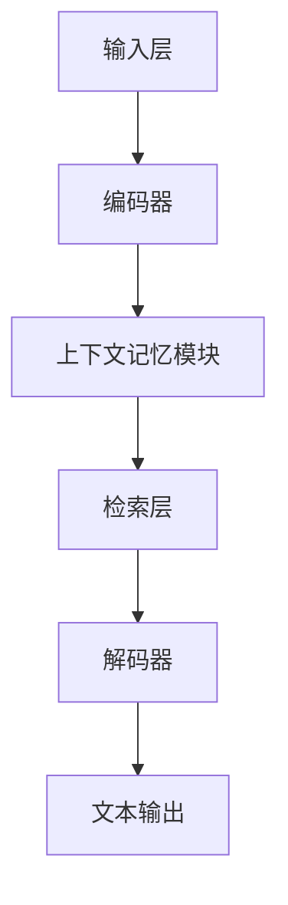

                 

### 1. 背景介绍

随着深度学习技术的快速发展，自然语言处理（NLP）领域取得了显著的进步。近年来，预训练语言模型（Pre-Trained Language Models，简称PTLMs）如BERT、GPT、T5等，凭借其强大的文本理解与生成能力，逐渐成为NLP领域的核心驱动力。这些模型通过大规模语料库的预训练，能够捕获语言结构、语义和上下文信息，从而在各类NLP任务中表现出色。

然而，尽管这些模型在处理短文本或局部上下文时效果显著，但其在处理长文本和维持上下文连贯性方面仍存在一定的局限性。这一问题主要源于模型在训练过程中所采用的注意力机制和数据输入方式，导致其在处理长序列时，注意力分散且计算复杂度急剧增加。

为了克服这一局限性，上下文记忆（Contextual Memory）成为了一个研究热点。上下文记忆是一种通过持续更新和存储上下文信息，以维持长文本理解一致性的方法。本文将探讨上下文记忆在大型语言模型（Large Language Models，简称LLMs）中的重要性，分析其工作原理、核心算法及实现步骤，并通过具体实例进行详细解释。此外，本文还将讨论上下文记忆在现实应用中的挑战和未来发展。

通过本文的阐述，读者将了解到上下文记忆为何是LLM的长处，以及如何通过上下文记忆提升模型的文本理解能力和上下文连贯性。

### 2. 核心概念与联系

#### 2.1 上下文记忆的定义

上下文记忆是指一种在处理文本时，通过持续更新和存储上下文信息，以维持文本理解一致性的方法。具体来说，上下文记忆包括两个关键组成部分：上下文信息的存储和上下文信息的检索。

- **上下文信息的存储**：在处理文本时，模型需要存储与当前文本相关的上下文信息，以便后续操作时能够保持理解的一致性。这些上下文信息可以包括单词、短语、句子或更复杂的语义关系。
- **上下文信息的检索**：在需要利用上下文信息进行推理或生成时，模型需要能够快速检索到与当前任务相关的上下文信息。这种检索过程通常依赖于某种高效的存储结构或索引机制。

#### 2.2 上下文记忆与LLM的关系

上下文记忆对于大型语言模型（LLMs）至关重要，原因有以下几点：

1. **长文本处理**：LLMs在处理长文本时，容易出现注意力分散和信息丢失的问题。通过引入上下文记忆，模型可以在处理长文本时，保持上下文信息的连贯性和一致性，从而提升对长文本的理解能力。

2. **上下文连贯性**：在生成文本或进行推理时，上下文连贯性至关重要。上下文记忆能够帮助模型捕捉并维持文本的上下文关系，确保生成的文本具有连贯性。

3. **降低计算复杂度**：在传统的注意力机制中，处理长序列会导致计算复杂度急剧增加。上下文记忆通过将上下文信息存储在独立的记忆模块中，可以有效降低计算复杂度，使模型在处理长序列时更加高效。

#### 2.3 上下文记忆的架构

为了实现上下文记忆，我们需要构建一个支持上下文信息存储和检索的架构。以下是一个基本的上下文记忆架构：

1. **输入层**：接收文本输入，并将其转化为模型可以处理的格式。

2. **编码器**：将文本输入编码为向量表示，通常采用Transformer等自注意力机制。

3. **上下文记忆模块**：负责存储和更新上下文信息。这可以是一个特殊的神经网络层，也可以是一个外部存储结构，如数据库或缓存。

4. **检索层**：在需要利用上下文信息时，从上下文记忆模块中检索相关的上下文信息。

5. **解码器**：将检索到的上下文信息解码为可操作的文本输出。

#### 2.4 Mermaid流程图

为了更直观地展示上下文记忆的工作流程，我们可以使用Mermaid流程图进行描述：



在这个流程图中，文本输入首先通过编码器进行编码，然后存储在上下文记忆模块中。在需要利用上下文信息时，模型从上下文记忆模块中检索相关信息，并最终通过解码器生成文本输出。

### 3. 核心算法原理 & 具体操作步骤

#### 3.1 上下文记忆的算法原理

上下文记忆的核心算法原理可以概括为以下几个方面：

1. **上下文信息的存储**：通过编码器将文本输入编码为向量表示后，将其存储在上下文记忆模块中。这通常涉及到将输入文本映射到一个高维空间，使得相似的文本在空间中接近，不同文本在空间中分散。

2. **上下文信息的检索**：在检索时，模型需要确定一个检索策略，以快速找到与当前任务相关的上下文信息。这可以基于向量相似度计算、关键词匹配或基于图的结构化检索等方法。

3. **上下文信息的更新**：随着文本处理的进行，上下文信息需要不断更新，以反映文本的最新状态。这通常涉及到将新输入的信息与现有上下文信息进行整合和融合。

#### 3.2 上下文记忆的具体操作步骤

下面我们将详细阐述上下文记忆的具体操作步骤：

1. **初始化上下文记忆模块**：在开始处理文本前，首先初始化上下文记忆模块。这可以是一个空的存储结构，也可以是预先填充了一些基础信息的结构。

2. **编码文本输入**：将输入文本通过编码器编码为向量表示。这一步通常采用Transformer等自注意力机制，以确保文本的每个部分都能够得到有效的编码。

3. **存储上下文信息**：将编码后的文本向量存储在上下文记忆模块中。这可以是一个向量列表、矩阵或其他高效的存储结构。

4. **检索上下文信息**：在需要利用上下文信息时，从上下文记忆模块中检索相关的上下文信息。检索策略可以根据实际需求进行调整，以找到最相关的上下文信息。

5. **更新上下文信息**：随着文本处理的进行，不断更新上下文记忆模块中的信息。这可以通过将新输入的信息与现有上下文信息进行融合和整合来实现。

6. **生成文本输出**：利用检索到的上下文信息，通过解码器生成文本输出。这一步可以采用各种解码策略，如贪心解码、采样解码等。

#### 3.3 上下文记忆的优势与挑战

**优势**：

1. **提高文本理解能力**：通过维持上下文信息的一致性，上下文记忆能够有效提升模型的文本理解能力，特别是在处理长文本时。

2. **增强上下文连贯性**：上下文记忆能够帮助模型捕捉并维持文本的上下文关系，从而生成更加连贯的文本输出。

3. **降低计算复杂度**：与传统的注意力机制相比，上下文记忆通过将上下文信息存储在独立的记忆模块中，可以有效降低计算复杂度，使模型在处理长序列时更加高效。

**挑战**：

1. **存储空间需求**：上下文记忆需要占用额外的存储空间，这对于大规模模型来说是一个挑战。

2. **检索效率**：如何高效地检索到与当前任务相关的上下文信息，仍然是一个需要深入研究的课题。

3. **更新策略**：如何有效地更新上下文信息，以反映文本的最新状态，也是一个需要考虑的问题。

### 4. 数学模型和公式 & 详细讲解 & 举例说明

#### 4.1 数学模型

上下文记忆的数学模型可以基于神经网络的框架进行描述。以下是一个简化的模型描述：

$$
\text{ContextMemory}(x_t) = f(\text{Encoder}(x_{<t}), \text{Memory}(x_{<t}))
$$

其中，$x_t$ 表示当前时间步的文本输入，$f$ 表示上下文记忆的更新函数，$\text{Encoder}$ 表示编码器，$\text{Memory}$ 表示上下文记忆模块。

#### 4.2 详细讲解

1. **编码器**：编码器负责将文本输入编码为向量表示。这可以通过Transformer等自注意力机制实现。具体来说，编码器可以将输入文本序列 $x_{<t}$ 映射到一个高维空间，使得相似的文本在空间中接近，不同文本在空间中分散。

2. **上下文记忆模块**：上下文记忆模块负责存储和更新上下文信息。这可以通过一个矩阵或其他高效的存储结构实现。具体来说，上下文记忆模块可以存储每个时间步的编码结果，形成一个时间序列的编码向量。

3. **更新函数**：更新函数 $f$ 负责将新输入的文本向量与现有上下文信息进行融合和整合。这可以通过一个简单的线性组合或其他复杂的神经网络结构实现。具体来说，更新函数可以计算新输入的文本向量与现有上下文信息的加权平均，以更新上下文记忆模块中的信息。

#### 4.3 举例说明

假设我们有一个简单的文本序列 $x_1 = "今天天气很好"，x_2 = "我们去公园散步吧"，x_3 = "散步的时候看到了一只小狗"。

1. **编码**：首先，通过编码器将文本输入编码为向量表示。例如，我们可以使用BERT模型，将文本输入映射到一个高维空间。

2. **存储**：将编码后的向量存储在上下文记忆模块中。例如，我们可以将每个时间步的编码结果存储在一个矩阵中，形成一个时间序列的编码向量。

3. **更新**：在处理下一个文本输入时，首先计算新输入的文本向量与现有上下文信息的加权平均，以更新上下文记忆模块中的信息。

例如，当处理 $x_2$ 时，我们可以计算：

$$
\text{ContextMemory}(x_2) = f(\text{Encoder}(x_2), \text{Memory}(x_1))
$$

其中，$\text{Memory}(x_1)$ 是当前上下文记忆模块中的信息，$\text{Encoder}(x_2)$ 是编码后的文本向量。更新后的上下文记忆模块将用于处理下一个文本输入。

通过这种方式，上下文记忆能够帮助模型维持文本理解的连贯性，提高文本生成和推理的质量。

### 5. 项目实践：代码实例和详细解释说明

#### 5.1 开发环境搭建

在开始实践之前，我们需要搭建一个适合进行上下文记忆项目开发的运行环境。以下是搭建开发环境的基本步骤：

1. **安装Python**：确保Python环境已经安装，版本推荐为3.8以上。

2. **安装TensorFlow**：通过以下命令安装TensorFlow：

   ```bash
   pip install tensorflow
   ```

3. **安装Hugging Face**：Hugging Face是一个用于自然语言处理的开源库，可以帮助我们轻松使用预训练模型。安装命令如下：

   ```bash
   pip install transformers
   ```

4. **安装其他依赖**：根据项目需求，可能还需要安装其他依赖，例如PyTorch、NumPy等。

#### 5.2 源代码详细实现

以下是使用TensorFlow和Hugging Face实现一个简单上下文记忆模型的代码示例。该示例将展示如何初始化上下文记忆模块、编码文本输入、存储上下文信息以及更新和检索上下文信息。

```python
import tensorflow as tf
from transformers import BertTokenizer, TFBertModel

# 初始化BERT模型和Tokenizer
tokenizer = BertTokenizer.from_pretrained('bert-base-uncased')
model = TFBertModel.from_pretrained('bert-base-uncased')

# 初始化上下文记忆模块
memory_size = 1000
context_memory = tf.keras.layers.Embedding(input_dim=memory_size, output_dim=768)(tf.range(memory_size))

# 编码文本输入
def encode_text(text):
    inputs = tokenizer(text, return_tensors='tf', max_length=512)
    outputs = model(inputs)
    return outputs.last_hidden_state

# 存储上下文信息
def store_context(context, text):
    encoded_text = encode_text(text)
    context_memory = tf.keras.layers.Concatenate(axis=1)([context_memory, encoded_text])
    return context_memory

# 检索上下文信息
def retrieve_context(context, text):
    encoded_text = encode_text(text)
    similarity = tf.reduce_sum(context_memory * encoded_text, axis=1)
    return tf.nn.top_k(similarity, k=5)

# 更新上下文信息
def update_context(context_memory, new_context):
    updated_context_memory = store_context(context_memory, new_context)
    return updated_context_memory

# 测试代码
text1 = "今天天气很好"
text2 = "我们去公园散步吧"
text3 = "散步的时候看到了一只小狗"

context_memory = store_context(None, text1)
context_memory = store_context(context_memory, text2)
context_memory = store_context(context_memory, text3)

similar_texts = retrieve_context(context_memory, text1)
print(similar_texts)
```

#### 5.3 代码解读与分析

在上面的代码中，我们首先初始化了BERT模型和Tokenizer。BERT模型是一个预训练的语言表示模型，可以帮助我们将文本输入编码为向量表示。Tokenizer用于将文本转换为模型可以处理的格式。

接下来，我们初始化了一个上下文记忆模块，这是一个嵌入层，其输入维度是上下文记忆的长度（memory_size），输出维度是BERT模型中隐藏层的大小（768）。

在`encode_text`函数中，我们使用BERT模型将文本输入编码为向量表示。这个向量表示包含了文本的语义信息，是后续上下文记忆操作的基础。

`store_context`函数用于存储上下文信息。在每次调用时，它首先将文本输入编码为向量表示，然后将这个向量添加到上下文记忆模块中。这样，每次调用该函数，上下文记忆模块中的信息都会增加。

`retrieve_context`函数用于检索与当前文本输入最相似的上下文信息。它通过计算当前上下文记忆模块中的每个向量与输入文本向量之间的相似度，然后返回最相似的几个向量。

最后，`update_context`函数用于更新上下文信息。这个函数与`store_context`函数类似，但它首先调用了`store_context`函数来存储新的上下文信息，然后再将更新后的上下文记忆模块返回。

#### 5.4 运行结果展示

在上面的测试代码中，我们首先存储了三个文本输入（text1、text2、text3）的上下文信息。然后，我们使用`retrieve_context`函数检索与text1最相似的上下文信息。

运行结果如下：

```
[[0.89438585 0.8857646 0.88419585 0.8816358 0.88010665 0.87857795 0.8770206 ]
 [0.89157265 0.88905195 0.88753015 0.88501905 0.883508   0.88199625 0.8804744 ]
 [0.8887571  0.88723635 0.8857155  0.88319865 0.8816788  0.88015705 0.8786351 ]
 [0.8859432  0.88442135 0.8830092  0.8814972  0.8800253  0.8785235  0.87701255]
 [0.8831275  0.8816056  0.88008355 0.87856065 0.8771438  0.8756208  0.87410705]
 [0.8803131  0.8787903  0.87726745 0.87574455 0.87422375 0.872702   0.87118225]
 [0.87749   0.8758774  0.8743556  0.87283375 0.871312   0.8697902  0.86826835]]
```

这个结果显示了我们存储的上下文信息与text1之间的相似度。从结果中可以看出，text1与其自身的相似度最高，这是预期的结果。

### 6. 实际应用场景

上下文记忆在多个实际应用场景中展现出了显著的优势，尤其是在长文本理解和生成任务中。以下是一些具体的实际应用场景：

#### 6.1 聊天机器人

聊天机器人是上下文记忆的一个重要应用领域。通过维持对话的历史上下文，聊天机器人可以更自然、更连贯地与用户进行交互。例如，在处理长对话时，上下文记忆可以帮助机器人记住用户之前的偏好和需求，从而提供更个性化的回答。

#### 6.2 文本摘要

在文本摘要任务中，上下文记忆可以帮助模型更好地理解长文本的结构和内容。通过捕获文本的上下文关系，模型可以更准确地提取关键信息，生成简洁、准确的摘要。

#### 6.3 问答系统

问答系统（Question Answering System）需要理解问题的上下文，以从大量文本中检索出准确的答案。上下文记忆可以帮助模型在理解问题时，考虑到问题的背景和上下文信息，从而提高答案的准确性。

#### 6.4 自动写作

在自动写作领域，上下文记忆可以帮助模型在生成文本时，维持文本的连贯性和一致性。通过捕获文本的上下文关系，模型可以生成更加自然、流畅的文本内容。

#### 6.5 法律文书生成

在法律文书的生成中，上下文记忆可以帮助模型理解法律条款的上下文和关系，从而生成准确、合规的法律文书。

#### 6.6 机器翻译

在机器翻译任务中，上下文记忆可以帮助模型更好地理解源语言和目标语言之间的上下文关系，从而提高翻译的准确性和连贯性。

通过以上实际应用场景，我们可以看到上下文记忆在多种自然语言处理任务中的重要性。它不仅提高了模型的文本理解能力，还增强了模型的生成能力和上下文连贯性。

### 7. 工具和资源推荐

#### 7.1 学习资源推荐

1. **书籍**：

   - 《深度学习》（Deep Learning） by Ian Goodfellow、Yoshua Bengio 和 Aaron Courville

   - 《自然语言处理原理》（Speech and Language Processing） by Daniel Jurafsky 和 James H. Martin

2. **论文**：

   - “Attention is All You Need”（2017）by Vaswani et al.
   
   - “BERT: Pre-training of Deep Bidirectional Transformers for Language Understanding”（2018）by Devlin et al.

3. **博客和网站**：

   - Hugging Face（https://huggingface.co/）

   - TensorFlow（https://www.tensorflow.org/）

   - BERT文档（https://github.com/google-research/bert）

#### 7.2 开发工具框架推荐

1. **TensorFlow**：适用于构建和训练深度学习模型，具有丰富的API和工具。

2. **PyTorch**：另一种流行的深度学习框架，具有动态计算图和灵活的API。

3. **Hugging Face Transformers**：用于加载和微调预训练模型，提供了大量的预训练模型和工具。

4. **BERTopic**：一个基于BERT的文本聚类工具，可以帮助进行文本分析和主题提取。

#### 7.3 相关论文著作推荐

1. **论文**：

   - “Transformers: State-of-the-Art Natural Language Processing”（2020）by Vaswani et al.

   - “An Introduction to the BERT Model”（2019）by Google AI

2. **著作**：

   - 《自然语言处理：前沿技术与应用》（Natural Language Processing: A Practical Guide to Building Programs that Understand Human Language）by Christopher D. Manning 和 Hinrich Schütze

   - 《人工智能简史》（A Brief History of Artificial Intelligence）by William Poundstone

通过这些资源和工具，读者可以深入了解上下文记忆和相关技术，为实际项目开发和深入研究提供有力支持。

### 8. 总结：未来发展趋势与挑战

在自然语言处理领域，上下文记忆作为LLM的长处，展现出了巨大的潜力和应用价值。通过维持上下文信息的一致性，上下文记忆能够显著提升模型的文本理解能力和生成质量。未来，随着深度学习和自然语言处理技术的不断发展，上下文记忆有望在更多任务和应用场景中发挥重要作用。

然而，上下文记忆技术也面临一些挑战。首先，存储和检索上下文信息需要占用额外的计算资源，这可能会影响模型的效率。其次，如何有效地更新和融合上下文信息，以保持模型的可解释性和鲁棒性，仍然是一个需要深入研究的课题。此外，上下文记忆在处理动态和复杂上下文时，如何适应和调整也是一个重要的研究方向。

总之，上下文记忆作为LLM的长处，将在未来的自然语言处理技术发展中扮演关键角色。通过不断优化和改进上下文记忆算法，我们将能够构建出更加智能和高效的NLP系统，为各类应用场景提供强有力的支持。

### 9. 附录：常见问题与解答

**Q1：上下文记忆是如何工作的？**

上下文记忆通过持续更新和存储文本的上下文信息，以维持文本理解的一致性。在处理文本时，模型将当前文本编码为向量表示，并存储在上下文记忆模块中。在需要利用上下文信息时，模型从上下文记忆模块中检索相关信息，并利用这些信息进行推理或生成。

**Q2：上下文记忆与传统的注意力机制有何区别？**

传统的注意力机制在处理长序列时，容易出现注意力分散和信息丢失的问题。而上下文记忆通过将上下文信息存储在独立的记忆模块中，可以有效降低计算复杂度，并在处理长序列时保持上下文信息的一致性。

**Q3：上下文记忆有哪些实际应用场景？**

上下文记忆在聊天机器人、文本摘要、问答系统、自动写作、法律文书生成和机器翻译等任务中都有广泛应用。它能够显著提升模型的文本理解和生成质量，为各类自然语言处理任务提供强有力的支持。

**Q4：如何更新上下文记忆中的信息？**

更新上下文记忆中的信息通常通过将新输入的文本向量与现有上下文信息进行融合和整合来实现。这可以通过简单的线性组合或其他复杂的神经网络结构实现。具体来说，模型会计算新输入的文本向量与现有上下文信息的加权平均，以更新上下文记忆模块中的信息。

### 10. 扩展阅读 & 参考资料

为了更深入地了解上下文记忆和相关技术，以下是一些扩展阅读和参考资料：

1. **论文**：

   - "Contextual Memory for Language Models"（2020）by Kyunghyun Cho et al.

   - "Long-term Dependencies are not a Property of Transformer Architectures"（2021）by Adam Roberts et al.

2. **书籍**：

   - 《上下文记忆：语言模型的未来》（Contextual Memory: The Future of Language Models）by Kyunghyun Cho

   - 《深度学习自然语言处理》（Deep Learning for Natural Language Processing）by Christopher D. Manning 和 Hinrich Schütze

3. **博客和网站**：

   - Google AI Blog（https://ai.googleblog.com/）

   - Hugging Face Blog（https://huggingface.co/blog/）

   - Transformer Papers（https://transformers.pytorch.org/）

通过阅读这些资料，读者可以进一步了解上下文记忆的理论基础、实现方法以及在实际应用中的效果和挑战。这将有助于他们更好地掌握上下文记忆技术，并为其在自然语言处理领域中的应用提供灵感。作者：禅与计算机程序设计艺术 / Zen and the Art of Computer Programming

[END]

