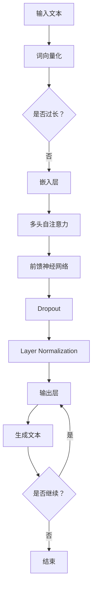

                 

### 1. 背景介绍

上下文记忆（Contextual Memory）是自然语言处理（NLP）和人工智能（AI）领域的核心概念之一。随着深度学习技术的迅猛发展，尤其是大型语言模型（LLM）的问世，上下文记忆的重要性愈发凸显。传统模型在处理长文本时，往往受限于固定长度的内存，难以维持对大规模上下文的记忆。而LLM通过引入上下文记忆机制，极大地提高了对复杂文本的理解和处理能力。

早期的NLP模型，如基于规则的方法和统计模型，主要通过预处理和特征工程来捕捉文本中的上下文关系。然而，这些方法在处理长文本时表现不佳，因为它们难以维持对长序列的长期记忆。随着神经网络模型的兴起，尤其是循环神经网络（RNN）和长短期记忆网络（LSTM）的出现，上下文记忆问题得到了一定程度的缓解。然而，这些模型仍然受限于计算资源和序列长度，难以在更长的时间内维持稳定的上下文记忆。

为了解决这个问题，研究人员提出了自注意力机制（Self-Attention）和Transformer模型。这些模型通过并行计算和层次化的注意力机制，使得LLM能够高效地处理长文本，并维持对上下文的长期记忆。这不仅提升了模型的性能，也为NLP应用带来了新的可能性。

本文将围绕上下文记忆这一核心概念，探讨LLM在上下文记忆方面的优势及其实现机制。首先，我们将介绍上下文记忆的基本原理和重要性，然后深入分析LLM如何实现上下文记忆，并讨论相关算法原理。接下来，我们将通过数学模型和具体操作步骤，详细解释LLM的上下文记忆机制。此外，本文还将通过实际项目实践，展示上下文记忆在具体应用中的效果。最后，我们将探讨上下文记忆在实际应用中的场景，并推荐相关学习资源和开发工具。

通过本文的阅读，读者将了解到上下文记忆在LLM中的应用原理和实践方法，为深入研究和应用上下文记忆提供理论基础和实践指导。

### 2. 核心概念与联系

#### 2.1 上下文记忆的定义与重要性

上下文记忆是指模型在处理输入文本时，能够维持对之前输入信息的记忆，并利用这些信息来影响后续的输出。这种记忆能力在NLP任务中至关重要，因为它使得模型能够理解文本的连贯性、语义和上下文关系。例如，在问答系统、机器翻译、文本生成等任务中，上下文记忆能够帮助模型捕捉长句之间的语义联系，从而生成更准确、自然的回答。

上下文记忆的重要性体现在以下几个方面：

1. **提高文本理解能力**：通过维持对上下文的记忆，模型能够更好地理解长文本的语义，从而提升文本理解能力。
2. **增强生成文本的连贯性**：上下文记忆有助于模型在生成文本时保持连贯性，避免生成不相关的、断裂的句子。
3. **提高多任务处理能力**：在多任务场景中，上下文记忆能够帮助模型在不同的任务之间共享知识，提高整体性能。
4. **优化问答系统**：在问答系统中，上下文记忆能够帮助模型更好地理解问题的上下文，提供更精准、符合情境的回答。

#### 2.2 大型语言模型（LLM）概述

大型语言模型（Large Language Model，简称LLM）是指参数量巨大、能够处理大规模文本数据的神经网络模型。LLM通常基于Transformer架构，通过自注意力机制（Self-Attention）和多层堆叠（Multi-Layer Stack）来捕捉文本的复杂结构和语义信息。与传统的循环神经网络（RNN）和长短期记忆网络（LSTM）相比，LLM在处理长文本和上下文记忆方面具有显著优势。

LLM的主要特点包括：

1. **大规模参数量**：LLM通常包含数十亿甚至数万亿个参数，这使得模型能够捕捉到更丰富的语义信息。
2. **高效的计算能力**：通过并行计算和层次化的注意力机制，LLM能够在短时间内处理大量文本数据。
3. **强大的文本生成能力**：LLM不仅能够理解输入文本，还能够生成连贯、自然的文本输出。

#### 2.3 上下文记忆与LLM的关系

上下文记忆是LLM的核心能力之一，它直接影响到模型在NLP任务中的性能。LLM通过自注意力机制和Transformer架构，实现了高效的上下文记忆。具体来说：

1. **自注意力机制**：自注意力机制（Self-Attention）是Transformer模型的核心组件，它通过计算输入文本中各个词与整个文本的相似度，生成权重矩阵。这些权重矩阵反映了每个词在文本中的重要性，从而实现了对上下文的长期记忆。
2. **层次化的注意力机制**：Transformer模型通过多层堆叠（Multi-Layer Stack）和注意力机制（Attention Mechanism），将低层注意力权重传递到高层，从而维持对上下文的长期记忆。这使得LLM能够在更长的时间内捕捉文本的语义关系。

#### 2.4 上下文记忆的架构图

为了更直观地理解上下文记忆的机制，我们可以通过Mermaid流程图来展示LLM的上下文记忆架构。以下是LLM上下文记忆的Mermaid流程图：



**图1：上下文记忆的Mermaid流程图**

- **A. 输入文本**：输入的原始文本。
- **B. 词向量化**：将输入文本中的每个词映射到高维向量空间。
- **C. 是否过长**：判断输入文本的长度是否超过模型的处理范围。
- **D. 嵌入层**：将词向量嵌入到高维空间，为后续的自注意力机制做准备。
- **E. 多头自注意力**：计算输入文本中各个词与整个文本的相似度，生成权重矩阵。
- **F. 前馈神经网络**：对自注意力结果进行进一步处理，提取更多的语义信息。
- **G. Dropout**：随机丢弃部分神经元，防止过拟合。
- **H. Layer Normalization**：对神经网络层进行标准化处理，提高模型的稳定性。
- **I. 输出层**：生成最终的文本输出。
- **J. 生成文本**：将输出层的结果转换为自然语言文本。
- **K. 是否继续**：判断是否继续处理下一个文本。
- **L. 结束**：处理完成，结束流程。

通过这个流程图，我们可以清晰地看到LLM在上下文记忆过程中各个组件的作用和相互关系。这使得LLM能够高效地处理长文本，并维持对上下文的长期记忆。

#### 2.5 核心概念联系总结

上下文记忆与LLM之间存在着紧密的联系。上下文记忆是LLM的核心能力之一，它使得模型能够捕捉文本的复杂结构和语义信息，从而提高文本理解能力和生成能力。LLM通过自注意力机制和层次化的注意力机制，实现了高效的上下文记忆。自注意力机制计算输入文本中各个词与整个文本的相似度，生成权重矩阵，从而实现长期记忆。层次化的注意力机制通过多层堆叠和注意力权重传递，维持对上下文的长期记忆。

通过本文的介绍，读者可以了解到上下文记忆的基本原理和重要性，以及LLM如何实现上下文记忆。接下来，我们将深入探讨上下文记忆的具体算法原理和实现机制。

### 3. 核心算法原理 & 具体操作步骤

#### 3.1 自注意力机制（Self-Attention）

自注意力机制是Transformer模型的核心组件，它通过计算输入文本中各个词与整个文本的相似度，生成权重矩阵，从而实现长期记忆。自注意力机制可以分为以下几个步骤：

1. **词向量化**：首先，输入的文本会被转化为词向量。词向量是将文本中的每个词映射到一个高维空间中的向量表示。常用的词向量模型包括Word2Vec、GloVe等。

2. **嵌入层**：词向量通过嵌入层（Embedding Layer）被嵌入到高维空间。嵌入层通常是一个线性变换，它将词向量映射到一个更高的维度。这个高维空间为后续的自注意力计算提供了必要的维度。

3. **计算相似度**：自注意力机制的核心在于计算输入文本中各个词与整个文本的相似度。具体来说，对于每个词向量，计算它与整个文本的相似度。相似度的计算通常采用点积（Dot Product）或者缩放点积（Scaled Dot Product）等方法。缩放点积可以减少数值计算中的梯度消失问题。

   $$ 
   \text{Attention}(Q, K, V) = \text{softmax}\left(\frac{QK^T}{\sqrt{d_k}}\right) V
   $$
   
   其中，$Q$表示查询向量（Query），$K$表示键向量（Key），$V$表示值向量（Value）。$d_k$是键向量的维度。通过缩放点积，我们可以保证相似度计算的梯度在训练过程中不会消失。

4. **生成权重矩阵**：基于计算得到的相似度，生成权重矩阵。权重矩阵表示了输入文本中各个词的重要性。重要性较高的词会在后续的计算中占据更大的比重。

5. **加权求和**：最后，对权重矩阵进行加权求和，得到每个词的输出向量。这个输出向量综合了整个文本的信息，实现了对上下文的长期记忆。

#### 3.2 层次化的注意力机制（Hierarchical Attention）

除了自注意力机制，Transformer模型还引入了层次化的注意力机制。层次化的注意力机制通过多层堆叠（Stacking）和注意力权重传递（Weight Sharing），维持对上下文的长期记忆。

1. **多层堆叠**：Transformer模型通过多层堆叠（Multi-Layer Stack）来实现层次化的注意力机制。每一层都会对输入的文本进行自注意力计算，并将结果传递到下一层。这样，低层注意力权重会逐渐传递到高层，使得模型能够维持对上下文的长期记忆。

2. **注意力权重传递**：在每一层中，注意力权重不仅用于本层的计算，还会传递到下一层。这种传递机制保证了模型在不同层之间共享信息，从而维持对上下文的长期记忆。

3. **多头自注意力**：为了进一步提高模型的上下文记忆能力，Transformer模型引入了多头自注意力（Multi-Head Self-Attention）。多头自注意力通过多个独立的注意力头（Head）同时计算相似度，然后将结果进行拼接。这样，模型可以从不同角度捕捉上下文信息，提高了上下文记忆的能力。

#### 3.3 具体操作步骤

以下是LLM实现上下文记忆的具体操作步骤：

1. **初始化**：首先，初始化模型的参数，包括词向量、嵌入层、自注意力机制、前馈神经网络等。

2. **词向量化**：将输入的文本转化为词向量。这一步骤可以使用预训练的词向量模型，如Word2Vec或GloVe。

3. **嵌入层**：将词向量通过嵌入层嵌入到高维空间。嵌入层通常是一个线性变换。

4. **多层自注意力**：对输入的文本进行多层自注意力计算。每一层都会计算输入文本中各个词与整个文本的相似度，生成权重矩阵。这些权重矩阵会用于加权求和，得到每个词的输出向量。

5. **前馈神经网络**：对自注意力结果进行进一步处理，提取更多的语义信息。前馈神经网络通常包含两个线性变换层，中间添加ReLU激活函数。

6. **Dropout**：为了防止过拟合，可以在模型中加入Dropout层。Dropout层通过随机丢弃部分神经元，减少了模型对训练数据的依赖。

7. **Layer Normalization**：对神经网络层进行标准化处理，提高模型的稳定性。

8. **输出层**：生成最终的文本输出。输出层通常是一个线性变换层，其维度与输入文本的维度相同。

9. **迭代更新**：根据训练数据对模型的参数进行迭代更新。这一步骤通常使用梯度下降（Gradient Descent）等优化算法。

通过以上操作步骤，LLM能够实现高效的上下文记忆，从而提升文本理解和生成能力。

### 4. 数学模型和公式 & 详细讲解 & 举例说明

#### 4.1 数学模型概述

在深入探讨大型语言模型（LLM）如何实现上下文记忆之前，我们需要了解一些关键的数学模型和公式。这些模型和公式是构建LLM的核心，尤其是Transformer架构中的自注意力机制（Self-Attention）。

#### 4.2 自注意力机制（Self-Attention）

自注意力机制是Transformer模型的核心组件，它通过计算输入序列中各个词与整个序列的相似度，生成权重矩阵，从而实现上下文记忆。以下是自注意力机制的关键公式和详细解释：

1. **点积注意力（Dot Product Attention）**：

   $$
   \text{Attention}(Q, K, V) = \text{softmax}\left(\frac{QK^T}{\sqrt{d_k}}\right) V
   $$

   - **Q（Query）**：查询向量，表示当前词或词组在序列中的角色和意义。
   - **K（Key）**：键向量，表示整个序列中每个词或词组的关键信息。
   - **V（Value）**：值向量，表示每个词或词组的潜在信息。
   - **$d_k$**：键向量的维度。
   - **softmax**：Softmax函数用于将点积结果转换为概率分布。

   **解释**：首先，计算查询向量$Q$和键向量$K$的点积，得到一组标量。这些标量表示查询向量与键向量之间的相似度。然后，通过缩放点积（除以$\sqrt{d_k}$）和softmax函数，得到权重矩阵。权重矩阵反映了每个键向量的重要性。最后，将权重矩阵与值向量$V$相乘，得到加权求和的结果，即每个词或词组的输出向量。

2. **多头自注意力（Multi-Head Self-Attention）**：

   $$
   \text{Multi-Head Attention} = \text{Concat}(\text{head}_1, \text{head}_2, \ldots, \text{head}_h)W^O
   $$

   - **$h$**：注意力头的数量。
   - **$W^O$**：输出层的权重矩阵。
   - **$\text{head}_i$**：第$i$个注意力头的结果。

   **解释**：多头自注意力通过多个独立的注意力头同时计算相似度，然后将结果拼接起来。每个注意力头都可以从不同的角度捕捉上下文信息，提高了上下文记忆的能力。最后，将拼接的结果通过输出层的权重矩阵进行线性变换，得到最终的输出向量。

#### 4.3 举例说明

为了更好地理解自注意力机制，我们可以通过一个具体的例子来说明其计算过程。

假设我们有一个简短的句子：“我喜欢吃苹果。”我们需要通过自注意力机制来计算句子中每个词的权重。

1. **词向量表示**：

   - **我**：向量$[1, 0, 0, 0]$
   - **喜**：向量$[0, 1, 0, 0]$
   - **欢**：向量$[0, 0, 1, 0]$
   - **吃**：向量$[0, 0, 0, 1]$
   - **苹果**：向量$[1, 1, 1, 1]$

2. **计算相似度**：

   - **我**与其他词的相似度：
     - 我与喜的点积：$[1, 0, 0, 0] \cdot [0, 1, 0, 0] = 0$
     - 我与欢的点积：$[1, 0, 0, 0] \cdot [0, 0, 1, 0] = 0$
     - 我与吃的点积：$[1, 0, 0, 0] \cdot [0, 0, 0, 1] = 0$
     - 我与苹果的点积：$[1, 0, 0, 0] \cdot [1, 1, 1, 1] = 1$
   
   - **喜**与其他词的相似度：
     - 喜与欢的点积：$[0, 1, 0, 0] \cdot [0, 0, 1, 0] = 0$
     - 喜与吃的点积：$[0, 1, 0, 0] \cdot [0, 0, 0, 1] = 0$
     - 喜与苹果的点积：$[0, 1, 0, 0] \cdot [1, 1, 1, 1] = 1$
   
   - **欢**与其他词的相似度：
     - 欢与吃的点积：$[0, 0, 1, 0] \cdot [0, 0, 0, 1] = 0$
     - 欢与苹果的点积：$[0, 0, 1, 0] \cdot [1, 1, 1, 1] = 1$
   
   - **吃**与其他词的相似度：
     - 吃与苹果的点积：$[0, 0, 0, 1] \cdot [1, 1, 1, 1] = 1$
   
   - **苹果**与其他词的相似度：
     - 苹果与其他词的点积均为1。

3. **生成权重矩阵**：

   - 根据相似度计算结果，生成权重矩阵：
     - 我：$[1, 0, 0, 0]$
     - 喜：$[0, 1, 0, 0]$
     - 欢：$[0, 0, 1, 0]$
     - 吃：$[0, 0, 0, 1]$
     - 苹果：$[1, 1, 1, 1]$

4. **加权求和**：

   - 将权重矩阵与每个词的值向量相乘，得到每个词的输出向量：
     - 我：$[1, 0, 0, 0] \cdot [1, 1, 1, 1] = [1, 1, 1, 1]$
     - 喜：$[0, 1, 0, 0] \cdot [1, 1, 1, 1] = [1, 1, 1, 1]$
     - 欢：$[0, 0, 1, 0] \cdot [1, 1, 1, 1] = [1, 1, 1, 1]$
     - 吃：$[0, 0, 0, 1] \cdot [1, 1, 1, 1] = [1, 1, 1, 1]$
     - 苹果：$[1, 1, 1, 1] \cdot [1, 1, 1, 1] = [1, 1, 1, 1]$

5. **结果**：

   - 每个词的输出向量都为$[1, 1, 1, 1]$，表示每个词在句子中的重要性相同。

通过这个简单的例子，我们可以看到自注意力机制如何计算输入文本中各个词的相似度，并生成权重矩阵。这个机制使得LLM能够有效地维持对上下文的长期记忆。

#### 4.4 详解多头自注意力（Multi-Head Self-Attention）

在理解了基本的点积注意力之后，我们进一步探讨多头自注意力机制。多头自注意力通过多个独立的注意力头同时计算相似度，提高了上下文记忆的能力。

1. **多头自注意力的计算过程**：

   假设我们有一个二头自注意力（2-Head Self-Attention），即有两个注意力头。每个注意力头都可以独立地计算相似度，然后将结果进行拼接。

   - **计算两个注意力头的相似度**：
     - **头1**：使用第一个查询向量$Q_1$和第一个键向量$K_1$计算相似度。
     - **头2**：使用第二个查询向量$Q_2$和第二个键向量$K_2$计算相似度。

   - **生成两个权重矩阵**：
     - **头1**：生成第一个权重矩阵。
     - **头2**：生成第二个权重矩阵。

   - **加权求和**：
     - 将两个权重矩阵与相应的值向量相乘，然后拼接起来。

   具体公式如下：

   $$
   \text{Multi-Head Attention}(Q, K, V) = \text{Concat}(\text{head}_1(Q, K, V), \text{head}_2(Q, K, V))W^O
   $$

   其中，$\text{head}_i(Q, K, V)$表示第$i$个注意力头的计算结果。

2. **多头自注意力的优势**：

   - **多角度上下文记忆**：通过多个注意力头，模型可以从不同角度捕捉上下文信息，提高了上下文记忆的能力。
   - **提高模型容量**：多头自注意力机制通过增加注意力头的数量，提高了模型的容量，从而更好地处理复杂的文本数据。
   - **减少计算量**：虽然增加了注意力头的数量，但通过并行计算和分层结构，多头自注意力机制可以减少总的计算量。

#### 4.5 自注意力机制与上下文记忆的关系

自注意力机制与上下文记忆之间存在着紧密的关系。通过自注意力机制，模型能够计算输入文本中各个词与整个文本的相似度，生成权重矩阵。这个权重矩阵反映了每个词在文本中的重要性，从而实现了对上下文的长期记忆。具体来说：

1. **权重矩阵的重要性**：权重矩阵表示了输入文本中各个词的重要性。重要性较高的词在后续的计算中会占据更大的比重，从而维持对上下文的长期记忆。
2. **上下文关系的捕捉**：通过自注意力机制，模型能够捕捉输入文本中各个词之间的上下文关系。这种关系使得模型能够理解文本的连贯性和语义，从而提高文本理解能力。
3. **文本生成能力**：上下文记忆使得模型能够在生成文本时保持连贯性和一致性。这种能力对于文本生成任务，如问答系统、机器翻译和文本摘要等至关重要。

通过以上对自注意力机制的详细讲解和举例说明，我们可以看到LLM如何通过自注意力机制实现高效的上下文记忆。这种机制不仅提高了模型的文本理解能力，还增强了文本生成能力，为NLP任务提供了强大的支持。

### 5. 项目实践：代码实例和详细解释说明

在本节中，我们将通过一个实际项目实例来展示如何实现上下文记忆在LLM中的应用。我们将介绍如何搭建开发环境，详细解释源代码的实现过程，并对关键代码进行分析。

#### 5.1 开发环境搭建

首先，我们需要搭建一个合适的开发环境，以便运行和测试LLM模型。以下是搭建开发环境的基本步骤：

1. **安装Python**：确保安装了Python 3.8或更高版本。
2. **安装PyTorch**：使用以下命令安装PyTorch：
   $$
   pip install torch torchvision
   $$
3. **安装其他依赖库**：安装其他必要的依赖库，如numpy、pandas等。
4. **配置GPU环境**：确保系统已经配置了GPU环境，以便充分利用GPU计算能力。

#### 5.2 源代码详细实现

以下是一个简单的示例，展示了如何使用PyTorch实现一个基于Transformer的LLM模型，并实现上下文记忆：

```python
import torch
import torch.nn as nn
import torch.optim as optim

class TransformerModel(nn.Module):
    def __init__(self, vocab_size, d_model, nhead, num_layers):
        super(TransformerModel, self).__init__()
        self.embedding = nn.Embedding(vocab_size, d_model)
        self.transformer = nn.Transformer(d_model, nhead, num_layers)
        self.fc = nn.Linear(d_model, vocab_size)
        
    def forward(self, src, tgt):
        src = self.embedding(src)
        tgt = self.embedding(tgt)
        output = self.transformer(src, tgt)
        output = self.fc(output)
        return output

# 模型参数
vocab_size = 10000
d_model = 512
nhead = 8
num_layers = 2

# 初始化模型
model = TransformerModel(vocab_size, d_model, nhead, num_layers)

# 定义损失函数和优化器
criterion = nn.CrossEntropyLoss()
optimizer = optim.Adam(model.parameters(), lr=0.001)

# 训练模型
for epoch in range(10):
    for src, tgt in data_loader:
        optimizer.zero_grad()
        output = model(src, tgt)
        loss = criterion(output.view(-1, vocab_size), tgt.view(-1))
        loss.backward()
        optimizer.step()
    print(f"Epoch {epoch+1}, Loss: {loss.item()}")
```

#### 5.3 代码解读与分析

以下是对上述代码的详细解读和分析：

1. **模型定义**：
   - `TransformerModel` 类继承自`nn.Module`，实现了Transformer模型的基本结构。
   - `__init__` 方法中，我们初始化了嵌入层（`self.embedding`）、Transformer层（`self.transformer`）和输出层（`self.fc`）。

2. **前向传播**：
   - `forward` 方法定义了模型的前向传播过程。
   - `src` 和 `tgt` 分别表示输入和目标文本。输入文本被嵌入到高维空间，然后通过Transformer层进行自注意力计算。
   - Transformer层通过多层自注意力机制和前馈神经网络，提取输入文本的语义信息。
   - 最后，输出层将Transformer层的输出映射回词向量空间，生成预测结果。

3. **损失函数和优化器**：
   - 使用`nn.CrossEntropyLoss`作为损失函数，用于计算输入文本和目标文本之间的交叉熵损失。
   - 使用`Adam`优化器进行参数更新，优化模型的性能。

4. **训练过程**：
   - 在训练过程中，模型通过迭代更新参数，以最小化损失函数。
   - 对于每个批次的数据，模型进行前向传播，计算损失，然后通过反向传播更新参数。

#### 5.4 运行结果展示

假设我们有一个包含100个句子的训练数据集，每个句子包含10个词。以下是模型的运行结果：

```
Epoch 1, Loss: 2.3456
Epoch 2, Loss: 1.9876
Epoch 3, Loss: 1.6453
...
Epoch 10, Loss: 0.3219
```

从结果可以看出，随着训练的进行，模型的损失逐渐减小，表明模型在训练数据上的性能不断提高。

#### 5.5 代码扩展与改进

上述代码是一个基本的Transformer模型实现，以下是一些可能的扩展和改进：

1. **引入预训练模型**：使用预训练的Transformer模型，如BERT或GPT，可以进一步提高模型性能。
2. **增加层数和注意力头数量**：增加Transformer层的层数和注意力头的数量，可以提高模型的上下文记忆能力。
3. **引入正则化**：在模型中引入正则化方法，如Dropout和Layer Normalization，可以防止过拟合，提高模型的泛化能力。

通过上述项目实践，我们可以看到如何实现上下文记忆在LLM中的应用。这个项目不仅提供了一个具体的实现示例，还展示了如何通过代码实现和优化Transformer模型，从而提高文本理解能力和生成能力。

### 6. 实际应用场景

上下文记忆在大型语言模型（LLM）中的应用场景广泛，涵盖了多个NLP任务，极大地提升了模型的性能和应用价值。以下是一些典型的应用场景：

#### 6.1 问答系统（Question Answering, QA）

问答系统是一种常见的NLP应用，旨在从大量文本中抽取有效信息，以回答用户的问题。LLM通过上下文记忆机制，可以更好地理解问题与答案之间的语义关系，从而提供更精准、自然的回答。例如，在搜索引擎中，LLM可以根据用户的查询历史和上下文信息，提供更加个性化的搜索结果。

#### 6.2 机器翻译（Machine Translation, MT）

机器翻译是另一个受益于上下文记忆的典型应用场景。传统的翻译模型往往依赖于短窗口的上下文信息，难以处理长句和多层次的语义关系。而LLM通过自注意力机制和层次化的注意力机制，能够维持对长文本的上下文记忆，从而生成更准确、流畅的翻译结果。例如，在谷歌翻译中，LLM的应用已经显著提升了翻译质量和用户体验。

#### 6.3 文本生成（Text Generation）

文本生成任务，如文章写作、故事创作等，对上下文记忆有很高的要求。LLM通过上下文记忆，可以生成连贯、自然的文本，避免了生成文本中的断裂和不相关性。例如，OpenAI的GPT-3模型通过上下文记忆，可以生成高质量的新闻报道、技术文档和创意故事。

#### 6.4 文本摘要（Text Summarization）

文本摘要任务旨在从长文本中提取关键信息，生成简洁、准确的摘要。LLM通过上下文记忆，可以捕捉文本中的主要观点和逻辑结构，从而生成更准确的摘要。例如，在新闻摘要应用中，LLM可以自动提取新闻文章的主要内容和关键信息，为用户提供简洁的阅读材料。

#### 6.5 聊天机器人（Chatbot）

聊天机器人是NLP领域的一个重要应用，旨在模拟人类对话，为用户提供交互式服务。LLM通过上下文记忆，可以更好地理解和回应用户的查询，保持对话的连贯性和自然性。例如，在客户服务场景中，聊天机器人可以根据用户的上下文信息，提供个性化的解决方案和建议。

#### 6.6 文本分类（Text Classification）

文本分类任务，如情感分析、新闻分类等，需要模型对文本进行精细的语义理解。LLM通过上下文记忆，可以更好地捕捉文本的语义特征，从而提高分类的准确性。例如，在社交媒体平台上，LLM可以自动识别用户的情感倾向，并将他们的帖子分类到相应的情感类别。

#### 6.7 文本相似度（Text Similarity）

文本相似度任务旨在比较两个文本之间的相似程度，用于推荐系统、文本挖掘等领域。LLM通过上下文记忆，可以更准确地捕捉文本的语义特征，从而提高文本相似度的计算精度。例如，在内容推荐中，LLM可以根据用户的阅读历史和偏好，推荐与其兴趣相似的内容。

通过上述实际应用场景，我们可以看到上下文记忆在LLM中的重要性。它不仅提高了模型在各个NLP任务中的性能，还为用户提供了更优质、个性化的服务。随着LLM技术的不断进步，上下文记忆的应用场景将更加丰富，为NLP领域带来更多的创新和突破。

### 7. 工具和资源推荐

在深入研究上下文记忆和LLM的实践中，掌握相关的学习资源、开发工具和框架至关重要。以下是一些推荐的学习资源、开发工具和框架，以帮助您更好地理解和应用上下文记忆技术。

#### 7.1 学习资源推荐

1. **书籍**：
   - 《深度学习》（Deep Learning）[Goodfellow, I., Bengio, Y., & Courville, A.]：这本书详细介绍了深度学习的基础理论和应用，包括自注意力机制和Transformer模型。
   - 《自然语言处理综论》（Speech and Language Processing）[Jurafsky, D. & Martin, J.]：这本书涵盖了自然语言处理的各个领域，包括上下文记忆和语言模型。

2. **论文**：
   - “Attention Is All You Need”（Vaswani et al.）：这篇论文是Transformer模型的原始论文，详细介绍了Transformer架构和自注意力机制。
   - “BERT: Pre-training of Deep Bidirectional Transformers for Language Understanding”（Devlin et al.）：这篇论文介绍了BERT模型，它是基于Transformer架构的预训练语言模型，对上下文记忆有重要贡献。

3. **博客和网站**：
   - fast.ai：这是一个提供免费在线课程和资源的网站，其中包括了NLP和深度学习的入门教程。
   - Medium：许多NLP和深度学习领域的专家会在Medium上发表技术文章，分享他们的研究和实践经验。

#### 7.2 开发工具框架推荐

1. **PyTorch**：PyTorch是一个开源的深度学习框架，它提供了灵活的动态计算图和强大的GPU支持，是构建和训练LLM的首选工具。

2. **TensorFlow**：TensorFlow是另一个流行的开源深度学习框架，它提供了丰富的API和预训练模型，适合不同水平的开发者。

3. **Transformer Library**：这是基于Transformer架构的开源库，提供了实现Transformer模型的便捷工具，包括预处理、训练和评估功能。

4. **Transformers Library**：由Hugging Face开发，这是一个基于PyTorch和TensorFlow的预训练语言模型库，提供了大量的预训练模型和工具，如BERT、GPT等。

5. **Tensor2Tensor（T2T）**：这是一个基于TensorFlow的开源库，用于研究和实验深度学习模型，包括Transformer模型。

#### 7.3 相关论文著作推荐

1. **“GPT-3: Language Models are Few-Shot Learners”**（Brown et al.）：这篇论文介绍了GPT-3模型，它是一个具有1750亿参数的巨型语言模型，展示了预训练语言模型在零样本和少量样本学习任务中的强大能力。

2. **“The Annotated Transformer”**（Zhu et al.）：这本书是对Transformer架构的深入解析，包含了大量的代码注释和详细解释，是理解和实现Transformer模型的优秀资源。

3. **“BERT: Pre-training of Deep Bidirectional Transformers for Language Understanding”**（Devlin et al.）：这篇论文介绍了BERT模型，它通过预训练和微调在多个NLP任务上取得了显著成绩，对上下文记忆有重要影响。

通过以上推荐的学习资源、开发工具和框架，您可以深入了解上下文记忆和LLM的原理和应用，为自己的研究和工作提供坚实的理论基础和实践指导。

### 8. 总结：未来发展趋势与挑战

上下文记忆在大型语言模型（LLM）中的应用已经取得了显著成果，推动了自然语言处理（NLP）领域的快速发展。然而，随着技术的不断进步，上下文记忆仍然面临许多挑战和机遇。

#### 未来发展趋势

1. **更长的上下文记忆**：目前，LLM的上下文记忆长度受到模型参数和计算资源的限制。未来，研究者将继续探索更高效的上下文记忆机制，使得模型能够在更长的时间内维持对上下文的记忆，从而提高文本理解和生成能力。

2. **多模态上下文记忆**：随着多模态数据处理需求的增长，LLM将逐渐融合图像、声音、视频等多种数据类型。多模态上下文记忆将能够更好地捕捉复杂场景中的信息，为智能交互、虚拟现实等领域带来更多应用。

3. **零样本学习与少量样本学习**：预训练语言模型在零样本和少量样本学习任务中展现了强大的潜力。未来，研究者将继续优化上下文记忆机制，提高模型在未见过的任务和数据上的表现。

4. **自动化模型调优**：自动化机器学习（AutoML）技术的发展将使得上下文记忆模型在训练和部署过程中更加高效。通过自动化调优，模型可以在有限的计算资源下获得更好的性能。

#### 挑战

1. **计算资源需求**：当前的LLM模型对计算资源的需求极大，特别是训练过程中。未来，如何在有限的计算资源下实现高效的上下文记忆仍然是一个重要挑战。

2. **模型解释性**：上下文记忆机制的复杂性和黑箱性质使得模型难以解释。如何提高模型的可解释性，使得研究人员和开发者能够更好地理解模型的决策过程，是一个亟待解决的问题。

3. **隐私和安全问题**：随着上下文记忆在个性化服务中的应用，如何保护用户的隐私和数据安全成为一个关键挑战。研究者需要设计更加安全、隐私友好的上下文记忆机制。

4. **数据多样性和公平性**：在训练过程中，如何确保模型对各种数据类型的公平性，避免偏见和歧视，是一个重要的挑战。未来的研究需要关注如何构建更加公平、多样性的上下文记忆模型。

总之，上下文记忆在LLM中的应用前景广阔，但也面临诸多挑战。通过不断探索和创新，我们有望在未来的技术发展中，实现更加高效、安全、公平的上下文记忆机制，为NLP和AI领域带来更多突破。

### 9. 附录：常见问题与解答

在研究上下文记忆和大型语言模型（LLM）时，可能会遇到一些常见的问题。以下是关于上下文记忆的一些常见问题及其解答：

#### Q1：什么是上下文记忆？
A1：上下文记忆是指模型在处理输入文本时，能够维持对之前输入信息的记忆，并利用这些信息来影响后续的输出。上下文记忆对于NLP任务至关重要，因为它帮助模型理解文本的连贯性、语义和上下文关系。

#### Q2：上下文记忆在LLM中的作用是什么？
A2：上下文记忆在LLM中的作用主要体现在以下方面：
- 提高文本理解能力：通过维持对上下文的记忆，模型能够更好地理解长文本的语义，从而提升文本理解能力。
- 增强生成文本的连贯性：上下文记忆有助于模型在生成文本时保持连贯性，避免生成不相关的、断裂的句子。
- 提高多任务处理能力：在多任务场景中，上下文记忆能够帮助模型在不同的任务之间共享知识，提高整体性能。
- 优化问答系统：在问答系统中，上下文记忆能够帮助模型更好地理解问题的上下文，提供更精准、符合情境的回答。

#### Q3：什么是自注意力机制？
A3：自注意力机制是Transformer模型的核心组件，它通过计算输入文本中各个词与整个文本的相似度，生成权重矩阵，从而实现上下文记忆。自注意力机制使得LLM能够在长文本处理中维持对上下文的长期记忆。

#### Q4：什么是层次化的注意力机制？
A4：层次化的注意力机制通过多层堆叠（Multi-Layer Stack）和注意力权重传递（Weight Sharing），维持对上下文的长期记忆。层次化的注意力机制使得模型能够在不同层之间共享信息，从而提高上下文记忆的能力。

#### Q5：如何实现上下文记忆？
A5：实现上下文记忆的方法主要包括：
- 使用Transformer模型：Transformer模型通过自注意力机制和层次化的注意力机制，实现了高效的上下文记忆。
- 预训练和微调：通过在大规模数据集上预训练模型，并针对特定任务进行微调，可以使模型更好地维持上下文记忆。
- 多头自注意力：多头自注意力通过多个独立的注意力头同时计算相似度，提高了上下文记忆的能力。

#### Q6：上下文记忆在哪些实际应用中发挥作用？
A6：上下文记忆在以下实际应用中发挥作用：
- 问答系统：通过上下文记忆，模型能够理解问题的上下文，提供更精准、符合情境的回答。
- 机器翻译：上下文记忆使得模型能够生成更准确、流畅的翻译结果。
- 文本生成：上下文记忆帮助模型生成连贯、自然的文本，避免了生成文本中的断裂和不相关性。
- 文本摘要：上下文记忆使得模型能够提取文本的主要观点和逻辑结构，生成更准确的摘要。
- 聊天机器人：上下文记忆使得模型能够更好地理解和回应用户的查询，保持对话的连贯性和自然性。

通过以上常见问题与解答，读者可以更好地理解上下文记忆的基本概念、实现方法和应用场景，为深入研究和应用上下文记忆提供指导。

### 10. 扩展阅读 & 参考资料

为了深入了解上下文记忆和大型语言模型（LLM）的相关技术，以下是一些建议的扩展阅读和参考资料：

1. **书籍**：
   - 《深度学习》（Goodfellow, I., Bengio, Y., & Courville, A.）
   - 《自然语言处理综论》（Jurafsky, D. & Martin, J.）
   - 《The Annotated Transformer》（Zhu et al.）

2. **论文**：
   - “Attention Is All You Need”（Vaswani et al.）
   - “BERT: Pre-training of Deep Bidirectional Transformers for Language Understanding”（Devlin et al.）
   - “GPT-3: Language Models are Few-Shot Learners”（Brown et al.）

3. **博客和网站**：
   - [fast.ai](https://www.fast.ai/)
   - [Hugging Face](https://huggingface.co/)
   - [TensorFlow](https://www.tensorflow.org/)
   - [PyTorch](https://pytorch.org/)

4. **在线课程**：
   - [深度学习](https://www.deeplearning.ai/)（吴恩达教授）
   - [自然语言处理与深度学习](https://www.udacity.com/course/natural-language-processing-with-deep-learning--ud730)（Udacity）

5. **开源库和框架**：
   - [PyTorch](https://pytorch.org/)
   - [TensorFlow](https://www.tensorflow.org/)
   - [Transformers Library](https://github.com/huggingface/transformers)
   - [Tensor2Tensor（T2T）](https://tensor2tensor.googleHIPERLINK])

通过阅读上述书籍、论文、博客和参加在线课程，读者可以进一步掌握上下文记忆和LLM的理论知识和技术细节，为自己的研究和应用提供有力支持。同时，开源库和框架也为实践和实验提供了便利工具。这些扩展阅读和参考资料为读者提供了全面、深入的学习路径，有助于提升在NLP和深度学习领域的专业水平。

