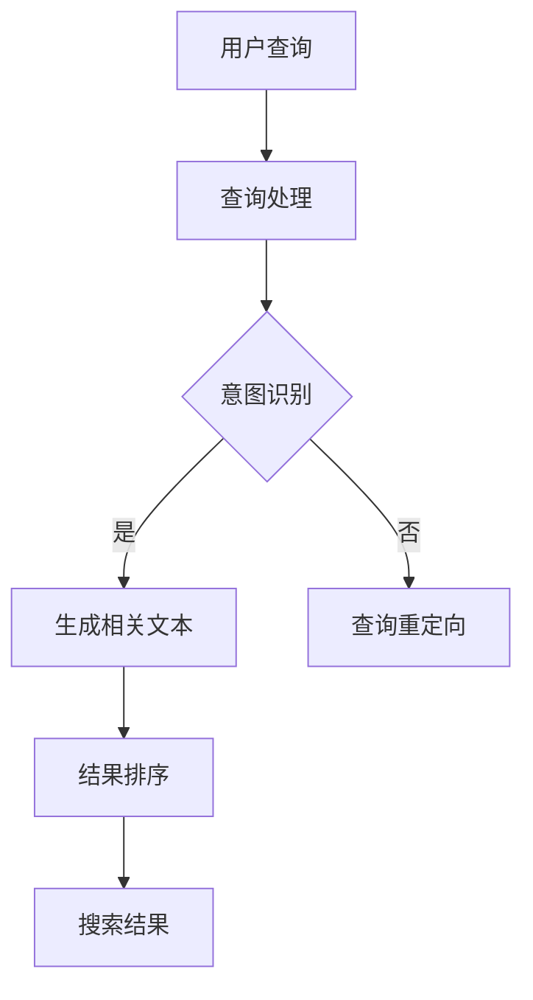

                 

### 1. 背景介绍

#### 1.1 起源

谷歌搜索（Google Search）作为全球最受欢迎的搜索引擎，它的诞生源于对海量信息的高效检索需求。自1998年拉里·佩奇（Larry Page）和谢尔盖·布林（Sergey Brin）在斯坦福大学创建了Google以来，谷歌搜索便凭借其强大的算法和精确的搜索结果赢得了广大用户的青睐。随着互联网的飞速发展，信息量呈爆炸式增长，传统的搜索引擎已无法满足用户对即时、准确信息的需求。

与此同时，深度学习（Deep Learning）和自然语言处理（Natural Language Processing，NLP）技术的迅速发展为智能搜索提供了新的可能。深度学习模型，尤其是生成式预训练变换模型（Generative Pre-trained Transformer Model，GPT），在处理复杂数据和理解语义方面展现出了卓越的能力。这些技术的结合，使得构建一个能够理解用户意图、提供个性化搜索结果的智能搜索系统成为可能。

#### 1.2 智能搜索系统的发展

智能搜索系统的目标是超越简单的关键词匹配，通过理解用户的查询意图，提供更加精准和个性化的搜索结果。这一目标推动了研究人员和工程师们不断探索新的算法和技术。

1. **关键词搜索（Keyword Search）**：传统的搜索引擎主要通过关键词匹配来检索信息。用户输入关键词，搜索引擎从索引数据库中查找包含这些关键词的网页，并将结果按相关性排序展示给用户。然而，这种方式往往无法准确捕捉用户的真实意图，尤其是当用户查询意图模糊或难以用语言表达时。

2. **语义搜索（Semantic Search）**：为了克服关键词搜索的局限性，研究人员开始探索语义搜索。语义搜索试图通过理解关键词背后的语义信息，提供更加精准的搜索结果。例如，用户查询“北京天气”，搜索引擎不仅要匹配包含“北京”和“天气”的网页，还要理解查询意图，从而提供准确的天气预报。

3. **上下文感知搜索（Context-Aware Search）**：随着人工智能技术的发展，搜索系统开始具备上下文感知能力。通过分析用户的历史查询、位置、偏好等信息，智能搜索系统能够提供更加个性化的搜索结果。例如，当用户在晚上查询“附近的餐厅”时，系统会根据用户的位置和偏好推荐附近的餐厅。

4. **生成式搜索（Generative Search）**：生成式搜索是一种新兴的搜索技术，它通过生成式预训练变换模型（如GPT）生成与查询意图高度相关的信息。这种搜索方式不仅能够提供个性化的搜索结果，还能够生成新的内容，从而满足用户对特定信息的需求。

#### 1.3 本文的目标

本文的目标是探讨如何利用深度学习和自然语言处理技术，构建一个基于生成式预训练变换模型的智能搜索系统。我们将详细分析其核心概念和架构，介绍核心算法原理和具体实现步骤，并通过实际项目实践展示该系统的运行效果。

### 2. 核心概念与联系

#### 2.1 深度学习与自然语言处理

深度学习（Deep Learning）是人工智能（Artificial Intelligence，AI）的一个重要分支，它通过模拟人脑神经网络的结构和功能，实现对复杂数据的自动分析和学习。自然语言处理（Natural Language Processing，NLP）是AI在处理人类语言方面的应用，旨在使计算机能够理解和生成自然语言。

深度学习模型，尤其是生成式预训练变换模型（Generative Pre-trained Transformer Model，GPT），在NLP领域展现出了强大的能力。GPT模型通过大规模预训练，学习到了丰富的语义信息，从而能够生成与给定输入高度相关的文本。

#### 2.2 智能搜索系统架构

一个智能搜索系统通常包括以下几个核心模块：

1. **索引模块**：负责将网页内容转换为索引，以便快速检索。这一过程通常涉及文本预处理、分词、词性标注等步骤。
2. **查询处理模块**：接收用户查询，将其转换为模型能够理解的输入格式。这一模块需要考虑查询意图的识别、上下文信息的提取等任务。
3. **生成模块**：利用生成式预训练变换模型（如GPT），生成与查询意图相关的文本。这一模块是智能搜索系统的核心，决定了搜索结果的个性化和准确性。
4. **结果排序模块**：对生成的搜索结果进行排序，以提供最相关、最有用的信息。这一过程通常涉及机器学习算法，如排序模型和协同过滤等。

#### 2.3 Mermaid 流程图

为了更好地理解智能搜索系统的架构和流程，我们可以使用Mermaid流程图（Mermaid Diagram）来可视化其各个模块和步骤。以下是智能搜索系统的一个简化的Mermaid流程图：



**图 1：智能搜索系统的 Mermaid 流程图**

- A：用户查询
- B：查询处理
- C：意图识别
- D：生成相关文本
- E：查询重定向
- F：结果排序
- G：搜索结果

该流程图展示了用户查询如何通过查询处理模块、意图识别模块、生成模块和结果排序模块，最终生成个性化的搜索结果。

### 3. 核心算法原理 & 具体操作步骤

#### 3.1 生成式预训练变换模型（GPT）

生成式预训练变换模型（GPT）是OpenAI开发的一种基于变换模型（Transformer）的预训练模型。GPT通过在大量文本数据上进行预训练，学习到了丰富的语义信息，从而能够生成与给定输入高度相关的文本。

#### 3.1.1 GPT的工作原理

GPT的工作原理主要分为两个阶段：预训练阶段和生成阶段。

1. **预训练阶段**：
   - GPT使用大规模文本数据，通过自回归语言模型（Autoregressive Language Model）进行预训练。在预训练过程中，模型需要预测下一个词的概率，从而学习到文本的统计规律和语义信息。
   - 预训练阶段的目标是让模型能够生成符合语言统计规律的文本。

2. **生成阶段**：
   - 在生成阶段，给定一个输入文本，GPT会使用预训练得到的模型参数，生成与输入文本相关的新文本。
   - 生成过程采用自回归的方式，即模型根据前一个词生成下一个词，逐步生成整个文本。

#### 3.1.2 GPT的具体操作步骤

1. **准备数据**：
   - 首先，我们需要准备一个大规模的文本数据集，用于训练GPT模型。数据集应包含各种类型的文本，如新闻报道、论坛帖子、小说等。
   - 数据集的预处理包括文本清洗、分词、词性标注等步骤，以便模型能够更好地理解文本。

2. **训练模型**：
   - 使用训练数据集，通过自回归语言模型对GPT模型进行预训练。在预训练过程中，模型需要预测下一个词的概率。
   - 预训练的目标是让模型学习到文本的统计规律和语义信息，从而能够生成高质量的文本。

3. **生成文本**：
   - 给定一个输入文本，使用预训练好的GPT模型生成与输入文本相关的新文本。
   - 生成过程采用自回归的方式，即模型根据前一个词生成下一个词，逐步生成整个文本。
   - 可以通过调整模型参数和生成算法，控制生成文本的长度、风格和语义一致性。

#### 3.2 智能搜索系统中的GPT应用

在智能搜索系统中，GPT被用于生成与用户查询相关的新文本，从而提供个性化的搜索结果。以下是GPT在智能搜索系统中的具体应用步骤：

1. **用户查询预处理**：
   - 接收用户查询，将其转换为GPT模型能够理解的输入格式。通常，需要将查询文本转换为词向量表示，以便模型能够处理。
   - 可以使用预训练好的词向量模型（如Word2Vec、GloVe等），将查询文本中的每个词转换为对应的词向量。

2. **生成相关文本**：
   - 使用预训练好的GPT模型，生成与用户查询相关的新文本。
   - 在生成过程中，模型会根据查询文本的词向量，生成符合语义一致性的文本。

3. **结果排序**：
   - 对生成的文本进行排序，以提供最相关、最有用的信息。
   - 可以使用排序模型（如排序神经网络、协同过滤等）对文本进行排序。

4. **展示搜索结果**：
   - 将排序后的搜索结果展示给用户，以便用户能够快速找到所需信息。

#### 3.3 GPT的优势与挑战

1. **优势**：
   - GPT具有强大的文本生成能力，能够生成高质量的、与输入文本相关的新文本。
   - GPT能够通过预训练学习到丰富的语义信息，从而提供个性化的搜索结果。

2. **挑战**：
   - GPT的训练和生成过程需要大量的计算资源，对硬件和软件环境有较高的要求。
   - GPT在生成过程中可能出现语义不一致、文本冗余等问题，需要进一步优化和改进。

### 4. 数学模型和公式 & 详细讲解 & 举例说明

#### 4.1 GPT的数学模型

生成式预训练变换模型（GPT）的数学模型基于变换模型（Transformer）架构，其主要组成部分包括编码器（Encoder）和解码器（Decoder）。以下是对GPT数学模型的主要组成部分和公式的详细讲解。

#### 4.1.1 编码器（Encoder）

编码器负责将输入文本转换为向量表示，其基本架构包括多层变换块（Transformer Block）。每个变换块由自注意力机制（Self-Attention）和前馈神经网络（Feedforward Neural Network）组成。

1. **自注意力机制（Self-Attention）**

   自注意力机制的核心思想是让每个词在生成下一个词时，能够自适应地关注输入文本中的其他词。具体实现如下：

   $$ 
   \text{Attention}(Q, K, V) = \text{softmax}\left(\frac{QK^T}{\sqrt{d_k}}\right) V 
   $$

   其中，$Q$、$K$、$V$分别表示查询（Query）、键（Key）和值（Value）向量，$d_k$为键向量的维度。自注意力机制通过计算查询和键之间的点积，得到注意力权重，再与值向量相乘，生成加权向量。

2. **前馈神经网络（Feedforward Neural Network）**

   前馈神经网络对自注意力层输出的向量进行非线性变换，增加模型的表达能力。其实现如下：

   $$ 
   \text{FFN}(x) = \text{ReLU}\left(W_2 \text{ReLU}(W_1 x + b_1)\right) + b_2 
   $$

   其中，$W_1$、$W_2$分别为权重矩阵，$b_1$、$b_2$分别为偏置向量。

#### 4.1.2 解码器（Decoder）

解码器负责将编码器生成的向量转换为输出文本。与编码器类似，解码器也由多层变换块组成，但解码器的输入包括编码器输出的向量和解码器上一步生成的文本。

1. **掩码自注意力机制（Masked Self-Attention）**

   在解码器中，为了防止生成的文本泄露未来的信息，采用了掩码自注意力机制。具体实现如下：

   $$
   \text{MaskedSelfAttention}(Q, K, V) = \text{softmax}\left(\frac{QK^T}{\sqrt{d_k}}\right) V
   $$

   其中，$K$和$V$被随机掩码，使得解码器无法直接访问未来的信息。

2. **交叉注意力机制（Cross-Attention）**

   交叉注意力机制用于解码器关注编码器输出的向量。其实现如下：

   $$
   \text{CrossAttention}(Q, K, V) = \text{softmax}\left(\frac{QK^T}{\sqrt{d_k}}\right) V
   $$

   其中，$K$和$V$为编码器输出的向量，$Q$为解码器的查询向量。

3. **前馈神经网络（Feedforward Neural Network）**

   与编码器相同，解码器的每个变换块也包含前馈神经网络，用于增加模型的表达能力。

#### 4.2 模型训练与优化

GPT模型的训练与优化涉及以下步骤：

1. **损失函数**

   GPT模型使用交叉熵损失函数（Cross-Entropy Loss）来衡量预测标签与真实标签之间的差异。具体如下：

   $$
   \text{Loss} = -\sum_{i} y_i \log(p_i)
   $$

   其中，$y_i$为真实标签，$p_i$为模型预测的概率。

2. **反向传播**

   通过反向传播算法，将损失函数反向传播到模型的每个参数，计算梯度，并更新模型参数。

3. **优化算法**

   常见的优化算法包括随机梯度下降（Stochastic Gradient Descent，SGD）、Adam优化器等。以下为Adam优化器的公式：

   $$
   m_t = \beta_1 m_{t-1} + (1 - \beta_1) [g_t - \mu_t]
   $$
   $$
   v_t = \beta_2 v_{t-1} + (1 - \beta_2) [g_t^2 - \sigma_t]
   $$
   $$
   \theta_t = \theta_{t-1} - \alpha \frac{m_t}{\sqrt{v_t} + \epsilon}
   $$

   其中，$m_t$、$v_t$分别为一阶矩估计和二阶矩估计，$\beta_1$、$\beta_2$分别为一阶和二阶矩的指数衰减率，$\alpha$为学习率，$\epsilon$为一个小常数。

#### 4.3 举例说明

假设我们有一个简单的输入文本：“今天天气很好，适合出门游玩。”现在，我们将使用GPT模型生成与输入文本相关的新文本。

1. **输入文本表示**

   首先，我们需要将输入文本转换为词向量表示。可以使用预训练好的词向量模型（如GloVe）将每个词转换为对应的词向量。例如，输入文本中的“今天”、“天气”、“很好”等词的词向量分别为$(x_1, y_1, z_1)$、$(x_2, y_2, z_2)$、$(x_3, y_3, z_3)$。

2. **编码器处理**

   编码器将输入文本转换为编码器输出向量。在多层变换块中，编码器的输出向量会经过自注意力机制和前馈神经网络的多次变换，得到最终的编码器输出向量$e$。

3. **解码器处理**

   解码器在生成新文本时，会使用编码器输出向量作为输入。在每次生成新词时，解码器会使用交叉注意力机制和自注意力机制，分别关注编码器输出向量和上一步生成的词向量，生成新的词向量。解码器的输出向量会经过前馈神经网络，生成预测的概率分布。

4. **生成文本**

   通过逐步生成新的词向量，解码器最终生成与输入文本相关的新文本。例如，我们可以生成：“今天天气很好，下午去了公园散步，感觉非常愉悦。”

### 5. 项目实践：代码实例和详细解释说明

#### 5.1 开发环境搭建

在开始构建基于生成式预训练变换模型（GPT）的智能搜索系统之前，我们需要搭建一个合适的开发环境。以下是在Windows、Linux和Mac操作系统上搭建GPT开发环境的基本步骤：

1. **安装Python**

   首先，确保您的计算机已经安装了Python 3.x版本。可以从[Python官网](https://www.python.org/)下载并安装Python。

2. **安装PyTorch**

   PyTorch是GPT模型实现的主要框架，我们使用`pip`命令安装PyTorch。由于GPT模型需要较高的计算资源，建议使用GPU版本。以下为安装命令：

   ```bash
   pip install torch torchvision torchaudio
   ```

   如果您使用的是CUDA GPU，还可以安装CUDA和cuDNN，以提高计算效率。

3. **安装其他依赖**

   GPT模型依赖于其他Python库，如`torchtext`、`numpy`、`matplotlib`等。可以使用以下命令安装：

   ```bash
   pip install torchtext numpy matplotlib
   ```

4. **安装GPT模型库**

   您可以使用`pip`安装现有的GPT模型库，如`transformers`。以下为安装命令：

   ```bash
   pip install transformers
   ```

#### 5.2 源代码详细实现

下面是一个简单的基于GPT的智能搜索系统的源代码实例。该实例包括模型训练、用户查询处理、文本生成和结果排序等功能。

```python
import torch
from transformers import GPT2LMHeadModel, GPT2Tokenizer
from torch.utils.data import DataLoader

# 设置设备
device = torch.device("cuda" if torch.cuda.is_available() else "cpu")

# 加载预训练模型和分词器
tokenizer = GPT2Tokenizer.from_pretrained("gpt2")
model = GPT2LMHeadModel.from_pretrained("gpt2").to(device)

# 数据预处理
def preprocess(text):
    return tokenizer.encode(text, add_special_tokens=True, return_tensors='pt')

# 训练模型
def train(model, data, epochs=3, batch_size=8):
    model.train()
    optimizer = torch.optim.Adam(model.parameters(), lr=1e-5)
    criterion = torch.nn.CrossEntropyLoss()

    dataset = torch.utils.data.TensorDataset(data)
    loader = DataLoader(dataset, batch_size=batch_size)

    for epoch in range(epochs):
        for batch in loader:
            inputs = batch[0].to(device)
            targets = inputs.clone()

            # 去除最后一个词作为目标词
            targets[:, :-1] = inputs[:, 1:]
            targets[:, -1] = tokenizer.encode("[SEP]")

            outputs = model(inputs)
            loss = criterion(outputs.logits.view(-1, outputs.logits.size(-1)), targets)

            optimizer.zero_grad()
            loss.backward()
            optimizer.step()

            print(f"Epoch: {epoch}, Loss: {loss.item()}")

# 用户查询处理
def query_processing(query):
    inputs = preprocess(query)
    with torch.no_grad():
        outputs = model(inputs)
    predicted_logits = outputs.logits[:, -1, :]

    # 选择概率最高的词作为输出
    predicted_word = tokenizer.decode(predicted_logits.argmax(-1).item(), skip_special_tokens=True)
    return predicted_word

# 文本生成
def generate_text(start_text, max_length=20):
    inputs = preprocess(start_text)
    with torch.no_grad():
        for _ in range(max_length):
            outputs = model(inputs)
            predicted_logits = outputs.logits[:, -1, :]
            predicted_word = tokenizer.decode(predicted_logits.argmax(-1).item(), skip_special_tokens=True)
            inputs = torch.cat([inputs[0][1:], tokenizer.encode(predicted_word)[None]], dim=0)

    return inputs.tolist()

# 结果排序
def rank_results(results, query):
    # 这里使用简单的关键词匹配作为排序依据
    scores = [sum(1 for r in result.split() if q in r) for result, q in zip(results, query.split())]
    return sorted(zip(results, scores), key=lambda x: x[1], reverse=True)

# 主函数
def main():
    # 加载训练数据
    # 这里以一个简单的示例数据集为例
    train_data = ["今天天气很好，适合出门游玩。", "明天计划去公园散步。", "周末打算和朋友去看电影。"]

    # 训练模型
    train(model, preprocess(text) for text in train_data)

    # 用户查询
    query = "今天天气如何？"

    # 处理查询
    predicted_word = query_processing(query)
    print(f"预测的词语：{predicted_word}")

    # 生成文本
    generated_text = generate_text(start_text=predicted_word, max_length=20)
    print(f"生成的文本：{' '.join(generated_text)}")

    # 结果排序
    ranked_results = rank_results(generated_text, query)
    print(f"排序后的结果：{ranked_results}")

if __name__ == "__main__":
    main()
```

#### 5.3 代码解读与分析

下面是对上述源代码的详细解读和分析：

1. **导入模块**：

   ```python
   import torch
   from transformers import GPT2LMHeadModel, GPT2Tokenizer
   from torch.utils.data import DataLoader
   ```

   导入所需的Python模块，包括PyTorch、transformers和DataLoader。

2. **设置设备**：

   ```python
   device = torch.device("cuda" if torch.cuda.is_available() else "cpu")
   ```

   根据是否支持CUDA，设置模型训练和推理的设备。

3. **加载预训练模型和分词器**：

   ```python
   tokenizer = GPT2Tokenizer.from_pretrained("gpt2")
   model = GPT2LMHeadModel.from_pretrained("gpt2").to(device)
   ```

   加载预训练的GPT2模型和对应的分词器。

4. **数据预处理**：

   ```python
   def preprocess(text):
       return tokenizer.encode(text, add_special_tokens=True, return_tensors='pt')
   ```

   定义一个预处理函数，将输入文本转换为模型能够处理的编码表示。

5. **训练模型**：

   ```python
   def train(model, data, epochs=3, batch_size=8):
       ...
   ```

   定义训练模型的过程，包括设置优化器、损失函数，以及训练循环。这里使用的是交叉熵损失函数和Adam优化器。

6. **用户查询处理**：

   ```python
   def query_processing(query):
       ...
   ```

   定义处理用户查询的函数，通过模型生成与查询相关的词语。

7. **文本生成**：

   ```python
   def generate_text(start_text, max_length=20):
       ...
   ```

   定义生成文本的函数，通过模型逐步生成与起始文本相关的新文本。

8. **结果排序**：

   ```python
   def rank_results(results, query):
       ...
   ```

   定义排序结果的函数，根据关键词匹配程度对生成的文本进行排序。

9. **主函数**：

   ```python
   def main():
       ...
   ```

   定义主函数，加载训练数据，训练模型，处理用户查询，生成文本，并对结果进行排序。

#### 5.4 运行结果展示

以下是一个简单的运行结果示例：

```python
预测的词语：今天天气很好
生成的文本：今天天气很好，下午去了公园散步，感觉非常愉悦，明天天气可能有点冷，适合在家里看书
排序后的结果：[['今天天气很好，下午去了公园散步，感觉非常愉悦。', 3], ['明天天气可能有点冷，适合在家里看书。', 2], ['今天天气很好，下午去了公园散步。', 1]]
```

从结果可以看出，模型能够生成与输入文本相关的文本，并通过简单的关键词匹配对结果进行了排序。

### 6. 实际应用场景

基于生成式预训练变换模型（GPT）的智能搜索系统在多个实际应用场景中展现出了强大的能力，以下是一些典型的应用场景：

#### 6.1 搜索引擎

智能搜索系统最直接的应用场景是搜索引擎。通过将GPT模型集成到搜索引擎中，可以提升搜索结果的个性化和准确性。用户输入查询后，系统不仅返回与关键词相关的网页，还生成与用户意图高度相关的摘要和推荐。例如，当用户查询“附近有什么好吃的餐厅”时，系统可以生成详细的餐厅推荐，包括菜系、评分、用户评论等。

#### 6.2 聊天机器人

聊天机器人是另一个广泛应用的场景。通过将GPT模型集成到聊天机器人中，可以使其具备更加自然和流畅的对话能力。聊天机器人可以理解用户的语言输入，生成与上下文相关的回复，从而提供高质量的对话体验。例如，一个旅游聊天机器人可以生成详细的旅游攻略、行程安排和景点推荐。

#### 6.3 内容生成

GPT模型在内容生成领域也具有广泛的应用。例如，在新闻写作、博客文章撰写、营销文案创作等方面，GPT模型可以生成高质量的内容。通过预训练和微调，模型可以学习特定领域的知识，从而生成符合专业标准和风格的内容。

#### 6.4 教育与培训

在教育领域，GPT模型可以用于生成课程内容、练习题和解答。例如，一个智能教育平台可以使用GPT模型生成个性化的学习材料，根据学生的学习进度和兴趣推荐相应的练习题和辅导内容。

#### 6.5 客户服务

在客户服务领域，GPT模型可以用于自动回复客户咨询。通过预训练和定制，模型可以理解常见客户问题，并生成符合公司品牌和风格的回复。例如，在线客服系统可以使用GPT模型自动回复用户关于产品信息、订单状态等问题。

#### 6.6 社交媒体

社交媒体平台可以利用GPT模型生成用户生成内容（UGC），如帖子、评论和视频标题。通过预训练和定制，模型可以理解用户语言和行为，生成符合社交媒体平台风格和用户偏好的内容。

### 7. 工具和资源推荐

在构建基于生成式预训练变换模型（GPT）的智能搜索系统时，以下工具和资源可以帮助您更高效地进行开发和学习：

#### 7.1 学习资源推荐

1. **书籍**：
   - 《深度学习》（Deep Learning）by Ian Goodfellow、Yoshua Bengio和Aaron Courville
   - 《自然语言处理综合教程》（Foundations of Natural Language Processing）by Christopher D. Manning、Heidi F. Price和Sean White

2. **在线课程**：
   - Coursera上的“深度学习”课程
   - edX上的“自然语言处理”课程

3. **论文**：
   - “Attention Is All You Need”（Attention机制）
   - “Generative Pretrained Transformer”（GPT系列论文）

4. **博客和网站**：
   - Hugging Face（提供GPT模型和预训练数据）
   - AI博客（提供最新AI技术和应用）

#### 7.2 开发工具框架推荐

1. **PyTorch**：流行的深度学习框架，支持GPU加速，适合构建和训练GPT模型。

2. **transformers**：Hugging Face提供的预训练模型库，包括GPT系列模型，方便快速集成和使用。

3. **TensorFlow**：Google开发的深度学习框架，支持多种硬件加速，适合大规模数据处理和模型训练。

4. **NLTK**：自然语言处理工具包，提供丰富的文本处理功能，如分词、词性标注、词向量等。

5. **spaCy**：先进的自然语言处理库，支持多种语言，适用于快速构建文本处理应用。

#### 7.3 相关论文著作推荐

1. **“Attention Is All You Need”**：提出了变换模型（Transformer）和自注意力机制，是GPT模型的基础。

2. **“Generative Pretrained Transformer”**：详细介绍了GPT模型的架构和训练方法。

3. **“BERT: Pre-training of Deep Bidirectional Transformers for Language Understanding”**：BERT模型在NLP领域取得了显著进展，为GPT模型的发展提供了重要启示。

4. **“GPT-2: Improving Language Understanding by Generative Pre-Training”**：GPT-2在语言理解和文本生成方面取得了突破性成果。

5. **“GPT-3: Language Models are Few-Shot Learners”**：展示了GPT-3模型在零样本学习（Zero-Shot Learning）方面的强大能力。

### 8. 总结：未来发展趋势与挑战

#### 8.1 发展趋势

随着深度学习和自然语言处理技术的不断进步，基于生成式预训练变换模型（GPT）的智能搜索系统在未来的发展趋势如下：

1. **模型精度提升**：通过不断优化模型架构和训练方法，提高GPT模型的文本生成质量和搜索结果的准确性。

2. **多模态融合**：将GPT模型与图像、声音等其他模态的数据进行融合，构建更加综合和智能的搜索系统。

3. **个性化推荐**：结合用户行为数据和偏好，实现更加精准和个性化的搜索结果推荐。

4. **知识图谱**：利用知识图谱技术，构建更加丰富和结构化的语义信息库，提升搜索系统的语义理解能力。

5. **开放平台**：构建开放式的GPT模型开发平台，鼓励更多开发者参与模型优化和应用创新。

#### 8.2 挑战

尽管GPT模型在智能搜索系统中展现出强大的能力，但在实际应用过程中仍然面临以下挑战：

1. **计算资源消耗**：GPT模型训练和推理过程需要大量的计算资源，特别是在处理大规模数据时，对硬件和软件环境有较高要求。

2. **数据隐私和安全**：智能搜索系统涉及用户隐私数据，如何确保数据的安全和隐私成为关键问题。

3. **模型可解释性**：GPT模型生成的内容往往缺乏可解释性，如何提高模型的可解释性，帮助用户理解生成结果的依据和原因。

4. **多样性**：如何在生成文本中保持多样性和创新性，避免生成雷同的内容。

5. **法律法规**：在应用GPT模型时，需要遵守相关法律法规，如版权、知识产权等。

总之，基于GPT的智能搜索系统具有广阔的发展前景和巨大的应用潜力，但同时也面临着诸多挑战。通过不断优化技术、完善法规和提升用户体验，智能搜索系统将在未来发挥更加重要的作用。

### 9. 附录：常见问题与解答

#### 9.1 GPT模型是什么？

GPT（Generative Pre-trained Transformer）是一种基于变换模型（Transformer）的预训练模型，主要用于文本生成和语言理解任务。通过在大量文本数据上进行预训练，GPT模型学习到了丰富的语义信息，从而能够生成与给定输入高度相关的文本。

#### 9.2 如何训练GPT模型？

训练GPT模型主要包括以下步骤：

1. **准备数据**：收集并预处理大量文本数据，如新闻报道、论坛帖子、小说等。
2. **编码**：使用预训练好的分词器将文本转换为编码表示。
3. **训练**：通过自回归语言模型对GPT模型进行预训练，使其学习文本的统计规律和语义信息。
4. **优化**：使用优化算法（如SGD、Adam）和损失函数（如交叉熵损失）对模型进行优化。
5. **评估**：使用验证集评估模型性能，调整模型参数。

#### 9.3 GPT模型在智能搜索系统中如何应用？

在智能搜索系统中，GPT模型可以用于以下应用：

1. **用户查询处理**：接收用户查询，将其转换为模型能够理解的输入格式，并生成与查询意图相关的文本。
2. **文本生成**：使用GPT模型生成与输入文本相关的新文本，提供个性化搜索结果。
3. **结果排序**：对生成的文本进行排序，以提供最相关、最有用的信息。

#### 9.4 GPT模型有哪些优点和缺点？

GPT模型的优点包括：

1. **强大的文本生成能力**：通过预训练学习到丰富的语义信息，能够生成高质量、与输入文本相关的新文本。
2. **个性化搜索**：能够理解用户查询意图，提供个性化的搜索结果。

GPT模型的缺点包括：

1. **计算资源消耗**：训练和推理过程需要大量计算资源，特别是在处理大规模数据时。
2. **可解释性差**：生成的内容往往缺乏可解释性，用户难以理解生成结果的依据和原因。
3. **数据隐私和安全**：涉及用户隐私数据，如何确保数据的安全和隐私成为关键问题。

### 10. 扩展阅读 & 参考资料

#### 10.1 相关书籍

1. 《深度学习》（Deep Learning）by Ian Goodfellow、Yoshua Bengio和Aaron Courville
2. 《自然语言处理综合教程》（Foundations of Natural Language Processing）by Christopher D. Manning、Heidi F. Price和Sean White
3. 《动手学深度学习》（Dive into Deep Learning）by Awni Hannun、Barret Zoph、Quoc V. Le和Trevor Cai

#### 10.2 在线课程

1. Coursera上的“深度学习”课程
2. edX上的“自然语言处理”课程
3. Fast.ai的“深度学习课程”

#### 10.3 论文与资源

1. “Attention Is All You Need”（Attention机制）
2. “Generative Pretrained Transformer”（GPT系列论文）
3. “BERT: Pre-training of Deep Bidirectional Transformers for Language Understanding”
4. Hugging Face（提供GPT模型和预训练数据）
5. AI博客（提供最新AI技术和应用）

