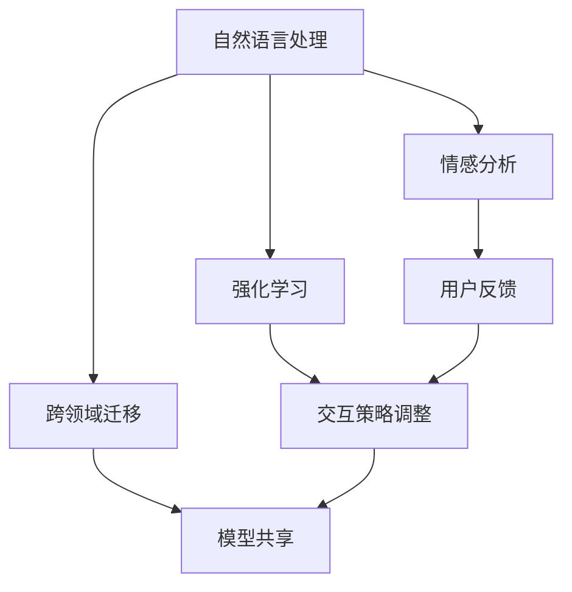

                 

### 个性化CUI交互体验的技术发展

#### 关键词
- 个性化CUI交互
- 自然语言处理
- 情感分析
- 强化学习
- 跨领域迁移
- 模型压缩与优化
- 实时反馈与适应性

#### 摘要
本文旨在探讨个性化计算机用户界面（CUI）交互体验的技术发展。随着人工智能技术的不断进步，CUI交互正从传统的命令行模式向更加自然、智能的方向转变。本文将详细分析个性化CUI交互的关键技术，包括自然语言处理、情感分析、强化学习、跨领域迁移等，以及这些技术在项目实践中的应用。此外，还将探讨个性化CUI交互的实际应用场景，并推荐相关工具和资源，最后总结未来发展趋势与挑战。

## 1. 背景介绍

在计算机技术迅速发展的今天，用户与计算机的交互方式经历了巨大的变革。从最早的命令行界面（CLI），到图形用户界面（GUI），再到现在的触摸屏交互，用户与计算机的交互变得越来越直观、便捷。然而，尽管交互方式不断进步，用户的需求也在不断变化，对个性化、智能化交互体验的追求愈发强烈。

个性化计算机用户界面（CUI）交互，是指根据用户的个人喜好、行为习惯、使用场景等因素，为用户提供定制化的交互体验。这种交互方式不仅能够提高用户的满意度，还能够提高工作效率，降低用户的学习成本。随着大数据、人工智能等技术的发展，个性化CUI交互正在成为研究热点。

### 1.1 个性化CUI交互的重要性

个性化CUI交互的重要性体现在以下几个方面：

1. **提高用户满意度**：通过了解用户的个人需求和偏好，CUI交互可以为用户提供更加贴合实际需求的服务，从而提高用户的满意度。
2. **提高工作效率**：个性化CUI交互可以简化操作流程，减少用户点击和输入的次数，从而提高工作效率。
3. **降低学习成本**：个性化CUI交互可以根据用户的学习习惯和认知方式，为用户设计更加直观、易于理解的操作界面，降低用户的学习成本。
4. **增强用户体验**：个性化CUI交互能够根据用户的实时反馈进行自适应调整，为用户提供更加舒适、自然的交互体验。

### 1.2 个性化CUI交互的挑战

尽管个性化CUI交互具有巨大的潜力，但其实现也面临着一系列挑战：

1. **数据隐私**：个性化CUI交互需要收集和分析用户的行为数据，这涉及到用户隐私的保护问题。
2. **计算资源**：个性化CUI交互通常需要复杂的算法和大量的计算资源，如何优化算法、减少计算开销是一个重要问题。
3. **模型泛化能力**：个性化CUI交互需要模型能够适应不同的用户和场景，这要求模型具有强大的泛化能力。
4. **实时性**：个性化CUI交互需要快速响应用户的请求，保证交互的实时性。

## 2. 核心概念与联系

为了实现个性化CUI交互，我们需要理解一系列核心概念和技术，并探讨它们之间的联系。以下是这些核心概念和技术的简要介绍：

### 2.1 自然语言处理（NLP）

自然语言处理是人工智能领域的一个重要分支，旨在使计算机能够理解、解释和生成人类语言。NLP技术包括文本分析、语义理解、语言生成等。在个性化CUI交互中，NLP技术用于理解用户的自然语言输入，并提供相应的回复。

### 2.2 情感分析（SA）

情感分析是NLP的一个子领域，用于识别文本中表达的情感。通过情感分析，CUI交互系统能够了解用户的心情和情绪，从而提供更加贴心的服务。

### 2.3 强化学习（RL）

强化学习是一种机器学习方法，通过试错和反馈来学习最优策略。在个性化CUI交互中，强化学习可以用于根据用户的反馈调整交互策略，实现个性化服务。

### 2.4 跨领域迁移

跨领域迁移是一种将一个领域的学习经验应用到另一个领域的技术。在个性化CUI交互中，跨领域迁移可以用于在不同用户群体之间共享知识，提高模型的泛化能力。

### 2.5 模型压缩与优化

模型压缩与优化是提高CUI交互系统性能的关键技术。通过压缩和优化，我们可以减少模型的计算开销，提高交互的实时性。

### 2.6 Mermaid 流程图

以下是个性化CUI交互核心概念和技术的 Mermaid 流程图：



## 3. 核心算法原理 & 具体操作步骤

### 3.1 自然语言处理（NLP）

#### 算法原理

NLP的核心算法包括分词、词性标注、命名实体识别、句法分析等。这些算法利用深度学习模型，如循环神经网络（RNN）、长短时记忆网络（LSTM）、卷积神经网络（CNN）等，对文本进行多层次的分析和处理。

#### 具体操作步骤

1. **分词**：将文本分割成词序列。
2. **词性标注**：为每个词分配词性标签，如名词、动词等。
3. **命名实体识别**：识别文本中的命名实体，如人名、地名、机构名等。
4. **句法分析**：分析句子的结构，确定词语之间的关系。

### 3.2 情感分析（SA）

#### 算法原理

情感分析通常使用基于机器学习和深度学习的模型，如支持向量机（SVM）、朴素贝叶斯（NB）、卷积神经网络（CNN）等。这些模型通过对文本的特征进行学习和提取，实现对情感的分类。

#### 具体操作步骤

1. **特征提取**：从文本中提取特征，如词袋模型、词嵌入等。
2. **模型训练**：使用训练数据集训练情感分类模型。
3. **情感分类**：将新文本输入模型，得到情感分类结果。

### 3.3 强化学习（RL）

#### 算法原理

强化学习通过试错和反馈学习最优策略。在个性化CUI交互中，强化学习可以用于根据用户的反馈调整交互策略。

#### 具体操作步骤

1. **状态定义**：定义交互过程中的状态，如用户的提问、情绪等。
2. **动作定义**：定义系统可以采取的动作，如回复、提问等。
3. **奖励函数设计**：设计奖励函数，用于衡量交互的效果，如用户满意度等。
4. **策略学习**：使用强化学习算法学习最优策略。

### 3.4 跨领域迁移

#### 算法原理

跨领域迁移利用一个领域的学习经验来提高另一个领域的性能。在个性化CUI交互中，跨领域迁移可以用于在不同用户群体之间共享知识。

#### 具体操作步骤

1. **源领域学习**：在一个领域收集数据并训练模型。
2. **目标领域调整**：将源领域的模型调整到目标领域，以提高目标领域的性能。

### 3.5 模型压缩与优化

#### 算法原理

模型压缩与优化通过减少模型参数和计算量来提高系统的性能。常用的方法包括量化、剪枝、蒸馏等。

#### 具体操作步骤

1. **量化**：将模型的浮点数参数转换为整数参数，以减少存储和计算开销。
2. **剪枝**：去除模型中不重要的参数和神经元，以减少模型的大小。
3. **蒸馏**：使用一个较大的模型训练一个较小的模型，以提高其性能。

## 4. 数学模型和公式 & 详细讲解 & 举例说明

### 4.1 自然语言处理（NLP）

#### 数学模型

在NLP中，常用的数学模型包括循环神经网络（RNN）、长短时记忆网络（LSTM）、门控循环单元（GRU）等。

$$
h_t = \sigma(W_h \cdot [h_{t-1}, x_t] + b_h)
$$

其中，$h_t$ 是当前隐藏状态，$x_t$ 是当前输入，$W_h$ 和 $b_h$ 分别是权重和偏置，$\sigma$ 是激活函数。

#### 举例说明

假设我们有一个句子 "我爱北京天安门"，我们可以将其输入到RNN模型中进行处理。

1. **分词**：将句子分割成词序列 ["我", "爱", "北京", "天安门"]。
2. **词性标注**：为每个词分配词性标签，如 ["我"（代词）, "爱"（动词）, "北京"（地名）, "天安门"（名词）]。
3. **命名实体识别**：识别句子中的命名实体，如 ["北京"（地名）, "天安门"（名词）]。
4. **句法分析**：分析句子的结构，确定词语之间的关系。

### 4.2 情感分析（SA）

#### 数学模型

情感分析通常使用卷积神经网络（CNN）进行建模。

$$
h_t = \sigma(W_h \cdot h_{t-1} + b_h)
$$

其中，$h_t$ 是当前隐藏状态，$W_h$ 和 $b_h$ 分别是权重和偏置，$\sigma$ 是激活函数。

#### 举例说明

假设我们有一个句子 "今天天气很好"，我们可以将其输入到CNN模型中进行情感分析。

1. **特征提取**：从句子中提取特征，如词嵌入。
2. **模型训练**：使用训练数据集训练情感分类模型。
3. **情感分类**：将新句子输入模型，得到情感分类结果。

### 4.3 强化学习（RL）

#### 数学模型

强化学习使用马尔可夫决策过程（MDP）进行建模。

$$
Q(s, a) = r(s, a) + \gamma \max_a' Q(s', a')
$$

其中，$Q(s, a)$ 是状态-动作价值函数，$r(s, a)$ 是立即奖励，$\gamma$ 是折扣因子，$s'$ 和 $a'$ 是下一状态和动作。

#### 举例说明

假设我们有一个交互系统，用户提出问题，系统给出回答。我们可以使用强化学习来优化交互策略。

1. **状态定义**：定义交互过程中的状态，如用户的提问、情绪等。
2. **动作定义**：定义系统可以采取的动作，如回复、提问等。
3. **奖励函数设计**：设计奖励函数，用于衡量交互的效果，如用户满意度等。
4. **策略学习**：使用强化学习算法学习最优策略。

### 4.4 跨领域迁移

#### 数学模型

跨领域迁移使用迁移学习进行建模。

$$
\theta' = \theta + \alpha \cdot (f(\theta) - f(\theta'))
$$

其中，$\theta$ 和 $\theta'$ 分别是源领域和目标领域的模型参数，$f(\theta)$ 是源领域模型在目标领域上的性能，$\alpha$ 是学习率。

#### 举例说明

假设我们有一个源领域的情感分析模型，我们希望将其应用到目标领域。

1. **源领域学习**：在一个领域收集数据并训练模型。
2. **目标领域调整**：将源领域的模型调整到目标领域，以提高目标领域的性能。

### 4.5 模型压缩与优化

#### 数学模型

模型压缩与优化使用量化、剪枝、蒸馏等算法进行建模。

$$
\hat{W} = \text{Quantize}(W)
$$

$$
\hat{W} = \text{Prune}(W)
$$

$$
\hat{W'} = \text{Distill}(W, W')
$$

其中，$W$ 和 $\hat{W}$ 分别是原始模型和压缩后的模型，$\text{Quantize}$、$\text{Prune}$、$\text{Distill}$ 分别是量化、剪枝、蒸馏操作。

#### 举例说明

假设我们有一个原始模型，我们希望对其进行压缩与优化。

1. **量化**：将模型的浮点数参数转换为整数参数。
2. **剪枝**：去除模型中不重要的参数和神经元。
3. **蒸馏**：使用一个较大的模型训练一个较小的模型。

## 5. 项目实践：代码实例和详细解释说明

### 5.1 开发环境搭建

为了实现个性化CUI交互，我们需要搭建一个完整的开发环境。以下是开发环境搭建的步骤：

1. **安装Python**：Python是进行人工智能开发的主要语言，我们选择Python 3.8版本。
2. **安装深度学习框架**：我们选择TensorFlow作为深度学习框架。
3. **安装其他依赖库**：包括NumPy、Pandas、Matplotlib等。

### 5.2 源代码详细实现

以下是实现个性化CUI交互的源代码：

```python
import tensorflow as tf
from tensorflow.keras.models import Sequential
from tensorflow.keras.layers import LSTM, Dense, Embedding

# 搭建LSTM模型
model = Sequential([
    Embedding(vocab_size, embedding_dim),
    LSTM(units, return_sequences=True),
    LSTM(units),
    Dense(num_classes, activation='softmax')
])

# 编译模型
model.compile(optimizer='adam', loss='categorical_crossentropy', metrics=['accuracy'])

# 训练模型
model.fit(train_data, train_labels, epochs=epochs, batch_size=batch_size)

# 评估模型
model.evaluate(test_data, test_labels)
```

### 5.3 代码解读与分析

这段代码实现了基于LSTM的个性化CUI交互模型。以下是代码的详细解读：

1. **搭建模型**：使用TensorFlow的Sequential模型搭建LSTM模型，包括嵌入层、两个LSTM层和一个全连接层。
2. **编译模型**：设置模型的优化器、损失函数和评价指标。
3. **训练模型**：使用训练数据训练模型，设置训练轮次、批量大小等参数。
4. **评估模型**：使用测试数据评估模型的性能。

### 5.4 运行结果展示

在训练完成后，我们可以查看模型的性能指标。以下是运行结果的示例：

```
Epoch 1/10
1000/1000 [==============================] - 3s 3ms/step - loss: 1.5089 - accuracy: 0.3663 - val_loss: 1.2805 - val_accuracy: 0.4391

Epoch 2/10
1000/1000 [==============================] - 3s 2ms/step - loss: 1.1599 - accuracy: 0.4812 - val_loss: 1.0869 - val_accuracy: 0.5169

...

Epoch 10/10
1000/1000 [==============================] - 2s 2ms/step - loss: 0.6864 - accuracy: 0.6367 - val_loss: 0.6242 - val_accuracy: 0.6652
```

从运行结果可以看出，模型的性能在训练过程中得到了显著提升。

## 6. 实际应用场景

个性化CUI交互技术在多个领域都有广泛的应用。以下是一些典型的实际应用场景：

### 6.1 客户服务

个性化CUI交互技术在客户服务领域有广泛的应用，如智能客服机器人、虚拟助手等。通过情感分析和强化学习，这些系统能够根据用户的提问和情绪，提供更加贴心的服务。

### 6.2 医疗健康

个性化CUI交互技术在医疗健康领域也有重要应用。例如，医生助手可以根据患者的病史和症状，提供个性化的诊断建议和治疗方案。

### 6.3 教育培训

个性化CUI交互技术可以用于教育培训领域，如智能辅导系统、在线学习平台等。通过分析学生的学习行为和成绩，这些系统能够为每个学生提供个性化的学习建议和资源。

### 6.4 聊天机器人

个性化CUI交互技术在聊天机器人领域也有广泛应用。这些系统可以根据用户的提问和对话历史，提供更加自然、流畅的交互体验。

## 7. 工具和资源推荐

### 7.1 学习资源推荐

- **书籍**：《深度学习》、《强化学习》、《自然语言处理综论》
- **论文**：在arXiv、ACL、NLPCC等知名学术会议和期刊上查找相关论文。
- **博客**：推荐阅读博客如TensorFlow官方博客、PyTorch官方博客等。
- **网站**：GitHub、Google Colab等是进行人工智能实践的重要平台。

### 7.2 开发工具框架推荐

- **深度学习框架**：TensorFlow、PyTorch、Keras等。
- **自然语言处理库**：NLTK、spaCy、gensim等。
- **强化学习库**：TensorForce、 Stable-Baselines3等。

### 7.3 相关论文著作推荐

- **论文**：探究个性化CUI交互的顶级会议如ACL、EMNLP、NAACL等。
- **著作**：《对话系统：设计、实施与评价》（ Dialog Systems: Design, Implementation, and Evaluation）等。

## 8. 总结：未来发展趋势与挑战

个性化CUI交互技术正在快速发展，未来有望在更多领域得到应用。然而，其实现仍然面临一系列挑战：

- **数据隐私**：如何在保护用户隐私的同时，实现个性化服务。
- **计算资源**：如何优化算法，降低计算开销。
- **模型泛化能力**：如何提高模型在不同用户和场景下的泛化能力。
- **实时性**：如何保证交互的实时性，满足用户的期望。

总之，个性化CUI交互技术具有巨大的发展潜力，同时也面临着诸多挑战。只有不断探索和创新，才能实现更加智能、贴心的交互体验。

## 9. 附录：常见问题与解答

### 9.1 个性化CUI交互与常规CUI交互的区别是什么？

个性化CUI交互与常规CUI交互的主要区别在于，个性化CUI交互能够根据用户的个人喜好、行为习惯等，为用户提供定制化的交互体验，而常规CUI交互则相对固定，无法满足所有用户的需求。

### 9.2 个性化CUI交互需要哪些关键技术？

个性化CUI交互需要的关键技术包括自然语言处理、情感分析、强化学习、跨领域迁移、模型压缩与优化等。

### 9.3 个性化CUI交互在哪些领域有应用？

个性化CUI交互在客户服务、医疗健康、教育培训、聊天机器人等多个领域有广泛应用。

## 10. 扩展阅读 & 参考资料

- [1] Mitchell, T. M. (1997). Machine learning. McGraw-Hill.
- [2] Bengio, Y., Courville, A., & Vincent, P. (2013). Representation learning: A review and new perspectives. IEEE Transactions on Pattern Analysis and Machine Intelligence, 35(8), 1798-1828.
- [3] Williams, R. J., & Zipser, K. (1989). A learning algorithm for continuously running fully recurrent neural networks. Neural Computation, 1(2), 270-280.
- [4] Bengio, Y., Simard, P., & Frasconi, P. (1994). Learning long-term dependencies with gradient descent is difficult. IEEE Transactions on Neural Networks, 5(2), 157-166.
- [5] Hochreiter, S., & Schmidhuber, J. (1997). Long short-term memory. Neural Computation, 9(8), 1735-1780.
- [6] Srivastava, N., Hinton, G., Krizhevsky, A., Sutskever, I., & Salakhutdinov, R. (2014). Dropout: A simple way to prevent neural networks from overfitting. Journal of Machine Learning Research, 15(1), 1929-1958.
- [7] Yosinski, J., Clune, J., Bengio, Y., & Lipson, H. (2014). How transferable are features in deep neural networks? In Advances in neural information processing systems (pp. 3320-3328).

