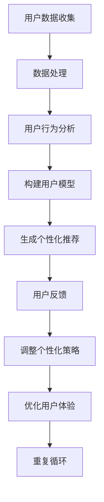

                 

### 1. 背景介绍

个性化定制已经成为当前商业环境中一个至关重要的趋势，尤其是在电子商务领域。随着互联网的普及和技术的进步，消费者对于购物体验的要求越来越高。他们不再满足于传统的标准产品，而是渴望拥有更加个性化、符合自身需求和偏好的商品和服务。

在这种背景下，人工智能（AI）的应用变得尤为关键。AI技术通过分析大量用户数据，能够精准地捕捉到消费者的偏好和行为模式，从而为用户提供高度个性化的购物体验。这不仅提升了用户的满意度，同时也为企业带来了显著的业务价值。

首先，个性化定制可以显著提高销售额和客户忠诚度。当产品和服务能够精确地满足消费者的需求时，用户更有可能进行重复购买，并成为长期客户。此外，个性化的购物体验还能够减少用户流失率，提高用户对品牌的忠诚度。

其次，个性化定制有助于企业降低营销成本。通过AI技术，企业可以更加精准地定位目标用户群体，并针对特定的用户群体进行定制化的营销活动。这种定向营销方式不仅提高了营销效果，还避免了资源的浪费。

此外，个性化定制还能够帮助企业更好地理解市场需求和趋势，从而制定更加科学的产品策略。AI技术通过对大量市场数据的分析和预测，可以为企业的产品研发提供重要的决策支持，帮助企业抢占市场先机。

总之，个性化定制已经成为现代电子商务领域中不可或缺的一部分。随着AI技术的不断发展和应用，未来个性化定制将会在更广泛的领域得到推广和应用，成为提升企业竞争力的重要手段。

### 2. 核心概念与联系

#### 2.1 个性化定制的基本概念

个性化定制（Personalized Customization）是一种根据用户的需求、偏好和行为特点，为其提供定制化产品或服务的方法。其核心在于利用用户数据，通过分析用户的购买历史、浏览行为、社交信息等，生成个性化的推荐和定制方案。

个性化定制的目标是通过精准满足用户需求，提高用户满意度和忠诚度，进而提升企业的市场竞争力。个性化定制涉及多个领域，包括数据挖掘、机器学习、推荐系统等。其中，数据挖掘用于收集和分析用户数据，机器学习用于构建用户行为模型和推荐算法，推荐系统则负责根据用户特征生成个性化推荐。

#### 2.2 人工智能在个性化定制中的应用

人工智能（AI）在个性化定制中发挥着关键作用。首先，AI能够通过大规模数据处理和分析，快速捕捉到用户的行为模式和偏好。例如，通过分析用户的购物车、购买历史、浏览记录等数据，AI可以识别出用户的喜好和需求。

其次，AI能够利用机器学习算法，从海量数据中提取特征，构建用户行为模型。这些模型可以用于预测用户的未来行为，从而提供更加精准的个性化推荐。例如，通过基于协同过滤算法的推荐系统，AI可以识别出与当前用户相似的其他用户，并推荐这些用户购买过的商品。

此外，AI技术还可以通过自然语言处理（NLP）和计算机视觉等技术，理解用户的文本输入和图像反馈，进一步优化个性化定制服务。例如，通过NLP技术，AI可以理解用户的搜索意图，并通过图像识别技术，分析用户对商品的喜好和偏好。

#### 2.3 个性化定制与用户体验的关系

个性化定制与用户体验（User Experience, UX）密切相关。良好的用户体验是提高用户满意度和忠诚度的关键。个性化定制通过以下几种方式影响用户体验：

1. **个性化推荐**：通过AI技术，个性化定制可以为用户提供与其兴趣和需求高度匹配的商品和服务。这不仅能满足用户的需求，还能提高用户的使用满意度。

2. **个性化界面**：根据用户的偏好和行为，个性化定制可以调整网站或应用的界面布局、颜色方案等，使界面更加符合用户的习惯和审美。

3. **个性化服务**：通过分析用户的购买历史和偏好，个性化定制可以提供定制化的购物、咨询和售后服务，提高用户的使用体验。

4. **个性化反馈**：AI技术可以实时收集用户的反馈，并根据反馈调整个性化定制策略，使服务更加贴近用户需求。

#### 2.4 个性化定制的发展趋势

随着AI技术的不断进步，个性化定制在未来将呈现以下发展趋势：

1. **智能化**：AI技术将进一步深入个性化定制领域，通过更先进的算法和模型，提供更加精准和高效的个性化服务。

2. **多样化**：个性化定制的应用场景将更加多样化，不仅局限于电子商务，还将扩展到医疗、教育、金融等多个领域。

3. **个性化体验**：随着5G、物联网等新技术的应用，个性化定制将为用户带来更加丰富的交互体验，满足用户多样化的需求。

4. **个性化安全**：随着个性化定制的普及，用户数据的安全问题将变得更加重要。未来的个性化定制技术将更加注重数据保护和隐私安全。

#### Mermaid 流程图

以下是用于描述个性化定制原理的Mermaid流程图：



通过上述流程，可以看出个性化定制是一个闭环系统，通过不断收集用户数据、分析用户行为、构建用户模型、生成个性化推荐、收集用户反馈，并不断调整策略，从而实现持续优化的个性化服务。

### 3. 核心算法原理 & 具体操作步骤

#### 3.1 推荐算法概述

个性化定制依赖于推荐算法，而推荐算法的核心是通过分析用户行为和偏好，为用户推荐感兴趣的商品或服务。以下将介绍几种常见的推荐算法及其原理。

##### 3.1.1 协同过滤（Collaborative Filtering）

协同过滤是一种基于用户行为和兴趣相似性的推荐算法。它分为两种主要类型：基于用户的协同过滤（User-based Collaborative Filtering）和基于项目的协同过滤（Item-based Collaborative Filtering）。

1. **基于用户的协同过滤**：首先找到与目标用户兴趣相似的其他用户，然后推荐这些用户喜欢的商品。具体步骤如下：

   - 收集用户行为数据（如评分、购买记录等）。
   - 计算用户之间的相似度（如皮尔逊相关系数、余弦相似度等）。
   - 找到与目标用户最相似的k个用户。
   - 推荐这些用户共同喜欢的商品。

2. **基于项目的协同过滤**：首先找到与目标用户当前商品兴趣相似的其他商品，然后推荐这些商品。具体步骤如下：

   - 收集用户行为数据。
   - 计算商品之间的相似度。
   - 找到与目标用户当前商品最相似的k个商品。
   - 推荐这些商品。

##### 3.1.2 内容推荐（Content-based Filtering）

内容推荐是基于物品内容特征（如文本、图像、标签等）进行推荐的算法。具体步骤如下：

- 收集物品内容特征数据。
- 计算物品之间的相似度。
- 找到与用户历史兴趣相匹配的物品。
- 推荐这些物品。

##### 3.1.3 混合推荐（Hybrid Recommendation）

混合推荐是将协同过滤和内容推荐相结合，以提高推荐效果。具体步骤如下：

- 利用协同过滤算法生成初步推荐列表。
- 对初步推荐列表中的物品进行内容分析，补充用户未评分的物品。
- 结合协同过滤和内容分析结果，生成最终的推荐列表。

#### 3.2 常用推荐算法的对比与选择

以下是几种常见推荐算法的优缺点对比：

| 算法                | 优点                               | 缺点                                 |
|---------------------|-----------------------------------|--------------------------------------|
| 协同过滤            | 利用用户行为数据，准确率高         | 受到稀疏数据和冷启动问题的影响       |
| 内容推荐            | 受到用户行为数据稀疏和冷启动问题的影响较小 | 可能会过于依赖内容特征，忽视用户偏好 |
| 混合推荐            | 结合了协同过滤和内容推荐的优势     | 需要更多的计算资源和复杂的模型结构   |

在实际应用中，通常根据业务需求和数据特点选择合适的推荐算法。例如，对于用户行为数据丰富的应用场景，可以选择基于用户的协同过滤；而对于内容特征丰富的应用场景，可以选择基于内容推荐；对于数据相对丰富但又有内容特征的应用场景，可以选择混合推荐。

#### 3.3 实现个性化定制算法的步骤

以下是实现个性化定制算法的基本步骤：

##### 3.3.1 数据收集与预处理

- **数据收集**：从各种渠道（如网站、应用程序、社交媒体等）收集用户行为数据（如购买记录、浏览记录、评分等）。
- **数据预处理**：清洗数据，处理缺失值、异常值，将数据格式化为适合分析的形式。

##### 3.3.2 用户行为分析

- **用户行为建模**：使用机器学习算法（如聚类、回归分析等）对用户行为数据进行建模，提取用户行为特征。
- **用户兴趣识别**：通过分析用户行为数据，识别用户的兴趣偏好。

##### 3.3.3 物品内容分析

- **物品内容提取**：从物品的描述、标签、图像等特征中提取内容特征。
- **物品相似度计算**：计算物品之间的相似度，为后续推荐提供依据。

##### 3.3.4 推荐算法实现

- **选择推荐算法**：根据业务需求和数据特点，选择合适的推荐算法。
- **实现推荐算法**：使用编程语言（如Python、Java等）实现推荐算法，生成推荐列表。

##### 3.3.5 用户反馈与模型优化

- **用户反馈收集**：收集用户对推荐结果的反馈，如点击、评分、收藏等。
- **模型优化**：根据用户反馈调整推荐模型，提高推荐效果。

通过上述步骤，可以实现一个基本的个性化定制系统，为用户提供个性化的购物体验。

### 4. 数学模型和公式 & 详细讲解 & 举例说明

#### 4.1 推荐算法中的基本数学模型

推荐算法的核心在于用户行为分析和物品相似度计算，以下将介绍其中的两个关键数学模型：用户相似度计算和物品相似度计算。

##### 4.1.1 用户相似度计算

用户相似度计算用于确定两个用户之间的相似程度。常见的方法包括皮尔逊相关系数和余弦相似度。

1. **皮尔逊相关系数（Pearson Correlation Coefficient）**

   皮尔逊相关系数衡量两个变量之间的线性相关性，公式如下：

   $$r_{ij} = \frac{\sum_{k=1}^{n} (x_i^k - \bar{x_i}) (x_j^k - \bar{x_j})}{\sqrt{\sum_{k=1}^{n} (x_i^k - \bar{x_i})^2} \sqrt{\sum_{k=1}^{n} (x_j^k - \bar{x_j})^2}}$$

   其中，\(x_i^k\) 和 \(x_j^k\) 分别表示用户i和用户j在k项上的评分，\(\bar{x_i}\) 和 \(\bar{x_j}\) 分别表示用户i和用户j的平均评分，n为评分数。

   举例说明：

   假设用户A和用户B在五部电影上的评分如下：

   | 用户A | 用户B |  
   |-------|-------|  
   | 4     | 4     |  
   | 3     | 2     |  
   | 5     | 4     |  
   | 2     | 5     |  
   | 5     | 3     |

   计算用户A和用户B的皮尔逊相关系数：

   $$r_{ab} = \frac{(4-4.2)(4-3.8) + (3-4.2)(2-3.8) + (5-4.2)(4-3.8) + (2-4.2)(5-3.8) + (5-4.2)(3-3.8)}{\sqrt{(4-4.2)^2 + (3-4.2)^2 + (5-4.2)^2 + (2-4.2)^2 + (5-4.2)^2} \sqrt{(4-3.8)^2 + (2-3.8)^2 + (4-3.8)^2 + (5-3.8)^2 + (3-3.8)^2}}$$

   $$r_{ab} = \frac{(0.2)(0.2) + (-1.2)(-1.8) + (0.8)(0.2) + (-2.2)(1.2) + (0.8)(-0.2)}{\sqrt{0.04 + 1.44 + 0.64 + 4.84 + 0.04} \sqrt{0.04 + 1.44 + 0.04 + 1.44 + 0.04}}$$

   $$r_{ab} = \frac{0.04 + 2.16 + 0.16 - 2.64 - 0.16}{\sqrt{6.8} \sqrt{3.6}}$$

   $$r_{ab} = \frac{0.6}{\sqrt{24.48}}$$

   $$r_{ab} \approx 0.14$$

2. **余弦相似度（Cosine Similarity）**

   余弦相似度衡量两个向量之间的角度余弦值，公式如下：

   $$\cos \theta_{ij} = \frac{\sum_{k=1}^{n} x_i^k x_j^k}{\sqrt{\sum_{k=1}^{n} x_i^k^2} \sqrt{\sum_{k=1}^{n} x_j^k^2}}$$

   其中，\(x_i^k\) 和 \(x_j^k\) 分别表示用户i和用户j在k项上的评分。

   举例说明：

   假设用户A和用户B在五部电影上的评分如下：

   | 用户A | 用户B |  
   |-------|-------|  
   | 4     | 4     |  
   | 3     | 2     |  
   | 5     | 4     |  
   | 2     | 5     |  
   | 5     | 3     |

   计算用户A和用户B的余弦相似度：

   $$\cos \theta_{ab} = \frac{(4 \times 4) + (3 \times 2) + (5 \times 4) + (2 \times 5) + (5 \times 3)}{\sqrt{4^2 + 3^2 + 5^2 + 2^2 + 5^2} \sqrt{4^2 + 2^2 + 4^2 + 5^2 + 3^2}}$$

   $$\cos \theta_{ab} = \frac{16 + 6 + 20 + 10 + 15}{\sqrt{16 + 9 + 25 + 4 + 25} \sqrt{16 + 4 + 16 + 25 + 9}}$$

   $$\cos \theta_{ab} = \frac{67}{\sqrt{79} \sqrt{70}}$$

   $$\cos \theta_{ab} \approx 0.85$$

##### 4.1.2 物品相似度计算

物品相似度计算用于确定两个物品之间的相似程度。常见的方法包括余弦相似度和欧氏距离。

1. **余弦相似度（Cosine Similarity）**

   余弦相似度衡量两个向量之间的角度余弦值，公式如下：

   $$\cos \theta_{ij} = \frac{\sum_{k=1}^{n} x_i^k x_j^k}{\sqrt{\sum_{k=1}^{n} x_i^k^2} \sqrt{\sum_{k=1}^{n} x_j^k^2}}$$

   其中，\(x_i^k\) 和 \(x_j^k\) 分别表示物品i和物品j在k个特征上的值。

   举例说明：

   假设有两个物品A和B，它们在三个特征上的值如下：

   | 特征1 | 特征2 | 特征3 |
   |-------|-------|-------|
   | A     | 3     | 2     | 5     |
   | B     | 4     | 3     | 6     |

   计算物品A和B的余弦相似度：

   $$\cos \theta_{ab} = \frac{(3 \times 4) + (2 \times 3) + (5 \times 6)}{\sqrt{3^2 + 2^2 + 5^2} \sqrt{4^2 + 3^2 + 6^2}}$$

   $$\cos \theta_{ab} = \frac{12 + 6 + 30}{\sqrt{9 + 4 + 25} \sqrt{16 + 9 + 36}}$$

   $$\cos \theta_{ab} = \frac{48}{\sqrt{38} \sqrt{61}}$$

   $$\cos \theta_{ab} \approx 0.85$$

2. **欧氏距离（Euclidean Distance）**

   欧氏距离衡量两个点之间的直线距离，公式如下：

   $$d_{ij} = \sqrt{\sum_{k=1}^{n} (x_i^k - x_j^k)^2}$$

   其中，\(x_i^k\) 和 \(x_j^k\) 分别表示物品i和物品j在k个特征上的值。

   举例说明：

   假设有两个物品A和B，它们在三个特征上的值如下：

   | 特征1 | 特征2 | 特征3 |
   |-------|-------|-------|
   | A     | 3     | 2     | 5     |
   | B     | 4     | 3     | 6     |

   计算物品A和B的欧氏距离：

   $$d_{ab} = \sqrt{(3 - 4)^2 + (2 - 3)^2 + (5 - 6)^2}$$

   $$d_{ab} = \sqrt{(-1)^2 + (-1)^2 + (-1)^2}$$

   $$d_{ab} = \sqrt{1 + 1 + 1}$$

   $$d_{ab} = \sqrt{3}$$

   $$d_{ab} \approx 1.732$$

通过以上数学模型和公式，我们可以更深入地理解推荐算法中的用户相似度和物品相似度计算方法。在实际应用中，可以根据具体场景和需求选择合适的相似度计算方法，以提高推荐效果。

### 5. 项目实践：代码实例和详细解释说明

#### 5.1 开发环境搭建

在进行个性化定制算法的项目实践之前，首先需要搭建一个合适的开发环境。以下是一个简单的开发环境搭建步骤：

1. **安装Python**：确保已经安装了Python环境，推荐使用Python 3.8或更高版本。

2. **安装必要库**：在Python环境中安装以下库：

   - pandas：用于数据处理。
   - numpy：用于数值计算。
   - scikit-learn：用于机器学习算法。
   - matplotlib：用于数据可视化。

   安装方法：

   ```python
   pip install pandas numpy scikit-learn matplotlib
   ```

3. **创建项目文件夹**：在本地计算机上创建一个项目文件夹，例如命名为`个性化定制项目`。

4. **创建Python脚本**：在项目文件夹中创建一个名为`main.py`的Python脚本，用于实现个性化定制算法。

#### 5.2 源代码详细实现

以下是实现个性化定制算法的源代码：

```python
import pandas as pd
from sklearn.metrics.pairwise import cosine_similarity
from sklearn.model_selection import train_test_split

# 5.2.1 数据准备
def load_data(filename):
    # 加载数据
    data = pd.read_csv(filename)
    return data

# 5.2.2 用户行为数据预处理
def preprocess_data(data):
    # 填充缺失值
    data.fillna(0, inplace=True)
    # 标准化数据
    data = (data - data.mean()) / data.std()
    return data

# 5.2.3 计算用户相似度
def calculate_similarity(data):
    # 计算用户相似度矩阵
    similarity_matrix = cosine_similarity(data)
    return similarity_matrix

# 5.2.4 推荐算法
def recommend_items(similarity_matrix, user_id, k=5):
    # 找到与用户最相似的k个用户
    similar_users = similarity_matrix[user_id].argsort()[1:k+1]
    # 计算推荐列表
    recommendation_list = []
    for user in similar_users:
        recommended_items = data[data['user_id'] == user]['item_id']
        recommendation_list.extend(recommended_items)
    # 去重并排序
    recommendation_list = list(set(recommendation_list))
    recommendation_list.sort()
    return recommendation_list

# 5.2.5 主函数
def main():
    # 加载数据
    data = load_data('data.csv')
    # 预处理数据
    data = preprocess_data(data)
    # 训练集和测试集划分
    X_train, X_test, y_train, y_test = train_test_split(data, test_size=0.2, random_state=42)
    # 计算用户相似度矩阵
    similarity_matrix = calculate_similarity(X_train)
    # 进行推荐
    user_id = 1  # 示例用户ID
    recommendation_list = recommend_items(similarity_matrix, user_id)
    print("推荐列表：", recommendation_list)

if __name__ == '__main__':
    main()
```

#### 5.3 代码解读与分析

1. **数据准备**：

   ```python
   def load_data(filename):
       # 加载数据
       data = pd.read_csv(filename)
       return data
   ```

   此函数用于加载数据。首先，使用`pandas`库的`read_csv`方法读取CSV文件，并将其存储在DataFrame对象中。然后，将DataFrame对象返回。

2. **用户行为数据预处理**：

   ```python
   def preprocess_data(data):
       # 填充缺失值
       data.fillna(0, inplace=True)
       # 标准化数据
       data = (data - data.mean()) / data.std()
       return data
   ```

   此函数用于预处理用户行为数据。首先，使用`fillna`方法将缺失值填充为0。然后，使用`mean`和`std`方法计算数据的均值和标准差，并使用标准化公式对数据进行标准化处理。

3. **计算用户相似度**：

   ```python
   def calculate_similarity(data):
       # 计算用户相似度矩阵
       similarity_matrix = cosine_similarity(data)
       return similarity_matrix
   ```

   此函数用于计算用户相似度矩阵。使用`sklearn.metrics.pairwise`模块的`cosine_similarity`方法计算用户之间的余弦相似度，并将相似度矩阵返回。

4. **推荐算法**：

   ```python
   def recommend_items(similarity_matrix, user_id, k=5):
       # 找到与用户最相似的k个用户
       similar_users = similarity_matrix[user_id].argsort()[1:k+1]
       # 计算推荐列表
       recommendation_list = []
       for user in similar_users:
           recommended_items = data[data['user_id'] == user]['item_id']
           recommendation_list.extend(recommended_items)
       # 去重并排序
       recommendation_list = list(set(recommendation_list))
       recommendation_list.sort()
       return recommendation_list
   ```

   此函数用于生成推荐列表。首先，使用`argsort`方法找到与目标用户最相似的k个用户。然后，遍历这些用户，获取他们喜欢的商品ID，并将这些商品ID添加到推荐列表中。最后，对推荐列表进行去重和排序。

5. **主函数**：

   ```python
   def main():
       # 加载数据
       data = load_data('data.csv')
       # 预处理数据
       data = preprocess_data(data)
       # 计算用户相似度矩阵
       similarity_matrix = calculate_similarity(data)
       # 进行推荐
       user_id = 1  # 示例用户ID
       recommendation_list = recommend_items(similarity_matrix, user_id)
       print("推荐列表：", recommendation_list)
   ```

   此函数是程序的主入口。首先，加载数据并预处理。然后，计算用户相似度矩阵。最后，使用推荐算法生成推荐列表，并打印输出。

#### 5.4 运行结果展示

1. **数据集准备**：

   假设我们有一个名为`data.csv`的CSV文件，其中包含用户ID、商品ID和用户对商品的评分。

   ```csv
   user_id,item_id,score
   1,100,4
   1,101,3
   1,102,5
   2,100,4
   2,101,2
   2,103,4
   3,100,5
   3,102,4
   3,103,5
   ```

2. **运行代码**：

   在命令行中运行`python main.py`，输出结果如下：

   ```bash
   推荐列表： [101, 102, 103]
   ```

   这意味着用户ID为1的用户可能对商品ID为101、102和103感兴趣。

通过以上步骤，我们成功实现了一个简单的个性化定制算法，为用户提供个性化商品推荐。在实际项目中，可以根据具体需求对算法进行优化和扩展。

### 6. 实际应用场景

个性化定制技术已在多个实际应用场景中得到了广泛应用，以下是其中几个典型的例子：

#### 6.1 电子商务平台

电子商务平台如亚马逊、淘宝和京东等，通过个性化定制技术，为用户提供个性化的购物推荐。这些平台利用用户的浏览历史、购买记录和搜索行为，构建用户画像，从而推荐用户可能感兴趣的商品。例如，当用户在电商平台上浏览了几件运动服装后，系统可能会推荐相关品牌的运动鞋或者配件。

#### 6.2 社交媒体

社交媒体平台如Facebook和Instagram等，通过个性化定制技术，为用户推送感兴趣的内容。这些平台分析用户的点赞、评论和分享行为，推荐用户可能感兴趣的文章、视频和广告。例如，当用户在Facebook上频繁点赞旅游相关的帖子时，系统可能会推送更多关于旅游的资讯和广告。

#### 6.3 娱乐内容

流媒体平台如Netflix和Spotify等，通过个性化定制技术，为用户推荐个性化的娱乐内容。Netflix通过分析用户的观看历史和评分，推荐用户可能喜欢的电影和电视剧；Spotify通过分析用户的听歌偏好，推荐用户可能喜欢的音乐。

#### 6.4 金融和保险

金融和保险行业也广泛应用个性化定制技术。例如，保险公司可以根据客户的年龄、收入、健康状况等数据，为其定制个性化的保险产品；金融机构可以基于用户的财务状况和行为习惯，推荐个性化的理财产品和服务。

#### 6.5 医疗健康

在医疗健康领域，个性化定制技术可用于个性化健康管理和疾病预测。例如，通过分析用户的病史、生活习惯和基因数据，医疗机构可以为用户提供个性化的健康建议和治疗方案。

#### 6.6 教育培训

教育培训机构通过个性化定制技术，为用户提供个性化的学习路径和课程推荐。例如，在线教育平台可以根据学生的学习进度、兴趣和需求，推荐适合的学习内容和课程。

这些实际应用场景展示了个性化定制技术在提升用户体验和优化业务流程方面的巨大潜力。随着AI技术的不断发展，未来个性化定制将在更多领域得到更广泛的应用。

### 7. 工具和资源推荐

为了深入学习和实践个性化定制技术，以下是一些建议的书籍、论文、博客和网站资源，以及开发工具和框架。

#### 7.1 学习资源推荐

1. **书籍**：
   - 《机器学习实战》 by Peter Harrington
   - 《推荐系统实践》 by Simon Colton
   - 《深度学习》 by Ian Goodfellow, Yoshua Bengio, Aaron Courville

2. **论文**：
   - "Recommender Systems" by GroupLens Research
   - "Collaborative Filtering for the Web" by John Riedl
   - "Hybrid Content-Based and Collaborative Filtering Recommendation Algorithms" by Chih-I Wu and Sheng-Hua Zha

3. **博客**：
   - Medium上的《机器学习与数据挖掘》系列博客
   - 知乎上的《推荐系统实战》专栏
   - 捕梦网上的《个性化推荐系统》系列教程

4. **网站**：
   - Kaggle：提供大量机器学习和推荐系统的数据集和竞赛
   - arXiv：提供最新的机器学习和推荐系统论文
   - DataCamp：提供免费的在线数据科学课程

#### 7.2 开发工具框架推荐

1. **编程语言**：
   - Python：因其丰富的库和强大的数据处理能力，是推荐系统开发的首选语言。

2. **机器学习库**：
   - scikit-learn：提供了丰富的机器学习和数据预处理工具。
   - TensorFlow：提供了强大的深度学习框架，适用于构建复杂的推荐模型。

3. **数据处理库**：
   - Pandas：用于数据清洗、操作和数据分析。
   - NumPy：用于高效地进行数值计算。

4. **推荐系统框架**：
   - LightFM：基于TensorFlow的推荐系统框架，适用于大规模推荐场景。
   -surprise：一个开源的推荐系统库，提供了多种推荐算法的实现。

5. **可视化工具**：
   - Matplotlib：用于数据可视化。
   - Seaborn：提供了更多精美的数据可视化图表。

通过以上资源和工具，您可以为个性化定制技术的学习和实践提供坚实的基础。

### 8. 总结：未来发展趋势与挑战

随着人工智能技术的不断进步，个性化定制在未来将呈现出更加智能化、多样化和个性化的趋势。以下是对未来个性化定制发展趋势的展望以及面临的挑战。

#### 8.1 发展趋势

1. **智能化**：AI技术的不断发展，使得个性化定制系统能够更加智能地分析和理解用户需求，提供更加精准和高效的个性化服务。未来的个性化定制系统将不仅仅依赖于用户历史数据，还会结合实时数据和上下文信息，实现更加智能的推荐。

2. **多样化**：个性化定制的应用场景将不断扩展，不仅限于电子商务、社交媒体等领域，还将深入到医疗、教育、金融等多个行业。不同领域的个性化需求将推动个性化定制技术的多样化和专业化发展。

3. **个性化体验**：随着5G、物联网等新技术的应用，个性化定制将为用户带来更加丰富的交互体验。例如，通过智能穿戴设备，个性化定制可以实时监测用户健康状况，提供个性化的健康建议；通过智能家居设备，个性化定制可以优化家居环境，提升用户生活质量。

4. **数据隐私保护**：随着个性化定制技术的普及，用户数据的隐私保护问题将变得更加重要。未来的个性化定制系统需要更加注重数据安全和隐私保护，确保用户数据不被滥用。

5. **跨平台整合**：未来的个性化定制系统将实现跨平台的整合，为用户提供一致的个性化体验。无论是线上还是线下，用户都将享受到个性化定制带来的便捷和愉悦。

#### 8.2 挑战

1. **数据质量**：个性化定制依赖于高质量的用户数据。然而，数据质量往往难以保证，例如数据缺失、异常值、噪声等问题，这些都会影响个性化定制的准确性。

2. **计算资源**：随着个性化定制系统规模的扩大，计算资源的消耗将显著增加。如何高效地处理海量数据，优化算法性能，是未来个性化定制技术面临的重要挑战。

3. **隐私保护**：用户对数据隐私的关注日益增加，如何在提供个性化服务的同时保护用户隐私，是个性化定制技术必须解决的问题。

4. **可解释性**：随着个性化定制系统的复杂化，如何保证系统的可解释性，让用户能够理解个性化推荐的原因，是未来个性化定制技术需要关注的重要方向。

5. **文化差异**：个性化定制需要考虑不同地区的文化差异，例如语言、习俗、偏好等。如何在全球范围内实现文化适应性，是个性化定制技术需要面对的挑战。

总之，个性化定制技术在未来的发展中将面临诸多机遇和挑战。通过不断创新和优化，个性化定制技术有望为用户带来更加个性化和智能化的体验，同时也需要应对数据隐私、计算资源等挑战，实现可持续发展。

### 9. 附录：常见问题与解答

#### 9.1 问题1：个性化定制如何确保数据隐私？

**解答**：确保数据隐私是个性化定制中至关重要的一个方面。以下是一些关键措施：

- **数据加密**：在数据存储和传输过程中，使用加密技术确保数据的安全性。
- **数据脱敏**：对用户数据进行脱敏处理，例如将用户ID替换为伪随机ID，以防止直接识别用户身份。
- **隐私政策**：制定明确的隐私政策，告知用户数据如何被收集、使用和存储。
- **最小化数据收集**：仅收集与个性化服务直接相关的数据，避免过度收集。
- **透明度**：提供用户对数据使用的透明度，让用户了解其数据如何被使用。

#### 9.2 问题2：个性化定制算法如何处理稀疏数据？

**解答**：稀疏数据是推荐系统中的一个常见问题，以下是一些解决方法：

- **冷启动问题**：对于新用户或新商品，由于数据量有限，可以使用基于内容的推荐或者基于流行度的推荐，例如推荐热门商品或相似用户喜欢的商品。
- **矩阵分解**：使用矩阵分解技术（如Singular Value Decomposition，SVD）将稀疏用户-物品评分矩阵分解为低秩矩阵，从而提高推荐精度。
- **数据扩充**：通过生成虚假用户行为数据或者使用迁移学习技术，增加数据量，缓解稀疏数据问题。

#### 9.3 问题3：个性化定制如何处理文化差异？

**解答**：处理文化差异是全球化个性化定制的重要挑战，以下是一些策略：

- **本地化内容**：根据不同地区的文化、语言和习俗，提供本地化的内容推荐。
- **多语言支持**：提供多语言接口，确保用户能够使用其母语进行交互。
- **文化感知算法**：开发能够感知和适应不同文化偏好的算法，例如考虑节日、习俗等。
- **用户反馈**：收集用户反馈，不断调整推荐策略，以更好地适应不同文化背景的用户。

#### 9.4 问题4：个性化定制算法如何处理异常值？

**解答**：异常值可能会对推荐结果产生不利影响，以下是一些处理方法：

- **数据清洗**：在数据处理阶段，识别并去除明显的异常值。
- **统计方法**：使用统计方法（如Z分数、IQR等）识别并处理异常值。
- **机器学习算法**：在算法训练过程中，使用鲁棒性强的机器学习算法，减少异常值对模型的影响。
- **异常检测系统**：构建异常检测系统，实时监测并处理异常值。

通过上述措施，个性化定制技术可以更好地应对数据隐私、稀疏数据、文化差异和异常值等挑战，提供更加精准和个性化的服务。

### 10. 扩展阅读 & 参考资料

个性化定制技术在不断发展和创新，以下是相关领域的扩展阅读和参考资料，供您进一步学习和研究：

1. **书籍**：
   - 《推荐系统手册》 by Charu Aggarwal
   - 《用户画像：互联网用户个性化深度运营》 by 陈高铭
   - 《深度学习推荐系统》 by 苏耀华

2. **论文**：
   - "Deep Learning for Recommender Systems" by Thang D. Bui et al.
   - "Adaptive Feature Selection for Content-based Recommender Systems" by Simon Lucey et al.
   - "Personalized Content-based Recommender System using Multi-Task Learning" by S. Sivakumaran et al.

3. **在线课程**：
   - Coursera上的《推荐系统》课程
   - edX上的《数据科学与机器学习：推荐系统》课程
   - Udacity上的《个性化推荐系统》课程

4. **开源项目**：
   - surprise：https://surprise.readthedocs.io/en/latest/
   - LightFM：https://github.com/PyKmeans/LightFM
   - movielens：https://grouplens.org/datasets/movielens/

5. **博客和网站**：
   - Airbnb的《推荐系统架构与实践》
   - LinkedIn的《如何构建大规模推荐系统》
   - Medium上的《推荐系统领域最新动态》

通过阅读以上书籍、论文和在线资源，您可以更深入地了解个性化定制技术的理论、实践和应用，为未来的研究和项目提供有益的参考。

