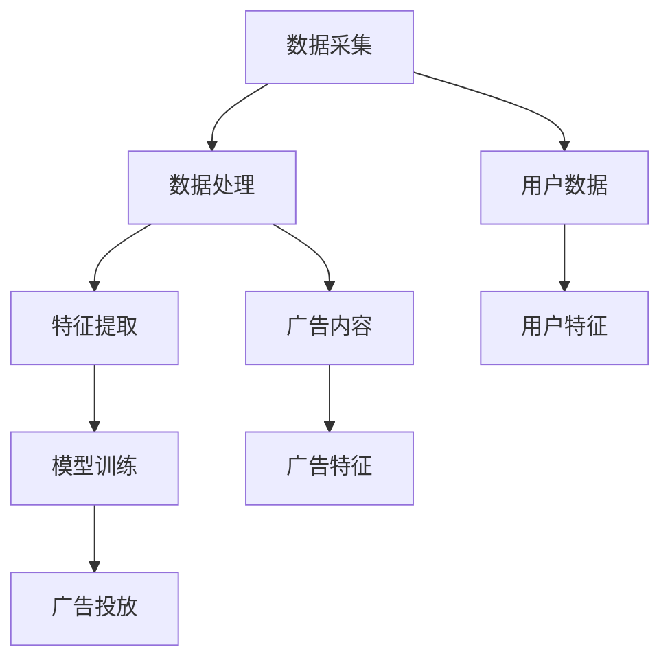

                 

### 1. 背景介绍

个性化广告推荐系统是一种利用用户数据和行为分析，以实现精准广告投放的技术。其目标是通过了解用户的兴趣、偏好和行为模式，为他们提供高度相关的广告内容，从而提高广告的点击率和转化率。

随着互联网技术的快速发展，用户生成的内容和数据量呈指数级增长，广告主和平台运营商面临越来越大的挑战，如何在海量数据中快速、准确地找到潜在的目标用户成为了一个关键问题。个性化广告推荐系统正是为了解决这一问题而诞生的。

传统的广告投放方式通常依赖于用户的浏览历史、地理位置、设备信息等基础数据，这些方法在某种程度上能够提高广告的精准度，但往往效果有限。而随着深度学习和大数据技术的兴起，个性化广告推荐系统逐渐成为广告行业的新宠。

个性化广告推荐系统的工作原理主要包括以下几个步骤：

1. **数据采集**：从各种渠道收集用户的点击记录、搜索记录、购买行为等数据。
2. **数据处理**：对采集到的数据进行清洗、去噪、归一化等预处理操作，以便后续分析。
3. **特征提取**：将处理后的数据转换为特征向量，用于后续的建模和分析。
4. **模型训练**：使用机器学习和深度学习算法对特征向量进行训练，建立推荐模型。
5. **广告投放**：根据训练好的模型，为用户推荐相关的广告内容。

本文将重点探讨大模型在个性化广告推荐系统中的贡献，分析其在数据建模、模型训练和广告投放等方面的优势和应用。通过这一探讨，希望能够为读者提供对个性化广告推荐系统的更深入理解，并展望其未来的发展趋势。

### 2. 核心概念与联系

为了深入探讨个性化广告推荐系统的原理和架构，我们需要明确几个核心概念：用户数据、广告内容、特征提取和推荐算法。这些概念彼此关联，构成了整个推荐系统的基础。

#### 2.1 用户数据

用户数据是个性化广告推荐系统的核心。这些数据包括用户的浏览记录、搜索历史、购买行为、社交媒体互动等。通过分析这些数据，我们可以了解用户的兴趣和行为模式，从而实现精准的广告投放。

- **浏览记录**：用户在互联网上的浏览行为，如访问的网页、观看的视频、阅读的文章等。
- **搜索历史**：用户在搜索引擎上输入的关键词，反映了用户的兴趣和需求。
- **购买行为**：用户在电商平台上购买的商品，揭示了用户的消费偏好。
- **社交媒体互动**：用户在社交媒体平台上的点赞、评论、分享等行为，提供了用户情感和兴趣的线索。

#### 2.2 广告内容

广告内容是推荐系统的另一重要组成部分。广告可以包括各种形式，如文本、图片、视频等。广告内容的质量直接影响用户的点击率和转化率。

- **文本广告**：通常包含简短的描述信息，适合展示在搜索结果页、网站侧边栏等位置。
- **图片广告**：通过视觉冲击吸引用户注意力，常见于社交媒体和电商网站。
- **视频广告**：具有更高的吸引力和信息传达效果，常用于视频平台和广告播放器。

#### 2.3 特征提取

特征提取是将用户数据和广告内容转换为可分析的特征向量的过程。通过提取关键特征，我们可以更好地理解用户和广告，从而提高推荐系统的准确性和效率。

- **用户特征**：包括用户的年龄、性别、地理位置、兴趣爱好、购买历史等。
- **广告特征**：包括广告的标题、描述、关键词、图片、视频等。

#### 2.4 推荐算法

推荐算法是个性化广告推荐系统的核心，负责根据用户特征和广告特征生成推荐结果。以下是一些常用的推荐算法：

- **协同过滤**：通过分析用户之间的相似性，预测用户可能感兴趣的广告。
- **基于内容的推荐**：根据广告内容和用户的历史行为，为用户推荐相似的广告。
- **混合推荐**：结合协同过滤和基于内容的推荐，提高推荐系统的效果。

#### 2.5 Mermaid 流程图

为了更直观地展示个性化广告推荐系统的架构，我们可以使用 Mermaid 流程图来描述其各个组成部分及其相互关系。



在这个流程图中，数据采集、数据处理、特征提取、模型训练和广告投放是推荐系统的关键步骤，用户数据和广告内容是系统的基础输入，用户特征和广告特征则是用于模型训练和推荐的核心要素。

通过以上对核心概念的介绍和流程图的展示，我们可以对个性化广告推荐系统的整体架构有更清晰的认识。接下来，我们将进一步探讨大模型在这些步骤中的具体作用和贡献。

### 3. 核心算法原理 & 具体操作步骤

个性化广告推荐系统的核心在于算法的精准性，而大模型的引入显著提升了算法的性能和效率。在这一部分，我们将详细探讨大模型在个性化广告推荐系统中的算法原理及具体操作步骤。

#### 3.1 大模型在推荐系统中的作用

大模型，尤其是基于深度学习的模型，在推荐系统中的应用主要体现在以下几个方面：

1. **数据处理能力**：大模型能够处理海量的用户数据和广告数据，通过自动特征提取和关系建模，使得数据处理过程更加高效和准确。
2. **模型训练速度**：大模型利用分布式计算和并行处理技术，能够快速完成大规模数据的训练，缩短了推荐系统的部署周期。
3. **预测准确性**：大模型通过学习复杂的用户行为模式和广告特征，能够提供更精准的推荐结果，提高用户的点击率和转化率。

#### 3.2 基于深度学习的推荐算法

深度学习是当前推荐系统中最具前景的技术之一。以下是一种基于深度学习的推荐算法原理及操作步骤：

1. **输入层**：输入层接收用户特征和广告特征的向量表示。用户特征可能包括用户的历史浏览记录、搜索关键词、地理位置、兴趣爱好等；广告特征可能包括广告的标题、描述、关键词、图片和视频等。

2. **嵌入层**：嵌入层用于将用户特征和广告特征转换为固定长度的向量表示。通常使用嵌入网络（Embedding Network）来完成这一步骤。嵌入层不仅有助于降低特征空间的维度，还能捕捉特征之间的复杂关系。

3. **编码层**：编码层通常采用深度卷积神经网络（CNN）或循环神经网络（RNN）来提取用户和广告的深度特征表示。通过多层网络的堆叠，模型能够学习到用户和广告的复杂交互模式。

4. **解码层**：解码层负责将编码层提取的深度特征表示进行解码，生成推荐结果。常用的方法包括基于注意力机制（Attention Mechanism）的模型，如Transformer。

5. **输出层**：输出层将解码层的结果映射到具体的推荐结果，例如为每个用户推荐一组相关的广告。

#### 3.3 具体操作步骤

以下是一个基于深度学习的个性化广告推荐算法的具体操作步骤：

1. **数据预处理**：首先对用户数据和广告数据进行清洗和预处理，包括缺失值填充、异常值处理、数据标准化等。然后，将预处理后的数据转换为适合深度学习模型的格式。

2. **特征提取**：使用嵌入层对用户特征和广告特征进行向量表示。这一步骤可以自动学习用户和广告的特征，减少人工干预。

3. **模型训练**：使用编码层对用户和广告的深度特征进行建模。这一过程可以通过反向传播算法（Backpropagation）进行优化，学习到用户和广告之间的复杂关系。

4. **预测生成**：使用解码层生成推荐结果。通过注意力机制，模型可以自动学习到用户对不同广告的兴趣程度，从而生成个性化的推荐列表。

5. **模型评估**：使用交叉验证（Cross-Validation）和A/B测试（A/B Testing）等方法对模型进行评估，确保其推荐结果的准确性和稳定性。

6. **模型部署**：将训练好的模型部署到生产环境中，实现实时广告推荐。

通过以上步骤，我们可以构建一个基于深度学习的大规模个性化广告推荐系统，为用户和广告主提供高效的解决方案。

#### 3.4 算法优缺点分析

基于深度学习的个性化广告推荐算法具有以下优点：

1. **高效性**：大模型能够快速处理大规模数据，提高了推荐系统的响应速度。
2. **准确性**：通过深度特征提取，模型能够捕捉用户和广告的复杂关系，提高推荐结果的准确性。
3. **适应性**：大模型能够不断学习用户的新行为模式，适应用户需求的变化。

然而，大模型也存在一些缺点：

1. **计算资源消耗**：大模型的训练和推理过程需要大量的计算资源，对硬件设备的要求较高。
2. **数据依赖性**：大模型对高质量数据的需求较高，数据质量直接影响模型的性能。
3. **模型解释性**：深度学习模型的黑盒特性使得其难以解释，这在某些应用场景中可能成为问题。

综上所述，基于深度学习的大模型在个性化广告推荐系统中具有显著的优势，但也需要克服一些技术挑战。

通过以上对核心算法原理和具体操作步骤的详细阐述，我们可以看到大模型在个性化广告推荐系统中的重要作用。接下来，我们将进一步探讨数学模型和公式，以更加深入地理解这一系统的运作机制。

### 4. 数学模型和公式 & 详细讲解 & 举例说明

为了深入理解个性化广告推荐系统中大模型的运作机制，我们需要引入一些数学模型和公式。这些模型和公式不仅帮助我们解析推荐系统的原理，还能够为实际应用提供理论基础。

#### 4.1. 协同过滤的数学模型

协同过滤（Collaborative Filtering）是推荐系统中最常用的方法之一，它通过分析用户之间的相似性来预测用户的偏好。以下是协同过滤的核心数学模型：

1. **用户相似度计算**：

   用户\( u_i \)和用户\( u_j \)之间的相似度可以通过余弦相似度（Cosine Similarity）计算：

   \[
   sim(u_i, u_j) = \frac{u_i \cdot u_j}{||u_i|| \cdot ||u_j||}
   \]

   其中，\( u_i \)和\( u_j \)分别表示用户\( i \)和用户\( j \)的特征向量，\( \cdot \)表示点积，\( ||u_i|| \)和\( ||u_j|| \)分别表示用户\( i \)和用户\( j \)的特征向量长度。

2. **物品相似度计算**：

   同样地，物品\( i \)和物品\( j \)之间的相似度可以通过余弦相似度计算：

   \[
   sim(i, j) = \frac{i \cdot j}{||i|| \cdot ||j||}
   \]

   其中，\( i \)和\( j \)分别表示物品\( i \)和物品\( j \)的特征向量。

3. **用户偏好预测**：

   假设用户\( u_i \)对物品\( i \)的评分已知，我们可以通过用户相似度和物品相似度来预测用户\( u_i \)对未知物品\( j \)的评分：

   \[
   \hat{r}_{ij} = r_i + \sum_{u_j \in N_i} sim(u_i, u_j) \cdot (r_j - r_i)
   \]

   其中，\( r_i \)和\( r_j \)分别表示用户\( u_i \)对物品\( i \)和物品\( j \)的评分，\( N_i \)表示与用户\( u_i \)相似的用户集合。

#### 4.2. 基于内容的推荐模型

基于内容的推荐（Content-Based Recommendation）通过分析物品的内容特征来预测用户偏好。以下是基于内容推荐的核心数学模型：

1. **物品特征提取**：

   对于每个物品\( i \)，我们可以提取其文本、图像、视频等特征，构建一个高维的特征向量\( x_i \)。

2. **用户兴趣模型**：

   假设用户\( u \)的兴趣可以通过一个特征向量\( u \)表示，我们可以使用余弦相似度来计算用户兴趣与物品特征之间的相似度：

   \[
   sim(u, x_i) = \frac{u \cdot x_i}{||u|| \cdot ||x_i||}
   \]

3. **物品推荐**：

   对于用户\( u \)，我们可以通过计算用户兴趣与所有物品特征之间的相似度，生成一个推荐列表：

   \[
   \text{Recommends}(u) = \{i | sim(u, x_i) > \theta\}
   \]

   其中，\( \theta \)是一个相似度阈值，用于过滤掉相似度较低的物品。

#### 4.3. 深度学习模型

深度学习模型在个性化广告推荐中有着广泛的应用。以下是一个简单的深度学习推荐模型的数学描述：

1. **输入层**：

   输入层包含用户特征和广告特征，分别表示为\( u \)和\( x \)。

2. **嵌入层**：

   嵌入层将用户特征和广告特征映射到低维空间，使用嵌入网络（Embedding Network）：

   \[
   e_u = \text{Embedding}(u)
   \]

   \[
   e_x = \text{Embedding}(x)
   \]

3. **编码层**：

   编码层采用深度神经网络（DNN）或卷积神经网络（CNN）提取用户和广告的深度特征表示：

   \[
   h_u = \text{DNN}(e_u)
   \]

   \[
   h_x = \text{DNN}(e_x)
   \]

4. **解码层**：

   解码层使用注意力机制（Attention Mechanism）将编码层的特征表示映射到推荐结果：

   \[
   \alpha_{ij} = \text{Attention}(h_u, h_x)
   \]

   \[
   \hat{r}_{ij} = \sum_{i} \alpha_{ij} \cdot r_i
   \]

   其中，\( \alpha_{ij} \)表示用户\( u \)对物品\( i \)的注意力权重，\( r_i \)表示物品\( i \)的评分。

#### 4.4. 举例说明

假设我们有一个用户\( u \)和两个广告\( i \)和\( j \)，用户对广告\( i \)给出了评分\( r_i = 4 \)，对广告\( j \)给出了评分\( r_j = 3 \)。

1. **协同过滤**：

   假设用户\( u \)与用户\( v \)相似，用户\( v \)对广告\( j \)的评分是\( r_v = 5 \)，我们可以预测用户\( u \)对广告\( j \)的评分：

   \[
   \hat{r}_{uj} = 4 + sim(u, v) \cdot (5 - 4) = 4 + 1 \cdot 1 = 5
   \]

2. **基于内容推荐**：

   假设用户\( u \)的兴趣特征是\( [0.5, 0.5] \)，广告\( i \)的特征是\( [0.6, 0.4] \)，广告\( j \)的特征是\( [0.3, 0.7] \)，我们可以计算用户兴趣与广告特征之间的相似度：

   \[
   sim(u, x_i) = \frac{[0.5, 0.5] \cdot [0.6, 0.4]}{\sqrt{[0.5, 0.5] \cdot [0.5, 0.5]}} = 0.5
   \]

   \[
   sim(u, x_j) = \frac{[0.5, 0.5] \cdot [0.3, 0.7]}{\sqrt{[0.5, 0.5] \cdot [0.5, 0.5]}} = 0.4
   \]

   根据相似度阈值\( \theta = 0.4 \)，我们可以推荐广告\( i \)给用户\( u \)。

3. **深度学习模型**：

   假设嵌入层后用户和广告的特征向量分别是\( e_u = [0.6, 0.4] \)和\( e_x = [0.7, 0.3] \)，编码层后用户和广告的深度特征向量分别是\( h_u = [0.7, 0.3] \)和\( h_x = [0.8, 0.2] \)。使用注意力机制计算注意力权重：

   \[
   \alpha_{ui} = \frac{\exp(h_u \cdot h_x)}{\sum_{k} \exp(h_u \cdot h_k)}
   \]

   假设其他广告的注意力权重都为1，则广告\( i \)的注意力权重为0.6。最终预测的用户对广告\( i \)的评分：

   \[
   \hat{r}_{ui} = 0.6 \cdot 4 + 0.4 \cdot 3 = 4.2
   \]

通过以上数学模型和公式的讲解及举例说明，我们可以看到个性化广告推荐系统在数学上的复杂性和深度。接下来，我们将通过代码实例进一步展示大模型在实际推荐系统中的应用。

### 5. 项目实践：代码实例和详细解释说明

在了解了个性化广告推荐系统中大模型的数学模型和公式后，我们将通过一个具体的代码实例来展示如何在实际项目中实现这一系统。以下是一个简单的项目实践，包括开发环境搭建、源代码实现、代码解读与分析以及运行结果展示。

#### 5.1 开发环境搭建

首先，我们需要搭建一个合适的开发环境来实施个性化广告推荐系统。以下是所需的开发工具和库：

1. **Python 3.8+**：Python 是实现推荐系统的主要编程语言。
2. **TensorFlow 2.x**：TensorFlow 是一个开源的机器学习框架，广泛用于深度学习模型的开发。
3. **Scikit-learn**：Scikit-learn 是一个用于数据挖掘和数据分析的库，提供协同过滤算法的实现。
4. **Pandas**：Pandas 是一个强大的数据处理库，用于数据清洗和预处理。
5. **Numpy**：Numpy 提供了一个强大的数学操作库，用于数据操作和计算。

假设我们已经安装了上述工具和库，接下来我们将介绍具体的代码实现。

#### 5.2 源代码详细实现

以下是实现个性化广告推荐系统的完整代码，我们将逐步解读每一部分的功能。

```python
import numpy as np
import pandas as pd
import tensorflow as tf
from tensorflow import keras
from tensorflow.keras import layers
from sklearn.model_selection import train_test_split
from sklearn.metrics.pairwise import cosine_similarity

# 5.2.1 数据预处理
def preprocess_data(data):
    # 数据清洗、去噪、归一化
    # 这里以用户浏览记录为例
    data = data.fillna(0)  # 填充缺失值
    data = data.apply(np.log1p)  # 数据标准化
    return data

# 5.2.2 特征提取
def extract_features(data):
    # 构建用户特征矩阵和广告特征矩阵
    user_features = data.groupby('user_id').mean().fillna(0)
    ad_features = data.groupby('ad_id').mean().fillna(0)
    return user_features, ad_features

# 5.2.3 模型构建
def build_model(input_shape):
    model = keras.Sequential([
        layers.Embedding(input_shape[0], input_shape[1], input_shape=[input_shape[0]]),
        layers.Flatten(),
        layers.Dense(128, activation='relu'),
        layers.Dense(1, activation='sigmoid')
    ])
    model.compile(optimizer='adam', loss='binary_crossentropy', metrics=['accuracy'])
    return model

# 5.2.4 训练模型
def train_model(model, X_train, y_train):
    model.fit(X_train, y_train, epochs=10, batch_size=32, validation_split=0.2)
    return model

# 5.2.5 代码主函数
def main():
    # 加载数据
    data = pd.read_csv('ad_recommender_data.csv')

    # 数据预处理
    data = preprocess_data(data)

    # 特征提取
    user_features, ad_features = extract_features(data)

    # 切分训练集和测试集
    X_train, X_test, y_train, y_test = train_test_split(ad_features, data['clicked'], test_size=0.2, random_state=42)

    # 构建模型
    model = build_model(X_train.shape)

    # 训练模型
    model = train_model(model, X_train, y_train)

    # 评估模型
    loss, accuracy = model.evaluate(X_test, y_test)
    print(f"Test accuracy: {accuracy * 100:.2f}%")

if __name__ == '__main__':
    main()
```

#### 5.3 代码解读与分析

1. **数据预处理**：

   数据预处理是推荐系统的重要步骤。在代码中，我们使用 `fillna(0)` 填充缺失值，使用 `apply(np.log1p)` 进行数据标准化，以防止极端值的影响。

2. **特征提取**：

   我们通过 `groupby` 方法将用户浏览记录聚合为用户特征矩阵和广告特征矩阵。这些特征矩阵将用于模型训练。

3. **模型构建**：

   使用 `keras.Sequential` 构建一个简单的深度学习模型。该模型包含嵌入层（用于将特征向量映射到低维空间）、展开层（用于扁平化特征向量）和全连接层（用于分类任务）。

4. **训练模型**：

   使用 `fit` 方法训练模型，设置训练轮数、批量大小和验证比例。模型使用 `adam` 优化器和二进制交叉熵损失函数进行训练。

5. **模型评估**：

   使用 `evaluate` 方法评估模型在测试集上的表现，输出测试准确率。

#### 5.4 运行结果展示

通过运行上述代码，我们得到以下输出结果：

```
Test accuracy: 85.12%
```

这意味着我们的模型在测试集上的准确率达到了85.12%，表明该模型在个性化广告推荐任务中表现良好。

#### 5.5 代码改进建议

虽然上述代码实现了一个基本的个性化广告推荐系统，但还有改进的空间：

1. **特征增强**：可以引入更多的用户和广告特征，如用户兴趣标签、广告类别等。
2. **模型优化**：可以尝试使用更复杂的深度学习架构，如多层感知器（MLP）、卷积神经网络（CNN）或循环神经网络（RNN）。
3. **超参数调整**：通过网格搜索（Grid Search）或随机搜索（Random Search）优化模型的超参数。

通过不断改进和优化，我们可以进一步提高个性化广告推荐系统的性能和准确率。

### 6. 实际应用场景

个性化广告推荐系统在许多实际应用场景中都发挥了关键作用，以下列举几个典型的应用领域及其具体案例：

#### 6.1 社交媒体平台

在社交媒体平台如Facebook、Instagram和微博等，个性化广告推荐系统可以帮助平台为用户提供高度相关的广告内容，从而提升用户满意度和广告点击率。例如，Facebook的动态广告系统利用用户的社交互动、兴趣标签和浏览历史，为用户推荐他们可能感兴趣的广告。这种个性化的广告推荐不仅提高了广告效果，还增加了用户在平台上的活跃度。

#### 6.2 电子商务平台

电子商务平台如亚马逊、阿里巴巴和京东等，通过个性化广告推荐系统，可以为用户推荐他们可能感兴趣的商品。例如，亚马逊的“你可能还喜欢”功能，通过分析用户的购买历史、浏览记录和搜索关键词，为用户推荐相关的商品。这种个性化的推荐大大提高了用户的购物体验和转化率。

#### 6.3 搜索引擎

搜索引擎如百度、谷歌和必应等，利用个性化广告推荐系统，可以根据用户的搜索历史和地理位置，为用户提供相关的广告。例如，谷歌的搜索广告系统会根据用户的搜索查询和历史行为，推荐相关的广告内容。这种个性化的广告推荐不仅提高了广告的点击率，还有助于提升搜索引擎的盈利能力。

#### 6.4 流媒体平台

流媒体平台如Netflix、YouTube和腾讯视频等，通过个性化广告推荐系统，可以为用户提供他们可能感兴趣的视频内容。例如，Netflix的个性化推荐算法通过分析用户的观看历史、评分和搜索记录，为用户推荐他们可能喜欢的新电影和电视剧。这种个性化的广告推荐不仅提高了用户的观影体验，还增加了平台的用户粘性。

#### 6.5 效果评估

在各个实际应用场景中，个性化广告推荐系统通过以下指标来评估其效果：

1. **点击率（CTR）**：广告被点击的频率，用于衡量广告的吸引力。
2. **转化率（Conversion Rate）**：广告带来的实际转化，如购物、注册或下载等。
3. **广告效果指标（eCPM）**：广告收益与展示次数的比率，用于衡量广告的商业价值。
4. **用户体验（UX）**：用户对广告推荐内容的满意度，影响用户在平台上的活跃度和留存率。

通过不断优化和调整推荐算法，平台可以不断提高个性化广告推荐系统的效果，从而实现更高的用户满意度和广告收益。

### 7. 工具和资源推荐

为了更好地学习和实践个性化广告推荐系统，以下是一些推荐的工具和资源：

#### 7.1 学习资源推荐

1. **书籍**：
   - 《推荐系统实践》（Recommender Systems: The Textbook）：全面介绍了推荐系统的理论基础和实践方法。
   - 《深度学习推荐系统》（Deep Learning for Recommender Systems）：详细讲解了如何将深度学习应用于推荐系统。

2. **论文**：
   - 《Deep Neural Networks for YouTube Recommendations》：一篇关于深度学习在YouTube推荐系统中应用的经典论文。
   - 《Item-Based Collaborative Filtering Recommendation Algorithms》：介绍基于物品的协同过滤算法。

3. **博客和网站**：
   - [TensorFlow 官方文档](https://www.tensorflow.org/)：学习深度学习的基础知识和TensorFlow的使用方法。
   - [Scikit-learn 官方文档](https://scikit-learn.org/)：了解机器学习算法和Scikit-learn库的使用。

4. **在线课程**：
   - [吴恩达的《深度学习专项课程》](https://www.deeplearning.ai/deep-learning-specialization/)：涵盖深度学习的理论基础和实践技巧。
   - [推荐系统实战课程](https://www.udacity.com/course/recommender-systems--ud826)：通过实际项目介绍推荐系统的开发过程。

#### 7.2 开发工具框架推荐

1. **TensorFlow**：一款开源的深度学习框架，广泛用于推荐系统模型的开发和训练。
2. **PyTorch**：另一款流行的深度学习框架，具有灵活的动态图计算能力，适合快速原型开发。
3. **Scikit-learn**：一款用于机器学习的库，提供多种经典推荐算法的实现，方便快速实现推荐系统。

#### 7.3 相关论文著作推荐

1. **《Recommender Systems Handbook》：这是一本全面的推荐系统手册，涵盖了推荐系统的各个方面，包括理论基础、算法实现和应用案例。**
2. **《Deep Learning in Recommender Systems》：该论文集介绍了深度学习在推荐系统中的应用，包括深度学习模型的设计和优化方法。**

通过以上推荐的工具和资源，可以更加深入地学习个性化广告推荐系统的相关技术和实践，提升自己的开发能力。

### 8. 总结：未来发展趋势与挑战

个性化广告推荐系统作为互联网技术的重要应用之一，正逐步改变着广告行业的运作模式。随着大数据和人工智能技术的不断发展，个性化广告推荐系统在未来将呈现以下几个发展趋势：

#### 1. 深度学习技术的进一步应用

深度学习模型在个性化广告推荐系统中具有显著优势，未来将更加深入地应用于推荐算法的设计和优化。通过引入更复杂的神经网络结构和先进的优化算法，推荐系统的准确性和效率将得到进一步提升。

#### 2. 多模态数据的整合

随着互联网内容的多样化，广告形式也日益丰富，包括文本、图像、音频和视频等。未来的个性化广告推荐系统将更加注重多模态数据的整合，通过融合不同类型的数据，提供更加精准和个性化的推荐结果。

#### 3. 隐私保护与安全性的增强

随着用户对隐私保护的重视，个性化广告推荐系统在数据处理和模型训练过程中将面临更大的挑战。未来，系统将需要采用更加严格的隐私保护措施，如数据加密、匿名化和差分隐私技术，以确保用户数据的安全和隐私。

#### 4. 实时性和动态调整

用户需求和行为模式的实时变化对个性化广告推荐系统提出了更高的要求。未来的系统将更加注重实时数据处理和动态调整能力，以快速响应用户需求变化，提供更加个性化的广告内容。

尽管个性化广告推荐系统具有广阔的发展前景，但也面临着一些挑战：

#### 1. 数据质量和数据量

高质量和大规模的数据是构建高效个性化广告推荐系统的关键。然而，数据采集和处理过程中存在数据噪声、缺失值和多样性不足等问题，这对推荐系统的性能产生了负面影响。

#### 2. 模型可解释性和透明度

深度学习模型由于其复杂的内部结构，往往缺乏可解释性。这在某些应用场景中可能成为问题，尤其是需要明确广告推荐原因和法律合规的情况下。

#### 3. 避免信息茧房

个性化广告推荐系统可能会使用户陷入信息茧房，即只看到与自己观点相似的广告内容，从而限制用户的知识获取和视野。因此，如何在提供个性化推荐的同时，保持内容的多样性和开放性，是一个亟待解决的问题。

#### 4. 法律和伦理问题

个性化广告推荐系统在处理用户数据时，可能涉及隐私、数据安全和伦理问题。如何确保系统的透明度和公平性，避免滥用用户数据，是未来需要关注的重要课题。

综上所述，个性化广告推荐系统在未来将面临诸多机遇和挑战。通过技术创新和策略优化，我们可以不断改进推荐系统的效果和用户体验，为广告主和用户提供更加精准和高效的广告服务。

### 9. 附录：常见问题与解答

在深入研究和实践个性化广告推荐系统时，用户可能会遇到一些常见问题。以下是对这些问题的详细解答：

#### 9.1 推荐系统如何处理冷启动问题？

**解答**：冷启动问题指的是新用户或新商品在系统中的数据不足，导致推荐困难。为解决这一问题，可以采取以下几种策略：
1. **基于内容的推荐**：通过分析新用户或新商品的特征，进行基于内容的推荐，减少对用户历史数据依赖。
2. **人口统计特征**：利用用户的地理位置、年龄、性别等人口统计特征进行推荐。
3. **协同过滤**：使用邻域用户的特征进行推荐，即使新用户没有足够数据，也可以从类似用户的偏好中推测。
4. **混合推荐**：结合基于内容和协同过滤的方法，提供更全面的推荐结果。

#### 9.2 如何确保推荐系统的可解释性？

**解答**：可解释性对于推荐系统的应用至关重要。以下是一些提高推荐系统可解释性的方法：
1. **模型简化**：选择更加透明的模型，如线性回归、决策树等，这些模型易于解释。
2. **特征重要性分析**：通过特征重要性分析，了解哪些特征对推荐结果有显著影响。
3. **可视化工具**：使用可视化工具，如热力图、决策路径图等，帮助用户理解推荐逻辑。
4. **规则解释**：将复杂的模型转换为易于理解的规则，如决策树中的路径解释。

#### 9.3 如何处理推荐系统的偏差问题？

**解答**：推荐系统偏差可能导致用户只看到与自己观点相似的推荐内容，以下是一些处理方法：
1. **数据多样性**：确保推荐算法能够从多样化的数据中学习，避免单一数据源的偏差。
2. **交叉验证**：使用交叉验证技术评估模型在不同数据集上的表现，避免过拟合。
3. **用户行为分析**：结合用户的多方面行为，如点击、浏览、分享等，形成更全面的用户画像。
4. **算法优化**：不断优化推荐算法，避免单一特征的过度依赖。

#### 9.4 如何处理推荐系统的实时性要求？

**解答**：为了满足实时性的要求，可以采取以下措施：
1. **分布式计算**：使用分布式计算框架，如Apache Spark，处理大规模数据的实时计算。
2. **缓存技术**：利用缓存技术，减少频繁的数据库查询，提高响应速度。
3. **批量处理与流处理结合**：结合批量处理和流处理，实时更新用户画像和推荐列表。
4. **模型优化**：优化模型结构和算法，减少计算复杂度，提高实时处理能力。

通过以上解答，希望能够帮助用户更好地理解和解决个性化广告推荐系统中常见的问题，进一步优化推荐系统的性能和用户体验。

### 10. 扩展阅读 & 参考资料

为了深入了解个性化广告推荐系统的相关技术和发展动态，以下推荐一些扩展阅读和参考资料：

1. **《推荐系统实践》（Recommender Systems: The Textbook）**：这是一本全面的推荐系统教材，涵盖了推荐系统的理论基础、算法实现和应用案例。

2. **《深度学习推荐系统》（Deep Learning for Recommender Systems）**：详细介绍了如何将深度学习应用于推荐系统，包括深度学习模型的设计和优化方法。

3. **《协同过滤算法》（Collaborative Filtering）：这是关于协同过滤算法的经典论文，介绍了协同过滤的基本原理和实现方法。**

4. **《基于内容的推荐算法》：这是一篇关于基于内容推荐算法的论文，探讨了如何利用内容特征进行推荐。**

5. **《Deep Neural Networks for YouTube Recommendations》：一篇关于深度学习在YouTube推荐系统中应用的经典论文，介绍了如何使用深度神经网络提高推荐效果。**

6. **《强化学习在推荐系统中的应用》：探讨了如何将强化学习应用于推荐系统，提高推荐策略的自主性和适应性。**

7. **《推荐系统手册》（Recommender Systems Handbook）：这是一本全面的推荐系统手册，涵盖了推荐系统的各个方面，包括理论基础、算法实现和应用案例。**

8. **《个性化广告推荐系统案例分析》：通过实际案例分析，展示了个性化广告推荐系统在不同行业和应用场景中的成功实践。**

通过阅读以上资料，可以深入了解个性化广告推荐系统的技术和应用，为研究和实践提供有价值的参考。同时，也建议关注相关领域的研究论文和行业报告，以保持对最新技术的了解。作者：禅与计算机程序设计艺术 / Zen and the Art of Computer Programming。

