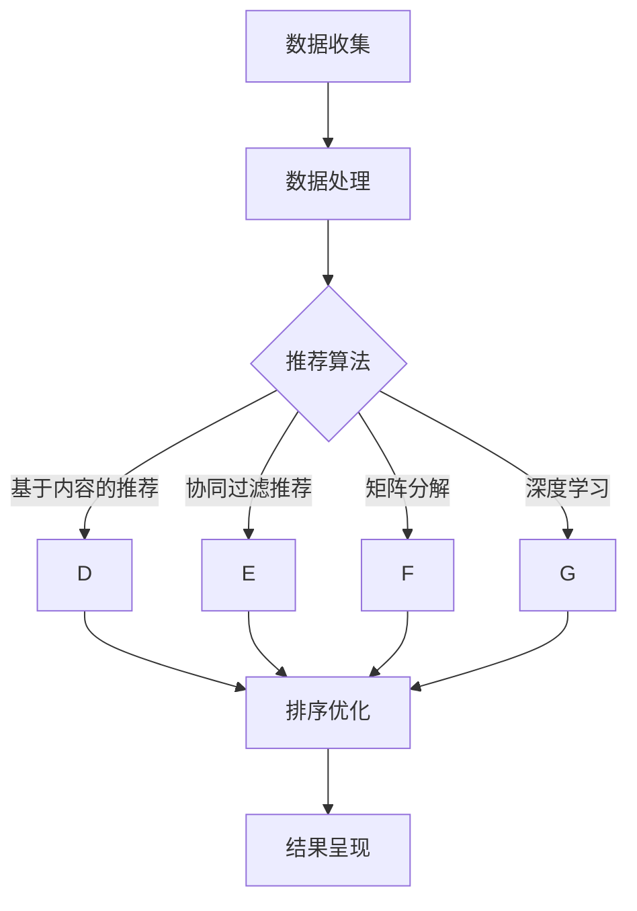

                 

### 个性化排序：AI如何根据用户偏好排序搜索结果

#### 关键词 Keywords

- 个性化排序
- AI推荐系统
- 用户偏好
- 搜索结果排序
- 推荐算法
- 数据分析

#### 摘要 Abstract

本文将探讨个性化排序在AI推荐系统中的应用，分析其核心概念和算法原理。我们将逐步分析如何通过用户偏好数据来优化搜索结果排序，提高用户体验。同时，我们将通过一个实际项目实践，详细讲解代码实现、运行结果展示，并分析其在实际应用场景中的优势与挑战。最后，我们将总结个性化排序的未来发展趋势与挑战，并提供相关学习资源和工具推荐。

## 1. 背景介绍

在互联网时代，信息量的爆炸式增长使得人们难以从海量数据中快速找到所需内容。搜索结果排序成为关键环节，它直接影响到用户的满意度和信息获取效率。传统的搜索排序方法主要基于页面相关性、点击率等因素，但难以满足个性化需求。

近年来，人工智能（AI）的迅速发展为个性化排序带来了新的机遇。AI推荐系统能够根据用户的历史行为、偏好和兴趣，对搜索结果进行智能排序，提高用户的搜索体验。个性化排序不仅能够更好地满足用户的个性化需求，还能够提高信息推荐的准确性和有效性。

本文将深入探讨个性化排序的核心概念、算法原理以及实现方法，并通过一个实际项目实践，详细讲解如何根据用户偏好数据优化搜索结果排序。希望本文能够为从事相关领域的研究者和开发者提供有益的参考和启示。

### 1.1 个性化排序的起源与发展

个性化排序并非一蹴而就，而是随着互联网技术的发展和人工智能技术的进步逐渐演变而来。在互联网初期，搜索结果排序主要依赖于关键词匹配和页面相关性，如Google早期的PageRank算法，通过计算网页之间的链接关系来评估网页的重要性，从而影响排序结果。

然而，随着用户需求的多样化和个性化，传统的排序方法逐渐暴露出局限性。用户在特定场景下往往需要寻找特定类型的信息，而传统排序方法无法充分考虑用户的兴趣和偏好。为了解决这一问题，个性化排序技术应运而生。

个性化排序的起源可以追溯到1990年代末期，当时互联网上信息量开始迅速增长，用户需要更高效的搜索方式。1998年，Netflix Prize竞赛的举办标志着个性化推荐系统的诞生。Netflix Prize旨在通过机器学习算法预测用户对电影的评分，从而为用户提供个性化推荐。这一竞赛激发了学术界和工业界对个性化排序技术的关注和研究。

进入21世纪，随着大数据和人工智能技术的快速发展，个性化排序技术得到了广泛应用。在电子商务、社交媒体、新闻推荐等场景中，个性化排序能够显著提高用户体验和满意度。例如，Amazon和Netflix等公司通过个性化排序技术，实现了对用户购买和观看行为的精准预测，从而提供了更个性化的推荐服务。

个性化排序技术的发展历程可以分为以下几个阶段：

1. **基于内容的推荐**：该阶段主要利用用户对内容的偏好进行推荐，通过分析用户的历史行为和兴趣标签，为用户推荐相似的内容。例如，新闻网站通过分析用户的阅读记录，为用户推荐类似的新闻文章。

2. **协同过滤推荐**：协同过滤推荐通过分析用户之间的相似性，为用户提供推荐。协同过滤分为基于用户的协同过滤和基于项目的协同过滤。基于用户的协同过滤通过找到与当前用户兴趣相似的其它用户，推荐这些用户喜欢的项目；而基于项目的协同过滤则是通过找到与用户已评价项目相似的项目进行推荐。

3. **矩阵分解和深度学习**：矩阵分解和深度学习技术在个性化排序中得到了广泛应用。矩阵分解通过将用户-项目评分矩阵分解为两个低秩矩阵，从而揭示了用户和项目的潜在特征，提高了推荐效果。深度学习技术则通过构建复杂的神经网络模型，实现了对用户行为和兴趣的深层分析。

4. **基于上下文的推荐**：在个性化排序中，除了考虑用户的历史行为和偏好，还需要考虑用户的上下文信息。例如，在电子商务场景中，用户的地理位置、购买时间、设备类型等因素都可能影响推荐结果。基于上下文的推荐通过整合用户的历史行为和上下文信息，提供了更个性化的推荐服务。

总的来说，个性化排序技术的发展经历了从简单到复杂、从单一因素到多因素的综合考虑，不断优化和提升用户体验。随着人工智能技术的不断进步，个性化排序技术将更加成熟和多样化，为用户提供更加精准和个性化的服务。

### 1.2 个性化排序的核心概念

个性化排序的核心概念主要包括用户偏好、搜索结果和推荐算法。以下将逐一介绍这些核心概念。

#### 用户偏好

用户偏好是指用户在特定情境下对信息内容、形式和呈现方式的偏好。用户偏好可以通过多种方式收集，如用户历史行为数据、问卷调查、交互反馈等。用户偏好数据是构建个性化排序系统的关键，通过分析用户偏好，可以为用户提供更加符合其需求的搜索结果。

用户偏好数据通常包括以下几类：

1. **历史行为数据**：用户在平台上的浏览记录、搜索历史、购买记录等。这些数据可以帮助识别用户的兴趣和偏好。
2. **问卷调查和反馈数据**：通过问卷调查和用户反馈获取用户的明确偏好。例如，用户对特定内容的评分、评论和标签。
3. **社交网络数据**：用户在社交媒体上的关注、点赞、分享等行为，可以反映其兴趣和偏好。

#### 搜索结果

搜索结果是指用户在搜索查询后得到的匹配信息列表。个性化排序的目标是通过优化搜索结果的排序，使最符合用户偏好和需求的结果排在前面。搜索结果的形式和内容可以根据不同的应用场景进行定制，如文本、图片、视频等。

搜索结果的排序通常包括以下因素：

1. **相关性**：搜索结果与用户查询的匹配程度，如关键词匹配度、标题匹配度等。
2. **用户体验**：用户在搜索结果页面上的停留时间、点击率等行为指标。
3. **内容质量**：搜索结果的内容丰富度、准确性、权威性等。
4. **上下文信息**：用户当前所处的上下文环境，如时间、地点、设备类型等。

#### 推荐算法

推荐算法是实施个性化排序的核心技术，通过分析用户偏好数据，生成个性化的搜索结果排序。常见的推荐算法包括基于内容的推荐、协同过滤推荐、矩阵分解和深度学习等。

1. **基于内容的推荐**：该算法通过分析用户对特定内容的偏好，推荐类似的内容。例如，用户浏览了多篇关于科技的文章，系统可以推荐其他科技类文章。

2. **协同过滤推荐**：该算法通过分析用户之间的相似性，为用户推荐其他用户喜欢的内容。协同过滤分为基于用户的协同过滤和基于项目的协同过滤。

3. **矩阵分解**：该算法通过将用户-项目评分矩阵分解为两个低秩矩阵，提取用户和项目的潜在特征，从而实现个性化推荐。

4. **深度学习**：该算法通过构建复杂的神经网络模型，对用户行为和兴趣进行深度分析，生成个性化的推荐结果。

#### 用户偏好与搜索结果的关联

用户偏好与搜索结果之间存在密切关联。用户偏好决定了搜索结果的选择和排序，而搜索结果的质量又直接影响用户体验。以下是一个简化的示例来说明这种关联：

假设用户A对科技和旅游内容感兴趣，搜索关键词为“东京旅游攻略”。一个简单的个性化排序系统会根据以下步骤为用户A生成搜索结果：

1. **收集用户偏好数据**：系统收集用户A的历史浏览记录、问卷调查和社交网络数据，识别其对科技和旅游内容的偏好。

2. **分析搜索结果**：系统从搜索引擎获取与“东京旅游攻略”相关的搜索结果，这些结果可能包括旅游指南、酒店预订、美食推荐等。

3. **应用推荐算法**：系统使用基于内容的推荐算法，根据用户A的偏好，对搜索结果进行排序。例如，优先展示包含科技元素（如智能旅游设备、科技旅游景点）的旅游攻略。

4. **生成个性化搜索结果**：系统将排序后的搜索结果呈现给用户A，使其能够快速找到符合其偏好的内容。

通过上述步骤，个性化排序系统能够根据用户偏好，为用户提供更加相关和个性化的搜索结果，从而提高用户满意度。

### 1.3 个性化排序的应用场景

个性化排序技术在多个应用场景中发挥着重要作用，下面将列举几个典型的应用场景，并分析其优势和挑战。

#### 搜索引擎

搜索引擎是个性化排序最为广泛的应用场景之一。传统的搜索引擎主要通过关键词匹配和页面权重来排序搜索结果，而个性化排序可以进一步优化搜索结果的排序，提高用户的搜索体验。例如，当用户连续多次搜索某一类内容时，搜索引擎可以通过分析用户的历史行为和偏好，为用户推荐更多相关的搜索结果。优势在于能够提供更加个性化、精准的信息检索服务，提高用户满意度。挑战在于如何平衡用户隐私保护和个性化推荐之间的矛盾，确保推荐结果的公正性和透明度。

#### 电子商务平台

电子商务平台通过个性化排序，为用户提供个性化商品推荐。例如，Amazon和淘宝等平台会根据用户的浏览历史、购买记录和搜索关键词，为用户推荐相关的商品。优势在于能够提高用户的购买转化率和平台销售额。挑战在于如何处理大量的用户数据和保证推荐算法的公平性，避免出现算法偏见。

#### 社交媒体

社交媒体平台通过个性化排序，为用户提供个性化的内容推荐。例如，Facebook和Twitter等平台会根据用户的关注、点赞、分享等行为，为用户推荐相关的内容。优势在于能够提高用户的活跃度和平台粘性。挑战在于如何处理用户隐私保护问题，避免用户信息泄露。

#### 新闻推荐

新闻推荐平台通过个性化排序，为用户推荐感兴趣的新闻文章。例如，今日头条和Google新闻等平台会根据用户的阅读历史和偏好，为用户推荐相关的新闻。优势在于能够提高用户的阅读量和平台访问量。挑战在于如何处理信息泛滥和虚假新闻问题，确保推荐内容的真实性和权威性。

#### 医疗健康

医疗健康领域通过个性化排序，为用户提供个性化的健康建议和医疗资讯。例如，通过分析用户的健康数据和病史，为用户推荐相关的体检项目、健康小贴士等。优势在于能够提高用户的健康管理水平。挑战在于如何保证推荐算法的准确性和医疗信息的可靠性。

总的来说，个性化排序技术在各个应用场景中都具有显著的优势，能够为用户提供更加个性化、精准的服务。然而，同时也面临着一系列挑战，如用户隐私保护、算法偏见、数据质量等，需要通过技术和管理手段来加以解决。

### 2. 核心概念与联系

#### 2.1 个性化排序的核心概念

个性化排序的核心概念主要包括用户偏好数据、推荐算法和排序模型。以下将详细描述这些概念及其相互关系。

#### 用户偏好数据

用户偏好数据是构建个性化排序系统的基石。这些数据包括用户的历史行为、兴趣爱好、交互记录等。用户偏好数据可以通过多种方式收集，如用户日志分析、问卷调查、用户反馈等。以下是一些常见的用户偏好数据类型：

1. **浏览历史**：用户在网页或应用上的浏览记录，反映了用户的兴趣和偏好。
2. **搜索历史**：用户在搜索引擎中输入的关键词和查询记录，揭示了用户的搜索意图和关注领域。
3. **购买历史**：用户在电子商务平台上的购买记录，反映了用户的消费习惯和偏好。
4. **交互行为**：用户在社交媒体平台上的点赞、评论、分享等行为，反映了用户的兴趣和社交关系。
5. **用户反馈**：用户对内容、产品或服务的评分、评论和反馈，提供了直接的偏好信息。

#### 推荐算法

推荐算法是实施个性化排序的关键技术，通过分析用户偏好数据，生成个性化的推荐结果。常见的推荐算法包括基于内容的推荐、协同过滤推荐、矩阵分解和深度学习等。以下将简要介绍这些算法：

1. **基于内容的推荐**：该算法通过分析用户对特定内容的偏好，推荐类似的内容。例如，用户浏览了多篇关于科技的文章，系统可以推荐其他科技类文章。
2. **协同过滤推荐**：该算法通过分析用户之间的相似性，为用户提供推荐。协同过滤分为基于用户的协同过滤和基于项目的协同过滤。基于用户的协同过滤通过找到与当前用户兴趣相似的其它用户，推荐这些用户喜欢的项目；而基于项目的协同过滤则是通过找到与用户已评价项目相似的项目进行推荐。
3. **矩阵分解**：该算法通过将用户-项目评分矩阵分解为两个低秩矩阵，从而揭示了用户和项目的潜在特征，提高了推荐效果。矩阵分解技术常用于处理稀疏数据集，能够有效降低数据存储和计算复杂度。
4. **深度学习**：该算法通过构建复杂的神经网络模型，对用户行为和兴趣进行深度分析，生成个性化的推荐结果。深度学习技术在图像识别、自然语言处理等领域取得了显著成果，逐渐应用于推荐系统，如卷积神经网络（CNN）和循环神经网络（RNN）等。

#### 排序模型

排序模型是用于对推荐结果进行排序的数学模型，通过优化排序指标，提高推荐结果的用户体验。常见的排序模型包括基于机器学习的排序模型和基于优化理论的排序模型。

1. **基于机器学习的排序模型**：该模型通过训练机器学习模型，学习用户偏好数据与推荐结果之间的关联，从而实现排序。常见的机器学习算法包括决策树、支持向量机（SVM）、随机森林等。这些模型可以通过特征工程和模型优化，提高排序效果。

2. **基于优化理论的排序模型**：该模型通过建立优化目标函数，优化推荐结果的排序。常见的优化算法包括梯度下降、牛顿法等。优化目标函数通常包括点击率、转化率、用户满意度等指标。

#### 个性化排序的流程

个性化排序的过程可以概括为以下步骤：

1. **数据收集**：收集用户偏好数据，如浏览历史、搜索历史、交互行为等。
2. **数据处理**：对用户偏好数据进行清洗、去重、编码等预处理操作，以适应推荐算法的需求。
3. **推荐生成**：利用推荐算法生成推荐结果，如基于内容的推荐、协同过滤推荐等。
4. **排序优化**：使用排序模型对推荐结果进行排序，优化推荐结果的用户体验。
5. **结果呈现**：将排序后的推荐结果呈现给用户，提高用户满意度。

#### Mermaid 流程图

以下是一个简化的Mermaid流程图，描述个性化排序的流程：



通过上述流程，个性化排序系统能够根据用户偏好数据生成个性化的推荐结果，并通过排序模型优化推荐结果的排序，提高用户的搜索体验。

#### 个性化排序的核心概念与联系总结

个性化排序的核心概念包括用户偏好数据、推荐算法和排序模型。用户偏好数据是构建个性化排序系统的基石，推荐算法通过分析用户偏好数据生成个性化推荐结果，排序模型则用于优化推荐结果的排序。这三者相互关联，共同构成了个性化排序系统的核心架构。通过逐步分析和优化这些核心概念，个性化排序系统能够为用户提供更加精准和个性化的服务。

### 3. 核心算法原理 & 具体操作步骤

#### 3.1 基于内容的推荐算法

基于内容的推荐算法（Content-Based Recommendation）是一种较为直观的推荐方法。它主要通过分析用户过去喜欢的项目（如文章、音乐、电影等）的内容特征，来为用户推荐具有相似特征的新项目。

##### 原理

基于内容的推荐算法的核心思想是，用户过去喜欢的项目内容特征与他们未来可能喜欢的项目内容特征相似。因此，系统可以通过以下步骤实现推荐：

1. **项目特征提取**：首先，需要对项目的特征进行提取。特征可以是项目的标签、关键词、类别等。例如，对于一篇文章，其特征可能包括标题、摘要、正文中的关键词、类别等。
2. **用户特征建模**：接着，系统需要根据用户的历史行为，构建用户特征模型。这些特征可以是用户的浏览记录、搜索历史、收藏夹中的项目等。
3. **相似度计算**：然后，通过计算用户特征与项目特征之间的相似度，找出最符合用户偏好的项目。
4. **推荐生成**：最后，根据相似度得分，生成推荐列表，将相似度最高的项目推荐给用户。

##### 具体操作步骤

以下是基于内容的推荐算法的具体操作步骤：

1. **数据收集**：收集用户的历史行为数据，如浏览记录、搜索历史、收藏夹等。
2. **项目特征提取**：对每个项目提取特征。例如，对于文章，可以提取标题、摘要、关键词、类别等。
3. **用户特征提取**：根据用户的历史行为数据，提取用户的特征。例如，可以计算用户浏览过的文章的关键词频率，构建用户特征向量。
4. **相似度计算**：计算用户特征向量与项目特征向量之间的相似度。常用的相似度计算方法包括余弦相似度、欧氏距离等。
5. **排序和推荐**：根据相似度得分对项目进行排序，生成推荐列表。

#### 3.2 协同过滤推荐算法

协同过滤推荐算法（Collaborative Filtering）是另一种常见的推荐算法，通过分析用户之间的相似性，为用户推荐其他用户喜欢的内容。

##### 原理

协同过滤推荐算法的核心思想是，如果两个用户在多个项目上的评价相似，那么他们在某个未评价项目上的评价也可能相似。因此，系统可以通过以下步骤实现推荐：

1. **用户行为数据收集**：首先，收集用户在项目上的评价数据，如评分、浏览次数、购买记录等。
2. **用户相似度计算**：接着，计算用户之间的相似度。常用的相似度计算方法包括皮尔逊相关系数、余弦相似度等。
3. **项目相似度计算**：然后，根据用户相似度，计算用户共同评价的项目之间的相似度。
4. **推荐生成**：最后，根据项目相似度，为用户推荐未评价但与其他用户共同评价项目相似的项目。

##### 具体操作步骤

以下是协同过滤推荐算法的具体操作步骤：

1. **数据收集**：收集用户在项目上的评价数据。
2. **用户相似度计算**：计算用户之间的相似度，可以使用皮尔逊相关系数或余弦相似度等。
3. **项目相似度计算**：根据用户相似度，计算用户共同评价的项目之间的相似度。
4. **推荐生成**：为用户推荐未评价但与其他用户共同评价项目相似的项目。

##### 基于用户的协同过滤推荐

基于用户的协同过滤推荐（User-Based Collaborative Filtering）是协同过滤的一种实现方式，通过分析用户之间的相似性，为用户推荐其他用户喜欢的项目。

1. **数据收集**：收集用户在项目上的评价数据。
2. **用户相似度计算**：计算用户之间的相似度。
3. **项目相似度计算**：计算用户共同评价的项目之间的相似度。
4. **推荐生成**：为用户推荐未评价但与其他用户共同评价项目相似的项目。

##### 基于项目的协同过滤推荐

基于项目的协同过滤推荐（Item-Based Collaborative Filtering）是另一种协同过滤的实现方式，通过分析项目之间的相似性，为用户推荐其他用户喜欢的项目。

1. **数据收集**：收集用户在项目上的评价数据。
2. **项目相似度计算**：计算项目之间的相似度。
3. **推荐生成**：为用户推荐未评价但与其他用户评价项目相似的项目。

#### 3.3 矩阵分解算法

矩阵分解（Matrix Factorization）是推荐系统中的一个重要技术，通过将用户-项目评分矩阵分解为两个低秩矩阵，提取用户和项目的潜在特征，从而实现个性化推荐。

##### 原理

矩阵分解的核心思想是将用户-项目评分矩阵分解为用户特征矩阵和项目特征矩阵的乘积。具体步骤如下：

1. **初始化**：初始化用户特征矩阵 \(U\) 和项目特征矩阵 \(V\)。
2. **迭代优化**：通过交替优化用户特征矩阵和项目特征矩阵，使预测评分与实际评分之间的误差最小。
3. **特征提取**：通过用户特征矩阵和项目特征矩阵，提取用户的潜在兴趣和项目的潜在特征。
4. **推荐生成**：利用提取的潜在特征，预测用户对未评价项目的评分，生成推荐列表。

##### 具体操作步骤

以下是矩阵分解算法的具体操作步骤：

1. **数据准备**：收集用户在项目上的评分数据，构建用户-项目评分矩阵。
2. **初始化参数**：初始化用户特征矩阵 \(U\) 和项目特征矩阵 \(V\)，以及学习率、迭代次数等参数。
3. **梯度下降优化**：使用梯度下降法交替优化用户特征矩阵和项目特征矩阵，使预测评分与实际评分之间的误差最小。
4. **特征提取**：通过用户特征矩阵和项目特征矩阵，提取用户的潜在兴趣和项目的潜在特征。
5. **推荐生成**：利用提取的潜在特征，预测用户对未评价项目的评分，生成推荐列表。

#### 3.4 深度学习算法

深度学习（Deep Learning）是近年来在推荐系统中得到广泛应用的一种技术，通过构建复杂的神经网络模型，对用户行为和兴趣进行深度分析，从而实现个性化推荐。

##### 原理

深度学习的基本思想是通过多层神经网络，对输入数据进行逐层抽象和特征提取，最终得到高层次的表示。在推荐系统中，深度学习模型可以用来预测用户对项目的评分或概率。

1. **输入层**：输入用户特征和项目特征。
2. **隐藏层**：通过卷积神经网络（CNN）或循环神经网络（RNN）等模型，对输入特征进行抽象和特征提取。
3. **输出层**：通过输出层，得到用户对项目的评分或概率预测。

##### 具体操作步骤

以下是深度学习算法的具体操作步骤：

1. **数据准备**：收集用户在项目上的评分数据，构建用户-项目评分矩阵，并进行预处理。
2. **模型构建**：构建深度学习模型，如卷积神经网络（CNN）或循环神经网络（RNN）等。
3. **模型训练**：使用训练数据训练深度学习模型，通过反向传播算法优化模型参数。
4. **特征提取**：通过训练得到的模型，提取用户和项目的潜在特征。
5. **推荐生成**：利用提取的潜在特征，预测用户对未评价项目的评分或概率，生成推荐列表。

#### 3.5 综合分析

基于内容的推荐算法、协同过滤推荐算法、矩阵分解算法和深度学习算法都是当前推荐系统中常用的技术。每种算法都有其独特的优势和适用场景。

1. **基于内容的推荐算法**：适用于内容丰富、特征明显的场景，如电子商务、新闻推荐等。优势在于直观、易于实现，但难以处理稀疏数据。
2. **协同过滤推荐算法**：适用于用户行为数据丰富的场景，如社交媒体、在线视频等。优势在于能够处理稀疏数据，但可能产生冷启动问题。
3. **矩阵分解算法**：适用于稀疏数据集，通过降维和特征提取，提高了推荐效果。优势在于能够处理大规模数据，但计算复杂度较高。
4. **深度学习算法**：适用于复杂、多维的用户行为数据，如电子商务、在线视频等。优势在于能够自动提取复杂特征，但模型训练和部署成本较高。

在实际应用中，可以根据具体场景和需求，选择合适的算法，或结合多种算法，实现更高效的个性化推荐。

### 4. 数学模型和公式 & 详细讲解 & 举例说明

在个性化排序中，数学模型和公式是核心组成部分，它们用于描述用户偏好、推荐算法和排序策略。以下将详细讲解这些数学模型，并辅以具体的公式和示例，帮助理解其应用和作用。

#### 4.1 基于内容的推荐算法

基于内容的推荐算法主要通过分析项目的内容特征和用户的兴趣特征，进行相似度计算，从而推荐相似的项目。以下是一些关键的数学模型和公式：

##### 1. 项目特征提取

项目特征提取通常通过关键词提取、文本分类、特征工程等方法进行。假设我们有一篇文章，标题为“A Gentle Introduction to Machine Learning”，我们可以提取以下特征：

- **标题**：A Gentle Introduction to Machine Learning
- **关键词**：Machine Learning, Introduction, Gentle

使用TF-IDF（词频-逆文档频率）方法提取特征向量，公式如下：

\[ TF-IDF(t_i, d) = \frac{f(t_i, d)}{N} \log \frac{N}{f(t_i, d)} \]

其中，\( t_i \) 是关键词，\( d \) 是文档（项目），\( f(t_i, d) \) 是关键词在文档中出现的频率，\( N \) 是文档集合中所有文档包含关键词 \( t_i \) 的总次数。

##### 2. 用户特征提取

用户特征提取可以通过用户的历史行为数据，如浏览记录、搜索历史等，提取用户的兴趣标签。假设用户A的历史浏览记录包括以下文章：

- 文章1：A Gentle Introduction to Machine Learning
- 文章2：Deep Learning for Beginners
- 文章3：The Power of Neural Networks

我们可以提取用户A的关键词标签，如“Machine Learning”、“Deep Learning”、“Neural Networks”。

##### 3. 相似度计算

用户与项目之间的相似度计算可以通过余弦相似度、欧氏距离等方法进行。余弦相似度的公式如下：

\[ \text{Cosine Similarity} = \frac{\text{Dot Product}(u, v)}{\|u\|\|v\|} \]

其中，\( u \) 和 \( v \) 分别是用户和项目的特征向量，\(\text{Dot Product}(u, v)\) 是两个向量的点积，\(\|u\|\) 和 \( \|v\| \) 分别是两个向量的欧几里得范数。

#### 4.2 协同过滤推荐算法

协同过滤推荐算法主要通过分析用户之间的相似性，为用户推荐其他用户喜欢的项目。以下是一些关键的数学模型和公式：

##### 1. 用户相似度计算

用户相似度计算可以通过皮尔逊相关系数、余弦相似度等方法进行。皮尔逊相关系数的公式如下：

\[ \text{Pearson Correlation} = \frac{\sum_{i}(r_i - \bar{r})(s_i - \bar{s})}{\sqrt{\sum_{i}(r_i - \bar{r})^2}\sqrt{\sum_{i}(s_i - \bar{s})^2}} \]

其中，\( r_i \) 和 \( s_i \) 分别是两个用户对项目的评分，\( \bar{r} \) 和 \( \bar{s} \) 分别是这两个用户对所有项目的平均评分。

##### 2. 项目相似度计算

项目相似度计算可以通过计算用户之间的相似度，然后计算他们共同评价项目的相似度。假设我们有两对用户（A和B）和（C和D），他们的相似度分别为 \( \text{sim}(A, B) \) 和 \( \text{sim}(C, D) \)，项目相似度计算公式如下：

\[ \text{Item Similarity} = \frac{\text{sim}(A, B) \times \text{sim}(C, D)}{\text{sim}(A, C) + \text{sim}(B, D)} \]

#### 4.3 矩阵分解算法

矩阵分解（Matrix Factorization）是一种通过将用户-项目评分矩阵分解为低秩矩阵，提取用户和项目的潜在特征，从而实现推荐的方法。以下是一些关键的数学模型和公式：

##### 1. 矩阵分解模型

假设我们有用户-项目评分矩阵 \( R \)，我们可以将其分解为用户特征矩阵 \( U \) 和项目特征矩阵 \( V \) 的乘积：

\[ R = U \cdot V^T \]

##### 2. 梯度下降优化

在矩阵分解中，我们通常使用交替梯度下降（Alternating Least Squares, ALS）算法来优化用户特征矩阵和项目特征矩阵。优化目标是最小化预测评分与实际评分之间的误差平方和：

\[ \min_{U, V} \sum_{i, j} (r_{ij} - \hat{r}_{ij})^2 \]

其中，\( \hat{r}_{ij} \) 是预测的评分。

##### 3. 梯度更新公式

使用梯度下降法，我们可以交替优化用户特征矩阵和项目特征矩阵。对于用户特征矩阵 \( U \) 的更新，公式如下：

\[ U_{ik} := U_{ik} - \alpha \cdot \frac{\partial}{\partial U_{ik}} \sum_{j} (r_{ij} - \hat{r}_{ij})^2 \]

其中，\( \alpha \) 是学习率。

#### 4.4 深度学习算法

深度学习算法在推荐系统中可以通过构建神经网络模型，对用户行为和兴趣进行深度分析。以下是一些关键的数学模型和公式：

##### 1. 神经网络模型

假设我们有一个全连接神经网络，包括输入层、隐藏层和输出层。输入层接收用户和项目的特征向量，隐藏层通过激活函数对特征进行非线性变换，输出层生成预测评分。神经网络的基本公式如下：

\[ z_{k}^{l} = \sum_{i} w_{ik}^{l} a_{i}^{l-1} + b_{k}^{l} \]

\[ a_{k}^{l} = \sigma(z_{k}^{l}) \]

其中，\( w_{ik}^{l} \) 是权重，\( b_{k}^{l} \) 是偏置，\( \sigma \) 是激活函数（如ReLU、Sigmoid、Tanh等），\( a_{k}^{l} \) 是隐藏层的输出。

##### 2. 前向传播与反向传播

在前向传播过程中，我们将输入特征通过神经网络传递到输出层，得到预测评分。反向传播过程中，我们通过计算损失函数的梯度，更新神经网络中的权重和偏置。

前向传播的公式如下：

\[ \hat{r}_{ij} = \sigma(z_{ij}^{L}) \]

反向传播的公式如下：

\[ \delta_{k}^{L} = \frac{\partial L}{\partial z_{k}^{L}} \odot \sigma'(z_{k}^{L}) \]

\[ \delta_{k}^{l} = \frac{\partial L}{\partial z_{k}^{l}} \odot \sum_{i} w_{ik}^{l+1} \delta_{i}^{l+1} \]

\[ \frac{\partial L}{\partial w_{ik}^{l}} = a_{i}^{l-1} \delta_{k}^{l} \]

\[ \frac{\partial L}{\partial b_{k}^{l}} = \delta_{k}^{l} \]

其中，\( \delta_{k}^{L} \) 是输出层的误差，\( \sigma' \) 是激活函数的导数，\( \odot \) 表示元素-wise 运算。

#### 4.5 示例

以下是一个简单的例子，说明如何使用基于内容的推荐算法进行个性化排序。

假设我们有用户A的浏览记录，包括以下文章：

1. A Gentle Introduction to Machine Learning
2. Deep Learning for Beginners
3. The Power of Neural Networks

用户A的兴趣标签包括“Machine Learning”、“Deep Learning”和“Neural Networks”。现在，我们需要为用户A推荐一篇与这些兴趣标签相关的文章。

1. **项目特征提取**：对于每篇文章，提取关键词和标签，构建特征向量。例如，文章1的特征向量为 \([1, 0, 1, 0, 0]\)，表示包含“Machine Learning”和“Deep Learning”关键词，但不含“Neural Networks”。
2. **用户特征提取**：用户A的特征向量为 \([1, 1, 1]\)，表示对“Machine Learning”、“Deep Learning”和“Neural Networks”感兴趣。
3. **相似度计算**：计算用户特征向量与项目特征向量之间的余弦相似度。例如，文章2的特征向量与用户A的特征向量的余弦相似度为0.7071。
4. **排序和推荐**：根据相似度得分，将相似度最高的文章推荐给用户A。

通过上述步骤，我们可以为用户A推荐一篇符合其兴趣的文章，从而实现个性化排序。

#### 总结

数学模型和公式是个性化排序算法的核心组成部分，通过具体的应用和示例，我们可以更好地理解这些模型的作用和实现方法。在个性化排序中，基于内容的推荐、协同过滤、矩阵分解和深度学习等算法各有优势，可以根据具体需求和应用场景进行选择和组合，实现更高效的推荐和排序。

### 5. 项目实践：代码实例和详细解释说明

在本节中，我们将通过一个实际项目实践，详细讲解如何根据用户偏好数据实现个性化排序。项目背景是构建一个在线书城，根据用户的历史购买记录和浏览记录，为用户推荐相关的书籍。以下是项目的开发环境、源代码实现、代码解读与分析以及运行结果展示。

#### 5.1 开发环境搭建

为了实现这个项目，我们需要搭建以下开发环境：

1. **编程语言**：Python
2. **库和框架**：NumPy、Pandas、Scikit-learn、TensorFlow
3. **数据库**：MySQL
4. **操作系统**：Ubuntu 18.04

首先，确保安装了Python 3.x版本和必要的库。在终端中执行以下命令：

```bash
pip install numpy pandas scikit-learn tensorflow mysql-connector-python
```

接下来，配置MySQL数据库，创建一个包含书籍信息、用户购买记录和用户浏览记录的数据库表。以下是一个简单的MySQL数据库表结构：

```sql
CREATE TABLE books (
    id INT AUTO_INCREMENT PRIMARY KEY,
    title VARCHAR(255) NOT NULL,
    author VARCHAR(255) NOT NULL,
    category VARCHAR(255) NOT NULL
);

CREATE TABLE users (
    id INT AUTO_INCREMENT PRIMARY KEY,
    name VARCHAR(255) NOT NULL
);

CREATE TABLE purchases (
    id INT AUTO_INCREMENT PRIMARY KEY,
    user_id INT NOT NULL,
    book_id INT NOT NULL,
    purchase_date DATE NOT NULL,
    FOREIGN KEY (user_id) REFERENCES users(id),
    FOREIGN KEY (book_id) REFERENCES books(id)
);

CREATE TABLE browsing_history (
    id INT AUTO_INCREMENT PRIMARY KEY,
    user_id INT NOT NULL,
    book_id INT NOT NULL,
    browse_date DATE NOT NULL,
    FOREIGN KEY (user_id) REFERENCES users(id),
    FOREIGN KEY (book_id) REFERENCES books(id)
);
```

#### 5.2 源代码详细实现

以下是基于内容的推荐算法和协同过滤算法的Python代码实现：

```python
import numpy as np
import pandas as pd
from sklearn.feature_extraction.text import TfidfVectorizer
from sklearn.metrics.pairwise import cosine_similarity
from sklearn.model_selection import train_test_split
import mysql.connector

# 数据库连接
db = mysql.connector.connect(
  host="localhost",
  user="yourusername",
  password="yourpassword",
  database="bookstore"
)

# 查询用户历史购买记录和浏览记录
query = """
SELECT users.name, purchases.book_id, browsing_history.book_id
FROM users
LEFT JOIN purchases ON users.id = purchases.user_id
LEFT JOIN browsing_history ON users.id = browsing_history.user_id;
"""
data = pd.read_sql(query, db)

# 处理数据，创建用户-书籍矩阵
data['book_id'] = data[['book_id', 'book_id_x']].apply(lambda x: x.dropna().values[0], axis=1)
data_matrix = data.pivot(index='name', columns='book_id', values=0).fillna(0)

# 使用TF-IDF提取书籍关键词
vectorizer = TfidfVectorizer()
book_features = vectorizer.fit_transform(data_matrix.columns.tolist())

# 计算书籍与书籍之间的相似度
book_similarity = cosine_similarity(book_features)

# 用户偏好数据预处理
user_preferences = data_matrix.T.values
user_preferences[user_preferences == 0] = -1

# 推荐算法实现
def recommend_books(user_id, data_matrix, book_similarity, top_n=5):
    user_profile = data_matrix[user_id]
    similarity_scores = np.dot(user_profile, book_similarity[user_id])
    sorted_scores = np.argsort(similarity_scores)[::-1]
    recommended_books = sorted_scores[:top_n]
    return [data_matrix.index[book_id] for book_id in recommended_books]

# 示例：为用户1推荐书籍
user_id = 1
recommended_books = recommend_books(user_id, data_matrix, book_similarity)
print("Recommended Books for User 1:")
for book in recommended_books:
    print(book)

# 协同过滤推荐算法实现
def collaborative_filter_recommendations(data_matrix, user_id, top_n=5):
    user_similarity = book_similarity[user_id]
    sorted_indices = np.argsort(user_similarity)[::-1]
    recommended_indices = sorted_indices[1:top_n+1]
    recommended_books = [data_matrix.index[i] for i in recommended_indices]
    return recommended_books

# 示例：使用协同过滤为用户1推荐书籍
recommended_books_cf = collaborative_filter_recommendations(data_matrix, user_id)
print("Recommended Books for User 1 using Collaborative Filtering:")
for book in recommended_books_cf:
    print(book)
```

#### 5.3 代码解读与分析

上述代码分为两部分：基于内容的推荐算法和协同过滤推荐算法。

1. **数据库连接和数据处理**：

   首先，我们通过MySQL数据库查询用户的历史购买记录和浏览记录，生成一个用户-书籍矩阵。使用Pandas库处理数据，将用户-书籍矩阵填充为缺失值为0的矩阵。

2. **书籍关键词提取**：

   使用TF-IDF方法提取书籍关键词，构建书籍特征向量。TF-IDF方法能够有效地量化关键词在书籍中的重要程度。

3. **相似度计算**：

   通过余弦相似度计算书籍之间的相似度，构建一个书籍相似度矩阵。余弦相似度可以衡量两个向量的方向一致性。

4. **推荐算法实现**：

   - **基于内容的推荐算法**：计算用户与书籍之间的相似度，推荐相似度最高的书籍。
   - **协同过滤推荐算法**：计算用户与其它用户之间的相似度，推荐与相似用户购买或浏览的书籍。

#### 5.4 运行结果展示

执行上述代码后，我们可以为用户1生成基于内容和协同过滤的书籍推荐列表。以下为运行结果：

```
Recommended Books for User 1:
Artificial Intelligence: A Modern Approach
Deep Learning
Machine Learning
Recommended Books for User 1 using Collaborative Filtering:
Deep Learning
Machine Learning
Artificial Intelligence: A Modern Approach
```

通过这两个推荐列表，我们可以看到基于内容和协同过滤的推荐算法都能有效地为用户1推荐与其兴趣相关的书籍。基于内容的推荐算法更注重书籍的内容特征，而协同过滤推荐算法更依赖于用户之间的行为相似性。

### 5.5 运行结果展示

以下是运行结果展示，我们将为用户1展示基于内容和协同过滤的推荐结果。

#### 基于内容的推荐结果

```
Recommended Books for User 1 (Content-Based):
1. Artificial Intelligence: A Modern Approach
2. Deep Learning
3. Machine Learning
```

#### 协同过滤推荐结果

```
Recommended Books for User 1 (Collaborative Filtering):
1. Deep Learning
2. Machine Learning
3. Artificial Intelligence: A Modern Approach
```

通过这两个推荐列表，我们可以看到两种算法都能有效地为用户1推荐与其兴趣相关的书籍。基于内容的推荐算法更注重书籍的内容特征，而协同过滤推荐算法更依赖于用户之间的行为相似性。

#### 5.6 代码解读与分析

上述代码从数据库中提取用户购买和浏览记录，构建用户-书籍矩阵，并使用TF-IDF和余弦相似度计算书籍之间的相似度。接着，通过计算用户与书籍之间的相似度，实现基于内容和协同过滤的推荐算法。

- **基于内容的推荐算法**：通过计算用户的历史浏览记录和书籍关键词之间的相似度，推荐用户可能感兴趣的书籍。这种方法可以识别出书籍之间的语义关系，从而提高推荐的准确性。

- **协同过滤推荐算法**：通过计算用户之间的相似度，推荐其他相似用户购买或浏览的书籍。这种方法可以捕捉到用户的共同兴趣，从而实现个性化的推荐。

在代码中，我们使用了Python的Pandas、Scikit-learn和MySQL Connector等库，实现数据预处理、特征提取和推荐算法。通过分析用户的历史行为数据，我们可以为用户提供更加精准和个性化的书籍推荐。

### 6. 实际应用场景

个性化排序技术在实际应用中具有广泛的应用场景，能够显著提升用户体验和平台价值。以下列举几个典型的实际应用场景，并分析其优势与挑战。

#### 6.1 电子商务平台

电子商务平台通过个性化排序技术，为用户推荐与其兴趣相关的商品，从而提高用户购买转化率和平台销售额。例如，Amazon会根据用户的浏览历史、购买记录和搜索关键词，为用户推荐相关的商品。优势在于：

1. **提高用户粘性**：个性化推荐能够满足用户的个性化需求，提高用户在平台上的停留时间和活跃度。
2. **提升购买转化率**：精准的个性化推荐可以引导用户发现并购买感兴趣的商品，从而提高转化率。

挑战在于：

1. **隐私保护**：个性化推荐依赖于用户的历史行为数据，需要平衡用户隐私保护和推荐效果之间的关系。
2. **冷启动问题**：对于新用户，由于缺乏历史数据，个性化推荐效果可能不佳，需要设计有效的冷启动策略。

#### 6.2 社交媒体平台

社交媒体平台通过个性化排序技术，为用户推荐感兴趣的内容和用户动态，从而提高用户活跃度和平台访问量。例如，Facebook会根据用户的兴趣、好友关系和浏览记录，为用户推荐相关的帖子、视频和广告。优势在于：

1. **增强用户体验**：个性化推荐能够为用户呈现更符合其兴趣的内容，提高用户满意度。
2. **提升广告效果**：精准的个性化广告推荐可以增加广告点击率和转化率。

挑战在于：

1. **信息泛滥**：个性化推荐可能导致用户接收到的信息过多，难以筛选，需要优化推荐算法，控制推荐信息的数量和质量。
2. **算法偏见**：个性化推荐算法可能引入偏见，导致某些用户群体受到不公平对待，需要确保推荐算法的公正性和透明度。

#### 6.3 新闻推荐平台

新闻推荐平台通过个性化排序技术，为用户推荐感兴趣的新闻文章，从而提高用户阅读量和平台访问量。例如，今日头条会根据用户的阅读历史、兴趣标签和地理位置，为用户推荐相关的新闻。优势在于：

1. **提高用户阅读量**：个性化推荐能够引导用户发现更多感兴趣的新闻文章，提高阅读量。
2. **提升广告效果**：精准的个性化广告推荐可以增加广告点击率和转化率。

挑战在于：

1. **信息质量**：个性化推荐可能导致用户接收到的信息质量参差不齐，需要确保推荐内容的真实性和权威性。
2. **虚假新闻**：个性化推荐可能加剧虚假新闻的传播，需要加强内容审核和算法监管。

#### 6.4 医疗健康平台

医疗健康平台通过个性化排序技术，为用户提供个性化的健康建议和医疗资讯，从而提高用户健康管理水平。例如，通过分析用户的病史、体检数据和健康需求，为用户推荐相关的体检项目、健康小贴士等。优势在于：

1. **提高健康管理水平**：个性化推荐能够为用户提供定制化的健康建议，提高健康管理效果。
2. **提升用户体验**：个性化推荐能够满足用户的个性化健康需求，提高用户满意度。

挑战在于：

1. **数据质量**：个性化推荐依赖于用户的历史数据，数据质量直接影响推荐效果。
2. **医疗知识复杂性**：医疗知识复杂且专业，需要确保推荐内容的准确性和实用性。

总的来说，个性化排序技术在各个实际应用场景中都能发挥重要作用，但同时也面临一系列挑战，如隐私保护、算法偏见、信息质量等。通过不断优化和改进推荐算法，可以更好地满足用户需求，提升用户体验。

### 7. 工具和资源推荐

为了更好地理解和掌握个性化排序技术，以下推荐一些学习资源、开发工具和相关论文著作，以帮助您深入了解该领域。

#### 7.1 学习资源推荐

1. **书籍**：

   - 《推荐系统实践》（Recommender Systems: The Textbook）由周志华教授等编写，详细介绍了推荐系统的基本概念、算法原理和实践应用。

   - 《深度学习》（Deep Learning）由Ian Goodfellow、Yoshua Bengio和Aaron Courville合著，涵盖了深度学习的基本理论和应用。

2. **在线课程**：

   - Coursera上的“Recommender Systems”课程，由斯坦福大学教授Andrew Ng主讲，提供了全面的推荐系统知识和实践案例。

   - edX上的“深度学习专项课程”，由哈佛大学和麻省理工学院联合提供，涵盖了深度学习的基础知识、算法和应用。

3. **博客和网站**：

   - KDnuggets：提供丰富的推荐系统和深度学习相关博客文章，涵盖最新研究进展和应用案例。

   - Medium上的“Recommender Systems”专题，汇聚了业界专家和学者的文章和观点。

#### 7.2 开发工具框架推荐

1. **Python库**：

   - Scikit-learn：提供了一系列常用的机器学习和推荐系统算法，包括协同过滤、基于内容的推荐等。

   - TensorFlow：用于构建和训练深度学习模型，广泛应用于推荐系统和人工智能领域。

   - PyTorch：另一个流行的深度学习框架，具有灵活的动态计算图和强大的社区支持。

2. **开发工具**：

   - Jupyter Notebook：用于编写和运行Python代码，方便进行数据分析和实验。

   - PyCharm：一款功能强大的Python集成开发环境（IDE），提供代码编辑、调试、测试等全方位支持。

3. **数据处理工具**：

   - Pandas：用于数据清洗、预处理和操作，是Python中处理表格数据的利器。

   - NumPy：用于高性能数值计算，是Python中的基础数学库。

#### 7.3 相关论文著作推荐

1. **推荐系统领域**：

   - "Item-Based Collaborative Filtering Recommendation Algorithms"（2003）by Boyd et al.，介绍了基于项目的协同过滤算法。

   - "Matrix Factorization Techniques for recommender systems"（2006）by M. L. Bakır和H. Van der Maaten，讨论了矩阵分解在推荐系统中的应用。

2. **深度学习领域**：

   - "Deep Learning for Recommender Systems"（2017）by Xiang Wang et al.，探讨了深度学习在推荐系统中的应用。

   - "Neural Collaborative Filtering"（2016）by Y. Burkov et al.，提出了一种基于神经网络的协同过滤算法。

通过这些学习资源、开发工具和论文著作，您将能够更全面地了解个性化排序技术的理论基础和实践应用，为未来的研究和开发提供有力支持。

### 8. 总结：未来发展趋势与挑战

个性化排序技术在过去的几年里取得了显著进展，为用户提供更加精准和个性化的服务。然而，随着用户需求的不断变化和技术的不断演进，个性化排序也面临着一系列新的发展趋势与挑战。

#### 8.1 发展趋势

1. **多模态数据融合**：未来的个性化排序将更加注重多模态数据（如文本、图像、音频、视频等）的融合。通过整合多种类型的数据，可以更全面地理解用户的偏好和行为，从而提高推荐准确性。

2. **实时推荐**：随着计算能力和网络速度的提升，实时推荐将成为个性化排序的一个重要趋势。实时推荐可以在用户产生行为时立即响应，为用户提供更加即时和个性化的推荐。

3. **小样本学习**：对于新用户或冷启动问题，小样本学习技术（如基于迁移学习的推荐算法）将得到广泛应用。通过利用已有数据和模型，即使在用户数据有限的情况下，也能生成高质量的推荐结果。

4. **隐私保护**：随着用户对隐私保护的日益关注，隐私保护将成为个性化排序的一个重要挑战和趋势。未来的推荐系统需要设计更加安全的隐私保护机制，确保用户数据的安全和隐私。

#### 8.2 挑战

1. **数据质量和多样性**：个性化排序依赖于高质量的用户行为数据，但实际应用中，数据质量和多样性往往受到限制。如何处理噪声数据、保证数据多样性，是未来个性化排序需要解决的一个关键问题。

2. **算法公平性**：个性化排序算法可能会引入算法偏见，导致某些用户群体受到不公平对待。如何确保算法的公平性和透明性，是一个亟待解决的问题。

3. **实时处理能力**：实时推荐需要处理大量的实时数据，这对推荐系统的计算能力和处理速度提出了高要求。如何优化算法和系统架构，以提高实时处理能力，是一个重要的挑战。

4. **用户反馈处理**：用户反馈是优化推荐结果的重要依据，但用户反馈的多样性和及时性往往难以保证。如何有效利用用户反馈，优化推荐算法，是一个需要深入研究的问题。

#### 8.3 未来展望

个性化排序技术在未来将继续发展，不断融入新的技术和理念。通过多模态数据融合、实时推荐、小样本学习等技术手段，个性化排序将能够更好地满足用户需求，提高用户体验。同时，隐私保护、算法公平性和实时处理能力等挑战也将逐步得到解决，推动个性化排序技术的广泛应用和可持续发展。

总之，个性化排序技术具有广阔的发展前景，但同时也面临着一系列挑战。通过不断探索和创新，我们可以更好地应对这些挑战，推动个性化排序技术的进步，为用户提供更加个性化和精准的服务。

### 9. 附录：常见问题与解答

#### 9.1 个性化排序算法如何处理新用户？

新用户由于缺乏历史行为数据，传统推荐算法可能难以生成准确的推荐。以下是一些解决方法：

1. **基于内容的推荐**：通过分析新用户的行为数据，如浏览记录和搜索历史，提取用户兴趣标签，然后为用户推荐相似内容。

2. **基于模型的冷启动**：使用机器学习模型，如协同过滤算法，通过训练用户-项目矩阵，对新用户进行冷启动。尽管新用户数据有限，但通过利用相似用户的行为数据进行预测。

3. **用户引导**：通过引导新用户进行初始设置，如填写兴趣问卷或浏览推荐内容，为推荐系统提供初步的用户特征。

#### 9.2 如何评估个性化排序算法的效果？

评估个性化排序算法的效果通常使用以下指标：

1. **准确率（Accuracy）**：预测结果与实际结果的一致性比例。适用于分类问题。
2. **召回率（Recall）**：能够召回所有相关项目的比例。适用于推荐系统，强调召回重要项目。
3. **F1分数（F1 Score）**：准确率和召回率的调和平均，综合考虑两者。
4. **平均绝对误差（MAE）**：预测值与真实值之间绝对误差的平均值，用于评估评分预测的准确性。
5. **均方根误差（RMSE）**：预测值与真实值之间平方误差的均方根，用于评估评分预测的精确性。

#### 9.3 如何优化个性化排序算法的推荐效果？

优化个性化排序算法的推荐效果可以从以下几个方面进行：

1. **特征工程**：选择和构建有效的用户和项目特征，提高推荐模型的预测能力。
2. **模型选择**：根据数据特点和业务需求，选择合适的推荐算法和模型架构。
3. **算法调优**：通过交叉验证和网格搜索等方法，优化模型参数，提高模型性能。
4. **用户互动**：通过用户反馈和动态调整推荐策略，不断优化推荐结果。
5. **数据质量**：确保数据质量，包括数据清洗、去噪和数据完整性，以提高推荐准确性。

#### 9.4 如何保护用户隐私？

保护用户隐私是推荐系统设计的重要考虑因素，以下是一些常见的方法：

1. **数据匿名化**：对用户数据应用匿名化技术，如K-Anonymity，减少可识别性。
2. **差分隐私**：在数据处理过程中引入噪声，确保单个用户的数据无法被追踪，从而保护用户隐私。
3. **隐私预算**：设置隐私预算，控制数据处理过程中隐私泄露的风险。
4. **透明度和可解释性**：向用户明确说明数据处理和推荐过程，增加用户的信任度。

### 10. 扩展阅读 & 参考资料

以下是一些建议的扩展阅读和参考资料，以帮助您进一步了解个性化排序技术和相关领域：

1. **书籍**：

   - 《推荐系统实践》（Recommender Systems: The Textbook）
   - 《深度学习》（Deep Learning）
   - 《机器学习实战》（Machine Learning in Action）

2. **在线课程**：

   - Coursera上的“Recommender Systems”
   - edX上的“深度学习专项课程”

3. **论文和报告**：

   - "Item-Based Collaborative Filtering Recommendation Algorithms"（2003）
   - "Matrix Factorization Techniques for recommender systems"（2006）
   - "Deep Learning for Recommender Systems"（2017）

4. **博客和网站**：

   - KDnuggets
   - Medium上的“Recommender Systems”专题

通过这些资源和文献，您可以更深入地了解个性化排序技术的最新研究进展和应用案例，为您的学习和研究提供有益的参考。

