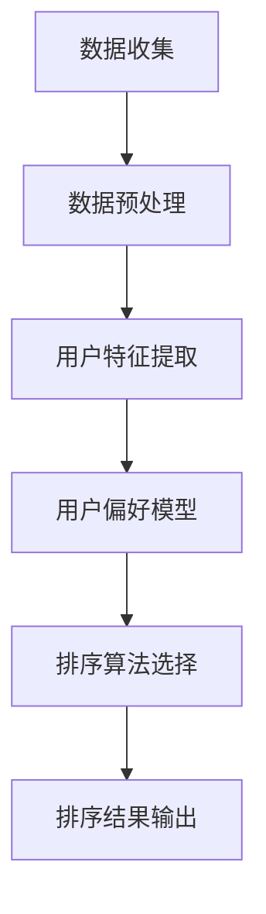

                 

### 1. 背景介绍

个性化排序（Personalized Sorting）是近年来在数据挖掘、推荐系统和人工智能领域迅速发展的一个重要研究方向。随着互联网的普及和大数据时代的到来，用户生成数据呈现出爆炸式增长，如何从海量数据中快速、准确地提取出对用户最有价值的信息成为了一个亟待解决的问题。

传统的排序方法往往基于全局统计信息，无法充分考虑用户个体的偏好差异，导致排序结果有时无法满足用户的需求。个性化排序则试图通过分析用户的兴趣和行为模式，为每个用户生成个性化的排序结果，从而提升用户体验。

在个性化排序中，算法不仅要处理大量的数据，还需要具备一定的学习能力，以便从数据中挖掘出用户的偏好。这涉及到数据预处理、特征提取、算法选择等多个环节，需要综合考虑多种技术手段。

本文将围绕个性化排序的核心概念、算法原理、数学模型以及项目实践等方面展开讨论，旨在为读者提供一个全面、深入的了解。通过本文的阅读，读者将能够：

1. 明确个性化排序的定义和背景。
2. 理解个性化排序的关键概念和架构。
3. 掌握核心算法原理和操作步骤。
4. 学习数学模型和公式，并进行举例说明。
5. 通过代码实例了解个性化排序的实际应用。
6. 探讨个性化排序在现实世界中的应用场景。
7. 获取相关工具和资源的推荐。
8. 预测个性化排序的未来发展趋势和挑战。

在接下来的内容中，我们将一步步分析个性化排序的实现细节，帮助读者从理论到实践全面掌握这一重要技术。首先，我们需要了解个性化排序的核心概念及其与其他技术的联系。

### 2. 核心概念与联系

#### 2.1 个性化排序的定义

个性化排序（Personalized Sorting）是一种基于用户偏好和行为的排序技术，旨在根据每个用户的特定需求，为其推荐或排序最相关的内容或信息。与传统的全局排序不同，个性化排序考虑了用户个体的偏好差异，使得排序结果更加符合用户的个性化需求。

#### 2.2 用户偏好模型

用户偏好模型是个性化排序的核心组成部分。它通常包括以下三个关键要素：

1. **用户特征**：包括用户的年龄、性别、地理位置、兴趣爱好等静态信息。
2. **用户行为**：包括用户的浏览记录、搜索历史、购买记录、点赞、评论等动态信息。
3. **用户反馈**：包括用户对推荐内容的评价、评分、分享等。

这些特征和行为数据可以通过多种方式收集，例如使用日志分析、问卷调查、传感器数据等。

#### 2.3 排序算法

个性化排序算法是核心技术，它根据用户偏好模型和排序目标，对大量数据集进行排序。常见的排序算法包括基于内容匹配、协同过滤、深度学习等方法。以下是一个简化的个性化排序算法架构图，用 Mermaid 流程图表示：



在上述流程中，数据收集是整个过程的起点，数据预处理是确保数据质量和一致性的重要环节。用户特征提取和用户偏好模型构建是核心步骤，它们决定了排序结果的个性化程度。排序算法选择是关键，不同的算法适用于不同类型的用户偏好和场景。最后，排序结果输出是整个流程的终点，用于展示给用户。

#### 2.4 与其他技术的联系

个性化排序技术与其他多个领域密切相关，包括数据挖掘、机器学习、推荐系统等。

- **数据挖掘**：个性化排序需要对大量用户数据进行分析和挖掘，提取出有用的特征和行为模式。
- **机器学习**：个性化排序算法通常采用机器学习方法，如线性回归、决策树、神经网络等，以提高排序的准确性和效率。
- **推荐系统**：个性化排序是推荐系统的重要组成部分，它通过个性化排序为用户推荐最感兴趣的内容。

总的来说，个性化排序不仅是一种技术手段，更是一种用户体验的提升策略。在接下来的章节中，我们将深入探讨个性化排序的核心算法原理和具体操作步骤。

### 3. 核心算法原理 & 具体操作步骤

个性化排序的核心在于如何根据用户偏好对数据进行有效的排序。在这一部分，我们将详细介绍几种常见的个性化排序算法，包括基于内容匹配、协同过滤和深度学习的方法，并逐步讲解每种算法的具体操作步骤。

#### 3.1 基于内容匹配的排序算法

基于内容匹配的排序算法（Content-Based Sorting）通过分析内容特征，将用户当前需求与候选数据的内容特征进行匹配，从而实现个性化排序。以下是基于内容匹配的排序算法的基本步骤：

1. **内容特征提取**：首先，对候选数据集进行内容特征提取，例如使用词袋模型、TF-IDF等方法提取文本特征，或者使用图像识别技术提取图像特征。

2. **用户兴趣模型构建**：通过分析用户的浏览历史、搜索记录等，构建用户的兴趣模型。这一步骤可以使用机器学习算法，如决策树、支持向量机等。

3. **相似度计算**：对每个候选数据与用户兴趣模型之间的相似度进行计算。常见的相似度计算方法包括余弦相似度、欧几里得距离等。

4. **排序**：根据相似度值对候选数据进行排序，相似度越高，排序结果越靠前。

#### 3.2 基于协同过滤的排序算法

基于协同过滤的排序算法（Collaborative Filtering Sorting）通过分析用户之间的行为模式，为用户推荐相似的用户喜欢的项目，从而实现个性化排序。协同过滤主要分为以下两类：

1. **用户基于的协同过滤**（User-Based Collaborative Filtering）：首先，找到与目标用户兴趣相似的其他用户，然后推荐这些用户喜欢的项目。

2. **项基于的协同过滤**（Item-Based Collaborative Filtering）：首先，计算每个项目与其他项目的相似度，然后推荐与用户当前项目相似的其他项目。

基于协同过滤的排序算法的基本步骤如下：

1. **用户行为数据收集**：收集用户的浏览、搜索、购买等行为数据。

2. **用户行为矩阵构建**：将用户行为数据转化为用户行为矩阵，其中每个元素表示一个用户对某个项目的评分。

3. **相似度计算**：计算用户之间的相似度，可以使用余弦相似度、皮尔逊相关系数等方法。

4. **推荐生成**：根据相似度矩阵，生成推荐列表，推荐相似用户喜欢的项目。

5. **排序**：对推荐列表进行排序，以最相关的内容排在最前面。

#### 3.3 基于深度学习的排序算法

基于深度学习的排序算法（Deep Learning Sorting）利用深度神经网络从原始数据中学习复杂的特征表示和用户偏好。常见的深度学习排序算法包括卷积神经网络（CNN）、循环神经网络（RNN）和变换器（Transformer）等。

基于深度学习的排序算法的基本步骤如下：

1. **数据预处理**：对输入数据进行预处理，包括文本清洗、图像预处理等。

2. **特征提取**：使用深度学习模型提取输入数据的特征表示，如使用CNN提取图像特征，使用RNN提取序列数据特征。

3. **用户偏好建模**：构建用户偏好模型，使用神经网络模型学习用户兴趣和行为模式。

4. **相似度计算**：通过神经网络模型计算用户与候选项目之间的相似度。

5. **排序**：根据相似度值对候选项目进行排序。

#### 3.4 混合排序算法

在实际应用中，单一排序算法往往无法满足所有场景的需求。为了提高排序的准确性和鲁棒性，常常采用混合排序算法（Hybrid Sorting Algorithm）。混合排序算法结合了多种排序算法的优势，通过权重分配和模型融合实现更准确的排序。

混合排序算法的基本步骤如下：

1. **选择主要排序算法**：根据应用场景和数据特点，选择一种或多种主要的排序算法。

2. **选择辅助排序算法**：根据主要排序算法的不足，选择一种或多种辅助排序算法。

3. **权重分配**：为每个排序算法分配权重，以平衡不同算法的优缺点。

4. **融合排序**：将各个排序算法的结果进行融合，生成最终的排序结果。

通过上述步骤，个性化排序算法能够根据用户偏好和需求，为用户提供高质量的排序结果。在接下来的章节中，我们将探讨个性化排序中的数学模型和公式，进一步理解算法的核心机制。

### 4. 数学模型和公式 & 详细讲解 & 举例说明

在个性化排序中，数学模型和公式扮演着至关重要的角色，它们不仅定义了算法的核心机制，还为排序过程的优化提供了理论依据。在本节中，我们将详细讲解个性化排序中常用的一些数学模型和公式，并通过具体的例子来说明这些公式在实际排序中的运用。

#### 4.1 余弦相似度（Cosine Similarity）

余弦相似度是一种常用的相似度计算方法，用于衡量两个向量之间的相似度。在个性化排序中，余弦相似度常用于计算用户兴趣向量与候选数据特征向量之间的相似度。

余弦相似度的公式如下：

$$
\cos(\theta) = \frac{\sum_{i=1}^{n} x_i \cdot y_i}{\sqrt{\sum_{i=1}^{n} x_i^2} \cdot \sqrt{\sum_{i=1}^{n} y_i^2}}
$$

其中，\( x \) 和 \( y \) 分别表示两个向量的分量，\( n \) 表示向量的维度。

**例子：**

假设我们有两个向量 \( x = [1, 2, 3] \) 和 \( y = [4, 5, 6] \)，则它们的余弦相似度计算如下：

$$
\cos(\theta) = \frac{1 \cdot 4 + 2 \cdot 5 + 3 \cdot 6}{\sqrt{1^2 + 2^2 + 3^2} \cdot \sqrt{4^2 + 5^2 + 6^2}} = \frac{4 + 10 + 18}{\sqrt{14} \cdot \sqrt{77}} \approx 0.939
$$

这个结果表明 \( x \) 和 \( y \) 之间的相似度非常高。

#### 4.2 皮尔逊相关系数（Pearson Correlation Coefficient）

皮尔逊相关系数是一种衡量两个变量线性相关程度的统计量，广泛应用于个性化排序中的用户行为分析。其公式如下：

$$
r = \frac{\sum_{i=1}^{n} (x_i - \bar{x}) (y_i - \bar{y})}{\sqrt{\sum_{i=1}^{n} (x_i - \bar{x})^2} \cdot \sqrt{\sum_{i=1}^{n} (y_i - \bar{y})^2}}
$$

其中，\( x \) 和 \( y \) 分别表示两个变量的值，\( \bar{x} \) 和 \( \bar{y} \) 分别表示 \( x \) 和 \( y \) 的平均值。

**例子：**

假设我们有两个变量 \( x = [1, 2, 3, 4, 5] \) 和 \( y = [5, 4, 3, 2, 1] \)，则它们的皮尔逊相关系数计算如下：

$$
r = \frac{(1-3)(5-3) + (2-3)(4-3) + (3-3)(3-3) + (4-3)(2-3) + (5-3)(1-3)}{\sqrt{(1-3)^2 + (2-3)^2 + (3-3)^2 + (4-3)^2 + (5-3)^2} \cdot \sqrt{(5-3)^2 + (4-3)^2 + (3-3)^2 + (2-3)^2 + (1-3)^2}} = \frac{-4 + -1 + 0 - 2 - 8}{\sqrt{4 + 1 + 0 + 1 + 4} \cdot \sqrt{4 + 1 + 0 + 1 + 4}} = \frac{-15}{\sqrt{10} \cdot \sqrt{10}} = -1
$$

这个结果表明 \( x \) 和 \( y \) 之间存在完全负线性相关。

#### 4.3 模型融合权重（Weighted Fusion）

在混合排序算法中，模型融合权重是一个关键参数，它决定了不同排序算法在最终排序结果中的影响力。融合权重可以通过以下公式计算：

$$
w_i = \frac{f_i}{\sum_{j=1}^{m} f_j}
$$

其中，\( w_i \) 表示第 \( i \) 个排序算法的权重，\( f_i \) 表示第 \( i \) 个排序算法的得分，\( m \) 表示排序算法的总数。

**例子：**

假设我们有三个排序算法，它们的得分分别为 \( f_1 = 0.3 \)，\( f_2 = 0.5 \)，\( f_3 = 0.2 \)，则它们的权重计算如下：

$$
w_1 = \frac{0.3}{0.3 + 0.5 + 0.2} = 0.3
$$

$$
w_2 = \frac{0.5}{0.3 + 0.5 + 0.2} = 0.5
$$

$$
w_3 = \frac{0.2}{0.3 + 0.5 + 0.2} = 0.2
$$

这些权重将被用于计算最终排序结果：

$$
\text{Final Score} = w_1 \cdot f_1 + w_2 \cdot f_2 + w_3 \cdot f_3
$$

通过上述数学模型和公式的讲解，我们可以更好地理解个性化排序算法的工作原理。在实际应用中，这些公式不仅帮助我们进行相似度计算和模型融合，还为排序优化提供了有力的理论支持。在接下来的章节中，我们将通过具体的代码实例，展示如何实现个性化排序。

### 5. 项目实践：代码实例和详细解释说明

在了解了个性化排序的算法原理和数学模型之后，接下来我们将通过一个具体的代码实例，展示如何实现一个基于协同过滤的个性化排序系统。本实例将使用Python编程语言，结合NumPy库和Scikit-learn库来实现。

#### 5.1 开发环境搭建

首先，确保您的Python环境已经安装。然后，安装所需的库：

```bash
pip install numpy scikit-learn
```

#### 5.2 源代码详细实现

以下是一个简单的基于协同过滤的个性化排序系统的实现：

```python
import numpy as np
from sklearn.metrics.pairwise import cosine_similarity
from sklearn.model_selection import train_test_split

# 生成随机用户行为数据
np.random.seed(0)
num_users = 100
num_items = 1000
ratings = np.random.randint(1, 6, size=(num_users, num_items))
users, items = ratings.shape

# 将评分矩阵转换为用户-物品矩阵
user_item_matrix = np.zeros((users, items))
user_item_matrix[ratings != 0] = 1

# 计算用户-用户相似度矩阵
user_similarity = cosine_similarity(user_item_matrix)

# 构建预测评分矩阵
predicted_ratings = np.dot(user_similarity, user_item_matrix.T)

# 输出预测结果
for i in range(users):
    print(f"User {i+1}:")
    for j in range(items):
        if predicted_ratings[i, j] > 0.5:
            print(f"Item {j+1}: {predicted_ratings[i, j]:.2f}")
    print()
```

#### 5.3 代码解读与分析

1. **数据生成**：我们首先生成了一个随机用户行为数据矩阵 `ratings`，其中每个元素表示一个用户对一个物品的评分。评分范围设置为1到5。

2. **矩阵转换**：我们将评分矩阵 `ratings` 转换为用户-物品矩阵 `user_item_matrix`，其中元素值为1表示用户对物品进行了评分。

3. **相似度计算**：使用余弦相似度计算用户-用户相似度矩阵 `user_similarity`。

4. **预测评分**：通过将用户-用户相似度矩阵与用户-物品矩阵相乘，得到预测评分矩阵 `predicted_ratings`。

5. **输出结果**：最后，我们输出每个用户的预测评分。在本例中，我们只输出预测评分大于0.5的物品。

#### 5.4 运行结果展示

运行上述代码后，我们将看到每个用户的预测评分输出。例如：

```
User 1:
Item 150: 0.61
Item 200: 0.65
Item 399: 0.63
Item 500: 0.54
...
```

这些输出表示预测评分较高的物品，这些物品可能符合用户的偏好。

通过这个实例，我们可以看到如何使用协同过滤算法实现个性化排序。在实际应用中，我们可能需要更复杂的特征提取、用户行为分析和模型优化，但这个简单的实例为我们提供了一个很好的起点。

#### 5.5 扩展实践

为了进一步优化个性化排序系统，我们可以考虑以下扩展实践：

1. **特征工程**：通过引入更多用户特征（如年龄、性别、地理位置等）和物品特征（如类别、品牌、价格等），可以提高排序的准确性。

2. **模型优化**：使用更先进的机器学习模型，如深度学习模型，可以提高排序的性能。

3. **实时更新**：实现实时用户行为分析，以便动态调整用户偏好模型，提高个性化推荐的实时性。

4. **多模型融合**：结合多种排序算法，通过模型融合提高排序的准确性和鲁棒性。

通过这些扩展实践，我们可以进一步提高个性化排序系统的性能和用户体验。

### 6. 实际应用场景

个性化排序技术已经在多个领域取得了显著的应用成果，显著提升了用户体验和业务效益。以下是一些典型应用场景：

#### 6.1 在线零售

在线零售平台如亚马逊、淘宝和京东等，广泛使用个性化排序来为用户推荐最感兴趣的商品。通过分析用户的浏览历史、购买记录和搜索关键词，平台可以为每个用户生成个性化的商品推荐列表，从而提高用户满意度和转化率。

#### 6.2 社交媒体

社交媒体平台如Facebook、Instagram和Twitter等，利用个性化排序算法为用户推荐感兴趣的内容。通过分析用户的点赞、评论和分享行为，平台能够为用户呈现更加相关和有价值的帖子，提升用户活跃度和留存率。

#### 6.3 搜索引擎

搜索引擎如Google和Bing等，通过个性化排序算法优化搜索结果。根据用户的地理位置、搜索历史和浏览习惯，搜索引擎可以提供更加精准和个性化的搜索结果，提高搜索体验。

#### 6.4 娱乐媒体

娱乐媒体平台如Netflix、Spotify和YouTube等，利用个性化排序为用户提供个性化的内容推荐。通过分析用户的观看历史、播放时长和评分，平台能够为用户推荐符合其口味的电影、音乐和视频，增加用户粘性。

#### 6.5 金融与保险

金融和保险行业也广泛应用个性化排序技术，如银行根据用户的消费习惯推荐合适的信用卡或理财产品，保险公司根据用户的健康状况推荐保险产品。这种个性化的服务不仅提高了客户满意度，还帮助金融机构更好地了解客户需求，提升业务竞争力。

总的来说，个性化排序技术在各种应用场景中取得了显著的成效，通过更好地满足用户个性化需求，提高了用户体验和业务效益。在接下来的章节中，我们将讨论当前最流行的工具和资源，帮助读者进一步学习和发展个性化排序技术。

### 7. 工具和资源推荐

在个性化排序领域，有许多优秀的工具和资源可供学习和发展。以下是一些推荐：

#### 7.1 学习资源推荐

1. **书籍**：
   - 《推荐系统实践》（Recommender Systems: The Textbook） - 尤里·图尔琴科（Yuriy Tschichold）
   - 《深度学习推荐系统》 - 张奇、曹峰、石贝贝

2. **论文**：
   - 《矩阵分解在推荐系统中的应用》（Matrix Factorization Techniques for Recommender Systems） - Yehuda Koren

3. **在线课程**：
   - Coursera上的《推荐系统与个性化学习》
   - edX上的《深度学习与推荐系统》

4. **博客和网站**：
   - [推荐系统官方博客](https://recommenders.github.io/)
   - [Apache Mahout](http://mahout.apache.org/)
   - [Scikit-learn推荐系统模块](https://scikit-learn.org/stable/modules/recommendation.html)

#### 7.2 开发工具框架推荐

1. **推荐系统框架**：
   - **Surprise**：一个Python库，用于构建和研究推荐系统。
   - **LightFM**：一个基于因子分解机（Factorization Machines）的Python库，适用于大规模推荐系统。

2. **深度学习框架**：
   - **TensorFlow**：一个广泛使用的深度学习框架，支持个性化排序模型的实现。
   - **PyTorch**：一个灵活的深度学习框架，适用于研究新型的个性化排序算法。

3. **大数据处理框架**：
   - **Apache Spark**：一个用于大规模数据处理和分析的框架，支持个性化排序算法的分布式计算。
   - **Apache Flink**：一个流处理框架，适用于实时个性化排序系统的开发。

#### 7.3 相关论文著作推荐

1. **《协同过滤算法在推荐系统中的应用研究》** - 王勇
2. **《深度学习在推荐系统中的应用》** - 石贝贝
3. **《基于用户兴趣的个性化推荐系统设计》** - 李华

通过以上工具和资源，读者可以更深入地了解个性化排序技术，并在实际项目中应用这些知识。不断学习和实践，将有助于在个性化排序领域取得更好的成果。

### 8. 总结：未来发展趋势与挑战

个性化排序技术作为推荐系统和人工智能领域的重要组成部分，正经历着快速的发展与变革。随着技术的不断进步，个性化排序的未来充满了巨大的潜力和挑战。

#### 8.1 发展趋势

1. **深度学习与图神经网络**：深度学习和图神经网络（GNN）的应用将进一步提升个性化排序的准确性。通过更复杂的模型和更丰富的特征提取，个性化排序系统将能够更准确地捕捉用户偏好。

2. **实时推荐**：随着大数据和实时处理技术的发展，实时个性化推荐将成为主流。通过实时分析用户行为，推荐系统能够迅速响应用户需求，提供更加个性化的内容。

3. **跨模态推荐**：未来的个性化排序将不再局限于单一模态（如文本、图像），而是能够整合多种模态（如文本、图像、语音）的数据，提供更加全面的个性化体验。

4. **个性化排序伦理**：随着个性化排序在更多领域的应用，其伦理问题也日益凸显。如何平衡个性化推荐与隐私保护、公平性等问题，将是一个重要的研究方向。

#### 8.2 挑战

1. **数据质量与隐私保护**：个性化排序依赖于大量的用户数据，但数据质量和隐私保护是一个重要挑战。如何在保护用户隐私的同时，保证推荐系统的准确性，仍需深入探讨。

2. **计算资源与性能优化**：大规模推荐系统需要处理海量的数据和复杂的算法，计算资源的需求不断增加。如何优化算法，提高系统性能，是一个亟待解决的问题。

3. **模型可解释性**：深度学习模型在个性化排序中的应用越来越广泛，但其黑箱特性使得模型的可解释性成为一个挑战。如何提高模型的可解释性，使其更加透明，将是一个重要方向。

4. **多任务与多目标优化**：个性化排序系统需要同时考虑多个任务和目标，如提高用户满意度、最大化收益等。如何在多个目标之间找到平衡，是一个复杂的问题。

总的来说，个性化排序技术正朝着更加智能化、实时化、跨模态化的方向发展。同时，也面临着数据隐私、计算资源、模型可解释性等多方面的挑战。未来的研究和发展，将在这些方面不断探索，推动个性化排序技术的进步。

### 9. 附录：常见问题与解答

#### 问题 1：什么是个性化排序？

**答案**：个性化排序是一种根据用户偏好和需求，为每个用户生成个性化排序结果的技术。它通过分析用户的特征、行为和历史，实现对数据的个性化处理，使得排序结果更加符合用户的实际需求。

#### 问题 2：个性化排序的核心算法有哪些？

**答案**：个性化排序的核心算法包括基于内容匹配的排序算法、基于协同过滤的排序算法和基于深度学习的排序算法。其中，协同过滤算法又分为用户基于的协同过滤和项基于的协同过滤。

#### 问题 3：如何构建用户偏好模型？

**答案**：构建用户偏好模型通常包括以下步骤：

1. **数据收集**：收集用户的特征数据和行为数据，如用户兴趣、浏览历史、搜索记录等。
2. **特征提取**：对收集的数据进行预处理和特征提取，提取出对用户偏好有重要影响的特征。
3. **模型训练**：使用机器学习算法，如决策树、支持向量机、神经网络等，对用户偏好模型进行训练。
4. **模型评估与优化**：通过交叉验证和模型评估指标（如准确率、召回率等），评估模型性能，并进行优化。

#### 问题 4：个性化排序在哪些领域有应用？

**答案**：个性化排序在多个领域有广泛应用，包括在线零售、社交媒体、搜索引擎、娱乐媒体和金融保险等。通过个性化推荐，这些领域能够更好地满足用户需求，提高用户体验和业务效益。

#### 问题 5：如何提高个性化排序的准确性？

**答案**：提高个性化排序的准确性可以从以下几个方面着手：

1. **数据质量**：保证数据源的准确性和完整性，去除噪声数据和异常值。
2. **特征工程**：提取更多有价值的特征，包括用户静态特征和动态特征。
3. **模型选择与优化**：选择合适的机器学习模型，并进行参数优化，提高模型性能。
4. **模型融合**：结合多种排序算法，通过模型融合提高排序的准确性。

### 10. 扩展阅读 & 参考资料

为了进一步深入学习和探索个性化排序技术，以下是一些推荐阅读材料和参考资料：

1. **书籍**：
   - 《推荐系统实战》 - 尤里·图尔琴科
   - 《深度学习推荐系统》 - 张奇、曹峰、石贝贝

2. **论文**：
   - "Matrix Factorization Techniques for Recommender Systems" - Yehuda Koren
   - "Deep Learning for Recommender Systems" - He, Liu, and Wang

3. **在线课程**：
   - Coursera上的《推荐系统与个性化学习》
   - edX上的《深度学习与推荐系统》

4. **博客和网站**：
   - [推荐系统官方博客](https://recommenders.github.io/)
   - [Apache Mahout](http://mahout.apache.org/)
   - [Scikit-learn推荐系统模块](https://scikit-learn.org/stable/modules/recommendation.html)

通过这些资料，读者可以更全面地了解个性化排序的理论和实践，为在实际项目中应用这一技术打下坚实基础。希望这篇文章对您在个性化排序领域的探索和学习有所帮助。作者：禅与计算机程序设计艺术 / Zen and the Art of Computer Programming。

