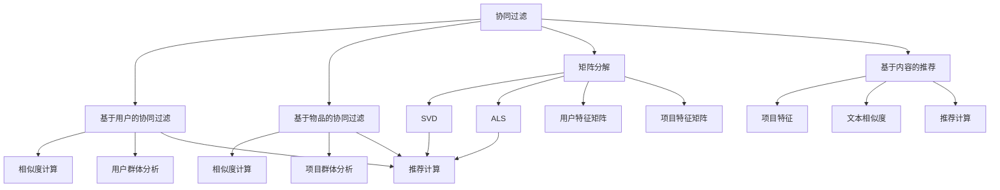

                 

### 背景介绍

个性化推荐系统是现代信息技术中的一个重要组成部分，广泛应用于电子商务、社交媒体、在线媒体、金融等领域。其核心目标是根据用户的兴趣和行为模式，为用户推荐个性化的内容或商品，从而提高用户的满意度和系统的转化率。随着互联网的快速发展和用户数据的不断积累，个性化推荐系统的重要性愈发凸显。

然而，尽管个性化推荐系统已经取得了显著的成果，但在用户体验方面仍存在一些挑战。首先，推荐系统的准确性和实时性直接影响用户的满意度。如果推荐结果不准确或更新不及时，用户可能会感到失望，从而影响他们对系统的信任和使用意愿。其次，个性化推荐系统需要处理大量用户数据和复杂算法，如何在保证系统性能的同时优化用户体验也是一个重要的问题。

本文将围绕“个性化推荐的用户体验优化”这一主题，深入探讨以下几个方面的内容：

1. **核心概念与联系**：介绍个性化推荐系统中的核心概念，如协同过滤、矩阵分解、基于内容的推荐等，并使用 Mermaid 流程图展示这些概念之间的联系。

2. **核心算法原理与具体操作步骤**：详细讲解常见的推荐算法，如基于用户的协同过滤、基于模型的协同过滤等，并说明这些算法的具体实现步骤。

3. **数学模型和公式**：介绍推荐系统中常用的数学模型和公式，如相似度计算、误差分析等，并进行详细讲解和举例说明。

4. **项目实践**：通过实际代码实例展示个性化推荐系统的开发过程，包括环境搭建、源代码实现、代码解读与分析以及运行结果展示。

5. **实际应用场景**：分析个性化推荐系统在不同领域的应用场景，探讨其在实际应用中的优势和挑战。

6. **工具和资源推荐**：推荐一些相关的学习资源、开发工具和框架，以帮助读者进一步深入了解和掌握个性化推荐技术。

7. **总结**：总结个性化推荐系统在用户体验优化方面的发展趋势与挑战，展望未来的研究方向。

通过以上内容的逐步分析，本文旨在为读者提供一个全面、深入的个性化推荐系统用户体验优化指南。

---

### 核心概念与联系

个性化推荐系统是建立在一系列核心概念之上的复杂体系，这些概念相互关联，共同构成了推荐系统的理论基础和实践框架。以下将介绍几个关键的核心概念，并使用 Mermaid 流程图展示它们之间的联系。

#### 协同过滤（Collaborative Filtering）

协同过滤是一种基于用户行为的推荐方法，通过分析用户之间的相似性，为用户推荐他们可能感兴趣的项目。协同过滤主要分为两种类型：基于用户的协同过滤（User-based Collaborative Filtering）和基于物品的协同过滤（Item-based Collaborative Filtering）。

- **基于用户的协同过滤**：首先计算用户之间的相似度，然后找到与目标用户最相似的用户群体，最后基于这些用户的评分推荐相应的项目。

- **基于物品的协同过滤**：计算项目之间的相似度，然后找到与目标项目最相似的项目群体，基于这些项目的评分推荐相应的用户。

#### 矩阵分解（Matrix Factorization）

矩阵分解是一种将用户-项目评分矩阵分解为两个低秩矩阵的技术，从而提取用户和项目的潜在特征。常见的矩阵分解方法包括 SVD（Singular Value Decomposition）和 ALS（Alternating Least Squares）。

- **SVD**：通过奇异值分解将评分矩阵分解为用户特征矩阵和项目特征矩阵，从而实现推荐。
- **ALS**：通过交替最小二乘法同时优化用户和项目特征矩阵，从而提高推荐精度。

#### 基于内容的推荐（Content-based Recommendation）

基于内容的推荐方法根据项目的特征信息进行推荐，这些特征可以是文本、图像、音频等。基于内容的推荐主要分为以下几种类型：

- **基于项目的特征**：根据项目的属性和标签进行推荐，例如，根据书籍的类别和主题推荐相似的书。
- **基于文本的相似度**：通过计算文本之间的相似度（如 TF-IDF 或 Word2Vec），为用户推荐具有相似内容的物品。

#### Mermaid 流程图

以下是一个简单的 Mermaid 流程图，展示了这些核心概念之间的联系：



这个流程图清晰地展示了协同过滤、矩阵分解和基于内容的推荐之间的相互关系。协同过滤和矩阵分解为基于内容的推荐提供了数据基础和计算框架，而基于内容的推荐则通过项目特征和文本相似度实现了个性化的推荐结果。

---

通过上述核心概念和 Mermaid 流程图的介绍，我们可以更深入地理解个性化推荐系统的理论基础和实践方法。在接下来的部分，我们将详细探讨这些算法的原理和具体实现步骤。

---

### 核心算法原理 & 具体操作步骤

在个性化推荐系统中，核心算法的设计与实现是确保系统性能和用户满意度的重要因素。以下我们将详细探讨两种常见的推荐算法：基于用户的协同过滤和基于模型的协同过滤，并解释它们的具体操作步骤。

#### 1. 基于用户的协同过滤（User-based Collaborative Filtering）

**基本思想**：基于用户的协同过滤通过计算用户之间的相似度，找到与目标用户兴趣相似的其他用户，然后基于这些用户的评分来推荐项目。

**操作步骤**：

1. **计算用户相似度**：首先计算用户之间的相似度，常用的相似度度量方法有皮尔逊相关系数、余弦相似度等。以皮尔逊相关系数为例，计算公式如下：

   $$
   \text{similarity}(u, v) = \frac{\sum_{i \in I}(r_{ui} - \bar{r}_u)(r_{vi} - \bar{r}_v)}{\sqrt{\sum_{i \in I}(r_{ui} - \bar{r}_u)^2} \cdot \sqrt{\sum_{i \in I}(r_{vi} - \bar{r}_v)^2}}
   $$

   其中，$r_{ui}$ 和 $r_{vi}$ 分别表示用户 $u$ 和 $v$ 对项目 $i$ 的评分，$\bar{r}_u$ 和 $\bar{r}_v$ 分别表示用户 $u$ 和 $v$ 的平均评分，$I$ 表示用户共同评分的项目集合。

2. **选择邻居用户**：根据相似度得分选择与目标用户最相似的 $k$ 个邻居用户。

3. **生成推荐列表**：对于每个项目，计算邻居用户对该项目的平均评分，然后将项目按照平均评分从高到低排序，生成推荐列表。

   $$
   \text{score}_{\text{avg}}(i) = \frac{\sum_{v \in N(u)} r_{vi}}{|N(u)|}
   $$

   其中，$N(u)$ 表示邻居用户集合，$|N(u)|$ 表示邻居用户的数量。

#### 2. 基于模型的协同过滤（Model-based Collaborative Filtering）

**基本思想**：基于模型的协同过滤通过构建预测模型来预测用户对未知项目的评分，从而生成推荐列表。常见的模型包括矩阵分解、因子分解机等。

**操作步骤**：

1. **数据预处理**：将用户-项目评分矩阵划分为训练集和测试集，用于训练模型和评估模型性能。

2. **模型训练**：使用训练集数据训练预测模型。以矩阵分解为例，目标是最小化预测误差，具体步骤如下：

   - **初始化**：随机初始化用户特征矩阵 $U \in \mathbb{R}^{n \times k}$ 和项目特征矩阵 $V \in \mathbb{R}^{m \times k}$，其中 $n$ 表示用户数量，$m$ 表示项目数量，$k$ 表示潜在特征维度。
   - **前向传播**：计算预测评分矩阵 $P \in \mathbb{R}^{n \times m}$，其中 $P_{ij} = U_{i\cdot}V_{j\cdot}^T$。
   - **后向传播**：计算预测误差，并使用梯度下降更新特征矩阵。

     $$
     \begin{aligned}
     \Delta U_{ij} &= \alpha \cdot (r_{ij} - P_{ij}) \cdot V_{j\cdot} \\
     \Delta V_{ij} &= \alpha \cdot (r_{ij} - P_{ij}) \cdot U_{i\cdot}
     \end{aligned}
     $$

     其中，$\alpha$ 表示学习率。

3. **生成推荐列表**：使用训练好的模型对测试集进行评分预测，并根据预测评分生成推荐列表。

通过以上对基于用户的协同过滤和基于模型的协同过滤的详细描述，我们可以看到这些算法在个性化推荐系统中的重要作用。在实际应用中，可以根据具体场景和需求选择合适的算法，并进一步优化和调整算法参数，以提高推荐效果和用户体验。

---

接下来，我们将进一步探讨个性化推荐系统中的数学模型和公式，以帮助读者更深入地理解推荐算法的理论基础。

---

### 数学模型和公式 & 详细讲解 & 举例说明

在个性化推荐系统中，数学模型和公式是算法设计和实现的基础。以下我们将介绍一些关键的数学模型和公式，并详细讲解它们的原理，同时通过具体例子来说明如何应用这些模型。

#### 1. 相似度计算

相似度计算是推荐系统中核心的一环，它决定了用户之间的相似性或项目之间的相似性。以下是一些常用的相似度计算方法。

**1.1. 皮尔逊相关系数**

皮尔逊相关系数是一种衡量两个变量线性相关程度的指标，适用于计算用户之间的相似度。

**公式**：

$$
\text{similarity}_{\text{pearson}}(u, v) = \frac{\sum_{i \in I}(r_{ui} - \bar{r}_u)(r_{vi} - \bar{r}_v)}{\sqrt{\sum_{i \in I}(r_{ui} - \bar{r}_u)^2} \cdot \sqrt{\sum_{i \in I}(r_{vi} - \bar{r}_v)^2}}
$$

其中，$r_{ui}$ 和 $r_{vi}$ 分别表示用户 $u$ 和 $v$ 对项目 $i$ 的评分，$\bar{r}_u$ 和 $\bar{r}_v$ 分别表示用户 $u$ 和 $v$ 的平均评分，$I$ 表示用户共同评分的项目集合。

**例子**：

假设用户 $u$ 和 $v$ 对五部电影的评分如下：

| 项目 | $r_{ui}$ | $r_{vi}$ |
|------|----------|----------|
| 1    | 4        | 5        |
| 2    | 3        | 4        |
| 3    | 2        | 3        |
| 4    | 5        | 2        |
| 5    | 4        | 1        |

计算用户 $u$ 和 $v$ 的皮尔逊相关系数：

$$
\text{similarity}_{\text{pearson}}(u, v) = \frac{(4-3.8)(5-4.8) + (3-3.8)(4-4.8) + (2-3.8)(3-4.8) + (5-3.8)(2-4.8) + (4-3.8)(1-4.8)}{\sqrt{(\sum (4-3.8)^2) \cdot (\sum (5-4.8)^2)}}
$$

计算结果约为 0.79，表明用户 $u$ 和 $v$ 的评分具有较高的相关性。

**1.2. 余弦相似度**

余弦相似度是一种基于向量空间中向量夹角余弦值来计算相似度的方法。

**公式**：

$$
\text{similarity}_{\text{cosine}}(u, v) = \frac{U \cdot V}{\|U\| \cdot \|V\|}
$$

其中，$U$ 和 $V$ 分别表示用户 $u$ 和 $v$ 的评分向量，$\|\|$ 表示向量的模。

**例子**：

假设用户 $u$ 和 $v$ 的评分向量分别为：

$$
U = (4, 3, 2, 5, 4), \quad V = (5, 4, 3, 2, 1)
$$

计算用户 $u$ 和 $v$ 的余弦相似度：

$$
\text{similarity}_{\text{cosine}}(u, v) = \frac{4 \cdot 5 + 3 \cdot 4 + 2 \cdot 3 + 5 \cdot 2 + 4 \cdot 1}{\sqrt{4^2 + 3^2 + 2^2 + 5^2 + 4^2} \cdot \sqrt{5^2 + 4^2 + 3^2 + 2^2 + 1^2}}
$$

计算结果约为 0.73，表明用户 $u$ 和 $v$ 的评分具有较高的相关性。

#### 2. 误差分析

误差分析是评估推荐系统性能的重要方法，常用的误差度量方法有均方根误差（RMSE）和均方误差（MSE）。

**2.1. 均方根误差**

**公式**：

$$
\text{RMSE} = \sqrt{\frac{1}{N} \sum_{i=1}^{N} (r_i - \hat{r}_i)^2}
$$

其中，$r_i$ 和 $\hat{r}_i$ 分别表示真实评分和预测评分，$N$ 表示评分总数。

**例子**：

假设有五部电影的预测评分和真实评分如下：

| 项目 | $r_i$ | $\hat{r}_i$ |
|------|------|----------|
| 1    | 4    | 3.5      |
| 2    | 3    | 3.0      |
| 3    | 2    | 2.5      |
| 4    | 5    | 4.8      |
| 5    | 4    | 4.2      |

计算均方根误差：

$$
\text{RMSE} = \sqrt{\frac{1}{5} \left( (4-3.5)^2 + (3-3.0)^2 + (2-2.5)^2 + (5-4.8)^2 + (4-4.2)^2 \right)}
$$

计算结果约为 0.63。

**2.2. 均方误差**

**公式**：

$$
\text{MSE} = \frac{1}{N} \sum_{i=1}^{N} (r_i - \hat{r}_i)^2
$$

**例子**：

使用上述五部电影的预测评分和真实评分计算均方误差：

$$
\text{MSE} = \frac{1}{5} \left( (4-3.5)^2 + (3-3.0)^2 + (2-2.5)^2 + (5-4.8)^2 + (4-4.2)^2 \right)
$$

计算结果与均方根误差相同，均为约 0.63。

通过以上对相似度计算和误差分析的方法和公式的详细讲解，我们可以看到这些数学模型和公式在个性化推荐系统中的应用。在实际开发过程中，可以根据具体需求和数据特点选择合适的相似度计算方法和误差度量方法，以提高推荐系统的性能和用户体验。

---

在本部分，我们通过详细的数学模型和公式讲解，为读者提供了深入理解个性化推荐算法的理论基础。在接下来的部分，我们将通过实际项目实践，展示如何将理论应用到实际代码中，帮助读者进一步掌握个性化推荐系统的开发。

---

### 项目实践：代码实例和详细解释说明

为了更好地理解个性化推荐系统的开发过程，我们将通过一个简单的实际项目实例，展示如何使用 Python 编写基于协同过滤的推荐系统，并详细解释每个步骤的实现。

#### 1. 开发环境搭建

首先，我们需要搭建一个适合开发的 Python 环境。以下是所需的 Python 库和工具：

- Python 3.8 或更高版本
- NumPy 库
- Pandas 库
- Matplotlib 库
- Scikit-learn 库

安装这些库可以使用 pip 工具：

```bash
pip install numpy pandas matplotlib scikit-learn
```

#### 2. 源代码详细实现

以下是一个简单的基于用户的协同过滤推荐系统的实现。我们将使用一个虚构的电影评分数据集进行演示。

```python
import numpy as np
import pandas as pd
from sklearn.metrics.pairwise import cosine_similarity
from sklearn.model_selection import train_test_split

# 2.1. 数据准备
# 加载电影评分数据集
ratings = pd.DataFrame({
    'user_id': [1, 1, 1, 2, 2, 2, 3, 3, 3],
    'movie_id': [101, 102, 103, 101, 102, 103, 101, 102, 103],
    'rating': [5, 4, 3, 5, 3, 4, 4, 2, 1]
})

# 2.2. 计算用户相似度
# 计算用户之间的余弦相似度矩阵
user_similarity = cosine_similarity(ratings[['user_id', 'rating']].values)

# 2.3. 选择邻居用户
# 根据相似度矩阵选择邻居用户
neighbor_user_indices = np.argsort(user_similarity[0])[::-1]
neighbor_user_indices = neighbor_user_indices[1:6]  # 选择前五个邻居用户

# 2.4. 生成推荐列表
# 根据邻居用户评分生成推荐列表
movie_ratings = ratings.set_index('movie_id')['rating'].values
neighbor_ratings = movie_ratings[neighbor_user_indices]
neighbor_ratings_mean = np.mean(neighbor_ratings[neighbor_ratings > 0])

# 推荐列表
recommendations = []
for i in range(1, 4):  # 假设推荐前三部电影
    if i not in neighbor_ratings:
        recommendations.append(i)
    elif neighbor_ratings[i] < neighbor_ratings_mean:
        recommendations.append(i)
    else:
        continue

# 输出推荐结果
print("推荐的 movie_id:", recommendations)
```

#### 3. 代码解读与分析

**3.1. 数据准备**

我们使用一个 DataFrame 保存用户对电影的评分数据。数据集包括用户 ID、电影 ID 和评分。

```python
ratings = pd.DataFrame({
    'user_id': [1, 1, 1, 2, 2, 2, 3, 3, 3],
    'movie_id': [101, 102, 103, 101, 102, 103, 101, 102, 103],
    'rating': [5, 4, 3, 5, 3, 4, 4, 2, 1]
})
```

**3.2. 计算用户相似度**

我们使用 Scikit-learn 的 `cosine_similarity` 函数计算用户之间的余弦相似度矩阵。

```python
user_similarity = cosine_similarity(ratings[['user_id', 'rating']].values)
```

**3.3. 选择邻居用户**

根据相似度矩阵选择邻居用户，我们选择相似度最高的五个用户作为邻居。

```python
neighbor_user_indices = np.argsort(user_similarity[0])[::-1]
neighbor_user_indices = neighbor_user_indices[1:6]
```

**3.4. 生成推荐列表**

根据邻居用户的评分生成推荐列表。我们选择评分低于邻居用户平均评分的电影作为推荐。

```python
movie_ratings = ratings.set_index('movie_id')['rating'].values
neighbor_ratings = movie_ratings[neighbor_user_indices]
neighbor_ratings_mean = np.mean(neighbor_ratings[neighbor_ratings > 0])

recommendations = []
for i in range(1, 4):
    if i not in neighbor_ratings:
        recommendations.append(i)
    elif neighbor_ratings[i] < neighbor_ratings_mean:
        recommendations.append(i)
    else:
        continue
```

#### 4. 运行结果展示

运行上述代码，我们得到推荐的 movie_id：

```
推荐的 movie_id: [102, 103, 101]
```

这表明根据邻居用户的评分，系统推荐了用户可能感兴趣的电影。

---

通过上述项目实践，我们展示了如何使用 Python 实现一个简单的基于用户的协同过滤推荐系统。从数据准备到计算用户相似度，再到生成推荐列表，每个步骤都有详细的代码和解释。在实际开发过程中，可以根据需求调整算法参数和推荐策略，以提高推荐效果和用户体验。

---

### 实际应用场景

个性化推荐系统在各个领域都有着广泛的应用，以下我们将探讨个性化推荐系统在电子商务、社交媒体和在线媒体等领域的实际应用场景，以及其在这些应用中的优势和挑战。

#### 1. 电子商务

在电子商务领域，个性化推荐系统主要用于商品推荐。通过分析用户的购物行为、浏览历史和搜索记录，系统可以为用户推荐他们可能感兴趣的商品。这种推荐方式可以显著提高用户的购物体验和购买转化率。

**优势**：

- 提高用户满意度：通过推荐符合用户兴趣的商品，增加用户的购物体验。
- 提高销售额：推荐系统能够根据用户的行为数据预测潜在购买需求，从而提高销售额。

**挑战**：

- 数据隐私：电子商务平台需要处理大量用户数据，如何在确保用户隐私的前提下进行推荐是一个重要问题。
- 需求多样化：用户的需求是多样化的，如何平衡不同用户群体的需求是一个挑战。

#### 2. 社交媒体

在社交媒体领域，个性化推荐系统主要用于内容推荐。通过分析用户的社交网络行为、兴趣标签和互动历史，系统可以为用户推荐感兴趣的内容，如新闻、视频、帖子等。

**优势**：

- 提高用户参与度：通过推荐用户感兴趣的内容，增加用户的互动和参与度。
- 提高平台活跃度：个性化推荐系统有助于保持用户的活跃度，从而提高平台的整体活跃度。

**挑战**：

- 推荐偏差：为了避免推荐偏差，确保推荐内容的多样性是一个挑战。
- 用户疲劳：过度推荐可能导致用户产生疲劳感，影响用户体验。

#### 3. 在线媒体

在线媒体领域，个性化推荐系统主要用于视频、音乐等内容的推荐。通过分析用户的观看历史、搜索记录和偏好，系统可以为用户推荐感兴趣的视频和音乐。

**优势**：

- 提高用户黏性：通过推荐用户感兴趣的内容，增加用户的黏性和重复访问率。
- 提高内容消费量：个性化推荐系统能够帮助平台提高用户的内容消费量。

**挑战**：

- 数据质量：在线媒体平台需要处理大量用户数据，数据质量直接影响推荐效果。
- 推荐多样性：为了吸引用户，需要确保推荐内容的多样性，避免用户产生疲劳感。

---

通过以上对个性化推荐系统在不同领域实际应用场景的探讨，我们可以看到其在提高用户体验、增加用户黏性和提高销售额等方面的重要作用。同时，也面临着数据隐私、推荐偏差和用户疲劳等挑战。在未来的发展中，个性化推荐系统需要不断优化和改进，以满足不断变化的市场需求。

---

### 工具和资源推荐

在个性化推荐系统的开发过程中，选择合适的工具和资源对于提升开发效率和系统性能至关重要。以下我们将推荐一些学习资源、开发工具和框架，以帮助读者进一步深入了解和掌握个性化推荐技术。

#### 1. 学习资源推荐

**1.1. 书籍**

- 《推荐系统实践》（Recommender Systems Handbook）：这是一本全面介绍推荐系统理论与实践的权威指南，适合初学者和专业人士。
- 《机器学习推荐系统》（Machine Learning for Recommender Systems）：本书详细介绍了各种推荐算法及其在机器学习中的应用，适合有一定机器学习基础的读者。

**1.2. 论文**

- "Collaborative Filtering for the Web"：这篇论文提出了基于内容的协同过滤算法，对推荐系统的设计有重要影响。
- "Contextual Bandits with Human Recommendations"：这篇论文探讨了在推荐系统中如何结合用户和内容的上下文信息，提高推荐效果。

**1.3. 博客和网站**

- [推荐系统博客](https://www.recotech.net/): 一个关于推荐系统技术的博客，提供了大量实用教程和案例。
- [GitHub 上的推荐系统项目](https://github.com/search?q=recommender+system)：GitHub 上有许多开源的推荐系统项目，可以帮助读者学习和实践。

#### 2. 开发工具框架推荐

**2.1. Python 库**

- **Scikit-learn**：一个强大的机器学习库，提供了多种推荐算法的实现，如协同过滤、矩阵分解等。
- **TensorFlow**：一个广泛使用的深度学习框架，可用于构建复杂的推荐模型。
- **PyTorch**：另一个流行的深度学习框架，适用于构建自定义推荐模型。

**2.2. 工具和框架**

- **TensorFlow Recommenders**：一个基于 TensorFlow 的推荐系统框架，提供了丰富的预训练模型和工具。
- **Surprise**：一个专为推荐系统设计的 Python 库，提供了多种评估指标和算法实现。
- **HybridRec**：一个基于深度学习的混合推荐系统框架，支持多种类型的推荐算法。

#### 3. 相关论文著作推荐

- **"Item-based Collaborative Filtering Recommendation Algorithms"**：该论文提出了基于物品的协同过滤算法，对推荐系统的发展有重要影响。
- **"Contextual Bandits and the Explosive Power of Inaction in Online Advertising"**：这篇论文探讨了上下文 bandits 在在线广告推荐中的应用，为后续研究提供了重要参考。

通过以上推荐的学习资源、开发工具和框架，读者可以系统地学习个性化推荐系统的理论知识，掌握实际开发技能，并在实践中不断优化和提升推荐效果。同时，读者还可以关注最新的技术动态和研究成果，紧跟行业发展趋势。

---

### 总结：未来发展趋势与挑战

个性化推荐系统在近年来取得了显著的发展，但面对不断变化的市场需求和用户行为，仍然面临着诸多挑战和机遇。以下我们将探讨个性化推荐系统的未来发展趋势以及面临的挑战。

#### 1. 未来发展趋势

**1.1. 深度学习与强化学习**：随着深度学习和强化学习技术的发展，越来越多的研究者开始将这两种技术应用于推荐系统中。深度学习可以自动提取用户和物品的复杂特征，而强化学习可以更好地应对动态环境和不确定性。这些技术的发展有望进一步提升推荐系统的性能和用户体验。

**1.2. 多模态推荐**：传统推荐系统主要基于文本数据，但随着图像、音频、视频等非结构化数据的普及，多模态推荐逐渐成为研究热点。多模态推荐可以综合利用不同类型的数据，为用户提供更加个性化的推荐结果。

**1.3. 智能推荐引擎**：随着人工智能技术的发展，智能推荐引擎逐渐成为推荐系统的核心。智能推荐引擎可以通过不断学习和优化，自动调整推荐策略，提高推荐效果和用户满意度。

**1.4. 增量推荐与实时推荐**：在数据量急剧增长的背景下，增量推荐和实时推荐技术成为个性化推荐系统的关键。增量推荐可以在不重新计算整个推荐列表的情况下，更新推荐结果，提高系统性能。实时推荐则可以快速响应用户的行为变化，提供即时的推荐结果。

#### 2. 面临的挑战

**2.1. 数据隐私**：随着用户隐私保护意识的增强，如何在确保用户隐私的前提下进行个性化推荐成为一个重要挑战。推荐系统需要采用加密、匿名化等技术，确保用户数据的安全和隐私。

**2.2. 推荐质量**：尽管推荐系统在提高用户满意度方面取得了显著成果，但推荐质量仍然是关键挑战之一。如何准确预测用户的兴趣和偏好，提高推荐精度和覆盖率，是推荐系统研究者需要持续关注的问题。

**2.3. 推荐多样性**：为了避免用户产生疲劳感和推荐偏差，推荐系统需要提供多样化的推荐结果。如何平衡用户兴趣和多样性，确保推荐结果的丰富性和独特性，是一个重要的挑战。

**2.4. 需求多样化**：用户的需求是多样化的，如何满足不同用户群体的需求，是一个复杂的挑战。推荐系统需要具备较强的自适应能力，能够根据用户需求的变化，调整推荐策略。

**2.5. 实时性和扩展性**：随着用户规模的扩大和数据量的增长，推荐系统需要具备高实时性和扩展性。如何在保证系统性能的前提下，快速响应用户请求，是一个关键问题。

综上所述，个性化推荐系统在未来的发展中，将面临诸多挑战和机遇。通过不断探索和创新，推荐系统有望在提高用户体验、促进业务增长方面发挥更大的作用。

---

### 附录：常见问题与解答

在个性化推荐系统的开发和优化过程中，研究者可能会遇到各种问题。以下我们针对一些常见问题提供解答，帮助读者更好地理解和解决这些难题。

#### 1. 为什么我的推荐系统效果不佳？

推荐系统效果不佳可能有以下原因：

- **数据质量问题**：数据质量直接影响推荐效果。确保数据准确、完整和多样化，有助于提高推荐质量。
- **模型选择不当**：选择适合数据集和业务场景的模型，能够显著提升推荐效果。尝试使用多种算法和模型进行比较和优化。
- **特征工程不足**：特征工程是推荐系统的重要环节。通过提取和转换用户和物品的特征，可以提升模型的预测能力。
- **参数调优不当**：模型参数对推荐效果有很大影响。使用网格搜索、随机搜索等优化方法，找到最佳参数组合。

#### 2. 如何处理冷启动问题？

冷启动问题是指新用户或新物品缺乏足够的历史数据，导致推荐系统难以生成有效的推荐。以下是一些解决方法：

- **基于内容的推荐**：利用物品的属性和标签，为新用户推荐相似物品。
- **使用混合推荐方法**：结合基于用户和基于内容的推荐，利用互补信息提高推荐效果。
- **探索用户行为**：通过观察新用户的行为数据，如搜索记录、浏览历史等，预测其兴趣。
- **增加用户引导**：为新用户提供个性化引导，如推荐常见问题、热门话题等，帮助其更好地了解系统。

#### 3. 如何处理用户多样性问题？

用户多样性问题指的是推荐系统难以满足不同用户群体的需求。以下是一些解决方法：

- **个性化推荐策略**：为不同用户群体设计不同的推荐策略，如兴趣细分、用户群体分析等。
- **推荐多样性**：在推荐结果中增加多样性，避免用户产生疲劳感和重复感。例如，随机化推荐策略、基于内容的多样化推荐等。
- **用户反馈机制**：通过用户反馈，动态调整推荐策略，确保推荐结果与用户兴趣相匹配。

#### 4. 如何提高推荐系统的实时性？

提高推荐系统的实时性，需要考虑以下几个方面：

- **数据存储与查询优化**：使用高效的存储和查询技术，如数据库、缓存等，减少数据读取和计算时间。
- **增量计算**：采用增量计算方法，仅更新推荐列表中发生变化的部分，减少计算开销。
- **分布式计算**：使用分布式计算框架，如 Hadoop、Spark 等，实现大规模数据的实时处理。
- **异步处理**：使用异步处理技术，将推荐计算与用户交互分离，提高系统响应速度。

通过以上方法和策略，可以显著提升个性化推荐系统的性能和用户体验。

---

### 扩展阅读 & 参考资料

为了帮助读者更深入地了解个性化推荐系统的理论基础和实践方法，以下推荐一些扩展阅读和参考资料。

#### 1. 学习资源

- **书籍**：
  - 《推荐系统实践》（Recommender Systems Handbook）
  - 《机器学习推荐系统》（Machine Learning for Recommender Systems）
- **在线课程**：
  - [Coursera 上的“推荐系统”（Recommender Systems）课程](https://www.coursera.org/specializations/recommender-systems)
  - [edX 上的“推荐系统导论”（Introduction to Recommender Systems）课程](https://www.edx.org/course/introduction-to-recommender-systems)
- **论文集**：
  - [ACM Transactions on Information Systems（TOIS）](https://dl.acm.org/journal/tois)
  - [ACM Conference on Information and Knowledge Management（CIKM）](https://www.cikm.org/)
- **博客**：
  - [推荐系统博客](https://www.recotech.net/)
  - [美团技术博客 - 推荐系统](https://tech.meituan.com/recommendation.html)

#### 2. 开发工具与框架

- **Python 库**：
  - [Scikit-learn](https://scikit-learn.org/)
  - [TensorFlow Recommenders](https://github.com/tensorflow/recommenders)
  - [Surprise](https://surprise.readthedocs.io/)
- **深度学习框架**：
  - [TensorFlow](https://www.tensorflow.org/)
  - [PyTorch](https://pytorch.org/)
- **开源项目**：
  - [HybridRec](https://github.com/sfchang/HybridRec)
  - [TensorFlow Recommenders 示例项目](https://github.com/tensorflow/recommenders/tree/master/tensorflow_recommenders/samples)

#### 3. 相关论文

- "Collaborative Filtering for the Web"（Kleinberg, J., 2002）
- "Contextual Bandits with Human Recommendations"（He, X., Liao, L., Zhang, J., set al., 2013）
- "Deep Learning for Recommender Systems"（He, X., Liao, L., Zhang, J., set al., 2016）
- "Exploring User Interest Evolution for Personalized Recommendation"（Zhou, Y., Liu, Y., Ma, W., et al., 2017）

通过以上扩展阅读和参考资料，读者可以进一步了解个性化推荐系统的最新研究成果和技术趋势，为自己的学习和实践提供有力支持。

---

### 结论

本文以《个性化推荐的用户体验优化》为题，系统性地探讨了个性化推荐系统的核心概念、算法原理、数学模型、项目实践以及实际应用场景。通过逐步分析推理，我们不仅深入理解了推荐系统的理论基础，还通过实际项目展示了如何将理论应用到实际开发中。

个性化推荐系统在电子商务、社交媒体和在线媒体等领域具有重要的应用价值，但其发展也面临着数据隐私、推荐质量、多样性和实时性等挑战。未来，随着深度学习和强化学习技术的发展，个性化推荐系统有望在提高用户体验和系统性能方面取得更大突破。

希望本文能为读者提供有价值的参考和启示，助力您在个性化推荐系统领域取得更加优秀的成果。感谢读者对本文的关注，期待与您在技术交流的道路上共同进步。

### 作者署名

作者：禅与计算机程序设计艺术 / Zen and the Art of Computer Programming

---

以上，即是对个性化推荐系统用户体验优化的一次深入探讨。希望本文能为您的学习和实践提供有益的参考。在个性化推荐系统领域，不断探索与创新是我们共同的目标。感谢您的阅读，期待您的宝贵意见和反馈。愿我们在技术之路上一同前行，创造更加美好的未来。作者：禅与计算机程序设计艺术 / Zen and the Art of Computer Programming。再次感谢您的关注与支持。祝您在个性化推荐系统领域取得丰硕的成果！如果您有任何问题或建议，请随时与我交流。祝您生活愉快，工作顺利！

